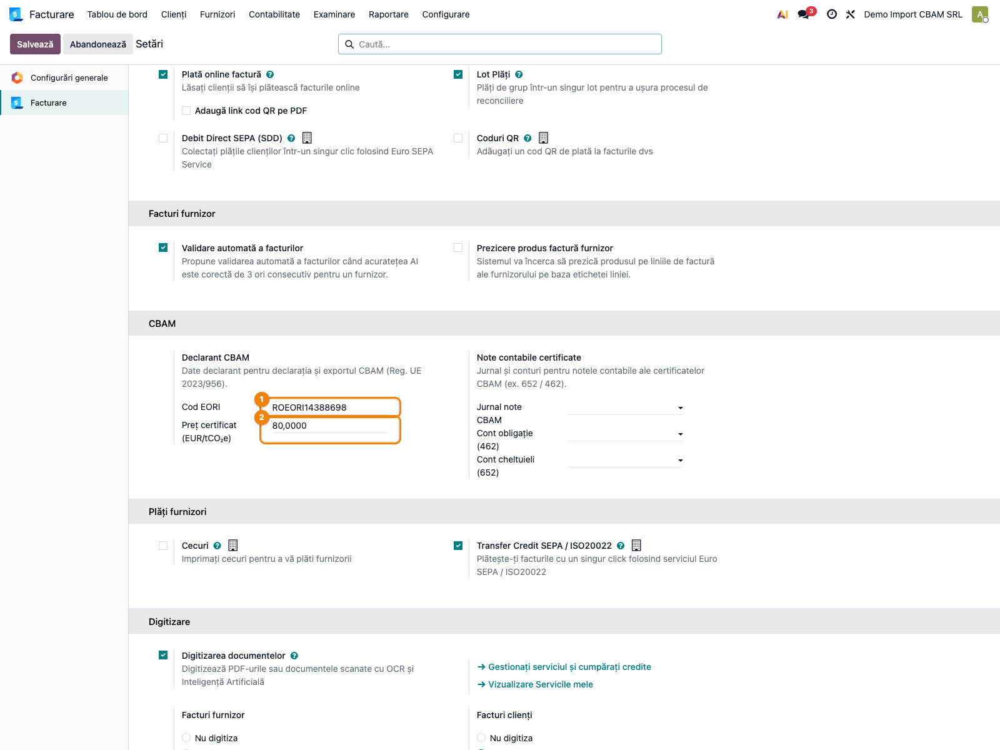
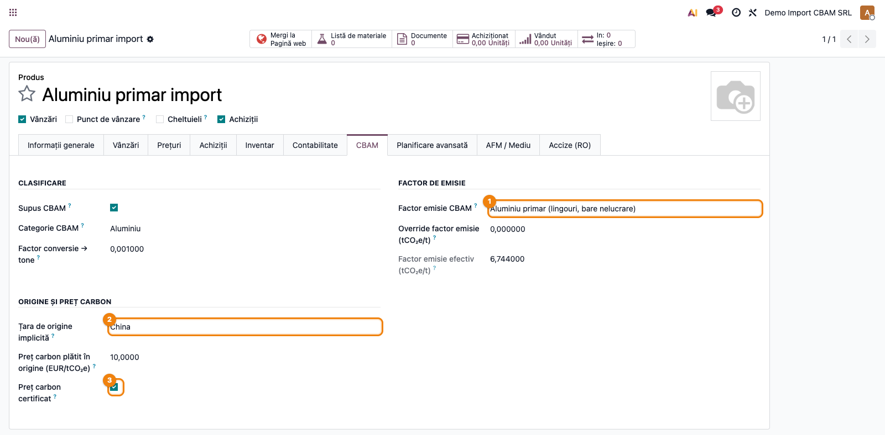
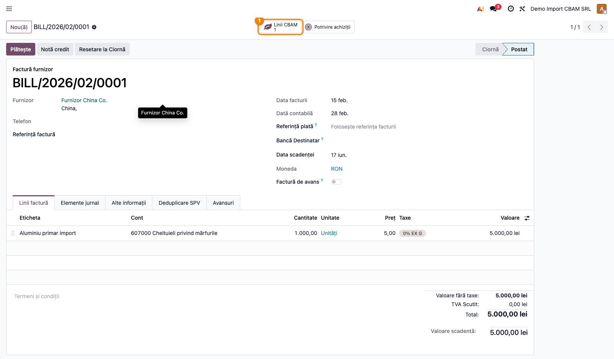
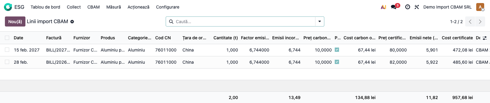
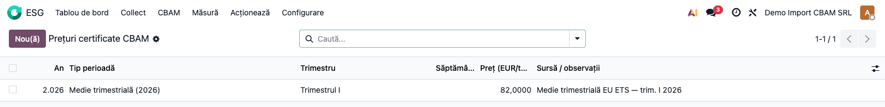
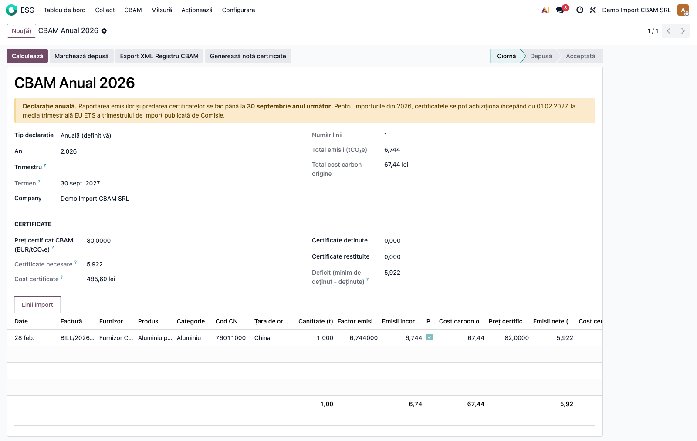
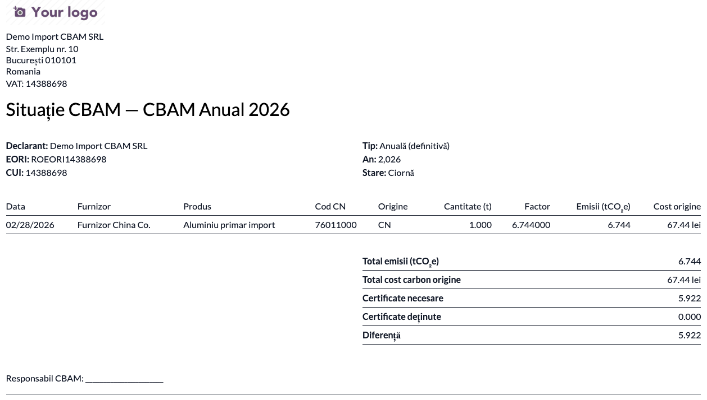
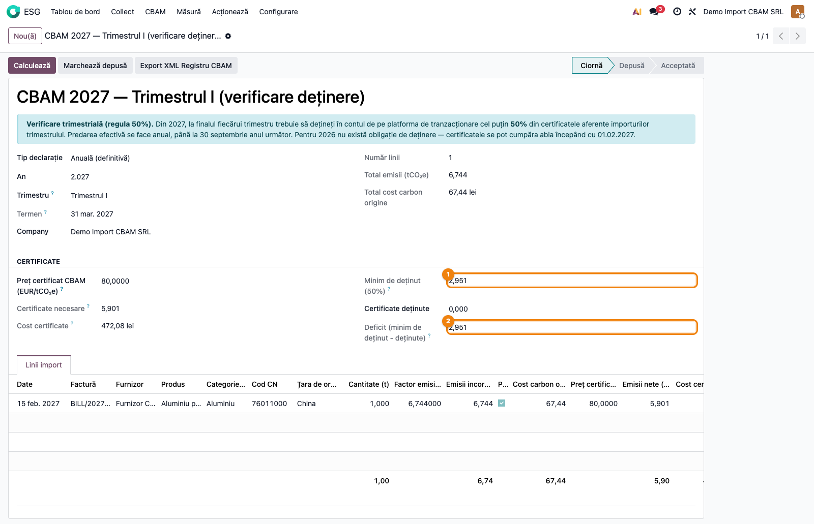

# Fișă Modul: CBAM — Mecanismul de Ajustare a Carbonului la Frontieră

**Poziție plan:** C18
**Modul:** `l10n_ro_cbam`
**FR:** FR-56
**Capitol manual:** Cap 12.12
**Utilizator principal:** Responsabil CBAM, Contabil import, Responsabil mediu/ESG
**Prioritate:** Ridicată (obligatoriu în regim definitiv de la 01.01.2026)

---

## 1. Scop business

Modulul aduce în Odoo obligația CBAM: declararea emisiilor de CO₂ incorporate în produsele
importate din afara UE și, din regimul definitiv (1 ianuarie 2026), determinarea certificatelor
CBAM necesare. Consultantul trebuie să prezinte CBAM ca un flux care pornește de la **profilul
produsului** (cod CN + factor de emisie), trece prin **factura de import** (captură automată a
emisiilor) și se finalizează cu **declarația CBAM** (trimestrială sau anuală) și exportul către
Registrul CBAM.

Modulul se construiește peste `esg` (Enterprise) și `account_intrastat` (codul CN) — nu duplică
nomenclatorul de factori, ci îl extinde.

## 2. Bază legală și context

- **Regulamentul (UE) 2023/956** — instituie CBAM.
- **Reg. de punere în aplicare (UE) 2023/1570** — format de raportare în perioada de tranziție.
- **Reg. delegat (UE) 2024/3212** — metodologia de calcul al emisiilor incorporate (factori impliciți).
- **Regulamente de punere în aplicare adoptate în decembrie 2025** — reguli pentru perioada
  definitivă: modul de calcul al emisiilor, stabilirea prețului certificatelor, valorile implicite
  și de referință, verificarea emisiilor reale. Îndrumările naționale sunt publicate de Ministerul
  Finanțelor (`mfinante.gov.ro/ro/cbam`).
- Calendar și obligații (regim definitiv):
  - **Oct 2023 – 31 Dec 2025**: tranziție — doar raportare trimestrială, fără certificate.
  - **1 Ian 2026 →**: regim definitiv. Pentru produsele importate într-un an, operatorul
    **raportează emisiile încorporate până la 30 septembrie anul următor** și **achiziționează și
    predă certificatele** tot până la 30 septembrie anul următor.
  - **2026** (primul an definitiv): certificatele se pot achiziționa abia **începând cu
    01.02.2027**. Prețul certificatului = **media trimestrială** a prețurilor de închidere EU ETS,
    iar importatorul alege media trimestrului în care a avut loc importul (prețul pe trim. I 2026
    se publică la **07.04.2026**).
  - **Din 2027**: la finalul fiecărui trimestru, operatorul trebuie să dețină în cont **cel puțin
    50%** din certificatele aferente importurilor trimestrului; predarea efectivă rămâne anuală
    (până la 30 septembrie anul următor). Prețul certificatului = **media săptămânală** EU ETS.
  - **Prețul carbonului plătit în țara terță** reduce numărul de certificate de predat, **doar
    dacă** este efectiv plătit și dovedit cu documente **certificate de o persoană independentă** de
    declarant și de autoritățile din țara terță.

**Produse vizate** (cod CN): oțel și fier (72, 73), aluminiu (76), ciment (2523), îngrășăminte
(2808, 2814, 3102, 3105), electricitate (2716), hidrogen (2804).

## 3. Utilizatori și roluri

- Responsabil CBAM: configurează factorii, verifică declarațiile, gestionează certificatele.
- Contabil import: postează facturile de la furnizori extra-UE, verifică liniile CBAM generate.
- Responsabil mediu/ESG: validează factorii de emisie și datele verificate per instalație.
- Consultant implementare: configurează produsele, factorii, EORI și scenariile de test.

## 4. Date implicate

- produse (`product.template`/`product.product`) cu cod CN (Intrastat), factor de emisie, prețul
  carbonului plătit în origine și bifa **„Preț carbon certificat"**;
- factori de emisie CBAM (`esg.emission.factor` cu `cbam_liable = True`);
- facturi de achiziție (`account.move`) de la furnizori din afara UE;
- linii de import CBAM (`l10n.ro.cbam.import.line`) — pe fiecare linie: emisii încorporate, preț
  certificat aplicabil perioadei, emisii acoperite de carbonul certificat, emisii nete și cost;
- declarații CBAM (`l10n.ro.cbam.declaration`) — anuale (predare) sau trimestriale (verificare 50%);
- prețuri de referință ale certificatelor (`l10n.ro.cbam.certificate.price`) — mediile publicate
  de Comisie (trimestriale pentru 2026, săptămânale din 2027);
- date declarant: EORI și preț certificat de rezervă (pe companie);
- conturi contabile RO (OMFP 1802/2014): **652** „Cheltuieli cu protecția mediului înconjurător"
  (cheltuiala cu certificatele) și un cont de **obligație** — **462** „Creditori diverși" sau
  provizion **1518** „Alte provizioane"; certificatele efectiv deținute se evidențiază în **508**
  „Alte investiții pe termen scurt"; plus jurnalul de note CBAM.

## 5. Configurare inițială

1. Instalați `esg` și `account_intrastat` (Enterprise); apoi `l10n_ro_cbam`.
2. Completați datele declarantului în `Setări → Contabilitate → CBAM`:
   - **Cod EORI** al companiei;
   - **Preț certificat CBAM (EUR/tCO₂e)** — preț de rezervă, folosit doar când nu există o medie
     publicată de Comisie pentru perioada importului;
   - **Jurnal note CBAM** și conturile de **cheltuială (652)** / **obligație (462)** — pentru nota
     contabilă a obligației (opțional, doar dacă generați note contabile).

   
3. Verificați nomenclatorul de factori (`CBAM → Factori emisie CBAM`): 9 factori impliciți sunt
   încărcați conform Reg. delegat 2024/3212 (oțel, aluminiu, ciment, îngrășăminte, hidrogen).
4. Introduceți **prețurile de referință** publicate de Comisie în `CBAM → Prețuri certificate CBAM`,
   pe măsură ce devin disponibile (an, tip perioadă — trimestrial pentru 2026 / săptămânal din 2027
   — și valoarea EUR/tCO₂e). Acestea au prioritate față de prețul de rezervă al companiei.
5. Pe produsele importate supuse CBAM, în tab-ul **Contabilitate** setați **codul CN** (câmpul
   **Cod Marfă** / Intrastat) — din el se derivă automat categoria CBAM. Apoi treceți în tab-ul
   dedicat **CBAM**, organizat pe grupuri:
   - **Clasificare**: bifați **Supus CBAM** (`cbam_liable`); categoria CBAM se completează automat;
     ajustați **factorul de conversie → tone** (implicit 0,001 pentru kg→t);
   - **Factor de emisie**: alegeți **factorul de emisie** din nomenclator sau completați
     **override-ul** verificat per instalație;
   - **Origine și preț carbon**: setați **țara de origine** și, dacă e cazul, **prețul carbonului
     plătit în origine**; bifați **„Preț carbon certificat"** doar dacă dețineți documentele
     certificate de o persoană independentă — altfel reducerea nu se aplică.

   
6. Pregătiți date demo: un furnizor extra-UE, un produs CBAM cu factor, o factură de import.

## 6. Flux de utilizare

### Pasul 1 — Captură la import

1. Înregistrați factura de achiziție de la furnizorul **din afara UE** cu produse supuse CBAM
   (`Contabilitate → Furnizori → Facturi`).
2. La **postare**, modulul generează automat liniile CBAM (`emisii încorporate = cantitate_t ×
   factor`). Bifa **„Preț carbon certificat"** de pe produs se propagă pe linie.
3. Pe factură apare smart button-ul **„Linii CBAM"** → lista emisiilor capturate.

   
4. Deschideți lista liniilor (`CBAM → Linii import CBAM`). Pe fiecare linie verificați **emisii
   încorporate**, **preț certificat aplicabil** (media perioadei), **emisii acoperite** de carbonul
   certificat, **emisii nete** și **cost certificate**. Dacă bifa de certificare lipsește, emisiile
   acoperite sunt 0 și nu se aplică nicio reducere.

   
5. Dacă un produs CBAM nu are factor de emisie, postarea este **blocată** cu un mesaj de configurare.

### Pasul 2 — Prețurile de referință ale certificatelor

1. Mergeți la `CBAM → Prețuri certificate CBAM` și introduceți mediile publicate de Comisie:
   pentru 2026 câte o **medie trimestrială** (an + trimestru + valoare), iar din 2027 mediile
   **săptămânale**.
2. La calculul declarației, fiecare linie folosește automat prețul perioadei sale; dacă lipsește,
   se folosește prețul de rezervă al companiei.

   

### Pasul 3 — Declarația anuală (predare certificate)

1. Mergeți la `CBAM → Declarații CBAM` și creați o declarație **Definitiv**, cu **anul** completat
   și **fără trimestru**.
2. Apăsați **Calculează** — toate liniile de import din an se atașează declarației.
3. **Găsiți pe ecran și verificați** înainte de a continua:
   - **Total emisii (tCO₂e)** și **Total cost carbon origine** — corespund importurilor anului;
   - **Certificate necesare** = emisiile nete (după deducerea carbonului certificat);
   - **Cost certificate** = obligația financiară agregată pe linii (la prețurile de referință);
   - **Minim de deținut** = 100% din certificatele necesare (declarație anuală);
   - **Termen** = **30 septembrie anul următor** (afișat și în alerta din formular).
4. Completați **Certificate deținute** / **Certificate restituite**; **Deficit** arată cât mai
   trebuie achiziționat.

   
5. Tipăriți raportul **„Situație CBAM"** (`Imprimare → Situație CBAM`) și/sau apăsați
   **Export XML Registru CBAM**.

   
6. Apăsați **Generează notă certificate** — creează nota contabilă echilibrată (vezi monografia
   mai jos), accesibilă din smart button-ul „Notă certificate".
7. Parcurgeți fluxul de stări: **Ciornă → Depusă → Acceptată**.

### Pasul 4 — Verificarea trimestrială de deținere (regula 50%, din 2027)

1. Creați o declarație **Definitiv** cu **anul** și **trimestrul** completate — devine un
   *checkpoint de deținere*, nu declarația anuală de predare. O alertă în formular explică regula.
2. Apăsați **Calculează** și verificați pe ecran:
   - **Certificate necesare** pentru trimestru și **Minim de deținut** = **50%** din ele (pentru
     2026 minimul este **0** — certificatele se cumpără abia din 01.02.2027);
   - **Termen** = finalul trimestrului.
3. Completați **Certificate deținute**; **Deficit** arată cât mai trebuie cumpărat până la finalul
   trimestrului. Pe checkpoint **nu** se generează notă contabilă (obligația se înregistrează anual).

   

### Note de monografie și raportare

Nota contabilă a obligației (doar pe declarația **anuală**), cu valoarea = **Cost certificate**
(suma pe linii a `emisii nete × preț aplicabil`):

| Cont | Denumire | Debit | Credit |
|---|---|---|---|
| **652** | Cheltuieli cu protecția mediului înconjurător | Cost certificate | |
| **462** | Creditori diverși (obligație certificate CBAM) | | Cost certificate |

Conturile sunt configurabile pe companie. Contul de obligație poate fi și un provizion (**1518**
„Alte provizioane") dacă obligația de predare nu e încă acoperită cu certificate cumpărate;
certificatele efectiv achiziționate se evidențiază ca investiții pe termen scurt în **508**.
Nota nu se generează de două ori pentru aceeași declarație și nu se generează pe checkpoint-urile
trimestriale.

### Pasul 5 — Analiză

Meniul `CBAM → Analiză CBAM` oferă view-uri **graph** (emisii pe lună/categorie) și **pivot**
(categorie/origine × lună) peste liniile de import — pentru monitorizarea emisiilor cumulate.

## 7. Reguli funcționale

| Situație | Tratament în CBAM |
|---|---|
| Factură de la furnizor extra-UE cu produs CBAM | generează linie CBAM, emisii = cantitate_t × factor |
| Factură de la furnizor UE (`base.europe`) | nu generează linii CBAM |
| Refund de achiziție (`in_refund`) | linie cu cantitate și emisii **negative** (compensare) |
| Produs CBAM fără factor de emisie | postarea este blocată (`UserError`) |
| Revenire factură în ciornă | liniile CBAM neincluse într-o declarație depusă se șterg |
| Factor efectiv | override per instalație dacă > 0, altfel factorul din nomenclator |
| Preț certificat pe linie | media perioadei din `Prețuri certificate CBAM` (trimestrial 2026 / săptămânal 2027); fallback prețul declarației, apoi cel al companiei |
| Deducere preț carbon origine | se aplică **doar** dacă linia e marcată „Preț carbon certificat"; emisii acoperite = `cost_origine / preț_certificat` |
| Certificate (declarație definitivă) | `necesare = max(0, Σ emisii_nete)`, unde `emisii_nete = încorporate − acoperite` pe linie |
| Cost certificate | `Σ (emisii_nete × preț_aplicabil)` pe linii — baza notei contabile |
| Declarație anuală (fără trimestru) | minim de deținut = 100%; termen 30.09 anul următor; poartă nota contabilă |
| Checkpoint trimestrial (definitiv + trimestru) | minim de deținut = **50%** din certificatele trimestrului (din 2027; **0** pentru 2026); termen = finalul trimestrului; **fără** notă contabilă |
| Notă contabilă obligație | doar declarație anuală; Dr 652 / Cr 462 = **Cost certificate**; o singură dată |
| Categorie CBAM | derivată din codul CN; poate fi suprascrisă manual |

## 8. Scenarii de test pentru consultant

| ID | Scenariu | Rezultat așteptat |
|---|---|---|
| CBAM-01 | Factură import extra-UE, produs aluminiu (factor 6,744), 1 t | linie CBAM cu emisii 6,744 tCO₂e |
| CBAM-02 | Factură de la furnizor UE | nu se generează linii CBAM |
| CBAM-03 | Refund de achiziție | emisii negative pe linie |
| CBAM-04 | Produs CBAM fără factor | postarea blocată cu mesaj |
| CBAM-05 | Declarație trimestrială, calcul perioadă | liniile din trimestru se atașează; totaluri corecte |
| CBAM-06 | Linie din Q1 într-o declarație pe Q2 | nu se include |
| CBAM-07 | Declarație anuală cu preț certificat și carbon certificat | certificate necesare = emisii − deducere origine |
| CBAM-08 | Export XML | fișier nevid, conține codul CN și totalurile |
| CBAM-09 | Flux stări | Ciornă → Depusă → Acceptată → înapoi în ciornă |
| CBAM-10 | Notă certificate (declarație anuală) | notă echilibrată Dr 652 / Cr 462 = Cost certificate; a doua generare blocată |
| CBAM-11 | Analiză CBAM | graph/pivot afișează emisiile pe lună și categorie |
| CBAM-12 | Carbon **necertificat** (bifa neoperată) | emisii acoperite = 0, fără reducere; certificate = emisii brute |
| CBAM-13 | Checkpoint trimestrial 2027 | minim de deținut = 50% din certificatele trimestrului; deficit calculat |
| CBAM-14 | Checkpoint trimestrial 2026 | minim de deținut = 0 (cumpărare abia din 01.02.2027) |
| CBAM-15 | Notă pe checkpoint trimestrial | blocată — nota se generează doar pe declarația anuală |
| CBAM-16 | Termene | anual = 30.09 anul următor; trimestrial = finalul trimestrului |
| CBAM-17 | Preț de referință per perioadă | media trimestrială publicată are prioritate față de prețul declarației |

## 9. Legături cu alte module / declarații

| Modul / declarație | Rol în flux |
|---|---|
| `esg` (Enterprise) | nomenclator factori (`esg.emission.factor`), surse de emisie (Scope 3); obligatoriu |
| `account_intrastat` (Enterprise) | codul CN (`intrastat_code_id`) din care se derivă categoria CBAM; obligatoriu |
| `account` | facturile de achiziție sunt sursa capturii la import |

Ce este automat: derivarea categoriei din codul CN, captura emisiilor la postare, propagarea bifei
de certificare, alegerea prețului de referință al perioadei pe fiecare linie, calculul emisiilor
nete, al certificatelor și al costului, minimul de deținut (50%/100%), termenele, exportul XML,
raportul PDF și nota contabilă.
Ce rămâne de verificat manual: factorii verificați per instalație, EORI și prețul de rezervă,
introducerea mediilor publicate de Comisie în „Prețuri certificate CBAM", documentele care
atestă carbonul plătit în origine, încadrarea CN a produselor și originea reală a mărfii.

## 10. Verificări pentru consultant

- [ ] Produsele importate au bifa CBAM, cod CN și factor de emisie.
- [ ] Facturile extra-UE generează linii CBAM la postare; cele UE nu.
- [ ] Emisiile (cantitate × factor) și costul din origine sunt corecte.
- [ ] Retururile reduc emisiile.
- [ ] Deducerea pentru carbonul din origine se aplică **doar** când linia e marcată „Preț carbon certificat".
- [ ] Prețurile de referință ale perioadei sunt introduse; linia preia prețul corect.
- [ ] Declarația adună corect liniile din perioadă (an + trimestru).
- [ ] Pe declarația **anuală**, certificatele necesare și costul reflectă deducerea și prețurile de referință; termenul = 30.09 anul următor.
- [ ] Pe **checkpoint-ul trimestrial**, minimul de deținut = 50% (0 pentru 2026); deficitul e corect.
- [ ] Nota contabilă (Dr 652 / Cr 462 = Cost certificate) se generează doar pe declarația anuală.
- [ ] Exportul XML și raportul PDF se generează fără erori.

## 11. Mesaje de eroare frecvente

| Simptom | Cauză probabilă | Remediere |
|---|---|---|
| Postare blocată „produs supus CBAM fără factor" | factor de emisie necompletat | setați factorul sau override-ul pe produs |
| Factură import fără linii CBAM | furnizor cu țară UE sau produs fără bifa CBAM | verificați țara furnizorului și `cbam_liable` |
| Emisii zero pe linie | factor 0 sau `cbam_unit_to_tonne` greșit | verificați factorul efectiv și conversia în tone |
| Declarație fără linii la Calculează | trimestru greșit sau linii deja atribuite altei declarații | verificați perioada și atribuirea liniilor |
| Certificate = 0 pe declarația definitivă | prețul certificatului acoperă integral emisiile | verificați prețul certificat și costul din origine |
| Reducere prea mare / certificate prea puține | linii marcate „Preț carbon certificat" fără documente reale | debifați liniile necertificate — reducerea e condiționată legal |
| Cost certificate = 0 deși există emisii | lipsește prețul de referință al perioadei și prețul de rezervă | introduceți media în „Prețuri certificate CBAM" sau prețul pe companie |
| „Nota se generează pe declarația anuală" | ați apăsat Generează notă pe un checkpoint trimestrial | folosiți declarația anuală (fără trimestru) pentru notă |
| Minim de deținut = 0 pe trimestrul 2026 | corect — certificatele se cumpără abia din 01.02.2027 | nicio acțiune; obligația de deținere începe în 2027 |

## 12. Capturi de ecran

Capturile sunt **generate automat** din `tests/test_screenshots.py` (mixinul `ScreenshotCase` din
`l10n_ro_doc_screenshots`), în limba RO, pe planul de conturi RO. Regenerare:

```bash
./odoo/odoo-bin -c odoo.conf -d <db> -i l10n_ro_cbam,l10n_ro_doc_screenshots \
    --test-tags=fise_screenshots --stop-after-init
```

1. **Tab CBAM pe produs** — cod CN, factor de emisie și țara de origine.
   
2. **Setări Contabilitate — bloc CBAM** — cod EORI și preț certificat.
   
3. **Factură de import** cu smart button-ul „Linii CBAM".
   
4. **Lista liniilor de import CBAM** — emisii, preț aplicabil, emisii nete și cost per factură.
   
5. **Declarație CBAM anuală** — totaluri, certificate necesare, cost, minim de deținut și termen.
   
6. **Raport PDF „Situație CBAM"** — declarant, EORI, totaluri și certificate.
   
7. **Prețuri certificate CBAM** — mediile trimestriale/săptămânale publicate de Comisie.
   
8. **Checkpoint trimestrial (regula 50%)** — minim de deținut și alerta de deținere.
   
