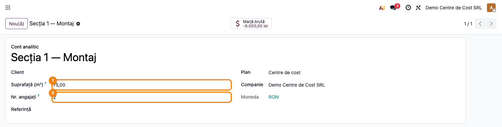
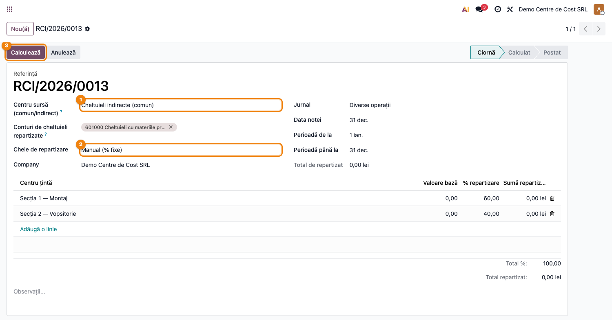
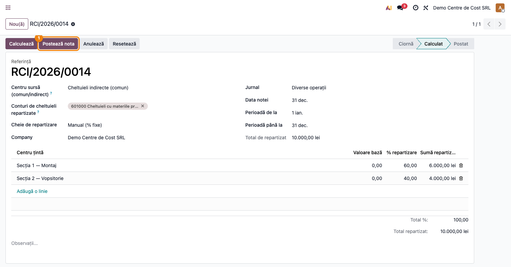
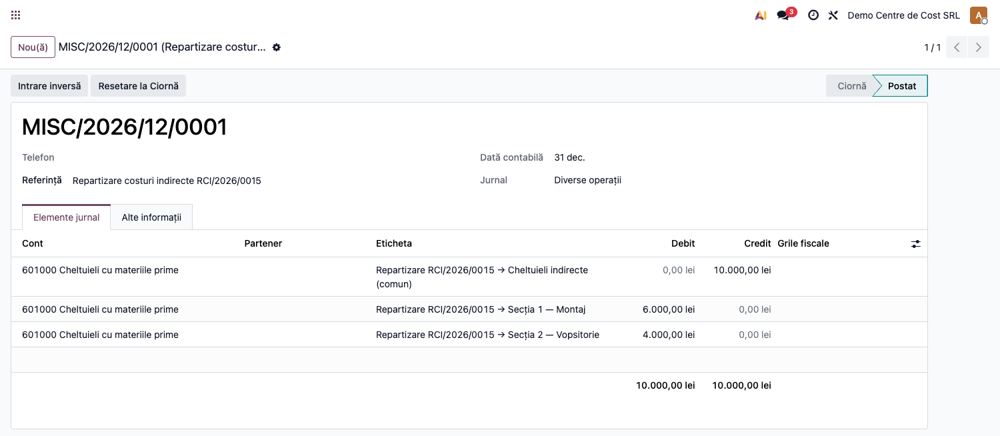

# Fișă Modul: Repartizarea costurilor indirecte pe centre de cost

**Modul:** `l10n_ro_cost_centers`
**FR:** FR-21
**Utilizator principal:** Contabil de gestiune, Controller financiar
**Prioritate:** 🟡 Medie (lunar, la închiderea perioadei)

---

## 1. Scop business

Această fișă descrie utilizarea modulului `l10n_ro_cost_centers` pentru **repartizarea cheltuielilor
indirecte** pe centrele de cost (conturi analitice). Cheltuielile colectate pe un centru comun (de
exemplu „Cheltuieli indirecte de producție") se redistribuie automat pe centrele productive, pe baza
unei chei raționale — suprafață, număr de angajați, cifră de afaceri sau procente manuale —, astfel
încât rezultatul analitic pe fiecare centru să reflecte și costurile indirecte aferente.

Redistribuirea se face **pe dimensiunea analitică, pe același cont contabil de cheltuială**: impactul
financiar pe cont rămâne zero (nu modifică balanța financiară), dar costul „migrează" de pe centrul
comun pe centrele țintă. Nu este necesară folosirea conturilor din clasa 9.

## 2. Bază legală și context

OMFP 1802/2014 — contabilitatea de gestiune organizată pe centre de responsabilitate; repartizarea
cheltuielilor indirecte la sfârșitul lunii pe baze raționale (suprafață, personal, cifră de afaceri,
ore-mașină). Modulul nu impune o monografie obligatorie pe clasa 9; oferă o repartizare analitică
neutră financiar, conformă practicii de control de gestiune.

> Contabilitatea de gestiune este la latitudinea entității; modulul susține politica internă de
> repartizare, fără a altera contabilitatea financiară.

## 3. Utilizatori și roluri

Contabil de gestiune / Controller.

Roluri recomandate pentru testare:
- Administrator funcțional: instalează modulul, configurează centrele de cost și cheile de repartizare.
- Contabil de gestiune: rulează repartizarea lunară și verifică nota generată.
- Manager financiar: validează rezultatul analitic pe centre.

## 4. Conturi și date implicate

- **Conturi de cheltuieli (clasa 6xx)** — conturile indirecte care se repartizează (ex. 6024, 605, 611).
- **Conturi analitice (centre de cost)** — un centru sursă (comun/indirect) și mai multe centre țintă
  (productive), definite în planurile analitice native Odoo.
- Câmpuri proprii pe centrul de cost: **Suprafață (m²)** și **Nr. angajați** — baze de repartizare.

Date minime pentru demo:
- companie românească cu localizarea contabilă instalată și perioadă deschisă;
- un plan analitic cu cel puțin un centru sursă și două centre țintă;
- una sau mai multe note contabile postate care încarcă cheltuieli indirecte pe centrul sursă.

## 5. Configurare inițială

1. Instalați modulul `l10n_ro_cost_centers` pe baza demo.
2. În **Contabilitate → Configurare → Contabilitate analitică → Conturi analitice**, creați centrele
   de cost (sursă + țintă).
3. Pe centrele țintă completați, după caz, **Suprafață (m²)** și/sau **Nr. angajați** (bazele de
   repartizare pentru cheile „suprafață" și „nr. angajați").
4. Asigurați-vă că există un **jurnal de tip Diverse (general)** pentru nota de repartizare.
5. Asigurați-vă că există cheltuieli postate pe centrul sursă în perioada de repartizat (distribuție
   analitică pe centrul comun).
6. Verificați că utilizatorul de test are grupul **Contabilitate / Contabil**.

## 6. Flux de utilizare

### Pasul 1 — Pregătirea centrelor de cost

În **Contabilitate → Configurare → Contabilitate analitică → Conturi analitice**, deschideți centrele
de cost țintă și completați bazele de repartizare: **Suprafață (m²)** și **Nr. angajați**. Acestea sunt
folosite când alegeți cheia corespunzătoare la repartizare.



### Pasul 2 — Crearea repartizării

Accesați **Contabilitate → Repartizare costuri indirecte** și creați o repartizare nouă.
Completați:
- **Centru sursă (comun/indirect)** — centrul pe care s-au colectat cheltuielile indirecte;
- **Conturi de cheltuieli repartizate** — conturile 6xx ale căror sume se redistribuie;
- **Jurnal** — jurnalul (de tip Diverse/general) în care se postează nota de repartizare (obligatoriu);
- **Perioadă** (de la / până la) — intervalul din care se colectează costul;
- **Cheie de repartizare** — manual / suprafață / nr. angajați / cifră de afaceri;
- **Centre țintă** — conturile analitice productive între care se repartizează.



### Pasul 3 — Calculul repartizării

Apăsați **Calculează**. Sistemul colectează totalul de pe centrul sursă în perioadă (câmpul **Total de
repartizat**) și calculează procentele și sumele per centru țintă, în funcție de cheie:
- la cheia **Manual**, introduceți direct procentele (trebuie să însumeze 100%);
- la celelalte chei, procentele se calculează automat din baze: suprafața (m²) sau nr. de angajați
  de pe centre, ori **cifra de afaceri** — veniturile (conturi 7xx) postate pe fiecare centru țintă
  în perioadă.



### Pasul 4 — Postarea notei de repartizare

Apăsați **Postează nota**. Se generează o notă contabilă de redistribuire analitică pe fiecare cont de
cheltuială: o linie care scoate costul de pe centrul comun și câte o linie care îl încarcă pe fiecare
centru țintă, cu distribuție analitică 100% pe centrul respectiv. Nota este echilibrată, iar impactul
financiar pe cont este zero.



Anularea repartizării (**Anulează**) readuce nota în ciornă și anulează nota contabilă generată.

### Note de monografie și raportare

Pentru fiecare cont de cheltuială repartizat (suma colectată pe centrul comun = `S`):
- **Cr 6xx** — analitic **centru comun** = `S` (scoate costul indirect de pe centrul comun);
- **Dr 6xx** — analitic **centru țintă i** = `S × procent_i` (încarcă centrul productiv).

Impactul financiar net pe contul 6xx este **zero** (suma debitelor = creditul); doar repartizarea pe
dimensiunea analitică se modifică. Rezultatul se reflectă în rapoartele analitice native (P&L pe
centre de cost), nu necesită conturi din clasa 9.

## 7. Legături cu alte module / declarații

| Modul / proces | Rol în flux | Tip legătură |
|---|---|---|
| `account` | nota contabilă de repartizare | dependență (manifest) |
| `analytic` | planuri și conturi analitice (centre de cost) | dependență (manifest) |
| `l10n_ro` | plan de conturi RO (clasa 6xx) | dependență (manifest) |
| `account_budget` (Enterprise) | bugete pe centre de cost | nativ, opțional (nu cuplat) |
| `account_reports` (Enterprise) | P&L pe dimensiuni analitice | nativ, opțional |

Ce este automat: colectarea costului de pe centrul sursă, calculul cheilor și generarea notei de
redistribuire analitică echilibrată.
Ce rămâne manual: definirea centrelor, completarea bazelor (suprafață / nr. angajați), alegerea cheii
și a centrelor țintă, precum și încadrarea inițială a cheltuielilor indirecte pe centrul comun.

## 8. Verificări pentru consultant

- [ ] Modulul se instalează fără erori pe baza demo.
- [ ] Meniul **Contabilitate → Repartizare costuri indirecte** este vizibil.
- [ ] Câmpurile **Suprafață (m²)** și **Nr. angajați** apar pe conturile analitice.
- [ ] „Total de repartizat" corespunde soldului costurilor de pe centrul sursă în perioadă.
- [ ] La cheia „Manual", procentele care nu însumează 100% sunt respinse.
- [ ] Nota generată este echilibrată, iar soldul financiar pe contul 6xx repartizat este zero.
- [ ] Soldul analitic migrează corect: centrul comun scade, centrele țintă cresc conform procentelor.

## 9. Mesaje de eroare frecvente

| Mesaj / simptom | Cauză probabilă | Remediere |
|-----------------|-----------------|-----------|
| „Adăugați cel puțin un centru țintă." | Repartizarea nu are linii | Adăugați centrele țintă înainte de calcul |
| „Procentele introduse manual trebuie să însumeze 100%." | Cheia „Manual" cu procente ≠ 100% | Corectați procentele pe linii |
| „Baza de repartizare este zero pentru cheia selectată…" | Centrele nu au suprafață / nr. angajați / venituri în perioadă | Completați bazele pe centre sau alegeți altă cheie |
| „Centrul sursă nu poate fi și centru țintă în aceeași repartizare." | Centrul comun a fost adăugat și ca țintă | Eliminați centrul sursă din lista de centre țintă |
| „Nu există costuri de repartizat pe centrul sursă în perioadă." | Nicio cheltuială pe centrul comun în interval | Verificați perioada și distribuția analitică a notelor |
| „Calculați repartizarea înainte de postare." | S-a apăsat „Postează" fără „Calculează" | Apăsați mai întâi „Calculează" |

## 10. Capturi de ecran

Capturile (`readme/screenshots/`) sunt **generate automat** din `tests/test_screenshots.py`
(mixinul `ScreenshotCase` din `l10n_ro_doc_screenshots`, import defensiv), în **limba română**,
pe planul de conturi RO (`setup_country("ro")`):

1. `01_centru_cost.png` — cont analitic (centru de cost) cu Suprafață și Nr. angajați.
2. `02_repartizare_config.png` — repartizarea: centru sursă, conturi, cheie și centre țintă.
3. `03_repartizare_calcul.png` — repartizarea calculată (procente și sume per centru).
4. `04_nota_repartizare.png` — nota contabilă de redistribuire analitică.

Regenerare:

```bash
./odoo/odoo-bin -c odoo.conf -d <db> -i l10n_ro_cost_centers,l10n_ro_doc_screenshots \
    --test-tags=fise_screenshots --stop-after-init
```

## 11. Observații pentru manual

În manualul final, păstrați explicația orientată pe activitatea utilizatorului: ce sunt costurile
indirecte, de ce se repartizează pe centre, ce baze de repartizare există și cum se citește rezultatul
analitic. Subliniați că repartizarea este neutră financiar (nu modifică balanța), fiind un instrument
de control de gestiune, nu o operațiune fiscală.
