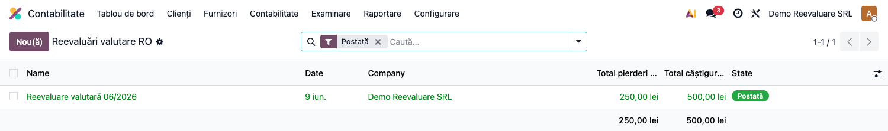
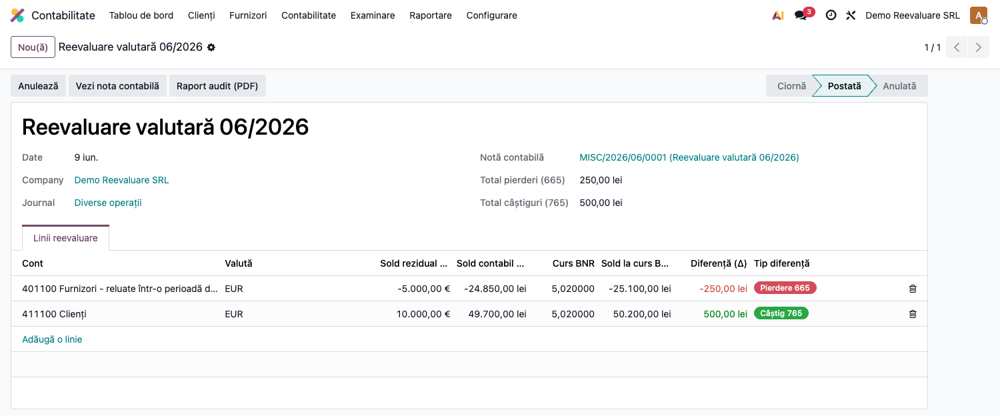
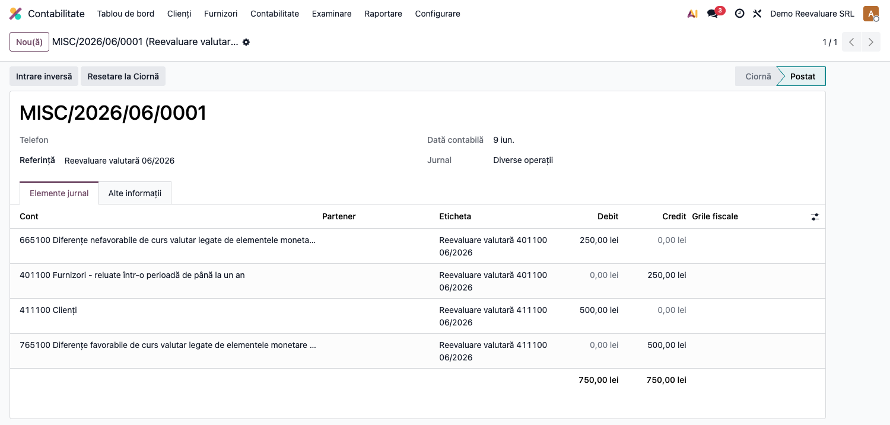
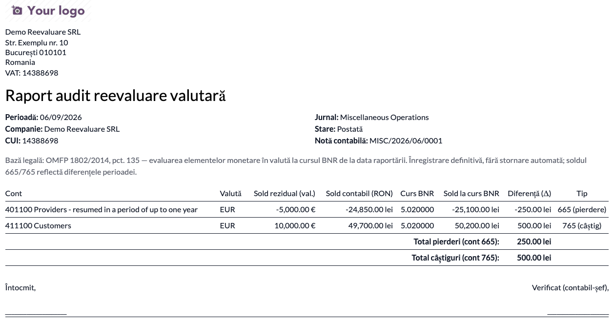

# Fișă Modul: Reevaluare valutară lunară (OMFP 1802, fără stornare)

**Poziție plan:** B4.1
**Modul:** `l10n_ro_currency_revaluation`
**FR:** FR-17
**Capitol manual:** Cap 8.1
**Utilizator principal:** Contabil, Contabil șef
**Prioritate:** 🔴 Ridicată (obligatoriu lunar dacă există solduri în valută)

---

## 1. Scop business

Modulul reevaluează lunar **soldurile monetare în valută** (creanțe, datorii, disponibilități) la
cursul BNR de la sfârșitul lunii și înregistrează diferențele de curs pe `665` (pierderi) sau `765`
(câștiguri). Spre deosebire de comportamentul implicit Enterprise, diferențele sunt **definitive** —
**nu se stornează** automat în luna următoare, conform reglementării românești. Modulul ține și un
**istoric** (audit trail) al reevaluărilor, cu stări ciornă → postată → anulată, și produce un
**raport audit PDF** per reevaluare (cursuri BNR folosite, solduri reziduale, diferențe 665/765).

Reevaluarea fiecărei luni se calculează **incremental față de ultima reevaluare** (nu față de cursul
istoric al documentului): ajustările lunii anterioare sunt reportate în soldul contabil, iar la
încasarea/plata unui element partea nerealizată rămasă se **realizează** automat la reevaluarea
următoare — astfel rezultatul financiar reflectă diferența față de ultima reevaluare.

## 2. Bază legală și context

- **OMFP 1802/2014, pct. 135** — creanțele, datoriile și disponibilitățile în valută se
  evaluează la cursul de închidere (cursul BNR din ultima zi a lunii); diferențele de curs se
  recunosc în rezultat (venituri/cheltuieli financiare).
- **Diferența față de IFRS / Enterprise:** în RO diferențele din reevaluare sunt definitive (nu se
  reiau prin stornare la 1 ale lunii următoare). Modulul adaugă opțiunea **„Fără stornare automată
  (OMFP 1802)"**, activată implicit pentru companiile din România.
- **Element monetar vs. nemonetar:** se reevaluează doar elementele monetare în valută; **stocurile
  (clasa 3)** și **capitalurile (clasa 1)** sunt excluse automat.

## 3. Utilizatori și roluri

- **Contabil** — rulează reevaluarea lunară, verifică nota generată.
- **Contabil șef** — validează cursul BNR și conturile incluse, aprobă închiderea lunii.

Roluri recomandate pentru testare:
- Administrator funcțional: instalează modulul, configurează conturile 665/765 și jurnalul.
- Utilizator operațional: rulează reevaluarea lunară.
- Contabil/manager: validează nota 665/765 și soldurile reevaluate.

## 4. Conturi și date implicate

| Cont | Rol |
|---|---|
| `5124` / `5314` | disponibilități în valută (bancă / casă) |
| `4111` | clienți cu creanțe în valută |
| `401` | furnizori cu datorii în valută |
| `451` / `461` / `462` / `267` / `508` | alte solduri monetare în valută |
| `665` | cheltuieli din diferențe de curs valutar (pierderi) |
| `765` | venituri din diferențe de curs valutar (câștiguri) |

Excluse automat: capitaluri (`1xx`), stocuri (`3xx`), venituri și cheltuieli.

Date minime pentru demo:
- companie românească (plan de conturi RO) cu o valută străină activă (ex. EUR) și cursuri BNR la
  data tranzacțiilor și la data reevaluării;
- conturile 665/765 și un jurnal de reevaluare configurate;
- solduri valutare nereconciliate (ex. o factură client în EUR și o factură furnizor în EUR neîncasate).

## 5. Configurare inițială

### 5.1 Cursuri valutare BNR

Meniu: **Contabilitate → Configurare → Valute**

Verificați că pentru fiecare valută folosită există cursul BNR la data reevaluării (ultima zi
lucrătoare a lunii). Cursurile se pot actualiza manual sau automat.

### 5.2 Conturi de diferențe de curs și jurnal

Meniu: **Contabilitate → Configurare → Setări**, secțiunea **Valute** → grupul de reevaluare
valutară (aceleași câmpuri folosite și de wizard-ul Enterprise „Unrealized Currency Gains/Losses"):

- **Cont provizion cheltuieli** (diferențe nefavorabile) → `6651`;
- **Cont provizion venituri** (diferențe favorabile) → `7651`;
- **Jurnal reevaluare** → un jurnal de tip „Operațiuni diverse" dedicat.

Tehnic, acestea sunt câmpurile `account_revaluation_expense_provision_account_id`,
`account_revaluation_income_provision_account_id` și `account_revaluation_journal_id` de pe companie.
Fără ele, postarea reevaluării generează eroare.

## 6. Flux de utilizare

### Pasul 1 — Istoricul reevaluărilor

Accesați **Contabilitate → Reevaluare valutară RO**. Lista afișează reevaluările cu starea lor
(ciornă / postată / anulată) și totalurile de pierderi/câștiguri.



### Pasul 2 — Crearea și calculul reevaluării

Creați o reevaluare, setați **data** (ultima zi a lunii), **compania** și **jurnalul**, apoi apăsați
**Calculează**. Modulul determină soldurile reziduale valutare (ținând cont de reconcilierile
parțiale) și afișează, pe fiecare cont și valută: soldul în valută, soldul contabil în RON, cursul
BNR, soldul recalculat și **diferența** (pierdere `665` / câștig `765`).



### Pasul 3 — Postarea notei contabile

Apăsați **Postează nota**. Modulul generează nota de diferențe de curs și o leagă de reevaluare
(stare **postată**). Corecția se face **doar** prin butonul **Anulează** (storno), nu prin editarea
notei.



### Pasul 4 — Raportul audit (PDF)

Pe reevaluare, apăsați **Raport audit (PDF)** (sau din meniul de tipărire). Raportul este documentul
justificativ al reevaluării, util la închidere și la control.

1. **Găsiți pe ecran** — antetul afișează perioada (data reevaluării), compania și CUI, jurnalul și
   nota contabilă legată; în tabel, fiecare rând este un cont monetar în valută, cu coloanele
   *Sold rezidual (val.)*, *Sold contabil (RON)*, *Curs BNR*, *Sold la curs BNR* și *Diferență (Δ)*,
   plus tipul (665 pierdere / 765 câștig).
2. **Verificați** — cursul BNR de pe fiecare rând este cel din ultima zi a lunii; *Sold la curs BNR* =
   *Sold rezidual (val.)* × *Curs BNR*; *Diferență* = *Sold la curs BNR* − *Sold contabil*; totalurile
   *Total pierderi (665)* și *Total câștiguri (765)* coincid cu liniile notei contabile de la Pasul 3.
3. **Tipăriți / exportați** — abia după ce datele corespund, generați PDF-ul pentru dosarul lunii.



### Note de monografie și raportare

- Câștig din diferențe de curs (ex. creanță client crescută în RON): **Dr 4111 = Cr 765**.
- Pierdere din diferențe de curs (ex. datorie furnizor crescută în RON): **Dr 665 = Cr 401**.
- Disponibilități: **Dr 5124 = Cr 765** (câștig) / **Dr 665 = Cr 5124** (pierdere).
- Nota este **echilibrată** (total debite = total credite) și **nu se stornează** automat.
- **Reevaluare incrementală:** în luna a doua, ajustarea anterioară este reportată în soldul contabil,
  deci diferența nouă se calculează față de cursul ultimei reevaluări (ex. 5,10 → 5,00 luna 1, apoi
  5,00 → 4,90 luna 2), nu față de cursul istoric al documentului.
- **Realizare la decontare:** la încasarea/plata elementului, partea nerealizată rămasă din reevaluările
  anterioare se **realizează** (stornare) la reevaluarea următoare — rândul apare cu sold valutar zero
  și o ajustare inversă. Astfel, diferența recunoscută în rezultat reflectă variația de curs față de
  ultima reevaluare, nu dubla diferența istorică.

## 7. Legături cu alte module / declarații

| Modul / proces | Rol în flux |
|---|---|
| `account` | solduri valutare, note 665/765, reconciliere |
| `account_reports` | wizard-ul Enterprise de reevaluare (extins cu „Fără stornare automată") |
| `l10n_ro_expense_currency` | avansuri în valută (542) tratate separat |
| `l10n_ro_stock_gestiune` | diferențele de curs la 408 (recepție fără factură) — reevaluate ca element monetar |
| `l10n_ro_period_close_enhanced` | checklist de închidere lunară |

Ce este automat: calculul soldurilor reziduale valutare, diferențele de curs și nota 665/765 (fără
stornare).
Ce rămâne manual: actualizarea cursului BNR, alegerea conturilor incluse și verificarea soldurilor.

## 8. Verificări pentru consultant

- [ ] Modulul se instalează fără erori și apare meniul **Reevaluare valutară RO**.
- [ ] Conturile 665/765 și jurnalul de reevaluare sunt configurate.
- [ ] **Calculează** produce linii doar pe conturile monetare în valută (nu pe 3xx/1xx).
- [ ] **Postează nota** generează o notă echilibrată pe 665/765, pe jurnalul de reevaluare.
- [ ] Nota **nu** are stornare automată în luna următoare (opțiunea OMFP 1802 este activă).
- [ ] **Anulează** stornează corect nota și trece reevaluarea în starea „anulată".
- [ ] O a doua reevaluare pentru aceeași dată și companie este respinsă (constrângere unică).
- [ ] **Raport audit (PDF)** se generează și totalurile 665/765 coincid cu nota contabilă.
- [ ] În luna a doua, diferența este **incrementală** (față de cursul ultimei reevaluări), nu față de cursul istoric.
- [ ] După încasarea/plata unui element, reevaluarea următoare **realizează** (stornează) ajustarea nerealizată rămasă.

## 9. Mesaje de eroare frecvente

| Mesaj / simptom | Cauză probabilă | Remediere |
|---|---|---|
| „Nu există ajustări valutare necesare" | nu există solduri valutare reziduale sau cursul e identic | verificați cursul BNR și soldurile nereconciliate la data aleasă |
| Eroare la postare: cont 665/765 lipsă | conturile de diferențe de curs nu sunt configurate | completați conturile în Setări → diferențe de curs |
| „Calculați mai întâi liniile de reevaluare" | s-a apăsat Postează fără Calculează | apăsați mai întâi **Calculează** |
| Reevaluare duplicată pentru aceeași lună | constrângere `UNIQUE(date, company)` | anulați reevaluarea existentă sau alegeți altă dată |
| Meniul nu este vizibil | utilizatorul nu are drepturi contabile | acordați grupul „Contabilitate" și reîncărcați |

## 10. Capturi de ecran

Capturile (`readme/screenshots/`) sunt **generate automat** din `tests/test_screenshots.py`
(mixinul `ScreenshotCase` din `l10n_ro_doc_screenshots`, import defensiv), în **limba română**,
pe planul de conturi RO:

1. `01_reevaluare_lista.png` — lista reevaluărilor valutare RO (stări + totaluri).
2. `02_reevaluare_form.png` — reevaluarea cu liniile calculate (cont, valută, curs BNR, diferență, tip).
3. `03_nota_contabila.png` — nota contabilă de reevaluare (liniile 665/765).
4. `04_raport_audit.png` — raportul audit PDF (cursuri BNR, solduri reziduale, totaluri 665/765).

Regenerare:

```bash
./odoo/odoo-bin -c odoo.conf -d <db> -i l10n_ro_currency_revaluation,l10n_ro_doc_screenshots \
    --test-tags=fise_screenshots --stop-after-init
```

## 11. Observații pentru manual

Păstrați explicația orientată pe activitatea contabilului: când se rulează reevaluarea (lunar, la
închidere, dacă există solduri în valută), ce curs se folosește (BNR din ultima zi a lunii), pe ce
conturi acționează (monetare în valută, **nu** stocuri/capitaluri) și de ce diferențele sunt
**definitive** în RO (fără stornare, spre deosebire de IFRS/Enterprise). Subliniați că la
încasarea/plata ulterioară diferența se raportează la cursul reevaluării.
