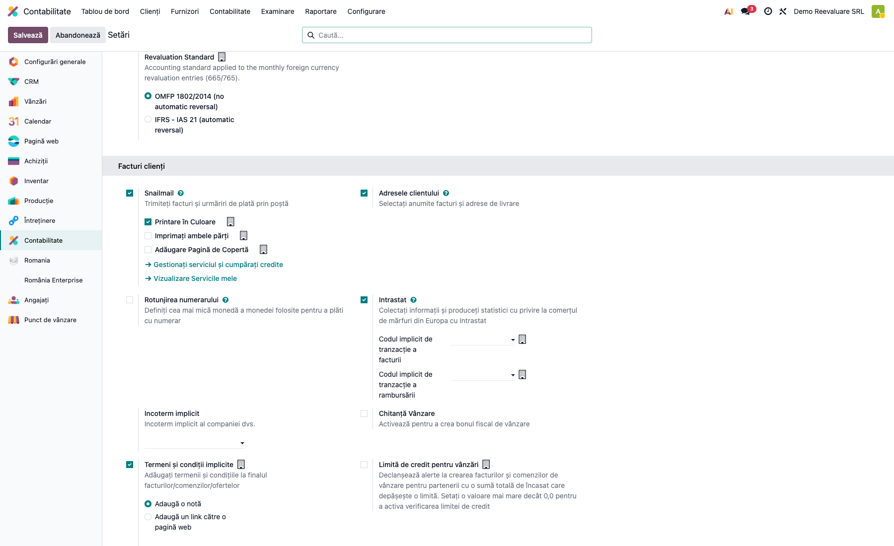
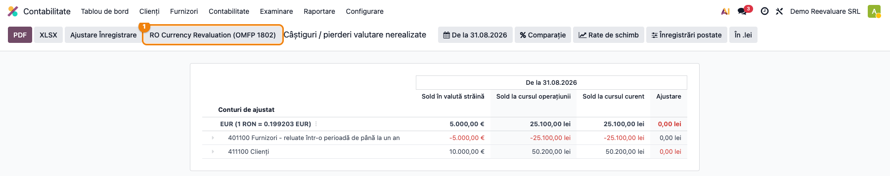
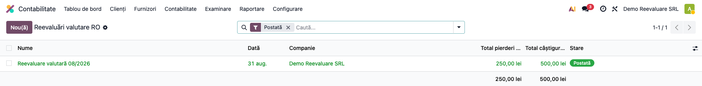
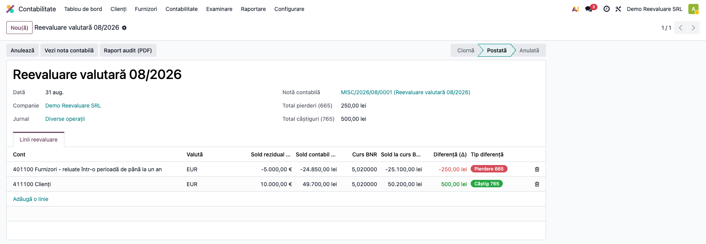
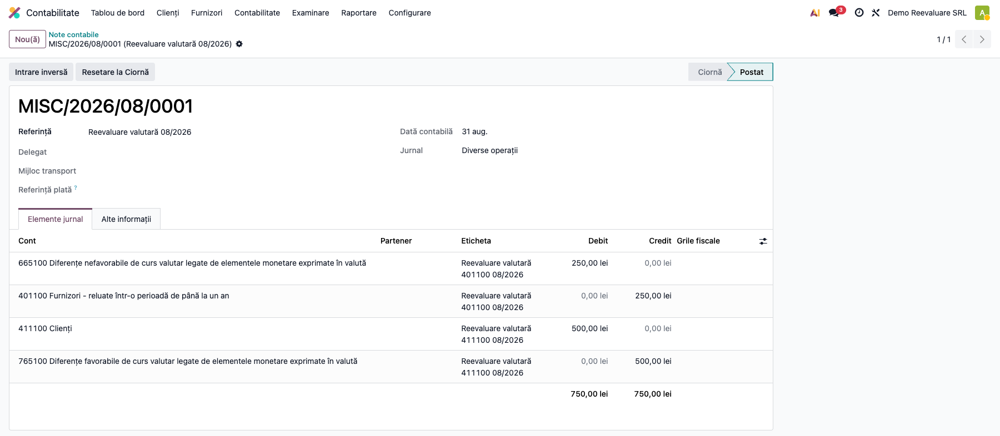
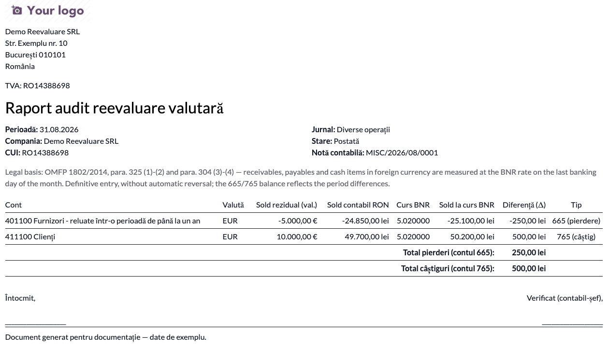

# Fișă Modul: Reevaluare valutară lunară (OMFP 1802, fără stornare)

**Poziție plan:** B4.1
**Modul:** `l10n_ro_currency_revaluation`
**FR:** FR-17
**Capitol manual:** Cap 8.1
**Utilizator principal:** Contabil, Contabil șef
**Prioritate:** 🔴 Ridicată (obligatoriu lunar dacă există solduri în valută)

---

## 1. Scop business

Modulul reevaluează lunar **soldurile monetare în valută** (creanțe, datorii, disponibilități) la
cursul BNR de la sfârșitul lunii și înregistrează diferențele de curs pe `665` (pierderi) sau `765`
(câștiguri). Ține un **istoric** (audit trail) al reevaluărilor, cu stări ciornă → postată →
anulată, și produce un **raport audit PDF** per reevaluare (cursuri BNR folosite, solduri
reziduale, diferențe 665/765).

Compania alege explicit, dintr-un **parametru de configurare**, care standard contabil se aplică
notei de reevaluare:

- **OMFP 1802/2014** (implicit pentru companiile românești) — diferența e **definitivă**, **nu se
  stornează** automat în luna următoare, iar calculul e **incremental față de ultima reevaluare**
  (nu față de cursul istoric al documentului): ajustările lunii anterioare sunt reportate în soldul
  contabil, iar la încasarea/plata unui element partea nerealizată rămasă se **realizează**
  automat la reevaluarea următoare.
- **IFRS (IAS 21)** — folosește wizard-ul standard Enterprise, cu stornare automată a ajustării la
  începutul perioadei următoare (comportamentul implicit Odoo).

Indiferent de calea de pornire (meniul propriu sau wizard-ul standard), pentru compania configurată
pe OMFP 1802 se rulează **același motor de calcul** (același SQL, aceleași reguli de scop de
conturi, aceeași excludere manuală cont/valută) — nu există risc ca aceeași lună să dea sume
diferite după punctul de intrare folosit.

## 2. Bază legală și context

- **OMFP 1802/2014, pct. 325 alin. (1)-(2)** — la finele fiecărei luni, creanțele și datoriile în
  valută se evaluează la cursul de schimb BNR din ultima zi bancară a lunii; **pct. 304 alin. (3)-(4)**
  — aceeași regulă pentru disponibilități și alte valori de trezorerie. Diferențele de curs se
  recunosc în rezultat (venituri/cheltuieli financiare), **definitiv**, fără stornare.
- **OMFP 1802/2014, pct. 316 alin. (2)** — avansurile reflectate în conturile **409** „Furnizori-debitori"
  și **419** „Clienți-creditori" **nu fac obiectul** reevaluării la cursul valutar la finele lunii —
  modulul le exclude automat din calcul (nu doar stocurile și capitalurile).
- **IFRS (IAS 21)** — retratare la cursul de închidere cu stornare automată a ajustării în
  perioada următoare; standard, nu specific românesc. Ambele standarde reevaluează aceleași
  **elemente monetare** — diferența e strict la mecanismul de înregistrare, nu la ce conturi
  se reevaluează.
- **Nu există un comutator standard Odoo „IFRS da/nu"** la nivel de companie (Odoo are doar
  „ledger groups", pentru evidență paralelă multi-standard) — de aceea modulul adaugă propriul
  parametru `l10n_ro_fx_revaluation_standard`, ca sursă unică de adevăr pentru ambele căi.
- **Element monetar vs. nemonetar:** se reevaluează doar elementele monetare în valută; **stocurile
  (clasa 3)** și **capitalurile (clasa 1)** sunt excluse automat. Un cont este eligibil doar dacă
  are **valută proprie setată** (`account.currency_id`) sau este de tip **client/furnizor**
  (`asset_receivable`/`liability_payable`) — nu e suficient ca o linie a lui să provină dintr-un
  document în valută. De exemplu, un cont de imobilizări (`205`) sau de TVA (`4426`/`4427`) rămâne
  exclus chiar dacă a fost debitat/creditat printr-o factură emisă în EUR, pentru că soldul lui
  este, prin natură, exprimat în lei.

## 3. Utilizatori și roluri

- **Contabil** — rulează reevaluarea lunară, verifică nota generată.
- **Contabil șef** — validează cursul BNR și conturile incluse, alege standardul companiei, aprobă
  închiderea lunii.

Roluri recomandate pentru testare:
- Administrator funcțional: instalează modulul, configurează conturile 665/765, jurnalul și
  standardul de reevaluare al companiei.
- Utilizator operațional: rulează reevaluarea lunară.
- Contabil/manager: validează nota 665/765 și soldurile reevaluate.

## 4. Conturi și date implicate

| Cont | Rol |
|---|---|
| `5124` / `5314` | disponibilități în valută (bancă / casă) |
| `4111` | clienți cu creanțe în valută |
| `401` | furnizori cu datorii în valută |
| `451` / `461` / `462` / `267` / `508` | alte solduri monetare în valută |
| `665` | cheltuieli din diferențe de curs valutar (pierderi) |
| `765` | venituri din diferențe de curs valutar (câștiguri) |

Excluse automat: capitaluri (`1xx`), stocuri (`3xx`), venituri și cheltuieli, avansurile din
**`409`**/**`419`** (pct. 316 alin. (2)), precum și orice combinație cont+valută exclusă manual din
raportul standard (`account.account.exclude_provision_currency_ids` — aceeași listă, comună cu
wizard-ul Enterprise).

Date minime pentru demo:
- companie românească (plan de conturi RO) cu o valută străină activă (ex. EUR) și cursuri BNR la
  data tranzacțiilor și la data reevaluării;
- conturile 665/765, un jurnal de reevaluare și standardul de reevaluare configurate;
- solduri valutare nereconciliate (ex. o factură client în EUR și o factură furnizor în EUR neîncasate).

## 5. Configurare inițială

### 5.1 Cursuri valutare BNR

Meniu: **Contabilitate → Configurare → Valute**

Verificați că pentru fiecare valută folosită există cursul BNR la data reevaluării (ultima zi
lucrătoare a lunii). Cursurile se pot actualiza manual sau automat.

### 5.2 Standardul de reevaluare al companiei

Meniu: **Contabilitate → Configurare → Setări**, secțiunea **Foreign Currency Revaluation**
(vizibilă doar dacă țara fiscală a companiei e România):

- **OMFP 1802/2014 (no automatic reversal)** — implicit pe companiile RO;
- **IFRS - IAS 21 (automatic reversal)** — pentru companii care raportează și în IFRS.



Câmpul tehnic: `l10n_ro_fx_revaluation_standard` de pe companie. Dacă e setat pe IFRS, meniul
propriu **Reevaluare valutară RO** refuză să calculeze — folosiți wizard-ul Enterprise standard.

### 5.3 Conturi de diferențe de curs și jurnal

Aceeași secțiune de Setări, bloc **„Revaluation Provision Accounts"** — folosit și de wizard-ul
Enterprise „Unrealized Currency Gains/Losses":

- **Cont provizion cheltuieli** (diferențe nefavorabile) → `6651`;
- **Cont provizion venituri** (diferențe favorabile) → `7651`;
- **Jurnal reevaluare** → un jurnal de tip „Operațiuni diverse" dedicat.

Tehnic, acestea sunt câmpurile `account_revaluation_expense_provision_account_id`,
`account_revaluation_income_provision_account_id` și `account_revaluation_journal_id` de pe companie.
Fără ele, postarea reevaluării generează eroare.

> **Atenție — nu confundați cu contul de curs realizat.** În aceeași pagină de Setări
> (Contabilitate → Configurare → Setări), mai există și câmpurile clasice **„Gain/Loss Exchange
> Rate Account"** (`income_currency_exchange_account_id` / `expense_currency_exchange_account_id`),
> folosite pentru diferențele de curs **realizate** la reconcilierea unei plăți. Sunt conturi
> **diferite** de cele de mai sus (provizionul pentru reevaluarea **nerealizată**), deși ambele pot
> avea codul contabil 665/765. Până la acest fix, câmpurile de provizion nu erau expuse în nicio
> interfață, iar utilizatorii configurau — firesc — doar contul de curs realizat; postarea
> reevaluării eșua atunci cu mesajul „configurați contul 665", deși un cont 665 *era* deja setat
> (dar pe câmpul greșit). Dacă aveți instalări mai vechi ale modulului, verificați explicit acest
> bloc din Setări, nu presupuneți că e deja completat.

## 6. Flux de utilizare

### Pasul 1 — Pornire din raportul standard sau din meniul propriu

Reevaluarea RO poate fi lansată din două puncte de intrare echivalente:

- Meniul propriu **Contabilitate → Reevaluare valutară RO** (Pasul 2 de mai jos);
- Raportul standard **Contabilitate → Raportare → Câștiguri/pierderi valutare nerealizate**
  (`Unrealized Currency Gains/Losses`), care are acum și butonul **„RO Currency Revaluation
  (OMFP 1802)"** — vizibil doar dacă standardul companiei e OMFP 1802 — și care deschide direct
  reevaluarea RO a lunii afișate în raport (sau pregătește crearea uneia noi).



### Pasul 2 — Istoricul reevaluărilor

Accesați **Contabilitate → Contabilitate → Reevaluare valutară RO**. Lista afișează reevaluările cu starea lor
(ciornă / postată / anulată) și totalurile de pierderi/câștiguri.



### Pasul 3 — Crearea și calculul reevaluării

Creați o reevaluare, setați **data** (ultima zi a lunii), **compania** și **jurnalul**, apoi apăsați
**Calculează**. Modulul determină soldurile reziduale valutare (ținând cont de reconcilierile
parțiale) și afișează, pe fiecare cont și valută: soldul în valută, soldul contabil în RON, cursul
BNR, soldul recalculat și **diferența** (pierdere `665` / câștig `765`).



### Pasul 4 — Postarea notei contabile

Apăsați **Postează nota**. Modulul generează nota de diferențe de curs și o leagă de reevaluare
(stare **postată**). Corecția se face **doar** prin butonul **Anulează** (storno), nu prin editarea
notei.



### Pasul 5 — Raportul audit (PDF)

Pe reevaluare, apăsați **Raport audit (PDF)** (sau din meniul de tipărire). Raportul este documentul
justificativ al reevaluării, util la închidere și la control.

1. **Găsiți pe ecran** — antetul afișează perioada (data reevaluării), compania și CUI, jurnalul și
   nota contabilă legată; în tabel, fiecare rând este un cont monetar în valută, cu coloanele
   *Sold rezidual (val.)*, *Sold contabil (RON)*, *Curs BNR*, *Sold la curs BNR* și *Diferență (Δ)*,
   plus tipul (665 pierdere / 765 câștig).
2. **Verificați** — cursul BNR de pe fiecare rând este cel din ultima zi a lunii; *Sold la curs BNR* =
   *Sold rezidual (val.)* × *Curs BNR*; *Diferență* = *Sold la curs BNR* − *Sold contabil*; totalurile
   *Total pierderi (665)* și *Total câștiguri (765)* coincid cu liniile notei contabile de la Pasul 4.
3. **Tipăriți / exportați** — abia după ce datele corespund, generați PDF-ul pentru dosarul lunii.



### Note de monografie și raportare

- Câștig din diferențe de curs (ex. creanță client crescută în RON): **Dr 4111 = Cr 765**.
- Pierdere din diferențe de curs (ex. datorie furnizor crescută în RON): **Dr 665 = Cr 401**.
- Disponibilități: **Dr 5124 = Cr 765** (câștig) / **Dr 665 = Cr 5124** (pierdere).
- Nota este **echilibrată** (total debite = total credite) și, pe OMFP 1802, **nu se stornează**
  automat.
- **Reevaluare incrementală (OMFP 1802):** în luna a doua, ajustarea anterioară este reportată în
  soldul contabil, deci diferența nouă se calculează față de cursul ultimei reevaluări (ex.
  5,10 → 5,00 luna 1, apoi 5,00 → 4,90 luna 2), nu față de cursul istoric al documentului.
- **Realizare la decontare:** la încasarea/plata elementului, partea nerealizată rămasă din reevaluările
  anterioare se **realizează** (stornare) la reevaluarea următoare — rândul apare cu sold valutar zero
  și o ajustare inversă. Astfel, diferența recunoscută în rezultat reflectă variația de curs față de
  ultima reevaluare, nu dubla diferența istorică.

## 7. Legături cu alte module / declarații

| Modul / proces | Rol în flux |
|---|---|
| `account` | solduri valutare, note 665/765, reconciliere |
| `account_reports` | wizard-ul Enterprise de reevaluare (extins cu „Fără stornare automată") și raportul „Unrealized Currency Gains/Losses" (extins cu butonul spre reevaluarea RO) |
| `l10n_ro_expense_currency` | avansuri în valută (542) tratate separat |
| `l10n_ro_stock_gestiune` | diferențele de curs la 408 (recepție fără factură) — reevaluate ca element monetar |
| `l10n_ro_period_close_enhanced` | checklist de închidere lunară |

Ce este automat: calculul soldurilor reziduale valutare, diferențele de curs și nota 665/765 (fără
stornare, pe OMFP 1802); redirecționarea coerentă între wizard-ul Enterprise și meniul propriu,
pe baza standardului ales pe companie.
Ce rămâne manual: actualizarea cursului BNR, alegerea standardului de reevaluare (OMFP 1802/IFRS),
alegerea conturilor incluse (sau excluse manual) și verificarea soldurilor.

## 8. Verificări pentru consultant

- [ ] Modulul se instalează fără erori și apare meniul **Reevaluare valutară RO**.
- [ ] Setările au secțiunea **Foreign Currency Revaluation**, vizibilă doar pe companii cu țara
      fiscală România.
- [ ] Conturile 665/765, jurnalul de reevaluare și standardul companiei sunt configurate.
- [ ] **Calculează** produce linii doar pe conturile monetare în valută (nu pe 3xx/1xx/409/419) și respectă
      excluderile manuale cont/valută.
- [ ] Conturi nemonetare (ex. `205` imobilizări, `4426`/`4427` TVA, `581` viramente interne) **nu**
      apar în liniile calculate, chiar dacă au o linie contabilă provenită dintr-un document în valută.
- [ ] Câmpurile de provizion (665/765) din Setări → „Revaluation Provision Accounts" sunt distincte
      de câmpurile „Gain/Loss Exchange Rate Account" (curs realizat) — verificați că nu sunt
      confundate la configurare, mai ales pe instalări mai vechi.
- [ ] **Postează nota** generează o notă echilibrată pe 665/765, pe jurnalul de reevaluare.
- [ ] Pe standard OMFP 1802, nota **nu** are stornare automată în luna următoare.
- [ ] Pe standard IFRS, meniul propriu **Reevaluare valutară RO** refuză calculul, cu mesaj către
      wizard-ul Enterprise.
- [ ] Butonul **„RO Currency Revaluation (OMFP 1802)"** de pe raportul standard deschide reevaluarea
      RO a lunii (sau pregătește crearea uneia noi) — vizibil doar pe standard OMFP 1802.
- [ ] Pornirea din wizard-ul Enterprise (checkbox „Fără stornare automată" bifat) produce **aceleași
      sume** ca pornirea din meniul propriu, pentru aceeași lună.
- [ ] **Anulează** stornează corect nota și trece reevaluarea în starea „anulată".
- [ ] O a doua reevaluare pentru aceeași dată și companie este respinsă (constrângere unică) sau
      reutilizează draftul existent (dacă pornită din wizard).
- [ ] **Raport audit (PDF)** se generează și totalurile 665/765 coincid cu nota contabilă.
- [ ] În luna a doua, diferența este **incrementală** (față de cursul ultimei reevaluări), nu față de cursul istoric.
- [ ] După încasarea/plata unui element, reevaluarea următoare **realizează** (stornează) ajustarea nerealizată rămasă.

## 9. Mesaje de eroare frecvente

| Mesaj / simptom | Cauză probabilă | Remediere |
|---|---|---|
| „Nu există ajustări valutare necesare" | nu există solduri valutare reziduale sau cursul e identic | verificați cursul BNR și soldurile nereconciliate la data aleasă |
| Eroare la postare: cont 665/765 lipsă (deși pare configurat) | s-a completat contul de curs **realizat** („Gain/Loss Exchange Rate Account"), nu contul de **provizion** folosit de reevaluare | completați explicit Setări → „Revaluation Provision Accounts" (`account_revaluation_expense/income_provision_account_id`) — sunt câmpuri distincte de contul de curs realizat |
| Conturi neașteptate în liniile calculate (ex. 205, 4426/4427, 581) | pe instalări dinaintea acestui fix, filtrul includea orice cont cu o linie în valută, indiferent de natura contului | actualizați modulul la versiunea cu filtrul de natură monetară (currency_id propriu sau client/furnizor) |
| „Calculați mai întâi liniile de reevaluare" | s-a apăsat Postează fără Calculează | apăsați mai întâi **Calculează** |
| „This company is configured for IFRS…" | compania e pe standardul IFRS, dar s-a încercat calculul din meniul propriu RO | folosiți wizard-ul Enterprise standard, sau schimbați standardul companiei pe OMFP 1802 |
| Reevaluare duplicată pentru aceeași lună | constrângere `UNIQUE(date, company)` | anulați reevaluarea existentă sau alegeți altă dată |
| Meniul nu este vizibil | utilizatorul nu are drepturi contabile | acordați grupul „Contabilitate" și reîncărcați |

## 10. Capturi de ecran

Capturile (`readme/screenshots/`) sunt **generate automat** din `tests/test_screenshots.py`
(mixinul `ScreenshotCase` din `l10n_ro_doc_screenshots`, import defensiv), în **limba română**,
pe planul de conturi RO:

1. `01_setare_standard.png` — secțiunea de Setări cu parametrul „Revaluation Standard" (OMFP 1802/IFRS).
2. `02_raport_standard_buton.png` — butonul „RO Currency Revaluation (OMFP 1802)" pe raportul
   standard „Unrealized Currency Gains/Losses".
3. `03_reevaluare_lista.png` — lista reevaluărilor valutare RO (stări + totaluri).
4. `04_reevaluare_form.png` — reevaluarea cu liniile calculate (cont, valută, curs BNR, diferență, tip).
5. `05_nota_contabila.png` — nota contabilă de reevaluare (liniile 665/765).
6. `06_raport_audit.png` — raportul audit PDF (cursuri BNR, solduri reziduale, totaluri 665/765).

Regenerare:

```bash
./odoo/odoo-bin -c odoo.conf -d <db> -i l10n_ro_currency_revaluation,l10n_ro_doc_screenshots \
    --test-tags=fise_screenshots --stop-after-init
```

## 11. Observații pentru manual

Păstrați explicația orientată pe activitatea contabilului: când se rulează reevaluarea (lunar, la
închidere, dacă există solduri în valută), ce curs se folosește (BNR din ultima zi a lunii), pe ce
conturi acționează (monetare în valută, **nu** stocuri/capitaluri) și cum aleg standardul companiei
(OMFP 1802 — definitiv, fără stornare — sau IFRS — cu stornare automată). Subliniați că, indiferent
de punctul de pornire (meniu propriu sau raport standard), rezultatul e coerent pentru aceeași lună,
și că la încasarea/plata ulterioară diferența se raportează la cursul reevaluării.
