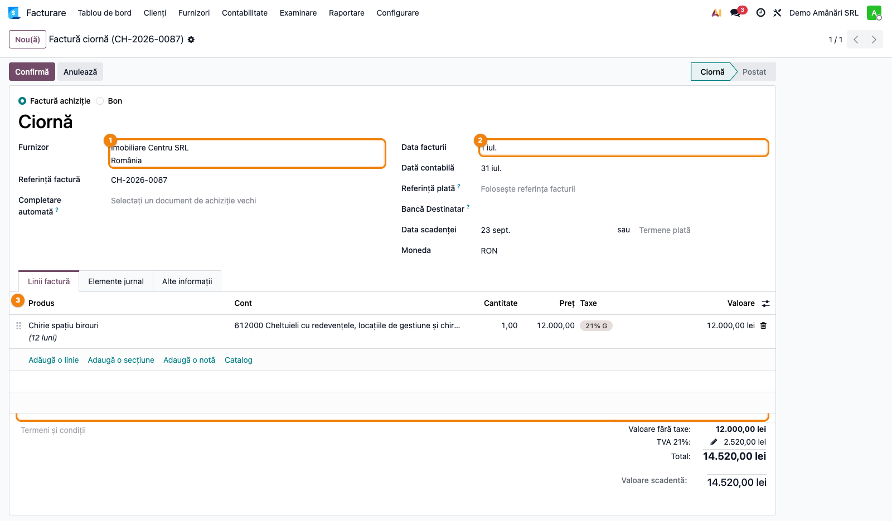
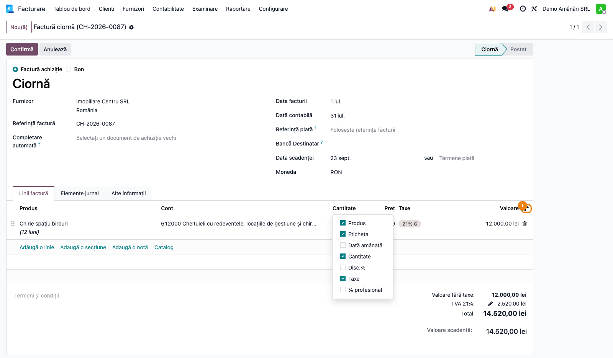
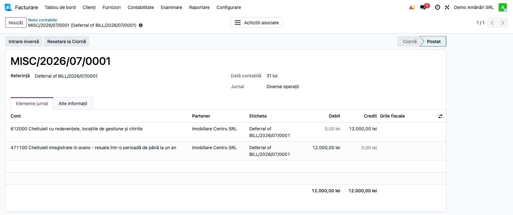
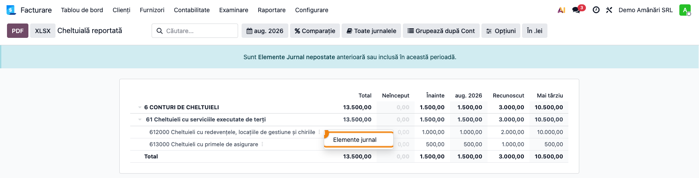
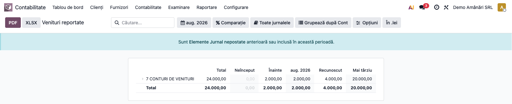
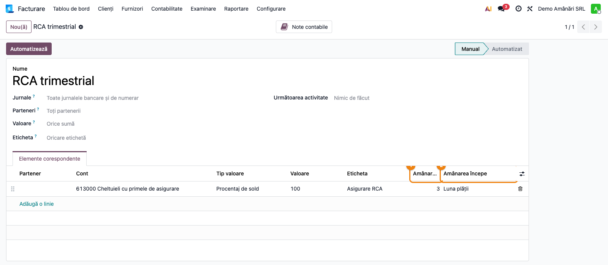
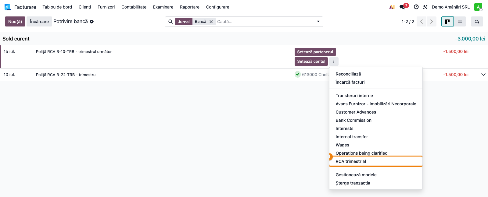
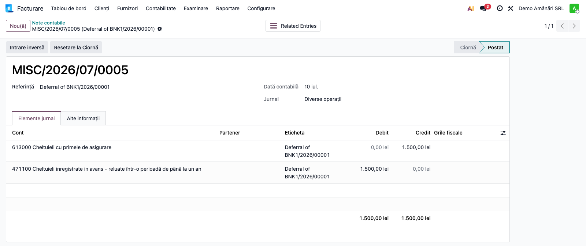

# Fișă Modul: Cheltuieli și Venituri Înregistrate în Avans (4711/4721)

**Poziție plan:** B8.3
**Modul:** `l10n_ro_deferred_entries`
**FR:** FR-33
**Capitol manual:** Cap 12.5
**Utilizator principal:** Contabil, Manager Contabilitate
**Prioritate:** 🟡 Medie (necesară pentru companii cu abonamente, asigurări sau chirii pe perioade lungi)

---

## 1. Scop business

Modulul configurează mecanismul nativ Odoo Enterprise de recunoaștere liniară a cheltuielilor
și veniturilor înregistrate în avans, adaptat planului de conturi românesc.

La instalare, setează automat conturile tranzitorii **4711** (Cheltuieli înregistrate în avans)
și **4721** (Venituri înregistrate în avans) pe compania românească. De la acel moment, contabilul
poate marca orice linie de factură cu un interval de recunoaștere — sau poate eșalona direct din
extras o plată fără factură (asigurări RCA / CASCO), printr-un model de reconciliere; Odoo generează automat intrările
de transfer și planifică notele lunare fără intervenție manuală.

Cazuri uzuale: prime de asigurare anuale plătite în avans, chirii trimestriale/anuale plătite sau
încasate anticipat, abonamente software multi-an, licențe facturate anticipat.

## 2. Bază legală și context

**OMFP 1802/2014 — pct. 351 alin. (1)–(2)** și **funcțiunea conturilor 471 și 472** reglementează
tratamentul cheltuielilor și veniturilor înregistrate în avans:

- **Cheltuieli în avans (471)**: cheltuielile efectuate în perioada curentă, dar care privesc
  perioade sau exerciții financiare viitoare (chirii, abonamente, asigurări etc.), se înregistrează
  în contul **4711** și se recunosc drept cheltuieli în perioada la care se referă.
- **Venituri în avans (472)**: veniturile înregistrate în perioada curentă, dar care privesc
  perioade sau exerciții financiare viitoare, se înregistrează în contul **4721** și se recunosc
  drept venituri în perioada la care se referă.

Funcțiunea contului 471 acoperă și *perioadele* viitoare, nu doar exercițiile: repartizarea lunară
în același exercițiu (de exemplu o asigurare pe un trimestru) este corectă și utilă pentru
rezultatul lunar.

Planul de conturi RO (l10n_ro) conține:
- `4711` — Cheltuieli înregistrate în avans (termen ≤ 1 an)
- `4712` — Cheltuieli înregistrate în avans (termen > 1 an)
- `4721` — Venituri înregistrate în avans (termen ≤ 1 an)
- `4722` — Venituri înregistrate în avans (termen > 1 an)

Modulul folosește implicit `4711` și `4721` (termen scurt). Contul de amânare este **o singură
setare pe companie**, deci nu poate distinge automat contractele sub și peste un an. Bilanțul cere
însă separat sumele de reluat în până la un an și în mai mult de un an: la închiderea exercițiului,
partea care se reia după mai mult de 12 luni se reclasifică manual (`Dr 4712 = Cr 4711`, respectiv
`Dr 4721 = Cr 4722`) și se stornează la redeschidere.

## 3. Utilizatori și roluri

**Utilizator zilnic:** Contabil (înregistrează facturile cu intervale de recunoaștere)

**Utilizator lunar:** Contabil / Manager contabilitate (verifică raportul și generează intrările dacă
metoda este „Manual și grupat")

Roluri recomandate pentru testare:
- Administrator funcțional: verifică configurarea automată 4711/4721 după instalare
- Contabil operațional: reproduce fluxul cheltuieli în avans (factură furnizor) și venituri
  în avans (factură client)
- Manager contabilitate: verifică rapoartele **Cheltuieli reportate / Venituri reportate**

## 4. Conturi și date implicate

| Cont | Descriere | Rol |
|------|-----------|-----|
| `4711` | Cheltuieli înregistrate în avans | Transit pentru cheltuielile amânate |
| `4721` | Venituri înregistrate în avans | Transit pentru veniturile amânate |
| `6xx` | Cont de cheltuieli (ex: 613, 612, 628) | Contul real al cheltuielii, recunoscut lunar |
| `7xx` | Cont de venituri (ex: 704, 706, 708) | Contul real al venitului, recunoscut lunar |

Date minime pentru demo:
- companie românească cu localizarea `l10n_ro` instalată
- modulul `l10n_ro_deferred_entries` instalat (activează configurarea 4711/4721)
- perioadă contabilă deschisă
- cel puțin un furnizor și un client de test
- jurnal Operațiuni diverse configurat

## 5. Configurare inițială

1. Instalați modulul `l10n_ro_deferred_entries`. Pe compania RO se setează automat:
   - **Cheltuială amânată** → `471100`
   - **Venit amânat** → `472100`
   - **Jurnal** (de amânare) → primul jurnal de Operațiuni diverse găsit

   Configurarea se aplică în ambele ordini de instalare: dacă planul de conturi RO se încarcă
   după modul, conturile vin direct din plan; dacă planul exista deja, le setează modulul la
   instalare (sau la actualizare, pentru bazele unde modulul era deja instalat).

   > **Atenție:** fără acest modul, Odoo Enterprise completează singur câmpurile cu primul cont
   > de activ / datorie curentă din plan — pe planul RO **301000** (Materii prime) și **161410**
   > (Împrumuturi). Amânările s-ar înregistra acolo **fără niciun mesaj de eroare**. Versiunile
   > modulului anterioare `19.0.2.0.1` nu corectau aceste valori.

2. Verificați configurarea: **Contabilitate → Configurare → Setări**, secțiunea
   **Conturi implicite** → grupurile **„Înregistrări de cheltuieli amânate"** și
   **„Înregistrări de venituri amânate"**.

3. Dacă doriți recunoaștere **manuală și grupată** (o singură notă per lună, pentru toate
   facturile): schimbați **„Generează înregistrare"** din `La validarea facturii` în
   `Manual și grupat`.

4. Alegeți metoda de calcul a proporției (**„Bazat pe"**):
   - `Luni` (implicit): fiecare lună completă primește cotă egală — recomandat pentru RO
   - `Zile`: calcul proporțional pe zile
   - `Luni complete`: orice lună începută contează ca lună completă

## 6. Flux de utilizare

### Pasul 1 — Verificare setări după instalare

Accesați **Contabilitate → Configurare → Setări** și derulați la secțiunea **Conturi implicite**.

Verificați, în grupurile **„Înregistrări de cheltuieli amânate"** și
**„Înregistrări de venituri amânate"**:
- **Cheltuială amânată** = `471100` — Cheltuieli înregistrate în avans
- **Venit amânat** = `472100` — Venituri înregistrate în avans
- **Jurnal** = un jurnal de Operațiuni diverse (implicit „Diverse operații")
- **Generează înregistrare** = `La validarea facturii`, **Bazat pe** = `Luni`


---

### Pasul 2 — Introducerea facturii furnizor

**Exemplu:** Chirie anuală facturată în avans — 12.000 RON + TVA 21%, perioadă 01.07.2026–30.06.2027

Accesați **Contabilitate → Furnizori → Facturi furnizori → Nou**.

Completați:
1. **Furnizor** — partenerul de la care vine factura
2. **Data facturii** — data documentului primit, **nu** data de azi
3. **Linia de factură** — produsul/serviciul, cantitatea și prețul



> **Data facturii contează pentru eșalonare.** Mai exact, **data contabilă** a facturii (câmpul
> „Dată contabilă", care poate diferi de data facturii — vezi captura de mai jos) devine data notei
> de amânare inițiale și
> punctul de la care Odoo numără notele lunare. Dacă lăsați data implicită (azi) pe o factură
> primită în urmă cu o lună, transferul intră în luna greșită, iar recunoașterile deja scadente
> se generează retroactiv. Corectați data **înainte** de confirmare.

**Contul de pe linie:** dacă introduceți un produs, contul vine din categoria produsului. Verificați
că este contul **real de cheltuieli** (`613` pentru asigurări, `612` chirii, `628` servicii) —
**nu** `4711`. Corectați-l direct pe linie dacă produsul aduce alt cont.

> **TVA:** exemplul folosește o chirie cu TVA 21% (locator care a optat pentru taxare).
> Primele de asigurare sunt **scutite de TVA fără drept de deducere** (Cod fiscal art. 292
> alin. (2) lit. b)) — pe o poliță eșalonată pe 613 nu apare `4426`.

---

### Pasul 3 — Afișarea coloanei „Dată amânată"

Coloana este ascunsă implicit. Apăsați iconița de **coloane opționale** (⚙, în capătul din dreapta
al capului de tabel) și bifați **„Dată amânată"**.



Completați apoi intervalul de recunoaștere pe linie: `01/07/2026 → 30/06/2027`.


Confirmați factura (**Confirmă**).

**Ce se întâmplă automat la postare:**

*Nota facturii (normală):*
```
Dr 612    12.000 RON   (Cheltuieli cu chiriile)
Dr 4426    2.520 RON   (TVA deductibil, 21%)
  Cr 401         14.520 RON   (Furnizori)
```

*Nota de amânare (generată automat, aceeași dată):*
```
  Cr 612   12.000 RON   ← neutralizare cheltuială în luna curentă
Dr 4711   12.000 RON   ← parcare în cheltuieli înregistrate în avans
```

*Note lunare de recunoaștere (câte 1.000 RON/lună, planificate automat):*
```
Dr 612    1.000 RON   ← cheltuiala recunoscută
  Cr 4711  1.000 RON   ← stingere sold avans
```

---

### Pasul 4 — Verificarea intrărilor de amânare

Pe factura postată, apăsați butonul smart **„Înregistrări de amânare"**, sus în dreapta.

> În Odoo 19.0 standard butonul apare în engleză, „Deferral Entries" (`msgstr` gol în
> `account_accountant/i18n/ro.po`). Traducerea o livrează modulul nostru, în `i18n/ro.po`.

Se deschide lista tuturor notelor generate: transferul inițial (`Dr 4711 = Cr 612`) și notele
lunare de recunoaștere.


Deschideți transferul inițial și verificați, în tabul **Elemente jurnal**, că liniile sunt
`Dr 471100 = Cr 612000` pe valoarea netă (fără TVA):



Notele lunare au starea `Ciornă` — se postează automat (o verificare pe zi) sau manual.

---

### Pasul 5 — Raportul „Cheltuieli reportate"

Accesați **Contabilitate → Raportare → Cheltuieli reportate**.

Raportul arată, per cont și per document sursă:
- **Total** — suma amânată
- **Neînceput** / **Înainte** — ce nu a intrat încă în recunoaștere, respectiv ce s-a recunoscut
  în perioadele anterioare
- coloana lunii curente, **Recunoscut** și **Mai târziu** — soldul rămas de recunoscut


Verificați că intervalul calendaristic este cel corect. Desfășurați liniile până la nivelul
contului, apoi, din meniul **⋮** de pe linie, alegeți **„Elemente jurnal"** ca să ajungeți la
documentul sursă:



---

### Pasul 6 — Venituri în avans (factură client)

**Exemplu:** Abonament anual facturat clientului — 24.000 RON, perioadă 01.07.2026–30.06.2027

Accesați **Contabilitate → Clienți → Facturi clienți → Nou**

Pe **linia de factură**:
- **Cont**: `704` — Venituri din servicii *(contul real de venituri, NU 4721)*
- **Sumă**: 24.000 RON
- **Dată amânată**: `01/07/2026 → 30/06/2027` (aceeași coloană opțională ca la furnizori)


La postare, Odoo generează:

*Nota facturii (normală):*
```
Dr 4111   29.040 RON   (Clienți)
  Cr 704         24.000 RON   (Venituri din servicii)
  Cr 4427         5.040 RON   (TVA colectată, 21%)
```

*Nota de amânare (automată):*
```
Dr 704    24.000 RON   ← neutralizare venit în luna curentă
  Cr 4721        24.000 RON   ← parcare în venituri înregistrate în avans
```

*Note lunare (2.000 RON/lună × 12 luni):*
```
Dr 4721   2.000 RON   ← stingere sold avans
  Cr 704         2.000 RON   ← venitul recunoscut
```

Verificarea se face simetric, din **Contabilitate → Raportare → Venituri reportate**:



---

### Pasul 7 — Plată în avans fără factură, direct din extras sau casă

**Exemplu:** poliță RCA plătită prin bancă în ianuarie 2026 — **1.500 RON**, aferentă
trimestrului I 2026 (ianuarie–martie). Nu există factură: asigurarea este scutită de TVA fără
drept de deducere (Cod fiscal art. 292 alin. (2) lit. b)), iar pentru aceste operațiuni
asigurătorul nu este obligat să emită factură (art. 319 alin. (7)). Documentele justificative
sunt **polița** și **extrasul de cont** (sau chitanța, la plata în numerar); raportul
**Cheltuieli reportate** ține loc de scadențarul cerut de funcțiunea contului 471.

> **Doar pentru plăți fără obligație de facturare** (asigurări RCA / CASCO / bunuri și alte
> operațiuni scutite fără factură). **Nu** folosiți funcția pentru chirii sau servicii
> facturabile: la un furnizor plătitor de TVA, plata în avans cere factură de avans (art. 319
> alin. (6) lit. d)) și trece prin `409`; la o chirie plătită unei persoane fizice, plătitorul
> reține impozit la sursă (art. 84^1), deci suma din extras nu e cheltuiala integrală. Acolo
> amânarea se face pe factură (Pasul 2). Din același motiv, amânarea pe model se poate seta
> **doar pe conturi de cheltuieli** — încasările în avans (472) trec prin factură.

**Configurare (o singură dată):** modelele de reconciliere nu au meniu propriu. Le deschideți
din **tabloul de bord Contabilitate → cardul jurnalului de bancă → meniul ⋮ → Modele**, sau
direct din reconciliere, **⋮ → Gestionează modele** (vezi captura 06a). Creați un model nou,
de exemplu „RCA trimestrial", iar pe linia de contrapartidă completați:
- **Cont**: `613` — Cheltuieli cu primele de asigurare
- **Tip valoare**: `Procentaj de sold`, **Valoare** `100`
- **Amânare (luni)**: `3`
- **Amânarea începe**: `Luna plății` (sau `Luna următoare`, dacă polița acoperă perioada care
  începe luna viitoare)



Faceți câte un model pentru fiecare tip de poliță recurentă (RCA trimestrial, RCA anual,
CASCO anual). Amânarea se poate seta doar pe un cont de cheltuieli (6xx) — pe alt cont modelul
refuză salvarea.

> **Perioada se calculează pe luni calendaristice:** începe în prima zi a lunii plății (sau a
> lunii următoare) și ține N luni. O poliță reală 16.01–15.04 se recunoaște astfel pe
> ianuarie–martie. Aproximarea e acceptabilă prin pragul de semnificație; menționați-o în
> politica contabilă. Pentru un model de peste 12 luni, partea de peste un an se reclasifică
> pe `4712` la închiderea exercițiului (vezi §2).

**Utilizare:** pe **tabloul de bord Contabilitate**, butonul de reconciliere al cardului
jurnalului de bancă deschide ecranul **Potrivire bancă**. Pe tranzacția nereconciliată
deschideți meniul **⋮** și alegeți modelul:



Contrapartida se creează pe `613` cu perioada **01.01.2026 → 31.03.2026**. Pe metoda
**„La validarea facturii"** (implicită), notele de amânare se generează **imediat**; pe
**„Manual și grupat"** ele intră în nota lunară generată din raportul Cheltuieli reportate.

```
Extras (15.01):            Dr 613    1.500   /  Cr 5121  1.500
Transfer (15.01, automat):  Dr 4711   1.500   /  Cr 613   1.500
31.01 / 28.02 / 31.03:      Dr 613      500   /  Cr 4711    500
```

Solduri la 31.03: `4711` = 0, `613` = 1.500. Transferul `4711 = 613` este o stornare în negru —
vezi „Stornare în negru și rulaje" mai jos (politica contabilă, rulajul 613 în luna plății).



**Corecții:** dacă ștergeți contrapartida, anulați reconcilierea, ștergeți sau anulați
tranzacția (de exemplu la reimportul extrasului), amânarea se anulează automat: ciornele
lunare încă nepostate se șterg, iar notele **postate se stornează la data lor** (sau în
prima zi deschisă, dacă luna e blocată) — nu se șterg, deci rămâne urma completă. Data
stornării urmează nota de extras, pe care Odoo o rescrie la data ei originală: așa, luna
tranzacției nu rămâne cu cheltuială negativă. Aplicând din nou modelul, se generează o
amânare nouă. Editarea etichetei păstrează notele existente; editarea **analiticului**
stornează notele și le regenerează cu analiticul nou. Contul unei linii deja amânate nu se
poate schimba (Odoo refuză): ștergeți contrapartida și aplicați modelul potrivit. Același
tratament se aplică la **Resetare la Ciornă** sau **Anulare** pe nota tranzacției.

> **Setați data de blocare după fiecare închidere de lună** (sau după depunerea D300 / D406).
> Modificarea unei tranzacții schimbă nota de extras **la data ei originală** — un
> comportament standard Odoo, pe care modulul nu îl poate evita. Într-o lună neblocată,
> corecția modifică deci luni care pot fi deja raportate. Cu data de blocare setată, Odoo
> refuză modificarea în luna închisă, iar corecția se face printr-o notă nouă, la data
> constatării (OMFP pct. 65 alin. (2)).

> **Perioade neregulate:** modelul are o durată fixă. Pentru o plată pe o perioadă atipică
> (de exemplu 7 luni) reconciliați tranzacția pe contul de cheltuieli, apoi pe nota contabilă
> a tranzacției: **Resetare la Ciornă** → coloana „Dată amânată" pe linia 6xx → **Postează**.
> Faceți asta doar într-o lună deschisă, încă neraportată. O acțiune ulterioară pe aceeași
> tranzacție în ecranul de reconciliere reface notele de amânare (stornare + generare nouă).

> **Impozit pe profit (RCA):** pentru vehiculele rutiere motorizate de cel mult 3.500 kg și
> cel mult 9 locuri (inclusiv șoferul) care nu sunt folosite exclusiv în scopul activității
> economice, cheltuiala intră în limita de deductibilitate de 50% (Cod fiscal art. 25 alin. (3)
> lit. l), cu excepțiile prevăzute acolo). Limita privește doar plătitorii de impozit pe profit,
> nu microîntreprinderile.

---

### Note de monografie și raportare

**Cheltuieli în avans — flux complet:**

| Moment | Dr | Cr | Sumă |
|--------|----|----|------|
| Factura furnizor | 612, 4426 | 401 | total factură |
| Nota amânare (automată) | 4711 | 612 | valoare netă |
| Recunoaștere lunară (×N luni) | 612 | 4711 | cotă lunară |

**Venituri în avans — flux complet:**

| Moment | Dr | Cr | Sumă |
|--------|----|----|------|
| Factura client | 4111 | 704, 4427 | total factură |
| Nota amânare (automată) | 704 | 4721 | valoare netă |
| Recunoaștere lunară (×N luni) | 4721 | 704 | cotă lunară |

Sold `4711`/`4721` la expirarea perioadei: **zero**.

**Stornare în negru și rulaje.** Nota de amânare (`Dr 4711 = Cr 612`, respectiv `Dr 704 = Cr 4721`)
iese din funcțiunea standard a conturilor: pe debitul 471 contrapartidele uzuale sunt 401, 512, 531.
Este o **stornare în negru** a cheltuielii (venitului) urmată de reclasificare, permisă de OMFP
pct. 69 „în funcție de politica contabilă și programele informatice utilizate" — **politica
contabilă a clientului trebuie să prevadă acest tratament**. Consecință: în luna documentului,
612/704 au rulaj în ambele sensuri. Soldul net e corect, dar indicatorii calculați din rulajul brut
(de exemplu cifra de afaceri din rulajul creditor 70x, pentru plafonul micro) ies supraevaluați —
calculați-i din **soldul net**.

## 7. Legături cu alte module / declarații

| Modul / proces | Rol în flux | Tip legătură |
|---|---|---|
| `account_accountant` | câmpuri `deferred_start_date`/`deferred_end_date`, generare intrări, rapoarte | dependență (manifest) |
| `i18n/ro.po` (modulul nostru) | completează traducerile RO lipsă din `account_accountant`: „Înregistrări de amânare", „Amânare diversă" | livrare proprie |
| `l10n_ro` | plan de conturi RO (4711/4721), localizare companie | dependență (manifest) |
| `account_reports` | rapoartele **Cheltuieli reportate** și **Venituri reportate** | dependență tranzitivă |
| `l10n_ro_anaf_d300` | soldurile 4711/4721 nu intră direct în D300; cheltuielile/veniturile recunoscute lunar intră prin 6xx/7xx | fără integrare directă |
| FR-27 (închidere lună) | integrarea verificării soldurilor 4711/4721 ca pre-condiție de închidere — planificată | iterația 2 |

**Ce este automat:** transferul la postarea facturii + planificarea notelor lunare.

**Ce rămâne manual:** verificarea raportului la finele lunii, postarea manuală dacă metoda este
„Manual și grupat", ajustarea contului de amânare dacă termenul > 1 an (4712/4722).

## 8. Verificări pentru consultant

- [ ] Instalarea modulului setează automat `471100` și `472100` în **Setări → Conturi implicite**.
- [ ] În setări **nu** apar `301000` / `161410` pe „Cheltuială amânată" / „Venit amânat". Dacă apar,
      actualizați modulul (cel puțin `19.0.2.0.1`) și verificați notele de amânare deja postate (vezi §9).
- [ ] Coloana opțională „Dată amânată" poate fi afișată pe liniile facturii (furnizor și client).
- [ ] **Data facturii** e cea a documentului primit — de ea depinde luna transferului.
- [ ] Contul de pe linie e cel real (6xx/7xx), nu 4711/4721, chiar dacă linia vine dintr-un produs.
- [ ] La postarea facturii cu „Dată amânată" completată, apare butonul smart **„Înregistrări de amânare"**.
- [ ] Butonul smart deschide minim 2 intrări: nota de transfer inițial + notele lunare planificate.
- [ ] Nota de transfer are `Dr 4711 = Cr 6xx` (cheltuieli) sau `Dr 7xx = Cr 4721` (venituri).
- [ ] Fiecare notă lunară are suma corectă: total / număr luni (ultima lună absoarbe rotunjirile).
- [ ] Raportul **Cheltuieli reportate / Venituri reportate** listează documentul cu soldul rămas.
- [ ] Din raport, meniul **⋮ → „Elemente jurnal"** duce la documentul sursă.
- [ ] La expirarea perioadei, soldul 4711/4721 pentru acel document este zero.
- [ ] Modelul de reconciliere cu **Amânare (luni)** apare în meniul **⋮** al tranzacției bancare.
- [ ] După aplicarea modelului, nota tranzacției are butonul **„Înregistrări de amânare"** cu
      transferul `Dr 4711 = Cr 6xx` și notele lunare.
- [ ] Ștergerea contrapartidei / anularea reconcilierii / ștergerea tranzacției lasă `4711` fără sold
      din acea tranzacție, iar notele postate apar **stornate** (nu șterse), la data lor.
- [ ] Modelul refuză **Amânare (luni)** pe un cont care nu e de cheltuieli (ex. 704).

## 9. Mesaje de eroare frecvente

| Mesaj / simptom | Cauză probabilă | Remediere |
|-----------------|-----------------|-----------|
| „Please set the deferred journal in the accounting settings." | Jurnalul de amânare nu a fost configurat (hook nu l-a găsit) | **Setări → Conturi implicite → Jurnal** (amânări) → selectați un jurnal de Operațiuni diverse |
| „Please set the deferred accounts in the accounting settings." | Contul 4711 sau 4721 lipsește din setări | **Setări → Conturi implicite → Cheltuială amânată / Venit amânat** → selectați manual 471100/472100 |
| Notele de amânare sunt pe `301000` (Materii prime) în loc de `471100`, fără nicio eroare | Conturile de amânare au rămas pe valorile puse automat de Odoo la încărcarea planului (versiuni ale modulului anterioare `19.0.2.0.1`) | Actualizați modulul (cel puțin `19.0.2.0.2`): setarea se corectează, iar **ciornele** lunare de amânare încă nepostate trec automat pe `471100`/`472100`. Notele deja postate se reclasifică manual — vezi „Corectarea notelor postate pe 301 / 161" mai jos |
| „Amânarea se poate seta doar pe un cont de cheltuieli…" | Pe linia modelului de reconciliere e completată **Amânare (luni)**, dar contul nu e de cheltuieli (ex. 4711, 401, 704) | Puneți contul real de cheltuieli (6xx) pe linie; transferul la 4711 îl face Odoo. Încasările în avans (472) se amână pe factură |
| „You cannot change the account for a deferred line…" | Ați încercat să schimbați contul contrapartidei după aplicarea unui model cu amânare | Ștergeți contrapartida (amânarea se stornează automat) și aplicați modelul potrivit |
| „Tranzacția face parte dintr-o înregistrare de amânare grupată…" | Metoda **Manual și grupat**: tranzacția a intrat deja într-o notă lunară grupată | Stornați întâi nota grupată din raportul Cheltuieli reportate, apoi modificați tranzacția. Stornarea notei grupate afectează **toate** documentele din grup — regenerați-o pentru celelalte după corecție |
| Butonul „Înregistrări de amânare" nu apare după postare | Câmpul „Dată amânată" nu a fost completat pe linie, sau linia este pe un cont care nu este de tip `expense`/`income` | Verificați că linia e pe 6xx (cheltuieli) sau 7xx (venituri) și că intervalul de date este completat. Dacă linia vine dintr-un produs, contul poate fi cel din categoria produsului |
| Notele lunare rămân în stare „Ciornă" | Serverul verifică o dată pe zi — poate dura până la 24 ore | Postați-le manual din lista deschisă de butonul „Înregistrări de amânare" |
| Nu apare butonul **„Generează înregistrare"** în raport | Butonul există doar când metoda e `Manual și grupat`; pe `La validarea facturii` notele sunt deja generate | Verificați **Setări → Conturi implicite → Generează înregistrare** |
| „Dată amânată" devine needitabilă după postare | Comportament normal — nu se pot modifica datele pe o linie cu intrări de amânare deja generate | Resetați factura la ciornă (anulați intrările de amânare) → corectați → repostați |

### Corectarea notelor postate pe 301 / 161

Se aplică pe metoda **„La validarea facturii"**. Pe metoda **„Manual și grupat"** nota de sfârșit
de lună are inversare automată în ziua următoare, deci soldul pe 301 se anulează singur — nu se
reclasifică nimic; se menționează doar în notele explicative, dacă un bilanț aprobat a fost afectat.

1. **Identificați notele:** jurnalul de amânare, contul `301000` (respectiv `161410`), referința
   „Deferral of …". Filtrul pe jurnal separă notele de amânare de mișcările reale de stoc.
2. **Calculați soldul rămas pe document:** suma amânată minus recunoașterile lunare deja postate.
   Exemplu: chirie 12.000 RON pe 12 luni, 3 luni recunoscute → 9.000 RON.
3. **Notă de corecție** (jurnal Operațiuni diverse, fără partener, fără taxe), la data constatării
   (OMFP pct. 65 alin. (2)):
   - cheltuieli: `Dr 4711 = Cr 301` — soldul rămas;
   - venituri: `Dr 1614 = Cr 4721` — soldul rămas.
4. **Verificați ciornele** rămase: după actualizarea modulului trebuie să fie pe `471100` /
   `472100`. Dacă nu, schimbați contul pe ele **înainte** de data postării automate.

Eroarea este **doar de clasificare în bilanț** — rezultatul (612, 704 etc.) e corect. Nu se
folosește contul 1174. Dacă eroarea a intrat într-un bilanț anual aprobat, se prezintă în notele
explicative.

**Alternativa „factura repusă în ciornă și repostată"** stornează notele postate și șterge ciornele,
dar mută stornările în luna curentă, iar factura este deja raportată în D300, D394 și D406. Folosiți-o
**doar** dacă toate lunile afectate sunt deschise și nedeclarate.

**Implicații de verificat la client:**
- **Inventar:** soldul contabil fals de pe 301 nu are acoperire în stoc faptic și apare ca
  **lipsă** la inventariere. Nu îl înregistrați ca `601 = 301`.
- **Închiderea valorizării stocului (Odoo 19):** dacă 301000 e cont de valorizare pe o categorie de
  produse, închiderea automată poate să fi „închis" soldul fals pe variația de stoc (în contul de
  profit și pierdere). Stornați întâi partea aferentă acelei închideri, altfel reclasificarea dublează
  corecția.
- **Bilanț și D406 (SAF-T):** stocurile au fost supraevaluate și cheltuielile în avans subevaluate
  (la venituri: 161 umflat, 472 subevaluat). Corecția apare în luna în care se face.
- **D300 / D101:** neafectate — notele de amânare nu au taxe, iar 6xx/7xx sunt corecte.

## 10. Capturi de ecran

Capturile (`readme/screenshots/`) sunt **generate automat** din `tests/test_screenshots.py`
(mixinul `ScreenshotCase` din `l10n_ro_doc_screenshots`, import defensiv), în **limba română**,
pe planul de conturi RO (`setup_country("ro")` → conturile 471100/472100):

1. `01_setari_conturi_amanare.png` — Setări contabile cu conturile 471100/472100, așa cum le lasă
   modulul (testul nu le mai setează manual — captura verifică efectiv configurarea automată).
2. `02a_factura_furnizor_antet.png` — Factură furnizor în ciornă: furnizor, data facturii, linia cu produs și preț.
3. `02b_coloane_optionale.png` — Dropdown-ul de coloane opționale, de unde se afișează „Dată amânată".
4. `02_factura_furnizor_deferred.png` — Factură furnizor cu „Dată amânată" completată pe linia 612.
5. `03_intrari_cheltuieli_amanate.png` — Lista intrărilor de amânare (buton smart), cu nota transfer și notele lunare.
6. `03a_nota_amanare_jurnal.png` — Nota de amânare inițială: `Dr 471100 = Cr 612000`.
7. `04_raport_cheltuieli_amanate.png` — Raportul **Cheltuieli reportate** cu soldul 4711 per cont.
8. `04a_raport_drill_down.png` — Drill-down din raport: meniul ⋮ → „Elemente jurnal".
9. `05_factura_client_deferred.png` — Factură client cu „Dată amânată" completată pe linia 704.
10. `05a_raport_venituri_amanate.png` — Raportul **Venituri reportate** cu soldul 4721 per cont.
11. `06_model_reconciliere_amanare.png` — Modelul de reconciliere „RCA trimestrial" cu amânare pe 3 luni.
12. `06a_reconciliere_buton_rca.png` — Reconcilierea bancară: meniul ⋮ cu modelul de amânare.
13. `06b_extras_nota_amanare.png` — Transferul generat din extras: `Dr 471100 = Cr 613000`.

Regenerare:

```bash
./odoo/odoo-bin -c odoo.conf -d <db> -i l10n_ro_deferred_entries,l10n_ro_doc_screenshots \
    --test-tags=fise_screenshots --stop-after-init
```

## 11. Observații pentru manual

Diferența esențială față de practica manuală: utilizatorul **nu mai pune suma pe contul 4711/4721**
direct în factură. Suma se înregistrează pe contul de cheltuieli/venituri real (`612`, `613`, `704` etc.),
iar sistemul face automat transferul la 4711/4721 și planifică recunoașterea lunară.

Această abordare este conformă cu mecanismul nativ Enterprise (`account_accountant`) și elimină
nevoia de a crea manual planuri de recunoaștere (metoda folosită anterior cu `account.asset`).
