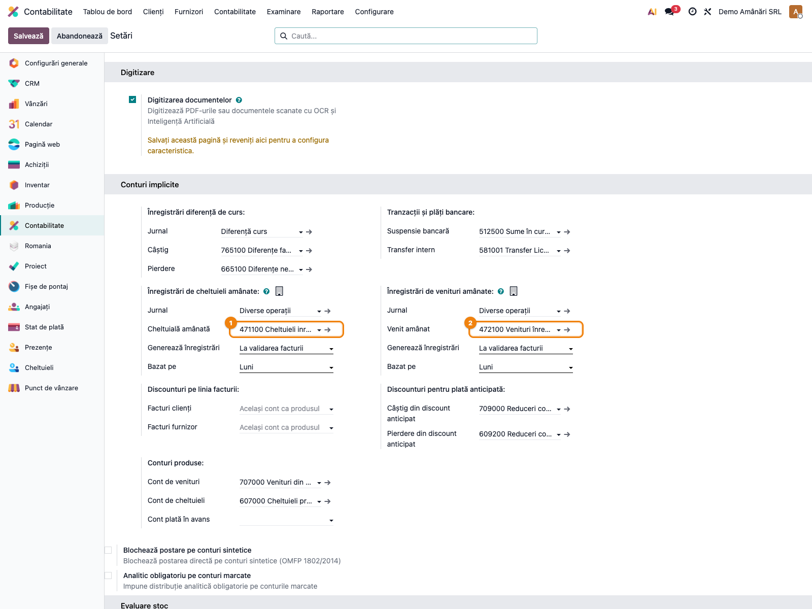
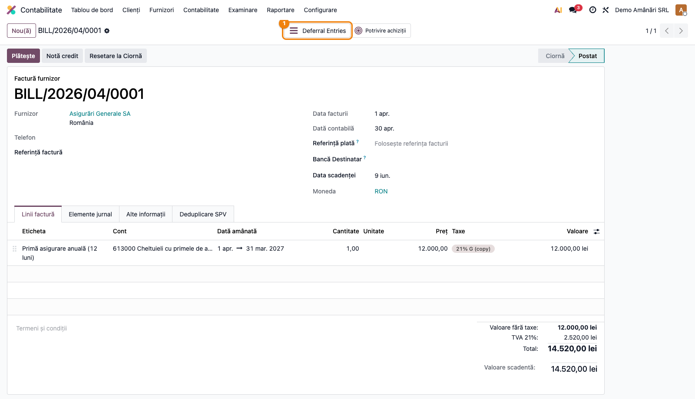
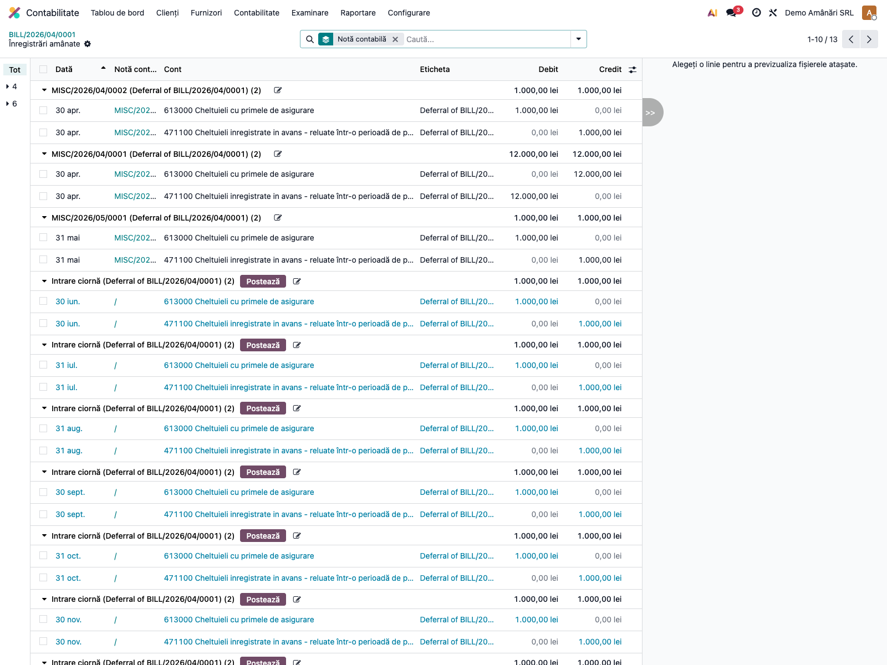
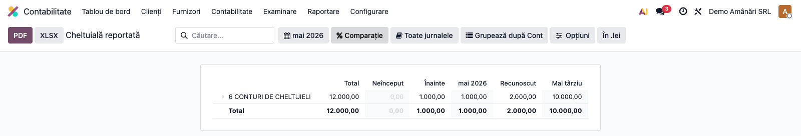
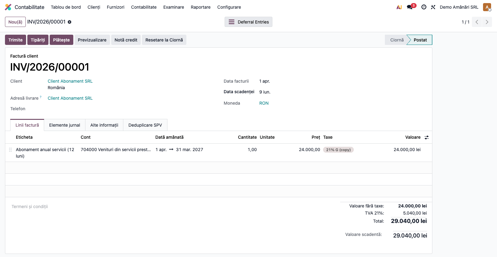

# Fișă Modul: Cheltuieli și Venituri Înregistrate în Avans (4711/4721)

**Poziție plan:** B8.3
**Modul:** `l10n_ro_deferred_entries`
**FR:** FR-33
**Capitol manual:** Cap 12.5
**Utilizator principal:** Contabil, Manager Contabilitate
**Prioritate:** 🟡 Medie (necesară pentru companii cu abonamente, asigurări sau chirii pe perioade lungi)

---

## 1. Scop business

Modulul configurează mecanismul nativ Odoo Enterprise de recunoaștere liniară a cheltuielilor
și veniturilor înregistrate în avans, adaptat planului de conturi românesc.

La instalare, setează automat conturile tranzitorii **4711** (Cheltuieli înregistrate în avans)
și **4721** (Venituri înregistrate în avans) pe compania românească. De la acel moment, contabilul
poate marca orice linie de factură cu un interval de recunoaștere; Odoo generează automat intrările
de transfer și planifică notele lunare fără intervenție manuală.

Cazuri uzuale: prime de asigurare anuale plătite în avans, chirii trimestriale/anuale plătite sau
încasate anticipat, abonamente software multi-an, licențe facturate anticipat.

## 2. Bază legală și context

**OMFP 1802/2014 — pct. 233–237** reglementează tratamentul cheltuielilor și veniturilor
înregistrate în avans:

- **Pct. 233–234**: cheltuielile efectuate în exercițiul curent, dar aferente exercițiilor
  viitoare, se înregistrează în contul **4711** și se recunosc drept cheltuieli în perioada
  la care se referă.
- **Pct. 235–237**: veniturile înregistrate în exercițiul curent, dar aferente exercițiilor
  viitoare, se înregistrează în contul **4721** și se recunosc drept venituri în perioada
  la care se referă.

Planul de conturi RO (l10n_ro) conține:
- `4711` — Cheltuieli înregistrate în avans (termen ≤ 1 an)
- `4712` — Cheltuieli înregistrate în avans (termen > 1 an)
- `4721` — Venituri înregistrate în avans (termen ≤ 1 an)
- `4722` — Venituri înregistrate în avans (termen > 1 an)

Modulul folosește implicit `4711` și `4721` (termen scurt). Dacă doriți `4712`/`4722`, ajustați
manual din **Setări contabile**.

## 3. Utilizatori și roluri

**Utilizator zilnic:** Contabil (înregistrează facturile cu intervale de recunoaștere)

**Utilizator lunar:** Contabil / Manager contabilitate (verifică raportul și generează intrările dacă
metoda este „Manual și grupat")

Roluri recomandate pentru testare:
- Administrator funcțional: verifică configurarea automată 4711/4721 după instalare
- Contabil operațional: reproduce fluxul cheltuieli în avans (factură furnizor) și venituri
  în avans (factură client)
- Manager contabilitate: verifică rapoartele **Deferred Expense / Deferred Revenue**

## 4. Conturi și date implicate

| Cont | Descriere | Rol |
|------|-----------|-----|
| `4711` | Cheltuieli înregistrate în avans | Transit pentru cheltuielile amânate |
| `4721` | Venituri înregistrate în avans | Transit pentru veniturile amânate |
| `6xx` | Cont de cheltuieli (ex: 613, 612, 628) | Contul real al cheltuielii, recunoscut lunar |
| `7xx` | Cont de venituri (ex: 704, 706, 708) | Contul real al venitului, recunoscut lunar |

Date minime pentru demo:
- companie românească cu localizarea `l10n_ro` instalată
- modulul `l10n_ro_deferred_entries` instalat (activează configurarea 4711/4721)
- perioadă contabilă deschisă
- cel puțin un furnizor și un client de test
- jurnal Operațiuni diverse configurat

## 5. Configurare inițială

1. Instalați modulul `l10n_ro_deferred_entries`. La instalare, `post_init_hook` setează automat
   pe compania RO:
   - **Deferred Expense Account** → `4711`
   - **Deferred Revenue Account** → `4721`
   - **Deferred Journal** → primul jurnal de Operațiuni diverse găsit

2. Verificați configurarea: **Contabilitate → Configurare → Setări**, secțiunea
   **„Cheltuieli și venituri amânate"** (Deferred Revenues and Expenses).

3. Dacă doriți recunoaștere **manuală și grupată** (o singură intrare per lună, pentru toate
   facturile): schimbați **„Generate Entries"** din `On bill validation` în `Manually & Grouped`.

4. Alegeți metoda de calcul a proporției (**„Based on"**):
   - `Months` (implicit): fiecare lună completă primește cotă egală — recomandat pentru RO
   - `Days`: calcul proporcional pe zile
   - `Full Months`: orice lună începută contează ca lună completă

## 6. Flux de utilizare

### Pasul 1 — Verificare setări după instalare

Accesați **Contabilitate → Configurare → Setări** și derulați la secțiunea
**„Deferred Revenues and Expenses"**.

Verificați că:
- **Deferred Expense Account** = `4711`
- **Deferred Revenue Account** = `4721`
- **Deferred Expense/Revenue Journal** = un jurnal de Operațiuni diverse



---

### Pasul 2 — Înregistrare cheltuieli în avans (factură furnizor)

**Exemplu:** Primă de asigurare anuală — 12.000 RON, perioadă 01.06.2026–31.05.2027

Accesați **Contabilitate → Furnizori → Facturi furnizori → Nou**

Pe **linia de factură**:
- **Cont**: `613` — Cheltuieli cu primele de asigurare *(contul real de cheltuieli, NU 4711)*
- **Sumă**: 12.000 RON
- **Deferred Date**: activați coloana opțională „Deferred Date" → completați
  `01/06/2026 → 31/05/2027`

> Coloana „Deferred Date" este ascunsă implicit. Afișați-o din iconița de coloane (⚙) a
> tabelului de linii.



Postați factura (**Confirmă**).

**Ce se întâmplă automat la postare:**

Odoo generează două intrări suplimentare față de nota obișnuită a facturii:

*Nota facturii (normală):*
```
Dr 613    12.000 RON   (Cheltuieli cu asigurările)
Dr 4426    2.280 RON   (TVA deductibil)
  Cr 401         14.280 RON   (Furnizori)
```

*Nota de amânare (generată automat, aceeași dată):*
```
  Cr 613   12.000 RON   ← neutralizare cheltuială în luna curentă
Dr 4711   12.000 RON   ← parcare în cheltuieli înregistrate în avans
```

*Note lunare de recunoaștere (câte 1.000 RON/lună, planificate automat):*
```
Dr 613    1.000 RON   ← cheltuiala recunoscută
  Cr 4711  1.000 RON   ← stingere sold avans
```

---

### Pasul 3 — Vizualizare intrări de amânare

Pe factura postată, apăsați butonul smart **„Deferred Entries"** din bara de stat.

Se deschide lista tuturor intrărilor generate: nota de transfer inițial (`Dr 4711 = Cr 613`)
și toate notele lunare de recunoaștere planificate.



Notele lunare au starea `Planificat` — se postează automat zilnic (cron) sau manual.

---

### Pasul 4 — Raport cheltuieli amânate (sold 4711 per document)

Accesați **Contabilitate → Raportare → Deferred Expense**

Raportul arată, per linie de factură cu interval de recunoaștere:
- suma totală amânată
- suma recunoscută până la data raportului
- suma rămasă de recunoscut



---

### Pasul 5 — Înregistrare venituri în avans (factură client)

**Exemplu:** Abonament anual facturat clientului — 24.000 RON, perioadă 01.07.2026–30.06.2027

Accesați **Contabilitate → Clienți → Facturi clienți → Nou**

Pe **linia de factură**:
- **Cont**: `704` — Venituri din servicii *(contul real de venituri, NU 4721)*
- **Sumă**: 24.000 RON
- **Deferred Date**: `01/07/2026 → 30/06/2027`



La postare, Odoo generează:

*Nota facturii (normală):*
```
Dr 4111   28.560 RON   (Clienți)
  Cr 704         24.000 RON   (Venituri din servicii)
  Cr 4427         4.560 RON   (TVA colectată)
```

*Nota de amânare (automată):*
```
Dr 704    24.000 RON   ← neutralizare venit în luna curentă
  Cr 4721        24.000 RON   ← parcare în venituri înregistrate în avans
```

*Note lunare (2.000 RON/lună × 12 luni):*
```
Dr 4721   2.000 RON   ← stingere sold avans
  Cr 704         2.000 RON   ← venitul recunoscut
```

---

### Note de monografie și raportare

**Cheltuieli în avans — flux complet:**

| Moment | Dr | Cr | Sumă |
|--------|----|----|------|
| Factura furnizor | 613, 4426 | 401 | total factură |
| Nota amânare (automată) | 4711 | 613 | valoare netă |
| Recunoaștere lunară (×N luni) | 613 | 4711 | cotă lunară |

**Venituri în avans — flux complet:**

| Moment | Dr | Cr | Sumă |
|--------|----|----|------|
| Factura client | 4111 | 704, 4427 | total factură |
| Nota amânare (automată) | 704 | 4721 | valoare netă |
| Recunoaștere lunară (×N luni) | 4721 | 704 | cotă lunară |

Sold `4711`/`4721` la expirarea perioadei: **zero**.

## 7. Legături cu alte module / declarații

| Modul / proces | Rol în flux | Tip legătură |
|---|---|---|
| `account_accountant` | câmpuri `deferred_start_date`/`deferred_end_date`, generare intrări, rapoarte | dependență (manifest) |
| `l10n_ro` | plan de conturi RO (4711/4721), localizare companie | dependență (manifest) |
| `account_reports` | rapoarte **Deferred Expense** și **Deferred Revenue** | dependență tranzitivă |
| `l10n_ro_anaf_d300` | soldurile 4711/4721 nu intră direct în D300; cheltuielile/veniturile recunoscute lunar intră prin 6xx/7xx | fără integrare directă |
| FR-27 (închidere lună) | integrarea verificării soldurilor 4711/4721 ca pre-condiție de închidere — planificată | iterația 2 |

**Ce este automat:** transferul la postarea facturii + planificarea notelor lunare.

**Ce rămâne manual:** verificarea raportului la finele lunii, postarea manuală dacă metoda este
„Manually & Grouped", ajustarea contului de amânare dacă termenul > 1 an (4712/4722).

## 8. Verificări pentru consultant

- [ ] Instalarea modulului setează automat `4711` și `4721` în **Setări → Deferred Revenues and Expenses**.
- [ ] Coloana „Deferred Date" apare opțional pe liniile facturii (furnizor și client).
- [ ] La postarea facturii cu Deferred Date completat, apare butonul smart **„Deferred Entries"**.
- [ ] Butonul smart deschide minim 2 intrări: nota de transfer inițial + notele lunare planificate.
- [ ] Nota de transfer are `Dr 4711 = Cr 6xx` (cheltuieli) sau `Dr 7xx = Cr 4721` (venituri).
- [ ] Fiecare notă lunară are suma corectă: total / număr luni (ultima lună absoarbe rotunjirile).
- [ ] Raportul **Deferred Expense/Revenue** listează factura cu soldul rămas.
- [ ] La expirarea perioadei, soldul 4711/4721 pentru acel document este zero.

## 9. Mesaje de eroare frecvente

| Mesaj / simptom | Cauză probabilă | Remediere |
|-----------------|-----------------|-----------|
| „Please set the deferred journal in the accounting settings." | Jurnalul de amânare nu a fost configurat (hook nu l-a găsit) | **Setări → Deferred Journal** → selectați un jurnal de Operațiuni diverse |
| „Please set the deferred accounts in the accounting settings." | Contul 4711 sau 4721 lipsește din setări | **Setări → Deferred Expense/Revenue Account** → selectați manual 4711/4721 |
| Butonul „Deferred Entries" nu apare după postare | Câmpul „Deferred Date" nu a fost completat pe linie, sau linia este pe un cont care nu este de tip `expense`/`income` | Verificați că linia e pe 6xx (cheltuieli) sau 7xx (venituri) și că intervalul de date este completat |
| Notele lunare rămân în stare „Draft" | Serverul verifică o dată pe zi — poate dura până la 24 ore | Postați manual din raportul Deferred Expense → **Generate Entries** |
| Deferred Date devine readonly după postare | Comportament normal — nu se pot modifica datele pe o linie cu intrări de amânare deja generate | Resetați factura la ciornă (anulați intrările de amânare) → corectați → repostați |

## 10. Capturi de ecran

Capturile (`readme/screenshots/`) sunt **generate automat** din `tests/test_screenshots.py`
(mixinul `ScreenshotCase` din `l10n_ro_doc_screenshots`, import defensiv), în **limba română**,
pe planul de conturi RO (`setup_country("ro")` → conturile 4711/4721):

1. `01_setari_conturi_amanare.png` — Setări contabile cu conturile 4711/4721 configurate.
2. `02_factura_furnizor_deferred.png` — Factură furnizor cu coloana „Deferred Date" completată pe linia 613.
3. `03_intrari_cheltuieli_amanate.png` — Lista intrărilor de amânare (smart button), cu nota transfer și notele lunare.
4. `04_raport_cheltuieli_amanate.png` — Raportul **Deferred Expense** cu soldul 4711 per document.
5. `05_factura_client_deferred.png` — Factură client cu „Deferred Date" completat pe linia 704.

Regenerare:

```bash
./odoo/odoo-bin -c odoo.conf -d <db> -i l10n_ro_deferred_entries,l10n_ro_doc_screenshots \
    --test-tags=fise_screenshots --stop-after-init
```

## 11. Observații pentru manual

Diferența esențială față de practica manuală: utilizatorul **nu mai pune suma pe contul 4711/4721**
direct în factură. Suma se înregistrează pe contul de cheltuiești/venituri real (`613`, `704` etc.),
iar sistemul face automat transferul la 4711/4721 și planifică recunoașterea lunară.

Această abordare este conformă cu mecanismul nativ Enterprise (`account_accountant`) și elimină
nevoia de a crea manual planuri de recunoaștere (metoda folosită anterior cu `account.asset`).
