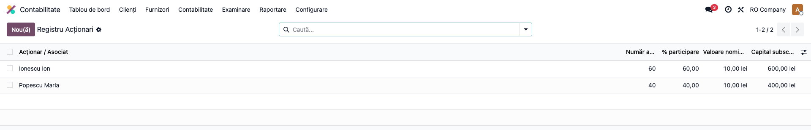
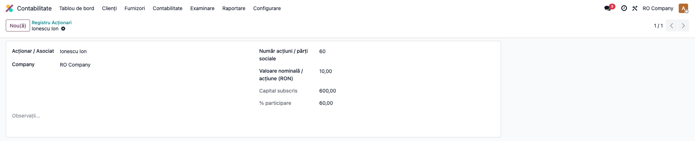
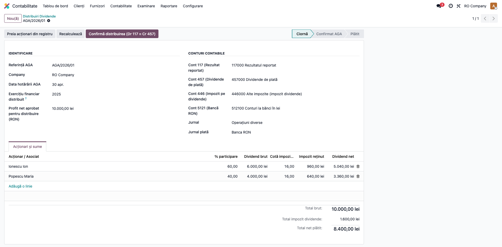
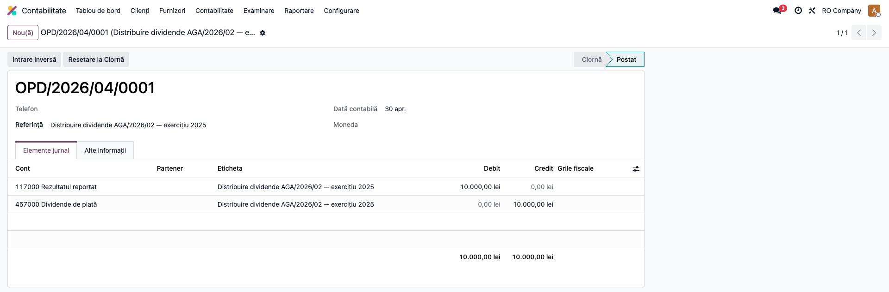
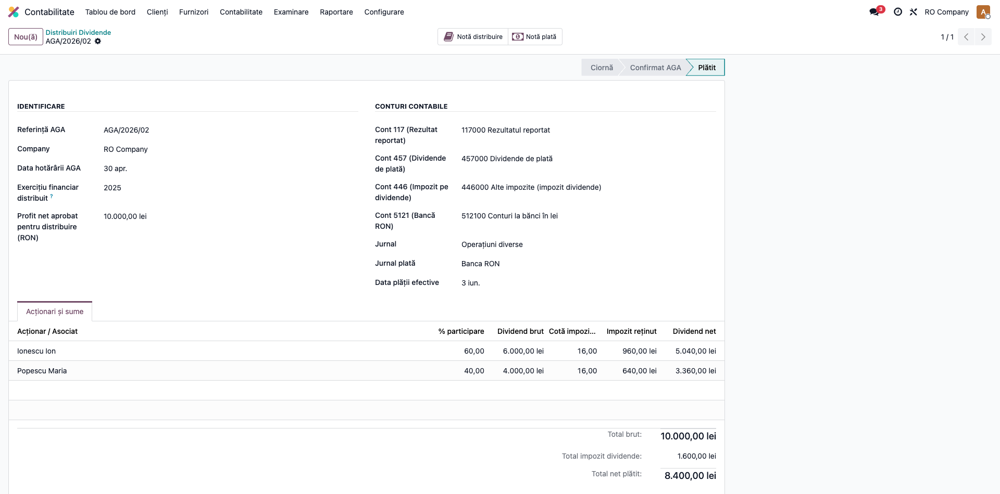

# Fișă Modul: Dividende și Registru Acționari

**Modul:** `l10n_ro_dividends`
**Capitol manual:** Cap 12.1 — Dividende și Registru Acționari
**Utilizator principal:** Contabil, Director Financiar
**Prioritate:** 🟡 Medie

---

## 1. Scop business

Gestionează complet procesul de distribuire a dividendelor: de la hotărârea AGA
până la plata netă către acționari și vărsarea impozitului la stat.

Modulul automatizează:
- Calculul dividendului brut per acționar (proporțional cu participarea)
- Reținerea impozitului pe dividende în funcție de data distribuirii
- Generarea notelor contabile obligatorii
- Furnizarea datelor pentru D100 și D205

---

## 2. Bază legală

- **Codul Fiscal art. 97** — impozit pe dividende pentru persoane fizice rezidente
- **Legea nr. 141/2025** — cotă 16% pentru dividende distribuite începând cu 1 ianuarie 2026
- **Legea 31/1990 art. 67** — dreptul la dividende și procedura AGA
- **OMFP 1802/2014** — monografia contabilă Dr 117 = Cr 457; Dr 457 = Cr 446 + 5121

Regulă de tranziție: distribuțiile aprobate în 2025 folosesc cota de 10%, inclusiv pentru dividende interimare aferente bilanțurilor interimare 2025 care se regularizează ulterior. Distribuțiile aprobate prin hotărâre AGA începând cu 1 ianuarie 2026 folosesc cota de 16%, indiferent dacă profitul provine din exercițiul curent sau din profit reportat.

CASS 10% pentru persoane fizice nu este reținută la sursă de societate în acest flux. Beneficiarul o datorează prin Declarația Unică dacă veniturile extrasalariale cumulate ating plafoanele de 6, 12 sau 24 salarii minime brute.

---

## 3. Utilizatori și roluri

| Rol Odoo | Acțiune |
|----------|---------|
| Contabil | Creare hotărâre AGA, confirmare, înregistrare plată |
| Manager Contabilitate | Aprobare și verificare note contabile |
| Director Financiar | Aprobare distribuire |

---

## 4. Configurare inițială

### 4.1 Definire acționari

**Contabilitate → Dividende → Registru Acționari → Nou**



Completați pentru fiecare acționar/asociat:

| Câmp | Exemplu |
|------|---------|
| **Partener** | Popescu Ion (persoană fizică) |
| **Număr acțiuni/părți sociale** | 600 |
| **Valoare nominală** (RON/acțiune) | 10 RON |

Câmpul **% Participare** se calculează automat din totalul acțiunilor.



### 4.2 Configurare conturi contabile

La prima utilizare, verificați în **Contabilitate → Configurare → Setări → Dividende**:

| Câmp | Cont standard |
|------|--------------|
| Cont profit distribuit | 117 |
| Cont dividende de plată | 457 |
| Cont impozit dividende | 446 |
| Cont bancă plată | 5121 |

---

## 5. Flux de utilizare — Distribuire dividende

### Pasul 1 — Creare hotărâre AGA

**Contabilitate → Dividende → Distribuiri Dividende → Nou**



Completați:

| Câmp | Exemplu | Observație |
|------|---------|-----------|
| **Referință AGA** | `AGA/2026/01` | Numărul hotărârii AGA |
| **Data AGA** | `28.04.2026` | Data hotărârii |
| **Exercițiu financiar** | `2025` | Exercițiul din care se distribuie |
| **Profit net aprobat** | `100.000 RON` | Suma votată în AGA |
| **Jurnal** | Operațiuni Diverse | Jurnalul pentru note contabile |

### Pasul 2 — Preluare acționari

Click **Preia acționari din registru** → liniile se completează automat cu:
- Procentele fiecărui acționar
- Dividendul brut calculat (profit × %)
- Impozitul reținut conform cotei aplicabile datei AGA
- Dividendul net de plată


**Exemplu pentru profit 100.000 RON, 2 acționari 60%/40%:**

| Acționar | % | Brut | Impozit 16% | Net |
|----------|---|------|-----------|-----|
| Popescu Ion | 60% | 60.000 | 9.600 | 50.400 |
| Ionescu Maria | 40% | 40.000 | 6.400 | 33.600 |
| **Total** | | **100.000** | **16.000** | **84.000** |

### Pasul 3 — Confirmare AGA

Click **Confirmă distribuirea** → se generează automat nota:

| Cont | Debit | Credit |
|------|-------|--------|
| 117 — Profit nerepartizat | 100.000 | |
| 457 — Dividende de plată | | 100.000 |



### Pasul 4 — Înregistrare plată

Setați **Data plății efective** și click **Înregistrează plata** → se generează:

| Cont | Debit | Credit |
|------|-------|--------|
| 457 — Dividende de plată | 16.000 | |
| 446 — Impozit dividende | | 16.000 |

| Cont | Debit | Credit |
|------|-------|--------|
| 457 — Dividende de plată | 84.000 | |
| 5121 — Bancă | | 84.000 |



---

## 6. Legătură cu D100, D205 și CASS

Impozitul reținut în contul 446 trebuie declarat și plătit prin **D100** până la data de 25 a lunii următoare plății/distribuirii, conform încadrării fiscale aplicabile.

Datele din modulul dividende alimentează **D205** pentru raportarea anuală a veniturilor cu reținere la sursă. Pentru nerezidenți, fluxul se corelează cu D207/WHT.

CASS pentru persoane fizice nu se calculează în nota societății. Consultantul trebuie să explice beneficiarului că obligația se stabilește în Declarația Unică dacă veniturile extrasalariale cumulate depășesc plafoanele de 6, 12 sau 24 salarii minime brute.

---

## 7. Mesaje de eroare frecvente

| Mesaj | Cauză | Remediere |
|-------|-------|-----------|
| „Nu există acționari în registru" | Registrul acționarilor este gol | Adăugați acționarii înainte de distribuire |
| „Procentele nu totalizează 100%" | Eroare în registru acționari | Verificați și corectați numărul de acțiuni |
| „Contul 117 nu are sold suficient" | Profit insuficient | Verificați balanța contului 117 |
| „Data AGA este în viitor" | Dată greșită | Corectați data hotărârii AGA |

---

## 8. Capturi de ecran

Capturile din această fișă (`readme/screenshots/`) sunt **generate automat** din testul
`tests/test_screenshots.py` (HttpCase + Playwright), pe date seedate determinist. Regenerare:

```bash
./odoo/odoo-bin -c odoo.conf -d <db> -i l10n_ro_dividends \
    --test-tags=fise_screenshots --stop-after-init
```

Necesită `playwright` instalat în mediul Odoo (`uv pip install --python .venv/bin/python playwright`)
și Chrome de sistem. Dacă `playwright` lipsește, testul se sare (nu eșuează).
