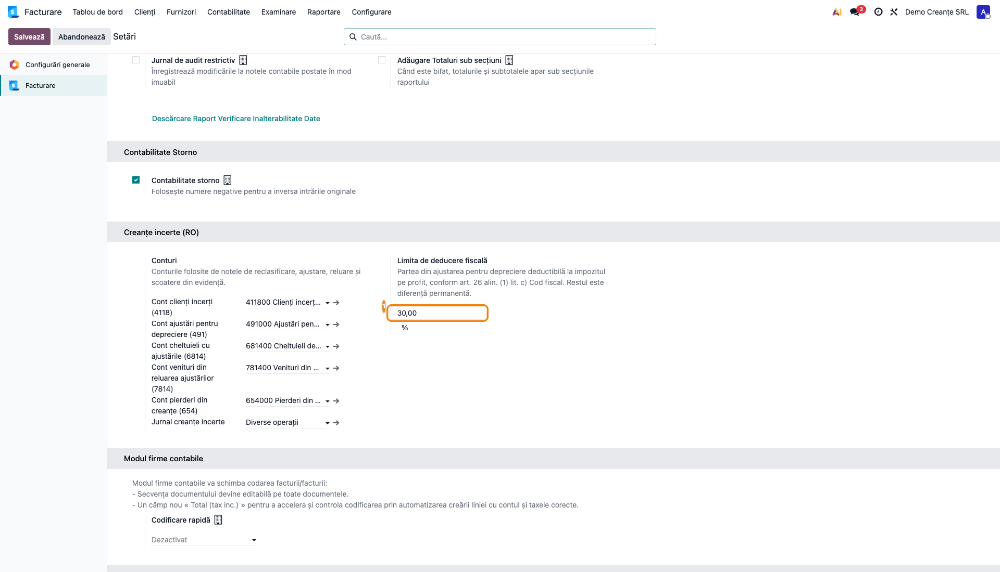
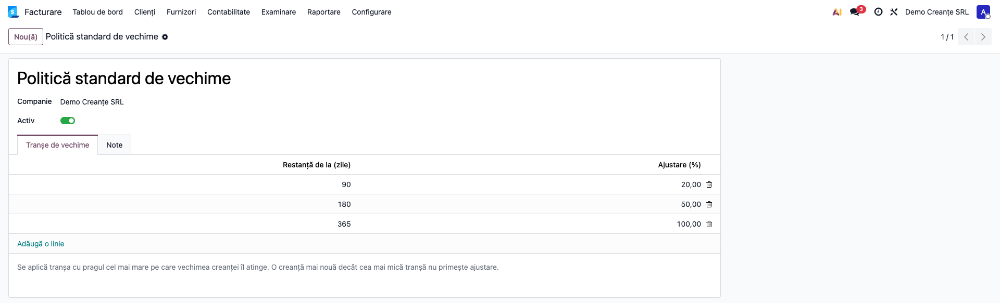
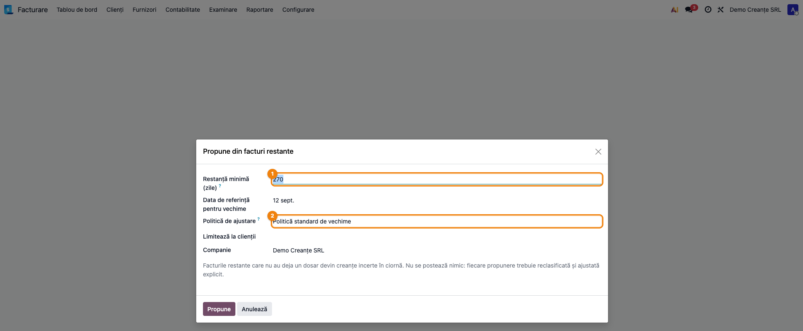
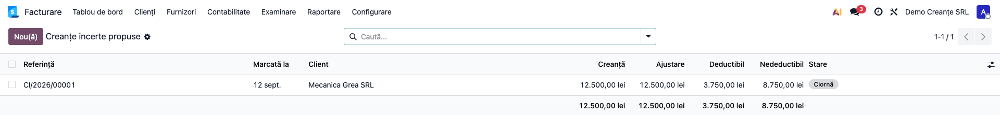
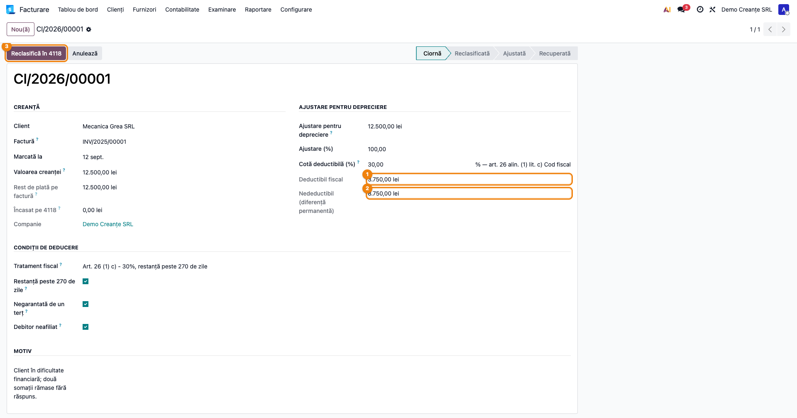
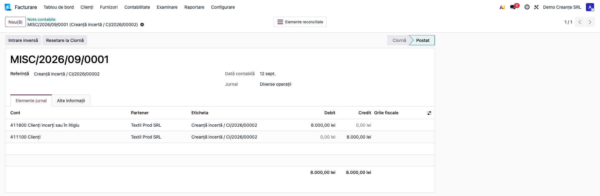
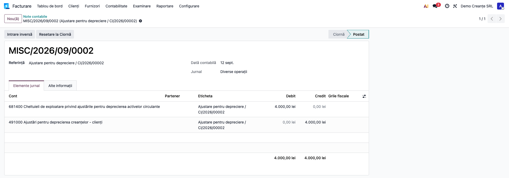
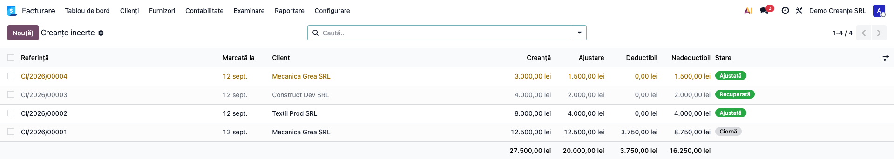
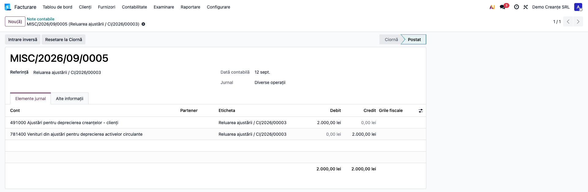
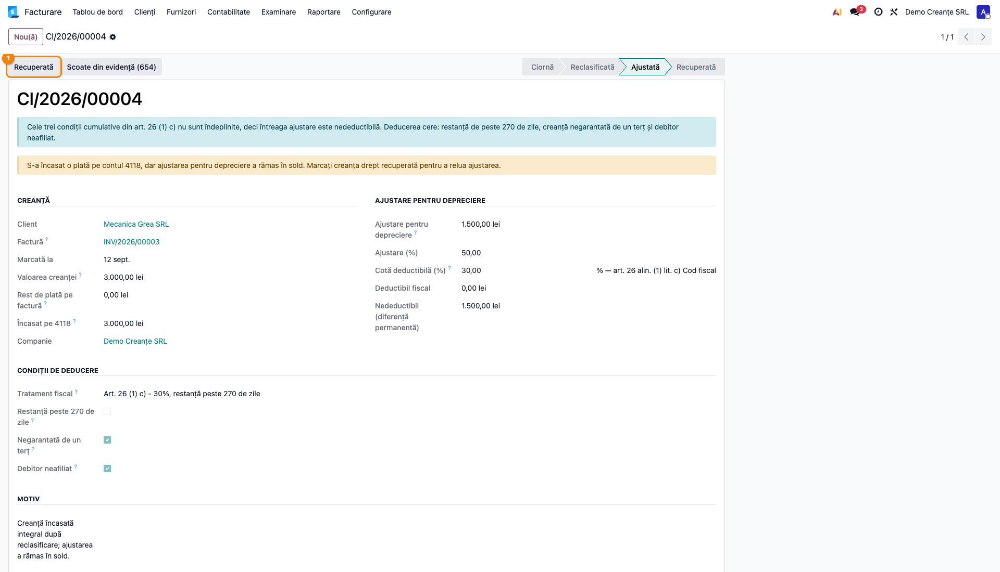

# Fișă Modul: Clienți Incerți și Ajustări pentru Deprecierea Creanțelor (491/4118)

**Modul:** `l10n_ro_doubtful_receivables`
**FR:** FR-73
**Utilizator principal:** Contabil clienți, Contabil-șef
**Prioritate:** 🔴 Ridicată (orice firmă cu creanțe comerciale o întâlnește)

---

## 1. Scop business

Când încasarea unei creanțe devine incertă, contabilul român are de făcut trei lucruri: să
**reclasifice** creanța din 4111 în 4118, ca soldul clienți să nu mai conțină o creanță litigioasă
la valoarea ei nominală; să constituie **ajustarea pentru depreciere** în contul 491, conform
principiului prudenței; și să separe **partea deductibilă fiscal** de cea nedeductibilă, pentru că
ajustarea este cheltuială contabilă integrală dar deductibilă doar în limita unui procent.

Odoo standard urmărește vechimea creanțelor și permite scoaterea lor din evidență, dar nu acoperă
niciuna dintre cele trei. Modulul le automatizează pe toate, iar diferența permanentă — care până
acum se ținea în Excel — devine o cifră vizibilă pe fiecare dosar.

## 2. Bază legală și context

| Act normativ | Prevedere relevantă |
|---|---|
| **OMFP 1802/2014** | Principiul prudenței; conturile 4118 „Clienți incerți sau în litigiu", 491 „Ajustări pentru deprecierea creanțelor - clienți", 6814, 7814, 654 |
| **Cod fiscal, art. 26 alin. (1) lit. c)** | Ajustările pentru deprecierea creanțelor sunt deductibile **în limita a 30%**, dar **numai dacă** creanțele îndeplinesc **cumulativ trei condiții**: (1) sunt neîncasate într-o perioadă ce **depășește 270 de zile** de la scadență; (2) **nu sunt garantate** de altă persoană; (3) sunt datorate de o persoană care **nu este afiliată** contribuabilului |
| **Cod fiscal, art. 26 alin. (12)** | Limita de 30% se aplică creanțelor **înregistrate începând cu 1 ianuarie 2024**; pentru creanțele anterioare rămâne regimul de dinainte |
| **Cod fiscal, art. 26 alin. (1) lit. j)** | Deducere **integrală (100%)** pentru creanțele asupra clienților în **faliment/insolvență**, cu condiții proprii — de aceea cota este editabilă pe dosar |
| **Cod fiscal, art. 25 alin. (4) lit. h)** | Pierderile la **scoaterea din evidență** a creanțelor sunt **nedeductibile** pentru partea neacoperită de ajustare, cu excepții limitativ prevăzute (reorganizare confirmată, faliment închis prin hotărâre, decesul debitorului, dizolvare fără succesor, dificultăți financiare majore, creanțe asigurate) |

> ⚠️ **Cele trei condiții sunt cumulative.** Dacă una lipsește — de exemplu creanța are 200 de zile
> restanță, nu peste 270 — ajustarea este **integral nedeductibilă**, nu deductibilă parțial.
> Modulul le modelează ca bife pe dosar și pune deductibilul pe zero când nu sunt îndeplinite.

## 3. Utilizatori și roluri

Contabil clienți (marchează creanțele și propune ajustările), Contabil-șef (validează notele și
urmărește diferența nedeductibilă la închiderea anuală).

Roluri recomandate pentru testare:
- **Administrator funcțional** — instalează modulul, configurează conturile și procentul;
- **Contabil** (`account.group_account_manager`) — parcurge fluxul complet;
- **Utilizator contabil** (`account.group_account_user`) — verifică accesul de **doar citire**
  (nu poate crea sau modifica dosare).

## 4. Conturi și date implicate

| Cont | Denumire | Rol în flux |
|---|---|---|
| **4111** | Clienți | Sursa creanței, se golește la reclasificare |
| **4118** | Clienți incerți sau în litigiu | Destinația reclasificării. Atât **4111**, cât și **4118** trebuie să fie reconciliabile — primul pentru stingerea facturii la reclasificare, al doilea pentru stingerea încasării; în planul RO standard ambele sunt |
| **491** | Ajustări pentru deprecierea creanțelor - clienți | Ajustarea constituită |
| **6814** | Cheltuieli de exploatare privind ajustările pentru deprecierea activelor circulante | Cheltuiala cu ajustarea |
| **7814** | Venituri din ajustări pentru deprecierea activelor circulante | Venitul din reluare |
| **654** | Pierderi din creanțe și debitori diverși | Pierderea la scoaterea din evidență |
| **5121** / **5311** | Conturi la bănci în lei / Casa în lei | Contrapartida încasării creanței deja reclasificate (`Dr 5121 = Cr 4118`) |

Date minime pentru demo:
- companie românească cu planul de conturi RO instalat;
- un client cu cont de creanțe configurat;
- cel puțin o **factură de vânzare postată și neîncasată**, cu scadența depășită (peste 180 de zile,
  pentru a fi prinsă de wizardul de propunere);
- perioadă contabilă deschisă și un jurnal de operațiuni diverse.

## 5. Configurare inițială

1. Instalați modulul `l10n_ro_doubtful_receivables` pe baza demo.
2. Deschideți **Contabilitate → Configurare → Setări**, secțiunea **Creanțe incerte (RO)**
   (vizibilă doar pentru companiile cu țara fiscală România).
3. Verificați cele cinci conturi propuse (4118, 491, 6814, 7814, 654) și jurnalul notelor.
4. Verificați **cota deductibilă** — implicit 30%, conform art. 26 alin. (1) lit. c).
5. Opțional, definiți o **politică de ajustare pe vechime** în **Contabilitate → Configurare →
   Contabilitate → Politici pentru creanțe incerte**.
6. Verificați că utilizatorul de test are grupul `account.group_account_manager`.

## 6. Flux de utilizare

### Pasul 1 — Configurarea conturilor și a limitei fiscale

Deschideți **Contabilitate → Configurare → Setări** și derulați la secțiunea **Creanțe incerte
(RO)**. Verificați conturile și, mai important, **cota deductibilă din ajustare**.



> Cota se **copiază pe fiecare dosar la creare** și rămâne înghețată acolo. Dacă legislația se
> modifică, schimbarea setării se aplică dosarelor noi, nu celor existente — limita în vigoare la
> data ajustării este cea care contează.

### Pasul 2 — Definirea politicii de ajustare pe vechime (opțional)

În **Contabilitate → Configurare → Contabilitate → Politici pentru creanțe incerte**, creați o
politică și adăugați tranșe: restanță de la 90 de zile → 20%, de la 180 → 50%, de la 365 → 100%.



> Se aplică tranșa cu **pragul cel mai mare pe care vechimea îl atinge**. O creanță restantă de 200
> de zile primește 50%, nu 20%. O creanță mai nouă decât cea mai mică tranșă nu primește ajustare.

### Pasul 3 — Propunerea creanțelor incerte din facturile restante

Deschideți **Contabilitate → Tranzacții → Creanțe incerte → Propune din facturi restante**.
Completați restanța minimă (implicit **270 de zile**), data de referință și politica definită anterior.

> **De ce 270 și nu 180.** Pragul implicit urmează condiția fiscală din art. 26 alin. (1) lit. c):
> sub 270 de zile de restanță, ajustarea **nu este deductibilă deloc**. Puteți coborî pragul pentru
> creanțe marcate pe considerente pur contabile (principiul prudenței), dar atunci nu așteptați
> deducere fiscală — modulul va arăta deductibilul zero.

Wizardul prinde și facturile **parțial încasate**; „Valoarea creanței" preluată este **restul de
plată**, nu totalul facturii, iar ajustarea se calculează pe această valoare (cu TVA inclus).



La **Propune**, modulul creează câte un dosar **în stare Ciornă** pentru fiecare factură restantă
neînregistrată încă, cu ajustarea calculată din politică.



> **Wizardul nu postează nimic.** Fiecare propunere rămâne ciornă până când o confirmați explicit.
> Facturile pentru care există deja un dosar activ sunt sărite, deci wizardul se poate rula de mai
> multe ori fără să producă duplicate.

### Pasul 4 — Verificarea dosarului și a limitei fiscale

Deschideți un dosar propus. În partea dreaptă, sub ajustare, găsiți **cele două sume care contează
la închiderea anuală**: partea deductibilă fiscal și diferența permanentă nedeductibilă.



**Ce găsiți pe ecran:** câmpul *Valoarea creanței* (suma care se va reclasifica), *Ajustare pentru
depreciere* (suma pentru 491), *Cotă deductibilă (%)*, iar sub ele *Deductibil fiscal* și
*Nedeductibil (diferență permanentă)*, calculate automat.

**Ce verificați înainte de a continua:** valoarea creanței corespunde restului de plată al facturii
(câmpul *Rest de plată pe factură* de deasupra); ajustarea nu depășește creanța; **cele trei bife
din grupul „Condiții de deducere (art. 26 (1) c))"** reflectă realitatea creanței; cota deductibilă
e cea corectă pentru încadrarea acestei creanțe.

> Condiția „peste 270 de zile" se calculează automat din scadența facturii, dar poate fi ajustată
> manual. Celelalte două — creanță **negarantată** și debitor **neafiliat** — sunt presupuse
> adevărate și trebuie confirmate de dumneavoastră: sistemul nu le poate deduce singur.
>
> Dacă una lipsește, apare o bandă informativă și **deductibilul devine zero**. Verificați și
> **data înregistrării creanței**: limita de 30% se aplică celor înregistrate de la 01.01.2024
> (art. 26 alin. (12)); pentru un client în insolvență, cota se poate ridica la 100%
> (art. 26 alin. (1) lit. j)).

### Pasul 5 — Reclasificarea în contul 4118

> **Notă despre capturi.** Pașii 1–4 urmăresc dosarul **CI/2026/00001** (Mecanica Grea SRL,
> 12.500 lei). Notele contabile din pașii 5–6 provin de la **CI/2026/00002** (Textil Prod SRL,
> 8.000 lei), iar pașii 8–9 de la alte dosare — fiecare a fost dus până la stadiul pe care îl
> ilustrează. Sumele diferă de la un pas la altul; urmăriți mecanismul, nu continuitatea cifrelor.

Apăsați **Reclasifică în 4118**. Se postează nota `Dr 4118 = Cr 4111` și, esențial, se
**reconciliază linia de creanță a facturii**.



> Fără reconciliere, creanța ar apărea de **două ori**: și în soldul 4111 al clientului, și pe 4118.
> Modulul o face automat; factura trece în starea „Plătită" nu pentru că s-a încasat, ci pentru că
> soldul ei de creanță a fost mutat în contul de clienți incerți.

### Pasul 6 — Constituirea ajustării pentru depreciere

Apăsați **Înregistrează ajustarea (491)**. Se postează `Dr 6814 = Cr 491`, iar în chatter se
consemnează defalcarea fiscală.



### Pasul 7 — Urmărirea totalurilor deductibil / nedeductibil

Reveniți la **Contabilitate → Tranzacții → Creanțe incerte → Creanțe incerte**.

**Ce găsiți pe ecran:** fiecare rând este un dosar; coloanele *Valoarea creanței*, *Ajustare pentru
depreciere*, *Deductibil fiscal* și *Nedeductibil (diferență permanentă)* au **totaluri pe coloană**.
Dosarele care necesită atenție sunt evidențiate.

**Ce verificați:** totalul coloanei *Nedeductibil* este suma care trebuie reflectată ca diferență
permanentă în registrul de evidență fiscală și în D101.

> ⚠️ **Filtrați pe „Ajustate" înainte de a compara cu balanța.** Fără filtru, lista însumează și
> dosarele în **Ciornă** (a căror ajustare nu e postată) și pe cele **Recuperate** (a căror ajustare
> a fost deja reluată). Numai totalul dosarelor în starea *Ajustată* corespunde soldului creditor al
> contului **491** din balanță; pe lista nefiltrată diferența poate fi de ordinul zecilor de mii.



**Abia după această verificare** exportați lista (butonul de export din listă) pentru dosarul de
închidere anuală.

### Pasul 8 — Deznodământul: recuperare sau scoatere din evidență

Când clientul plătește, încasarea se înregistrează **contra contului 4118**, nu contra facturii:
`Dr 5121 = Cr 4118`. Factura a fost deja stinsă la pasul 5, deci plata nu se mai poate lega de ea —
reconciliați linia de încasare cu linia de 4118 din nota de reclasificare. Suma stinsă apare pe dosar
în câmpul **Încasat pe 4118**.

Apoi apăsați **Recuperată** — se postează reluarea `Dr 491 = Cr 7814`.

> Butonul **Recuperată** este vizibil doar pentru dosarele în starea *Ajustată*. Un dosar doar
> reclasificat, fără ajustare constituită, se închide prin scoatere din evidență sau rămâne deschis
> până la încasare.



Dacă pierderea este definitivă, apăsați **Scoate din evidență (654)**: modulul reia întâi ajustarea
rămasă, apoi postează `Dr 654 = Cr 4118`.

> Ordinea contează. Dacă ajustarea nu s-ar relua, contul 491 ar rămâne cu sold pentru o creanță care
> nu mai există, iar inventarierea anuală l-ar găsi orfan.

> ⚠️ **Regimul fiscal al pierderii.** Conform **art. 25 alin. (4) lit. h)**, pierderea din scoaterea
> din evidență (654) este **nedeductibilă** pentru partea neacoperită de ajustare, cu excepțiile
> limitativ prevăzute (procedură de reorganizare confirmată, faliment închis prin hotărâre
> judecătorească, decesul debitorului, dizolvare fără succesor, dificultăți financiare majore,
> creanțe acoperite de contract de asigurare). Modulul postează nota contabilă; **încadrarea fiscală
> rămâne în sarcina dumneavoastră**.
>
> Creanțele scoase din evidență, dar urmărite în continuare, se țin în evidența extracontabilă în
> contul **8034 „Debitori scoși din activ, urmăriți în continuare"** — operațiune care nu este
> automatizată de modul.

### Pasul 9 — Ajustări rămase pe creanțe deja încasate

Dacă factura a fost încasată dar ajustarea a rămas în sold, dosarul afișează un avertisment, apare
în filtrul **Necesită reluare** din listă, iar un proces zilnic creează o activitate pe el.



> Modulul **nu postează singur** nota de reluare. Momentul reluării este o decizie contabilă, iar o
> notă apărută fără ca cineva să știe este mai greu de explicat la un control decât una lipsă.

### Note de monografie și raportare

- reclasificare: **Dr 4118 = Cr 4111**, cu reconcilierea liniei de creanță a facturii;
- constituirea ajustării: **Dr 6814 = Cr 491**, fără partener pe liniile de ajustare;
- încasarea de la client, după reclasificare: **Dr 5121 = Cr 4118**, reconciliată manual cu linia
  de 4118 din nota de reclasificare;
- reluare la încasare: **Dr 491 = Cr 7814**;
- scoatere din evidență: **Dr 491 = Cr 7814** (reluarea ajustării rămase), apoi **Dr 654 = Cr 4118**;
- partea deductibilă fiscal = ajustare × cota de pe dosar (implicit 30%), **dar numai dacă toate
  cele trei condiții din art. 26 alin. (1) lit. c) sunt îndeplinite**; altfel deductibilul este zero;
- restul este **diferență permanentă**, de raportat în registrul de evidență fiscală și în **D101**;
- pierderea din 654 la scoaterea din evidență este, ca regulă, **nedeductibilă** (art. 25 alin. (4)
  lit. h)), cu excepțiile prevăzute de lege.

> Preluarea automată a diferenței nedeductibile în registrul fiscal și în D101 **nu** este realizată
> de acest modul (manifestul depinde doar de `account`, `l10n_ro` și `mail`); sumele sunt calculate
> și vizibile per dosar, iar preluarea rămâne pentru o iterație următoare.

## 7. Legături cu alte module / declarații

| Modul / proces | Rol în flux | Tip legătură |
|---|---|---|
| `account` | facturi, note contabile, reconciliere | dependență (manifest) |
| `l10n_ro` | planul de conturi RO (4118/491/6814/7814/654) | dependență (manifest) |
| `mail` | chatter, activități, urmărirea modificărilor | dependență (manifest) |
| `l10n_ro_receivables_enhanced` | vechimea creanțelor, sursa deciziei de marcare | complementar (nu automat) |
| `l10n_ro_fiscal_audit` / FR-58 | registrul de evidență fiscală, unde ajunge diferența permanentă | integrare manuală (iterația 2) |
| `l10n_ro_profit_tax` / `l10n_ro_anaf_d101` | impozitul pe profit, unde se declară diferența | integrare manuală (iterația 2) |
| `l10n_ro_provisions` | provizioane pentru litigii (151) — flux paralel, cont diferit | înrudit |

**Ce este automat:** notele contabile ale celor patru momente, reconcilierea cu factura, calculul
deductibilului și al diferenței permanente, propunerea din facturi restante, semnalarea ajustărilor
rămase pe creanțe încasate.

**Ce rămâne manual:** decizia de a marca o creanță ca incertă; confirmarea condițiilor de deducere
(creanță negarantată, debitor neafiliat); **înregistrarea și reconcilierea încasării pe contul 4118**;
momentul reluării ajustării; preluarea diferenței nedeductibile în registrul fiscal și în D101;
ajustarea cotei pentru încadrări speciale (insolvență → 100%, creanțe anterioare lui 01.01.2024);
încadrarea fiscală a pierderii din 654; **ajustarea bazei de TVA** pentru creanțe neîncasate
(art. 287 lit. d) Cod fiscal) și declararea ei în D300; evidența extracontabilă în 8034.

## 8. Verificări pentru consultant

- [ ] Modulul se instalează fără erori pe o bază curată cu plan de conturi RO.
- [ ] Secțiunea **Creanțe incerte (RO)** apare în setări **doar** pentru companiile românești.
- [ ] Cele cinci conturi și jurnalul sunt completate; dacă lipsește unul, acțiunea se oprește cu un
      mesaj care spune exact ce lipsește (nu postează o notă incompletă).
- [ ] Wizardul de propunere creează **numai ciorne** — nicio notă contabilă nu apare după rulare.
- [ ] Rulat a doua oară, wizardul **nu** propune din nou aceleași facturi.
- [ ] După reclasificare, soldul clientului pe **4111 nu mai conține** creanța, iar 4118 o conține.
- [ ] Ajustarea propusă nu poate depăși creanța reclasificată (sistemul respinge).
- [ ] Suma *Deductibil fiscal* = ajustare × cota de pe dosar; *Nedeductibil* = restul.
- [ ] Modificarea cotei în setări **nu** schimbă dosarele deja create.
- [ ] La **Recuperată**, ajustarea se reia (`Dr 491 = Cr 7814`) — 491 rămâne fără sold pe acel dosar.
- [ ] La **Scoate din evidență**, se postează **ambele** note: reluarea ajustării și pierderea.
- [ ] Totalul coloanei *Ajustare*, **filtrat pe starea „Ajustată”**, corespunde soldului
      creditor al contului 491 din balanță. (Pe lista nefiltrată nu corespunde: intră și
      ciornele, a căror ajustare nu e postată, și dosarele recuperate, a căror ajustare a fost
      deja reluată.)
- [ ] Un utilizator din grupul contabil de bază **nu** poate crea sau modifica dosare.

## 9. Mesaje de eroare frecvente

| Mesaj / simptom | Cauză probabilă | Remediere |
|---|---|---|
| „Contul de clienți incerți (4118) nu este configurat. Îl puteți seta în Contabilitate → Configurare → Setări…" | Setările modulului nu au fost completate | Completați conturile în secțiunea **Creanțe incerte (RO)** |
| „Clientul nu are configurat un cont de creanțe." | Partenerul nu are `property_account_receivable_id` | Setați contul de creanțe pe fișa clientului |
| „Creanța trebuie reclasificată înainte de a putea fi ajustată." | S-a apăsat *Înregistrează ajustarea* pe un dosar în ciornă | Apăsați întâi **Reclasifică în 4118** |
| „Ajustarea nu poate depăși creanța reclasificată." | Suma ajustării e mai mare decât creanța | Corectați ajustarea sau verificați valoarea creanței |
| „Există deja o notă de ajustare pentru …" | Se încearcă o a doua ajustare pe același dosar | Dosarul are deja ajustarea postată; pentru modificare, stornați nota existentă |
| „Nu există niciun jurnal de operațiuni diverse pentru această companie." | Compania nu are jurnal `general` | Creați un jurnal de operațiuni diverse sau selectați unul în setări |
| „Nu se poate posta o notă pe sumă zero." | Ajustare zero la apăsarea butonului de ajustare | Completați suma ajustării, sau treceți direct la scoaterea din evidență |
| Wizardul spune „Nicio factură restantă nu corespunde acestor criterii…" | Nu există facturi restante peste prag, sau toate au deja dosar | Reduceți restanța minimă sau verificați dosarele existente |

## 10. Capturi de ecran

Capturile (`readme/screenshots/`) sunt **generate automat** din `tests/test_screenshots.py`
(mixinul `ScreenshotCase` din `l10n_ro_doc_screenshots`, import defensiv), în **limba română**, pe
planul de conturi RO (`setup_country("ro")`):

1. `01_setari.png` — setările modulului: conturile și cota deductibilă.
2. `02_politica.png` — politica de ajustare cu tranșe de vechime.
3. `03_wizard_propunere.png` — wizardul de propunere din facturi restante.
4. `04_lista_propuneri.png` — dosarele propuse, în stare Ciornă.
5. `05_dosar_ciorna.png` — dosarul cu deductibilul și diferența permanentă.
6. `06_nota_reclasificare.png` — nota `Dr 4118 = Cr 4111`.
7. `07_nota_ajustare.png` — nota `Dr 6814 = Cr 491`.
8. `08_lista_totaluri.png` — lista cu totalurile pe coloanele fiscale.
9. `09_nota_reluare.png` — nota de reluare `Dr 491 = Cr 7814`.
10. `10_necesita_reluare.png` — avertismentul „Necesită reluare" pe un dosar cu factura încasată.

Regenerare:

```bash
./odoo/odoo-bin -c odoo.conf -d <db> -i l10n_ro_doubtful_receivables,l10n_ro_doc_screenshots \
    --test-tags=fise_screenshots --stop-after-init
```

## 11. Observații pentru manual

Pentru manualul utilizatorului, păstrați trei idei care se pierd ușor în detaliul tehnic:

1. **Reclasificarea nu înseamnă încasare.** Factura apare ca „plătită" după reclasificare pentru că
   soldul ei de creanță a fost mutat pe 4118 — creanța rămâne datorată. Este cea mai frecventă sursă
   de confuzie la primul contact cu modulul.
2. **Diferența permanentă este scopul, nu un detaliu.** Cifra din coloana *Nedeductibil* este exact
   ce se raporta până acum prin calcul manual în D101.
3. **Modulul semnalează, dar nu decide.** Nici propunerea din facturi restante, nici cronul de
   ajustări orfane nu postează note contabile; toate notele pornesc de la o apăsare de buton.
