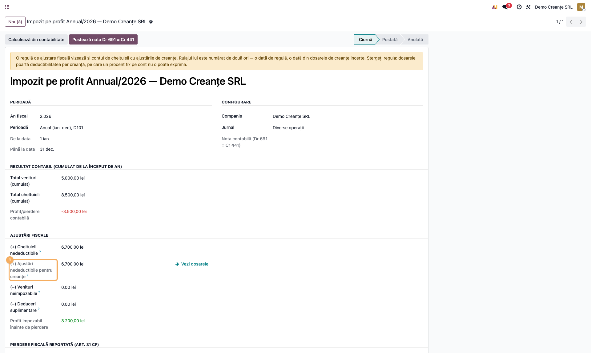
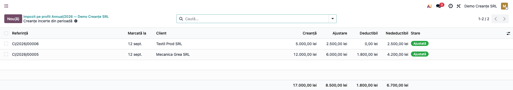
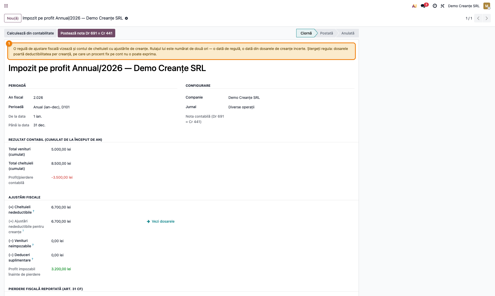
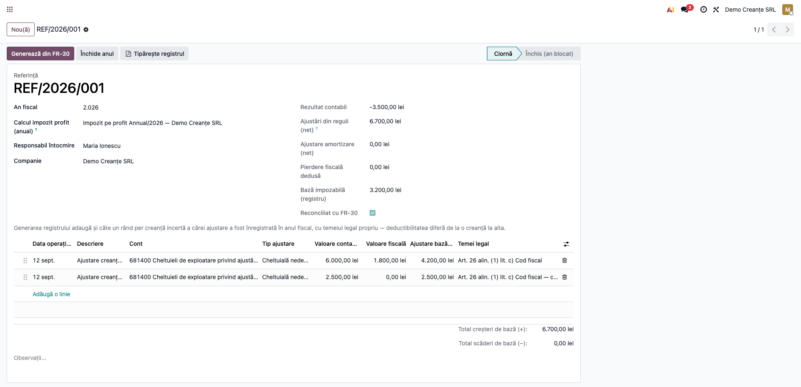
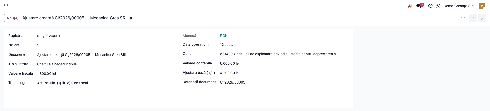
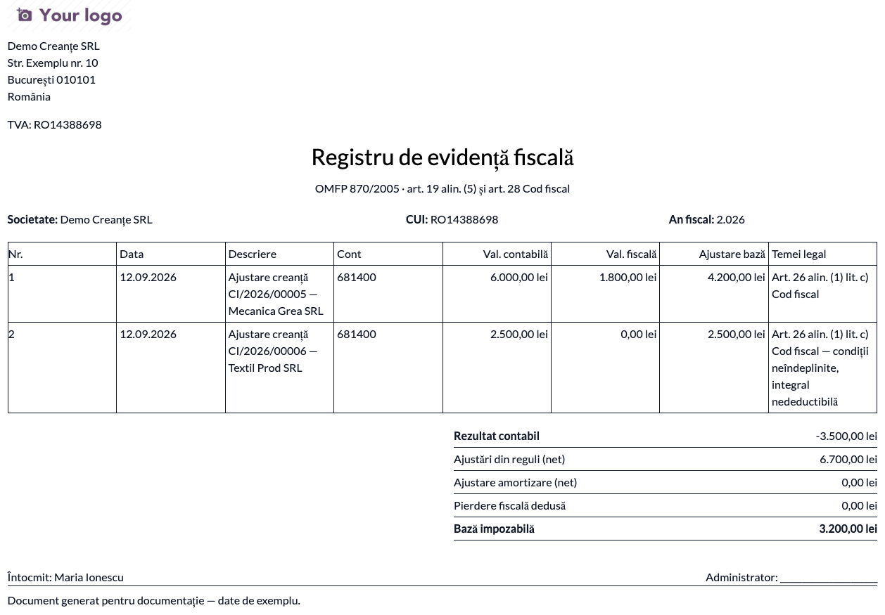

# Fișă Modul: Creanțele Incerte în Impozitul pe Profit (registru fiscal + D101)

**Modul:** `l10n_ro_doubtful_receivables_profit_tax`
**FR:** FR-73 (iterația 2), alimentează FR-58 și FR-30
**Utilizator principal:** Contabil-șef, responsabil cu închiderea anuală
**Prioritate:** 🔴 Ridicată (fără el, diferența permanentă se transcrie manual)

---

## 1. Scop business

Modulul de creanțe incerte calculează, pe fiecare dosar, cât din ajustarea pentru depreciere este
deductibil fiscal și cât rămâne **diferență permanentă**. Până la acest modul-punte, cifra rămânea pe
ecran: contabilul o transcria manual în registrul de evidență fiscală și în calculul D101, creanță cu
creanță, an de an.

Modulul face legătura automat. Se instalează singur când sunt prezente atât
`l10n_ro_doubtful_receivables`, cât și `l10n_ro_profit_tax` — nu are meniuri proprii, ci extinde
ecranele existente de impozit pe profit.

## 2. Bază legală și context

| Act normativ | Prevedere relevantă |
|---|---|
| **Cod fiscal, art. 26 alin. (1) lit. c)** | Ajustările pentru deprecierea creanțelor sunt deductibile **în limita a 30%**, numai dacă creanța e neîncasată peste **270 de zile**, **negarantată** și datorată de o persoană **neafiliată** |
| **Cod fiscal, art. 26 alin. (1) lit. j)** | Deducere **integrală (100%)**, dar numai pentru creanțe asupra unei **persoane juridice în procedura de faliment declarată prin hotărâre judecătorească** — nu simpla insolvență — sau asupra unei **persoane fizice în insolvență** pe plan de rambursare, lichidare de active sau procedură simplificată; cu aceleași condiții cumulative de creanță **negarantată** și debitor **neafiliat** |

> ⚠️ **Modulul acoperă doar lit. c).** Rândurile scrise în registru poartă întotdeauna temeiul
> „art. 26 alin. (1) lit. c)". Pentru o creanță încadrată la **lit. j)**, ridicați cota pe dosar la
> 100%, dar **corectați manual temeiul legal** pe rândul din registru — altfel documentul prezintă o
> încadrare greșită.
| **OMFP 870/2005** | Registrul de evidență fiscală: document cronologic, cu **temei legal pentru fiecare rând** |

> **De ce un rând per creanță, nu un total pe cont.** În același an, un dosar poate fi deductibil
> 30% (condițiile îndeplinite), altul 0% (sub 270 de zile) și altul 100% (debitor în insolvență) —
> toate pe contul 6814. Un singur rând agregat pe cont nu poate purta trei temeiuri legale diferite,
> deci nu s-ar putea justifica la control.

## 3. Utilizatori și roluri

Contabil-șef (generează registrul și calculul anual), consultant fiscal (verifică încadrarea).

Roluri recomandate pentru testare:
- **Contabil** (`account.group_account_manager`) — parcurge fluxul complet de închidere;
- **Utilizator contabil** — verifică accesul de consultare.

## 4. Conturi și date implicate

Modulul nu introduce conturi noi. Lucrează cu cele configurate în modulul de creanțe incerte —
în special contul de **cheltuieli cu ajustările (6814)**, care apare pe rândurile din registru.

Date minime pentru demo:
- modulele `l10n_ro_doubtful_receivables` și `l10n_ro_profit_tax` instalate (puntea se instalează
  automat);
- cel puțin **două dosare de creanțe incerte cu ajustarea postată** în anul fiscal, ideal unul care
  îndeplinește condițiile de deducere și unul care nu (restanță sub 270 de zile) — ca să se vadă
  diferența de tratament;
- un calcul anual de impozit pe profit (FR-30) pe același an.

## 5. Configurare inițială

1. Verificați că ambele module-sursă sunt instalate; puntea apare automat în lista de module.
2. Verificați conturile din **Contabilitate → Configurare → Setări**, secțiunea
   **Creanțe incerte (RO)** — în special contul 6814.
3. **Ștergeți orice regulă de ajustare configurată pe contul 6814** — o găsiți în
   **Contabilitate → Configurare → Configurare impozit pe profit → Ajustări impozit pe profit**
   (vezi pasul 3 din flux): dosarele poartă deductibilitatea reală, iar regula ar dubla suma.
4. Creați calculul anual de impozit pe profit pentru anul care se închide.

## 6. Flux de utilizare

### Pasul 1 — Calculul impozitului pe profit preia diferența permanentă

Deschideți **Contabilitate → Contabilitate → Impozit pe profit**, alegeți înregistrarea **anuală**
în ciornă și apăsați **Calculează din contabilitate**.



> Banda galbenă din capturi apare pentru că baza demo are configurată o regulă care dublează
> suma — este subiectul **pasului 3**. Pe o configurare corectă nu apare.

**Ce găsiți pe ecran:** sub „(+) Cheltuieli nedeductibile" apare rândul
**„(+) Ajustări nedeductibile pentru creanțe"**, cu suma preluată automat din dosarele a căror
ajustare a fost postată în perioadă.

**Ce verificați:** suma corespunde totalului coloanei *Nedeductibil* din lista de creanțe incerte,
filtrată pe aceeași perioadă; cifra este **inclusă** în „(+) Cheltuieli nedeductibile" de deasupra,
nu adăugată separat la bază.

### Pasul 2 — Verificarea dosarelor care compun suma

Apăsați săgeata de lângă sumă. Se deschide lista dosarelor luate în calcul — cele cu ajustarea
postată în perioada calculului.



**Ce verificați:** fiecare dosar are ajustarea postată (nu în ciornă); dosarele cu deductibil zero
sunt cele care nu îndeplinesc condițiile — verificați că încadrarea lor e corectă înainte de a
închide anul.

### Pasul 3 — Avertismentul de dublă numărare

Dacă pe contul de cheltuieli cu ajustările (6814) există și o regulă `l10n.ro.tax.adjustment`,
calculul afișează un avertisment.



> **De ce contează.** Regula ar aduce rulajul contului 6814 în baza impozabilă *o dată*, iar dosarele
> *încă o dată* — aceeași cheltuială numărată de două ori. Modulul **semnalează**, dar nu corectează
> singur: nu poate ști care dintre cele două surse ați intenționat-o.
>
> **Soluția:** ștergeți regula de pe 6814. Dosarele poartă deductibilitatea reală, per creanță, pe
> care un procent fix pe cont nu o poate exprima.

### Pasul 4 — Generarea registrului de evidență fiscală

Deschideți **Contabilitate → Contabilitate → Registru de evidență fiscală** — meniu propriu, la
același nivel cu Impozit pe profit, nu sub el — selectați calculul anual și apăsați
**Generează din FR-30**.



**Ce găsiți pe ecran:** pe lângă rândurile din reguli, amortizare și pierdere reportată, registrul
conține **câte un rând per creanță incertă cu parte nedeductibilă nenulă**, ajustată în anul fiscal.
Un dosar integral deductibil apare în lista de la pasul 2, dar **nu** produce rând în registru — nu
are diferență de consemnat.

**Ce verificați:** totalul rândurilor de creanțe este egal cu câmpul „(+) Ajustări nedeductibile
pentru creanțe" din calcul. Grupați lista de rânduri după *Temei legal* ca să izolați subtotalul
creanțelor.

> Bifa **„Reconciliat cu FR-30"** de pe registru verifică altceva: totalul **tuturor** ajustărilor
> din registru față de calcul. Poate rămâne verde chiar dacă rândurile de creanțe au o eroare
> compensată de rândurile din reguli — folosiți-o ca verificare globală, nu ca dovadă pe creanțe.

> **Regenerarea șterge toate rândurile**, inclusiv cele adăugate manual: „Generează din FR-30"
> reconstruiește registrul de la zero. Adăugați rândurile manuale abia după ultima regenerare.

### Pasul 5 — Citirea unui rând de creanță



Fiecare rând poartă:

| Coloană | Conținut |
|---|---|
| Descriere | referința dosarului + clientul |
| Valoare contabilă | ajustarea constituită (cheltuiala din 6814) |
| Valoare fiscală | partea deductibilă |
| Ajustare bază (+/−) | **diferența permanentă** |
| Temei legal | art. 26 alin. (1) lit. c) — cu mențiunea „condiții neîndeplinite, integral nedeductibilă" acolo unde e cazul |
| Document | referința dosarului, pentru regăsire |

**Ce verificați:** dosarele care nu îndeplineau condițiile au **valoarea fiscală zero** și mențiunea
distinctă în temeiul legal. Acesta e rândul pe care un inspector îl va citi primul.

### Pasul 6 — Tipărirea registrului

Din registru, apăsați **Tipărește registrul**. Documentul include rândurile de creanțe cu temeiul
legal complet — mențiunea „condiții neîndeplinite" se citește integral aici, spre deosebire de lista
de pe ecran, unde coloana e îngustă.

> ⚠️ **De verificat înainte de a prezenta documentul la control:** antetul raportului (generat de
> `l10n_ro_profit_tax`) citează „art. 19 alin. (5)". Obligația registrului de evidență fiscală este
> la **art. 19 alin. (7)**; alin. (5) tratează altceva. Corecția ține de modulul de impozit pe
> profit, nu de acesta.



### Note de monografie și raportare

Modulul **nu generează note contabile** — ajustările sunt deja înregistrate de
`l10n_ro_doubtful_receivables`. El transportă informația fiscală:

- **partea nedeductibilă** a fiecărei ajustări 491 postate în perioadă intră în
  „(+) Cheltuieli nedeductibile" din calculul D101;
- **fiecare dosar** produce un rând în registrul de evidență fiscală, cu temeiul legal propriu;
- baza impozabilă crește cu totalul diferențelor permanente.

> ⚠️ **La reluarea ajustării, simetria fiscală nu este automată.** Când ajustarea se reia
> (`Dr 491 = Cr 7814`, la încasare sau la scoaterea din evidență), venitul rezultat este
> **neimpozabil pentru partea care nu a fost dedusă** — art. 23 lit. d) Cod fiscal: „veniturile din
> reducerea sau anularea provizioanelor pentru care nu s-a acordat deducere". Modulul **nu**
> alimentează „(−) Venituri neimpozabile" cu această parte. Fără intervenție manuală, aceeași sumă
> se impozitează la reluare deși nu a fost dedusă la constituire.

## 7. Legături cu alte module / declarații

| Modul / proces | Rol în flux | Tip legătură |
|---|---|---|
| `l10n_ro_doubtful_receivables` | sursa dosarelor și a sumelor deductibile/nedeductibile | dependență (manifest) |
| `l10n_ro_profit_tax` | registrul de evidență fiscală (FR-58) și calculul D101 (FR-30) | dependență (manifest) |
| `l10n_ro_anaf_d101` | declarația care preia baza impozabilă rezultată | prin calculul de impozit |

**Ce este automat:** preluarea sumei nedeductibile în calcul, generarea rândurilor în registru cu
temei legal, semnalarea regulii suprapuse.

**Ce rămâne manual:** ștergerea regulii de pe contul 6814 dacă există; **declararea ca venit neimpozabil** (art. 23 lit. d)) a părții nedeductibile reluate prin 7814, cu
rând propriu în registru; încadrarea fiscală a pierderii din **654** la scoaterea din evidență (art. 25 alin. (4) lit. h), nedeductibilă cu excepțiile limitativ enumerate la lit. h) —
depinde de documente juridice, nu de date din sistem); **ajustarea bazei de TVA** pentru creanțe
neîncasate (art. 287 lit. d) și declararea ei în D300; evidența extracontabilă **8034**.

## 8. Verificări pentru consultant

- [ ] Modulul apare instalat automat când ambele module-sursă sunt prezente.
- [ ] După **Calculează**, câmpul „(+) Ajustări nedeductibile pentru creanțe" are valoare.
- [ ] Suma corespunde totalului *Nedeductibil* din dosarele cu ajustarea postată în perioadă.
- [ ] Butonul de lângă sumă deschide exact acele dosare.
- [ ] Un dosar cu ajustarea **în ciornă** nu intră în calcul.
- [ ] Un dosar care **nu** îndeplinește condițiile art. 26 intră cu suma **integrală**.
- [ ] Avertismentul apare dacă se creează o regulă pe contul 6814 și dispare după ștergerea ei.
- [ ] Registrul generat conține câte un rând per dosar **cu parte nedeductibilă nenulă**, cu temei
      legal completat; bifa „Reconciliat cu FR-30" este activă.
- [ ] Rândurile dosarelor neconforme au valoarea fiscală zero și mențiunea distinctă.
- [ ] Totalul rândurilor de creanțe din registru = câmpul din calculul D101.
- [ ] Registrul tipărit conține rândurile de creanțe.

## 9. Mesaje de eroare frecvente

| Mesaj / simptom | Cauză probabilă | Remediere |
|---|---|---|
| Câmpul „(+) Ajustări nedeductibile pentru creanțe" rămâne zero | Niciun dosar cu ajustarea **postată** în perioada calculului | Verificați starea dosarelor: doar cele Ajustate/Recuperate/Scoase din evidență, cu nota postată, intră în calcul |
| Suma din calcul diferă de cea din registru | Registrul a fost generat înainte de ultima modificare a dosarelor | Regenerați registrul (**Generează din FR-30**) |
| Baza impozabilă pare umflată | Regulă `l10n.ro.tax.adjustment` pe contul 6814, pe lângă dosare | Ștergeți regula; vezi avertismentul din pasul 3 |
| „Doar registrele în ciornă pot fi (re)generate." | Registrul e închis (an blocat) | Deschideți un registru nou sau redeschideți anul, dacă e permis |
| „Selectați calculul anual de impozit pe profit (FR-30)." | Registrul nu are calculul asociat | Completați câmpul de calcul anual pe registru |

## 10. Capturi de ecran

Capturile (`readme/screenshots/`) sunt **generate automat** din `tests/test_screenshots.py`
(mixinul `ScreenshotCase` din `l10n_ro_doc_screenshots`, import defensiv), în **limba română**, pe
planul de conturi RO:

1. `01_calcul_d101.png` — calculul D101 cu ajustările nedeductibile din creanțe.
2. `02_dosare_perioada.png` — dosarele de creanțe incerte luate în calcul.
3. `03_avertisment_regula.png` — avertismentul privind regula suprapusă pe contul 6814.
4. `04_registru_generat.png` — registrul de evidență fiscală generat.
5. `05_rand_registru.png` — rândurile de creanțe, cu temeiul legal per rând.
6. `06_registru_pdf.png` — registrul tipărit (randarea raportului).

Regenerare:

```bash
./odoo/odoo-bin -c odoo.conf -d <db> -i l10n_ro_doubtful_receivables_profit_tax,l10n_ro_doc_screenshots \
    --test-tags=fise_screenshots --stop-after-init
```

## 11. Observații pentru manual

Trei idei de păstrat în manual:

1. **Modulul nu decide încadrarea, o transportă.** Deductibilitatea se stabilește pe dosarul de
   creanță incertă; aici doar ajunge în registru și în declarație. Corecțiile se fac pe dosar, apoi
   se regenerează registrul.
2. **Un rând per creanță nu e un moft de raportare** — e cerința OMFP 870/2005 de temei legal per
   rând, imposibil de satisfăcut cu un total pe cont când deductibilitatea diferă de la o creanță la
   alta.
3. **Avertismentul de dublă numărare merită citit, nu închis.** Este singurul loc unde sistemul
   semnalează că aceeași cheltuială ar intra de două ori în baza impozabilă.
