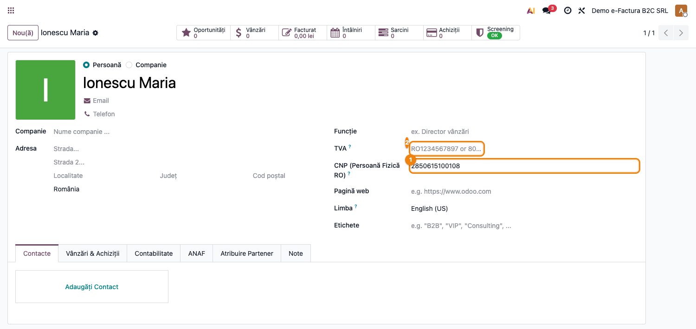
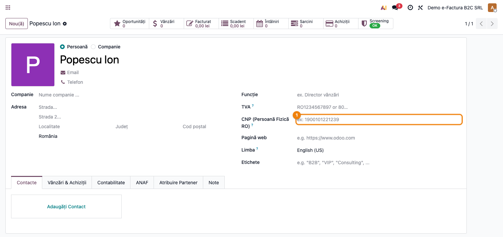

# Fișă Modul: e-Factura B2C (Persoane Fizice / CNP)

**Poziție plan:** B8.4
**Modul:** `l10n_ro_efactura_b2c`
**FR:** FR-24
**Capitol manual:** Cap 12.6
**Utilizator principal:** Operator facturare, Contabil clienți
**Prioritate:** 🔴 Ridicată (obligatoriu din 2025/2026 pentru facturi B2C)

---

## 1. Scop business

Modulul extinde transmiterea **e-Factura CIUS-RO** pentru clienții persoane fizice (B2C).
ANAF cere ca fiecare factură electronică emisă către o persoană fizică română să includă
CNP-ul clientului în câmpul `cbc:CompanyID` cu atributul `schemeID="CNP"`.
Modulul adaugă câmpul CNP pe fișa partenerului (cu validare Luhn RO), un banner de avertizare
pe factură când CNP-ul lipsește sau este invalid, și injectează automat CNP-ul în XML-ul CIUS-RO.

## 2. Bază legală și context

- **OUG 120/2021**, modificată ulterior — e-Factura B2C obligatorie din 2025/2026
- **CIUS-RO 1.0.8+** — câmpul `cbc:CompanyID schemeID="CNP"` în secțiunea
  `cac:AccountingCustomerParty/cac:Party/cac:PartyLegalEntity`
- **GDPR**: CNP este dată personală — câmpul este restricționat la grupul `base.group_user`

## 3. Utilizatori și roluri

- **Operator facturare**: completează CNP-ul pe fișa clientului persoană fizică
- **Contabil clienți**: verifică avertizarea pe factură înainte de trimitere SPV

## 4. Date implicate

- `res.partner.l10n_ro_cnp` — câmp text CNP (13 cifre), vizibil pentru companii RO
- `res.partner.l10n_ro_cnp_valid` — câmp boolean calculat (validare Luhn RO), stocat
- Avertizare pe factură: vizibilă când partenerul e persoană fizică RO fără CNP valid
- XML CIUS-RO: `cbc:CompanyID schemeID="CNP"` + `cac:PartyIdentification/cbc:ID schemeID="CNP"`

## 5. Configurare inițială

1. Instalați `l10n_ro_efactura_b2c` (dependențe: `l10n_ro_edi`).
2. Nu necesită configurare suplimentară — câmpul CNP apare automat pe fișa partenerului
   dacă compania contabilă are localizarea RO activă.

## 6. Flux de utilizare

### Pasul 1 — Câmpul CNP pe partener (persoană fizică cu CNP valid)

Accesați **Contacte → [partener persoană fizică]**. Sub câmpul **TVA**, apare câmpul
**CNP (Persoană Fizică RO)** ①. Câmpul este vizibil doar când compania are localizarea RO
și partenerul este persoană fizică.

**Partener Ionescu Maria — CNP 2850615100108 completat și valid ①:**

### Pasul 2 — Câmpul CNP gol (avertizare implicită)

Când un partener persoană fizică nu are CNP completat, câmpul ① rămâne gol.
Factura emisă pentru acest partener va afișa un banner de avertizare înainte de trimitere SPV.

**Partener Popescu Ion — câmp CNP ① gol (necompletare → avertizare la trimitere SPV):**

### Pasul 3 — Validare la trimitere SPV

Când se încearcă trimiterea facturii în SPV, modulul verifică automat:
- dacă partenerul este persoană fizică RO fără CNP valid → eroare blocantă cu mesaj clar
- dacă CNP-ul este completat și valid → XML-ul include `schemeID="CNP"` automat

## 7. Legături cu alte module

| Modul | Rol în flux |
|---|---|
| `l10n_ro_edi` | motor CIUS-RO — XML-ul care injectează CNP-ul |
| `account` | facturile B2C și accesul la datele partenerului |
| `l10n_ro_efactura_dedup` | control duplicate SPV (opțional) |

Ce este automat: validarea CNP, injectarea în XML, blocarea trimiterii fără CNP valid.
Ce rămâne manual: completarea CNP-ului pe fișa partenerului.

## 8. Verificări pentru consultant

- [ ] Câmpul CNP apare pe fișa partenerului persoană fizică când localizarea RO e activă.
- [ ] CNP invalid (greșit, < 13 cifre) generează eroare de validare la salvare.
- [ ] CNP valid (Luhn RO) se salvează fără eroare.
- [ ] La trimitere SPV cu partener fără CNP, apare mesajul de eroare clar.
- [ ] XML-ul generat include `cbc:CompanyID schemeID="CNP"` cu CNP-ul partenerului.

## 9. Mesaje frecvente

| Simptom | Cauză probabilă | Remediere |
|---------|-----------------|-----------|
| Câmpul CNP nu apare | Compania nu are localizarea RO activă | Instalați `l10n_ro` pe companie |
| "Invalid CNP: '...' " la salvare | CNP incorect (cifră de control greșită sau format) | Verificați CNP-ul cu algoritmul Luhn RO |
| Eroare la trimitere SPV | Partener B2C fără CNP valid | Completați CNP-ul pe fișa partenerului |

## 10. Capturi de ecran

| # | Fișier | Conținut |
|---|--------|----------|
| 1 | `screenshots/01_partener_cnp.png` | Partener persoană fizică RO — câmpul CNP ① completat și valid sub TVA |
| 2 | `screenshots/02_partener_fara_cnp.png` | Partener fără CNP — câmpul ① gol (induce avertizare la trimitere SPV) |
