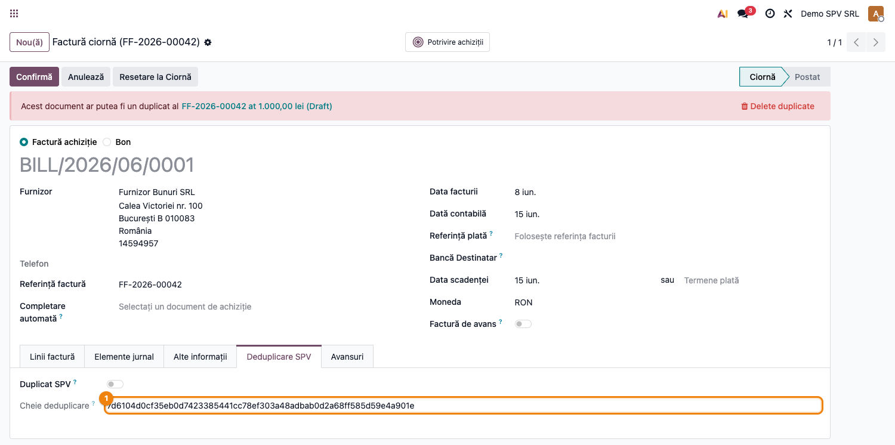
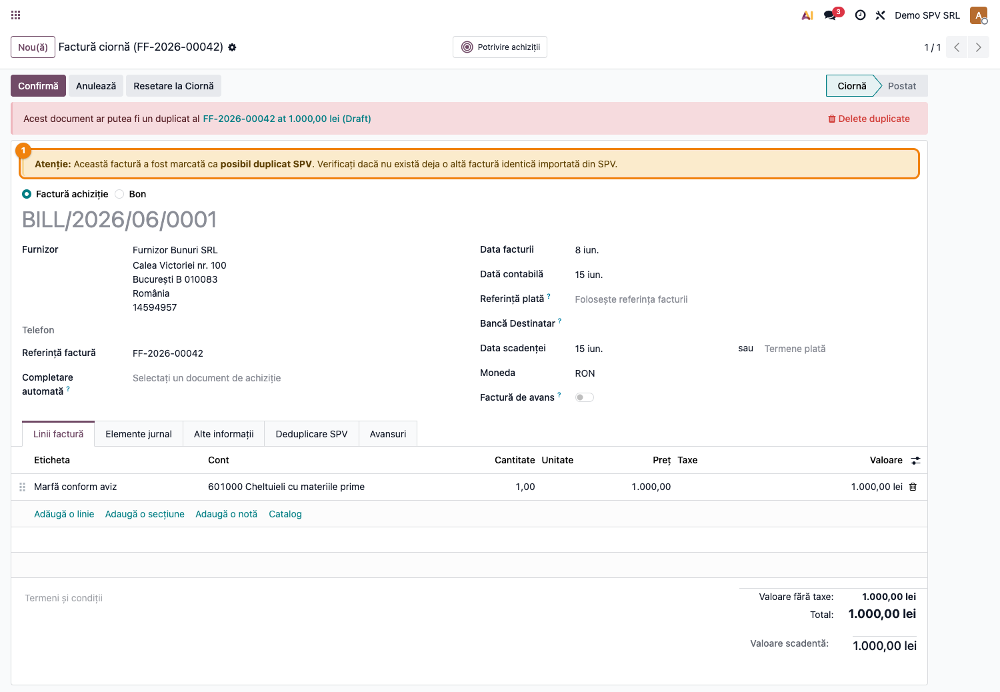
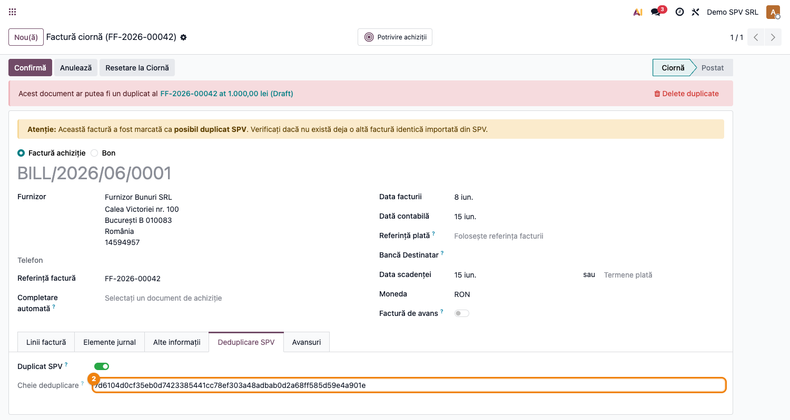
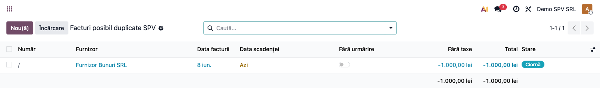

# Fișă Modul: e-Factura — deduplicare documente SPV

**Poziție plan:** C11
**Modul:** `l10n_ro_efactura_dedup`
**FR:** FR-03
**Capitol manual:** Cap 12.7
**Utilizator principal:** Contabil furnizori, Responsabil e-Factura
**Prioritate:** 🔴 Ridicată

---

## 1. Scop business

Modulul previne introducerea dublă a facturilor descărcate din SPV, folosind o cheie extinsă pentru identificarea duplicatelor.

## 2. Bază legală și context

În fluxurile e-Factura, același document poate ajunge în Odoo prin descărcări repetate sau importuri paralele. Deduplicarea reduce riscul de dublare a datoriei sau a TVA.

## 3. Utilizatori și roluri

- Contabil furnizori: importă și verifică facturile SPV.
- Contabil șef: verifică blocarea duplicatelor.
- Administrator: verifică integrarea cu modulul e-Factura.

## 4. Date implicate

- facturi furnizor din SPV;
- CUI partener;
- serie/număr factură;
- dată și valoare totală;
- documente atașate.

## 5. Configurare inițială

1. Instalați `l10n_ro_efactura_dedup`.
2. Verificați modulul de e-Factura folosit pentru import.
3. Pregătiți un document demo importat din SPV.
4. Reimportați același document pentru test.

## 6. Flux de utilizare

### Pasul 1 — Accesare

Meniu: `Contabilitate → Furnizori → Facturi furnizor`.

1. Importați o factură din SPV.
2. Verificați cheia de identificare a documentului.
3. Încercați importul aceluiași document.
4. Confirmați că sistemul avertizează sau blochează duplicatul.
5. Documentați acțiunea recomandată pentru utilizator.

**Cheia de deduplicare** (fila „Deduplicare SPV"): SHA-256 din CUI furnizor + serie/număr +
dată + sumă totală. Două documente cu aceleași date produc aceeași cheie.

**Avertizare duplicat**: când un al doilea document cu aceeași cheie ajunge din SPV, factura este
marcată „Duplicat SPV" și apare un banner de avertizare în antet.

**Comutatorul „Duplicat SPV" + cheia** (fila „Deduplicare SPV") permit revizuirea manuală.

**Lista facturilor posibil duplicate** (acțiune dedicată) adună toate documentele marcate, pentru
verificarea în masă a păstrării/ignorării.

## 7. Legături cu alte module / declarații

| Modul / proces | Rol în flux |
|---|---|
| `l10n_ro_edi` / e-Factura | import și procesare documente SPV |
| `account` | facturi furnizor și atașamente |
| `l10n_ro_efactura_b2c` | fluxuri e-Factura pentru persoane fizice, unde este cazul |
| ANAF SPV | sursa documentelor descărcate |

Ce este automat: detectarea documentelor duplicate pe baza metadatelor SPV.
Ce rămâne manual: decizia de păstrare/ignorare când există documente similare.

## 8. Verificări pentru consultant

- [ ] Prima factură se importă normal.
- [ ] Reimportul este detectat ca duplicat.
- [ ] Mesajul de avertizare indică documentul existent.
- [ ] Utilizatorul poate naviga la factura deja importată.

## 9. Mesaje frecvente

| Simptom | Cauză probabilă | Remediere |
|---------|-----------------|-----------|
| Duplicat nedetectat | Date diferite în XML sau partener | Verificați CUI, număr, dată și valoare |
| Blocare fals pozitivă | Furnizor a emis document cu aceleași date | Verificați documentele sursă înainte de override |

## 9. Capturi de ecran

| # | Fișier | Conținut |
|---|--------|----------|
| 1 | `screenshots/01_factura_cheie.png` | Factură furnizor cu cheia de deduplicare (fila Deduplicare SPV) |
| 2 | `screenshots/02_banner_duplicat.png` | Factură marcată duplicat — banner de avertizare în antet |
| 3 | `screenshots/03_tab_duplicat.png` | Comutator „Duplicat SPV" + cheie pe factura duplicat |
| 4 | `screenshots/04_lista_duplicate.png` | Lista facturilor posibil duplicate SPV |

> Notă i18n: textul liber al banner-ului galben apare încă în engleză — traducerea există în
> `i18n/ro.po` (`model_terms`) dar nu se aplică la runtime pe view-ul moștenit. De rezolvat separat
> (agent `traducator-modul` / regenerare traduceri). Nu afectează fluxul; fila și câmpurile sunt în RO.
