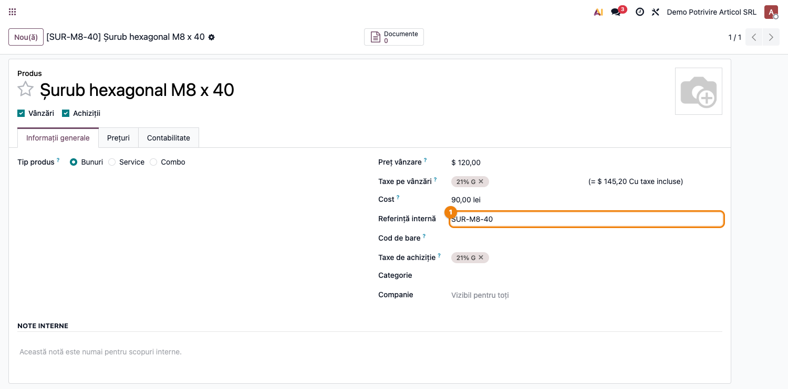
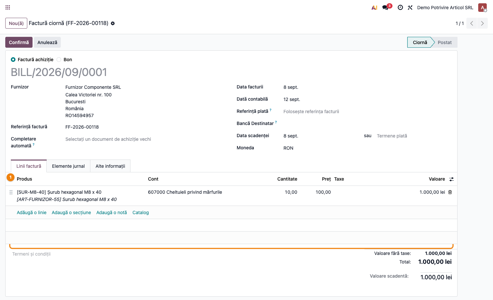
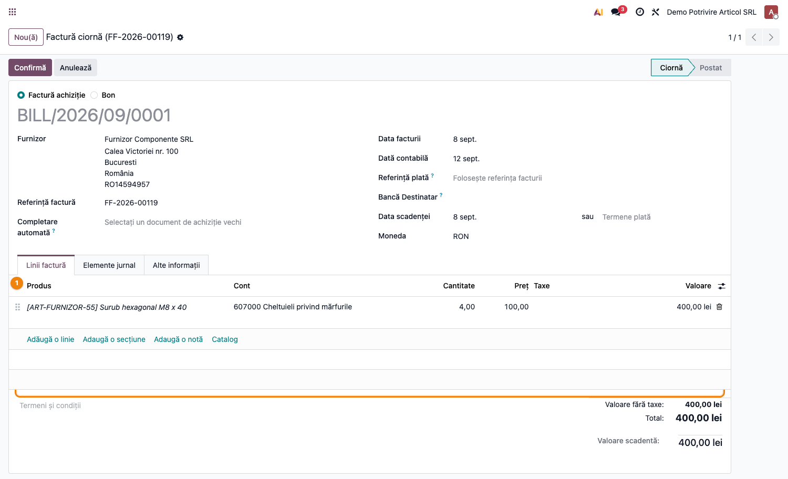

# Fișă Modul: e-Factura — potrivirea articolului la importul din SPV

**Modul:** `l10n_ro_efactura_product_match`
**FR:** FR-03
**Utilizator principal:** Contabil furnizori, Responsabil e-Factura
**Prioritate:** 🔴 Ridicată (afectează tăcut fiecare linie importată)

---

## 1. Scop business

La importul facturilor de cumpărare din SPV, articolul de pe linie trebuie recunoscut automat.
Standardul Odoo caută codul trimis de furnizor, dar **nu caută și codul nostru**, atunci când
furnizorul îl retrimite în factură. Rezultatul: linia se importă fără articol, fără niciun mesaj
de eroare. Modulul adaugă căutarea după codul propriu, astfel încât liniile să fie legate corect
de nomenclatorul nostru de articole.

## 2. Bază legală și context

Nu există o cerință legală proprie. Contextul este tehnic: formatul **CIUS-RO** (obligatoriu pentru
e-Factura, conform OUG 120/2021) permite două identificatoare distincte pentru același articol,
pe linia de factură:

| Element | Cod EN16931 | Ce conține |
|---|---|---|
| `cac:SellersItemIdentification` | BT-155 | codul articolului **la furnizor** |
| `cac:BuyersItemIdentification` | BT-156 | codul articolului **la noi**, retrimis de furnizor |

Doar al doilea are șanse reale să se regăsească în nomenclatorul nostru. Multe facturi primite din
SPV le conțin pe amândouă.

## 3. Utilizatori și roluri

- **Contabil furnizori** — importă facturile din SPV și verifică liniile rezultate.
- **Responsabil nomenclator / achiziții** — întreține referințele interne ale articolelor și codurile
  de furnizor din fila *Achiziții*.
- **Consultant / administrator** — verifică după instalare că potrivirea funcționează pe un furnizor real.

## 4. Conturi și date implicate

Modulul **nu generează note contabile proprii**. El decide doar dacă linia primește sau nu un articol,
iar articolul este cel care aduce mai departe:

- **contul de cheltuială sau de stoc** (ex. `607` mărfuri, `371` stoc de marfă, `301` materii prime),
  moștenit din articol sau din categoria lui;
- **taxele de achiziție** configurate pe articol;
- **unitatea de măsură** și legătura cu gestiunea, pentru articolele stocabile.

Date minime pentru testare:
- un articol cu **Referință internă** completată (`default_code`);
- o factură e-Factura primită de la un furnizor care retrimite acest cod în `BuyersItemIdentification`.

## 5. Configurare inițială

1. Instalați `l10n_ro_efactura_product_match`. Nu are meniuri, câmpuri sau setări proprii.
2. Verificați că `l10n_ro_edi` este configurat și că importul din SPV funcționează.
3. Asigurați-vă că articolele folosite frecvent au **Referința internă** completată — este codul pe
   care furnizorul îl retrimite în factură.
4. Pentru furnizorii care **nu** retrimit codul nostru, completați în articol fila *Achiziții* cu
   codul folosit de furnizor. Aceasta rămâne prima treaptă de căutare.

## 6. Flux de utilizare

### Pasul 1 — Verificați codul intern al articolului

Meniu: **Inventar → Produse → Produse** (sau **Achiziții → Produse → Produse**).

Deschideți articolul și citiți câmpul **Referință internă**. Acesta este codul pe care furnizorul îl
va retrimite în factura electronică, în `BuyersItemIdentification`. În exemplu, `SUR-M8-40`.



### Pasul 2 — Importați factura și verificați linia

Meniu: **Contabilitate → Furnizori → Facturi** (sau din mesajele e-Factura).

După import, deschideți factura și, în fila **Linii factură**, afișați coloana **Produs** din meniul
de coloane opționale (pictograma din dreapta antetului de tabel — coloana este ascunsă implicit).

**Ce găsiți pe ecran:** fiecare linie are două informații distincte — coloana **Produs**, cu articolul
din nomenclatorul nostru, și **Eticheta** (rândul italic dedesubt), care poartă textul trimis de
furnizor, prefixat cu codul lui.

**Ce verificați:** coloana **Produs** este completată și afișează `[Referința internă] Denumirea
noastră` — în exemplu `[SUR-M8-40] Șurub hexagonal M8 x 40`. Eticheta poate arăta în continuare codul
furnizorului (`[ART-FURNIZOR-55]`) — este normal și nu indică o problemă. Verificați și că **Contul**
de pe linie este cel al articolului, nu contul implicit al jurnalului.



### Pasul 3 — Recunoașteți cazul în care potrivirea nu e posibilă

Dacă furnizorul **nu** trimite codul nostru în factură, coloana **Produs** rămâne goală și pe linie
apare doar eticheta trimisă de el.

**Ce verificați:** dacă întâlniți linii fără articol, nu este un defect al modulului — înseamnă că
factura nu conținea `BuyersItemIdentification`. Remediul este completarea codului de furnizor în fila
*Achiziții* a articolului; de la următoarea factură, potrivirea se face pe prima treaptă de căutare.



### Note de monografie și raportare

Modulul nu produce note contabile proprii. Efectul lui asupra monografiei este **indirect, dar real**:

| Situație | Nota generată la validarea facturii |
|---|---|
| Linia are articol (cu modul) | `%` = `401` Furnizori, cu `371`/`607`/`301` — contul articolului — și `4426` TVA deductibilă |
| Linia fără articol (înainte) | contul implicit al jurnalului de achiziții, deci riscul de încadrare greșită pe cheltuială, plus lipsa mișcării de stoc pentru articolele stocabile |

Pentru articolele **stocabile**, linia fără articol nu produce nicio intrare în gestiune — diferența
se vede direct în fișa de magazie și în balanța de stocuri.

## 7. Legături cu alte module / declarații

| Modul / proces | Rol în flux |
|---|---|
| `l10n_ro_edi` | transportul SPV — trimitere, stare, import documente primite |
| `account_edi_ubl_cii` | parserul UBL care citește BT-155 și BT-156 din XML |
| `l10n_ro_efactura_dedup` | împiedică importul dublu al aceleiași facturi |
| `l10n_ro_efactura_import_assist` | controlul diferențelor de cantitate/preț față de comanda de achiziție |
| `product` — fila *Achiziții* | codurile de furnizor, prima treaptă de căutare |
| SAF-T D406 | liniile fără articol afectează raportarea mișcărilor de stoc |

**Ce e automat:** căutarea articolului după codul propriu, la fiecare import din SPV, fără intervenția
operatorului.

**Ce rămâne manual:** completarea codurilor de furnizor pentru partenerii care nu retrimit codul nostru;
verificarea liniilor rămase fără articol înainte de validarea facturii.

## 8. Verificări pentru consultant

- [ ] Modulul este instalat și `l10n_ro_edi` este configurat pentru SPV.
- [ ] Un articol de test are **Referință internă** completată.
- [ ] Factura importată de la un furnizor care retrimite codul nostru are coloana **Produs** completată
      pe toate liniile.
- [ ] Contul de pe linie este contul articolului, nu contul implicit al jurnalului.
- [ ] Pentru un articol stocabil, factura validată produce intrare în gestiune.
- [ ] O factură în care furnizorul trimite **doar** codul lui lasă linia fără articol — comportament
      așteptat; se rezolvă prin fila *Achiziții*.
- [ ] Un furnizor al cărui cod este deja completat în fila *Achiziții* potrivește articolul chiar dacă
      factura nu conține codul nostru.
- [ ] Facturile importate **înainte** de instalare nu se corectează retroactiv — se reimportă sau se
      completează manual.

## 9. Mesaje de eroare frecvente

Modulul nu afișează mesaje proprii. Tabelul de mai jos acoperă simptomele observate în practică.

| Simptom | Cauză | Remediere |
|---|---|---|
| Coloana **Produs** e goală pe toate liniile | Factura nu conține `BuyersItemIdentification` | Completați codul furnizorului în fila *Achiziții* a articolelor |
| Coloana **Produs** e goală doar pe unele linii | Articolele respective nu au **Referință internă**, sau codul diferă de cel trimis | Completați sau corectați referința internă |
| Se potrivește **alt** articol decât cel așteptat | Există o înregistrare în fila *Achiziții* cu același cod la alt articol — are prioritate mai mare | Corectați codurile de furnizor duplicate |
| Eticheta liniei arată codul furnizorului | Comportament normal — eticheta reproduce textul din XML | Nicio acțiune; verificați coloana **Produs** |
| Liniile vechi au rămas fără articol | Modulul acționează doar la import | Reimportați factura sau completați manual liniile |

## 10. Capturi de ecran

Capturile sunt **generate automat** din `tests/test_screenshots.py` (mixinul `ScreenshotCase` din
`l10n_ro_doc_screenshots`, cu import defensiv), în limba română, pe planul de conturi RO. Facturile din
capturi provin dintr-un **import UBL real**, nu din documente fabricate: testul construiește două XML-uri
CIUS-RO și le trece prin jurnalul de achiziții.

| Fișier | Conținut |
|---|---|
| `01_articol_cod_intern.png` | Fișa articolului, cu **Referința internă** evidențiată |
| `02_factura_articol_potrivit.png` | Factura importată din SPV — coloana **Produs** completată cu articolul nostru |
| `03_factura_fara_potrivire.png` | Factura fără `BuyersItemIdentification` — linia rămâne fără articol |

Regenerare:

```bash
./odoo/odoo-bin -c odoo.conf -d <db> -i l10n_ro_efactura_product_match,l10n_ro_doc_screenshots --test-tags=/l10n_ro_efactura_product_match:TestProductMatchScreenshots --stop-after-init
```

> Rularea cu `--test-tags=fise_screenshots` ar rescrie capturile **tuturor** modulelor din suită;
> restrângeți-o la clasă, ca în comanda de mai sus.

## 11. Observații pentru manual

- Distincția **Produs** vs. **Etichetă** pe linia de factură merită explicată o dată, clar: sunt două
  informații diferite, iar eticheta va conține aproape întotdeauna codul furnizorului. Operatorii
  confundă frecvent cele două și raportează fals „articol greșit".
- Coloana **Produs** este ascunsă implicit în lista de linii — merită menționat unde se activează,
  altfel verificarea pare imposibilă.
- Merită subliniat că o linie fără articol **nu blochează** validarea facturii. Tocmai de aceea
  verificarea trebuie făcută înainte de validare, nu după.
- Ordinea de căutare (cod de furnizor → cod de bare → cod intern → codul nostru din factură → denumire)
  explică de ce uneori se potrivește alt articol decât cel așteptat; o listă scurtă în manual
  economisește multe întrebări.
