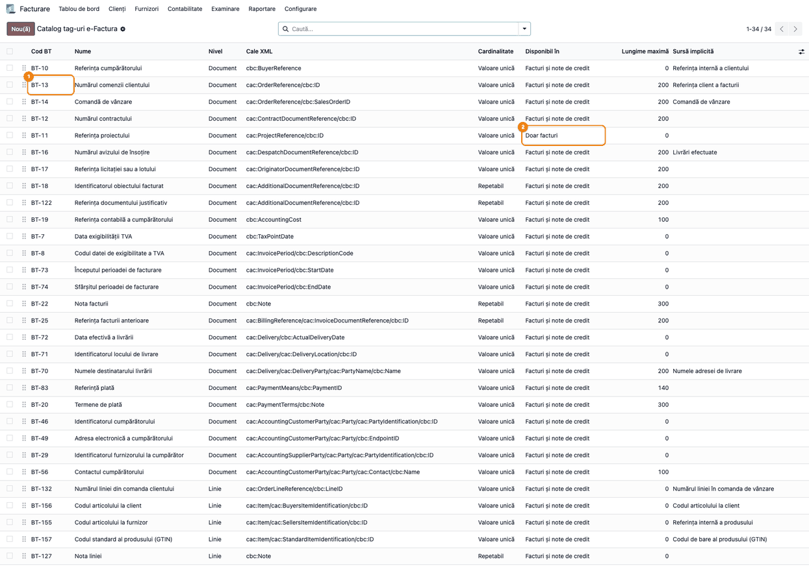
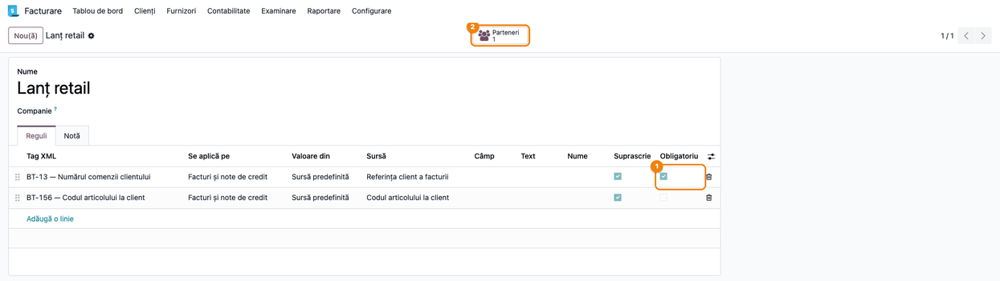
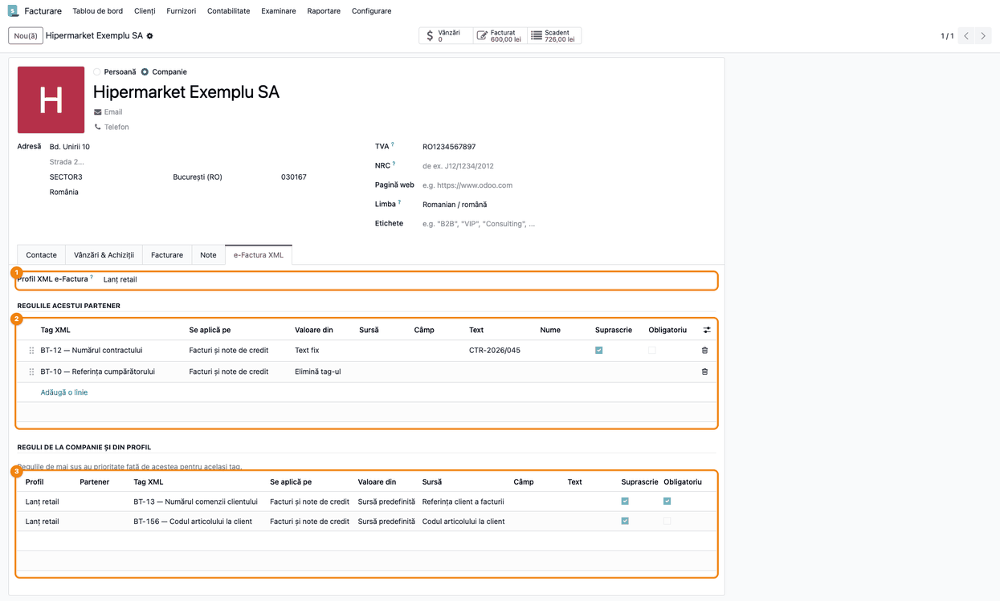
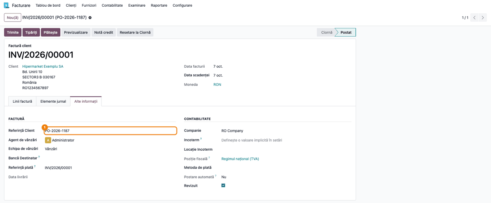
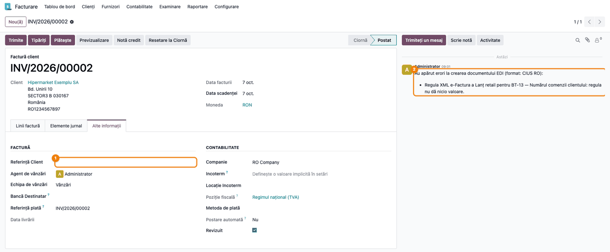
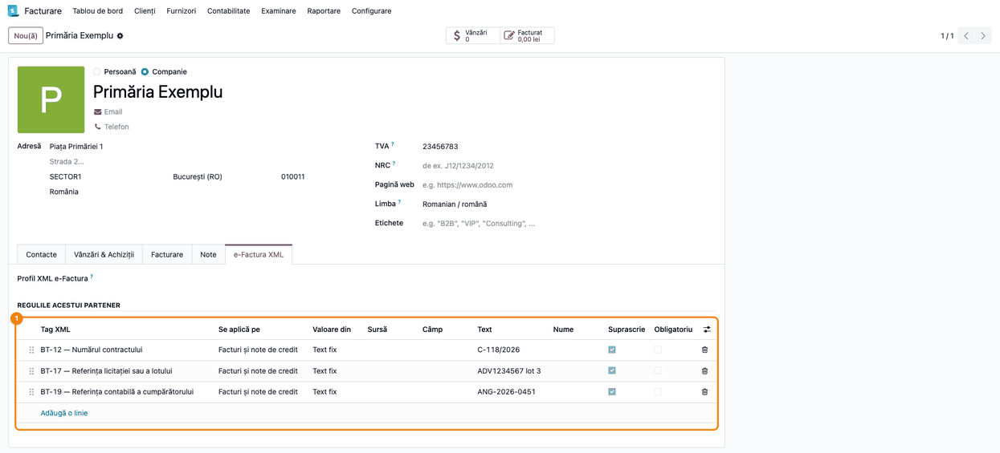
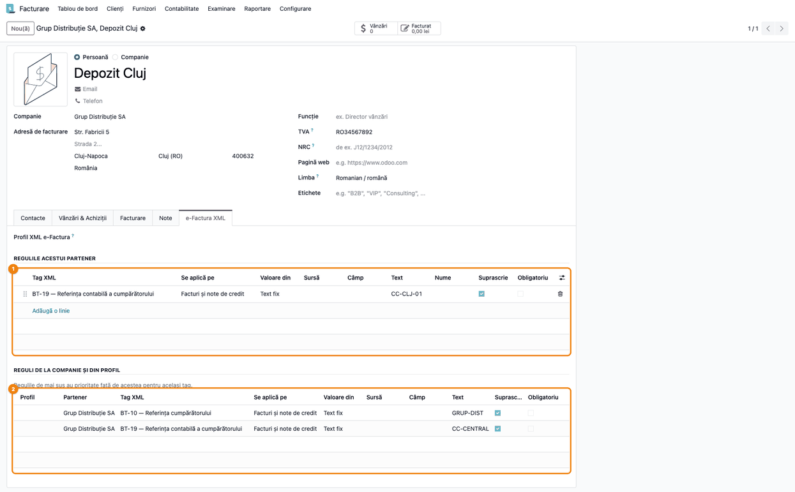
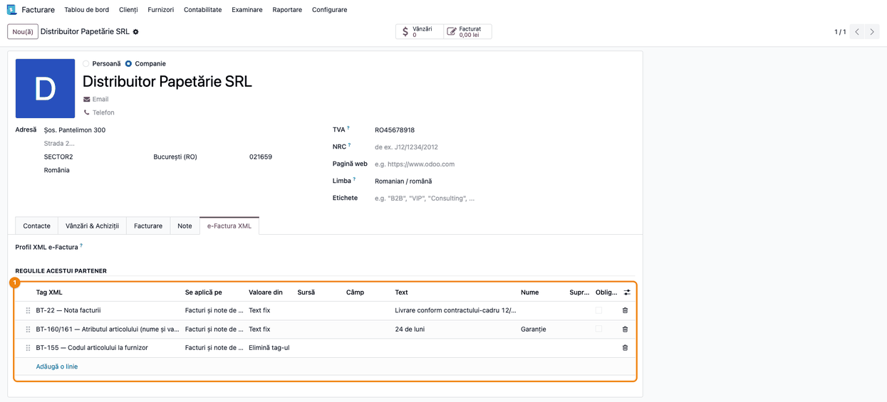

# Fișă Modul: Reguli XML e-Factura per client

**Poziție plan:** C22
**Modul:** `l10n_ro_efactura_xml_rules`
**FR:** FR-79
**Capitol manual:** Cap 12.15
**Utilizator principal:** Responsabil e-Factura / Contabil clienți (configurare), Operator facturare (emitere)
**Prioritate:** 🟡 Medie (cerință contractuală a cumpărătorilor mari, nu obligație fiscală)

---

## 1. Scop business

Odoo generează același XML e-Factura (CIUS-RO) pentru toți cumpărătorii. Cumpărătorii mari cer însă
date diferite în factură: lanțurile de retail vor numărul comenzii lor și codul articolului din
nomenclatorul lor, instituțiile publice vor numărul contractului și lotul de licitație, iar unele
sisteme de recepție resping un tag pe care Odoo îl pune implicit. ANAF validează factura și fără
aceste date, dar cumpărătorul o respinge la recepție și nu o plătește.

Modulul permite configurarea acestor cerințe din interfață, pe client, fără dezvoltare: ce tag se
completează, de unde vine valoarea și dacă lipsa ei trebuie să oprească trimiterea în SPV.

## 2. Bază legală și context

- **OUG 120/2021** privind sistemul național RO e-Factura, cu modificările ulterioare: obligația de
  transmitere a facturilor prin SPV.
- **SR EN 16931-1:2017** și **CIUS-RO**: structura facturii electronice. Fiecare informație are un
  cod de termen de business (BT-xx), de exemplu BT-13 pentru numărul comenzii cumpărătorului.
- Tag-urile din acest modul sunt **opționale** în CIUS-RO. Obligativitatea lor vine din contractul
  cu cumpărătorul, nu din lege; de aceea configurarea se face pe client.

## 3. Utilizatori și roluri

| Rol | Ce face | Drept necesar |
|---|---|---|
| Responsabil e-Factura / Contabil clienți | configurează profilurile și regulile pe clienți | **Gestiune reguli XML e-Factura** (acordat explicit) |
| Operator facturare | emite facturile și completează referința clientului | Facturare (standard); nu are nevoie de dreptul de mai sus |

La testare folosiți doi utilizatori: unul cu dreptul dedicat (configurează) și unul doar cu
Facturare (emite). Al doilea nu vede tab-ul „e-Factura XML” pe partener, dar facturile lui primesc
regulile.

## 4. Conturi și date implicate

Modulul **nu generează note contabile** și nu atinge conturi: schimbă doar conținutul XML-ului
e-Factura. Date minime pentru demo:

- o companie RO cu e-Factura configurată (`l10n_ro_edi`);
- un client firmă, cu formatul e-Factura **CIUS-RO**;
- un articol cu cod intern și, dacă e instalat modulul de coduri ale clientului, codul lui la
  client;
- o factură de client cu **Referință Client** completată (numărul comenzii primite).

## 5. Configurare inițială

1. Instalați `l10n_ro_efactura_xml_rules` (dependență: `l10n_ro_edi`).
2. **Setări → Utilizatori și companii → Utilizatori** → utilizatorul care configurează →
   secțiunea Contabilitate → **Reguli XML e-Factura**: alegeți **Gestiune reguli XML e-Factura**.
   Implicit nu îl are nimeni, nici administratorul.
3. Opțional, pentru codul articolului la client (BT-156): instalați modulul care ține codurile
   clientului pe articol (`deltatech_sale_product_reference`) și completați codurile.

## 6. Flux de utilizare

### Pasul 1 — Catalogul de tag-uri

**Facturare → Configurare → Facturare → Catalog tag-uri e-Factura**.

Lista arată tag-urile care pot fi configurate, pe nivel: **Document** (antetul facturii) și **Linie**
(fiecare articol). Pentru fiecare tag vedeți codul BT, denumirea, calea în XML, dacă se
poate repeta, pe ce documente există și sursa propusă implicit. Exemple:

- ① **BT-13 — Numărul comenzii clientului**: o singură valoare, maximum 200 de caractere, sursa
  implicită este referința client a facturii;
- ② **BT-11 — Referința proiectului**: **Doar facturi**. În acest modul BT-11 se configurează
  doar pe facturi, pentru că nodul `cac:ProjectReference` nu există în structura UBL a notei de
  credit.

În coloana **Lungime maximă**, 0 înseamnă că CIUS-RO nu impune o limită pentru acel tag. Catalogul
vine cu modulul; nu trebuie completat. Administratorul vede catalogul, dar profilurile și tab-ul de
pe partener le vede doar cine are dreptul **Gestiune reguli XML e-Factura**.



### Pasul 2 — Profilul pentru un tip de client

**Facturare → Configurare → Facturare → Profiluri XML e-Factura → Nou**.

Un profil grupează regulile cerute de un tip de client. Exemplu, **Lanț retail**:

| Tag XML | Valoare din | Sursă | Obligatoriu |
|---|---|---|---|
| BT-13 — Numărul comenzii clientului | Sursă predefinită | Referința client a facturii | ✔ |
| BT-156 — Codul articolului la client | Sursă predefinită | Codul articolului la client | |

- **Se aplică pe**: facturi, note de credit sau ambele.
- **Suprascrie** bifat înlocuiește valoarea pusă de Odoo. Debifat, regula completează doar dacă
  Odoo a lăsat tag-ul gol. Dacă regula nu dă nicio valoare și nu e obligatorie, rămâne valoarea pusă
  de Odoo: la BT-13 aceasta este numărul facturii. De aceea BT-13 se marchează **Obligatoriu**.
- **Obligatoriu** ①: dacă regula nu dă valoare, factura nu pleacă în SPV.
- Butonul **Parteneri** ② arată clienții care folosesc profilul.



### Pasul 3 — Profilul și regulile proprii pe client

**Facturare → Clienți → Clienți** → clientul → tab-ul **e-Factura XML**.

1. În **Profil XML e-Factura** ① alegeți **Lanț retail**.
2. În **Regulile acestui partener** ② adăugați ce cere doar acest client:
   - **BT-12 — Numărul contractului**, Text fix `CTR-2026/045`;
   - **BT-10 — Referința cumpărătorului**, Valoare din = **Elimină tag-ul** (sistemul lor de
     recepție respinge referința internă pe care o pune Odoo).
3. Sub ele, **Reguli de la companie și din profil** ③ arată, doar pentru citire, regulile moștenite.
   „Companie” înseamnă aici **firma-mamă** a contactului facturat (partenerul de tip companie), nu
   compania dumneavoastră din Odoo. Coloana **Partener** se completează doar pentru regulile venite
   de la firma-mamă; pentru cele din profil e goală.

Ordinea de aplicare pentru același tag: regula contactului facturat (de exemplu adresa de facturare
a unui magazin), apoi regula firmei-mamă, apoi regula din profil.



### Pasul 4 — Factura către client

**Facturare → Clienți → Facturi → Nou** (sau factura creată din comanda de vânzare).

În tab-ul **Alte informații**, completați **Referință Client** ① cu numărul comenzii primite de la
client (`PO-2026-1187`). La facturarea dintr-o comandă de vânzare, Odoo copiază aici automat
referința clientului din comandă.
Confirmați factura și trimiteți-o în SPV ca de obicei (**Trimite**).



**Ce găsiți în XML.** După **Trimite**, XML-ul CIUS-RO apare ca atașament în istoricul facturii
(fișierul `..._cius_ro.xml`, iconița de agrafă din dreapta-sus a istoricului). Deschideți-l și
căutați:

1. **Găsiți** — nodurile cerute de client:

   ```xml
   <cac:OrderReference>
     <cbc:ID>PO-2026-1187</cbc:ID>
   </cac:OrderReference>
   <cac:ContractDocumentReference>
     <cbc:ID>CTR-2026/045</cbc:ID>
   </cac:ContractDocumentReference>
   ...
   <cac:InvoiceLine>
     ...
     <cac:Item>
       <cbc:Name>[APA-2L] Apă minerală 2L</cbc:Name>
       <cac:BuyersItemIdentification>
         <cbc:ID>778812</cbc:ID>
       </cac:BuyersItemIdentification>
       <cac:SellersItemIdentification>
         <cbc:ID>APA-2L</cbc:ID>
       </cac:SellersItemIdentification>
       ...
   ```

2. **Verificați:**
   - `cac:OrderReference/cbc:ID` este numărul comenzii clientului, nu numărul facturii;
   - `cac:ContractDocumentReference/cbc:ID` are contractul de pe client;
   - fiecare linie are `cac:BuyersItemIdentification` cu codul articolului la client;
   - `cbc:BuyerReference` **nu** apare (eliminat prin regula de pe client).
3. Abia apoi considerați configurarea clientului încheiată. Pentru următoarele facturi nu mai e
   nevoie de verificare: regulile se aplică la fiecare generare a XML-ului.
   Dacă ați modificat regulile după o trimitere eșuată sau respinsă, ștergeți întâi atașamentul
   `_cius_ro.xml` din istoricul facturii: altfel Odoo retrimite XML-ul vechi, fără regula nouă.

### Pasul 5 — Factura oprită de o regulă obligatorie

Dacă **Referință Client** rămâne goală, regula BT-13 (obligatorie) nu dă nicio valoare. Fără modul,
Odoo ar fi trimis numărul facturii în locul comenzii, iar cumpărătorul ar fi respins factura. Acum
trimiterea se oprește înainte de SPV, cu mesajul:

> Regula XML e-Factura a Lanț retail pentru BT-13 — Numărul comenzii clientului: regula nu dă nicio
> valoare.

La trimiterea unei singure facturi, mesajul apare într-o fereastră de eroare. La trimiterea mai
multor facturi odată (sau din procesarea automată), apare în istoricul facturii ②, ca în captură,
lângă câmpul **Referință Client** ① rămas gol. Completați-l și retrimiteți.



### Pasul 6 — Exemple de configurare pe tipuri de client

Exemplul „Lanț retail” din pașii 2–5 acoperă cel mai des întâlnit caz. Mai jos sunt trei configurări
tipice, fiecare cu regulile, ecranul și ce rezultă în XML. Toate se fac în tab-ul **e-Factura XML**
al clientului, ca la Pasul 3.

#### A. Instituție publică

Instituția cere pe factură numărul contractului, referința procedurii de achiziție din SICAP (fost
SEAP) și, uneori, codul de angajament bugetar. Fără numărul contractului, instituția poate refuza
recepția facturii.

| Tag XML | Valoare din | Text |
|---|---|---|
| BT-12 — Numărul contractului | Text fix | `C-118/2026` |
| BT-17 — Referința licitației sau a lotului | Text fix | `ADV1234567 lot 3` |
| BT-19 — Referința contabilă a cumpărătorului | Text fix | `ANG-2026-0451` |

Regulile ① stau pe client, nu într-un profil: fiecare instituție are contractul ei. Când se
semnează un contract nou, schimbați textul regulii. **Obligatoriu** nu e necesar aici: o regulă cu
text fix dă mereu o valoare. Bifa contează doar la **Sursă predefinită** și **Câmp**, unde valoarea
poate lipsi.



În XML:

```xml
<cbc:AccountingCost>ANG-2026-0451</cbc:AccountingCost>
...
<cac:ContractDocumentReference>
  <cbc:ID>C-118/2026</cbc:ID>
</cac:ContractDocumentReference>
<cac:OriginatorDocumentReference>
  <cbc:ID>ADV1234567 lot 3</cbc:ID>
</cac:OriginatorDocumentReference>
```

#### B. Grup cu centre de cost pe adrese de facturare

Grupul primește facturile la sediu (referința cumpărătorului `GRUP-DIST`), dar le înregistrează pe
centrul de cost al depozitului care a comandat. Regulile se pun pe două niveluri. Contactul
**Depozit Cluj** se deschide din lista **Facturare → Clienți → Clienți**, căutat după nume: din
tab-ul **Contacte** al grupului se deschide doar fereastra simplificată, fără tab-ul e-Factura XML.

| Unde | Tag XML | Text |
|---|---|---|
| firma-mamă **Grup Distribuție SA** | BT-10 — Referința cumpărătorului | `GRUP-DIST` |
| firma-mamă **Grup Distribuție SA** | BT-19 — Referința contabilă a cumpărătorului | `CC-CENTRAL` |
| contactul de facturare **Depozit Cluj** | BT-19 — Referința contabilă a cumpărătorului | `CC-CLJ-01` |

Pe contactul **Depozit Cluj**, regula proprie ① e deasupra regulilor moștenite de la firma-mamă ②.
Pentru BT-19 câștigă regula contactului; BT-10 vine de la firma-mamă.



Rezultatul în XML, pe facturi către adrese diferite ale aceluiași grup:

| Factura către | `cbc:BuyerReference` | `cbc:AccountingCost` |
|---|---|---|
| Depozit Cluj | `GRUP-DIST` | `CC-CLJ-01` (regula contactului) |
| Depozit Iași (fără reguli proprii) | `GRUP-DIST` | `CC-CENTRAL` (regula firmei-mamă) |

Fără reguli, Odoo ar fi pus în `cbc:BuyerReference` referința internă a grupului (`GD-01`), iar
`cbc:AccountingCost` ar fi lipsit.

#### C. Client cu cerințe pe linia facturii

Distribuitorul cere o mențiune despre contractul-cadru și garanția pe fiecare articol. Sistemul
lui de recepție respinge elementul separat cu codul nostru de articol (BT-155).

| Tag XML | Valoare din | Nume | Text |
|---|---|---|---|
| BT-22 — Nota facturii | Text fix | | `Livrare conform contractului-cadru 12/2025` |
| BT-160/161 — Atributul articolului (nume și valoare) | Text fix | `Garanție` | `24 de luni` |
| BT-155 — Codul articolului la furnizor | Elimină tag-ul | | |

Regulile ① sunt pe client. BT-22 și BT-160/161 sunt **repetabile**: o regulă adaugă un element nou,
nu îl înlocuiește pe cel existent, de aceea coloana **Suprascrie** nu se aplică la ele. La atributul
de articol, coloana **Nume** e obligatorie.

La tag-urile repetabile nu câștigă un singur nivel: notele sau atributele de pe contact, firma-mamă
și profil apar toate în XML. O regulă **Elimină tag-ul** pe un nivel le oprește pe cele de pe
nivelurile de sub el. Nota are cel mult 300 de caractere; dacă factura are și **Termeni și
condiții**, în XML apar ambele note.



În XML, nota apare o dată, în antetul facturii, iar atributul pe fiecare linie:

```xml
<cbc:Note>Livrare conform contractului-cadru 12/2025</cbc:Note>
...
<cac:Item>
  <cbc:Name>[HA4-500] Hârtie copiator A4</cbc:Name>
  ...
  <cac:AdditionalItemProperty>
    <cbc:Name>Garanție</cbc:Name>
    <cbc:Value>24 de luni</cbc:Value>
  </cac:AdditionalItemProperty>
</cac:Item>
```

Elementul `cac:SellersItemIdentification` (BT-155) nu mai apare. Codul nostru rămâne totuși în
denumirea articolului (`cbc:Name`, `[HA4-500] ...`), pe care o generează Odoo.

### Note de monografie și raportare

Modulul **nu generează note contabile** și nu modifică totalurile facturii sau TVA-ul calculat. Nota
contabilă a facturii rămâne cea pe care Odoo o generează și fără modul (`4111 = 70x + 4427`,
respectiv `4428` la TVA la încasare).

XML-ul ajunge însă la ANAF, iar datele din e-Factura alimentează decontul precompletat (RO e-TVA).
Două tag-uri din catalog privesc **exigibilitatea TVA**: **BT-7** (data exigibilității) și **BT-8**
(codul datei de exigibilitate: 3, 35 sau 432). O regulă pe ele poate declara în XML altă
exigibilitate decât cea din contabilitate, de exemplu la TVA la încasare (4428). Puneți reguli pe
BT-7 sau BT-8 doar cu acordul contabilului și în concordanță cu regimul de TVA al facturii. BT-7 și
BT-8 nu se folosesc împreună: standardul EN 16931 (regula BR-CO-03) le exclude reciproc, iar
factura cu ambele e respinsă.

## 7. Legături cu alte module / declarații

| Modul | Rol în flux |
|---|---|
| `l10n_ro_edi` | generează XML-ul CIUS-RO și îl trimite în SPV; regulile se aplică pe XML-ul lui |
| `deltatech_sale_product_reference` | opțional: codurile articolelor la client, folosite de sursa BT-156 |
| `sale` / `sale_stock` | opțional: sursele „Numărul comenzii clientului (comanda de vânzare)” și „Livrări efectuate” |
| `deltatech_account_edi_ubl_advice` | pune automat BT-16 din livrări; aceeași valoare se poate obține cu sursa „Livrări efectuate” |
| `l10n_ro_efactura_enhancement` | aplică limitele de lungime CIUS-RO prin trunchiere; pentru tag-urile din reguli, modulul acesta oprește exportul înainte |

**Ce e automat:** aplicarea regulilor la fiecare generare a XML-ului, ordinea contact → firmă-mamă →
profil, oprirea trimiterii când lipsește o valoare obligatorie sau e prea lungă.

**Ce rămâne manual:** configurarea profilurilor și a regulilor pe clienți, completarea referinței
clientului pe factură, codurile articolelor la client.

## 8. Verificări pentru consultant

- [ ] Utilizatorul fără dreptul **Gestiune reguli XML e-Factura** nu vede tab-ul „e-Factura XML” și
      nu poate crea reguli; facturile emise de el primesc totuși regulile.
- [ ] Catalogul are tag-uri pe ambele niveluri (Document, Linie); BT-11 apare „Doar facturi”.
- [ ] O regulă BT-11 cu „Se aplică pe” = Note de credit este refuzată la salvare.
- [ ] XML-ul unei facturi cu Referință Client conține acea referință în `cac:OrderReference/cbc:ID`.
- [ ] Regula BT-12 de pe client apare în `cac:ContractDocumentReference/cbc:ID`.
- [ ] Fiecare linie are `cac:BuyersItemIdentification/cbc:ID` cu codul articolului la client.
- [ ] `cbc:BuyerReference` lipsește când clientul are regula „Elimină tag-ul” pe BT-10.
- [ ] O regulă pe contactul facturat are prioritate față de regula firmei-mamă pentru același tag.
- [ ] Fără regulă obligatorie pe BT-13 și fără Referință Client, XML-ul conține numărul facturii în
      `cac:OrderReference/cbc:ID` (comportamentul standard Odoo).
- [ ] Instituția publică: XML-ul are contractul, procedura SICAP și angajamentul (exemplul A).
- [ ] Grupul: factura către Depozit Cluj are `CC-CLJ-01`, iar cea către Depozit Iași are
      `CC-CENTRAL`; ambele au `GRUP-DIST` în `cbc:BuyerReference` (exemplul B).
- [ ] Clientul cu cerințe pe linie: fiecare linie are atributul „Garanție”, iar elementul
      `cac:SellersItemIdentification` lipsește (exemplul C).
- [ ] Nicio regulă nu pune simultan BT-7 și BT-8; dacă există reguli pe ele, contabilul a confirmat
      exigibilitatea.
- [ ] Fără Referință Client, trimiterea se oprește cu mesajul care numește profilul și BT-13.
- [ ] Un text fix de peste 200 de caractere pe BT-13 oprește exportul (nu este trunchiat).
- [ ] Facturile clienților fără profil și fără reguli au același XML ca înainte de instalare.

## 9. Mesaje de eroare frecvente

| Mesaj | Cauză | Remediere |
|---|---|---|
| Regula XML e-Factura a … pentru BT-xx: regula nu dă nicio valoare | regula e obligatorie, iar sursa e goală (de exemplu Referință Client necompletată) | completați datele pe factură sau debifați **Obligatoriu** |
| … valoarea are N caractere, CIUS-RO permite cel mult M | textul sau câmpul sursă e prea lung pentru tag | scurtați valoarea; nu se trunchiază automat, ca referința să rămână corectă |
| Tag-ul … este disponibil în: Doar facturi | tag-ul nu există pe nota de credit (BT-11) | alegeți **Se aplică pe = Facturi** |
| … are deja o regulă pentru … pe aceleași documente | două reguli pentru același tag cu o singură valoare, pe același client sau profil | păstrați o singură regulă; pentru alt contact, puneți-o pe contact |
| Câmpul … nu există pe … | calea de câmp scrisă greșit | alegeți câmpul din selector, nu îl scrieți de mână |
| Mesajul Odoo de acces refuzat la crearea unei „Regulă XML e-Factura” (text aproximativ) | utilizatorul nu are dreptul dedicat | acordați **Gestiune reguli XML e-Factura** (Pasul 2 din configurare) |
| XML-ul trimis nu conține regula nouă | factura avea deja un XML generat, pe care Odoo îl retrimite | ștergeți atașamentul `_cius_ro.xml` (factură netransmisă sau respinsă în SPV) și retrimiteți |
| Alegeți sursa valorii pentru … / Scrieți textul pentru … | regula nu are completată sursa sau textul | completați coloana Sursă sau Text a regulii |
| O regulă care elimină un tag nu poate fi obligatorie. | „Elimină tag-ul” și „Obligatoriu” bifate împreună | debifați **Obligatoriu** |
| Tag-ul … are nevoie de un nume lângă valoare. | atributul de articol (BT-160/161) cere numele atributului | completați coloana **Nume** (de exemplu „Lot”) |

## 10. Capturi de ecran

Capturile sunt generate automat de `tests/test_screenshots.py` (mixinul `ScreenshotCase` din
`l10n_ro_doc_screenshots`, import defensiv), în limba română, pe planul de conturi RO:

```bash
./odoo/odoo-bin -c odoo.conf -d <db> -u l10n_ro_efactura_xml_rules \
    -i l10n_ro_doc_screenshots,deltatech_sale_product_reference \
    --test-tags=fise_screenshots --stop-after-init
```

| # | Fișier | Conținut |
|---|--------|----------|
| 1 | `static/description/01_catalog_taguri.png` | Catalogul de tag-uri: BT-13 ① și BT-11, disponibil doar pe facturi ② |
| 2 | `static/description/02_profil_lant_retail.png` | Profilul „Lanț retail” cu BT-13 obligatoriu ① și BT-156; butonul Parteneri ② |
| 3 | `static/description/03_partener_efactura_xml.png` | Clientul, tab-ul „e-Factura XML”: profilul ①, regulile proprii BT-12 și BT-10 ②, regulile moștenite ③ |
| 4 | `static/description/04_factura_client.png` | Factura către client, tab-ul Alte informații: Referință Client ① |
| 5 | `static/description/05_factura_blocata.png` | Factura fără referință: Referință Client goală ① și mesajul regulii BT-13 în istoric ② |
| 6 | `static/description/06_institutie_publica.png` | Exemplul A: regulile instituției publice ① (contract, procedură SICAP, angajament) |
| 7 | `static/description/07_grup_contact_cluj.png` | Exemplul B: contactul Depozit Cluj, regula proprie BT-19 ① și regulile moștenite de la grup ② |
| 8 | `static/description/08_client_cerinte_linie.png` | Exemplul C: notă, atributul „Garanție” și eliminarea BT-155 ① |

## 11. Observații pentru manual

- Explicați întâi **de ce** (factura validată de ANAF poate fi respinsă de cumpărător) și abia apoi
  configurarea; altfel regulile par o complicație inutilă.
- Profilul se construiește din documentul primit de la client (caiet de sarcini, ghid EDI, contract).
  Recomandați ca documentul să fie menționat în nota profilului.
- Subliniați că o factură deja trimisă în SPV nu se modifică: regulile noi se aplică doar la
  următoarea generare a XML-ului. Dacă factura are deja un XML generat și nu a fost acceptată în
  SPV (netransmisă sau respinsă), ștergeți atașamentul înainte de retrimitere.
- Avertizați asupra regulilor pe BT-7/BT-8 (exigibilitatea TVA): se configurează doar împreună cu
  contabilul.
- Codurile BT pot fi date ca referință de către clienți („ne trebuie BT-13 și BT-156”): catalogul se
  caută după cod.
