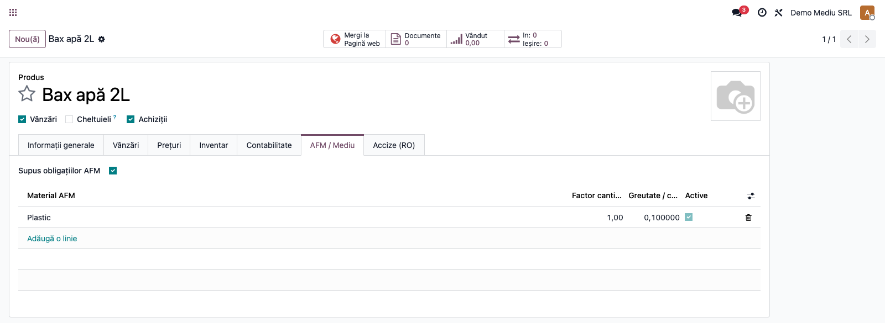
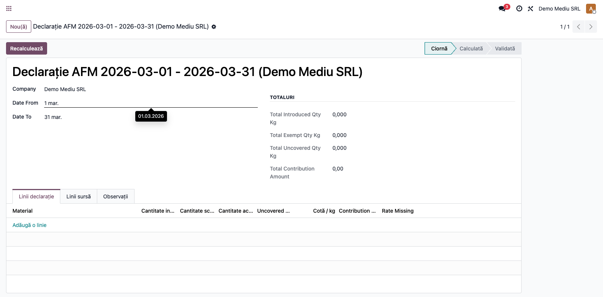
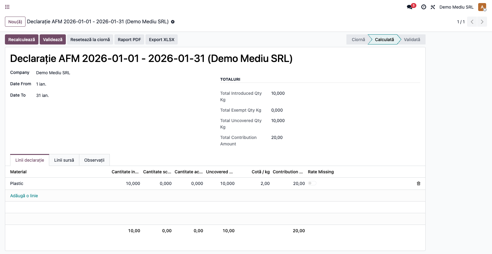
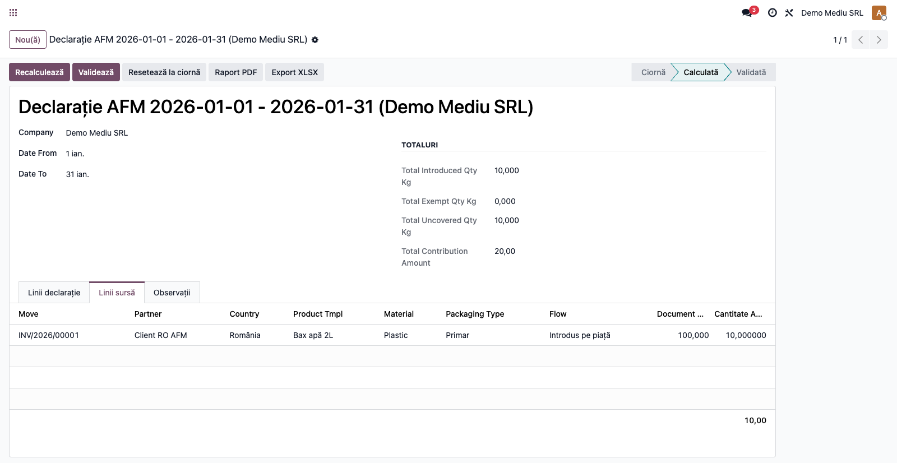
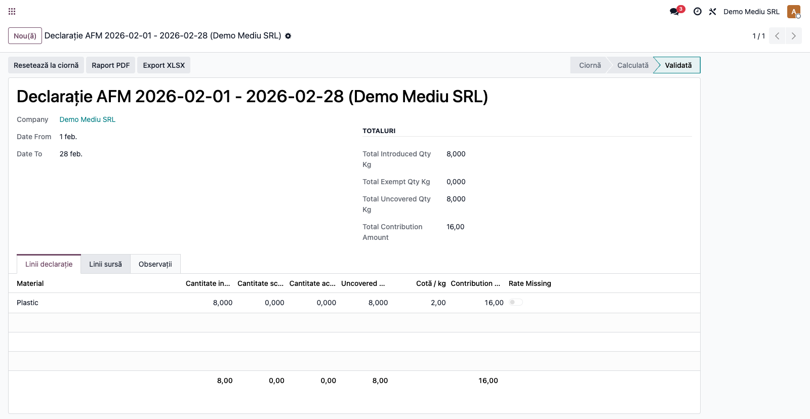

# Fișă Modul: Taxe de mediu / AFM

**Poziție plan:** B8.6
**Modul:** `l10n_ro_environmental_tax`
**FR:** FR-48
**Capitol manual:** Cap 12.11 — Taxe de mediu / AFM
**Utilizator principal:** Contabil, Responsabil mediu, Manager financiar
**Prioritate:** 🔴 Ridicată
**Status document:** Beta consultant

---

## 1. Scop business

Modulul gestionează evidența obligațiilor către **Fondul pentru Mediu (AFM)** pe
produse și perioade, astfel încât compania să poată calcula cantitățile introduse
pe piață, cantitățile scutite/exportate, partea acoperită prin **OIREP/OTR** și
contribuția estimată de plată.

În versiunea curentă, modulul acoperă operațional:

- configurarea profilului AFM pe produs;
- nomenclatorul de materiale și cotele AFM pe perioadă;
- contracte OIREP / operator autorizat;
- declarație AFM persistentă pe perioadă;
- calcul din facturi de vânzare postate și retururi;
- trasabilitate până la documentul sursă.

Modulul produce raportul suport al declarației în **PDF** și **XLSX**. Nu depune direct
în portalurile AFM și nu generează încă exporturile finale eTAX/SIATD.

---

## 2. Bază legală

- **OUG 196/2005** privind Fondul pentru mediu.
- **Legea 249/2015** privind ambalajele și deșeurile de ambalaje.
- **Legea 45/2023** privind bateriile și acumulatorii.
- **Legea 212/2015** privind deșeurile de echipamente electrice și electronice.
- Obligațiile operaționale și de raportare din platformele **AFM eTAX** și
  **SIATD / ROAFM**.

---

## 3. Utilizatori și roluri

| Rol | Acțiune |
|-----|---------|
| Responsabil mediu | clasifică produsele și verifică materialele/cotele |
| Contabil | calculează declarația AFM și verifică totalurile |
| Manager financiar | aprobă varianta finală și reconcilierea cu operatorii |
| Administrator contabilitate | întreține cotele AFM și poate reseta documentele |

---

## 4. Configurare inițială

### 4.1 Instalare și dependențe

Instalați:

| Modul | Rol |
|------|-----|
| `l10n_ro_environmental_tax` | evidență și calcul AFM |
| `account` | sursa principală de calcul: facturi și retururi |
| `product` | profil AFM pe produs |
| `l10n_ro` | bază localizare România |

Observație: în versiunea curentă, calculul declarației folosește **facturi de
vânzare** și **stornări de vânzare** postate. Importurile, stocurile, POS și
e-commerce nu sunt încă incluse în motorul de calcul.

### 4.2 Materiale AFM

**Contabilitate → Raportare → AFM / Mediu → Materiale AFM**

Materialele sunt livrate cu date implicite și sunt grupate pe categorii:

| Categorie | Exemple |
|-----------|---------|
| Ambalaje | plastic, hârtie/carton, metal, sticlă, lemn, aluminiu, compozit |
| Baterii / acumulatori | portabilă, industrială, auto, EV |
| EEE / DEEE | categoriile AFM cat1–cat10 |
| Anvelope | PC, LT, TBR, AG, MC |
| Uleiuri | motor, transmisie, hidraulic, industrial |

[SCREENSHOT: Materiale AFM]

### 4.3 Cote AFM

**Contabilitate → Raportare → AFM / Mediu → Cote AFM**

Pentru fiecare material activ trebuie să existe o cotă valabilă în perioada
declarată.

| Câmp | Observație |
|------|------------|
| Categorie | trebuie să corespundă materialului |
| Material AFM | selectat din nomenclator |
| Data început | obligatorie |
| Data sfârșit | opțională |
| Cotă / kg | nu poate fi negativă |

Exemple implicite 2025:

| Zonă | Exemplu cotă |
|------|--------------|
| Ambalaje plastic / aluminiu | 2,00 RON/kg |
| Ambalaje hârtie, sticlă, lemn etc. | 0,80–1,50 RON/kg |
| Anvelope | 3,00 RON/kg |
| Uleiuri | 1,00 RON/kg |

[SCREENSHOT: Cote AFM]

### 4.4 Configurare produs

**Vânzări / Produse → Produse → deschideți produsul → tab `AFM / Mediu`**

Pe produs se completează:

| Câmp | Rol |
|------|-----|
| `Supus obligațiilor AFM` | marchează produsul ca relevant pentru AFM |
| `Materiale AFM` | una sau mai multe linii per produs |
| `Tip ambalaj` | doar pentru categoria Ambalaje |
| `Factor cantitate` | multiplicator per unitate produs |
| `Greutate / cantitate (kg)` | cantitatea AFM per unitate |
| `Ambalaj SGR` | marcaj informativ pentru ambalajele din schema SGR |

Exemplu de configurare:

| Produs | Material | Tip | Factor | Kg / unitate |
|--------|----------|-----|--------|--------------|
| Bax apă 2L | Plastic | Primar | 1,00 | 0,100 |
| Laptop | EEE cat3 | — | 1,00 | 1,800 |
| Laptop | Baterie portabilă | — | 1,00 | 0,400 |
| Anvelopă 205/55 R16 | Anvelopă PC | — | 1,00 | 8,500 |

Regula implementată: un produs marcat cu obligații AFM trebuie să aibă cel puțin o
linie de material activă, altfel nu poate fi salvat corect operațional.



### 4.5 Contracte OIREP / operator autorizat

**Contabilitate → Raportare → AFM / Mediu → Contracte OIREP**

Aceste contracte permit completarea automată a cantității acoperite în declarație.

| Câmp | Rol |
|------|-----|
| Operator / OIREP | partenerul responsabil |
| Categorie | ambalaje / baterii / EEE / anvelope / uleiuri |
| Materiale acoperite | materialele incluse în contract |
| Data început / sfârșit | interval de valabilitate |
| Cantitate contractată | cantitate contractuală totală |
| Cantitate acoperită per perioadă | valoare folosită la recalculul declarației |

Stări:

- **Ciornă**
- **Activ**
- **Expirat**

[SCREENSHOT: Contract OIREP activ]

---

## 5. Flux de utilizare

### Pasul 1 — Configurare produse AFM

Configurați toate produsele care intră în obligațiile AFM în tabul **AFM / Mediu**.

Recomandarea consultantului:

1. începeți cu 3-5 produse de test;
2. acoperiți măcar un exemplu pe ambalaje, baterii/EEE, anvelope și uleiuri;
3. verificați că fiecare produs are greutate în kg pe fiecare linie AFM.

### Pasul 2 — Validare facturi sursă

Postați facturile de vânzare și, dacă este cazul, stornările din perioada dorită.

Comportamentul actual:

- `out_invoice` și `out_refund` intră în calculul declarației;
- la postarea unei facturi, sistemul blochează documentul dacă produsul are
  obligații AFM, dar profilul este incomplet;
- dacă țara partenerului este diferită de țara companiei, linia este tratată la
  calcul ca **Scutit / export**.

Mesaj blocant tipic:

`Nu se poate valida factura: produsele de mai jos au obligații AFM dar profil incomplet`

[SCREENSHOT: Eroare la postarea facturii pentru produs AFM incomplet]

### Pasul 3 — Creare declarație

**Contabilitate → Raportare → AFM / Mediu → Declarații AFM**

Apăsați **Nou** și completați:

| Câmp | Exemplu |
|------|---------|
| Companie | `SC Demo SRL` |
| Data început | `2026-01-01` |
| Data sfârșit | `2026-01-31` |

Sistemul generează automat numele declarației:

`Declarație AFM <date_from> - <date_to> (<companie>)`

Regulă importantă: nu se pot crea două declarații pentru aceeași companie și aceeași
perioadă.



### Pasul 4 — Recalculare

Apăsați **Recalculează**.

Sistemul:

1. șterge liniile anterioare de calcul;
2. citește facturile și retururile postate din perioadă;
3. transformă cantitățile din documente în kg AFM pe baza liniilor din produs;
4. separă între **Introdus pe piață** și **Scutit / export**;
5. preia automat cantitatea acoperită din contractele OIREP active;
6. calculează liniile declarației și liniile sursă;
7. trece declarația în starea **Calculată**.

Exemplu:

| Caz | Rezultat |
|-----|----------|
| 10 baxuri apă × 0,100 kg plastic | 1,000 kg introdus |
| retur 2 baxuri | cantitatea se reduce cu 0,200 kg |
| client extern | cantitatea merge la `Scutit / export` |
| laptop cu EEE + baterie | se generează câte o linie pe fiecare material |



### Pasul 5 — Verificare linii și ajustare OIREP

În tabul **Linii declarație** verificați:

| Coloană | Sens |
|---------|------|
| `Introdus` | cantitatea declarabilă |
| `Scutit` | export / client extern |
| `Acoperit OIREP` | preluat automat din contract, editabil înainte de validare |
| `Neacoperit` | `Introdus - Acoperit OIREP`, minim 0 |
| `Cotă / kg` | cota AFM aplicabilă |
| `Contribuție` | `Neacoperit × Cotă / kg` |

În tabul **Linii sursă** puteți reconcilia fiecare cantitate până la:

- factura sursă;
- partener;
- produs;
- material AFM;
- flux (`Introdus pe piață` / `Scutit / export`).

[SCREENSHOT: Tab Linii declarație]


### Pasul 6 — Validare

Apăsați **Validează**.

Validarea reușește doar dacă:

- declarația are linii calculate;
- toate materialele au cote AFM;
- nu există lipsuri structurale în datele de calcul.

După validare:

- declarația trece în starea **Validată**;
- nu mai poate fi recalculată;
- datele nu mai pot fi modificate sau șterse;
- doar un utilizator cu rol managerial poate folosi **Resetează la ciornă** pe
  document, dacă procesul intern permite redeschiderea.



### Pasul final — Raport suport (PDF / XLSX)

După calcul sau validare, butoanele **Raport PDF** și **Export XLSX** produc raportul suport al
declarației pentru verificare și arhivare înainte de depunerea pe portalul AFM:

- **Raport PDF** — formular tipărit cu antet companie/perioadă, tabelul liniilor pe material
  (introdus / scutit / acoperit OIREP / neacoperit / cotă / contribuție), totaluri și rubrici de semnătură.
- **Export XLSX** — foaia „Declarație AFM" (sumar pe material) plus foaia „Surse" cu trasabilitatea
  fiecărui document (partener, produs, material, flux, cantitate kg).

Notă: exportul direct în formatele eTAX/SIATD rămâne manual până la publicarea schemelor oficiale.

[SCREENSHOT: Raport PDF / XLSX declarație AFM]

---

## 6. Legături cu alte module / declarații

| Modul / proces | Rol în flux |
|---|---|
| `account` | sursa principală pentru facturi și storno |
| `product` | configurare produse și greutăți AFM |
| `l10n_ro_sgr` | complement pentru ambalajele SGR; nu înlocuiește AFM |
| OIREP / OTR / operator autorizat | acoperire contractuală a cantităților |
| AFM eTAX / SIATD | destinații externe viitoare pentru raportare |

Ce este automat:

- blocarea facturilor cu produse AFM incomplete;
- calculul cantităților din vânzări și stornări;
- clasificarea partenerilor externi ca `Scutit / export`;
- preluarea cantității acoperite din contracte active;
- calculul contribuției pe material.

Ce rămâne manual:

- clasificarea corectă a produselor și materialelor;
- verificarea juridică/fiscală a tratamentului pe fiecare categorie;
- încărcarea în portalurile AFM;
- reconcilierea extinsă cu stocuri, importuri și alte surse neintegrate încă.

---

## 7. Limitări / gap-uri cunoscute

- Nu există încă export **eTAX** sau **SIATD**.
- Nu există încă raport **PDF/XLSX** pentru declarație sau raport suport.
- Calculul folosește doar facturile de vânzare și retururile postate; nu include încă
  stocuri, importuri, POS sau website/e-commerce.
- Tratamentul `Scutit / export` este determinat simplificat din țara partenerului
  față de țara companiei și trebuie verificat fiscal în scenarii reale.
- SGR și AFM rămân fluxuri distincte: marcajul `Ambalaj SGR` este informativ, nu
  substituie obligația AFM.

---

## 8. Mesaje de eroare frecvente

| Mesaj | Cauză | Remediere |
|-------|-------|-----------|
| `Produsele supuse obligațiilor AFM trebuie să aibă cel puțin o linie de material AFM.` | produs AFM fără material | adăugați cel puțin o linie activă în tabul `AFM / Mediu` |
| `Nu se poate valida factura: produsele de mai jos au obligații AFM dar profil incomplet` | produsul a fost vândut fără profil complet | completați profilul AFM și repostați factura |
| `Există deja o declarație AFM pentru aceeași companie și aceeași perioadă.` | dublură de perioadă | păstrați o singură declarație pe perioadă |
| `Calculați declarația AFM înainte de validare.` | validare fără recalcul | apăsați `Recalculează` |
| `Completați cotele AFM pentru toate materialele înainte de validare.` | material fără cotă | creați cota lipsă pentru perioada respectivă |
| `Declarația AFM validată nu mai poate fi recalculată sau modificată.` | s-a încercat editarea după validare | resetați la ciornă doar dacă politica internă permite |

---

## 9. Capturi de ecran

Capturile (`readme/screenshots/`) sunt **generate automat** din `tests/test_screenshots.py`
(mixinul `ScreenshotCase` din `l10n_ro_doc_screenshots`, import defensiv), în **limba română**, pe
planul de conturi RO:

1. `01_produs_afm.png` — produs cu tab **AFM / Mediu** completat.
2. `02_declaratie_ciorna.png` — declarație AFM în starea **Ciornă**.
3. `03_declaratie_calculata.png` — declarație **Calculată**, tab Linii declarație (totaluri + contribuție).
4. `04_linii_sursa.png` — tab **Linii sursă** (trasabilitate documente).
5. `05_declaratie_validata.png` — declarație **Validată**, cu butoanele **Raport PDF** / **Export XLSX**.

Regenerare:

```bash
./odoo/odoo-bin -c odoo.conf -d <db> -i l10n_ro_environmental_tax,l10n_ro_doc_screenshots \
    --test-tags=fise_screenshots --stop-after-init
```

Capturi suplimentare utile, încă negenerate (placeholder-e în fișă): liste Materiale/Cote AFM,
contract OIREP activ, bannerul de eroare la factură cu profil AFM incomplet.
