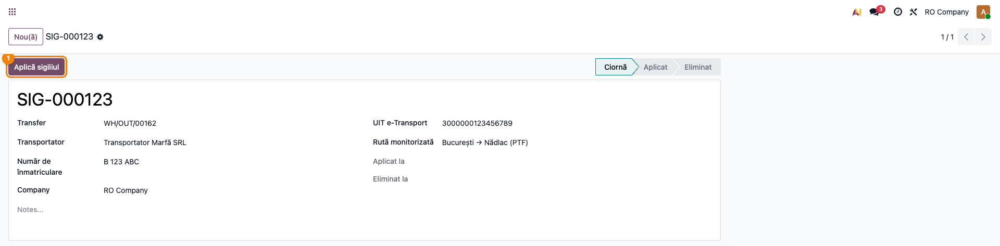
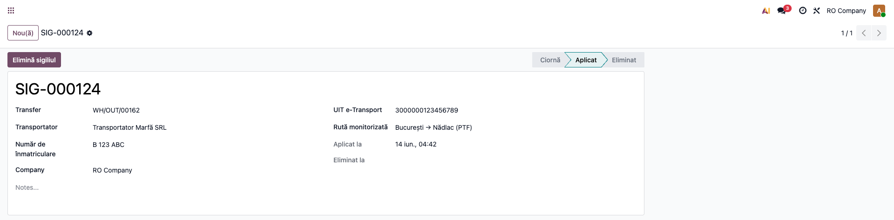
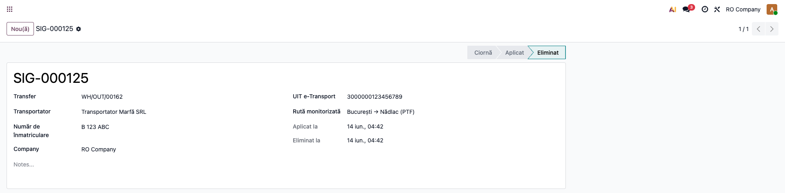
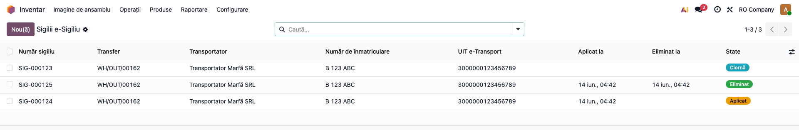

# Fișă Modul: e-Sigiliu — Sigilii Electronice ANAF

**Modul:** `l10n_ro_esigiliu`
**Utilizator principal:** Responsabil logistică/transport, Operator depozit
**Prioritate:** 🟡 Medie (transporturi monitorizate vamal)

---

## 1. Scop business

Modulul ține evidența **sigiliilor electronice e-Sigiliu** aplicate de autorități (ANAF/Vamă) pe
transporturile rutiere de bunuri monitorizate. Pentru fiecare sigiliu se înregistrează codul,
transferul de stoc asociat, transportatorul, vehiculul, ruta și UIT-ul e-Transport, cu un ciclu de
stare Ciornă → Aplicat → Eliminat. Complementar sistemului RO e-Transport.

## 2. Bază legală și context

Sistemul e-Sigiliu este parte a cadrului ANAF de monitorizare a transporturilor de bunuri (sigilii
inteligente cu GPS), complementar RO e-Transport (UIT). Referința legislativă exactă a e-Sigiliu
(ordin/proceduri ANAF) trebuie confirmată de consultant; modulul acoperă **faza 1 — evidență locală**,
integrarea cu API-ul ANAF fiind planificată pentru faza 2.

## 3. Utilizatori și roluri

Responsabil logistică/transport (înregistrează și aplică/elimină sigiliul), Operator depozit.

Roluri recomandate pentru testare:
- Utilizator Inventar: creează sigiliul, parcurge ciclul de stare.
- Manager Inventar: vizualizează raportul centralizat.

## 4. Conturi și date implicate

Modulul nu generează note contabile. Date minime pentru demo: un transfer de stoc (`stock.picking`),
un partener transportator, un număr de înmatriculare, opțional un UIT e-Transport.

## 5. Configurare inițială

1. Instalați `l10n_ro_esigiliu`.
2. Verificați accesul utilizatorului la Inventar (grupurile standard Inventar utilizator/manager).
3. Nu necesită parametri de configurare în faza 1.

## 6. Flux de utilizare

> **Capturi:** se generează cu `fisa-screenshots` (secțiunea 10); încă nu există în `readme/screenshots/`.

### Pasul 1 — Înregistrarea unui sigiliu

Din transferul de stoc, butonul statistic **e-Sigiliu** deschide sigiliile asociate; creați unul nou
cu numărul sigiliului, transportatorul, numărul de înmatriculare, ruta și UIT-ul. Numărul sigiliului
este unic per companie.



### Pasul 2 — Aplicarea sigiliului

Apăsați **Apply Seal** — starea trece în „Aplicat" și se înregistrează automat data aplicării.



### Pasul 3 — Eliminarea sigiliului

La finalul transportului monitorizat, apăsați **Remove Seal** — starea trece în „Eliminat", cu data
eliminării.



### Pasul 4 — Vizualizarea centralizată

Accesați **Inventar → Raportare → e-Sigiliu Seals**. Pe ecran verificați sigiliile pe stări (Ciornă/
Aplicat/Eliminat), transferul și transportatorul asociate; identificați sigiliile aplicate care încă
nu au fost eliminate.



### Note de monografie și raportare

Modulul **nu generează note contabile** — este pur operațional (evidență logistică/vamală). Sigiliile
sunt legate de transferul de stoc și, opțional, de UIT-ul e-Transport, pentru trasabilitatea
transportului monitorizat.

## 7. Legături cu alte module / declarații

| Modul | Rol |
|---|---|
| `stock` (nativ) | Transferul de stoc pe care se aplică sigiliul. |
| `l10n_ro` | Contextul de localizare RO. |
| RO e-Transport (`l10n_ro_edi_stock` / `l10n_ro_etransport_block`) | UIT-ul asociat transportului monitorizat. |

**Ce e automat:** ciclul de stare, marcarea datelor de aplicare/eliminare, unicitatea codului, raportul.
**Ce rămâne manual (faza 1):** înregistrarea sigiliului și acțiunile de aplicare/eliminare; sincronizarea
cu ANAF (faza 2).

## 8. Verificări pentru consultant

- [ ] Sigiliul are cod **unic per companie** (un al doilea cu același cod este respins).
- [ ] Ciclul de stare funcționează: Ciornă → Aplicat (cu dată) → Eliminat (cu dată).
- [ ] Un sigiliu non-ciornă nu poate fi aplicat din nou; unul neaplicat nu poate fi eliminat.
- [ ] Butonul statistic **e-Sigiliu** de pe transfer arată numărul corect de sigilii.
- [ ] Lista din Inventar → Raportare afișează sigiliile cu stările corecte.

## 9. Mesaje de eroare frecvente

| Mesaj | Cauză | Remediere |
|---|---|---|
| „Only draft seals can be applied." | Apply pe un sigiliu deja aplicat/eliminat | Aplicarea se face doar din starea Ciornă |
| „Only applied seals can be removed." | Remove pe un sigiliu neaplicat | Eliminarea se face doar din starea Aplicat |
| Eroare de unicitate cod | Două sigilii cu același cod în aceeași companie | Folosiți un cod unic per companie |

## 10. Capturi de ecran

Se **generează automat** din `tests/test_screenshots.py` (mixin `ScreenshotCase`), în RO, pe planul RO.
La momentul redactării **nu există încă** — rulați `fisa-screenshots`. Lista planificată:

1. `01_sigiliu_nou.png` — sigiliu nou legat de transfer.
2. `02_sigiliu_aplicat.png` — sigiliu aplicat.
3. `03_sigiliu_eliminat.png` — sigiliu eliminat.
4. `04_lista_sigilii.png` — lista centralizată.

```bash
./odoo/odoo-bin -c odoo.conf -d test19 -u l10n_ro_esigiliu \
  --test-tags=fise_screenshots --stop-after-init
```

## 11. Observații pentru manual

- Precizați că modulul este **faza 1** (evidență locală); sincronizarea cu API-ul ANAF e-Sigiliu vine
  în faza 2, pe mecanismul OAuth2 din `l10n_ro_edi`.
- Confirmați cu un consultant referința legislativă exactă a e-Sigiliu înainte de publicare.
- Legați conceptual e-Sigiliu de e-Transport (UIT) — sunt complementare pe transporturile monitorizate.
