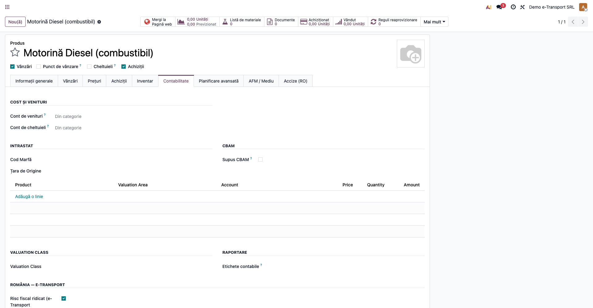
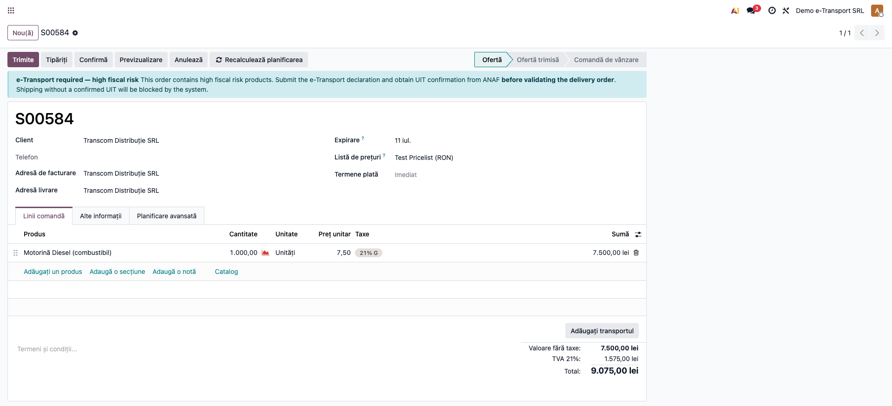
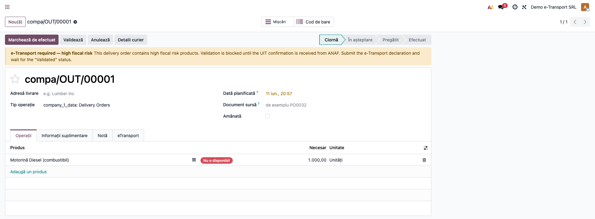
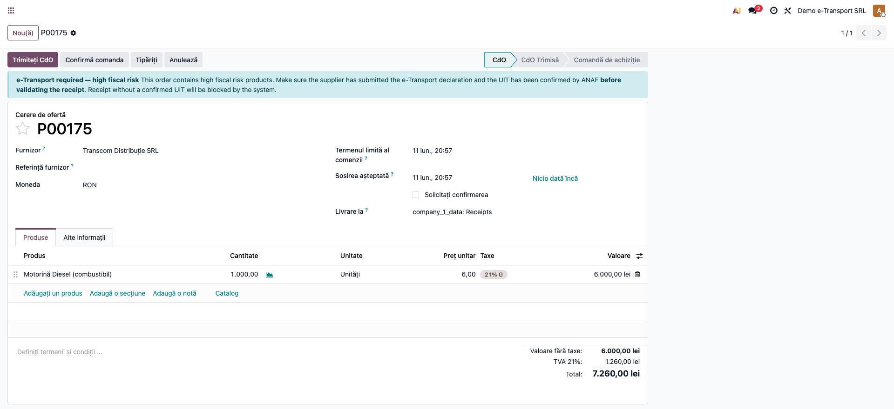

# Fișă Modul: Blocare e-Transport (aviz fără UIT)

**Modul:** `l10n_ro_etransport_block`
**FR:** FR-04
**Utilizator principal:** Operator depozit, Logistică, Contabil
**Prioritate:** 🔴 Ridicată (obligatoriu pentru bunuri cu risc fiscal ridicat)

---

## 1. Scop business

Pentru bunurile cu **risc fiscal ridicat**, transportul nu este permis fără un **cod UIT** confirmat de
ANAF prin sistemul **RO e-Transport**. Modulul extinde `l10n_ro_edi_stock` cu o **blocare „hard"**: dacă
un aviz (picking) conține cel puțin un produs marcat „risc fiscal ridicat" și declarația e-Transport
nu a primit confirmarea UIT (stare „Validat"), validarea avizului este **împiedicată**. În plus, un job
automat actualizează periodic starea UIT, eliminând nevoia de „Fetch Status" manual.

## 2. Bază legală și context

Sistemul **RO e-Transport** (instituit prin OUG 41/2022 și reglementările ANAF subsecvente) impune
declararea în prealabil a transporturilor de bunuri și obținerea unui **cod UIT** pentru categoriile cu
**risc fiscal ridicat** (combustibili, alcool, tutun, metale, produse electrocasnice/IT etc., conform
listelor ANAF). Transportul fără UIT valid este sancționabil. Modulul transformă această obligație
într-un **control preventiv** în Odoo, la validarea avizului.

## 3. Utilizatori și roluri

Operator depozit / Logistică / Contabil.

Roluri recomandate pentru testare: utilizator cu drepturi de **Inventar** (validare avize) + acces la
fișa produsului (marcarea riscului fiscal, de regulă de către contabil/responsabil fiscal).

## 4. Conturi și date implicate

Modulul **nu are impact contabil** (nu generează note). Date implicate:
- `product.template.l10n_ro_high_fiscal_risk` — marcaj „risc fiscal ridicat" pe produs;
- pe **stock.picking**: indicatorul `l10n_ro_high_risk_blocked` (blocat) + blocarea la `button_validate`;
- pe **sale.order** / **purchase.order**: indicatorul `l10n_ro_has_high_fiscal_risk` (avertisment în amonte);
- stările UIT din `l10n_ro_edi_stock` (`stock_sent` → `stock_validated`).

Date minime pentru demo:
- companie cu **țara fiscală RO** și e-Transport activ (`l10n_ro_edi_stock`);
- un produs marcat „risc fiscal ridicat";
- un aviz de expediție care conține acel produs.

## 5. Configurare inițială

1. Instalați modulul `l10n_ro_etransport_block` (dependențe: `l10n_ro_edi_stock`, `purchase`, `sale`).
2. Verificați că **e-Transport** este configurat pe companie (țara fiscală RO, credențiale ANAF în
   `l10n_ro_edi_stock`).
3. Marcați produsele relevante cu **„Risc fiscal ridicat (e-Transport obligatoriu)"** —
   **Inventar/Vânzări → Produse → fila „Contabilitate" → secțiunea „România — e-Transport"**.
4. Opțional, cron-ul **„Actualizare automată status UIT"** (la 30 min) este livrat — verificați că este
   activ dacă doriți actualizare automată a stărilor.

## 6. Flux de utilizare

### Pasul 1 — Marcarea produsului cu risc fiscal ridicat

Pe fișa produsului, fila **Contabilitate**, secțiunea „România — e-Transport", bifați **„Risc fiscal
ridicat (e-Transport obligatoriu)"**.



### Pasul 2 — Avertismentul pe comandă (în amonte)

Pe o comandă de vânzare/achiziție care conține un astfel de produs apare un **banner informativ**:
e-Transport obligatoriu, obțineți UIT înainte de validarea avizului.



### Pasul 3 — Avizul blocat la validare

Pe avizul de expediție (picking) care conține produsul cu risc fiscal ridicat și fără UIT confirmat
apare un **banner de avertizare** („Validarea este blocată până la primirea confirmării UIT"). La
apăsarea „Validează", sistemul ridică o eroare și împiedică validarea.



### Pasul 4 — Comanda de achiziție

Același avertisment apare și pe comenzile de achiziție care conțin produse cu risc fiscal ridicat,
pentru a anticipa obligația e-Transport la recepție/transport.



### Note de monografie și raportare

- Modulul **nu produce note contabile** — este un control operațional preventiv.
- Blocarea se aplică doar avizelor cu e-Transport activ (`l10n_ro_edi_stock_enable`) care **nu** au
  starea UIT „Validat" (`stock_validated`) și conțin produse cu risc fiscal ridicat.
- După confirmarea UIT (manual prin „Fetch Status" sau automat prin cron), avizul se poate valida normal.
- Contextul `demo_mode` dezactivează blocarea (util la importuri/teste).

## 7. Legături cu alte module / declarații

| Modul / proces | Rol în flux | Tip legătură |
|---|---|---|
| `l10n_ro_edi_stock` | infrastructura RO e-Transport (UIT, stări, „Fetch Status") | dependență (manifest) |
| `sale` / `purchase` | avertismentul în amonte pe comenzi | dependență (manifest) |
| `stock` | avizul de expediție și validarea blocată | (prin `l10n_ro_edi_stock`) |

Ce este automat: detectarea produselor cu risc fiscal ridicat pe aviz/comandă, blocarea validării și
actualizarea periodică a stării UIT (cron).
Ce rămâne manual: marcarea produselor cu risc fiscal ridicat, trimiterea declarației e-Transport și
obținerea UIT.

## 8. Verificări pentru consultant

- [ ] Modulul se instalează fără erori (necesită `l10n_ro_edi_stock` + companie RO).
- [ ] Câmpul „Risc fiscal ridicat" apare pe fișa produsului (fila Contabilitate) și implicit este Off.
- [ ] Comanda de vânzare/achiziție cu produs marcat afișează bannerul informativ.
- [ ] Avizul cu produs marcat și fără UIT validat afișează bannerul de blocare.
- [ ] Validarea avizului blocat ridică o eroare clară (cu numele produselor).
- [ ] Avizul cu UIT „Validat" se validează fără blocaj.
- [ ] Avizul cu produse normale (fără risc) se validează normal.

## 9. Mesaje de eroare frecvente

| Mesaj / simptom | Cauză probabilă | Remediere |
|-----------------|-----------------|-----------|
| „Avizul … nu poate fi validat. Produsele cu risc fiscal ridicat (…) necesită un UIT confirmat…" | Aviz cu produs risc ridicat, fără UIT validat | Trimiteți declarația e-Transport, așteptați confirmarea UIT, apoi validați |
| Bannerul de blocare nu dispare după confirmarea UIT | Starea UIT nu s-a actualizat | Apăsați „Fetch Status" sau așteptați cron-ul; verificați starea `stock_validated` |
| Avizul nu se blochează deși are produs cu risc | e-Transport nu este activ pe aviz (companie non-RO / tip aviz neeligibil) | Verificați configurarea e-Transport și țara fiscală a companiei |
| Câmpul „Risc fiscal ridicat" nu apare pe produs | Modulul nu este instalat sau fila Contabilitate ascunsă | Verificați instalarea și drepturile de acces la fila Contabilitate |

## 10. Capturi de ecran

Capturile (`readme/screenshots/`) sunt **generate automat** din `tests/test_screenshots.py`
(mixinul `ScreenshotCase` din `l10n_ro_doc_screenshots`, import defensiv), în **limba română**,
pe planul de conturi RO (`setup_country("ro")`):

1. `01_produs_risc.png` — produs marcat cu risc fiscal ridicat (fila Contabilitate).
2. `02_comanda_vanzare.png` — comandă de vânzare cu avertismentul e-Transport.
3. `03_aviz_blocat.png` — aviz de expediție blocat (banner de avertizare).
4. `04_comanda_achizitie.png` — comandă de achiziție cu avertismentul e-Transport.

Regenerare:

```bash
./odoo/odoo-bin -c odoo.conf -d <db> -i l10n_ro_etransport_block,l10n_ro_doc_screenshots \
    --test-tags=fise_screenshots --stop-after-init
```

## 11. Observații pentru manual

În manualul final, păstrați explicația orientată pe activitatea utilizatorului: ce sunt bunurile cu risc
fiscal ridicat, de ce e nevoie de UIT înainte de transport (RO e-Transport, OUG 41/2022) și cum
funcționează blocarea preventivă la validarea avizului. Subliniați secvența corectă: marcarea
produsului → avertisment pe comandă → declarație e-Transport → UIT confirmat → validare aviz. Menționați
că actualizarea stării UIT poate fi automatizată (cron) și că blocarea protejează împotriva expedierii
neconforme.
