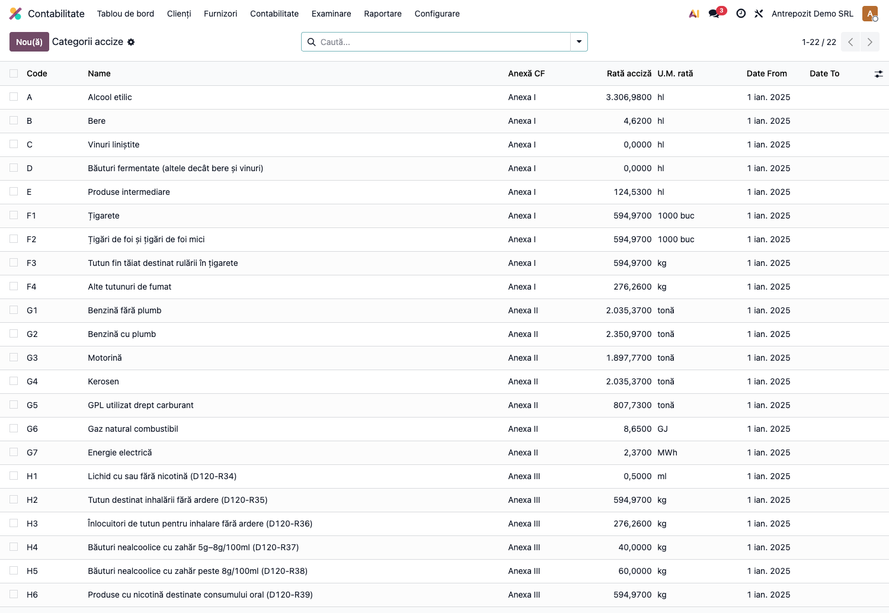
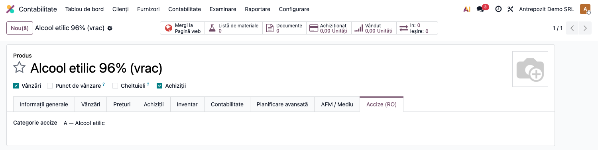
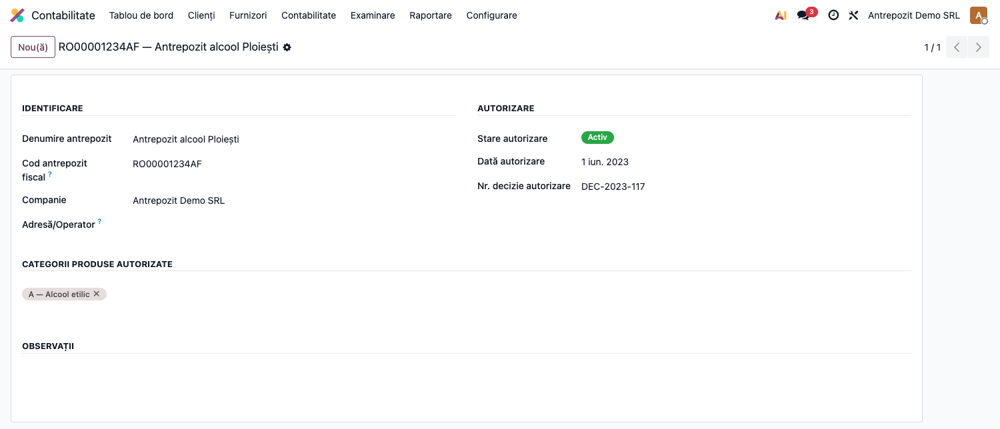
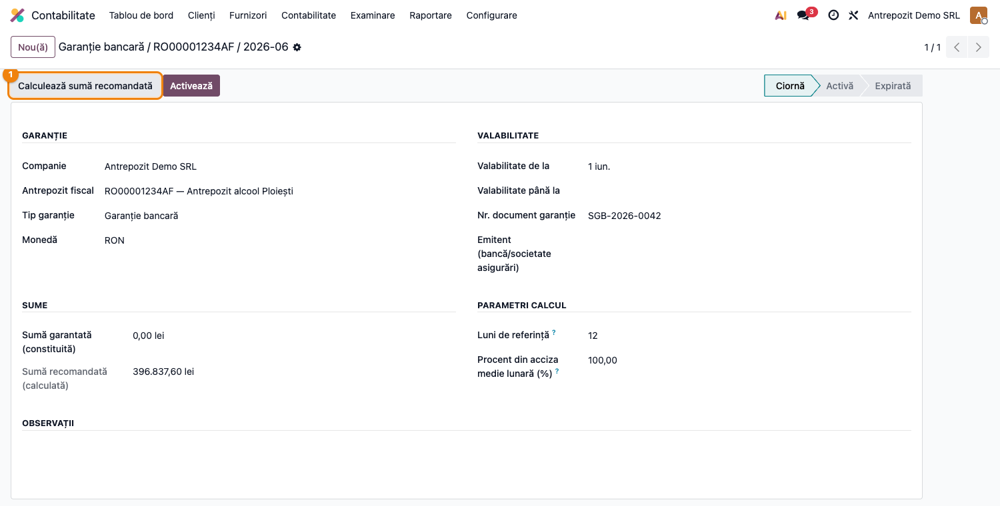
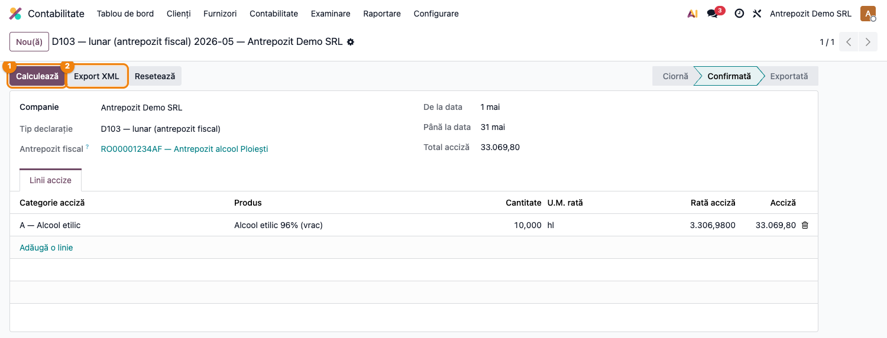
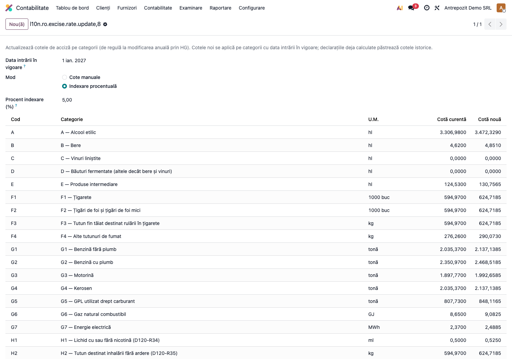

# Fișă Modul: Accize — categorii, antrepozite, garanții și declarațiile D103/D120

**Modul:** `l10n_ro_excise`
**FR:** FR-42
**Utilizator principal:** Contabil fiscalitate / responsabil accize la antrepozitarul autorizat
**Prioritate:** 🔴 Ridicată (obligație lunară D103 pentru antrepozitari; risc fiscal direct)

---

## 1. Scop business

Modulul gestionează **accizele** pentru antrepozitarii autorizați și importatorii de produse
accizabile, pe întreg ciclul: nomenclator de categorii cu cote (armonizate și nearmonizate),
marcarea produselor, **calculul automat al declarațiilor din facturile postate** (inclusiv
stornări cu semn negativ), declarațiile persistente **D103** (lunară, antrepozit fiscal) și
**D120** (decont anual), evidența **antrepozitelor fiscale** (cod ANAF, autorizație, stare)
și a **garanțiilor financiare** (cu sumă recomandată calculată din istoricul declarațiilor),
plus actualizarea anuală a cotelor prin hotărâre de guvern.

Exportul XML al fiecărei declarații e contribuit de modulul ANAF dedicat
(`l10n_ro_anaf_d103`, `l10n_ro_anaf_d120`) — `l10n_ro_excise` e infrastructura comună.

## 2. Bază legală și context

- **Titlul VIII Cod Fiscal** (Legea 227/2015) — regimul accizelor; categoriile armonizate
  din **Anexele I și II** (alcool, bere, vinuri, tutun, produse energetice, energie electrică);
- accizele **nearmonizate** (Titlul VIII Cap. II Cod Fiscal, extins prin **Legea 296/2023**):
  categoriile H1–H6 (băuturi cu zahăr adăugat, produse cu nicotină etc.);
- **HG 2/2025** — nivelul cotelor pentru 2025 (nomenclatorul livrat cu modulul); actualizările
  anuale se aplică prin wizardul de cote;
- declarația **D103** „Declarație privind accizele" — lunară, până pe 25 ale lunii următoare;
  **D120** „Decont privind accizele" — anual.

## 3. Utilizatori și roluri

Contabilul de fiscalitate calculează și depune declarațiile; gestionarul antrepozitului
întreține autorizațiile și garanțiile.

Roluri recomandate pentru testare:
- Administrator funcțional: instalează modulul, verifică nomenclatorul de categorii;
- Utilizator operațional (grup „Contabil"): marchează produsele, calculează declarațiile;
- Contabil/manager: confirmă totalurile față de balanță (446 analitice accize) și exportă XML.

## 4. Conturi și date implicate

Conturi RO uzuale pentru accize (planul OMFP 1802/2014):
- **446 „Alte impozite, taxe și vărsăminte asimilate"** (analitic accize) — acciza datorată
  (funcțiunea contului 446 din OMFP 1802/2014 include explicit accizele; contul 447 rămâne
  pentru fondurile speciale — ex. fondul de mediu/AFM — nu pentru accize);
- **635 „Cheltuieli cu alte impozite, taxe…"** — acciza pe cheltuială (când nu se include în
  costul de achiziție);
- **5121** — plata accizei.

> **Important:** modulul **nu postează note contabile** — el agregă cantitățile din facturile
> postate și calculează acciza pentru declarații. Înregistrarea contabilă a accizei datorate
> (**Dr 635 = Cr 446.accize**, respectiv plata **Dr 446.accize = Cr 5121**) rămâne în sarcina
> contabilului, conform politicii contabile a societății.

Date minime pentru demo: companie RO cu plan de conturi RO, produs marcat cu categorie de
acciză, facturi de vânzare postate în perioada declarată, opțional un antrepozit fiscal.

## 5. Configurare inițială

1. Instalați modulul `l10n_ro_excise` — nomenclatorul de categorii (16 armonizate A–G7 +
   6 nearmonizate H1–H6, cu cotele HG 2/2025) se încarcă automat.
2. Verificați nomenclatorul în **Contabilitate → Raportare → Accize → Categorii produse
   accizabile** (cod, cotă, U.M., valabilitate de la).
3. Marcați produsele accizabile: pe fișa produsului, fila **Accize (RO)**, alegeți categoria.
4. Dacă sunteți antrepozitar: creați antrepozitul în **Accize → Antrepozite fiscale**
   (cod ANAF, numărul autorizației, starea) și garanția în **Accize → Garanții financiare**.
5. La schimbarea anuală a cotelor (HG), rulați wizardul **Actualizare cote (HG)** — mod
   manual sau indexare procentuală; declarațiile deja calculate păstrează cotele istorice.

## 6. Flux de utilizare

### Pasul 1 — Nomenclatorul de categorii și cote

Accesați **Contabilitate → Raportare → Accize → Categorii produse accizabile**. **Găsiți pe
ecran**: fiecare rând e o categorie (cod A–G7 / H1–H6), cu cota, unitatea de măsură a cotei
(ex. „hl alcool pur", „1000 buc" la țigarete) și data intrării în vigoare. **Verificați**: cotele
corespund HG-ului în vigoare pentru anul curent; categoriile folosite de produsele voastre
sunt active.



### Pasul 2 — Marcarea produsului accizabil

Deschideți produsul și fila **Accize (RO)**; alegeți **categoria de acciză**. Din acest
moment, vânzările postate ale produsului intră în calculul declarațiilor.



### Pasul 3 — Antrepozitul fiscal și garanția

În **Accize → Antrepozite fiscale** țineți evidența autorizației (cod ANAF, valabilitate,
stare activ/suspendat/revocat). În **Accize → Garanții financiare** înregistrați garanția
(bancară / depozit / asigurare); butonul **Calculează suma recomandată** propune nivelul
garanției din media declarațiilor anterioare.





### Pasul 4 — Declarația D103: calcul, verificare, export

Creați declarația în **Accize → Declarații accize**: tip **D103 — lunar (antrepozit
fiscal)**, perioada (luna), antrepozitul. Apăsați **Calculează**: modulul agregă liniile
facturilor de vânzare **postate** din perioadă, pe produs × categorie, cu stornările scăzute
(semn negativ), și calculează acciza = cantitate × cota categoriei. Starea trece în
**Confirmată**.

**Găsiți pe ecran**: liniile declarației — produs, categorie, cantitate, cotă, U.M. cotă și
acciza pe linie; totalul declarației jos. **Verificați** înainte de export: cantitățile
corespund jurnalului de vânzări al lunii (inclusiv stornările); cota pe linie e cea istorică
a perioadei (nu cea curentă, dacă între timp s-a schimbat); totalul accizei se reconciliază
cu rulajul analiticului 446 de accize.



Abia după verificare apăsați **Export XML** — fișierul `D103_<CUI>_<AnLună>.xml` se
generează prin modulul `l10n_ro_anaf_d103` și starea trece în **Exportată**. Structura
fișierului (extras):

```xml
<?xml version="1.0" encoding="UTF-8"?>
<declaratie>
  <tip>D103</tip>
  <antet>
    <cif>20603502</cif>
    <denumire>Antrepozit Demo SRL</denumire>
    <luna>5</luna>
    <an>2026</an>
  </antet>
  <produse>
    <produs>
      <categorie>A</categorie>
      <denumire>Alcool etilic</denumire>
      <cantitate>10.000</cantitate>
      <um>hl</um>
      <acciza>33069.80</acciza>
    </produs>
  </produse>
  <totalAcciza>33069.80</totalAcciza>
</declaratie>
```

> Declarația **D120** (decont anual) urmează același flux, cu tip „D120 — decont anual
> accize" și perioada întregul an; exportul XML cere modulul `l10n_ro_anaf_d120`.

### Pasul 5 — Actualizarea anuală a cotelor (HG)

La publicarea HG-ului cu noile cote, rulați wizardul **Actualizare cote (HG)** (din lista de
categorii): alegeți data intrării în vigoare și fie introduceți cotele manual, fie aplicați
o **indexare procentuală** pe toate categoriile. Categoriile primesc cote noi de la data
efectivă; declarațiile deja calculate rămân pe cotele istorice.



### Note de monografie și raportare

Modulul calculează **declarațiile**, nu notele contabile. Monografia uzuală a accizelor
(de înregistrat manual sau prin nota contabilă proprie a societății):

- acciza datorată la eliberarea în consum / facturare: **Dr 635 = Cr 446.accize**;
- plata accizei: **Dr 446.accize = Cr 5121**;
- acciza facturată clientului intră în baza de impozitare a **TVA** (factura include acciza
  în preț — Dr 4111 = Cr 70x + Cr 4427, cu acciza cuprinsă în 70x).

Declarațiile D103/D120 se depun la ANAF prin SPV; depunerea poate fi urmărită cu
`l10n_ro_anaf_submission`.

## 7. Legături cu alte module / declarații

| Modul / proces | Rol în flux | Tip legătură |
|---|---|---|
| `account` + `l10n_ro` | facturile postate din care se agregă cantitățile; planul de conturi RO | dependență |
| `l10n_ro_anaf_d103` | exportul XML al declarației lunare D103 | hook `_export_d103_xml` |
| `l10n_ro_anaf_d120` | exportul XML al decontului anual D120 | hook `_export_d120_xml` |
| `l10n_ro_anaf_submission` | urmărirea depunerii și recipisa | opțional, complementar |
| `account_intrastat` (Enterprise) | codul NC8 al produsului (nomenclatura combinată) | opțional |

Ce este automat: agregarea din facturi (cu stornări), calculul accizei pe cote istorice,
generarea XML, propunerea sumei garanției.
Ce rămâne manual: notele contabile ale accizei (635/446), depunerea la ANAF, întreținerea
autorizațiilor și actualizarea cotelor la HG nou.

## 8. Verificări pentru consultant

- [ ] Modulul se instalează fără erori; nomenclatorul are 22 de categorii (unele cu cotă 0 —
      ex. vinurile liniștite, conform CF).
- [ ] Meniul **Contabilitate → Raportare → Accize** apare, cu cele 4 submeniuri.
- [ ] Fila **Accize (RO)** apare pe fișa produsului pentru grupul Contabil.
- [ ] **Calculează** pe o declarație D103 agregă doar facturi postate din perioadă; o stornare
      scade cantitatea.
- [ ] Cota liniei e cea valabilă în perioada declarației, nu cea curentă.
- [ ] **Export XML** produce `D103_<CUI>_<AnLună>.xml` valid și trece starea în Exportată;
      fără modulul `l10n_ro_anaf_d103`, mesajul de eroare e clar.
- [ ] Declarația exportată nu mai poate fi recalculată (eroare clară la Calculează).
- [ ] Două antrepozite cu același cod ANAF sunt respinse (unicitate).
- [ ] **Calculează suma recomandată** pe garanție folosește media declarațiilor anterioare.
- [ ] Wizardul de cote aplică indexarea procentuală și păstrează cotele istorice pe
      declarațiile deja calculate.

## 9. Mesaje de eroare frecvente

| Mesaj / simptom | Cauză probabilă | Remediere |
|-----------------|-----------------|-----------|
| „Exportul XML pentru tipul de declarație «d103» necesită modulul ANAF corespunzător…" | `l10n_ro_anaf_d103` / `d120` neinstalat | Instalați modulul de export aferent tipului |
| „Declarația exportată nu poate fi recalculată." | Calculează apăsat pe o declarație Exportată | Resetați la ciornă (dacă e cazul) sau creați o declarație nouă |
| Declarația iese goală la Calculează | Facturile nu sunt postate, produsele nu au categorie de acciză sau perioada e greșită | Verificați starea facturilor, fila Accize (RO) pe produse și intervalul de date |
| Cantități negative pe linie | Stornări mai mari decât vânzările perioadei | Corect — verificați totuși facturile de storno din perioadă |
| Acciza pe linie diferă de așteptare | Cota istorică a perioadei diferă de cota curentă (HG nou între timp) | Verificați valabilitatea cotelor în nomenclator (data de la / până la) |

## 10. Capturi de ecran

Capturile (`readme/screenshots/`) sunt **generate automat** din `tests/test_screenshots.py`
(mixinul `ScreenshotCase` din `l10n_ro_doc_screenshots`, import defensiv), în **limba
română**, pe planul de conturi RO; seedul postează o factură cu produs accizabil și
calculează declarația D103 — fără conexiuni externe:

1. `01_categorii.png` — nomenclatorul categoriilor (coduri, cote, U.M., valabilitate).
2. `02_produs.png` — fila Accize (RO) pe fișa produsului.
3. `03_antrepozit.png` — antrepozitul fiscal cu autorizația și starea.
4. `04_garantie.png` — garanția financiară cu suma recomandată.
5. `05_declaratie_d103.png` — declarația D103 calculată (linii + total + butoane).
6. `06_wizard_cote.png` — wizardul de actualizare cote cu indexare procentuală.

Extrasul XML din Pasul 4 e text inline (nu fișier în `screenshots/`).

Regenerare:

```bash
./odoo/odoo-bin -c odoo.conf -d <db> -i l10n_ro_excise,l10n_ro_anaf_d103,l10n_ro_doc_screenshots \
    --test-tags=fise_screenshots --stop-after-init
```

## 11. Observații pentru manual

Țineți separate cele trei planuri: (1) **nomenclatorul** (categorii + cote, întreținut prin
HG), (2) **operaționalul** (produse marcate, facturi postate) și (3) **declarativul**
(D103/D120 calculate din operațional, pe cote istorice). Punctul de control al consultantului
este reconcilierea totalului declarat cu analiticul 446 de accize — subliniați în manual că
modulul nu postează nota 635=446, ci doar fundamentează declarația.
