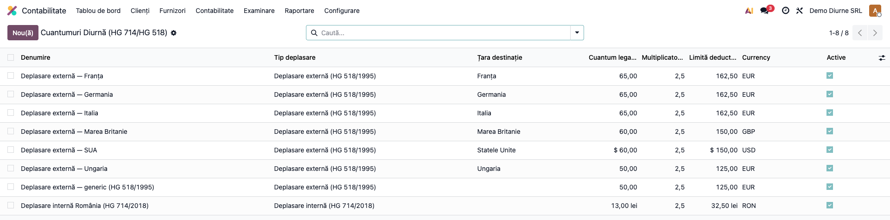
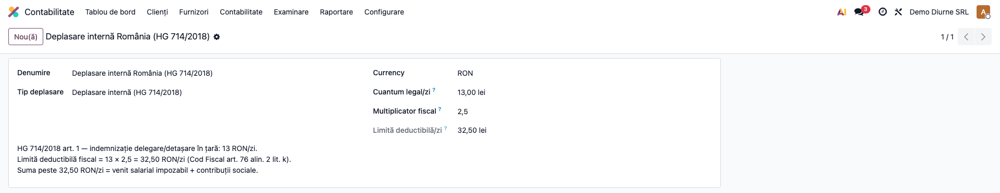
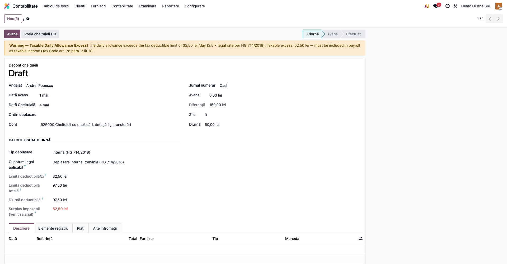

# Fișă Modul: Diurne și Deplasări — Limită Fiscală 2,5×

**Modul:** `l10n_ro_expense_allowance`
**FR:** FR-52
**Utilizator principal:** Contabil, Responsabil HR/salarizare
**Prioritate:** 🟡 Medie (la fiecare decont de deplasare cu diurnă)

---

## 1. Scop business

La deconturile de deplasare, **diurna** este deductibilă fiscal doar până la **2,5 × cuantumul legal**;
suma care depășește această limită este **venit salarial impozabil** (impozit + contribuții). Modulul
extinde decontul de cheltuieli (`deltatech_expenses`) cu calculul automat al **limitei deductibile**, al
**diurnei deductibile** și al **surplusului impozabil**, plus un **banner de avertizare** când diurna
depășește plafonul. Cuantumurile legale (intern/extern, per țară) sunt ținute într-un tabel configurabil.

## 2. Bază legală și context

- **HG 714/2018** — cuantumul indemnizației de delegare/detașare **în țară** (un nivel stabilit pentru
  instituțiile publice, actualizat periodic prin HG). Valoarea din datele demo (13 RON/zi) este un
  **exemplu parametrizabil** — **actualizați-o** la nivelul HG în vigoare la data deplasării.
- **HG 518/1995** (actualizată, ex. OMAI 976/2023) — cuantumul diurnei pentru **deplasări externe**, per țară.
- **Codul fiscal, art. 76 alin. (2) lit. k)** — diurna este neimpozabilă în limita a **2,5 × nivelul
  legal** stabilit pentru instituțiile publice; ce depășește este **venit din salarii** (impozit pe venit
  + contribuții sociale).

> **Atenție — al doilea plafon legal.** Art. 76 alin. (2) lit. k) prevede **două** plafoane care se
> aplică simultan: (a) **2,5 × nivelul legal** și (b) **3 salarii de bază** corespunzătoare locului de
> muncă, raportat la zilele lucrătoare din lună. **Acest modul verifică doar plafonul (a) — 2,5×**;
> plafonul de 3 salarii rămâne o **verificare manuală** la salarizare.

## 3. Utilizatori și roluri

Contabil / Responsabil HR-salarizare.

Rol recomandat pentru testare: utilizator cu drepturi de contabilitate (deconturi) și acces la datele
de angajat; cuantumurile legale se administrează din **Contabilitate → Furnizori**.

## 4. Conturi și date implicate

- Tabelul **`l10n.ro.allowance.rate`** — cuantum legal/zi, multiplicator (implicit 2,5), tip deplasare
  (intern/extern), țară, monedă; preîncărcat cu HG 714/2018 (intern) + HG 518/1995 (DE, FR, IT, HU, GB, US).
- Pe decontul de deplasare (`deltatech.expenses.deduction`): **tip deplasare**, **țara destinație**,
  **cuantum aplicabil**, **limită deductibilă/zi** și **totală**, **diurnă deductibilă**, **surplus
  impozabil**.
- Diurna deductibilă se înregistrează pe **625** „Cheltuieli cu deplasări"; surplusul impozabil intră în
  **statul de salarii** (nu este o notă a acestui modul).

Date minime pentru demo: un angajat, un decont cu număr de zile și diurnă/zi peste plafon.

## 5. Configurare inițială

1. Instalați modulul `l10n_ro_expense_allowance` (dependențe: `deltatech_expenses`, `l10n_ro`).
2. Verificați/ajustați cuantumurile legale în **Contabilitate → Furnizori → Cuantumuri Diurnă
   (HG 714/HG 518)** — actualizați-le la valorile în vigoare (intern și per țară).
3. Multiplicatorul fiscal este implicit **2,5** (Cod fiscal art. 76) — modificați-l doar dacă legislația
   se schimbă.

## 6. Flux de utilizare

### Pasul 1 — Cuantumurile legale

**Contabilitate → Furnizori → Cuantumuri Diurnă**. Tabelul afișează cuantumul legal/zi, multiplicatorul și
**limita deductibilă/zi** (cuantum × 2,5) pentru deplasări interne și externe (per țară).



### Pasul 2 — Cuantumul intern (HG 714/2018)

Pe un cuantum, vedeți baza (13 RON/zi), multiplicatorul (2,5) și limita rezultată (32,50 RON/zi).



### Pasul 3 — Decontul de deplasare cu surplus impozabil

Pe decontul de deplasare, alegeți **tipul deplasării** (și **țara** pentru extern) — cuantumul se preia
automat. Modulul calculează **limita deductibilă**, **diurna deductibilă** și **surplusul impozabil**.
Dacă diurna depășește plafonul, apare un **banner de avertizare** cu suma de inclus în statul de salarii.



### Note de monografie și raportare

- Modulul **calculează** repartizarea fiscală, dar **nu generează note contabile** suplimentare —
  înregistrarea diurnei rămâne în fluxul decontului (`deltatech_expenses`).
- **Diurna deductibilă** = min(diurnă totală, 2,5 × cuantum × zile) → pe contul de cheltuieli (625);
- **Surplusul impozabil** = diurnă − limită → tratat ca **venit salarial** în statul de salarii
  (impozit pe venit + CAS/CASS), conform art. 76 alin. (2) lit. k).
- Pentru deplasări externe, cuantumul și moneda sunt cele din HG 518/1995 pentru țara destinație.

## 7. Legături cu alte module / declarații

| Modul / proces | Rol în flux | Tip legătură |
|---|---|---|
| `deltatech_expenses` | decontul de deplasare extins (zile, diurnă, conturi) | dependență (manifest) |
| `l10n_ro` | localizare contabilă RO | dependență (manifest) |
| Statul de salarii (HR/Payroll) | surplusul impozabil se include ca venit salarial | corelare manuală |

Ce este automat: preluarea cuantumului legal (intern/extern, per țară), calculul limitei deductibile,
al diurnei deductibile și al surplusului impozabil, plus bannerul de avertizare.
Ce rămâne manual: actualizarea cuantumurilor legale, alegerea tipului/țării deplasării și includerea
surplusului impozabil în statul de salarii.

## 8. Verificări pentru consultant

- [ ] Modulul se instalează fără erori (necesită `deltatech_expenses`).
- [ ] Cuantumurile legale (intern 13 RON, externe per țară) apar în „Cuantumuri Diurnă".
- [ ] Limita deductibilă/zi = cuantum × 2,5 (ex. 13 × 2,5 = 32,50 RON).
- [ ] Pe decont, alegerea tipului/țării preia automat cuantumul aplicabil.
- [ ] Diurnă sub limită → surplus 0, fără banner.
- [ ] Diurnă peste limită → surplus impozabil corect + banner de avertizare.
- [ ] Multiplicatorul configurabil modifică limita (ex. 3× → 39 RON/zi).

## 9. Mesaje de eroare frecvente

| Mesaj / simptom | Cauză probabilă | Remediere |
|-----------------|-----------------|-----------|
| Surplus impozabil = 0 deși diurna pare mare | Niciun cuantum legal selectat pe decont | Alegeți tipul deplasării (se preia cuantumul) sau setați manual cuantumul |
| Cuantumul extern nu se preia | Țara destinație fără cuantum configurat | Adăugați cuantumul țării în „Cuantumuri Diurnă" sau folosiți cuantumul generic extern |
| Banner de avertizare neașteptat | Diurna/zi depășește 2,5 × cuantumul legal | Normal — includeți surplusul în statul de salarii |
| Limita pare incorectă | Multiplicator sau cuantum greșit pe rată | Verificați cuantumul legal/zi și multiplicatorul (implicit 2,5) |
| Diurnă declarată „fără surplus" dar peste 3 salarii | Modulul verifică doar plafonul 2,5×, nu și cel de 3 salarii | Verificați manual al doilea plafon (3 salarii de bază/lună) la salarizare |

## 10. Capturi de ecran

Capturile (`readme/screenshots/`) sunt **generate automat** din `tests/test_screenshots.py`
(mixinul `ScreenshotCase` din `l10n_ro_doc_screenshots`, import defensiv), în **limba română**,
pe planul de conturi RO (`setup_country("ro")`):

1. `01_cuantumuri_diurna.png` — cuantumurile legale de diurnă (intern + extern).
2. `02_cuantum_intern.png` — cuantumul intern (13 × 2,5 = 32,50 RON/zi).
3. `03_decont_surplus.png` — decont de deplasare cu surplus impozabil (banner).

Regenerare:

```bash
./odoo/odoo-bin -c odoo.conf -d <db> -i l10n_ro_expense_allowance,l10n_ro_doc_screenshots \
    --test-tags=fise_screenshots --stop-after-init
```

## 11. Observații pentru manual

În manualul final, păstrați explicația orientată pe activitatea utilizatorului: ce este plafonul de
**2,5 × cuantumul legal** al diurnei (intern HG 714/2018, extern HG 518/1995), cum se citește surplusul
impozabil și de ce trebuie inclus în statul de salarii (art. 76 alin. 2 lit. k). Subliniați că modulul
doar **semnalează și calculează** plafonul — operarea în salarii a surplusului rămâne pas separat.
Reamintiți cititorului două lucruri: (1) cuantumurile legale trebuie **ținute la zi** (nivelul HG se
actualizează periodic; valorile din demo sunt exemple), și (2) art. 76 lit. k) are **două** plafoane
(2,5× și 3 salarii/lună), iar modulul îl verifică doar pe primul.
