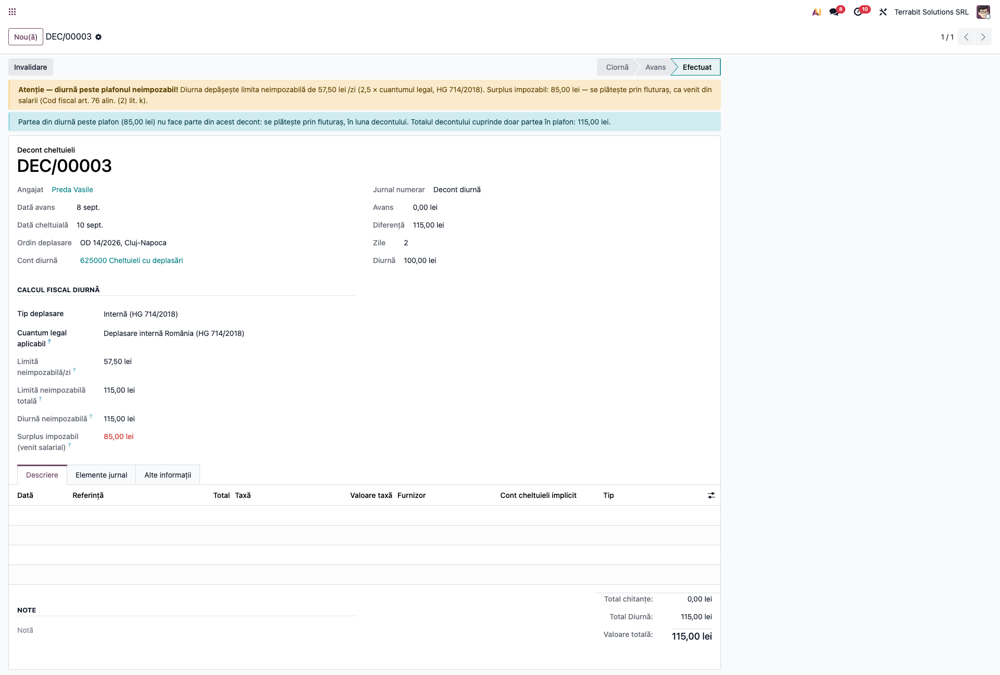
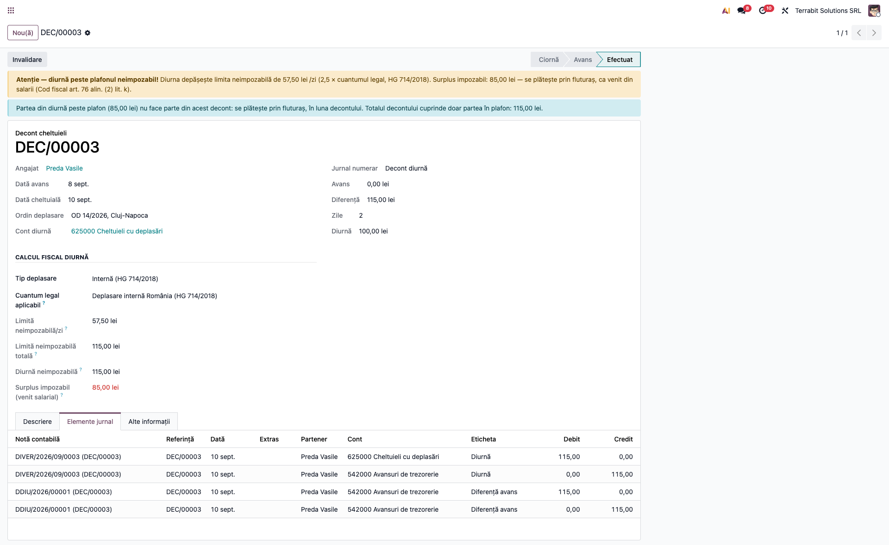
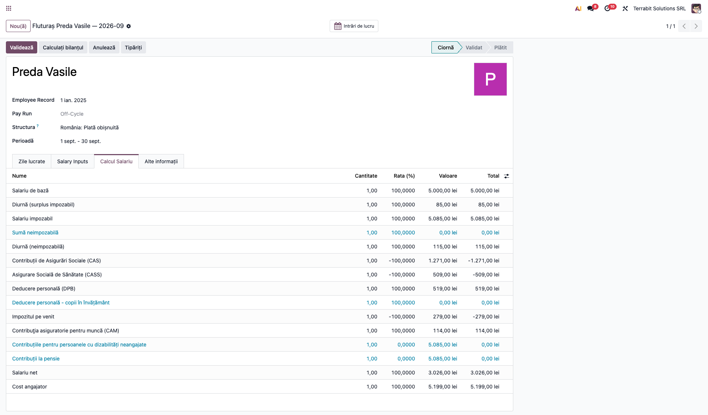
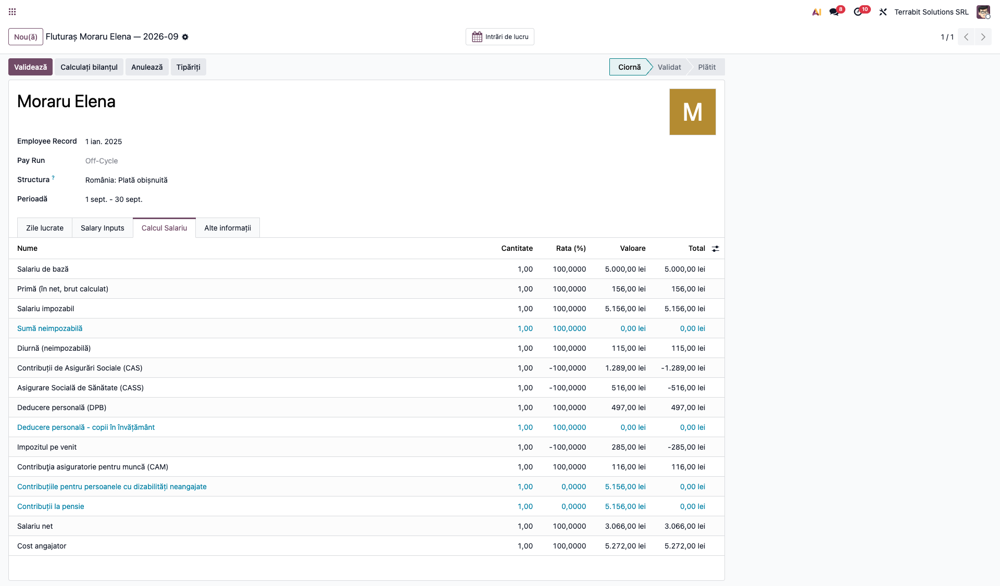

# Fișă Modul: Diurna în fluturaș

**Modul:** `l10n_ro_expense_allowance_payroll`
**Utilizator principal:** contabil / responsabil salarizare
**Prioritate:** 🟡 Medie (diurna peste plafon se declară greșit dacă rămâne doar în decont)

## 1. Scop business

Diurna acordată peste plafonul legal este venit din salarii, cu impozit și contribuții, dar decontul de deplasare o înregistrează ca pe o cheltuială și o plătește integral. Modulul scoate partea de peste plafon din decont, o duce în fluturașul lunii și declară în D112 partea neimpozabilă.

## 2. Bază legală și context

Codul fiscal, art. 76 alin. (2) lit. k): diurna este neimpozabilă în limita a **2,5 × nivelul legal** (HG 714/2018, 23 lei/zi la deplasările interne, deci 57,50 lei/zi) și a **3 salarii de bază pe lună** (`3 × salariu / zile lucrătoare din lună × zile de deplasare`); suma de peste plafon e venit asimilat salariilor. Partea din plafon nu se impozitează (art. 76 alin. (4) lit. h)). CAS: art. 139 alin. (1) lit. j); CASS: art. 157 alin. (1) lit. m); CAM: art. 220^4 alin. (1) lit. h). Cheltuiala cu diurna (ambele părți) este deductibilă integral la impozitul pe profit (art. 25). **Nivelul de 23 lei/zi și regula de numărare a zilelor sunt de verificat pe legislatie.just.ro.**

## 3. Utilizatori și roluri

- **Aprobator decont** (grupul *Aprobator deconturi*) apasă **Avans**, iar **Contabil decont** (grupul *Contabil deconturi*) apasă **Validează**;
- responsabilul de salarizare (*Administrator salarizare*) calculează fluturașii.

## 4. Conturi și date implicate

- **625** cheltuieli cu deplasările, **542** avansuri de trezorerie (contul de decont al angajatului);
- **641 = 421** surplusul impozabil, în brutul fluturașului; reținerile **43151 / 43161 / 4441** (analiticele CAS, CASS, impozit) și CAM **6461 = 4361**, mapate de `l10n_ro_hr_payroll_account_enhancement`;
- angajat cu versiune de contract cu salariul completat; cuantumul legal intern în *Contabilitate → Furnizori → Cuantumuri Diurnă (HG 714/HG 518)*.

## 5. Configurare inițială

1. Modulul se instalează singur împreună cu `l10n_ro_expense_allowance`, `l10n_ro_hr_payroll_enhancement` și `l10n_ro_anaf_d112_payroll`; pentru notele fluturașului trebuie instalat și `l10n_ro_hr_payroll_account_enhancement`.
2. Verificați cuantumul legal intern (23 lei/zi) în *Cuantumuri Diurnă*.
3. Dacă firma acordă surplusul ca sumă netă, bifați *Diurnă impozabilă ca sumă netă* în Setări Contabilitate, secțiunea Declarații ANAF.
4. Pentru sărbătorile legale la calculul plafonului de 3 salarii, introduceți-le în calendarul de lucru al companiei (sau generați-le cu *Generează sărbătorile legale* din `l10n_ro_hr_pontaj`, dacă e instalat).

## 6. Flux de utilizare

### Pasul 1 — Decontul de deplasare

**Contabilitate → Furnizori → Decont Cheltuieli**. Întocmiți decontul: angajatul, ordinul de deplasare, diurna pe zi (100 lei) și numărul de zile (2). Formularul compară diurna cu plafonul (2 × 57,50 = 115 lei) și avertizează. Apăsați **Avans** (aprobator), apoi **Validează** (contabil). Decontul cuprinde **doar partea din plafon**: «Total diurnă», totalul și diferența de plată către angajat sunt de **115 lei**; cei **85 de lei** de peste plafon **nu fac parte din decont** și se plătesc prin stat. Un mesaj pe decont arată cele două părți.

**Verificați:** partea neimpozabilă este cel mult plafonul (2,5 × 23 lei × zile și 3 salarii pe lună); suma părților este diurna totală (115 + 85 = 200); «Diferență» = 115, nu 200.

### Pasul 2 — Notele contabile ale decontului

În fila *Elemente jurnal* a decontului: **Dr 625 = Cr 542** pentru diurna din plafon (115 lei) și nota *Diferență avans* pentru plata în numerar a aceleiași sume. Partea de peste plafon nu apare nicăieri în decont: nu se înregistrează pe 625 și nu se plătește de două ori.

**Verificați:** pe 625 apare doar debitul de 115 lei; plata către angajat e de 115 lei.

### Pasul 3 — Fluturașul lunii, cu diurna impozabilă în brut

Calculați fluturașul angajatului pentru luna decontului (data decontului, septembrie 2026). Apar două linii noi: **Diurnă (surplus impozabil)** (85 lei), care intră în brutul lunii, deci în CAS, CASS, CAM și impozit (deducerea personală se recalculează; contabil **641 = 421**), și **Diurnă (neimpozabilă)** (115 lei), informativă: nu intră în brut, nici în net, pentru că se plătește prin decont.

**Verificați** (salariu 5.000, septembrie 2026, salariul minim 4.325): brutul 5.085; CAS 1.271; CASS 509; deducerea personală 519; impozit 279; CAM 114; netul crește cu mai puțin de 85 de lei (aproximativ 45).

### Pasul 4 — Opțiunea „sumă netă”

Cu bifa *Diurnă impozabilă ca sumă netă*, surplusul de 85 lei ajunge **net** la salariat: brutul se calculează invers (ca la primele în net) și apare în linia **Primă (în net, brut calculat)** (156 lei), cu CAS, CASS și impozit suportate de angajator; linia *Diurnă (surplus impozabil)* lipsește. Prevederea trebuie scrisă în regulamentul intern sau în contractul colectiv. Dacă salariatul are și o primă netă obișnuită, cele două se adună pe aceeași linie.

**Verificați:** netul fluturașului crește cu cel puțin 85 de lei (de regulă exact); brutul primei (156) este mai mare decât 85; brutul total 5.156, CAS 1.289, CASS 516.

### Note de monografie și raportare

- decont: **Dr 625 = Cr 542** și plata în numerar, doar pe diurna din plafon;
- fluturaș: **Dr 641 = Cr 421** pe brutul cu diurna impozabilă; **Dr 421 = Cr 43151 / 43161 / 4441** reținerile; CAM **Dr 6461 = Cr 4361**;
- cheltuiala cu diurna este deductibilă integral (art. 25 Cod fiscal);
- dacă diurna impozabilă s-a dat deja ca avans de trezorerie, regularizarea se face manual.

## 7. Legături cu alte module / declarații

| Modul | Rol |
|---|---|
| `l10n_ro_expense_allowance` | cuantumurile legale și plafonul de 2,5 × |
| `deltatech_expenses` | decontul de deplasare |
| `l10n_ro_hr_payroll_enhancement` | regulile fluturașului, primele în net |
| `l10n_ro_hr_payroll_account_enhancement` | notele contabile ale fluturașului (641 = 421 etc.) |
| `l10n_ro_anaf_d112_payroll` | transferul în D112 |

**D112:** de la luna de raportare **07/2026** (OPANAF 605/2026), diurna neimpozabilă merge la rândul 8.4.3 (`E3_62`) și în totalul veniturilor neimpozabile (`E3_69`), care intră în venitul brut total (`E3_8` = 5.085 + 115), dar nu în bazele CAS / CASS / impozit. Partea impozabilă intră în brut și în bazele de contribuții; detalierea ei la `E3_52` / `E3_59` nu e implementată (codurile nu sunt confirmate).

**Automat:** plafonul, excluderea părții impozabile din decont, liniile din fluturaș, transferul în D112. **Manual:** verificarea cuantumului legal, regularizarea avansului de trezorerie, deplasările externe (alte monede).

## 8. Verificări pentru consultant

- [ ] Cuantumul legal intern (23 lei/zi) corespunde actului în vigoare la data deplasării.
- [ ] Decontul de 2 zile × 100 lei: «Total diurnă» și «Diferență» de 115 lei; 85 de lei impozabili.
- [ ] Notele decontului: 625 = 542 pe 115 lei, fără rulaj pe partea impozabilă.
- [ ] Fluturașul lunii are liniile *Diurnă (surplus impozabil)* 85 și *Diurnă (neimpozabilă)* 115; brutul include doar cei 85 lei.
- [ ] Cu opțiunea „net": netul crește cu cel puțin 85 de lei.
- [ ] D112 cu diurna neimpozabilă: `E3_62` = `E3_69` = 115, `E3_8` = brut + 115, fără efect în bazele de contribuții.
- [ ] Un decont invalidat își șterge memorarea, iar fluturașul recalculat nu mai preia diurna.

## 9. Mesaje de eroare frecvente

| Mesaj / situație | Cauză | Remediere |
|---|---|---|
| fluturașul nu are liniile de diurnă | decontul nu e finalizat, e dintr-o altă lună (se ia data decontului) sau a fost finalizat înainte de instalarea modulului | finalizați decontul în luna fluturașului sau invalidați-l și finalizați-l din nou |
| decontul validat după fluturașul validat | diurna nu mai e preluată în fluturașul deja validat | readuceți fluturașul în ciornă și recalculați-l, sau corectați manual în luna următoare |
| decontul invalidat după fluturașul validat | fluturașul rămâne cu surplusul | recalculați fluturașul în ciornă, altfel corecție manuală |
| plafonul nu ține cont de 3 salarii | deplasare externă (alt cuantum / altă monedă) sau salariul lipsește de pe versiunea contractului | completați salariul; la deplasările externe verificați manual plafonul de 3 salarii |

## 10. Capturi de ecran

Generate automat din `tests/test_screenshots.py` (mixinul `ScreenshotCase` din `l10n_ro_doc_screenshots`), în RO, pe planul RO:

- `01_decont_diurna.png`: decontul finalizat, cu cele două părți ale diurnei;
- `02_note_decont.png`: notele contabile ale decontului, pe partea din plafon;
- `03_fluturas_diurna_in_brut.png`: fluturașul cu diurna impozabilă în brut;
- `04_fluturas_diurna_net.png`: fluturașul cu diurna impozabilă acordată net.

Regenerare: `odoo-bin -c <conf> -d <baza_cu_ro_RO> -i l10n_ro_expense_allowance_payroll --test-tags=fise_screenshots:TestDiemPayrollScreenshots --stop-after-init`

## 11. Observații pentru manual

- Nivelul legal al diurnei și regula de numărare a zilelor trebuie verificate la sursa primară; modulul le ține în parametri.
- Plafonul de 3 salarii de bază se calculează pe lună, cu zilele lucrătoare luni–vineri minus sărbătorile legale din calendarul companiei.
- Primele din profit și avantajele în natură nu trec prin acest mecanism.
- Deconturile finalizate înainte de instalare au plătit deja toată diurna prin decont și nu se preiau în fluturaș.
