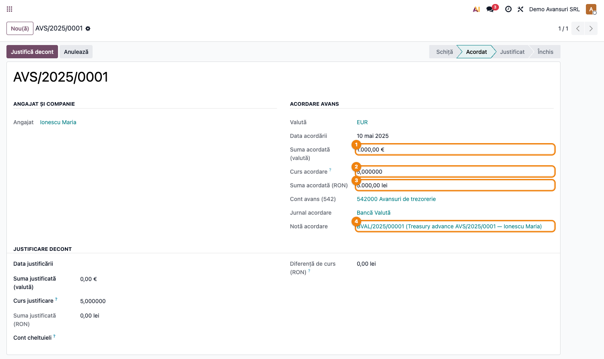
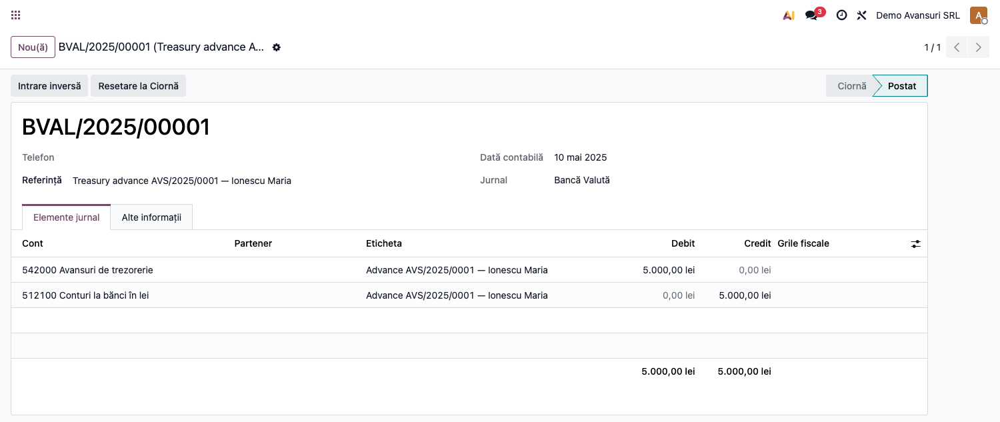
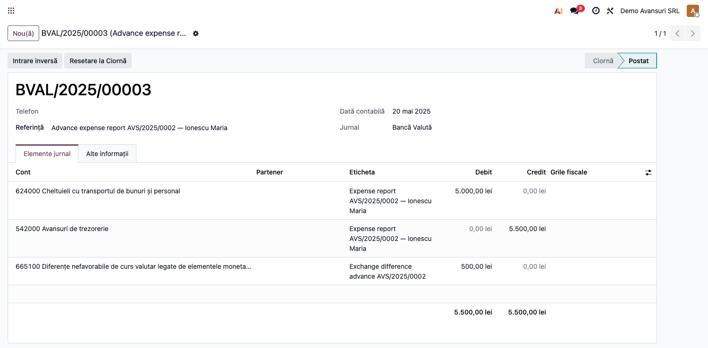
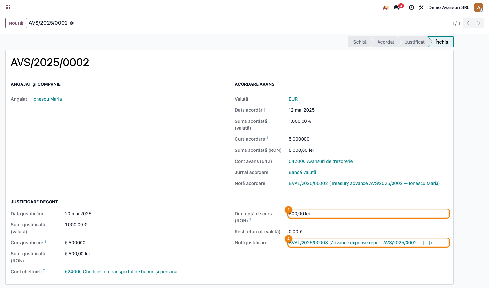

# Fișă Modul: Reevaluare Avansuri Valută (Cont 542)

**Poziție plan:** B4.2
**Modul:** `l10n_ro_expense_currency`
**FR:** FR-12
**Capitol manual:** Cap 8.2
**Utilizator principal:** Contabil, HR
**Prioritate:** 🟡 Medie (doar companii cu deplasări externe)

---

## 1. Scop business

Modulul gestionează fluxul complet al **avansurilor spre decontare în valută** (cont 542):
acordare din bancă, justificare pe baza decontului de cheltuieli cu calculul automat al diferențelor
de curs (665/765) și returnarea eventualului rest. Este indicat oricărei companii cu deplasări
externe ale angajaților plătite în valută.

## 2. Bază legală și context

OMFP 1802/2014 — deconturi cheltuieli în valută; diferențe curs 665/765

## 3. Utilizatori și roluri

Contabil, HR

Roluri recomandate pentru testare:
- Administrator funcțional: instalează modulul și verifică meniurile
- Utilizator operațional: rulează fluxul zilnic sau lunar
- Contabil/manager: validează rezultatele contabile și rapoartele

## 4. Conturi și date implicate

542 (avansuri spre decontare în valută), 665/765 (diferențe curs)

Date minime pentru demo:
- companie românească cu localizarea contabilă instalată
- perioadă contabilă deschisă
- jurnale și conturi configurate conform scenariului
- documente de test postate, acolo unde fluxul pornește din contabilitate, stocuri, HR sau vânzări

## 5. Configurare inițială

1. Instalați modulul `l10n_ro_expense_currency` pe baza demo.
2. Verificați dependențele cerute de manifest și meniurile nou apărute.
3. Configurați conturile, jurnalele, produsele, partenerii sau parametrii specifici fluxului.
4. Pregătiți un set minim de documente postate pentru perioada de test.
5. Verificați că utilizatorul de test are grupurile de acces necesare.

## 6. Flux de utilizare

### Pasul 1 — Accesare

Accesați **Cheltuieli → Deconturi → Deconturi Cheltuieli** și creați decontul în valută cu avans 542.

### Pasul 2 — Completare date

Completați câmpurile obligatorii: companie, perioadă, jurnal, conturi, parteneri sau documente sursă, după caz.

### Pasul 3 — Acordarea avansului

Click **Acordă avans** → se generează nota contabilă **Dr 542 = Cr 5121** la cursul zilei.
Starea trece în **Acordat**.

**Avansul acordat** — suma EUR, cursul acordare, suma echivalent RON și link-ul la nota contabilă:

**Nota de acordare** — Dr 542000 Avansuri de trezorerie = Cr 512100 Bancă:

### Pasul 4 — Justificarea decontului

Completați **Data justificării**, **Suma justificată (valută)**, **Cursul la data justificării**
și **Contul de cheltuieli** (ex. 624), apoi click **Justifică decont**.

Se generează nota **Dr cheltuieli + Dr 665 / Cr 765 = Cr 542**:
- dacă cursul de la justificare > cursul de acordare → **pierdere de curs Dr 665**
- dacă cursul de la justificare < cursul de acordare → **câștig de curs Cr 765**

**Nota de justificare** — Dr 624000 Cheltuieli transport + Dr 665100 Diferențe curs = Cr 542000
(exemplu cu pierdere 500 RON = 1.000 EUR × (5,50 − 5,00)):

### Pasul 5 — Verificare avans închis

Avansul închis (tot avansul justificat) afișează diferența de curs calculată, cursul justificării și
link-ul la nota generată.

**Avansul închis** — diferența de curs 500,00 lei ① și nota justificare ②:

### Pasul 6 — Returnare rest (dacă avansul e justificat parțial)

Dacă suma justificată < suma acordată, click **Returnează rest** → nota **Dr 5121 = Cr 542**
pentru diferența neacoperită.

## 7. Legături cu alte module / declarații

| Modul / proces | Rol în flux |
|---|---|
| `deltatech_expenses` | deconturi de deplasare și justificări avans |
| `account` | note contabile pe 542, 665 și 765 |
| `currency_rate_live` / cursuri valutare | cursurile folosite la acordare și justificare |
| `l10n_ro_currency_revaluation` | reevaluarea generală valutară, separată de fluxul avansurilor |

Ce este automat: calculul diferențelor de curs la justificarea avansului.
Ce rămâne manual: verificarea cursului folosit și documentelor justificative ale deplasării.

## 8. Verificări pentru consultant

- [ ] Modulul se instalează fără erori pe baza demo.
- [ ] Meniurile și acțiunile sunt vizibile pentru rolul de utilizator potrivit.
- [ ] Fluxul poate fi reprodus de la cap la coadă cu date fictive românești.
- [ ] Rezultatul contabil sau operațional corespunde descrierii din plan.
- [ ] Mesajele de eroare sunt clare pentru un utilizator non-tehnic.
- [ ] Exporturile sau rapoartele se descarcă și conțin datele testate.

## 9. Mesaje de eroare frecvente

| Mesaj / simptom | Cauză probabilă | Remediere |
|-----------------|-----------------|-----------|
| Meniul nu este vizibil | Utilizatorul nu are grupurile necesare | Verificați drepturile de acces și reîncărcați aplicațiile |
| Nu se generează linii | Lipsesc documente postate în perioada aleasă | Creați și postați datele de test necesare |
| Cont lipsă sau jurnal lipsă | Configurarea contabilă este incompletă | Completați conturile și jurnalele în setările modulului |
| Perioada este blocată | Data documentului este într-o perioadă închisă | Folosiți o perioadă deschisă sau ajustați lock date-ul în demo |

## 10. Capturi de ecran

| # | Fișier | Conținut |
|---|--------|----------|
| 1 | `screenshots/01_avans_acordat.png` | Avans în stare Acordat — suma EUR, curs acordare, suma RON, link notă |
| 2 | `screenshots/02_nota_acordare.png` | Nota Dr 542 = Cr 5121 (acordare avans valută) |
| 3 | `screenshots/03_nota_justificare.png` | Nota Dr 624 + Dr 665 = Cr 542 (justificare cu pierdere de curs) |
| 4 | `screenshots/04_avans_inchis.png` | Avans închis — diferența de curs și link-ul la nota de justificare |

## 11. Observații pentru manual

- Monografia completă: Dr 542=Cr 5121 (acordare) → Dr 624+Dr 665=Cr 542 (justificare cu pierdere) → Dr 5121=Cr 542 (returnare rest, dacă e cazul).
- Diferența de curs se calculează automat: `suma_just × (curs_just − curs_acordare)`.
- Câmpul **Diferență de curs (RON)** pozitiv = pierdere (Dr 665); negativ = câștig (Cr 765).
- Conturile 665 și 765 trebuie configurate în **Contabilitate → Configurare → Setări → Avansuri valutare**.
