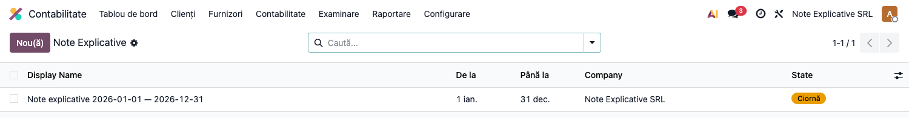
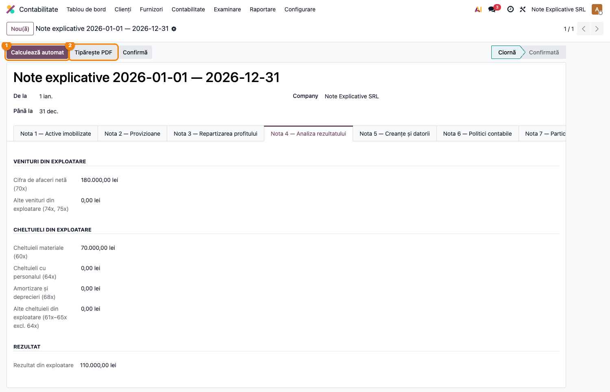
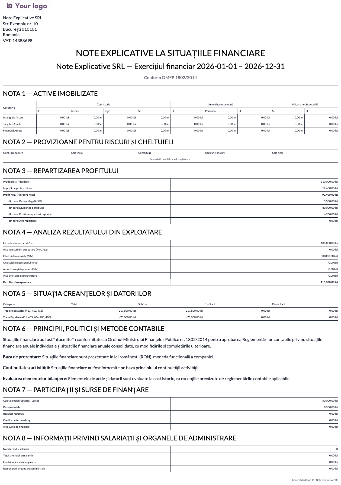

# Fișă Modul: Note explicative la bilanț

**Poziție plan:** C14
**Modul:** `l10n_ro_financial_notes`
**FR:** FR-31
**Capitol manual:** Cap 11.5
**Utilizator principal:** Contabil șef, Auditor
**Prioritate:** 🟡 Medie

---

## 1. Scop business

Modulul ajută la pregătirea notelor explicative la situațiile financiare anuale.

## 2. Bază legală și context

Notele explicative completează bilanțul și contul de profit și pierdere conform reglementărilor contabile. Manualul trebuie să arate cum se pregătesc, verifică și tipăresc.

## 3. Utilizatori și roluri

- Contabil șef: completează și validează notele.
- Director financiar: revizuiește informațiile.
- Auditor: verifică documentele suport.

## 4. Date implicate

- solduri contabile anuale;
- active, datorii, venituri și cheltuieli;
- politici contabile;
- informații descriptive.

## 5. Configurare inițială

1. Instalați `l10n_ro_financial_notes`.
2. Pregătiți anul fiscal și balanța finală.
3. Verificați datele companiei.
4. Stabiliți responsabilul pentru completarea notelor.

## 6. Flux de utilizare

### Pasul 1 — Crearea setului de note

Meniu: **Contabilitate → Contabilitate → Note Explicative**. Lista afișează seturile de note per
perioadă (stare Ciornă / Confirmată).



Apăsați **Nou**, completați intervalul **De la / Până la** (exercițiul financiar) și salvați.

---

### Pasul 2 — Calcul automat și completare

Apăsați **Calculează automat** ① pentru a popula notele care derivă din contabilitate:
- **Nota 1** — mișcarea activelor imobilizate (cost și amortizare);
- **Nota 2** — provizioane;
- **Nota 4** — analiza rezultatului din exploatare (venituri 70x/74x/75x, cheltuieli 60x–68x);
- **Nota 5** — scadențarul creanțelor și datoriilor.



Completați manual notele narative și de repartizare: **Nota 3** (repartizarea profitului), **Nota 6**
(politici contabile), **Nota 7** (participații și finanțare), **Nota 8** (salariați), **Nota 9/10**.

---

### Pasul 3 — Raportul PDF și confirmarea

Apăsați **Tipărește PDF** ② pentru a genera setul complet de note explicative, conform OMFP 1802/2014,
gata de atașat la dosarul situațiilor financiare.



După verificare, apăsați **Confirmă** pentru a bloca setul de note.

## 7. Legături cu alte module / declarații

| Modul / proces | Rol în flux |
|---|---|
| `l10n_ro_financial_statements` | situațiile financiare anuale |
| `account_reports` | rapoarte financiare sursă |
| `l10n_ro_provisions` | date pentru note privind provizioanele |
| `l10n_ro_fixed_assets` | date despre imobilizări și amortizare |

Ce este automat: pregătirea secțiunilor standard de note explicative.
Ce rămâne manual: completarea comentariilor narative și validarea auditorului.

## 8. Verificări pentru consultant

- [ ] Notele pot fi create pentru anul selectat.
- [ ] Raportul include secțiunile principale.
- [ ] Valorile sunt corelate cu balanța.
- [ ] Exportul PDF este disponibil.

## 9. Mesaje frecvente

| Simptom | Cauză probabilă | Remediere |
|---------|-----------------|-----------|
| Note incomplete | Secțiuni necompletate | Completați câmpurile obligatorii |
| Diferențe față de bilanț | Perioadă sau date contabile greșite | Verificați anul fiscal și balanța |

## 10. Capturi de ecran

Capturile (`readme/screenshots/`) sunt **generate automat** din `tests/test_screenshots.py`
(mixinul `ScreenshotCase` din `l10n_ro_doc_screenshots`, import defensiv), în **limba română**,
pe planul de conturi RO:

1. `01_lista_note.png` — Lista seturilor de note explicative.
2. `02_formular_note.png` — Formularul cu notele calculate (tab Nota 4 — analiza rezultatului).
3. `03_raport_pdf.png` — Raportul PDF al notelor explicative (OMFP 1802/2014).

Regenerare:

```bash
./odoo/odoo-bin -c odoo.conf -d <db> -i l10n_ro_financial_notes,l10n_ro_doc_screenshots \
    --test-tags=fise_screenshots --stop-after-init
```
