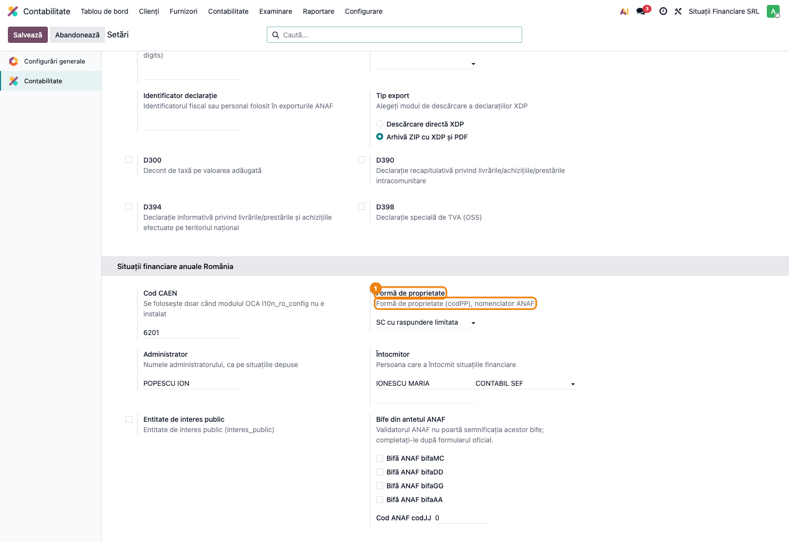
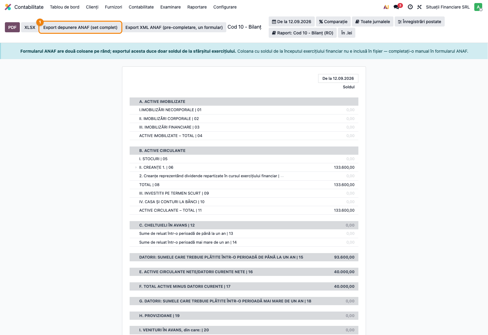
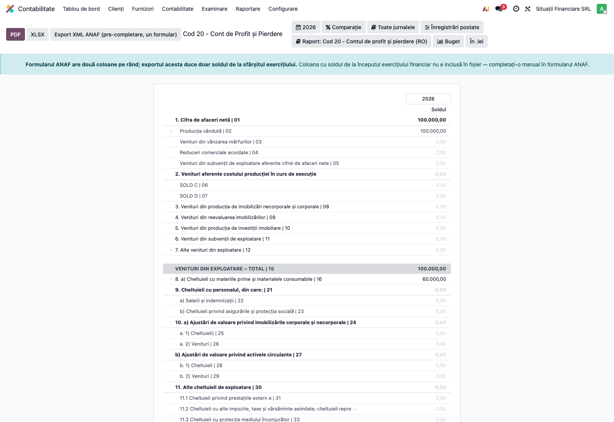
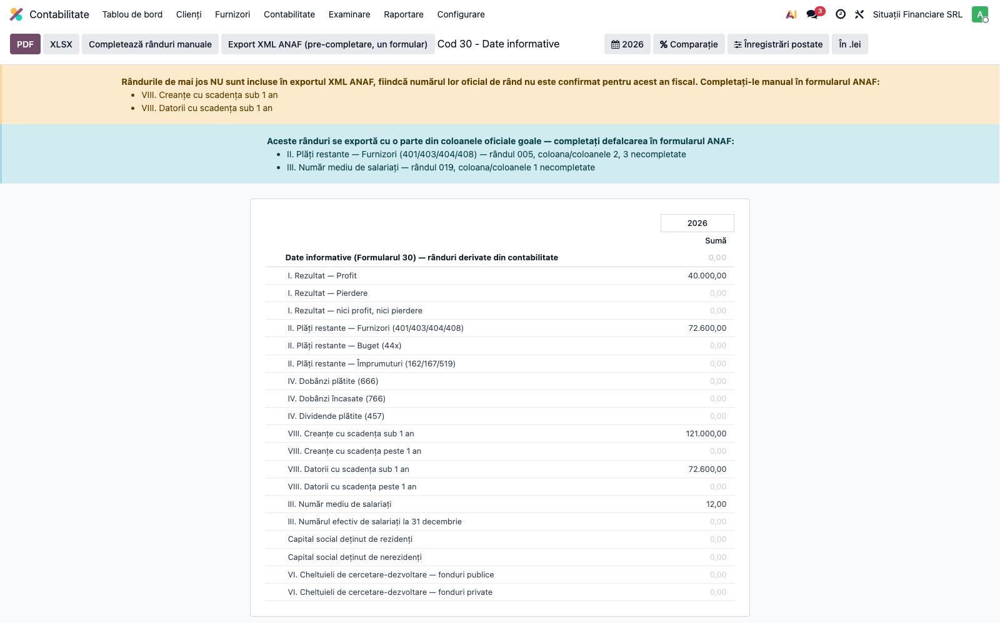
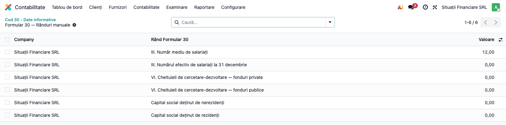

# Fișă Modul: Situații Financiare Anuale

**Poziție plan:** B2.3
**Modul:** `l10n_ro_financial_statements`
**FR:** FR-31
**Capitol manual:** Cap 11.2
**Utilizator principal:** Contabil șef, Responsabil fiscal
**Prioritate:** 🔴 Ridicată (termen legal: 150 de zile de la încheierea exercițiului)

---

## 1. Scop business

Modulul produce **fișierul de depunere a situațiilor financiare anuale** în formatul cerut de ANAF,
pornind de la rapoartele financiare românești din `l10n_ro_reports` (Enterprise). Consultantul
folosește documentul pentru reproducerea fluxului în baza demo și pentru pregătirea capitolului
Cap 11.2 din manualul utilizator.

Fără modul, rapoartele există pe ecran, dar fișierul de depus nu se poate genera din Odoo.

## 2. Bază legală și context

- **OMFP 1802/2014** — Reglementări contabile privind situațiile financiare anuale; definește
  **structura** Bilanțului (F10) și a Contului de Profit și Pierdere (F20). **Numerotarea de
  depunere** nu vine de aici: ea se ia din ordinul MF al anului și se verifică pe grila
  validatorului — numerele din etichetele rapoartelor Enterprise nu coincid cu cele oficiale.
- **Ordinul MF de depunere** pentru exercițiul raportat — aprobă anual structura formularelor.
  Structura efectiv acceptată se verifică pe validatorul publicat de ANAF pentru anul respectiv.
- **Legea 82/1991**, art. 36 — obligativitatea depunerii, în **150 de zile** de la încheierea
  exercițiului financiar pentru societăți (120 de zile pentru celelalte entități); arhivare 10 ani.

Modulul acoperă **bilanțul prescurtat** (`tipBIL = BS`, validator ANAF S1003), adică perechea de
rapoarte „Cod 10 - Bilanț" + „Cod 20 - Cont de Profit și Pierdere". Bilanțul complet și cel
simplificat pentru microentități nu sunt încă acoperite.

## 3. Utilizatori și roluri

Contabil șef, Director financiar.

Roluri recomandate pentru testare:
- Administrator funcțional: instalează modulul, completează antetul de depunere pe companie;
- Contabil/manager: verifică rândurile formularelor și validează fișierul înainte de depunere.

## 4. Conturi și date implicate

Modulul **nu generează note contabile** — citește soldurile prin rapoartele `l10n_ro_reports`.
Conturile implicate sunt cele din planul RO care alimentează rândurile de bilanț și de cont de
profit și pierdere (clasele 1–7), plus, pentru Formularul 30:

| Rând F30 | Conturi citite |
|---|---|
| Rezultatul exercițiului | clasa 7 − clasa 6 |
| Plăți restante — furnizori | 401, 403, 404, 408 cu scadență depășită |
| Plăți restante — buget | 44x cu scadență depășită (vezi nota de mai jos) |
| Plăți restante — împrumuturi | 162, 167, 519 cu scadență depășită |
| Dobânzi și dividende | 666, 766, 457 |
| Creanțe / datorii pe scadențe | conturi de tip creanță / datorie, împărțite la 1 an |

> **Două limite de citit înainte de a valida cifrele.** Rândul „plăți restante — buget" caută
> conturile care încep cu `44`, deci include și conturile de TVA (4426/4427/4428); în practică
> acestea sunt eliminate de filtrul pe sold nereconciliat, dar verificați-le. Iar **plățile
> restante și creanțele/datoriile pe scadențe folosesc soldul rezidual de astăzi**, nu pe cel de
> la 31 decembrie: dacă depuneți în mai, încasările din ianuarie–mai reduc retroactiv cifrele.

Date minime pentru demo:
- companie românească cu localizarea contabilă instalată și exercițiul închis;
- facturi client și furnizor postate în exercițiul raportat;
- antetul de depunere completat pe companie (vezi Pasul 1).

## 5. Configurare inițială

1. Instalați modulul `l10n_ro_financial_statements` pe baza demo (aduce după el `l10n_ro_reports`
   și `l10n_ro_anaf_base`).
2. Completați **antetul de depunere** pe companie — vezi Pasul 1; fără el exportul se oprește.
3. Verificați că adresa fiscală a companiei e completă (stradă, oraș, cod poștal, județ, țară) și
   că are CUI și număr de înregistrare la Registrul Comerțului.
4. Postați toate documentele exercițiului. **Generați situațiile financiare ÎNAINTE de nota
   anuală de închidere prin 121** — vezi avertismentul de la Pasul 6.
5. Verificați că utilizatorul de test are grupul **Contabilitate / Consilier**.

## 6. Flux de utilizare

### Pasul 1 — Completarea antetului de depunere

Accesați **Contabilitate → Configurare → Setări**, secțiunea **„Situații financiare anuale
România"**.

Documentul cerut de ANAF are în antet 22 de atribute obligatorii. O parte se deduc singure (luna,
bifa de aprobare), o parte se iau din datele companiei (CUI, Registrul Comerțului, CAEN, județ),
iar restul — cele de aici — nu se pot deduce din contabilitate:



- **Formă de proprietate** ① — nomenclatorul ANAF (ex. „SC cu raspundere limitata").
- **Administrator** și **Întocmitor** — numele așa cum apar pe situațiile depuse, plus calitatea
  întocmitorului (director economic, contabil șef, membru CECCAR etc.).
- **Cod CAEN** — se completează doar dacă modulul OCA `l10n_ro_config` nu e instalat; când e
  instalat, codul de pe partenerul companiei are prioritate.
- **Entitate de interes public** și **bifele din antetul ANAF** — validatorul ANAF nu poartă
  semnificația acestor bife; se completează după formularul oficial.

> **Șase câmpuri opresc exportul dacă lipsesc:** codul CAEN, numărul de la Registrul Comerțului,
> forma de proprietate, numele administratorului, numele și calitatea întocmitorului. Mesajul de
> eroare le enumeră exact. Restul (bifele, codJJ, entitate de interes public, nr. CECCAR) nu
> blochează, dar se completează după formularul oficial.

### Pasul 2 — Verificarea Bilanțului (F10)

Accesați **Contabilitate → Raportare → Bilanț** și alegeți varianta **„Cod 10 - Bilanț (RO)"** din
selectorul de raport.

**Găsiți pe ecran:** fiecare rând poartă la final numărul din formular (`| 01`, `| 04`, …), iar
coloana „Soldul" arată valoarea la data selectată. Rândurile de total sunt îngroșate.

**Verificați:** raportul se deschide la data curentă — **setați 31 decembrie** a exercițiului
raportat din filtrul de dată (în captura de mai jos raportul e la data implicită). Apoi confirmați
că „ACTIVE IMOBILIZATE – TOTAL | 04", „ACTIVE CIRCULANTE – TOTAL | 11" și „CAPITALURI - TOTAL | 51"
corespund balanței de verificare de închidere.



Sub bara de butoane apare o notă: formularul ANAF are **două coloane pe rând** (sold la începutul și
la sfârșitul exercițiului), iar fișierul de pre-completare duce doar coloana de închidere.

Butonul **„Export depunere ANAF (set complet)"** ① este cel care produce fișierul de depus; îl
folosiți la Pasul 5, după ce verificați toate formularele.

### Pasul 3 — Verificarea Contului de Profit și Pierdere (F20)

Accesați **Contabilitate → Raportare → Cont de Profit și Pierdere**. Din selectorul **„Raport:"**
alegeți explicit varianta **„Cod 20 - Contul de profit și pierdere (RO)"**.

> ⚠️ Odoo poate deschide implicit varianta **micro-entitate** (8 rânduri). Documentul de depunere se
> construiește **exclusiv** din varianta de mai sus — dacă verificați pe cea micro, validați alte
> cifre decât cele depuse.

**Găsiți pe ecran:** rândurile numerotate `| 01` … `| 68`, cu „VENITURI TOTALE", „CHELTUIELI
TOTALE" și rezultatul net (profit sau pierdere) la final.

**Verificați:** perioada e exercițiul întreg, nu o lună; rezultatul net din F20 coincide cu
rezultatul afișat pe Formularul 30 la Pasul 4 și cu profitul care va ajunge pe contul 121 la
închidere.



### Pasul 4 — Formularul 30 „Date informative"

Accesați **Contabilitate → Raportare → Cod 30 - Date informative**.

**Găsiți pe ecran:** rândurile derivate automat din contabilitate (rezultat, plăți restante,
dobânzi, dividende, creanțe și datorii pe scadențe) și, deasupra lor, **două bannere**:



- **Bannerul galben** enumeră rândurile care **nu ajung în fișier**, pentru că numărul lor oficial
  de rând nu e confirmat pentru anul fiscal. Listează doar rândurile **cu valoare nenulă** — cele pe
  zero nu induc în eroare, deci nu apar. Se completează manual în formularul ANAF.
- **Bannerul albastru** enumeră rândurile care se exportă, dar cu o parte din coloanele oficiale
  goale — de exemplu plățile restante către furnizori, unde putem deriva totalul, dar nu și
  defalcarea pe vechime.

**Verificați:** rezultatul de pe primele rânduri coincide cu F20; plățile restante corespund
facturilor cu scadență depășită la 31 decembrie; ați citit ambele bannere și știți ce aveți de
completat manual.

### Pasul 5 — Rândurile statistice, completate manual

Rândurile care nu se pot deriva din contabilitate (număr de salariați, structura capitalului
social, cheltuieli de cercetare-dezvoltare) se introduc manual. Apăsați, pe raportul F30, butonul
**„Completează rânduri manuale"**.

Butonul creează, dacă nu există deja, câte un rând pentru fiecare poziție statistică, pe companie
și perioadă, și deschide lista editabilă:



**Verificați:** numărul mediu de salariați corespunde statelor de plată / REVISAL; apăsarea
repetată a butonului nu creează duplicate. Valorile sunt legate de o **perioadă** — afișați
coloanele „Începutul perioadei" / „Sfârșitul perioadei" din selectorul de coloane (⚙) dacă vreți să
confirmați pe ecran că editați exercițiul corect.

### Pasul 6 — Generarea fișierului de depunere

Reveniți pe **Bilanț (Cod 10)** și apăsați **„Export depunere ANAF (set complet)"**.

Înainte de a produce fișierul, modulul rulează **pre-validarea corelațiilor** — 290 din cele 303
reguli ANAF (totaluri = suma componentelor, inegalități, rândurile de profit/pierdere). Printre ele
e și ecuația bilanțieră (capitaluri = active − datorii), deci un bilanț dezechilibrat e prins aici.
Dacă formularul se contrazice, exportul se oprește și enumeră neconcordanțele, cu valoarea
așteptată și cea găsită.

> Mesajul separat „Bilanț dezechilibrat…" apare pe **exportul de pre-completare**, nu pe acest buton.

> Verificarea corelațiilor e necesară pentru că **validatorul ANAF pentru anul 2025 nu le mai
> aplică** — un formular cu totaluri greșite ar trece DUKIntegrator și ar rămâne greșit legal.

Fișierul rezultat este un singur document, cu formularele ca elemente și valorile ca atribute:

```xml
<?xml version='1.0' encoding='UTF-8'?>
<Bilant1003 xmlns="mfp:anaf:dgti:s1003:declaratie:v15"
            an="2025" luna="12" cui="14399840" den="SITUAȚII FINANCIARE SRL"
            regCom="J33/1234/2010" caen="6201" caenE="6201" AN_CAEN="2025"
            tipBIL="BS" codTT="33" codPP="35" interes_public="0"
            nume_admin="POPESCU ION" nume_intocmit="IONESCU MARIA" calit_intocmit="12"
            bifa_aprob="1" bifa_art27="0" totalPlata_A="0">
  <F10 F10_0041="0" F10_0042="133600" F10_0091="0" F10_0092="133600" …/>
  <F20 F20_0011="0" F20_0012="100000" F20_0692="40000" …/>
  <F30 F30_0011="1" F30_0012="40000" F30_0192="12" …/>
</Bilant1003>
```

Numele atributului e `F<formular>_<rând pe 3 cifre><coloană pe 1 cifră>`: `F30_0192` înseamnă
Formularul 30, rândul 019, coloana 2 — numărul mediu de salariați.

### Pasul 7 — Validarea la ANAF și depunerea

Încărcați fișierul în **DUKIntegrator** cu validatorul de bilanț corespunzător (S1003 pentru
bilanțul prescurtat) și depuneți-l prin SPV.

> Jar-urile de bilanț **nu vin** în kitul DUKIntegrator: se descarcă separat de pe site-ul ANAF,
> se copiază în folderul `lib/` al instalării și se șterge `config/versiuniCurente.txt`.

### Note de monografie și raportare

Modulul **nu generează note contabile**. El citește soldurile deja înregistrate și le transpune pe
rândurile formularelor. Singura scriere în bază sunt rândurile statistice introduse manual
(model propriu, pe companie și perioadă), care nu au efect contabil.

> ⚠️ **Ordinea față de închiderea prin 121.** Contul de profit și pierdere și rândurile de rezultat
> din F30 se calculează din **rulajele** conturilor din clasele 6 și 7 pe perioada raportată. Nota
> anuală de închidere generată de `l10n_ro_account_return_pl_closing` se datează la **sfârșitul
> perioadei închise**, adică *în interiorul* exercițiului raportat, și golește tocmai aceste conturi.
> Dacă o postați înainte de a genera situațiile, F20 și rândurile de rezultat din F30 ies pe zero,
> în timp ce bilanțul arată profitul pe 121 — iar pre-validarea oprește exportul cu eroare de
> corelație între F10 și F20. Generați și arhivați documentul de depunere **înainte** de nota de
> închidere anuală, sau asigurați-vă că aceasta nu cade în perioada raportată.

## 7. Legături cu alte module / declarații

| Modul | Rol |
|---|---|
| `l10n_ro_reports` (Enterprise) | furnizează rapoartele „Cod 10 - Bilanț" și „Cod 20 - CPP" cu rândurile numerotate |
| `l10n_ro_anaf_base` | datele de identificare a companiei folosite în antet și validarea completitudinii lor |
| `l10n_ro_account_return_pl_closing` | închiderea 6xx/7xx prin 121, pre-condiție a rezultatului |
| `l10n_ro_financial_notes` | notele explicative 1–10, complementare formularelor |
| `l10n_ro_config` (OCA, opțional) | codul CAEN de pe partener; dacă lipsește, se folosește câmpul de rezervă de pe companie |

**Ce e automat:** valorile rândurilor F10, F20 și rândurile derivabile din F30; numerotarea oficială
a rândurilor; antetul documentului; verificarea echilibrului și a corelațiilor; avertismentele
despre ce nu ajunge în fișier.

**Ce rămâne manual:** rândurile statistice din F30; cele **14 poziții F30** fără număr oficial
confirmat; Formularul 40; validarea în DUKIntegrator și depunerea prin SPV.

> A nu se confunda cu cele **13 reguli** de corelație ANAF pe care pre-validarea nu le acoperă —
> sunt două numere diferite, despre lucruri diferite.

## 8. Verificări pentru consultant

- [ ] Antetul de depunere e completat pe companie (formă de proprietate, administrator, întocmitor).
- [ ] Adresa fiscală, CUI-ul și numărul de la Registrul Comerțului sunt complete.
- [ ] Documentul de depunere e generat **înainte** de nota anuală de închidere prin 121 (sau aceasta nu cade în perioada raportată).
- [ ] Pe Bilanț, data selectată e 31 decembrie a exercițiului raportat.
- [ ] Total Activ = Total Pasiv pe raportul Bilanț.
- [ ] Rezultatul net din F20 coincide cu soldul 121 și cu rândurile de rezultat din F30.
- [ ] Ambele bannere de pe F30 au fost citite, iar rândurile enumerate sunt notate pentru
      completare manuală în formularul ANAF.
- [ ] Rândurile statistice F30 sunt completate (număr de salariați cel puțin).
- [ ] Exportul „Export depunere ANAF (set complet)" se termină fără eroare de corelație.
- [ ] Fișierul generat trece validatorul ANAF în DUKIntegrator.
- [ ] Fișierul XML e arhivat împreună cu PDF-ul raportului (Legea 82/1991 — 10 ani).

## 9. Mesaje de eroare frecvente

| Mesaj | Cauză | Remediere |
|---|---|---|
| „Antetul depunerii ANAF e incomplet pentru compania … Completați, în setările de contabilitate: …" | Lipsesc câmpuri obligatorii de antet | Completați câmpurile enumerate în mesaj (Pasul 1) |
| „Bilanț dezechilibrat: Total Activ … ≠ Total Pasiv …" | Balanța de verificare nu se închide | Verificați balanța și închiderea prin 121 înainte de export |
| „Situațiile financiare își contrazic propriile totaluri…" | Un total nu corespunde componentelor lui | Mesajul enumeră regulile încălcate, cu valoarea așteptată și cea găsită; verificați formulele raportului și balanța |
| „Compania … nu are configurat un cod CAEN" | Lipsește codul CAEN | Completați-l pe partenerul companiei (`l10n_ro_config`) sau în câmpul de rezervă din setări |
| „Niciun validator ANAF nu e mapat pentru tipul de bilanț …" | S-a cerut bilanț complet (BL) sau simplificat (UU) | Deocamdată e acoperit doar bilanțul prescurtat (BS / S1003) |

## 10. Capturi de ecran

Capturile sunt **generate automat** din `tests/test_screenshots.py` (mixinul `ScreenshotCase` din
`l10n_ro_doc_screenshots`, import defensiv), în limba română, pe planul de conturi RO.

| Fișier | Conținut |
|---|---|
| `01_configurare_antet.png` | Setările de contabilitate, blocul „Situații financiare anuale România" |
| `02_bilant_f10.png` | Bilanțul F10 cu butonul de depunere și nota despre coloana de deschidere |
| `03_cpp_f20.png` | Contul de Profit și Pierdere F20 |
| `04_date_informative_f30.png` | Formularul 30 cu cele două bannere de avertisment |
| `05_randuri_manuale_f30.png` | Lista rândurilor statistice completate manual |

Regenerare:

```bash
FISE_SCREENSHOTS=1 ./odoo/odoo-bin -c odoo.conf -d <db> \
    -i l10n_ro_financial_statements,l10n_ro_doc_screenshots --without-demo=all \
    --test-tags=/l10n_ro_financial_statements:TestFinancialStatementsScreenshots --stop-after-init
```

> Rulați pe o bază curată, nu pe una cu toată suita instalată: pagina de setări se randează cu
> toate blocurile de configurare din baza respectivă, iar un modul nerelevant cu o eroare de view
> face captura să eșueze.

## 11. Observații pentru manual

- Insistați pe **Pasul 1**: antetul de depunere e o configurare unică, dar blochează tot fluxul
  dacă lipsește. Merită un tabel cu cele 11 câmpuri și de unde se ia fiecare valoare, marcând clar
  care șase sunt blocante.
- Explicați diferența dintre **cele două butoane**: „Export depunere ANAF (set complet)" produce
  fișierul de depus; „Export XML ANAF (pre-completare, un formular)" produce un fișier de lucru pe
  un singur formular, **care nu se depune**.
- Cele două bannere de pe F30 nu sunt decor: ele sunt singurul loc în care se vede diferența dintre
  ce arată ecranul și ce ajunge în fișier. Manualul ar trebui să ceară explicit citirea lor.
- Menționați că numerotarea rândurilor și regulile de corelație se **regenerează din validatorul
  ANAF** la fiecare republicare; e o sarcină recurentă de mentenanță, nu una de implementare.
