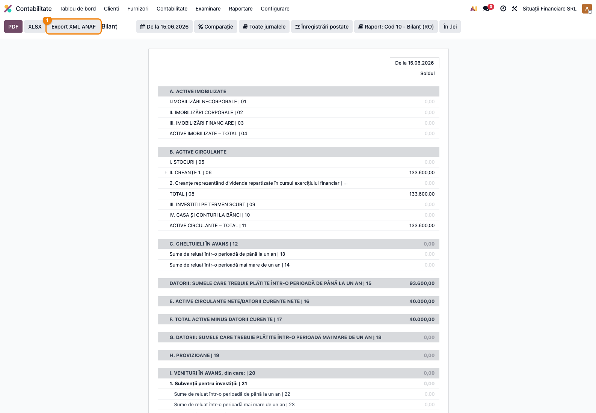
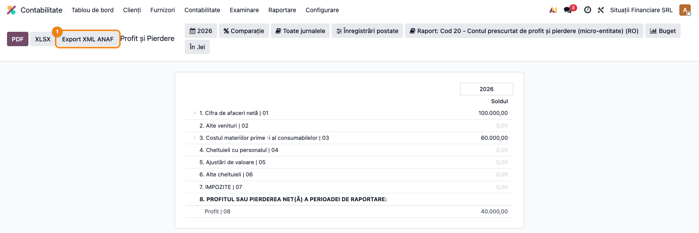
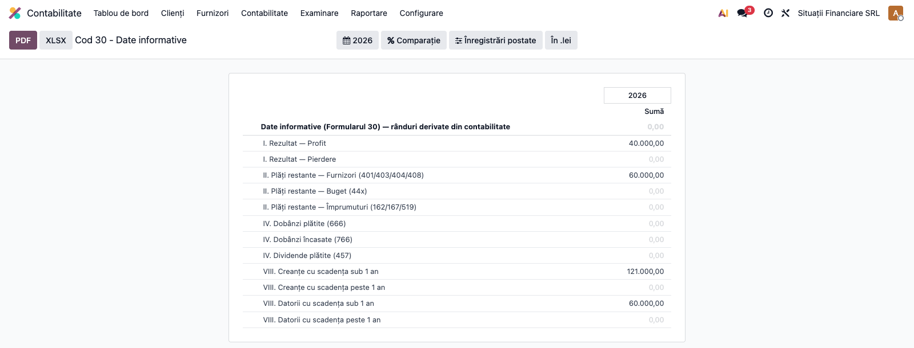

# Fișă Modul: Situații Financiare Anuale

**Poziție plan:** B2.3
**Modul:** `l10n_ro_financial_statements`
**FR:** FR-31
**Capitol manual:** Cap 11.2
**Utilizator principal:** Contabil șef, Responsabil fiscal
**Prioritate:** 🔴 Ridicată (termen legal 31 mai)

---

## 1. Scop business

Această fișă descrie utilizarea modulului `l10n_ro_financial_statements` pentru scenariul **Situații Financiare Anuale**.
Consultantul folosește documentul pentru reproducerea fluxului în baza demo și
pentru pregătirea capitolului Cap 11.2 din manualul utilizator.

## 2. Bază legală și context

OMFP 1802/2014 — Bilanț (F10), Cont Profit și Pierdere (F20), Informații (F30), Active (F40)

## 3. Utilizatori și roluri

Contabil Șef, Director Financiar

Roluri recomandate pentru testare:
- Administrator funcțional: instalează modulul și verifică meniurile
- Utilizator operațional: rulează fluxul zilnic sau lunar
- Contabil/manager: validează rezultatele contabile și rapoartele

## 4. Conturi și date implicate

—

Date minime pentru demo:
- companie românească cu localizarea contabilă instalată
- perioadă contabilă deschisă
- jurnale și conturi configurate conform scenariului
- documente de test postate, acolo unde fluxul pornește din contabilitate, stocuri, HR sau vânzări

## 5. Configurare inițială

1. Instalați modulul `l10n_ro_financial_statements` pe baza demo.
2. Verificați dependențele cerute de manifest și meniurile nou apărute.
3. Configurați conturile, jurnalele, produsele, partenerii sau parametrii specifici fluxului.
4. Pregătiți un set minim de documente postate pentru perioada de test.
5. Verificați că utilizatorul de test are grupurile de acces necesare.

## 6. Flux de utilizare

Modulul extinde rapoartele financiare native românești din `l10n_ro_reports` (Bilanț **F10** și
Cont de Profit și Pierdere **F20**) cu un buton **Export XML ANAF** care generează fișierul XML în
formatul de depunere ANAF (`tip=BL` pentru bilanț, `tip=CPP` pentru CPP), **și adaugă un raport propriu
Cod 30 – Date informative** (Pașii 3–5) care pre-completează automat din contabilitate rândurile
derivabile ale Formularului 30, permite completarea manuală a rândurilor statistice și exportă XML-ul
de depunere ANAF.

### Pasul 1 — Bilanțul (F10)

Accesați **Contabilitate → Raportare → Bilanț**. Pe o companie românească se selectează automat
varianta **Cod 10 – Bilanț (RO)**. Setați data de raportare și verificați soldurile pe rânduri
(fiecare rând poartă numărul ANAF, ex. `… | 06`).



Apăsați **Export XML ANAF** ① pentru a descărca fișierul. La bilanț, modulul **validează echilibrul**
(Total Activ = Total Pasiv) înainte de export și blochează generarea dacă bilanțul e dezechilibrat.

---

### Pasul 2 — Contul de Profit și Pierdere (F20)

Accesați **Contabilitate → Raportare → Profit și Pierdere**. Se selectează automat varianta RO
corespunzătoare mărimii companiei (micro-entitate / prescurtat / dezvoltat). Butonul **Export XML ANAF** ①
este disponibil pe toate variantele.



Fișierul XML conține câte un element `<rd nr="NN" val="…"/>` pentru fiecare rând al formularului,
gata de încărcat în aplicația ANAF a situațiilor financiare.

---

### Pasul 3 — Date informative (F30) — pre-completare automată

Accesați **Contabilitate → Raportare → Cod 30 - Date informative**. Raportul (model nativ
`account.report`) calculează automat, pentru perioada selectată, rândurile Formularului 30 care se pot
deriva din contabilitate. Setați intervalul de date (de regulă exercițiul: 1 ian – 31 dec).



**Găsește pe ecran → verifică → folosește datele:**

1. **Găsește pe ecran** — fiecare rând este o poziție derivabilă a Formularului 30, cu o singură
   coloană **Sumă**:
   - `I. Rezultat — Profit / Pierdere` (din clasa 7 venituri − clasa 6 cheltuieli);
   - `II. Plăți restante — Furnizori / Buget / Credite` (solduri cu scadența depășită la data raportului);
   - `IV. Dobânzi plătite/încasate, Dividende plătite` (rulaj 666/766/457);
   - `VIII. Creanțe / Datorii sub 1 an și peste 1 an` (defalcate după scadența `date_maturity`).
2. **Verifică** — înainte de a trece datele în declarația ANAF: rezultatul (profit/pierdere) corespunde
   cu cel din F20; creanțele/datoriile „sub 1 an" + „peste 1 an" însumează soldurile pe clienți (411x)
   respectiv furnizori (401/404); plățile restante reflectă doar soldurile cu scadența depășită la 31.12.
3. **Folosește datele** — valorile servesc la completarea Formularului 30 în aplicația ANAF.

---

### Pasul 4 — Rândurile manuale/statistice (nr. salariați, capital, C-D)

Rândurile statistice ale Formularului 30 **nu se deduc din contabilitate** (nr. mediu și efectiv de
salariați, structura capitalului social pe deținători rezidenți/nerezidenți, cheltuielile de
cercetare-dezvoltare pe surse de finanțare). Acestea se introduc manual, pe **companie + perioadă**:

1. În raportul **Cod 30 - Date informative**, cu intervalul de date setat (de regulă 1 ian – 31 dec),
   apăsați butonul **„Completează rânduri manuale"**.
2. Se deschide o listă editabilă, pre-populată cu un rând pentru fiecare poziție statistică a perioadei.
   Completați coloana **Valoare** (ex. *Număr mediu de salariați*, *Numărul efectiv la 31 decembrie*).
3. Valorile sunt salvate persistent (model `l10n.ro.f30.manual.value`, unic pe companie + perioadă + rând)
   și sunt preluate automat la următoarea rulare a raportului și la exportul XML.

**Atenție:** valorile manuale sunt legate de **perioada exactă** afișată în raport. Dacă schimbați
intervalul de date, completați rândurile manuale pentru noua perioadă.

---

### Pasul 5 — Export XML ANAF

După verificarea rândurilor (derivate + manuale), apăsați **„Export XML ANAF"** pentru a descărca fișierul
de depunere. Fișierul respectă aceeași convenție ca F10/F20 — un element `<rd nr="NN" val="…"/>` pentru
fiecare rând cu **număr oficial cunoscut**:

```xml
<?xml version="1.0" encoding="UTF-8"?>
<DateInformative an="2025" cui="12345678" tip="DI" versiune="1">
  <rd nr="1" val="400"/>     <!-- I. Rezultat — Profit -->
  <rd nr="2" val="0"/>       <!-- I. Rezultat — Pierdere -->
  <rd nr="5" val="600"/>     <!-- II. Furnizori restanți -->
  <rd nr="20" val="42"/>     <!-- III. Număr mediu de salariați (manual) -->
  <rd nr="21" val="45"/>     <!-- III. Nr. efectiv salariați la 31.12 (manual) -->
</DateInformative>
```

> ⚠️ **Numerotarea oficială a rândurilor F30 se republică anual** prin ordinul MF de depunere a
> situațiilor financiare. Numerele din modul urmează versiunea modernă stabilă (post-Ordin 470/2018) și
> sunt izolate într-un singur loc (`_F30_LINES` din `l10n_ro_f30_handler.py`), tocmai pentru a fi
> reconciliate ușor cu formularul oficial al anului. **Înainte de depunere**, verificați numerele față de
> Anexa 4 a ordinului în vigoare / soft A ANAF. Rândurile fără număr oficial confirmat (rulajele 666/766
> care nu au corespondent F30, soldurile 44x care se defalcă pe mai multe rânduri, creanțele/datoriile pe
> scadențe) se afișează pe ecran ca informative, dar **nu se exportă** în XML, ca să nu se trimită numere
> de rând incerte într-o depunere legală.

**Note de monografie și raportare:** Formularul 30 este un raport **informativ** — nu generează note
contabile. Sursele rândurilor derivate sunt soldurile și rulajele existente (clasele 6/7, 4xx, 16x/519,
411x/401); rândurile statistice provin din evidența HR/REVISAL și registrul acționarilor.

## 7. Legături cu alte module / declarații

| Modul / proces | Rol în flux |
|---|---|
| `account_reports` | rapoarte F10/F20/F30/F40 și balanță |
| `l10n_ro_financial_notes` | note explicative la bilanț |
| `l10n_ro_inventory_register` | document suport pentru patrimoniu |
| `l10n_ro_account_return_pl_closing` | rezultatul exercițiului în 121 |

Ce este automat: generarea formularelor financiare pe baza datelor contabile.
Ce rămâne manual: validarea clasificărilor și a anexelor înainte de depunere.

## 8. Verificări pentru consultant

- [ ] Modulul se instalează fără erori pe baza demo.
- [ ] Meniurile și acțiunile sunt vizibile pentru rolul de utilizator potrivit.
- [ ] Fluxul poate fi reprodus de la cap la coadă cu date fictive românești.
- [ ] Rezultatul contabil sau operațional corespunde descrierii din plan.
- [ ] Mesajele de eroare sunt clare pentru un utilizator non-tehnic.
- [ ] Exporturile sau rapoartele se descarcă și conțin datele testate.
- [ ] F30: profitul/pierderea din Date informative corespunde cu rezultatul din F20.
- [ ] F30: creanțele „sub 1 an" + „peste 1 an" însumează soldurile pe clienți; idem datoriile pe furnizori.
- [ ] F30: rândurile statistice (salariați, acționariat, C-D) sunt completate manual — nu se deduc din contabilitate.
- [ ] F30: butonul „Completează rânduri manuale" deschide lista editabilă și valorile se salvează pe perioada afișată.
- [ ] F30: butonul „Export XML ANAF" descarcă un fișier `<DateInformative>` cu rânduri `<rd nr val>`.
- [ ] F30: numerotarea oficială a rândurilor a fost reconciliată cu formularul ANAF al exercițiului curent.

## 9. Mesaje de eroare frecvente

| Mesaj / simptom | Cauză probabilă | Remediere |
|-----------------|-----------------|-----------|
| Meniul nu este vizibil | Utilizatorul nu are grupurile necesare | Verificați drepturile de acces și reîncărcați aplicațiile |
| Nu se generează linii | Lipsesc documente postate în perioada aleasă | Creați și postați datele de test necesare |
| Cont lipsă sau jurnal lipsă | Configurarea contabilă este incompletă | Completați conturile și jurnalele în setările modulului |
| Perioada este blocată | Data documentului este într-o perioadă închisă | Folosiți o perioadă deschisă sau ajustați lock date-ul în demo |

## 10. Capturi de ecran

Capturile (`readme/screenshots/`) sunt **generate automat** din `tests/test_screenshots.py`
(mixinul `ScreenshotCase` din `l10n_ro_doc_screenshots`, import defensiv), în **limba română**,
pe planul de conturi RO:

1. `01_bilant_f10.png` — Raportul Bilanț (Cod 10) cu butonul „Export XML ANAF".
2. `02_cpp_f20.png` — Raportul Cont de Profit și Pierdere (Cod 20) cu butonul „Export XML ANAF".
3. `03_date_informative_f30.png` — Raportul Cod 30 – Date informative cu rândurile pre-completate (rezultat, plăți restante, creanțe/datorii pe scadențe).

Regenerare:

```bash
./odoo/odoo-bin -c odoo.conf -d <db> -i l10n_ro_financial_statements,l10n_ro_doc_screenshots \
    --test-tags=fise_screenshots --stop-after-init
```

## 11. Observații pentru manual

În manualul final, păstrați explicația orientată pe activitatea utilizatorului:
ce problemă rezolvă modulul, când se rulează, ce date trebuie pregătite și cum se verifică rezultatul.
