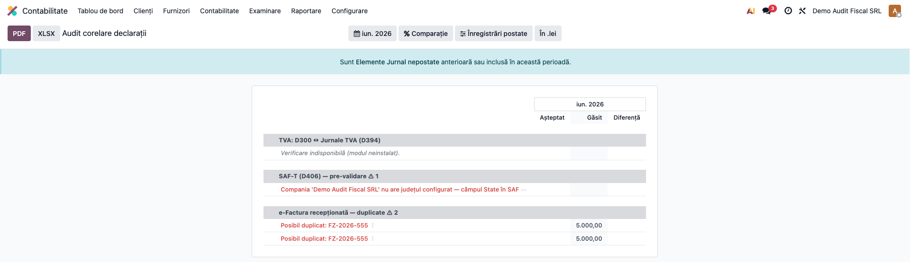
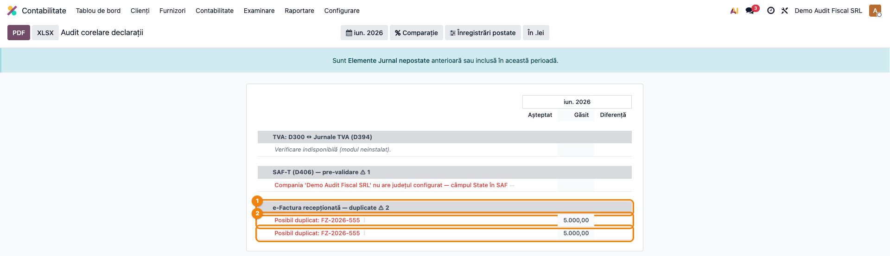

# Fișă Modul: Audit de corelare a declarațiilor fiscale

**Modul:** `l10n_ro_fiscal_audit`
**FR:** FR-65
**Utilizator principal:** Contabil declarații, Contabil șef
**Prioritate:** 🟡 Medie (audit preventiv înainte de depunere; critic în perioada de raportare)

---

## 1. Scop business

Înainte de a depune declarațiile lunare sau de a întâmpina un control ANAF, contabilul trebuie să
fie sigur că **datele se „leagă"** între ele: TVA-ul din D300 corespunde jurnalelor de TVA, fișierul
SAF-T nu are parteneri fără CUI, iar facturile recepționate prin e-Factura nu sunt introduse de două
ori. ANAF verifică automat aceste corelări — o neconcordanță se transformă rapid în notificare sau
control.

Modulul aduce un **raport unic de audit** care, pentru o perioadă aleasă, confruntă totalurile pe
**căi de calcul independente** și listează **neconcordanțele de verificat**, grupate pe arii, cu
valoarea așteptată, valoarea găsită și diferența. Este un instrument de *audit preventiv*:
constatările sunt avertismente pe care contabilul le confirmă și le remediază, **nu** verdicte
automate. Când totul se leagă, lista e goală — semnal verde înainte de depunere.

## 2. Bază legală și context

Context operațional (nu o normă unică): coerența între declarațiile de TVA (**D300**, **D390**,
**D394**), fișierul **SAF-T (D406**, OPANAF 1783/2021) și **e-Factura** (RO e-Factura, SPV) este
verificată de ANAF prin corelări automate. Raportul nu reimplementează logica declarațiilor — apelează
metodele lor existente și le confruntă rezultatele, reducând riscul de erori înainte de depunere.

## 3. Utilizatori și roluri

Contabil declarații (rulează auditul lunar înainte de depunere), contabil șef (verifică
neconcordanțele și decide remedierea).

Roluri recomandate pentru testare:
- Administrator funcțional: instalează modulul și verifică meniul raportului;
- Contabil (`account.group_account_user`): deschide raportul și citește neconcordanțele;
- Contabil/manager: confirmă constatările și operează corecțiile în documentele sursă.

## 4. Conturi și date implicate

Modulul **nu generează note contabile** — este un raport de audit. Indirect, lucrează cu sumele de
TVA din conturile clasei **44** (4426 TVA deductibilă, 4427 TVA colectată, 4423/4424 TVA de
plată/recuperat), pe care le compară între D300 și jurnalele de TVA, dar nu le modifică.

Date minime pentru demo:
- companie românească cu plan de conturi RO și jurnale de TVA configurate;
- facturi de vânzare și cumpărare postate în perioada auditată (pentru aria D300 ↔ Jurnale);
- opțional, două facturi furnizor cu aceeași amprentă (același CUI + serie/nr + dată + sumă) pentru
  a vedea aria de duplicate e-Factura;
- modulele de declarații instalate (D300, SAF-T validator, e-Factura dedup) pentru ca toate ariile
  să fie active; ariile fără modul-sursă apar marcate „indisponibil", nu eroare.

## 5. Configurare inițială

1. Instalați modulul `l10n_ro_fiscal_audit` (depinde de `account_reports` și `l10n_ro`).
2. Pentru acoperire completă, asigurați-vă că sunt instalate și modulele-sursă: `l10n_ro_anaf_d300`
   (corelarea TVA), `l10n_ro_saft_validator` (pre-validarea SAF-T) și `l10n_ro_efactura_dedup`
   (duplicatele e-Factura). Fiecare arie se activează automat dacă modulul ei e prezent.
3. Nu necesită configurare suplimentară: raportul folosește filtrele standard de perioadă din
   framework-ul de rapoarte.

## 6. Flux de utilizare

### Pasul 1 — Rularea auditului pe o perioadă

Accesați **Contabilitate → Raportare → Declarații (Legal) → Audit corelare declarații** și alegeți
**perioada** din filtrul de date (implicit luna curentă).

**Găsiți pe ecran**: raportul este împărțit în **arii de corelare**, fiecare ca secțiune
desfășurabilă:
- **TVA: D300 ↔ Jurnale TVA (D394)** — confruntă TVA colectată (rd. 17) și deductibilă (rd. 27) din
  D300 cu totalurile jurnalelor de TVA;
- **SAF-T (D406) — pre-validare** — semnalează parteneri fără CUI, conturi nemapate, taxe fără tip
  SAF-T;
- **e-Factura recepționată — duplicate** — facturi furnizor cu aceeași amprentă.

Pe titlul fiecărei arii apare numărul de neconcordanțe (⚠ N) când există. Coloanele **Așteptat**,
**Găsit** și **Diferență** arată, pentru fiecare constatare, cele două valori comparate și abaterea
(toleranță 1 leu la rotunjiri).

**Verificați** înainte de a merge mai departe: perioada selectată este luna pe care urmează să o
depuneți; o arie cu „✓ Concordant — nicio neconcordanță" este în regulă; o arie marcată
„Verificare indisponibilă" înseamnă că modulul-sursă nu e instalat (nu o eroare); ariile cu ⚠
necesită atenție.



### Pasul 2 — Analiza unei neconcordanțe și remedierea

Desfășurați aria cu ⚠. Fiecare rând roșu este o **neconcordanță de verificat**: la TVA, numele
rândului D300 și diferența față de jurnal; la e-Factura, factura furnizor suspectată de duplicare,
cu suma în coloana **Găsit**.

**Găsiți pe ecran**: rândurile evidențiate cu roșu, cu eticheta constatării și valorile Așteptat /
Găsit / Diferență. Pentru duplicatele e-Factura, fiecare factură din grupul cu aceeași amprentă
apare ca rând separat.

**Verificați**: pentru fiecare rând, deschideți documentul sursă (click pe linia de tip factură
deschide registrul contabil al facturii) și confirmați dacă diferența e reală — de exemplu, o
factură introdusă de două ori se anulează/șterge, iar o diferență D300 ↔ jurnal se investighează în
jurnalul de TVA. Reluați auditul: când lista devine goală (toate ariile „Concordant"), perioada e
gata de depunere.

**Treci mai departe** — după ce ați citit și confirmat constatările, puteți **exporta** raportul
(butoanele **PDF** / **XLSX** din bara raportului) ca dovadă a auditului preventiv atașată
dosarului perioadei.



### Note de monografie și raportare

Modulul **nu generează note contabile** (niciun Dr/Cr): este un raport de audit. Remedierile se
operează în documentele sursă (anulare factură duplicat, corecție în jurnalul de TVA, completare CUI
partener), nu în raport. „Gate-ul" pre-depunere (lista goală de neconcordanțe) este expus și tehnic
prin metoda `_l10n_ro_fa_has_findings`, pentru integrări viitoare cu verificările de închidere.

## 7. Legături cu alte module / declarații

| Modul / proces | Rol în flux | Tip legătură |
|---|---|---|
| `account_reports` | framework-ul `account.report` (filtre, export PDF/XLSX) | dependență (manifest) |
| `l10n_ro` | planul de conturi și taxele RO | dependență (manifest) |
| `l10n_ro_anaf_d300` | reconcilierea D300 ↔ jurnale TVA (FR-49), refolosită | complementar (probă) |
| `l10n_ro_saft_validator` | pre-validarea SAF-T (parteneri fără CUI, conturi nemapate) | complementar (probă) |
| `l10n_ro_efactura_dedup` | amprenta de duplicare a facturilor e-Factura | complementar (probă) |

Ce este automat: rularea celor trei corelări la deschiderea raportului, gruparea pe arii, marcarea
neconcordanțelor, degradarea grațioasă a ariilor fără modul-sursă.
Ce rămâne manual: alegerea perioadei, interpretarea și confirmarea fiecărei constatări, remedierea
în documentele sursă și exportul dovezii de audit.

## 8. Verificări pentru consultant

- [ ] Modulul se instalează fără erori pe baza demo.
- [ ] Meniul **Contabilitate → Raportare → Declarații (Legal) → Audit corelare declarații** e vizibil.
- [ ] Raportul afișează cele trei arii (TVA D300↔Jurnale, SAF-T, e-Factura).
- [ ] O arie fără modul-sursă instalat apare „Verificare indisponibilă", nu produce eroare.
- [ ] Pe o companie cu date corecte, ariile relevante arată „✓ Concordant".
- [ ] Două facturi furnizor cu aceeași amprentă apar ca neconcordanțe (rânduri roșii) în aria e-Factura.
- [ ] O diferență D300 ↔ jurnal mai mare de 1 leu este listată cu valorile Așteptat/Găsit/Diferență.
- [ ] Click pe o linie de tip factură deschide documentul sursă (drill-down).
- [ ] Exportul PDF/XLSX al raportului funcționează.
- [ ] Pe o perioadă fără probleme, „gate-ul" de neconcordanțe e gol (semnal verde).

## 9. Mesaje de eroare frecvente

| Mesaj / simptom | Cauză probabilă | Remediere |
|-----------------|-----------------|-----------|
| O arie afișează „Verificare indisponibilă (modul neinstalat)" | Modulul-sursă (D300 / SAF-T validator / e-Factura dedup) nu e instalat | Instalați modulul respectiv dacă aria e necesară |
| Aria TVA nu arată nimic / „indisponibil" deși D300 e instalat | Jurnalele de TVA (`l10n_ro_anaf_d394`) nu sunt configurate | Configurați jurnalele de TVA Vânzări/Cumpărări |
| e-Factura raportează duplicate false | Două facturi reale, distincte, au din întâmplare aceeași amprentă (CUI+nr+dată+sumă) | Verificați documentele; dacă sunt legitime, ignorați constatarea |
| Diferență D300 ↔ jurnal pe taxare inversă / TVA la încasare | Aceste cazuri au logică de acumulare proprie, excluse din reconcilierea pe rânduri | Verificați totalurile globale; diferența pe aceste rânduri e așteptată |
| Raportul e gol complet | Perioada selectată nu conține date sau niciun modul-sursă nu e instalat | Alegeți o perioadă cu documente; instalați modulele de declarații |

## 10. Capturi de ecran

Capturile (`readme/screenshots/`) sunt **generate automat** din `tests/test_screenshots.py`
(mixinul `ScreenshotCase` din `l10n_ro_doc_screenshots`, import defensiv), în **limba română**, pe
planul de conturi RO, pe „RO Company" în RON; datele demo (inclusiv facturile duplicate) se
seedează în test, fără conexiune la ANAF:

1. `01_raport_audit.png` — raportul de audit cu cele trei arii de corelare.
2. `02_neconcordante_efactura.png` — aria e-Factura cu facturi duplicate evidențiate (Așteptat/Găsit/Diferență).

Regenerare:

```bash
./odoo/odoo-bin -c odoo.conf -d <db> -i l10n_ro_fiscal_audit,l10n_ro_doc_screenshots \
    --test-tags=fise_screenshots --stop-after-init
```

## 11. Observații pentru manual

Păstrați perspectiva utilizatorului: modulul răspunde la întrebarea „se leagă datele mele înainte să
depun?". Explicați că este un **audit preventiv** — confruntă căi de calcul independente și
semnalează ce trebuie verificat, fără a corecta automat. Subliniați: (1) constatările sunt
avertismente de confirmat uman; (2) o arie „indisponibilă" înseamnă doar lipsa modulului-sursă; (3)
remedierea se face mereu în documentul sursă, apoi se reia auditul până când lista e goală; (4)
exportul raportului servește ca dovadă a verificării atașată dosarului lunar.
