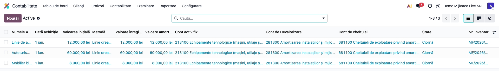
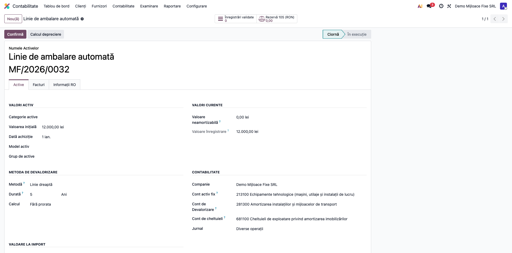
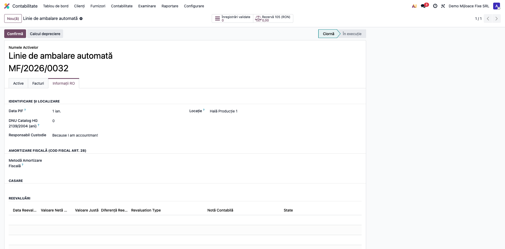

# Fișă Modul: Mijloace Fixe Complet

**Poziție plan:** B6.1
**Modul:** `l10n_ro_fixed_assets`
**FR:** FR-19
**Capitol manual:** Cap 7.1
**Utilizator principal:** Contabil mijloace fixe, Responsabil patrimoniu
**Prioritate:** 🟡 Medie

---

## 1. Scop business

Această fișă descrie utilizarea modulului `l10n_ro_fixed_assets` pentru scenariul **Mijloace Fixe Complet**.
Consultantul folosește documentul pentru reproducerea fluxului în baza demo și
pentru pregătirea capitolului Cap 7.1 din manualul utilizator.

## 2. Bază legală și context

OMFP 1802/2014; HG 2139/2004 (Nomenclatorul MF); Codul Fiscal (amortizare fiscală)

## 3. Utilizatori și roluri

Contabil Active Fixe

Roluri recomandate pentru testare:
- Administrator funcțional: instalează modulul și verifică meniurile
- Utilizator operațional: rulează fluxul zilnic sau lunar
- Contabil/manager: validează rezultatele contabile și rapoartele

## 4. Conturi și date implicate

21x (active), 281x/282x (amortizare), 6811 (cheltuieli amortizare), 6583 (casare)

Date minime pentru demo:
- companie românească cu localizarea contabilă instalată
- perioadă contabilă deschisă
- jurnale și conturi configurate conform scenariului
- documente de test postate, acolo unde fluxul pornește din contabilitate, stocuri, HR sau vânzări

## 5. Configurare inițială

1. Instalați modulul `l10n_ro_fixed_assets` pe baza demo.
2. Verificați dependențele cerute de manifest și meniurile nou apărute.
3. Configurați conturile, jurnalele, produsele, partenerii sau parametrii specifici fluxului.
4. Pregătiți un set minim de documente postate pentru perioada de test.
5. Verificați că utilizatorul de test are grupurile de acces necesare.

## 6. Flux de utilizare

### Pasul 1 — Lista mijloacelor fixe

Accesați **Contabilitate → Active → Active**. Lista afișează mijloacele fixe cu coloanele RO:
valoare inițială, metodă, conturile (213 activ / 281 amortizare / 681 cheltuială), starea și
**numărul de inventar** (`MF/AAAA/NNNN`).



### Pasul 2 — Formularul activului (tab „Active")

Deschideți un mijloc fix. Tab-ul **„Active"** arată valorile (valoare inițială, **metodă „Linie
dreaptă"**, durată), conturile contabile și jurnalul; în antet, numărul de inventar generat automat
și smart button-ul **„Rezervă 105"** (rezerva din reevaluare). Butonul **„Confirmă"** validează
activul și generează planul de amortizare.



### Pasul 3 — Datele specifice RO (tab „Informații RO")

Tab-ul **„Informații RO"** grupează câmpurile cerute de localizare: **Data PIF** (punere în
funcțiune), **Locație**, **DNU** (durata normală din Catalogul HG 2139/2004), **Responsabil
custodie**, metoda de **amortizare fiscală** (Cod Fiscal art. 28), plus secțiunile **Casare** și
**Reevaluări** (rezerva contului 105).



### Note de monografie și raportare

- **Amortizare lunară:** `Dr 6811 (cheltuieli amortizare) = Cr 281x (amortizare cumulată)`.
- **Reevaluare (creștere):** `Dr 21x (activ) = Cr 105 (rezerve din reevaluare)`; la casare/cedare,
  rezerva 105 se transferă la rezultatul reportat.
- **Casare:** scoaterea din evidență `Dr 281x (amortizare) + Dr 658x/471 (val. neamortizată) = Cr 21x (activ)`,
  cu **Decizie de casare** (raport PDF).
- **Amortizare fiscală vs. contabilă** (Cod Fiscal art. 28): se urmărește separat de cea contabilă,
  pentru calculul impozitului pe profit.

## 7. Legături cu alte module / declarații

| Modul / proces | Rol în flux |
|---|---|
| `account_asset` | motorul de active și amortizare |
| `l10n_ro_inventory_register` | registrul anual include imobilizările |
| `l10n_ro_financial_statements` | raportare bilanț și anexe |
| SAF-T | câmpuri necesare pentru active |

Ce este automat: completarea câmpurilor RO și urmărirea amortizării.
Ce rămâne manual: validarea numărului de inventar, codului nomenclator și DNU.

## 8. Verificări pentru consultant

- [ ] Modulul se instalează fără erori pe baza demo.
- [ ] Meniurile și acțiunile sunt vizibile pentru rolul de utilizator potrivit.
- [ ] Fluxul poate fi reprodus de la cap la coadă cu date fictive românești.
- [ ] Rezultatul contabil sau operațional corespunde descrierii din plan.
- [ ] Mesajele de eroare sunt clare pentru un utilizator non-tehnic.
- [ ] Exporturile sau rapoartele se descarcă și conțin datele testate.

## 9. Mesaje de eroare frecvente

| Mesaj / simptom | Cauză probabilă | Remediere |
|-----------------|-----------------|-----------|
| Meniul nu este vizibil | Utilizatorul nu are grupurile necesare | Verificați drepturile de acces și reîncărcați aplicațiile |
| Nu se generează linii | Lipsesc documente postate în perioada aleasă | Creați și postați datele de test necesare |
| Cont lipsă sau jurnal lipsă | Configurarea contabilă este incompletă | Completați conturile și jurnalele în setările modulului |
| Perioada este blocată | Data documentului este într-o perioadă închisă | Folosiți o perioadă deschisă sau ajustați lock date-ul în demo |

## 10. Capturi de ecran

Capturile din `readme/screenshots/` se obțin din `tests/test_screenshots.py` (mixinul `ScreenshotCase`
din `l10n_ro_doc_screenshots`, HttpCase + Playwright), pe companie RO, în lei, cu plan de conturi RO.

1. `01_lista_active.png` — lista mijloacelor fixe cu coloanele RO (nr. inventar, conturi, stare).
2. `02_formular_active.png` — formularul, tab „Active": valori, metodă „Linie dreaptă", durată,
   conturi (213/281/681), jurnal, nr. inventar și smart button „Rezervă 105".
3. `03_informatii_ro.png` — tab „Informații RO": Data PIF, locație, DNU (HG 2139/2004), responsabil
   custodie, amortizare fiscală (Cod Fiscal art. 28), casare, reevaluări (rezerva 105).

Regenerare:
```
./odoo/odoo-bin -c odoo.conf -d <db> -i l10n_ro_fixed_assets,l10n_ro_doc_screenshots \
    --test-tags=fise_screenshots --stop-after-init --http-port=8987 --gevent-port=8988
```

## 11. Observații pentru manual

În manualul final, păstrați explicația orientată pe activitatea utilizatorului:
ce problemă rezolvă modulul, când se rulează, ce date trebuie pregătite și cum se verifică rezultatul.
