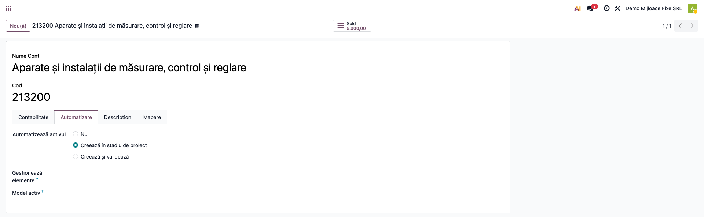
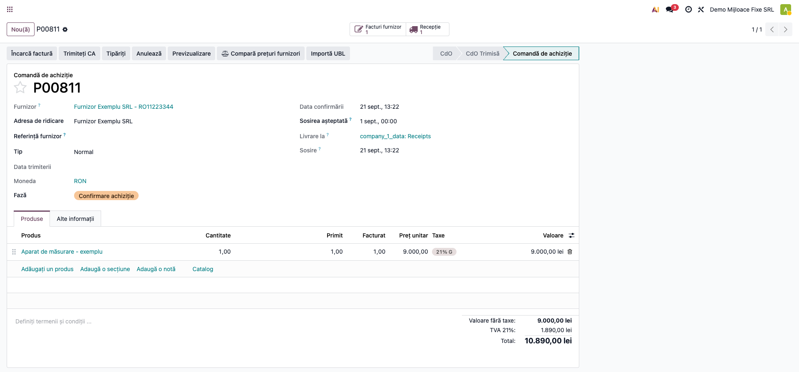
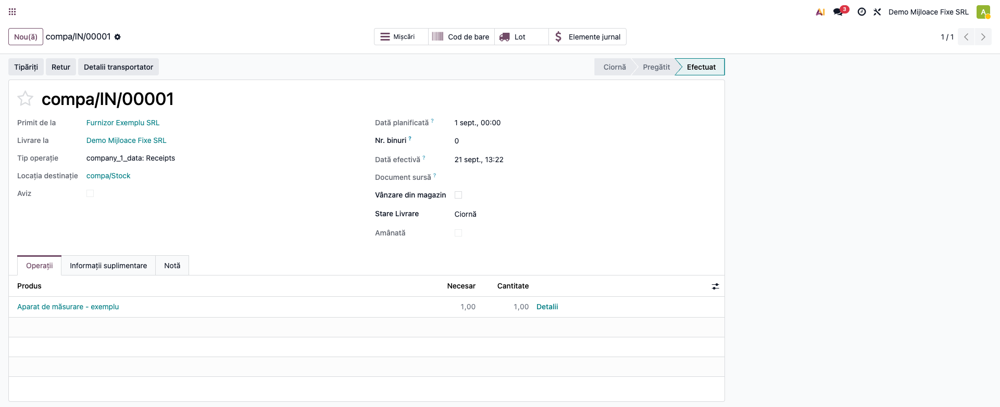
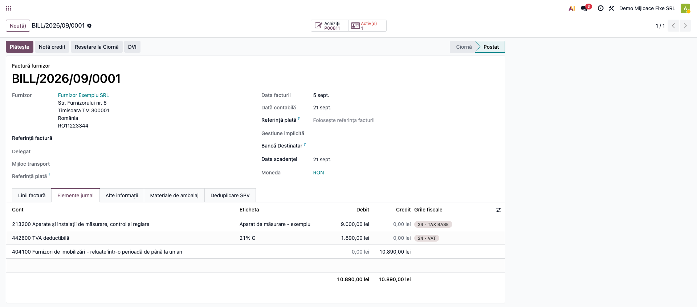
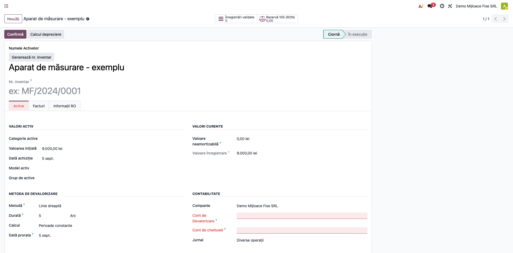
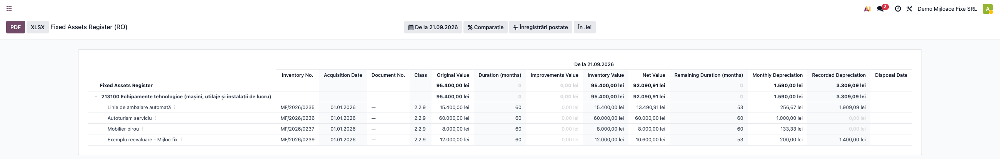
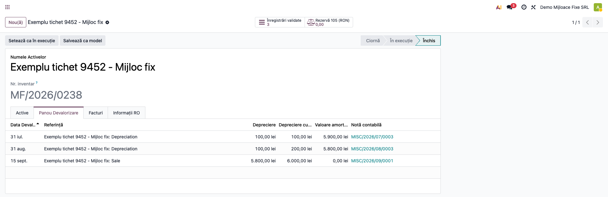
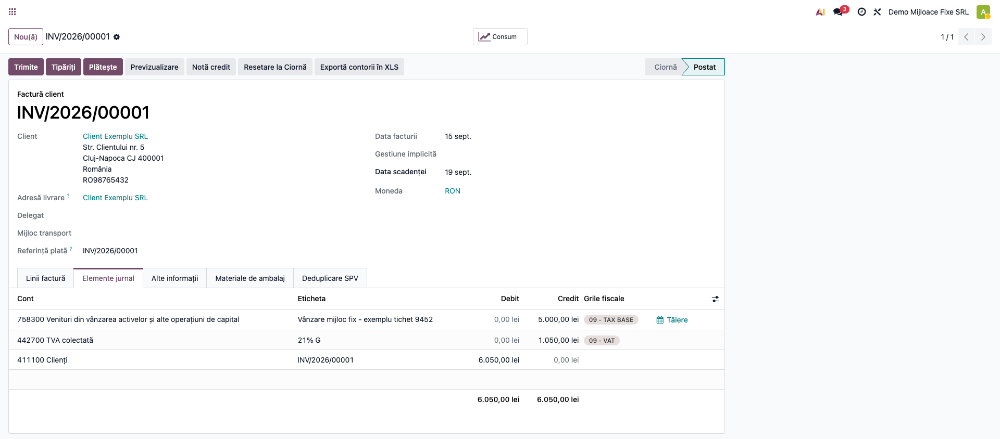
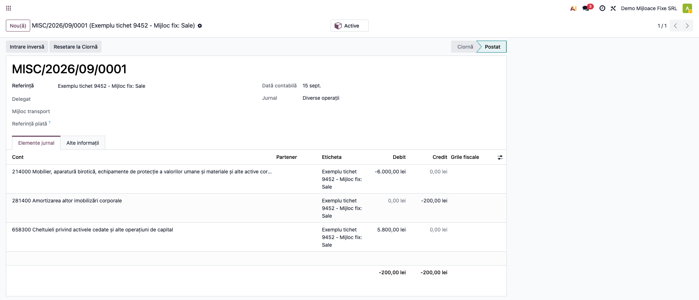
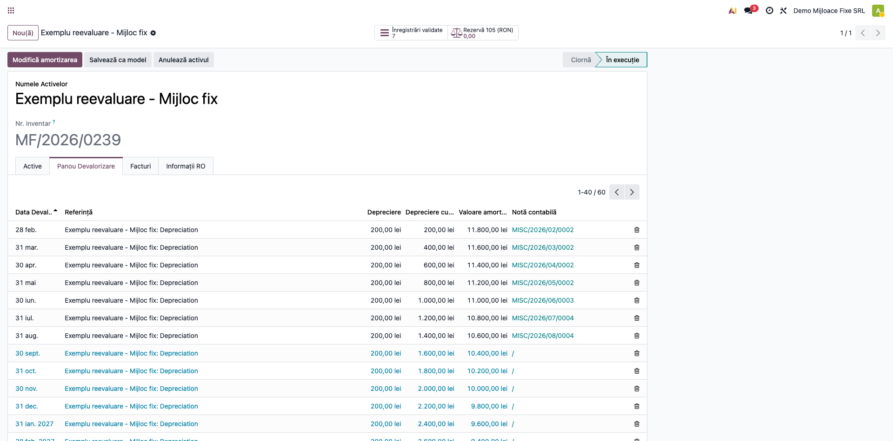

# Fișă Modul: Mijloace Fixe Complet

**Poziție plan:** B6.1
**Modul:** `l10n_ro_fixed_assets`
**FR:** FR-19
**Capitol manual:** Cap 7.1
**Utilizator principal:** Contabil mijloace fixe, Responsabil patrimoniu
**Prioritate:** 🟡 Medie

---

## 1. Scop business

Această fișă descrie utilizarea modulului `l10n_ro_fixed_assets` pentru scenariul **Mijloace Fixe Complet**.
Consultantul folosește documentul pentru reproducerea fluxului în baza demo și
pentru pregătirea capitolului Cap 7.1 din manualul utilizator.

## 2. Bază legală și context

OMFP 1802/2014; HG 2139/2004 (Catalogul privind clasificarea și duratele normale de funcționare a
mijloacelor fixe); Codul Fiscal art. 28 (amortizare fiscală)

## 3. Utilizatori și roluri

Contabil Active Fixe

Roluri recomandate pentru testare:
- Administrator funcțional: instalează modulul și verifică meniurile
- Utilizator operațional: rulează fluxul zilnic sau lunar
- Contabil/manager: validează rezultatele contabile și rapoartele

## 4. Conturi și date implicate

21x (active), 281x (amortizare cumulată), 6811 (cheltuieli amortizare), 105 (rezerve din
reevaluare), 1175 (rezultat reportat — transfer rezervă la casare), 655 (cheltuieli din
reevaluare ce depășesc soldul 105 — OMFP 1802/2014 pct. 111 alin. (3), NU 6813, cont de
ajustări pentru depreciere/provizioane, un mecanism diferit), 6583 (valoarea neamortizată la
casare / „Cont Pierderi"), 7583 (venit din vânzarea
activelor / „Cont Venituri"), 4111/461 (creanța clientului la vânzare, după contul configurat pe
partener), 4427 (TVA colectată la vânzare)

Date minime pentru demo:
- companie românească cu localizarea contabilă instalată
- perioadă contabilă deschisă
- jurnale și conturi configurate conform scenariului
- documente de test postate, acolo unde fluxul pornește din contabilitate, stocuri, HR sau vânzări

## 5. Configurare inițială

1. Instalați modulul `l10n_ro_fixed_assets` (necesită `account_asset`, `l10n_ro_saft`, `l10n_ro`).
2. Verificați jurnalul de tip **Active fixe** și conturile 21x/281x/6811/105/655/1175/6583 pe planul
   de conturi RO.
3. Pe fiecare cont de imobilizări folosit la achiziții, setați tab-ul **„Automatizare"** →
   **„Automatizează activul" = „Creează în stadiu de proiect"** — altfel facturile de furnizor nu
   generează automat mijlocul fix (Pasul 1).
4. **Setări → Contabilitate**, secțiunea Active: setați **6583** pe **„Cont Pierderi"**
   (`loss_account_id`) și **7583** pe **„Cont Venituri"** (`gain_account_id`) — fără ele, motorul
   nu are unde posta rezultatul net la casare/vânzare.
5. **Setări → Contabilitate**: activați **„Contabilitate Storno"** (`account_storno`) — controlează
   dacă liniile 214/281x din nota de cedare la vânzare apar cu semn negativ („notație storno", motor
   standard Enterprise) sau ca stornare clasică (sume pozitive pe partea opusă). Nu mai afectează
   contul de venit (7583) — de la fix-ul 19.0.1.3.3, nota de cedare nu îl mai atinge deloc.
6. Verificați secvența **„Număr Inventar Mijloc Fix RO"** (`l10n_ro.asset_inventory_number`, format
   `MF/AAAA/NNNN`).
7. Pe activele de test, setați **Metodă = Linie dreaptă** și **Perioadă = 1 lună** — fix-ul „amortizare
   din luna următoare PIF" (secțiunea 12) se aplică doar când perioada este lunară.
8. Completați pe fiecare activ de test câmpurile **Nr. Inventar** și **Data PIF** (obligatorii pentru
   SAF-T D406).

## 6. Flux de utilizare

### Pasul 1 — Achiziția mijlocului fix

Un mijloc fix **nu se creează manual** din lista de active — apare la finalul fluxului standard de
achiziție: **Comandă de achiziție → Recepție → Factură furnizor**. Activul se generează **automat**
la postarea facturii, dacă linia facturii e pe un cont configurat corespunzător. Configurarea se
face o singură dată, pe cont, în **Contabilitate → Configurare → Conturi**, tab-ul
**„Automatizare"**: câmpul **„Automatizează activul"** are 3 opțiuni — „Nu", **„Creează în stadiu
de proiect"** (recomandat: activul apare în ciornă, de completat manual) sau „Creează și
validează" (generează direct activul confirmat, cu riscul de a valida date incomplete).



**Comanda de achiziție** se confirmă normal, ca pentru orice altă achiziție — nu are nimic specific
mijloacelor fixe la acest pas.



Pentru un produs stocabil, comanda generează o **recepție** (mișcare de stoc), care se validează
înainte de facturare — practica standard de recepționare a bunului fizic înainte de plată.



La generarea și postarea **facturii de furnizor** (din comandă, cu butonul „Facturi furnizor" sau
acțiunea „Creează factură"), nota contabilă generată e cea obișnuită pentru o achiziție de mijloc
fix — cu **404 „Furnizori de imobilizări"** ca și contrapartidă, **nu 401 „Furnizori"**: 401 e
rezervat aprovizionărilor din exploatare (stocuri/servicii), în timp ce 404 e contul dedicat
furnizorilor de imobilizări corporale/necorporale (pct. 401/404, OMFP 1802/2014). Pentru asta,
furnizorul de mijloace fixe trebuie să aibă setat pe fișa lui de partener contul de plată
**„Furnizori de imobilizări"** (`property_account_payable_id`) — altfel Odoo folosește implicit
401, contul de plată standard al companiei.



```
Dr 213200  9.000,00 lei   (activul, pe contul configurat cu „Automatizează activul")
Dr 442600  1.890,00 lei   (TVA deductibilă 21%)
Cr 404100 10.890,00 lei   (furnizor de imobilizări — NU 401)
```

Chiar **postarea acestei note** e evenimentul care declanșează generarea automată a mijlocului fix
**în ciornă**, cu numele produsului, valoarea și data din factură, și legătura către linia de
factură originală (vizibilă în tab-ul „Facturi" al activului). Conturile de amortizare/cheltuială
**nu** se completează automat — rămân goale (marcate cu roșu, câmpuri obligatorii) până la validare
manuală.



De aici, consultantul completează: conturile de amortizare/cheltuială, metoda și durata, apoi
câmpurile specifice RO (Pasul 4) și confirmă activul (butonul „Confirmă", vizibil doar în ciornă).

> **Notă:** pentru bunuri necesitate strict ca servicii sau consumabile fără recepție (fără produs
> stocabil), activul se generează identic la postarea facturii — doar pasul de recepție lipsește.

### Pasul 2 — Lista mijloacelor fixe

Accesați **Contabilitate → Active și pasive → Active**. Lista afișează mijloacele fixe cu coloanele RO:
valoare inițială, metodă, contul de activ (213), starea și **numărul de inventar** (`MF/AAAA/NNNN`).
Conturile de amortizare (281) și cheltuială (681) sunt disponibile ca **coloane opționale**
(selectorul din dreapta antetului listei).


### Pasul 3 — Formularul activului (tab „Active")

Deschideți un mijloc fix. Tab-ul **„Active"** arată valorile (valoare inițială, **metodă „Linie
dreaptă"**, durată), conturile contabile și jurnalul; în antet, numărul de inventar generat automat
și smart button-ul **„Rezervă 105"** (rezerva din reevaluare). Butonul **„Confirmă"** validează
activul și generează planul de amortizare.


### Pasul 4 — Datele specifice RO (tab „Informații RO")

Tab-ul **„Informații RO"** grupează câmpurile cerute de localizare: **Data PIF** (punere în
funcțiune), **DNU** (durata normală din Catalogul HG 2139/2004), **Cod de clasificare**,
**Responsabil custodie**, **Locație**, metoda de **amortizare fiscală** (Cod Fiscal art. 28) și
lista **Reevaluări** (cu rezerva contului 105 vizibilă și în smart button-ul din antet). Secțiunea
**Casare** rămâne goală până la cedarea efectivă a activului — câmpurile ei devin vizibile abia în
starea „Cedat".


### Pasul 5 — Registrul Imobilizărilor

Accesați **Contabilitate → Raportare → Statement Reports → Fixed Assets Register (RO)**. Raportul
este nativ `account.report` (Enterprise), nu mai e un wizard separat: filtrul **„As of Date"** din
antet stabilește data de referință (implicit, ziua curentă), iar situația se recalculează automat
pentru acea dată — inclusiv amortizarea cumulată, luată doar din notele postate până atunci.

Activele sunt grupate pe **contul de imobilizări**, cu subtotal pe cont și **total general** în
capul tabelului. Fiecare linie e un activ confirmat (activele în ciornă nu apar în registru); click
pe o linie deschide direct fișa activului respectiv (drill-down). Butoanele **PDF** / **XLSX** din
colțul stânga-sus exportă exact ce se vede pe ecran.



### Note de monografie și raportare

- **Amortizare lunară:** `Dr 6811 (cheltuieli amortizare) = Cr 281x (amortizare cumulată)`.
- **Reevaluare (creștere):** `Dr 21x (activ) = Cr 105 (rezerve din reevaluare)`.
- **Depreciere peste soldul 105:** `Dr 655 (cheltuieli din reevaluare) = Cr 21x (activ)`, pentru
  partea care depășește rezerva disponibilă din 105 (OMFP 1802/2014 pct. 111 alin. (3) — **nu**
  6813, cont de ajustări pentru depreciere/provizioane, un mecanism contabil diferit).
- **Luna reevaluării nu se împarte pe zile:** amortizarea din luna în care are loc reevaluarea
  rămâne neschimbată, la vechea valoare lunară — valoarea nouă (recalculată pe durata rămasă) se
  aplică începând cu luna următoare. Amortizarea RO e strict lunară (OMFP 1802/2014 pct. 238);
  motorul standard Enterprise ar calcula, altfel, o notă suplimentară pro-rata pe zilele rămase
  din luna reevaluării.
- **Casare (fără vânzare — activ complet sau parțial amortizat, fără încasare):** scoaterea din
  evidență `Dr 281x (amortizare cumulată) + Dr 6583 (valoare neamortizată) = Cr 21x (activ, valoare
  brută)`, cu **Decizie de casare** (raport PDF) ca document justificativ. Aici toată valoarea
  neamortizată ajunge direct în 6583 (`loss_account_id`).
- **Vânzare mijloc fix:** factura de vânzare generează separat `Dr 461/4111 (creanța clientului,
  după contul configurat pe partener) = Cr 7583 (venit din vânzare active) + Cr 4427 (TVA
  colectată)`. Nota de cedare a activului este **independentă** de preț și de factură — nu conține
  nicio linie pe 7583 (fix 19.0.1.3.3): `Dr 281x (amortizare cumulată) + Dr 6583 (valoare
  neamortizată integrală, `loss_account_id`) = Cr 21x (activ, valoare brută)`, identic cu monografia
  de la casare. Câștigul sau pierderea din vânzare nu se înregistrează explicit nicăieri — reiese
  din P&L prin comparația 7583 (din factură) vs. 6583 (din cedare), conform principiului
  necompensării (OMFP 1802/2014 pct. 56 alin. (1), pct. 243 alin. (1)).
- **La casare/cedare, dacă activul are rezervă de reevaluare (105) nesoldată:** transfer automat
  `Dr 105 (rezerve din reevaluare) = Cr 1175 (rezultat reportat)` (OMFP 1802/2014 pct. 103).
- **Amortizare fiscală vs. contabilă** (Cod Fiscal art. 28): se urmărește separat de cea contabilă,
  pentru calculul impozitului pe profit. Baza de calcul este **valoarea fiscală de intrare**, nu
  valoarea reevaluată — un surplus din reevaluare nu se amortizează fiscal.

#### Exemplu numeric verificat (tichetul 9452)

Reproduce exact scenariul din tichet: mijloc fix de **6.000 lei** (cont **214** „Mobilier, aparatură
birotică"), amortizare liniară pe **60 de luni** (100 lei/lună), PIF **1 iunie 2026**, vândut la
**15 septembrie 2026** cu **5.000 lei + TVA 21% (1.050 lei)**. Notele de mai jos sunt cele generate
**efectiv** de motor (nu un calcul manual) — capturate din baza de test.

**Planul de amortizare al activului** (tab „Panou Devalorizare" — traducerea Enterprise pentru
„Depreciere", vezi nota din secțiunea 11): două luni amortizate (iulie + august, 100 lei fiecare —
**nu** și septembrie, luna vânzării), apoi nota de cedare la vânzare.



**Factura de vânzare**, cu liniile Dr/Cr reale:



```
Dr 4111  6.050,00 lei   (creanța clientului)
Cr 7583  5.000,00 lei   (venit din vânzarea activului)
Cr 4427  1.050,00 lei   (TVA colectată 21%)
```

**Nota de cedare a activului** (separată de factură), cu liniile Dr/Cr reale pe conturi:



```
Dr 214  -6.000,00 lei   (scoaterea activului din evidență — notație storno)
Cr 2814    -200,00 lei  (scoaterea amortizării cumulate — notație storno)
Dr 6583   5.800,00 lei  (valoarea neamortizată integrală — fix 19.0.1.3.3, secțiunea 12)
```

**De reținut pentru consultant:** nota de cedare **nu** atinge deloc contul de venit din factură
(7583) — venitul din vânzare rămâne exclusiv în factură (`Cr 7583 5.000`), iar nota de cedare
înregistrează separat **întreaga valoare neamortizată** (`Dr 6583 = 5.800`, adică 6.000 valoare
brută − 200 amortizare cumulată), indiferent de prețul de vânzare. Rezultatul (pierdere de 800 lei
= 5.000 venit − 5.800 cheltuială) reiese din P&L prin comparația celor două conturi, fără nicio
notă care să le compenseze explicit — conform principiului necompensării (OMFP 1802/2014 pct. 56
alin. (1)) și evidențierii distincte a venitului/cheltuielii la cedare (pct. 243 alin. (1)). Până
la 19.0.1.3.2, modulul (prin motorul nativ `account_asset`) relua linia de venit din factură ca
stornare (`Dr 7583 5.000`) și înregistra doar diferența netă (`Dr 6583 800`) — rezultatul financiar
total ieșea corect, dar rulajele conturilor 7583/6583 erau greșite (subevaluate cu 5.000 lei
fiecare), afectând contul de profit și pierdere la nivel de rând. Corectat, confirmat de o
consultare `pacioli` explicită.

#### Exemplu numeric verificat — reevaluare cu diminuare de valoare

Confirmă vizual fix-ul din 19.0.1.3.1 (mai jos, secțiunea 12): un activ de **12.000 lei**
(60 luni, 200 lei/lună), cu **7 luni deja amortizate** (feb-aug), este diminuat cu **2.000 lei**
printr-o reevaluare. Planul de amortizare, **înainte** și **după**:




Lunile deja postate (feb-aug, 200 lei fiecare) rămân neschimbate — corect, nu se rescrie
istoricul. **Luna reevaluării (septembrie) rămâne neschimbată, la vechea valoare (200 lei)** —
fără nicio notă suplimentară pro-rata pe zile (fix 19.0.1.3.2, secțiunea 12); din **octombrie**
amortizarea viitoare scade la noua valoare recalculată pe durata rămasă (valoarea reziduală
rămasă, împărțită la lunile rămase) — nu mai rămâne la vechea sumă de 200 lei/lună, cum se
întâmpla înainte de primul fix (19.0.1.3.1), și nu se mai împarte artificial pe zile în luna
reevaluării, cum se întâmpla între cele două fix-uri (19.0.1.3.1 → 19.0.1.3.2).

## 7. Legături cu alte module / declarații

| Modul / proces | Rol în flux |
|---|---|
| `account_asset` | motorul de active și amortizare |
| `l10n_ro_inventory_register` | registrul anual include imobilizările |
| `l10n_ro_financial_statements` | raportare bilanț și anexe |
| SAF-T | câmpuri necesare pentru active |

Ce este automat: completarea câmpurilor RO și urmărirea amortizării.
Ce rămâne manual: validarea numărului de inventar, codului nomenclator și DNU.

## 8. Verificări pentru consultant

- [ ] Modulul se instalează fără erori pe baza demo.
- [ ] O factură de furnizor pe un cont cu „Automatizează activul" generează corect mijlocul fix
      în ciornă (Pasul 1).
- [ ] Meniurile și acțiunile sunt vizibile pentru rolul de utilizator potrivit.
- [ ] Fluxul poate fi reprodus de la cap la coadă cu date fictive românești.
- [ ] Rezultatul contabil sau operațional corespunde descrierii din plan.
- [ ] Mesajele de eroare sunt clare pentru un utilizator non-tehnic.
- [ ] Exporturile sau rapoartele se descarcă și conțin datele testate.

## 9. Mesaje de eroare frecvente

| Mesaj / simptom | Cauză probabilă | Remediere |
|-----------------|-----------------|-----------|
| „Commissioning date (PIF) cannot be before the acquisition date." | Data PIF a fost setată înaintea datei de achiziție a activului. | Corectați data PIF — trebuie să fie egală sau ulterioară achiziției. |
| „The journal entry … is linked to asset … but has no depreciation beginning date. The 'Asset' field is reserved for entries generated automatically…" *(mesaj momentan netradus în ro.po)* | O notă contabilă (ex. de reevaluare) a fost legată manual la câmpul tehnic „Asset", fără ca acesta să provină din motorul de amortizare. | Nu legați manual câmpul „Asset" pe notele contabile — el este completat automat de planul de amortizare/reevaluare. |
| „Account 655 not found. Please fill in the 'Account 655' field on the revaluation." | Deprecierea depășește soldul disponibil în 105, iar contul 655 nu e configurat pe planul de conturi sau pe reevaluare. | Completați câmpul „Revaluation Expense Account" pe reevaluare sau adăugați contul 655 pe planul de conturi RO. |
| „The revaluation has already been confirmed." / „…has a posted accounting entry. Please reset the journal entry first." | Se încearcă re-confirmarea unei reevaluări deja postate. | Resetați mai întâi nota contabilă asociată (draft), apoi reluați reevaluarea. |
| „Missing inventory number on fixed assets" / „Missing commissioning date on fixed assets" (avertisment SAF-T) | Activul nu are completat Nr. Inventar sau Data PIF, câmpuri obligatorii pentru declarația SAF-T D406. | Completați câmpurile lipsă direct din acțiunea „Fill in…" oferită de avertisment. |

## 10. Capturi de ecran

Capturile din `readme/screenshots/` se obțin din `tests/test_screenshots.py` (mixinul `ScreenshotCase`
din `l10n_ro_doc_screenshots`, HttpCase + Playwright), pe companie RO, în lei, cu plan de conturi RO.

1. `00a_cont_automatizare.png` — contul de imobilizări, tab „Automatizare": „Creează în stadiu
   de proiect".
2. `00b_comanda_achizitie.png` — comanda de achiziție confirmată, cu smart button-urile
   „Recepție" și „Facturi furnizor".
3. `00c_receptie.png` — recepția bunului, validată (stare „Efectuat").
4. `00d_factura_nota_contabila.png` — nota contabilă a facturii de furnizor, cu liniile Dr/Cr
   reale (213200/442600/404100 — furnizor de imobilizări, nu 401) — postarea ei declanșează
   generarea activului.
5. `00e_activ_generat_automat.png` — mijlocul fix generat automat la postarea facturii de
   furnizor, în stare „Ciornă", cu conturile de amortizare/cheltuială de completat.
6. `01_lista_active.png` — lista mijloacelor fixe cu coloanele RO (nr. inventar, conturi, stare).
7. `02_formular_active.png` — formularul, tab „Active": valori, metodă „Linie dreaptă", durată,
   conturi (213/281/681), jurnal, nr. inventar și smart button „Rezervă 105".
8. `03_informatii_ro.png` — tab „Informații RO": Data PIF, locație, DNU (HG 2139/2004), responsabil
   custodie, amortizare fiscală (Cod Fiscal art. 28), casare, reevaluări (rezerva 105).
9. `04_registrul_imobilizarilor.png` — Registrul Imobilizărilor (`account.report`): filtrul
   „As of Date", grupare pe cont cu subtotaluri, total general, 3 active confirmate.
10. `05_exemplu_plan_amortizare.png` — exemplul numeric (tichet 9452): planul de amortizare al
    activului-exemplu (tab „Panou Devalorizare"), cu cele 2 luni amortizate și nota de cedare.
11. `06_exemplu_factura_vanzare.png` — factura de vânzare a activului-exemplu, cu liniile Dr/Cr
    (4111/7583/4427, inclusiv TVA 21%).
12. `07_exemplu_nota_cedare.png` — nota de cedare a activului, deschisă separat, cu liniile Dr/Cr
    detaliate pe conturi (214/2814/7583/6583).
13. `08_reevaluare_inainte.png` — planul de amortizare înainte de o reevaluare cu diminuare de
    valoare: toate lunile viitoare la suma inițială (200 lei).
14. `09_reevaluare_dupa.png` — același plan, după reevaluare: lunile deja postate neschimbate,
    luna reevaluării proporțională, lunile viitoare recalculate pe noua valoare (~164,12 lei).

Regenerare:
```
./odoo/odoo-bin -c odoo.conf -d <db> -i l10n_ro_fixed_assets,l10n_ro_doc_screenshots \
    --test-tags=fise_screenshots --stop-after-init --http-port=8987 --gevent-port=8988
```

## 11. Observații pentru manual

În manualul final, păstrați explicația orientată pe activitatea utilizatorului:
ce problemă rezolvă modulul, când se rulează, ce date trebuie pregătite și cum se verifică rezultatul.

> **Notă terminologică (nu ține de acest modul):** traducerea RO livrată de Odoo Enterprise pentru
> `account_asset` folosește „Devalorizare" în loc de „Amortizare" (ex. tabul „Panou Devalorizare",
> grupul „Metoda de Devalorizare"). Este o traducere din pachetul Enterprise, nu din
> `l10n_ro_fixed_assets` — în manual, înlocuiți mental „devalorizare" cu „amortizare" la explicarea
> capturilor.

## 12. Corecții relevante pentru consultant

Fixuri livrate pe acest modul, relevante pentru discuția cu clientul (ce s-a schimbat, de ce, de la ce versiune):

| Versiune | Ce era greșit (simptom pentru client) | Ce s-a corectat |
|---|---|---|
| **19.0.1.1.0** (versiune inițială) | Pe planul de conturi RO, contul de amortizare cumulată 281x este clasificat drept cont de cheltuială — fără o corecție explicită, planul de amortizare nu se genera deloc (linia Dr 6811 și cea Cr 281x se anulau reciproc). | Latura de amortizare cumulată este exclusă corect din calculul liniei de cheltuială, astfel încât planul de amortizare se generează cu valorile corecte (`Dr 6811 = Cr 281x`). |
| **19.0.1.2.0** (2026-09-14) | Amortizarea contabilă/fiscală începea chiar din luna punerii în funcțiune (PIF), proporțional cu zilele rămase din acea lună — nu din luna următoare, cum cere legea. | `prorata_date` pornește acum din prima zi a lunii **următoare** PIF (art. 28 alin. (12) lit. a) Legea 227/2015; OMFP 1802/2014 pct. 238). Se aplică companiilor RO cu amortizare lunară. |
| **19.0.1.2.0** (2026-09-14) | La vânzarea/casarea unui mijloc fix parțial amortizat în cursul lunii, programul amortiza proporțional cu zilele scurse până la data vânzării — deși amortizarea e strict lunară, iar luna vânzării nu ar trebui amortizată deloc. | Ultima lună amortizată la casare este acum luna anterioară vânzării, indiferent de ziua exactă din lună. Monografia de casare/vânzare (secțiunea 6) era deja corectă structural — discrepanța era doar efectul sumei greșite de amortizare. |
| **19.0.1.2.1** (2026-09-14) | Amortizarea fiscală afișată pe activ (câmpurile „Amortizare fiscală cumulată" / „an curent") putea arăta cumulatul **mai mic** decât amortizarea anului curent pentru un activ pus în funcțiune în anul curent — incoerență imposibilă contabil, cauzată de o formulă care numără luna PIF diferit în cele două cifre. | Ambele cifre folosesc acum aceeași convenție „luna următoare PIF", simetric cu fix-ul din 19.0.1.2.0; pentru primul an de amortizare, cumulatul și amortizarea anului curent coincid. |
| **19.0.1.2.2** (2026-09-14) | Amortizarea fiscală se calcula pe **valoarea curentă** a activului (`original_value`), care crește la o reevaluare — un surplus din reevaluare (nedeductibil fiscal, Cod Fiscal art. 28) ajungea astfel inclus greșit în baza de amortizare fiscală, umflând cifra afișată. | Baza de calcul este acum câmpul nou **„Fiscal Original Value"**, înghețat la valoarea de intrare din momentul creării activului — neafectat de reevaluări ulterioare. |
| **19.0.1.3.1** (2026-09-19) | O reevaluare (creștere sau diminuare de valoare) actualiza valoarea activului, dar **nu** regenera amortizarea viitoare — liniile de amortizare încă neconfirmate rămâneau la vechea sumă lunară, ca și cum reevaluarea nu ar fi avut loc. Raportat pe o instanță internă: după o diminuare, luna următoare continua să se amortizeze la valoarea dinaintea reevaluării. | Reevaluarea regenerează acum corect planul de amortizare de la data reevaluării încolo, pe baza noii valori — simetric la creștere și la diminuare. |
| **19.0.1.2.0** (2026-09-14) | Legarea manuală a unei note contabile (ex. o notă de reevaluare) la câmpul tehnic „Asset" al unei note contabile, fără completarea datei de început a amortizării, bloca ulterior orice calcul de valoare reziduală a activului, inclusiv din wizard-ul „Modifică". Incident reprodus pe o instanță client. | Legarea manuală incompletă este acum respinsă explicit la salvare, cu un mesaj clar (deocamdată doar în engleză) — câmpul „Asset" rămâne rezervat notelor generate automat de motorul de amortizare. |
| **19.0.1.1.1** (2026-07-17) | Butonul/acțiunea „Reevaluează Mijlocul Fix" din lista de active (meniu contextual) arunca o eroare la orice utilizare, blocând reevaluarea din acel punct de intrare. | Acțiunea apelează corect wizard-ul de reevaluare; funcționează identic cu butonul „Reevaluare" din formularul activului. |
| **19.0.1.3.0** (2026-09-15) | Registrul Imobilizărilor se genera printr-un wizard separat (dată + companie), care producea un PDF static; exportul PDF putea eșua cu o eroare de server (`IndexError`, template incomplet — corectat separat, chiar înainte de această migrare). | Raportul a fost migrat la framework-ul nativ `account.report`: se accesează direct din **Contabilitate → Raportare → Statement Reports → Fixed Assets Register (RO)**, cu filtru „As of Date", grupare pe cont cu subtotaluri, drill-down pe fiecare activ și export PDF/XLSX din bara de instrumente a raportului — fără wizard intermediar. |
| **19.0.1.3.2** (2026-09-21) | O reevaluare la mijlocul lunii genera o notă suplimentară pro-rata pe zilele rămase din acea lună, pe lângă amortizarea deja calculată la vechea valoare — dublând efectiv amortizarea lunii reevaluării, în loc să fie o singură notă lunară. În plus, deprecierea care depășea soldul rezervei 105 se înregistra pe contul **6813** (ajustări pentru depreciere/provizioane), în loc de **655** „Cheltuieli din reevaluarea imobilizărilor" (OMFP 1802/2014 pct. 111 alin. (3)). Semnalat de client cu exemple numerice concrete (tichet 9452). | Recalculul planului de amortizare la reevaluare pornește acum din prima zi a lunii **următoare** reevaluării — luna reevaluării rămâne neschimbată, la vechea valoare lunară, consecvent cu principiul amortizării strict lunare (OMFP 1802/2014 pct. 238). Câmpul de cont pentru depreciere a fost înlocuit cu **„Revaluation Expense Account"** (implicit 655, nu mai 6813); etichetele câmpurilor de cont (105/655) nu mai includ codul de cont în numele tehnic al câmpului. |
| **19.0.1.3.3** (2026-09-21) | Nota de cedare la **vânzarea** unui mijloc fix relua linia de venit din factură ca stornare (`Dr 7583`) și înregistra doar diferența netă (preț vânzare − valoare neamortizată) pe contul de pierderi (6583) — o compensare venituri/cheltuieli interzisă de OMFP 1802/2014 pct. 56 alin. (1) și contrară pct. 243 alin. (1) (evidențiere distinctă a veniturilor și cheltuielilor la cedare). Rezultatul financiar total ieșea corect, dar rulajele conturilor 7583 și 6583 erau subevaluate cu exact valoarea vânzării, deformând contul de profit și pierdere la nivel de rând. Confirmat printr-o consultare explicită a agentului `pacioli`. | Nota de cedare la vânzare nu mai atinge deloc contul de venit din factură — înregistrează independent de preț **întreaga valoare neamortizată** pe 6583 (`loss_account_id`), identic cu monografia de la casare fără vânzare. Rezultatul (câștig/pierdere) reiese din P&L prin comparația 7583 (din factură, neschimbat) vs. 6583 (din cedare), fără nicio compensare explicită. |

> Notă: fix-urile de amortizare (din luna următoare PIF, fără prorata la vânzare) și blocarea legării
> manuale sunt acoperite direct de teste automate (`tests/test_fixed_assets_ro.py`), reproduse cu date
> fictive RO. Fix-ul acțiunii „Reevaluează" este verificat doar indirect (testul acoperă metoda
> apelată, nu punctul exact de eroare din acțiunea de server). Istoricul complet, în engleză și cu
> detalii tehnice, e în `readme/HISTORY.md`.
