# Fișă Modul: Mijloace Fixe Complet

**Poziție plan:** B6.1
**Modul:** `l10n_ro_fixed_assets`
**FR:** FR-19
**Capitol manual:** Cap 7.1
**Utilizator principal:** Contabil mijloace fixe, Responsabil patrimoniu
**Prioritate:** 🟡 Medie

---

## 1. Scop business

Această fișă descrie utilizarea modulului `l10n_ro_fixed_assets` pentru scenariul **Mijloace Fixe Complet**.
Consultantul folosește documentul pentru reproducerea fluxului în baza demo și
pentru pregătirea capitolului Cap 7.1 din manualul utilizator.

## 2. Bază legală și context

OMFP 1802/2014; HG 2139/2004 (Catalogul privind clasificarea și duratele normale de funcționare a
mijloacelor fixe); Codul Fiscal art. 28 (amortizare fiscală)

## 3. Utilizatori și roluri

Contabil Active Fixe

Roluri recomandate pentru testare:
- Administrator funcțional: instalează modulul și verifică meniurile
- Utilizator operațional: rulează fluxul zilnic sau lunar
- Contabil/manager: validează rezultatele contabile și rapoartele

## 4. Conturi și date implicate

21x (active), 281x (amortizare cumulată), 6811 (cheltuieli amortizare), 105 (rezervă din
reevaluare), 755 (venit din reevaluare, compensează o cheltuială 655 anterioară pe același activ
— OMFP 1802/2014 pct. 111 alin. (1) liniuța a doua și alin. (3)), 1175 (rezultat reportat — transfer rezervă
la casare, pct. 109), 655 (cheltuială din reevaluare ce depășește soldul 105 — pct. 111 alin. (2)
și (3), NU 6813, cont de ajustări pentru depreciere/provizioane, un mecanism diferit), 6583
(valoarea neamortizată la casare/vânzare — indiferent de preț, „Cont Pierderi"/`loss_account_id`),
7583 (venit din vânzarea activelor, din factură — neatins de nota de cedare), 461 (creanța
clientului la vânzare — „Debitori diverși", funcțiunea contului, Cap. 16; nu 411/4111, rezervat
vânzărilor din exploatare), 404 (furnizori de imobilizări, la achiziție — nu 401), 4427 (TVA)

Date minime pentru demo:
- companie românească cu localizarea contabilă instalată
- perioadă contabilă deschisă
- jurnale și conturi configurate conform scenariului
- documente de test postate, acolo unde fluxul pornește din contabilitate, stocuri, HR sau vânzări

## 5. Configurare inițială

1. Instalați modulul `l10n_ro_fixed_assets` (necesită `account_asset`, `account_reports`,
   `l10n_ro_saft`, `l10n_ro`; `account_reports` e obligatoriu pentru Registrul imobilizărilor,
   migrat pe `account.report` în 19.0.1.3.0).
2. Verificați jurnalul folosit pentru active (de tip **Diverse**/*Miscellaneous* — `account_asset`
   impune `type = general`; nu există un tip de jurnal „Active fixe") și conturile 21x/281x/6811/105/655/755/1175/6583 pe
   planul de conturi RO.
3. Pe fiecare cont de imobilizări folosit la achiziții, setați tab-ul **„Automatizare"** →
   **„Automatizează activul" = „Creează în stadiu de proiect"** — altfel facturile de furnizor nu
   generează automat mijlocul fix (Pasul 1).
4. **Setări → Contabilitate**, secțiunea Active: setați **6583** pe **„Cont Pierderi"**
   (`loss_account_id`) — obligatoriu, e singurul cont folosit de nota de cedare la casare/vânzare
   (fix 19.0.1.3.3, secțiunea 12: nota nu mai atinge contul de venit din factură). **„Cont
   Venituri"** (`gain_account_id`) rămâne opțional pe acest flux — nefolosit de nota de cedare;
   relevant doar dacă alte module îl folosesc separat.
5. **Setări → Contabilitate**: activați **„Contabilitate Storno"** (`account_storno`) — controlează
   dacă liniile 214/281x din nota de cedare la vânzare apar cu semn negativ („notație storno", motor
   standard Enterprise) sau ca stornare clasică (sume pozitive pe partea opusă). Nu mai afectează
   contul de venit (7583) — de la fix-ul 19.0.1.3.3, nota de cedare nu îl mai atinge deloc.
6. Verificați secvența **„Număr Inventar Mijloc Fix RO"** (`l10n_ro.asset_inventory_number`, format
   `MF/AAAA/NNNN`).
7. Pe activele de test, setați **Metodă = Linie dreaptă** și **Perioadă = 1 lună** — fix-ul „amortizare
   din luna următoare PIF" (secțiunea 12) se aplică doar când perioada este lunară.
8. Completați pe fiecare activ de test câmpurile **Nr. Inventar** și **Data PIF** (obligatorii pentru
   SAF-T D406).

## 6. Flux de utilizare

### Pasul 1 — Achiziția mijlocului fix

Un mijloc fix **nu se creează manual** din lista de active — apare la finalul fluxului standard de
achiziție: **Comandă de achiziție → Recepție → Factură furnizor**. Activul se generează **automat**
la postarea facturii, dacă linia facturii e pe un cont configurat corespunzător. Configurarea se
face o singură dată, pe cont, în **Contabilitate → Configurare → Conturi**, tab-ul
**„Automatizare"**: câmpul **„Automatizează activul"** are 3 opțiuni — „Nu", **„Creează în stadiu
de proiect"** (recomandat: activul apare în ciornă, de completat manual) sau „Creează și
validează" (generează direct activul confirmat, cu riscul de a valida date incomplete).

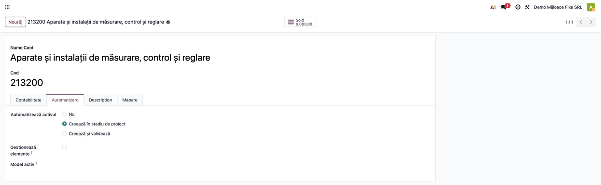

**Comanda de achiziție** se confirmă normal, ca pentru orice altă achiziție — nu are nimic specific
mijloacelor fixe la acest pas.

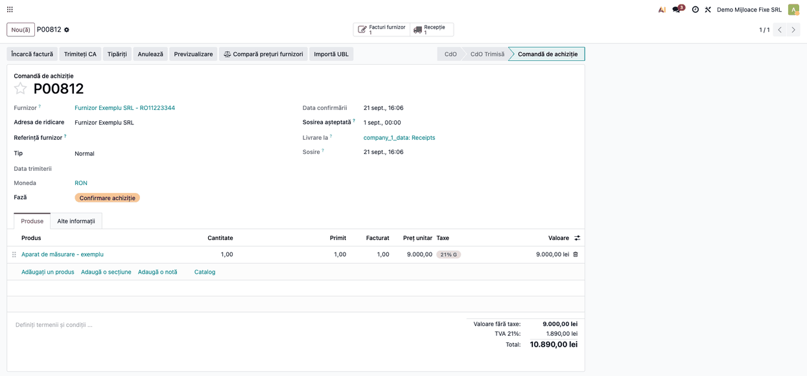

Pentru un produs stocabil, comanda generează o **recepție** (mișcare de stoc), care se validează
înainte de facturare — practica standard de recepționare a bunului fizic înainte de plată.

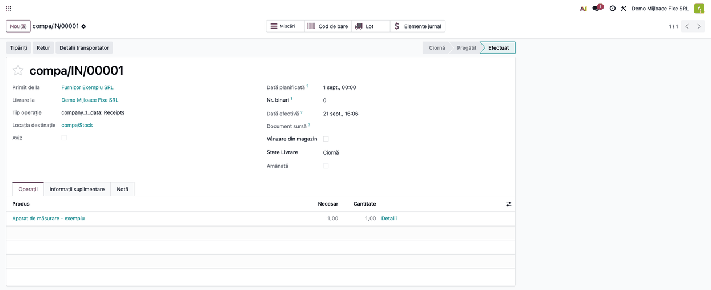

La generarea și postarea **facturii de furnizor** (din comandă, cu butonul „Facturi furnizor" sau
acțiunea „Creează factură"), nota contabilă generată e cea obișnuită pentru o achiziție de mijloc
fix — cu **404 „Furnizori de imobilizări"** ca și contrapartidă, **nu 401 „Furnizori"**: 401 e
rezervat aprovizionărilor din exploatare (stocuri/servicii), în timp ce 404 e contul dedicat
furnizorilor de imobilizări corporale/necorporale (funcțiunea contului 404, OMFP 1802/2014,
Cap. 16). Pentru asta,
furnizorul de mijloace fixe trebuie să aibă setat pe fișa lui de partener contul de plată
**„Furnizori de imobilizări"** (`property_account_payable_id`) — altfel Odoo folosește implicit
401, contul de plată standard al companiei.

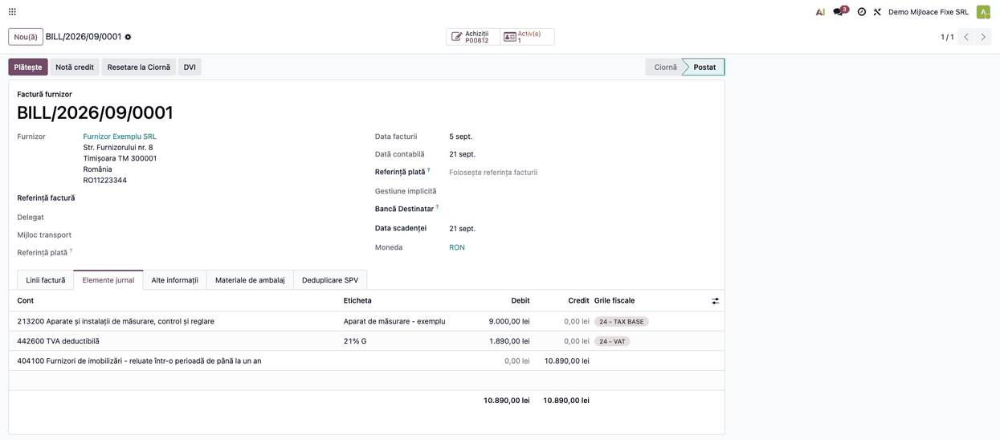

```
Dr 213200  9.000,00 lei   (activul, pe contul configurat cu „Automatizează activul")
Dr 442600  1.890,00 lei   (TVA deductibilă 21%)
Cr 404100 10.890,00 lei   (furnizor de imobilizări — NU 401)
```

Chiar **postarea acestei note** e evenimentul care declanșează generarea automată a mijlocului fix
**în ciornă**, cu numele produsului, valoarea și data din factură, și legătura către linia de
factură originală (vizibilă în tab-ul „Facturi" al activului). Conturile de amortizare/cheltuială
**nu** se completează automat — rămân goale (marcate cu roșu, câmpuri obligatorii) până la validare
manuală.

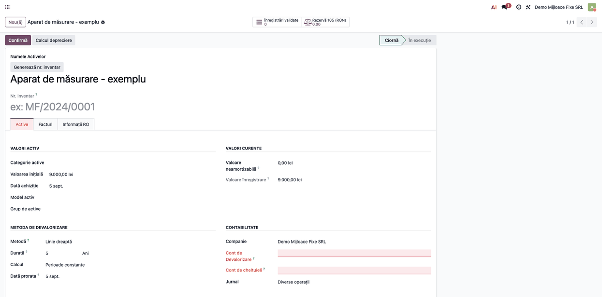

De aici, consultantul completează: conturile de amortizare/cheltuială, metoda și durata, apoi
câmpurile specifice RO (Pasul 4) și confirmă activul (butonul „Confirmă", vizibil doar în ciornă).

> **Notă:** pentru bunuri necesitate strict ca servicii sau consumabile fără recepție (fără produs
> stocabil), activul se generează identic la postarea facturii — doar pasul de recepție lipsește.

### Pasul 2 — Lista mijloacelor fixe

Accesați **Contabilitate → Active și pasive → Active**. Lista afișează mijloacele fixe cu coloanele RO:
valoare inițială, metodă, contul de activ (213), starea și **numărul de inventar** (`MF/AAAA/NNNN`).
Conturile de amortizare (281) și cheltuială (681) sunt disponibile ca **coloane opționale**
(selectorul din dreapta antetului listei).

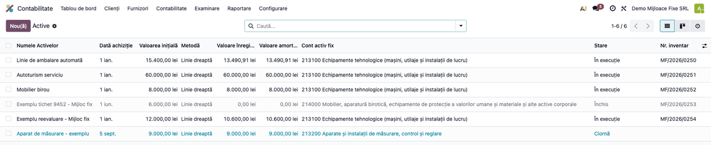

### Pasul 3 — Formularul activului (tab „Active")

Deschideți un mijloc fix. Tab-ul **„Active"** arată valorile (valoare inițială, **metodă „Linie
dreaptă"**, durată), conturile contabile și jurnalul; în antet, numărul de inventar generat automat
și smart button-ul **„Rezervă 105"** (rezerva din reevaluare). Butonul **„Confirmă"** validează
activul și generează planul de amortizare.

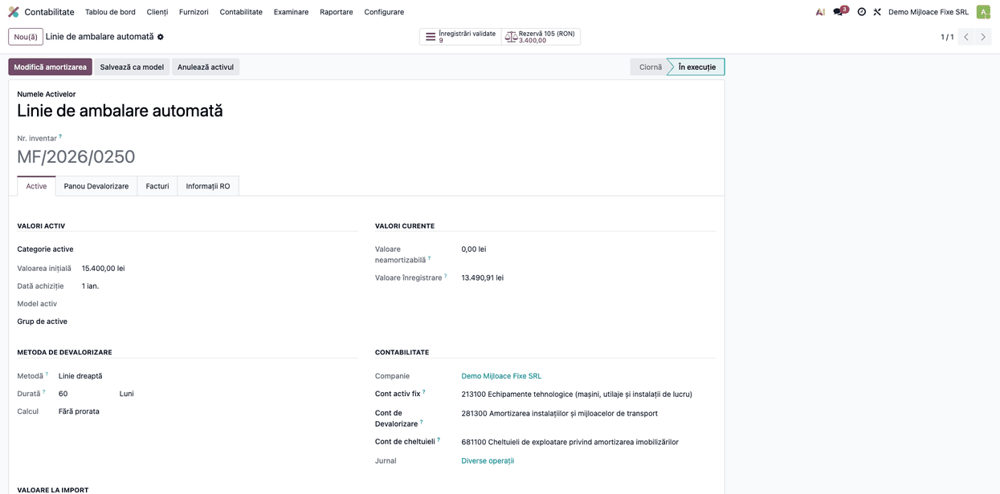

### Pasul 4 — Datele specifice RO (tab „Informații RO")

Tab-ul **„Informații RO"** grupează câmpurile cerute de localizare: **Data PIF** (punere în
funcțiune), **DNU** (durata normală din Catalogul HG 2139/2004), **Cod de clasificare**,
**Responsabil custodie**, **Locație**, metoda de **amortizare fiscală** (Cod Fiscal art. 28) și
lista **Reevaluări** (cu rezerva contului 105 vizibilă și în smart button-ul din antet). Secțiunea
**Casare** rămâne goală până la cedarea efectivă a activului — câmpurile ei devin vizibile abia în
starea „Cedat".

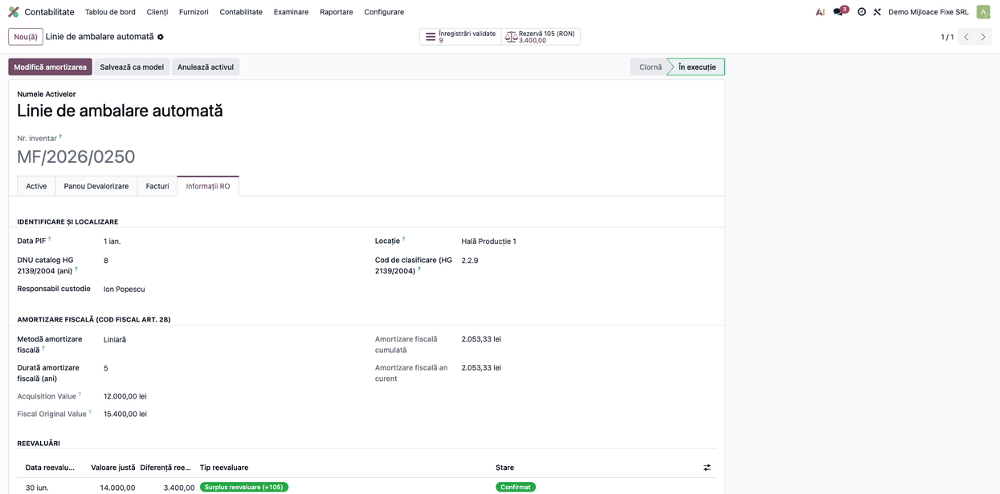

### Pasul 5 — Registrul Imobilizărilor

Accesați **Contabilitate → Raportare → Statement Reports → Fixed Assets Register (RO)**. Raportul
este nativ `account.report` (Enterprise), nu mai e un wizard separat: filtrul **„As of Date"** din
antet stabilește data de referință (implicit, ziua curentă), iar situația se recalculează automat
pentru acea dată — inclusiv amortizarea cumulată, luată doar din notele postate până atunci.

Activele sunt grupate pe **contul de imobilizări**, cu subtotal pe cont și **total general** în
capul tabelului. Fiecare linie e un activ confirmat (activele în ciornă nu apar în registru); click
pe o linie deschide direct fișa activului respectiv (drill-down). Butoanele **PDF** / **XLSX** din
colțul stânga-sus exportă exact ce se vede pe ecran.

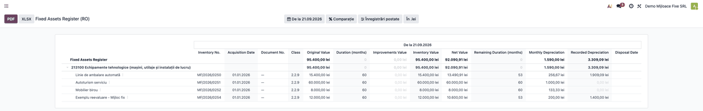

**Situația la o dată trecută (din 19.0.1.10.0):** toate coloanele se reconstituie la data raportului,
nu doar amortizarea: valoarea de intrare fără reevaluările de după dată, modernizările confirmate până
atunci (cu amortizarea lor), gestiunea din transferuri, amortizarea lunară din planul real (nota lunii
raportului) și lunile rămase din plan. Coloana **Historical Cost** arată costul istoric de achiziție
(pragul bazei fiscale), neschimbat de reevaluări. Registrul la 31.12, tipărit în martie, arată astfel
situația de la 31.12.

**Pe gestiune:** din selectorul de variante al raportului alegeți **Fixed Assets Register by Location**:
activele sunt grupate după gestiunea de la data raportului (o mutare din februarie nu schimbă
registrul la 31.12 al anului anterior); activele fără gestiune apar la „Without location”.

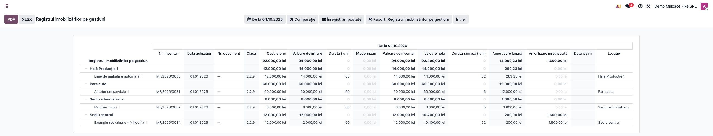

**Liste de inventariere (din 19.0.1.11.0):** Contabilitate → Active → **Fixed Asset Inventory Lists**.
Alegeți data inventarului, gestiunile (gol = toate), decizia de numire și comisia. Rezultă câte o listă de
inventariere (14-3-12) pe gestiune, cu mijloacele fixe aflate în gestiune la data inventarului și valoarea
de intrare, amortizarea cumulată și valoarea contabilă la acea dată (aceleași cifre ca registrul).
Cantitatea faptică, diferențele, valoarea de inventar și deprecierea le completează comisia; pentru
imobilizări se înscrie valoarea contabilă minus ajustări, comparată cu valoarea actuală (OMFP 2861/2009
pct. 34 alin. (2), pct. 37). Bunurile terților, imobilizările în curs și activele depreciate se trec pe
liste distincte (pct. 13, 14, 19, 20), azi întocmite separat. Export PDF și XLSX.

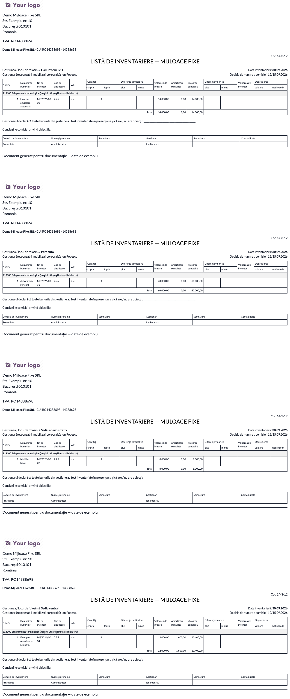

### Pasul 5b — Operarea de zi cu zi: grila, închiderea lunii, operațiile în lot (din 19.0.1.13.0)

**Grila mijloacelor fixe** (Contabilitate → Active → **Fixed Assets Grid**): activele în ciornă se
completează direct în listă, rând cu rând: denumire, categoria SAF-T (propune durata și codul de clasă),
contul 21x (propune 281x), valoarea, data achiziției și data PIF, gestiunea. Jurnalul de operațiuni
diverse și contul 6811 sunt propuse, amortizarea e lunară, iar numărul de inventar se generează la
salvare dacă lipsește. Se selectează rândurile și se confirmă din **Acțiuni → Confirm**. Activele în
funcțiune sunt needitabile în grilă (gestiunea se schimbă prin transfer, valoarea prin „Modifică”) și arată
situația de azi: amortizarea cumulată, valoarea netă, amortizarea lunii și lunile rămase. Filtre: în
ciornă, în funcțiune, în conservare, amortizate integral, fără număr de inventar / fără PIF / fără
categorie, ieșite în anul curent; grupare pe cont, gestiune, categorie.

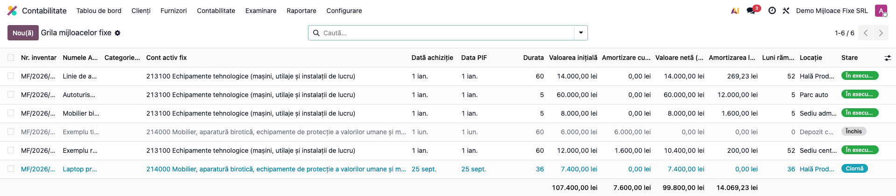

**Închiderea lunii** (Contabilitate → Active → **Fixed Assets Month Closing**), după încheierea lunii:
1. **Check** — verificări: active achiziționate până la sfârșitul lunii, dar neconfirmate; active fără număr
   de inventar sau fără categorie; transferuri și reevaluări în ciornă; active în conservare (ajustarea
   `6813 = 291x` se evaluează și se înregistrează manual, OMFP 1802/2014 pct. 238 alin. (4)); facturi de
   furnizor pe conturi de imobilizări fără mijloc fix. Fiecare verificare deschide înregistrările găsite.
2. **Reconcilierea** registrului la sfârșitul lunii cu balanța: valoarea de inventar pe contul 21x și
   amortizarea cumulată pe contul 281x, cu diferența pe cont. Bunurile ținute în afara modulului (de
   exemplu terenurile) dau diferențe legitime.
3. **Post Depreciation and Close** — postează notele de amortizare din ciornă până la sfârșitul lunii
   (aceleași note pe care le-ar posta automat Odoo) și închide luna. O lună neîncheiată nu se poate închide.
4. **Lock Period** (opțional, doar managerul contabil) — data de blocare globală la sfârșitul lunii.
Raportul PDF de închidere cuprinde verificările, amortizarea lunii și reconcilierea; închiderile rămân în
listă, cu istoricul în chatter.

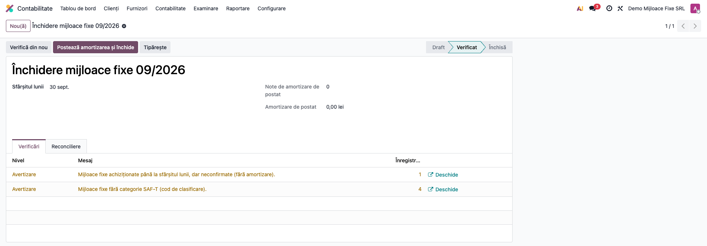

**Operații în lot**, din lista de active (selecție → **Acțiuni**):
- **Batch Transfer** — mută activele selectate în altă gestiune / la alt responsabil, la o dată: câte un
  transfer confirmat (bon de mișcare) pe activ.
- **Batch Revaluation** (managerul contabil) — reevaluarea de la sfârșitul exercițiului pe o listă: valoarea
  netă la dată pe fiecare activ și o coloană pentru valoarea justă din raportul evaluatorului; confirmarea
  creează câte o reevaluare pe activ, cu aceleași note și verificări ca reevaluarea individuală.

  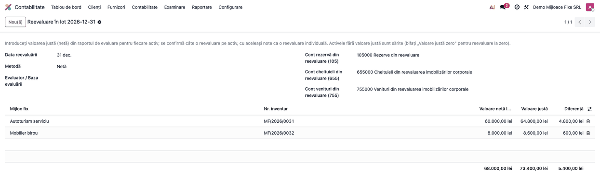
- Tipărirea în lot (fișa mijlocului fix, PV-urile de recepție, registrul numerelor de inventar) se face din
  **Tipărire** pe selecție.

### Pasul 6 — Preluarea registrului de imobilizări din programul anterior

1. În programul anterior, exportați în Excel, cu toate coloanele, **Registrul imobilizărilor** la
   luna ultimei amortizări închise. Recomandat: situația la **31.12** (sfârșitul exercițiului). Cu o
   situație în cursul anului, secțiunea de active din SAF-T (D406) a anului raportează amortizarea
   preluată ca amortizare a perioadei.
2. În Odoo: **Contabilitate → Configurare → Mijloace fixe → Import from SAGA**. Alegeți un jurnal
   separat pentru preluare (de tip Diverse), încărcați fișierul și apăsați **Check**. Data situației
   se deduce din fișier și se poate corecta.
3. Verificați tab-ul **Account Mapping**: fiecare cont din fișier (`2131`, `2813`, `6811`…) trebuie să
   aibă un cont Odoo. Analiticele cu punct (`2131.1`) se caută fără punct, apoi pe sintetic.
4. Verificați rândurile:
   - **Error** blochează importul (număr de inventar dublat, cont fără corespondent);
   - **Warning** se importă, dar trebuie verificat (valoarea rămasă ≠ valoarea de inventar −
     amortizarea, activ reevaluat, metodă accelerată);
   - **Skipped** nu se importă (ieșit din gestiune, activ deja existent).
5. Comparați totalurile pe contul Odoo din wizard cu **balanța de deschidere** la data situației:
   Σ valoare de inventar = sold debitor 21x (inclusiv coloana activelor nepuse în funcțiune),
   Σ amortizare = sold creditor 28x. Ajustările pentru depreciere (29x) nu se preiau.
6. Apăsați **Import**. Nu se face nicio notă în balanță. Mijloacele fixe în funcțiune primesc o notă
   de deschidere cu sume zero în balanță, care poartă amortizarea înregistrată ca informație pe
   activ. Planul de amortizare pornește din luna următoare situației: valoarea rămasă pe lunile
   rămase. Cele nepuse în funcțiune rămân în ciornă: verificați-le și confirmați-le la punerea în
   funcțiune.
7. Pe activele reevaluate (avertizarea „revalued or adjusted before”), completați în tab-ul de
   amortizare fiscală **rezerva 105 preluată** pe activ, din evidența analitică a contului 105.
   Σ rezervelor trebuie să dea soldul 105 din balanță; la ieșire, rezerva trece la 1175 (OMFP
   1802/2014 pct. 109). Pe aceleași active și pe cele cu metoda accelerată, verificați planul fiscal
   (valoarea fiscală include reevaluările, Codul fiscal art. 7 pct. 44 lit. c)).
8. **După** import, blocați perioada la data situației, ca să nu se posteze amortizări pe lunile deja
   amortizate (blocarea înainte de import ar refuza nota de deschidere).

### Note de monografie și raportare

- **Amortizare lunară:** `Dr 6811 (cheltuieli amortizare) = Cr 281x (amortizare cumulată)`.
- **Reevaluare — metoda netă (OMFP 1802/2014 pct. 103 lit. b)), din 19.0.1.4.0:** întâi se elimină
  amortizarea cumulată la sfârșitul lunii reevaluării, `Dr 281x (amortizare cumulată) = Cr 21x
  (activ)`, apoi diferența dintre valoarea justă și valoarea netă (rândurile de mai jos). După
  reevaluare, valoarea brută a activului este valoarea justă, iar amortizarea cumulată este zero
  (pct. 104); valoarea justă se amortizează pe durata rămasă, din luna următoare (vezi mai jos
  abaterea asumată de la pct. 99 alin. (2), care cere exercițiul următor). Ambele note se datează
  la sfârșitul lunii reevaluării. Pct. 105 cere reevaluarea simultană a întregii categorii de
  imobilizări din care face parte activul. Baza fiscală rămâne costul plus diferențele din
  reevaluare (art. 7 pct. 44 lit. c) Cod fiscal), cu costul ca minim: eliminarea amortizării e o
  operație contabilă, pe care Codul fiscal nu o cunoaște. Exemplu: mobilier de 7.500 lei pe 48 de luni,
  amortizat iulie–septembrie (468,75), reevaluat la 8.000: `Dr 2814 = Cr 214` 468,75 și
  `Dr 214 = Cr 105` 968,75; din octombrie, 8.000 / 45 = 177,78 lei/lună.
- **Reevaluarea unui activ cu modernizări (din 19.0.1.12.0):** activul se reevaluează împreună cu
  modernizările lui (activele copil), la valoarea justă a întregului. Pe fiecare modernizare se elimină
  amortizarea (`Dr 281x = Cr 21x`), iar valoarea ei rămasă trece pe activul principal (pe același cont,
  fără efect în balanță; pe conturi diferite, `Dr 21x principal = Cr 21x modernizare`); modernizarea se
  închide, iar diferența față de valoarea justă se înregistrează o singură dată, pe activul principal.
  Planul continuă pe activul principal, pe durata lui rămasă. Registrul la o dată dinaintea reevaluării
  arată modernizările separat; după, totul e în activul principal, iar fișa modernizării se închide cu
  linia „închisă în activul principal”. Baza fiscală rămâne costul plus modernizările plus diferențele din
  reevaluare, cu costul plus modernizările ca minim (art. 7 pct. 44 lit. c), art. 28 alin. (12) lit. d)).
  Modernizarea închisă nu are notă de ieșire; în D406 nu mai apare ca activ separat după data închiderii,
  dar nota ei de închidere apare în AssetTransactions (codul tranzacției e de verificat în nomenclatorul
  SAF-T). O modernizare pe alt cont 21x decât activul principal arată de obicei o greșeală de configurare
  (pct. 227); o componentă cu durată proprie (pct. 229) nu trebuie contopită în activul principal.
- **Metoda brută (pct. 103 lit. a)), din 19.0.1.12.0:** setarea „Revaluation Method” (Setări →
  Contabilitate → Fixed Assets (RO)) și câmpul „Method” din wizard. Brutul și amortizarea cumulată se
  recalculează proporțional (k = valoarea justă / valoarea netă), astfel încât valoarea netă să fie
  valoarea justă: la creștere `Dr 21x = Cr 105` (diferența) și `Dr 21x = Cr 281x` (creșterea amortizării);
  la scădere `Dr 281x` (scăderea amortizării) + `Dr 105`, sau `655` peste soldul rezervei (diferența) =
  `Cr 21x` (scăderea brutului). Exemplu: 6.000 lei, 250 amortizați, valoarea justă 6.500 → brut 6.782,61,
  amortizare 282,61, 750 pe 105. În wizard se introduce **valoarea justă, adică valoarea netă reevaluată**
  din raportul evaluatorului, nu costul de înlocuire brut: OMFP cere ca valoarea netă după reevaluare să
  fie egală cu valoarea reevaluată (pct. 103 lit. a)); brutul rezultă prin proporție și poate diferi de
  costul de înlocuire brut din raport, diferență care nu se înregistrează. Metoda brută nu se aplică pe un
  activ complet amortizat (folosiți metoda netă, pct. 100) și nici pe unul cu modernizări.
- **Reevaluare (creștere):** `Dr 21x (activ) = Cr 105 (rezerve din reevaluare)`.
- **Depreciere peste soldul 105:** `Dr 655 (cheltuieli din reevaluare) = Cr 21x (activ)`, pentru
  partea care depășește rezerva disponibilă din 105 (OMFP 1802/2014 pct. 111 alin. (2)-(3) — **nu**
  6813, cont de ajustări pentru depreciere/provizioane, un mecanism contabil diferit).
- **Creștere care compensează o depreciere anterioară:** `Dr 21x (activ) = Cr 755 (venit din
  reevaluare, în limita cheltuielii 655 necompensate de pe acest activ) + Cr 105 (restul, dacă
  există)` — OMFP 1802/2014 pct. 111 alin. (1), liniuța a doua (contul 755 e nominalizat în
  alin. (3)). Implementat prin câmpul
  „Revaluation Income Account" (755) pe reevaluare/wizard.
- **Activ complet amortizat (pct. 100):** reevaluarea cere durata pe care se amortizează valoarea
  reevaluată („Useful Life after Revaluation”, în perioadele activului).
- **Reevaluarea se face la sfârșitul exercițiului** (pct. 99 alin. (1), pct. 102): la o altă dată,
  formularul afișează un avertisment, fără să blocheze. Dacă după luna reevaluării există deja
  amortizări postate, reevaluarea e refuzată până când acestea sunt readuse în ciornă.
- **Modernizare ≠ reevaluare:** în „Modifică” → „Reevaluează”, pe companiile RO se alege tipul
  schimbării. *Reevaluare* deschide wizardul RO (105 / 655 / 755). *Modernizare* folosește fluxul
  nativ: activul primește o majorare de valoare (activ copil) cu contrapartida aleasă (404 sau
  231), amortizată pe durata rămasă (art. 28 alin. (12) lit. d) Cod fiscal). O „modernizare” care
  scade valoarea e refuzată.
- **Punere în funcțiune din 231 (din 19.0.1.6.0):** Contabilitate → Active → „Commissioning from
  231”. Pe parcursul investiției costurile se strâng pe 231 (`Dr 231 = Cr 404` sau `Cr 722`); la
  recepție alegi costurile, contul 21x și data PIF, iar wizardul face `Dr 21x = Cr 231` și creează
  mijlocul fix în ciornă, legat de notă (OMFP 1802/2014, funcțiunea contului 231; pct. 231 alin. (2)).
  Amortizarea începe din luna următoare PIF. Un cost pus deja în funcțiune nu mai poate fi ales.
  Valoarea mijlocului fix e suma netă a liniilor alese (costuri pe debit, reduceri sau stornări pe
  credit). Contul 231 se închide doar în 211–214, 216, 217; investițiile imobiliare (215) se închid
  din 235. La construcțiile realizate de firmă, data recepției pornește perioada de ajustare TVA de
  20 de ani (art. 305 alin. (2) lit. b), alin. (3) lit. b) Cod fiscal).
- **Catalogul HG 2139/2004 (din 19.0.1.6.0):** la alegerea categoriei SAF-T, activul primește
  durata minimă din catalog, codul de clasă și durata fiscală; la alegerea contului 21x /
  20x se propune contul de amortizare 281x / 280x.
- **Pauză / reluare pe luni întregi (din 19.0.1.6.0):** pe amortizarea lunară, luna pauzei nu se
  amortizează (amortizarea se oprește la sfârșitul lunii anterioare), iar după reluare amortizarea
  repornește din luna următoare, cu lună întreagă — ca regula fiscală a conservării (art. 28 alin. (12) lit. k)). În acest modul, pauza înseamnă
  trecerea în conservare (se creează perioada de conservare) și nu se folosește pentru alte
  situații. Contabil, pct. 238 alin. (4) cere pe perioada conservării fie amortizarea, fie o
  ajustare pentru deprecierea constatată: prin oprirea amortizării, politica aleasă este cea cu
  ajustarea, deci ajustarea devine obligatorie. Firma evaluează deprecierea constatată și
  înregistrează manual `Dr 6813 = Cr 291x` (reluată prin `Dr 291x = Cr 7813` la anulare); modulul
  nu generează această notă.
- **Luna ieșirii:** setarea „Depreciate the Exit Month” (Setări → Contabilitate → Fixed Assets (RO))
  amortizează integral și luna vânzării / casării, cu nota datată la data ieșirii, contabil și fiscal. Implicit luna ieșirii nu se amortizează.
- **Gestiune și bon de mișcare (din 19.0.1.7.0):** gestiunea e un nomenclator (Configurare → Fixed
  Asset Locations). La confirmarea activului se creează transferul inițial (data PIF); pe un activ în
  funcțiune, gestiunea și responsabilul se schimbă doar prin butonul „Transfer” (cu data predării
  efective), care creează un transfer numerotat `BM/AAAA/…`, tipărit ca **Bon de mișcare a mijloacelor
  fixe (14-2-3A)**. Transferul inițial nu se tipărește ca bon (documentul lui e PV-ul de recepție) și
  nu se anulează. Registrul imobilizărilor arată gestiunea de la data raportului.
- **Documente tipizate (OMFP 2634/2015, din 19.0.1.7.0):** Fișa mijlocului fix (14-2-2), PV de
  recepție (14-2-5, /a provizorie, /b de punere în funcțiune — tipul, comisia și constatările se
  completează în secțiunea „Reception” a activului), PV de scoatere din funcțiune (14-2-3/aA) și
  Registrul numerelor de inventar (14-2-1), din meniul „Print” al activului. PV-urile au număr de
  document: `PVR/AAAA/…` la confirmarea activului, `PVS/AAAA/…` la ieșire (editabile). PV-ul de
  recepție arată valoarea de la recepție, iar PV-ul de scoatere include amortizarea modernizărilor
  și caseta „APROBAT” pentru conducere. Ordinul nu impune un
  model obligatoriu, doar conținutul minim (Anexa 1 pct. 2); casarea se documentează cu PV-ul de
  scoatere din funcțiune (14-2-3/aA), iar decizia de casare e un act intern premergător. Detalii și
  surse: `readme/roadmap/DESIGN_documente_mijloace_fixe.md` din suită.
- **Pragul de 5.000 lei:** un bun intrat în patrimoniu din anul fiscal 2026, cu o valoare fiscală la
  intrare sub 5.000 lei, nu e mijloc fix amortizabil fiscal (Codul fiscal art. 28 alin. (2) lit. b),
  modificat prin OUG 8/2026); firma îl poate trata ca obiect de inventar (`l10n_ro_inventory_items`).
  Bunurile intrate înainte își păstrează încadrarea de la data intrării.
  Modulul nu impune pragul: încadrarea e prima decizie a utilizatorului la crearea activului.
- **Casarea și valorificarea pieselor:** fiscal, casarea înseamnă scoaterea din funcțiune urmată de
  dezmembrare și valorificarea părților componente (HG 1/2016, normele la art. 28, pct. 29 alin. (1)–(2));
  de ea depinde deductibilitatea valorii neamortizate din 6583. Piesele și materialele recuperate
  (capitolul III din PV-ul de scoatere) se înregistrează manual: `Dr 301 / 302x (ex. 3024, 3028) / 303
  = Cr 7588` (OMFP 1802/2014, funcțiunea contului 758).
- **TVA la ieșire:** la vânzarea taxabilă și la casarea unui bun de capital nu se ajustează TVA dedusă
  (Codul fiscal art. 305 alin. (4) lit. d) pct. 1 și pct. 4). Ajustarea apare, între altele, la o
  livrare scutită (de exemplu o clădire veche vândută fără opțiunea de taxare, art. 292 alin. (2)
  lit. f) și alin. (3)); atunci se face o singură dată, pentru toată perioada rămasă (art. 305
  alin. (5) lit. d)). Modulul nu o calculează: se înregistrează manual.
- **Diferențe între amortizarea contabilă și cea fiscală:** planul fiscal al activului dă
  amortizarea deductibilă; diferența față de amortizarea contabilă (6811) se ajustează în D101
  (cheltuiala contabilă nedeductibilă și amortizarea fiscală deductibilă). Entitățile care aplică
  OMFP 1802/2014 nu recunosc impozit amânat; doar cele care aplică IFRS îl recunosc, conform IAS 12.
  Modulul nu îl calculează.
- **Inventarierea anuală:** mijloacele fixe se inventariază cel puțin o dată pe an, la fuziune și la
  încetarea activității (Legea contabilității 82/1991; OMFP 2861/2009). Registrul imobilizărilor la
  data inventarului, cu gestiunea de la acea dată, se compară cu listele de inventariere și cu
  soldurile 21x / 28x; plusurile și minusurile se înregistrează manual. Registrul-inventar
  (`l10n_ro_inventory_register`) preia imobilizările.
- **Luna reevaluării nu se împarte pe zile:** amortizarea din luna în care are loc reevaluarea
  rămâne neschimbată, la vechea valoare lunară — valoarea nouă (recalculată pe durata rămasă) se
  aplică începând cu luna următoare. Motorul standard Enterprise ar calcula, altfel, o notă
  suplimentară pro-rata pe zilele rămase din luna reevaluării, iar amortizarea RO este strict
  lunară (OMFP 1802/2014 pct. 238 alin. (2) — care se referă însă la **punerea în funcțiune**,
  nu la reevaluare).
- **Momentul aplicării valorii reevaluate (setarea „Revalued Depreciation Starts”, din 19.0.1.12.0).**
  **Pct. 99 alin. (2)** cere ca amortizarea imobilizărilor reevaluate să se înregistreze **începând cu
  exercițiul financiar următor** celui pentru care s-a efectuat reevaluarea (alin. (1): reevaluarea
  privește imobilizările existente la sfârșitul exercițiului). Varianta „From the next financial year”
  aplică regula: până la sfârșitul exercițiului rămân notele lunare de dinainte, iar din ianuarie se
  amortizează valoarea rămasă pe lunile rămase. Implicit setarea e „From the next month” (modelul IAS 16,
  comportamentul de până acum): planul se recalculează din luna următoare reevaluării. La o reevaluare
  făcută la 31.12 cele două variante coincid. OMFP prevede reevaluarea la data bilanțului (pct. 99
  alin. (1), pct. 102): la o reevaluare făcută în cursul anului, varianta „din luna următoare” se abate de
  la pct. 99 alin. (2), iar la varianta „din exercițiul următor” valoarea netă la 31.12 nu mai este valoarea
  justă (formularul avertizează când data nu e sfârșitul exercițiului). Planul fiscal urmează aceeași
  setare: creșterea din reevaluare se deduce (iar rezerva 105 aferentă se impozitează, art. 26 alin. (6))
  din aceeași lună în care începe amortizarea contabilă. **De ales cu clientul înainte de punerea în
  producție.**
- **Casare (fără vânzare — activ complet sau parțial amortizat, fără încasare):** scoaterea din
  evidență `Dr 281x (amortizare cumulată) + Dr 6583 (valoare neamortizată) = Cr 21x (activ, valoare
  brută)`, cu **Decizie de casare** (raport PDF) ca document justificativ. Aici toată valoarea
  neamortizată ajunge direct în 6583 (`loss_account_id`).
- **Vânzare mijloc fix:** factura de vânzare generează separat `Dr 461 (creanța clientului — „Debitori
  diverși", funcțiunea contului, Cap. 16; nu 411/4111 „Clienți", rezervat vânzărilor din exploatare —
  din 19.0.1.9.0 contul de creanță trece automat pe 461 la confirmarea facturii, când toate liniile
  ei sunt pe 7583; contul de client al partenerului nu se schimbă, ca vânzările curente să rămână
  pe 4111. Emiteți o factură separată pentru activ: o factură mixtă (activ + produse) sau cu avans
  dedus rămâne pe 4111. Pentru un cumpărător afiliat sau asociat contul corect e 451 / 453: schimbați
  manual contul de creanță pe factură. Încasați din factură sau din reconcilierea bancară; o plată
  creată din meniul Plăți ia contul partenerului (4111) și nu se reconciliază cu 461)
  = Cr 7583 (venit din vânzare active) + Cr 4427 (TVA colectată)`. Nota de cedare a activului este
  **independentă** de preț și de factură — nu conține
  nicio linie pe 7583 (fix 19.0.1.3.3): `Dr 281x (amortizare cumulată) + Dr 6583 (valoare
  neamortizată integrală, `loss_account_id`) = Cr 21x (activ, valoare brută)`, identic cu monografia
  de la casare. Câștigul sau pierderea din vânzare nu se înregistrează explicit nicăieri — reiese
  din P&L prin comparația 7583 (din factură) vs. 6583 (din cedare), fără nicio compensare explicită
  în conturi (OMFP 1802/2014 pct. 56 alin. (1), pct. 243 alin. (1)) — la **prezentarea** oficială în
  contul de profit și pierdere, pct. 243 alin. (2) cere totuși ca rezultatul (câștig/pierdere) să
  fie arătat **net**; asta nu contrazice înregistrarea brută din conturi, e o regulă separată de
  raportare.
- **La casare/cedare, dacă activul are rezervă de reevaluare (105) nesoldată:** transfer automat
  `Dr 105 (rezerve din reevaluare) = Cr 1175 (rezultat reportat)` — surplusul se consideră „câștig
  realizat" la ieșirea activului din evidență (OMFP 1802/2014 pct. 109 alin. (1)-(2); **nu** pct. 103,
  care tratează tratamentul amortizării cumulate la reevaluare, altă temă).
- **Amortizare fiscală vs. contabilă** (Cod Fiscal art. 28): se urmărește separat de cea contabilă,
  pentru calculul impozitului pe profit. Baza de calcul (**valoarea fiscală de intrare**) urmărește
  **creșterile** din reevaluare — surplusul intră în valoarea fiscală și se amortizează fiscal, cu
  impozitarea concomitentă a rezervei 105 pe măsura deducerii amortizării (L227/2015 art. 7 pct. 44
  lit. c), art. 26 alin. (6)) — dar nu poate coborî sub **costul istoric de achiziție** la o
  diminuare. Afirmația „un surplus din reevaluare nu se amortizează fiscal" e corectă doar pentru
  partea de diminuare sub cost, nu generalizată la orice reevaluare.
- **Planul de amortizare fiscală (din 19.0.1.5.0):** în tabul „Informații RO”, lunar, doar calcul
  (fără note contabile), regenerat automat la confirmare, reevaluare, modernizare, conservare și
  ieșire. Regimuri (Cod fiscal art. 28; regulile și exemplele sunt în
  `readme/roadmap/DESIGN_amortizare_fiscala.md` din suită):
  - **liniar:** valoarea fiscală / (durata × 12), din luna următoare PIF;
  - **degresiv** (alin. (7)): cota liniară × 1,5 / 2,0 / 2,5, aplicată valorii rămase la începutul
    fiecărui an de utilizare, cu trecere la liniar (exemplul HG 1/2016 pct. 25: 350.000 lei pe 10 ani
    → 70.000, 56.000, 44.800, 35.840, 28.672, apoi 22.937,60 pe an); interzis la construcții;
  - **accelerat** (alin. (8)): cel mult 50 % în primul an de utilizare, apoi liniar pe durata
    rămasă; subgrupa 2.1 și clasa 2.2.9 (încadrare de verificat în HG 2139/2004), plus brevetele;
  - **superaccelerat** (alin. (8^1), OUG 8/2026): cel mult 65 % în primul an; active **noi** (bifa
    „New Asset”) din subgrupele 2.1 sau 2.4, achiziționate **și** puse în funcțiune în 2026;
    imobilizările în curs începute până la 31.12.2025 (alin. (8^2)) și anul fiscal modificat
    (alin. (8^3)) nu sunt tratate;
  - **necorporale** (alin. (9), după „Intangible Asset Type”): licențele și mărcile doar liniar;
    programele informatice liniar sau degresiv pe 3 ani; brevetele și degresiv sau accelerat.
  - Orice regim în afară de liniar cere codul de clasificare.
  - **Autoturism M1** (alin. (14)): partea din amortizarea lunară peste 1.500 lei e nedeductibilă
    (câmpul „Current Year Non-deductible (M1)”), cu excepțiile de la lit. a)–d); la ieșire, valoarea
    rămasă e deductibilă doar până la 1.500 lei × lunile rămase de amortizat (HG 1/2016 pct. 27).
  - **Conservare** (alin. (12) lit. k)): în lunile de pauză amortizarea fiscală e zero; la reluare,
    valoarea rămasă se amortizează pe durata normală rămasă din luna următoare. **[interpretare, de
    verificat]** lunile de conservare nu scad din durată (legea o cere explicit doar la activele
    deținute în vederea vânzării, alin. (26)). Cât timp activul e în pauză, planul se oprește.
  - **Reevaluare / modernizare:** diferența intră în valoarea fiscală rămasă din luna următoare
    (la degresiv: de la începutul anului de utilizare următor), fără recalcul retroactiv. După
    sfârșitul duratei normale, valoarea apare ca „Fiscal Value Outside the Board”, cu avertisment:
    trebuie stabilită o durată nouă (comisia tehnică, alin. (12) lit. d)).
  - **Ieșire:** luna ieșirii nu se amortizează; „Fiscal Value at Exit” e valoarea fiscală rămasă
    (rezultatul fiscal = prețul − această valoare, art. 28 alin. (17)).
  - Puncte interpretate (anul de utilizare, durata rămasă după conservare, rotunjiri) sunt marcate
    în documentul de design și trebuie confirmate de contabilul clientului înainte de producție.

#### Exemplu numeric verificat (tichetul 9452)

Reproduce exact scenariul din tichet: mijloc fix de **6.000 lei** (cont **214** „Mobilier, aparatură
birotică"), amortizare liniară pe **60 de luni** (100 lei/lună), PIF **1 iunie 2026**, vândut la
**15 septembrie 2026** cu **5.000 lei + TVA 21% (1.050 lei)**. Notele de mai jos sunt cele generate
**efectiv** de motor (nu un calcul manual) — capturate din baza de test.

**Planul de amortizare al activului** (tab „Panou Devalorizare" — traducerea Enterprise pentru
„Depreciere", vezi nota din secțiunea 11): două luni amortizate (iulie + august, 100 lei fiecare —
**nu** și septembrie, luna vânzării), apoi nota de cedare la vânzare.

> **Luna ieșirii e o convenție, nu o cerință legală.** OMFP 1802/2014 (pct. 238 alin. (2)) și
> Codul fiscal (art. 28 alin. (12) lit. a)) stabilesc doar începutul amortizării (luna următoare
> PIF), nu și luna în care se oprește. Implicit modulul nu amortizează luna ieșirii; setarea „Depreciate the Exit Month” o amortizează.
> Ambele variante sunt acceptabile dacă se aplică consecvent. Fiscal, efectul e de regulă neutru:
> ce nu se amortizează în luna ieșirii trece în valoarea neamortizată (6583), deductibilă la vânzare
> și la casare (art. 28 alin. (17)). Efectul **nu** mai e neutru când valoarea rămasă nu e
> deductibilă — de exemplu, mijloacele fixe constatate lipsă sau degradate, neimputabile (art. 25
> alin. (4) lit. c)): amortizarea lunii ieșirii ar fi fost deductibilă, valoarea rămasă nu este. La
> autoturismele M1, plafonul de 1.500 lei/lună se aplică și valorii rămase (HG 1/2016, Titlul II,
> pct. 27); efectul rămâne neutru dacă luna ieșirii se numără între lunile rămase.

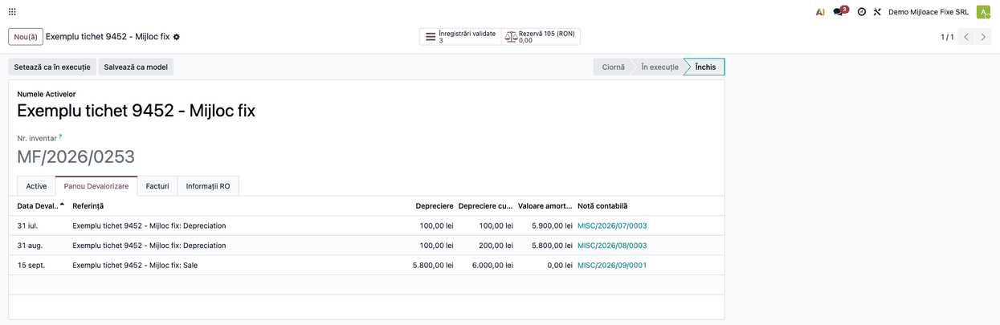

**Factura de vânzare**, cu liniile Dr/Cr reale:

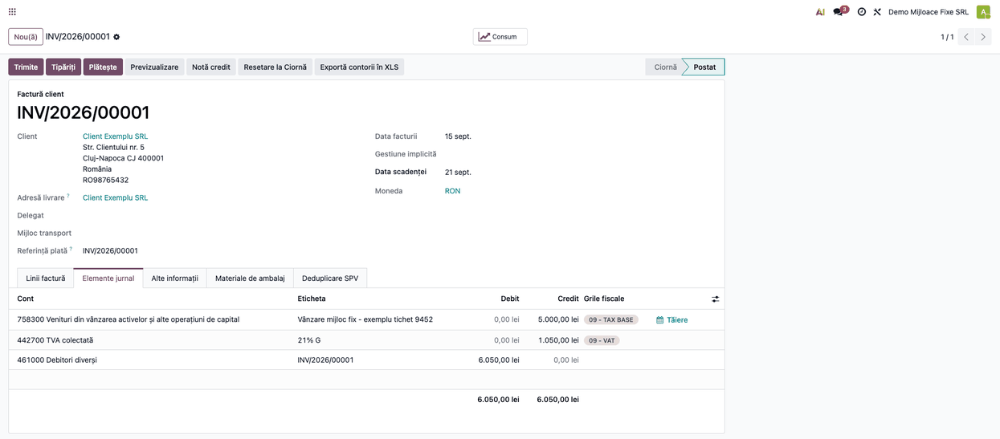

```
Dr 461   6.050,00 lei   (creanța clientului — „Debitori diverși", nu 411/4111)
Cr 7583  5.000,00 lei   (venit din vânzarea activului)
Cr 4427  1.050,00 lei   (TVA colectată 21%)
```

**Nota de cedare a activului** (separată de factură), cu liniile Dr/Cr reale pe conturi:

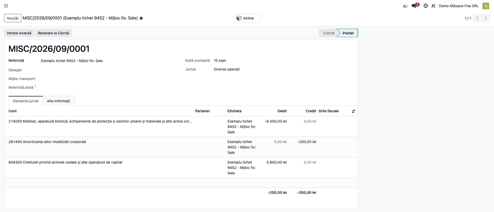

```
Dr 214  -6.000,00 lei   (scoaterea activului din evidență — notație storno)
Cr 2814    -200,00 lei  (scoaterea amortizării cumulate — notație storno)
Dr 6583   5.800,00 lei  (valoarea neamortizată integrală — fix 19.0.1.3.3, secțiunea 12)
```

**De reținut pentru consultant:** nota de cedare **nu** atinge deloc contul de venit din factură
(7583) — venitul din vânzare rămâne exclusiv în factură (`Cr 7583 5.000`), iar nota de cedare
înregistrează separat **întreaga valoare neamortizată** (`Dr 6583 = 5.800`, adică 6.000 valoare
brută − 200 amortizare cumulată), indiferent de prețul de vânzare. Rezultatul (pierdere de 800 lei
= 5.000 venit − 5.800 cheltuială) reiese din P&L prin comparația celor două conturi, fără nicio
notă care să le compenseze explicit — conform principiului necompensării (OMFP 1802/2014 pct. 56
alin. (1)) și evidențierii distincte a venitului/cheltuielii la cedare (pct. 243 alin. (1)). Până
la 19.0.1.3.2, modulul (prin motorul nativ `account_asset`) relua linia de venit din factură ca
stornare (`Dr 7583 5.000`) și înregistra doar diferența netă (`Dr 6583 800`) — rezultatul financiar
total ieșea corect, dar rulajele conturilor 7583/6583 erau greșite (subevaluate cu 5.000 lei
fiecare), afectând contul de profit și pierdere la nivel de rând. Corectat, confirmat de o
consultare `pacioli` explicită.

#### Exemplu numeric verificat — reevaluare cu diminuare de valoare

Confirmă vizual fix-ul din 19.0.1.3.1 (mai jos, secțiunea 12): un activ de **12.000 lei**
(60 luni, 200 lei/lună), cu **7 luni deja amortizate** (feb-aug), este diminuat cu **2.000 lei**
printr-o reevaluare. Planul de amortizare, **înainte** și **după**:

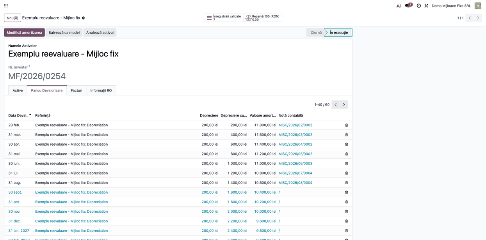

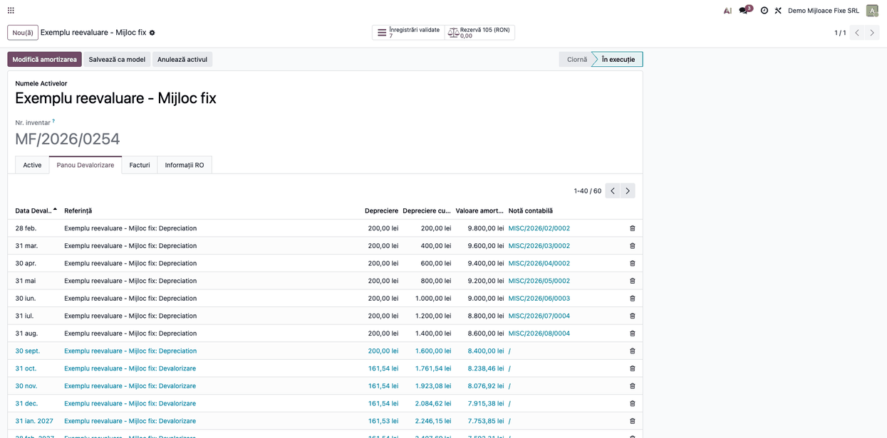

Lunile deja postate (feb-aug, 200 lei fiecare) rămân neschimbate — corect, nu se rescrie
istoricul. **Luna reevaluării (septembrie) rămâne neschimbată, la vechea valoare (200 lei)** —
fără nicio notă suplimentară pro-rata pe zile (fix 19.0.1.3.2, secțiunea 12); din **octombrie**
amortizarea viitoare scade la noua valoare recalculată pe durata rămasă (valoarea reziduală
rămasă, împărțită la lunile rămase) — nu mai rămâne la vechea sumă de 200 lei/lună, cum se
întâmpla înainte de primul fix (19.0.1.3.1), și nu se mai împarte artificial pe zile în luna
reevaluării, cum se întâmpla între cele două fix-uri (19.0.1.3.1 → 19.0.1.3.2).

## 7. Legături cu alte module / declarații

| Modul / proces | Rol în flux |
|---|---|
| `account_asset` | motorul de active și amortizare |
| `l10n_ro_inventory_register` | registrul anual include imobilizările |
| `l10n_ro_financial_statements` | raportare bilanț și anexe |
| SAF-T | câmpuri necesare pentru active |
| Programul anterior | sursa registrului la preluare: exportul „Registrul imobilizărilor” (Pasul 6) |

Ce este automat: completarea câmpurilor RO și urmărirea amortizării.
Ce rămâne manual: validarea numărului de inventar, codului nomenclator și DNU.

## 8. Verificări pentru consultant

- [ ] Modulul se instalează fără erori pe baza demo.
- [ ] O factură de furnizor pe un cont cu „Automatizează activul" generează corect mijlocul fix
      în ciornă (Pasul 1).
- [ ] Meniurile și acțiunile sunt vizibile pentru rolul de utilizator potrivit.
- [ ] Fluxul poate fi reprodus de la cap la coadă cu date fictive românești.
- [ ] Rezultatul contabil sau operațional corespunde descrierii din plan.
- [ ] Mesajele de eroare sunt clare pentru un utilizator non-tehnic.
- [ ] Exporturile sau rapoartele se descarcă și conțin datele testate.
- [ ] Pe conturile gestionate prin modul, valoarea de inventar din registrul imobilizărilor = soldul
      21x din balanță.
- [ ] Pe aceleași conturi, amortizarea cumulată din registru = soldul 281x din balanță.
- [ ] Σ rezervelor 105 de pe active = soldul 105 aferent lor din balanță.
- [ ] Nicio notă de cedare nu atinge 7583; venitul din vânzare e doar în factură, cu creanța pe 461.
- [ ] Creanțele 461 din vânzări de active sunt încasate și reconciliate (nicio pereche 4111 credit /
      461 debit pe același partener).
- [ ] Amortizarea începe în luna următoare datei PIF.

## 9. Mesaje de eroare frecvente

| Mesaj / simptom | Cauză probabilă | Remediere |
|-----------------|-----------------|-----------|
| „Commissioning date (PIF) cannot be before the acquisition date." | Data PIF a fost setată înaintea datei de achiziție a activului. | Corectați data PIF — trebuie să fie egală sau ulterioară achiziției. |
| „The journal entry … is linked to asset … but has no depreciation beginning date. The 'Asset' field is reserved for entries generated automatically…" *(mesaj momentan netradus în ro.po)* | O notă contabilă (ex. de reevaluare) a fost legată manual la câmpul tehnic „Asset", fără ca acesta să provină din motorul de amortizare. | Nu legați manual câmpul „Asset" pe notele contabile — el este completat automat de planul de amortizare/reevaluare. |
| „Account 655 not found. Please fill in the 'Account 655' field on the revaluation." | Deprecierea depășește soldul disponibil în 105, iar contul 655 nu e configurat pe planul de conturi sau pe reevaluare. | Completați câmpul „Revaluation Expense Account" pe reevaluare sau adăugați contul 655 pe planul de conturi RO. |
| „The revaluation has already been confirmed." / „…has a posted accounting entry. Please reset the journal entry first." | Se încearcă re-confirmarea unei reevaluări deja postate. | Resetați mai întâi nota contabilă asociată (draft), apoi reluați reevaluarea. |
| „Missing inventory number on fixed assets" / „Missing commissioning date on fixed assets" (avertisment SAF-T) | Activul nu are completat Nr. Inventar sau Data PIF, câmpuri obligatorii pentru declarația SAF-T D406. | Completați câmpurile lipsă direct din acțiunea „Fill in…" oferită de avertisment. |

## 10. Capturi de ecran

Capturile din `readme/screenshots/` se obțin din `tests/test_screenshots.py` (mixinul `ScreenshotCase`
din `l10n_ro_doc_screenshots`, HttpCase + Playwright), pe companie RO, în lei, cu plan de conturi RO.

1. `00a_cont_automatizare.png` — contul de imobilizări, tab „Automatizare": „Creează în stadiu
   de proiect".
2. `00b_comanda_achizitie.png` — comanda de achiziție confirmată, cu smart button-urile
   „Recepție" și „Facturi furnizor".
3. `00c_receptie.png` — recepția bunului, validată (stare „Efectuat").
4. `00d_factura_nota_contabila.png` — nota contabilă a facturii de furnizor, cu liniile Dr/Cr
   reale (213200/442600/404100 — furnizor de imobilizări, nu 401) — postarea ei declanșează
   generarea activului.
5. `00e_activ_generat_automat.png` — mijlocul fix generat automat la postarea facturii de
   furnizor, în stare „Ciornă", cu conturile de amortizare/cheltuială de completat.
6. `01_lista_active.png` — lista mijloacelor fixe cu coloanele RO (nr. inventar, conturi, stare).
7. `02_formular_active.png` — formularul, tab „Active": valori, metodă „Linie dreaptă", durată,
   conturi (213/281/681), jurnal, nr. inventar și smart button „Rezervă 105".
8. `03_informatii_ro.png` — tab „Informații RO": Data PIF, locație, DNU (HG 2139/2004), responsabil
   custodie, amortizare fiscală (Cod Fiscal art. 28), casare, reevaluări (rezerva 105).
9. `04_registrul_imobilizarilor.png` — Registrul Imobilizărilor (`account.report`): filtrul
   „As of Date", grupare pe cont cu subtotaluri, total general, 3 active confirmate.
10. `05_exemplu_plan_amortizare.png` — exemplul numeric (tichet 9452): planul de amortizare al
    activului-exemplu (tab „Panou Devalorizare"), cu cele 2 luni amortizate și nota de cedare.
11. `06_exemplu_factura_vanzare.png` — factura de vânzare a activului-exemplu, cu liniile Dr/Cr
    (461/7583/4427, inclusiv TVA 21%).
12. `07_exemplu_nota_cedare.png` — nota de cedare a activului, deschisă separat, cu liniile Dr/Cr
    detaliate pe conturi (214/2814/6583 — fără nicio linie pe 7583, fix 19.0.1.3.3).
13. `08_reevaluare_inainte.png` — planul de amortizare înainte de o reevaluare cu diminuare de
    valoare: toate lunile viitoare la suma inițială (200 lei).
14. `09_reevaluare_dupa.png` — același plan, după reevaluare: lunile deja postate neschimbate,
    luna reevaluării neschimbată (200 lei, fix 19.0.1.3.2 — fără split pe zile), lunile viitoare
    recalculate pe noua valoare (~161,54 lei).
15. `10_grila_mijloace_fixe.png` — grila mijloacelor fixe: rândul în ciornă introdus în listă și
    activele în funcțiune cu amortizarea cumulată, valoarea netă, amortizarea lunii și lunile rămase.
16. `11_inchidere_luna.png` — închiderea lunii, verificată: verificările găsite, cu link la înregistrări.
17. `12_registrul_pe_gestiuni.png` — varianta „pe gestiuni” a registrului, cu coloana „Cost istoric”.
18. `13_reevaluare_lot.png` — reevaluarea în lot: valoarea netă la dată, valoarea justă, diferența.
19. `14_lista_inventariere.png` — listele de inventariere (14-3-12), câte una pe gestiune.

Capturile 15–19 vin din `test_capture_operare`; le regenerează aceeași comandă.

Regenerare:
```
./odoo/odoo-bin -c odoo.conf -d <db> -i l10n_ro_fixed_assets,l10n_ro_doc_screenshots \
    --test-tags=fise_screenshots --stop-after-init --http-port=8987 --gevent-port=8988
```

## 11. Observații pentru manual

În manualul final, păstrați explicația orientată pe activitatea utilizatorului:
ce problemă rezolvă modulul, când se rulează, ce date trebuie pregătite și cum se verifică rezultatul.

> **Notă terminologică (nu ține de acest modul):** traducerea RO livrată de Odoo Enterprise pentru
> `account_asset` folosește „Devalorizare" în loc de „Amortizare" (ex. tabul „Panou Devalorizare",
> grupul „Metoda de Devalorizare"). Este o traducere din pachetul Enterprise, nu din
> `l10n_ro_fixed_assets` — în manual, înlocuiți mental „devalorizare" cu „amortizare" la explicarea
> capturilor.

## 12. Corecții relevante pentru consultant

Fixuri livrate pe acest modul, relevante pentru discuția cu clientul (ce s-a schimbat, de ce, de la ce versiune):

| Versiune | Ce era greșit (simptom pentru client) | Ce s-a corectat |
|---|---|---|
| **19.0.1.1.0** (versiune inițială) | Pe planul de conturi RO, contul de amortizare cumulată 281x este clasificat drept cont de cheltuială — fără o corecție explicită, planul de amortizare nu se genera deloc (linia Dr 6811 și cea Cr 281x se anulau reciproc). | Latura de amortizare cumulată este exclusă corect din calculul liniei de cheltuială, astfel încât planul de amortizare se generează cu valorile corecte (`Dr 6811 = Cr 281x`). |
| **19.0.1.2.0** (2026-09-14) | Amortizarea contabilă/fiscală începea chiar din luna punerii în funcțiune (PIF), proporțional cu zilele rămase din acea lună — nu din luna următoare, cum cere legea. | `prorata_date` pornește acum din prima zi a lunii **următoare** PIF (art. 28 alin. (12) lit. a) Legea 227/2015; OMFP 1802/2014 pct. 238). Se aplică companiilor RO cu amortizare lunară. |
| **19.0.1.2.0** (2026-09-14) | La vânzarea/casarea unui mijloc fix parțial amortizat în cursul lunii, programul amortiza proporțional cu zilele scurse până la data vânzării — deși amortizarea e strict lunară, iar convenția aleasă de modul este ca luna vânzării să nu fie amortizată (vezi nota de la exemplul numeric din tichetul 9452 — e o politică, nu o cerință legală). | Ultima lună amortizată la casare este acum luna anterioară vânzării, indiferent de ziua exactă din lună. Monografia de casare/vânzare (secțiunea 6) era deja corectă structural — discrepanța era doar efectul sumei greșite de amortizare. |
| **19.0.1.2.1** (2026-09-14) | Amortizarea fiscală afișată pe activ (câmpurile „Amortizare fiscală cumulată" / „an curent") putea arăta cumulatul **mai mic** decât amortizarea anului curent pentru un activ pus în funcțiune în anul curent — incoerență imposibilă contabil, cauzată de o formulă care numără luna PIF diferit în cele două cifre. | Ambele cifre folosesc acum aceeași convenție „luna următoare PIF", simetric cu fix-ul din 19.0.1.2.0; pentru primul an de amortizare, cumulatul și amortizarea anului curent coincid. |
| **19.0.1.2.2** (2026-09-14) — ⚠️ **regulă depășită de 19.0.1.3.4, vezi mai jos** | Amortizarea fiscală se calcula pe **valoarea curentă** a activului (`original_value`), care crește la o reevaluare — un surplus din reevaluare ajungea astfel inclus în baza de amortizare fiscală, umflând cifra afișată. | Baza de calcul a devenit câmpul nou **„Fiscal Original Value"**, înghețat la valoarea de intrare din momentul creării activului. **Regula s-a dovedit prea strictă** — vezi 19.0.1.3.4: surplusul din reevaluare TREBUIE să intre în baza fiscală (L227/2015 art. 7 pct. 44 lit. c)); doar diminuările sub costul istoric rămân plafonate. |
| **19.0.1.3.1** (2026-09-19) | O reevaluare (creștere sau diminuare de valoare) actualiza valoarea activului, dar **nu** regenera amortizarea viitoare — liniile de amortizare încă neconfirmate rămâneau la vechea sumă lunară, ca și cum reevaluarea nu ar fi avut loc. Raportat pe o instanță internă: după o diminuare, luna următoare continua să se amortizeze la valoarea dinaintea reevaluării. | Reevaluarea regenerează acum corect planul de amortizare de la data reevaluării încolo, pe baza noii valori — simetric la creștere și la diminuare. |
| **19.0.1.2.0** (2026-09-14) | Legarea manuală a unei note contabile (ex. o notă de reevaluare) la câmpul tehnic „Asset" al unei note contabile, fără completarea datei de început a amortizării, bloca ulterior orice calcul de valoare reziduală a activului, inclusiv din wizard-ul „Modifică". Incident reprodus pe o instanță client. | Legarea manuală incompletă este acum respinsă explicit la salvare, cu un mesaj clar (deocamdată doar în engleză) — câmpul „Asset" rămâne rezervat notelor generate automat de motorul de amortizare. |
| **19.0.1.1.1** (2026-07-17) | Butonul/acțiunea „Reevaluează Mijlocul Fix" din lista de active (meniu contextual) arunca o eroare la orice utilizare, blocând reevaluarea din acel punct de intrare. | Acțiunea apelează corect wizard-ul de reevaluare; funcționează identic cu butonul „Reevaluare" din formularul activului. |
| **19.0.1.3.0** (2026-09-15) | Registrul Imobilizărilor se genera printr-un wizard separat (dată + companie), care producea un PDF static; exportul PDF putea eșua cu o eroare de server (`IndexError`, template incomplet — corectat separat, chiar înainte de această migrare). | Raportul a fost migrat la framework-ul nativ `account.report`: se accesează direct din **Contabilitate → Raportare → Statement Reports → Fixed Assets Register (RO)**, cu filtru „As of Date", grupare pe cont cu subtotaluri, drill-down pe fiecare activ și export PDF/XLSX din bara de instrumente a raportului — fără wizard intermediar. |
| **19.0.1.3.2** (2026-09-21) | O reevaluare la mijlocul lunii genera o notă suplimentară pro-rata pe zilele rămase din acea lună, pe lângă amortizarea deja calculată la vechea valoare — dublând efectiv amortizarea lunii reevaluării, în loc să fie o singură notă lunară. În plus, deprecierea care depășea soldul rezervei 105 se înregistra pe contul **6813** (ajustări pentru depreciere/provizioane), în loc de **655** „Cheltuieli din reevaluarea imobilizărilor" (OMFP 1802/2014 pct. 111 alin. (3)). Semnalat de client cu exemple numerice concrete (tichet 9452). | Recalculul planului de amortizare la reevaluare pornește acum din prima zi a lunii **următoare** reevaluării — luna reevaluării rămâne neschimbată, la vechea valoare lunară, consecvent cu principiul amortizării strict lunare (OMFP 1802/2014 pct. 238). Câmpul de cont pentru depreciere a fost înlocuit cu **„Revaluation Expense Account"** (implicit 655, nu mai 6813); etichetele câmpurilor de cont (105/655) nu mai includ codul de cont în numele tehnic al câmpului. |
| **19.0.1.3.3** (2026-09-21) | Nota de cedare la **vânzarea** unui mijloc fix relua linia de venit din factură ca stornare (`Dr 7583`) și înregistra doar diferența netă (preț vânzare − valoare neamortizată) pe contul de pierderi (6583) — o compensare venituri/cheltuieli interzisă de OMFP 1802/2014 pct. 56 alin. (1) și contrară pct. 243 alin. (1) (evidențiere distinctă a veniturilor și cheltuielilor la cedare). Rezultatul financiar total ieșea corect, dar rulajele conturilor 7583 și 6583 erau subevaluate cu exact valoarea vânzării, deformând contul de profit și pierdere la nivel de rând. Confirmat printr-o consultare explicită a agentului `pacioli`. | Nota de cedare la vânzare nu mai atinge deloc contul de venit din factură — înregistrează independent de preț **întreaga valoare neamortizată** pe 6583 (`loss_account_id`), identic cu monografia de la casare fără vânzare. Rezultatul (câștig/pierdere) reiese din P&L prin comparația 7583 (din factură, neschimbat) vs. 6583 (din cedare), fără nicio compensare explicită. |
| **19.0.1.3.4** (2026-09-21) | Audit complet `pacioli` pe fișa de consultant, care a confirmat fix-urile 19.0.1.3.1-3 și a găsit erori suplimentare: (1) baza de amortizare fiscală îngheța complet la valoarea de intrare, deși L227/2015 art. 7 pct. 44 lit. c) cere ca surplusul din reevaluare să intre în baza fiscală (amortizabil, cu impozitarea concomitentă a rezervei 105 conform art. 26 alin. (6)) — doar diminuările sub costul istoric trebuie plafonate; (2) rezerva 105 afișată pe activ era suma algebrică a tuturor reevaluărilor, nu soldul real al contului — putea diverge de soldul contabil real când o diminuare depășea 105 (integral pe 655, fără să-l atingă); (3) o a doua diminuare succesivă putea consuma din 105 mai mult decât soldul real rămas (aceeași cauză); (4) lipsea mecanismul de compensare cont 755 pentru o creștere ulterioară unei diminuări recunoscute pe 655 (pct. 111 alin. (1), liniuța a doua); (5) citare greșită „pct. 103" pentru transferul 105→1175 (corect: pct. 109); (6) creanța la vânzare folosea 4111 în loc de 461 „Debitori diverși" (funcțiunea contului, Cap. 16); (7) reziduuri de text neactualizate din fix-urile anterioare (cifra „164,12" în loc de „161,54", mențiuni la „7583" în nota de cedare, wording „proporțional" pentru luna reevaluării). | Câmp nou **`l10n_ro_acquisition_value`** (cost istoric, înghețat la creare) — baza fiscală (`l10n_ro_fiscal_original_value`) e acum `max(cost istoric, valoare curentă)`, calculată prin `compute`. Rezerva 105 (`l10n_ro_revaluation_reserve`) se calculează acum din soldul REAL al liniilor contului 105 din notele de reevaluare postate, nu din suma algebrică — corectează și a doua diminuare succesivă. Adăugat câmpul **„Revaluation Income Account"** (cont 755) pe reevaluare/wizard, folosit automat când o creștere compensează o cheltuială 655 anterioară necompensată. Corectate citările (pct. 109) și contul de creanță la vânzare (461) în capturile/exemplul din fișă. Toate reziduurile de text corectate. |
| **19.0.1.3.5** (2026-09-21) | Audit final `pacioli` de confirmare pe fișa actualizată — cele 12 puncte din 19.0.1.3.4 sunt confirmate rezolvate, dar au ieșit la iveală 5 lacune noi, minore: costul istoric de achiziție (`l10n_ro_acquisition_value`) nu se resincroniza dacă activul era corectat manual cât era încă în ciornă (exact scenariul din Pasul 1); vânzarea unui activ fără cont de pierderi configurat pica cu o eroare generică de dezechilibru, nu una explicită; rezerva 105 afișată rămânea la vechea valoare și după transferul 105→1175 la casare (contul 105 era deja soldat); căutările de cont (105/1175/655/755) foloseau doar prefix (`=like`), fără să prioritizeze o potrivire exactă de cod; rândul din istoric al fix-ului 19.0.1.2.2 nu era marcat ca depășit, iar nota de compensare pe 755 lipsea din lista de monografii. | Costul istoric se resincronizează acum la orice scriere cât activul e în ciornă (nu și după validare). Vânzarea fără cont de pierderi configurat ridică acum un `UserError` explicit. Câmp nou `l10n_ro_revaluation_reserve_transferred` — rezerva arată 0 după transfer, iar transferul nu se mai poate dubla. Căutările de cont preferă acum potrivirea exactă înaintea prefixului. Rândul 19.0.1.2.2 marcat ca depășit; adăugată nota de monografie pentru compensarea pe 755. 4 teste noi. |
| **19.0.1.3.6** (2026-09-23) | Citări de bază legală imprecise, împrăștiate inconsecvent prin documentație: intervalul pentru contul 655 apărea ca „pct. 111 alin. (3)" în unele locuri și „alin. (2)-(3)" în altele; contul 755 era atribuit lui alin. (1), deși e nominalizat în alin. (3); art. 26 alin. (6) omitea condiția „reevaluări după 01.01.2004" și al doilea moment de impozitare (scoaterea din gestiune); Exemplul 5 credita 2133 („Mijloace de transport") pentru un utilaj. | Toate citările verificate **la sursă** cu agentul `pacioli` (OMFP 1802/2014 consolidat 19.11.2025, L227/2015 consolidat 08.05.2026) și aliniate. Niciuna dintre notele contabile nu s-a schimbat — doar trimiterile. Exemplul 5 trecut pe **2131** („Echipamente tehnologice"); 2813 era deja corect. |
| **19.0.1.3.7** (2026-09-23) | Audit `pacioli` complet al fișei. **Blocant:** nota despre luna reevaluării prezenta drept conform OMFP un comportament pe care OMFP nu-l permite, sprijinindu-se pe pct. 238 (care tratează punerea în funcțiune, nu reevaluarea), în timp ce pct. 99 alin. (2) cere ca amortizarea recalculată să se înregistreze abia din exercițiul financiar următor. Divergența era deja recunoscută intern, dar nu ajunsese în fișă. În plus: citarea inexistentă „pct. 401/404" pentru contul 404; „jurnal de tip Active fixe", tip care nu există; dependența `account_reports` lipsă din lista de instalare; amortizarea fiscală din Exemplul 1 calculată pe 10 luni în loc de 9 (martie în loc de aprilie — 12.500 în loc de 11.250 RON). | Divergența față de pct. 99 alin. (2) e acum declarată explicit în fișă, ca **model IAS 16 asumat**, de discutat cu clientul înainte de producție. Citarea falsă înlocuită cu funcțiunea contului 404 (Cap. 16); jurnalul descris corect ca tip **Diverse**; `account_reports` adăugat la dependențe; exemplul recalculat la **11.250 RON** (9 luni, conform art. 28 alin. (12) lit. a)). |
| **19.0.1.4.0** (2026-10-03) | Analiza funcțională și verificarea `pacioli`: reevaluarea trecea doar diferența pe 21x și lăsa amortizarea cumulată (281x) neatinsă. Valoarea netă era corectă, dar brutul și amortizarea cumulată nu corespundeau nici metodei brute, nici celei nete (OMFP 1802/2014 pct. 103) — iar exact ele apar în Registrul imobilizărilor, în nota explicativă și în D406. În plus, pe companiile RO „Modifică” trimitea orice majorare de valoare în reevaluare (105), deci o modernizare nu se mai putea înregistra. | Reevaluarea folosește **metoda netă**: `Dr 281x = Cr 21x` (amortizarea cumulată la sfârșitul lunii), apoi diferența pe 105 / 655 / 755; brutul devine valoarea justă, amortizarea cumulată zero. Activul complet amortizat se reevaluează cu durată nouă (pct. 100). Baza fiscală se calculează din cost plus diferențele din reevaluare, nu din valoarea brută contabilă. Activul cu modernizări separate nu se reevaluează încă. Avertisment dacă data nu e sfârșitul exercițiului; refuz dacă există amortizări postate după luna reevaluării. În „Modifică” se alege *Reevaluare* sau *Modernizare*. Reevaluările confirmate înainte sunt semnalate în chatterul activului la actualizare (notele postate nu se modifică). |
| **19.0.1.5.0** (2026-10-03) | Doar metoda fiscală liniară era calculată, iar degresiva și accelerata erau refuzate. Amortizarea fiscală era o cifră calculată retroactiv pe baza curentă, la data ultimei recalculări, fără plan lunar, fără conservare și fără plafonul de 1.500 lei la autoturismele M1. | Plan de amortizare fiscală lunar, cu regimurile liniar, degresiv, accelerat și superaccelerat 2026 (Cod fiscal art. 28 alin. (7), (8), (8^1)) și restricțiile lor pe clasa HG 2139. Plafonul M1 cu excepțiile lit. a)–d) și deductibilul la ieșire (HG pct. 27). Conservarea din pauză / reluare. Reevaluările și modernizările din luna următoare, fără retroactivitate. Valoarea fiscală la ieșire. Exemplul oficial HG 1/2016 pct. 25 e test automat. |
| **19.0.1.6.0** (2026-10-04) | Analiza funcțională: lipseau punerea în funcțiune din 231, propunerea duratei din catalog și a contului de amortizare; pauza amortiza pe zile până la data pauzei și relua pe zile; luna ieșirii nu se putea amortiza. | Wizard „Commissioning from 231” (`Dr 21x = Cr 231` + activ în ciornă); categoria HG propune durata minimă, clasa și durata fiscală, iar contul 21x propune 281x; pauza / reluarea pe luni întregi; setare pe companie „Depreciate the Exit Month”, aplicată contabil și fiscal. |
| **19.0.1.7.0** (2026-10-04) | Gestiunea era text liber, fără istoric și fără bon de mișcare; registrul arăta gestiunea de azi; lipseau fișa mijlocului fix, PV-urile de recepție și de scoatere din funcțiune și registrul numerelor de inventar (doar decizia de casare, act intern). | Gestiunea ca nomenclator, transferuri datate cu bon de mișcare (14-2-3A), transfer inițial la PIF, gestiunea la dată în registru; rapoartele 14-2-1, 14-2-2, 14-2-3/aA, 14-2-5 (/a, /b) după OMFP 2634/2015. Textele vechi din câmpul de locație au devenit gestiuni la actualizare. |

> Notă: fix-urile de amortizare (din luna următoare PIF, fără prorata la vânzare) și blocarea legării
> manuale sunt acoperite direct de teste automate (`tests/test_fixed_assets_ro.py`), reproduse cu date
> fictive RO. Fix-ul acțiunii „Reevaluează" este verificat doar indirect (testul acoperă metoda
> apelată, nu punctul exact de eroare din acțiunea de server). Istoricul complet, în engleză și cu
> detalii tehnice, e în `readme/HISTORY.md`.
