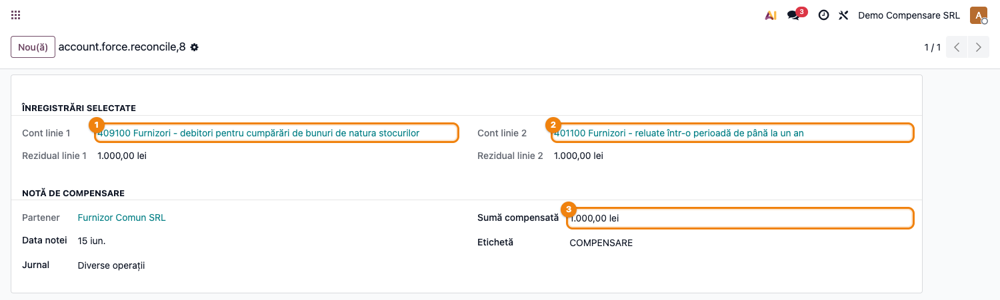
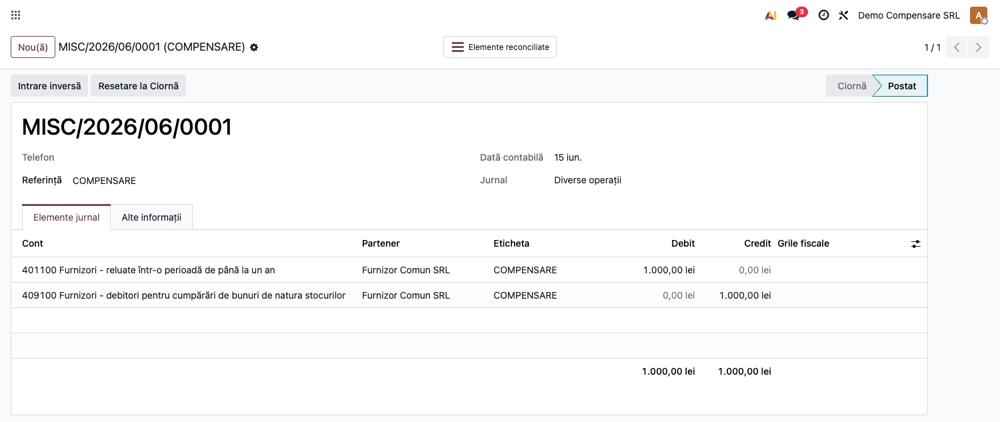
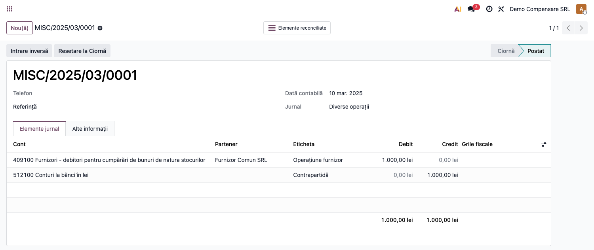

# Fișă Modul: Reconciliere forțată între conturi

**Poziție plan:** C13
**Modul:** `l10n_ro_force_reconcile`
**FR:** FR-29
**Capitol manual:** Cap 12.10
**Utilizator principal:** Contabil, Manager Contabilitate
**Prioritate:** 🟡 Medie

---

## 1. Scop business

Modulul oferă un wizard pentru compensarea și reconcilierea controlată a liniilor aflate pe conturi diferite, de exemplu avansuri și facturi finale.

## 2. Bază legală și context

În practică apar situații 409↔401, 419↔411 sau client-furnizor în care reconcilierea directă standard nu este posibilă. Modulul generează notă de compensare și păstrează trasabilitate.

## 3. Utilizatori și roluri

- Contabil clienți/furnizori: propune reconcilierea.
- Contabil șef: validează compensarea.
- Administrator: verifică drepturile de acces.

## 4. Date implicate

- două sau mai multe linii contabile deschise;
- conturi diferite;
- jurnal de compensare;
- partener comun sau justificare contabilă.

## 5. Configurare inițială

1. Instalați `l10n_ro_force_reconcile`.
2. Verificați accesul grupului de contabilitate manager.
3. Pregătiți linii demo pe conturi diferite.
4. Verificați jurnalul folosit pentru nota de compensare.

## 6. Flux de utilizare

### Pasul 1 — Accesare

Meniu: `Contabilitate → Contabilitate → Elemente de reconciliat / Parteneri → acțiunea Force Reconcile`.

1. Selectați liniile contabile de reconciliat.
2. Lansați wizardul de reconciliere forțată.
3. Verificați diferența și conturile implicate.
4. Generați nota de compensare.
5. Verificați că liniile sunt reconciliate.

**Wizardul de reconciliere forțată** — afișează cele două conturi selectate (ex. avans furnizor
409 ↔ datorie furnizor 401), soldurile reziduale și suma compensată:

**Nota de compensare generată** — o linie pe fiecare cont, echilibrată (debit 401 / credit 409):

**Nota inițială** după compensare — linia de pe contul de avans devine reconciliată (butonul
„Elemente reconciliate"):

## 7. Legături cu alte module / declarații

| Modul / proces | Rol în flux |
|---|---|
| `account` | reconciliere conturi și parteneri |
| `l10n_ro_partner_ledger_currency` | verificare solduri partener în valută |
| `account_reports` | balanță și fișe de cont |
| Audit | justificarea reconcilierilor forțate |

Ce este automat: permite reconcilierea controlată între conturi configurate.
Ce rămâne manual: aprobarea și documentarea motivului reconcilierii.

## 8. Verificări pentru consultant

- [ ] Wizardul este disponibil doar utilizatorilor autorizați.
- [ ] Nota de compensare este echilibrată.
- [ ] Reconcilierea este vizibilă pe liniile inițiale.
- [ ] Chatterul sau referința explică motivul compensării.

## 9. Mesaje frecvente

| Simptom | Cauză probabilă | Remediere |
|---------|-----------------|-----------|
| Wizard indisponibil | Utilizator fără drepturi | Folosiți grup contabil manager |
| Diferență nereconciliată | Sumele nu se compensează | Verificați suma și moneda |

## 9. Capturi de ecran

| # | Fișier | Conținut |
|---|--------|----------|
| 1 | `screenshots/01_wizard_compensare.png` | Wizardul de reconciliere forțată (conturile selectate + suma compensată) |
| 2 | `screenshots/02_nota_compensare.png` | Nota de compensare generată (debit cont 1 / credit cont 2) |
| 3 | `screenshots/03_linie_reconciliata.png` | Nota inițială cu linia reconciliată după compensare |
