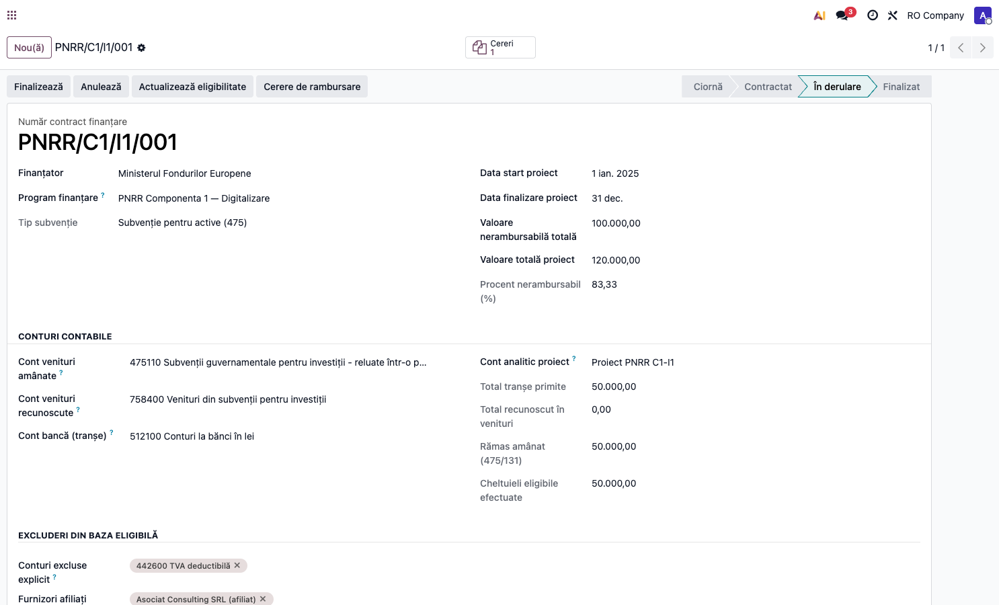
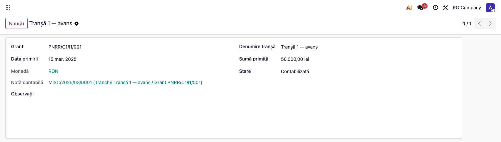
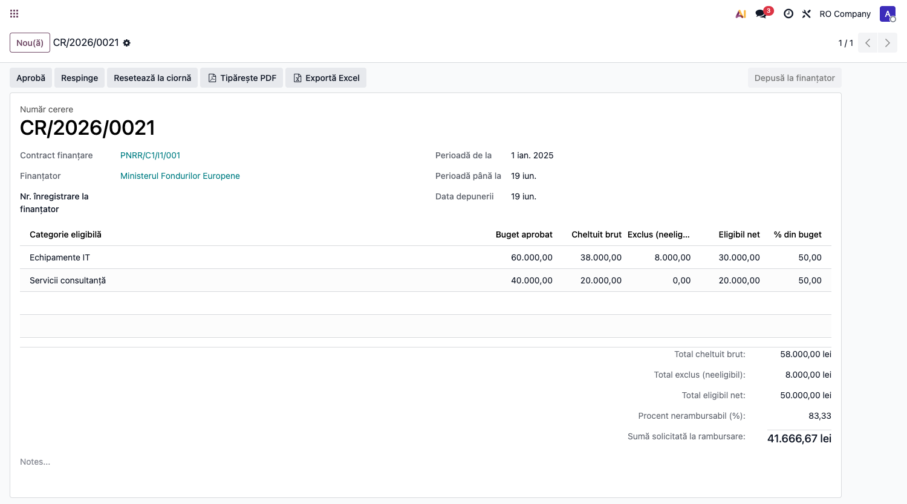
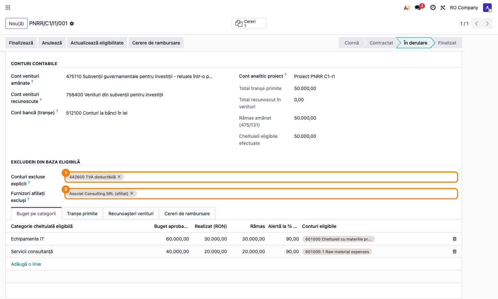

# Fișă Modul: Subvenții și Fonduri Nerambursabile

**Modul:** `l10n_ro_grants`
**FR:** FR-38
**Capitol manual:** Cap 7 / Subvenții
**Utilizator principal:** Contabil, Responsabil proiecte finanțate
**Prioritate:** Medie

---

## 1. Scop business

Modulul urmărește contractele de finanțare nerambursabilă (subvenții) de la semnare până la
recunoașterea integrală în venituri, conform **OMFP 1802/2014** și **IAS 20**. Consultantul îl
prezintă ca instrument de evidență a subvențiilor pentru active (475/131) și pentru venituri
(132), cu buget pe categorii eligibile și recunoaștere etapizată.

## 2. Bază legală și context

- **OMFP 1802/2014** — subvenții pentru investiții (cont 475 → 131/132) și subvenții de exploatare.
- **IAS 20** — recunoașterea subvențiilor guvernamentale corelat cu cheltuielile/amortizarea.
- Surse acoperite: PNRR, Fonduri Structurale UE (FEDR/FSE/FEADR), programe naționale
  (Start-Up Nation, IMM Invest), ajutoare de minimis.

## 3. Utilizatori și roluri

- Contabil: înregistrează contractul, tranșele și recunoașterile.
- Responsabil proiecte: urmărește bugetul pe categorii și eligibilitatea cheltuielilor.
- Contabil șef: validează recunoașterea veniturilor și corelarea cu amortizarea.

## 4. Date implicate

- contract finanțare (`l10n.ro.grant`): finanțator, program, tip (activ/venit), valori, perioadă;
- cont analitic de proiect și conturile 475/131/132, 7584/7411, banca;
- buget pe categorii (`l10n.ro.grant.budget.line`) cu conturi eligibile;
- **excluderi din baza eligibilă**: conturi neeligibile (`excluded_account_ids`, ex. 4426 TVA
  recuperabil) și furnizori afiliați/părți legate (`excluded_partner_ids`);
- tranșe primite (`l10n.ro.grant.tranche`);
- recunoașteri venituri (`l10n.ro.grant.recognition`);
- **cereri de rambursare** (`l10n.ro.grant.claim` + `l10n.ro.grant.claim.line`): situația
  cheltuielilor eligibile depuse periodic la finanțator, cu net eligibil vs. exclus per categorie.

## 5. Configurare inițială

1. Instalați `l10n_ro_grants`.
2. Verificați conturile RO: 475 (subvenții pt. investiții), 131/132, 7584 (venituri din subvenții
   pt. investiții) / 7411 (subvenții de exploatare).
3. Creați contul analitic al proiectului (pentru urmărirea cheltuielilor eligibile).
4. Pregătiți datele finanțatorului (partener).
5. Definiți **excluderile** pe contract (secțiunea „Excluderi din baza eligibilă"): conturile
   neeligibile (ex. 4426 TVA recuperabil) și furnizorii afiliați/părți legate care nu intră în
   baza eligibilă a cererilor de rambursare.

## 6. Flux de utilizare

1. Creați **contractul de finanțare**: finanțator, program, tip (`asset`/`income`), valoare
   nerambursabilă, valoare proiect, perioadă, cont analitic și conturile 475/131.
2. Definiți **bugetul pe categorii** de cheltuieli eligibile, cu conturile eligibile și pragul de
   alertă (% buget consumat).
3. Parcurgeți starea: **draft → contractat → activ → finalizat**.
4. Înregistrați **tranșele primite** → notă automată **Dr 5121 = Cr 475/131/132**.
5. **Recunoașterea veniturilor** (Dr 475/131 = Cr 7584/7411): manual sau prin cron lunar liniar.
6. Rulați **Calcul eligibilitate** pentru a actualiza realizatul pe categorii din AML-urile cu
   distribuție analitică pe proiect.
7. Generați **cererea de rambursare** (vezi pasul dedicat mai jos).

### 6.1 Cererea de rambursare (claim) + tratarea excluderilor

Cererea de rambursare este **situația cheltuielilor eligibile** depusă periodic la finanțator
(PNRR/FEDR), pe baza căreia se încasează tranșa de rambursare. Pași:

1. Pe contractul **activ** (sau finalizat) apăsați butonul **„Cerere de rambursare"** din antet
   (sau *Rapoarte → Subvenții → Cereri de rambursare → Nou*). Se creează o cerere și se generează
   automat liniile pe perioada cererii.
2. Stabiliți **perioada** (`Perioadă de la`/`până la`); butonul **„Generează liniile"** (re)agregă,
   per **categorie bugetară**, cheltuielile din AML-urile cu distribuție analitică pe proiect,
   postate, din perioadă. Pentru fiecare categorie cererea separă:
   - **Eligibil net** — suma care intră în baza de rambursare;
   - **Exclus (neeligibil)** — sumele de pe **conturile excluse explicit** (ex. 4426 TVA
     recuperabil) sau de la **furnizorii afiliați** configurați pe contract;
   - **Cheltuit brut** = eligibil net + exclus.
3. **Suma solicitată la rambursare** = `Total eligibil net × procent nerambursabil`
   (procentul = valoare nerambursabilă / valoare proiect).
4. Parcurgeți starea cererii: **ciornă → depusă → aprobată → rambursată** (sau **respinsă**).
5. **Tipăriți PDF** sau **exportați Excel** situația eligibilității pentru dosarul depus la finanțator.

**Important — cererea NU generează notă contabilă.** Este un document justificativ; notele apar
la **tranșă** (`Dr 5121 = Cr 475/131/132`) și la **recunoașterea venitului**
(`Dr 475/131 = Cr 7584/7411`). Vezi nota privind contul 445 în §7.

**Excluderi:** se definesc o singură dată pe contract și se aplică automat la fiecare cerere.
- **4426 TVA recuperabil** — exclus corect: TVA deductibilă nu este cost pentru plătitorul de TVA
  (se recuperează prin deducere), deci nu este cheltuială eligibilă. TVA este eligibilă doar când
  este **nerecuperabilă** de beneficiar.
- **Furnizori afiliați / părți legate** — excluderea este o **regulă de program** (ghidul
  solicitantului PNRR/FEDR), nu o normă din OMFP 1802. Confirmați lista de excluderi cu ghidul
  apelului de finanțare aplicabil.

## 7. Reguli funcționale

| Situație | Tratament |
|---|---|
| Tranșă primită | Dr 5121 = Cr 475 (subvenție activ) sau Cr 131/132 |
| Recunoaștere venit subvenție activ | Dr 475/131 = Cr 7584 |
| Recunoaștere venit subvenție exploatare | Dr 475 = Cr 7411 |
| Cheltuieli eligibile | calculate din AML cu distribuție analitică pe proiect, per categorie |
| Buget consumat peste prag | alertă la `% configurat` (implicit 90%) |
| Cron lunar | recunoaștere liniară opțională (inactiv implicit) |
| Cerere de rambursare | document justificativ (PDF/XLSX), **fără notă contabilă proprie** |
| Linie cerere — eligibil net | AML pe conturi eligibile, fără excluderi |
| Linie cerere — exclus | AML pe conturi excluse (4426) sau furnizori afiliați |
| Sumă solicitată | `Total eligibil net × procent nerambursabil` |

**Recunoașterea venitului (momentul):**
- **subvenții pentru investiții** (475 → 7584): venit recunoscut **corelat cu amortizarea**
  activului finanțat (OMFP 1802 pct. 399(1) și 402(2)). Cronul lunar liniar al modulului este o
  **aproximare** (cotă = total / luni proiect) — coincide cu amortizarea doar la active amortizate
  liniar pe durata proiectului; altfel reglați manual recunoașterile;
- **subvenții de exploatare** (131 → 7411): venit recunoscut **pe măsura cheltuielilor aferente**
  (OMFP 1802 pct. 398–399), de regulă pe baza eligibilității stabilite prin cererea de rambursare.

**Notă — contul 445 „Subvenții (de primit)" (limitare):** modulul contabilizează direct
`Dr 5121 = Cr 475/131/132` la încasarea tranșei, fără a trece prin **445**. Pentru fluxul tipic
PNRR/FEDR „cheltuiește întâi, încasează după cererea de rambursare", tratamentul riguros (OMFP 1802
pct. 397(2)b) recunoaște creanța la aprobare (`Dr 445 = Cr 475/131`) și o regularizează la încasare
(`Dr 5121 = Cr 445`) — astfel încât subvenția aprobată și neîncasată să apară în bilanț ca
„subvenții de primit". Schema simplificată din modul este corectă când încasarea e ~simultană cu
dreptul; pentru decalaje mari, urmăriți creanța separat sau semnalați nevoia de model 445.

## 8. Scenarii de test pentru consultant

| ID | Scenariu | Rezultat așteptat |
|---|---|---|
| GR-01 | Contract subvenție activ + tranșă | notă Dr 5121 = Cr 475 |
| GR-02 | Recunoaștere venit | Dr 475 = Cr 7584, total amânat scade |
| GR-03 | Cheltuieli eligibile pe categorie | realizat actualizat din AML analitice |
| GR-04 | Buget consumat > prag | alertă afișată |
| GR-05 | Finalizare contract | total recunoscut = total primit |
| GR-06 | Cerere de rambursare cu cheltuieli eligibile + excluse | linii cu eligibil net / exclus / brut per categorie; sumă solicitată = eligibil net × % nerambursabil |
| GR-07 | Furnizor afiliat pe cont eligibil | suma intră pe coloana „Exclus", nu în baza de rambursare |
| GR-08 | Export PDF/Excel cerere | situație eligibilitate descărcabilă (fără notă contabilă) |

## 9. Legături cu alte module / declarații

| Modul | Rol |
|---|---|
| `account` / `analytic` | note contabile și urmărire analitică pe proiect |
| `l10n_ro` | plan de conturi RO (475/131/7584) |
| `l10n_ro_fixed_assets` | corelarea subvenției cu amortizarea activului finanțat |

## 10. Verificări pentru consultant

- [ ] Conturile 475/131/132 și 7584/7411 sunt corect configurate pe contract.
- [ ] Tranșele generează note corecte 5121 = 475/131.
- [ ] Recunoașterea veniturilor reduce soldul amânat.
- [ ] Cheltuielile eligibile se calculează din distribuția analitică.
- [ ] Totalul recunoscut nu depășește totalul primit.
- [ ] Excluderile (4426 + furnizori afiliați) sunt definite pe contract conform ghidului apelului.
- [ ] În cererea de rambursare, sumele excluse apar pe coloana „Exclus", separat de eligibilul net.
- [ ] Suma solicitată = eligibil net × procent nerambursabil.
- [ ] Cererea de rambursare nu a generat note contabile (doar tranșa/recunoașterea contabilizează).

## 11. Mesaje de eroare frecvente

| Simptom | Cauză | Remediere |
|---|---|---|
| Notă tranșă fără cont | conturi 475/131 necompletate pe contract | completați conturile pe contract |
| Eligibilitate 0 | AML fără distribuție analitică pe proiect | setați contul analitic pe linii |
| Recunoaștere blocată | contract neactivat | treceți contractul în starea „activ" |
| Cerere fără linii la depunere | nu s-a apăsat „Generează liniile" | generați liniile înainte de depunere |
| Linii cerere goale (toate 0) | cheltuielile nu au distribuție analitică sau perioada e greșită | verificați perioada și distribuția analitică pe proiect |
| Coloana „Exclus" goală deși ar trebui populată | furnizorul afiliat / contul 4426 nu sunt în excluderile contractului | completați excluderile pe contract |
| „Liniile pot fi regenerate doar pe o cerere ciornă" | cererea e deja depusă/aprobată | resetați la ciornă pentru a regenera |

## 12. Capturi de ecran

**Contract PNRR/C1/I1/001 — stare „În derulare", conturi 475/7584/5121, totaluri ①:**

**Tranșă 1 (avans 50.000 lei) — stare „Contabilizată", nota contabilă generată automat ②:**

**Cerere de rambursare — linii pe categorii cu eligibil net / exclus / cheltuit brut și
sumă solicitată la rambursare (eligibil net × procent nerambursabil) ③:**

**Excluderi din baza eligibilă — cont 4426 TVA recuperabil ① și furnizor afiliat ② definite pe
contract; conturile contabile 475/7584/5121 ④:**

| # | Fișier | Conținut |
|---|--------|----------|
| 1 | `screenshots/01_contract_grant.png` | Contract finanțare ① — valori, conturi, stare activă, totaluri urmărire |
| 2 | `screenshots/02_transa_nota_contabila.png` | Tranșă avans ② — sumă, dată, nota contabilă Dr 5121 = Cr 475 |
| 3 | `screenshots/03_cerere_rambursare.png` | Cerere de rambursare ③ — linii eligibil net / exclus per categorie, totaluri, sumă solicitată |
| 4 | `screenshots/04_excludere.png` | Excluderi ①② — conturi excluse (4426) + furnizori afiliați și conturile contabile ④ |
