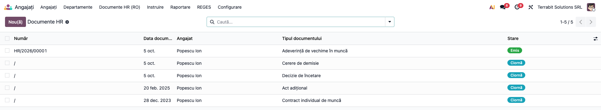
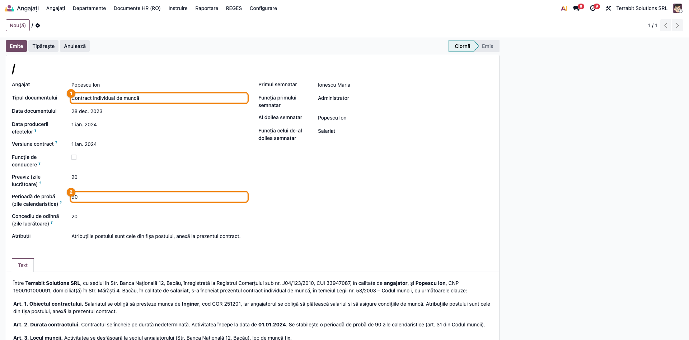
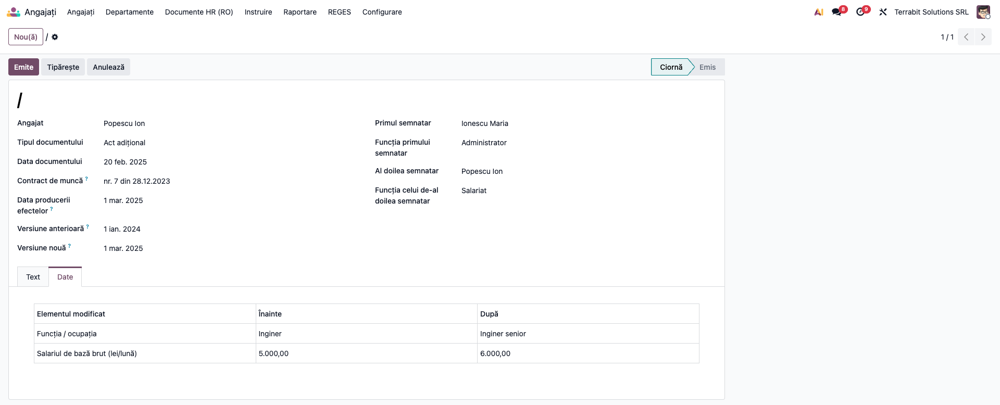
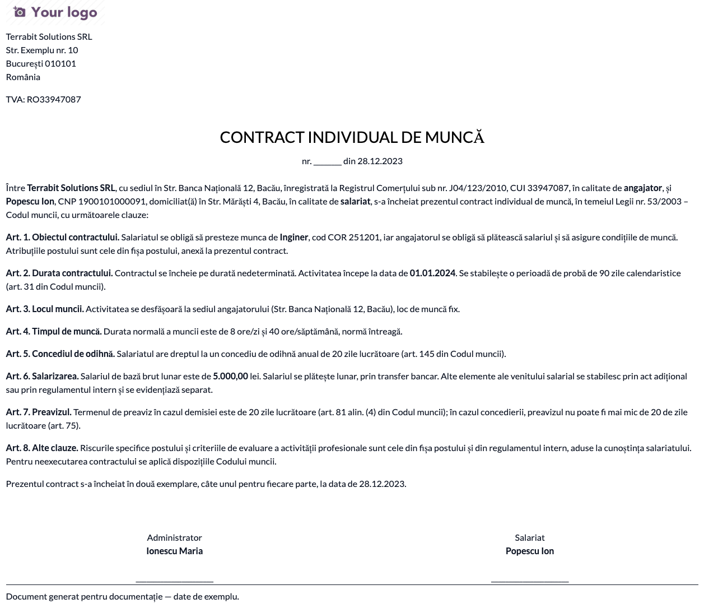
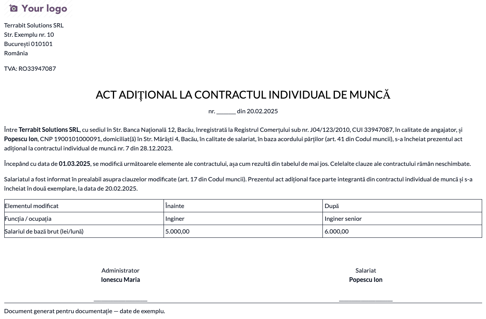
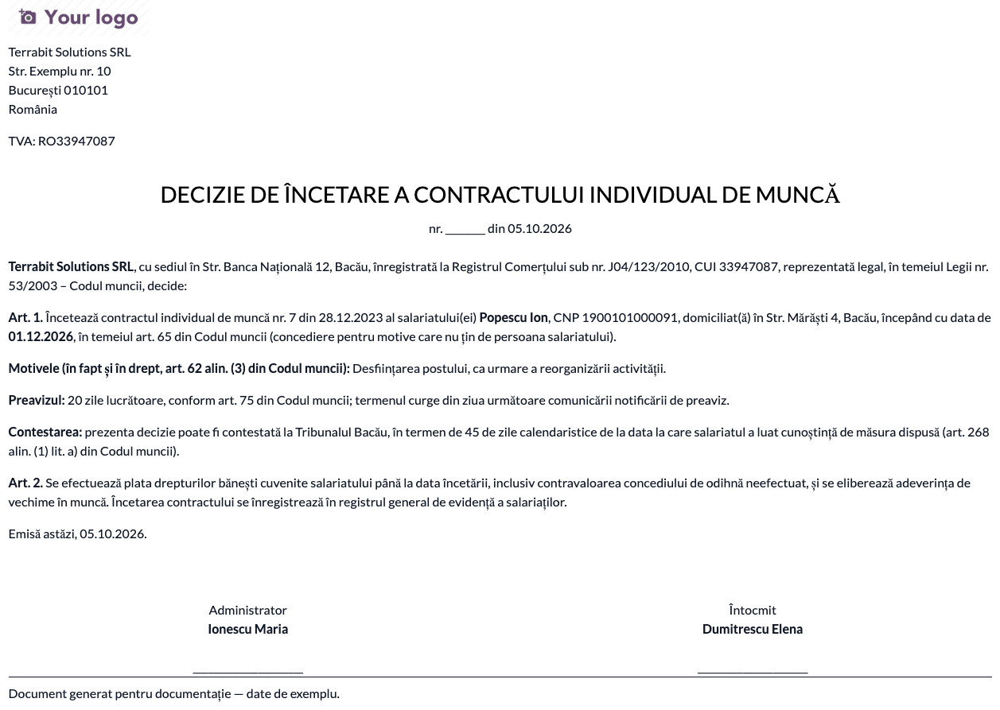
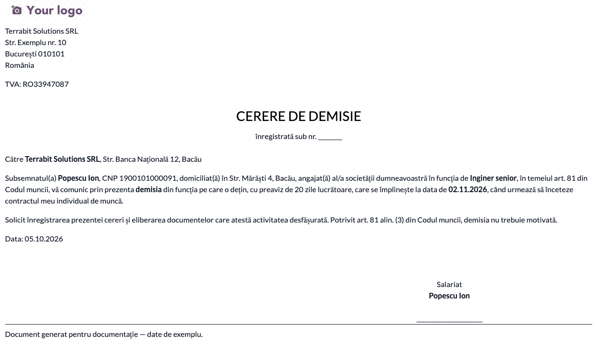
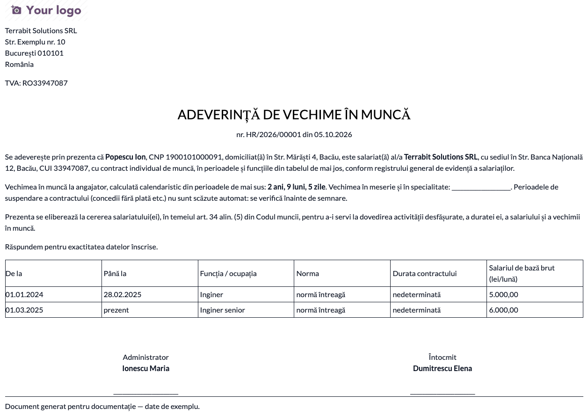
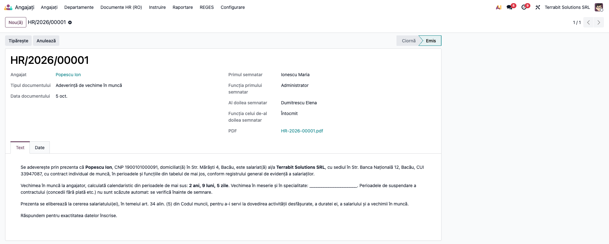

# Fișă Modul: Documente HR (contract, act adițional, decizii, cerere de demisie, adeverință de vechime)

**Modul:** `l10n_ro_hr_documents`
**Utilizator principal:** responsabil resurse umane / salarizare
**Prioritate:** 🟡 Medie (documentele se pot întocmi manual; modulul economisește retastarea datelor și păstrează evidența)
**Poziție plan:** S10 din `ROADMAP_salarizare_ro.md`

> **Atenție:** modelele de document sunt cele uzuale, nu modelul-cadru al contractului, și **trebuie validate juridic** de consilierul juridic al firmei înainte de utilizare. Pacioli acoperă doar partea fiscală.

## 1. Scop business

Fiecare angajat are în ciclul de viață mai multe documente: contractul de muncă, actele adiționale la schimbarea funcției sau a salariului, deciziile de suspendare și de încetare, cererea de demisie, adeverințele. Modulul le generează din fișa angajatului și din versiunile contractului, cu număr de înregistrare, text editabil și PDF arhivat pe fișa angajatului.

## 2. Bază legală și context

Legea nr. 53/2003 – Codul muncii: forma scrisă a contractului (art. 16), informarea asupra clauzelor esențiale (art. 17), perioada de probă (art. 31), documentul care atestă activitatea, salariul și vechimea (art. 34 alin. (5)), modificarea contractului (art. 41), suspendarea (art. 49–54), încetarea (art. 55–56, 61, 65), decizia de concediere motivată (art. 62 alin. (3), art. 76, art. 252 alin. (2) la concedierea disciplinară), preavizul (art. 75 și art. 81), durata minimă a concediului de odihnă (art. 145), termenele de contestare (art. 268 alin. (1) lit. a) — 45 de zile — și lit. b) — 30 de zile la sancțiunea disciplinară). Textele s-au verificat față de forma consolidată din 2026, dar documentele rămân de validat juridic.

## 3. Utilizatori și roluri

- **Responsabil HR** (grupul *Ofițer* din Angajați): creează și emite documentele.
- Administratorul sau reprezentantul legal semnează documentele; salariatul semnează contractul, actul adițional și cererea de demisie.

## 4. Conturi și date implicate

Modulul nu face note contabile. Datele folosite:
- **angajat:** nume, CNP, adresa privată;
- **versiunea contractului:** funcția, salariul, departamentul, codul COR, durata, norma, ore/zi, locul muncii, datele contractului, temeiul de încetare sau suspendare (din `l10n_ro_reges`);
- **companie:** denumire, adresă, CUI, număr în Registrul Comerțului.

## 5. Configurare inițială

1. Instalați modulul `l10n_ro_hr_documents` (depinde de `l10n_ro_reges`).
2. Completați datele companiei și ale angajaților (CNP, adresă, versiunea contractului cu funcția, salariul și codul COR).
3. Pentru actul adițional, creați câte o versiune nouă a contractului pe fișa angajatului la fiecare modificare, cu data de la care se aplică.

## 6. Flux de utilizare

### Pasul 1 — Lista documentelor

**Angajați → Documente HR (RO)**. Lista arată numărul, data, angajatul, tipul și starea documentelor, cu filtre pe tip și pe stare.

### Pasul 2 — Documentul nou (contract individual de muncă)

Apăsați **Nou**, alegeți angajatul și tipul **Contract individual de muncă**. Se completează singure: datele părților, funcția și codul COR, durata, salariul și timpul de muncă din versiunea contractului. Clauzele (funcție, COR, salariu, normă) se iau din **versiunea contractului** aleasă în câmpul *Versiune contract* (implicit **prima**, cea de la angajare). Completați **data producerii efectelor** (data începerii activității), **perioada de probă** (cel mult 90 de zile la funcții de execuție, 120 la conducere — se bifează *Funcție de conducere*, art. 31; 30 de zile la persoanele cu handicap, art. 31 alin. (2), pe care modulul nu o verifică) și **concediul de odihnă** (cel puțin 20 de zile lucrătoare, art. 145). Contractul se încheie în scris **cel târziu în ziua anterioară începerii activității** (art. 16): modulul avertizează dacă data documentului nu respectă termenul.

**Verificați înainte de emitere:** datele din text (nume, CNP, funcție, salariu) coincid cu fișa angajatului; durata (determinată / nedeterminată) e cea corectă; textul se poate corecta direct în fila *Text*. **Semnatarii:** primul semnatar este angajatorul (implicit *Administrator*), iar la contract, act adițional și cerere de demisie al doilea este **salariatul** (completat automat); la decizii al doilea semnatar e cel care a întocmit documentul.

### Pasul 3 — Actul adițional

Tipul **Act adițional**: alegeți **versiunea anterioară** și **versiunea nouă** a contractului și data de la care se aplică; completați numărul și data contractului (**Contract de muncă**). Actul se datează **cel târziu în ziua de la care se aplică modificarea** (art. 17 alin. (5)); modulul avertizează dacă e datat după. Fila *Date* listează **doar elementele care diferă** (funcție, COR, departament, salariu, timp de muncă, normă, durată, loc de muncă). Dacă versiunile sunt identice, apare un avertisment și documentul nu se poate emite.

### Pasul 4 — Deciziile, cererea de demisie și adeverința

- **Decizie de suspendare:** alegeți temeiul (art. 50, 51, 52 alin. (1) lit. c) sau art. 54), data de început și, dacă se cunoaște, data de sfârșit; la art. 52 textul face trimitere la indemnizația din art. 53.
- **Decizie de încetare:** alegeți temeiul (art. 55 lit. b, 56, 81, 61 lit. a, c, d sau 65), data și, la concediere, **motivele** și **instanța** la care se poate contesta: fără ele decizia e nulă absolut (art. 62 alin. (3), art. 76 și art. 78) și modulul **nu permite emiterea**. **Preavizul** (min. 20 de zile lucrătoare, art. 75) apare doar la art. 61 lit. c și d și la art. 65 (la art. 61 lit. d în perioada de probă nu se acordă preaviz, art. 75 alin. (2): scădeți manual zilele de preaviz); concedierea disciplinară (art. 61 lit. a) **nu are preaviz** și se contestă în **30 de zile** (art. 252 alin. (5), art. 268 alin. (1) lit. b), celelalte în 45 de zile (lit. a). La concedierea disciplinară, motivele trebuie să descrie fapta, prevederile încălcate și motivele înlăturării apărărilor (art. 252 alin. (2)).
- **Cerere de demisie:** preavizul în zile lucrătoare: **cel mult 20 la funcții de execuție, 45 la funcții de conducere** (art. 81 alin. (4); se bifează *Funcție de conducere*). Data la care se împlinește apare în câmpul *Preavizul se împlinește*: se numără zilele lucrătoare luni–vineri **fără sărbătorile legale din calendarul companiei**: se introduc în calendarul de lucru al companiei sau se generează cu *Generează sărbătorile legale* din modulul `l10n_ro_hr_pontaj` (Concediu → Management), dacă e instalat; dacă nu sunt introduse, nu se scad și data trebuie corectată manual. Cererea se semnează doar de salariat și se înregistrează de angajator (art. 81 alin. (2)).
- **Adeverință de vechime:** perioadele, funcțiile, normele și **salariul** din istoricul versiunilor, plus vechimea la angajator calculată calendaristic (art. 34 alin. (5)); vechimea în meserie și în specialitate și perioadele de suspendare se completează manual.

### Pasul 5 — Emiterea și tipărirea

Apăsați **Emite**: documentul primește număr din secvență (`HR/an/nr`, ca înregistrare), iar PDF-ul se arhivează ca atașament pe fișa angajatului. **Tipăriți** documentul pentru semnare. Un document emis nu se șterge, doar se anulează; dacă îl anulați și îl readuceți în ciornă, la reemitere **păstrează numărul** și înlocuiește PDF-ul arhivat.

### Note de monografie și raportare

Modulul nu generează note contabile și nu transmite nimic în REGES: transmiterea contractelor, a modificărilor, a suspendărilor și a încetărilor se face din `l10n_ro_reges`, pe baza acelorași versiuni ale contractului.

## 7. Legături cu alte module / declarații

| Modul | Rol |
|---|---|
| `l10n_ro_reges` | COR, durată, normă, temeiuri de încetare și suspendare |
| `hr` | angajatul, versiunile contractului |
| `l10n_ro_hr_pontaj` (opțional) | generarea sărbătorilor legale în calendarul companiei, folosite la calculul preavizului |

**Automat:** textul din datele angajatului, diferențele dintre versiuni, perioadele din adeverință, termenul preavizului.
**Manual:** alegerea temeiului legal, completarea datelor documentului, semnarea, transmiterea în REGES.

## 8. Verificări pentru consultant

- [ ] Modelele de document au fost validate juridic de consilierul firmei.
- [ ] Textul contractului corespunde fișei angajatului (nume, CNP, funcție, COR, salariu, normă).
- [ ] Actul adițional listează doar elementele schimbate între versiuni.
- [ ] Temeiul legal din decizii este cel corect (articol, alineat, literă) și apare în text.
- [ ] Preavizul din cererea de demisie se împlinește la data așteptată (zile lucrătoare, fără sărbătorile legale din calendar; verificați manual dacă sărbătorile nu sunt generate).
- [ ] Contractul conține și clauzele de completat manual, pe care modelul nu le acoperă: ore suplimentare și compensarea lor, programul în schimburi, condițiile perioadei de probă, deplasarea la loc de muncă mobil, alte avantaje (art. 17 alin. (3)).
- [ ] Decizia de concediere are motive, instanță și, unde se cuvine, preaviz (altfel e nulă absolută, art. 78).
- [ ] Adeverința de vechime arată toate perioadele și funcțiile din istoricul contractului.
- [ ] La emitere documentul are număr `HR/an/nr` și PDF-ul apare pe fișa angajatului.

## 9. Mesaje de eroare frecvente

| Mesaj | Cauză | Remediere |
|---|---|---|
| Nu există diferențe între cele două versiuni ale contractului | versiunile alese sunt identice | alegeți versiunile corecte sau creați versiunea nouă a contractului |
| Alegeți temeiul legal și data încetării | decizie de încetare fără temei sau fără dată | completați câmpurile |
| Decizia de concediere trebuie să cuprindă motivele și instanța... | concediere fără motive sau fără instanță | completați *Motiv* și *Instanța* |
| Contractul trebuie încheiat în scris cel târziu în ziua anterioară... | data documentului e după începerea activității | datați contractul înainte de începerea activității |
| Actul adițional e datat după modificarea pe care o consemnează | data actului e după data de la care se aplică | datați actul înainte de modificare |
| Angajatul nu are CNP: e necesar în document | CNP lipsă pe fișa angajatului | completați CNP-ul |
| Se pot emite doar documente în ciornă / Un document emis nu poate fi șters; anulați-l | emitere repetată sau ștergere a unui document emis | anulați documentul |
| Alegeți temeiul legal și începutul suspendării | decizie de suspendare fără temei sau fără dată | completați câmpurile |
| Angajatul nu are nicio perioadă de contract cu dată de început | adeverință pentru un angajat fără data de început a contractului | completați data de început pe versiunea contractului |
| Perioada de probă nu poate depăși 90 (sau 120) de zile calendaristice pentru această funcție | probă peste limita din art. 31: 90 la execuție, 120 la conducere | corectați numărul de zile sau bifați *Funcție de conducere* |
| Preavizul nu poate depăși 20 (sau 45) de zile lucrătoare pentru această funcție | preaviz peste limita din art. 81 alin. (4): 20 la execuție, 45 la conducere | corectați numărul de zile sau bifați *Funcție de conducere* |
| Preavizul unei concedieri nu poate fi sub 20 de zile lucrătoare | preaviz sub limita din art. 75 | corectați numărul de zile |

## 10. Capturi de ecran

Generate automat din `tests/test_screenshots.py` (mixinul `ScreenshotCase` din `l10n_ro_doc_screenshots`), în RO, pe planul RO:

- `01_lista_documente.png`: lista documentelor HR;
- `02_formular_contract.png`: formularul contractului, cu tipul și perioada de probă;
- `03_act_aditional.png`: actul adițional, cu tabelul modificărilor;
- `04_pdf_contract.png`: contractul tipărit;
- `05_pdf_act_aditional.png`: actul adițional tipărit;
- `06_pdf_decizie_incetare.png`: decizia de încetare tipărită;
- `07_pdf_cerere_demisie.png`: cererea de demisie tipărită;
- `08_pdf_adeverinta_vechime.png`: adeverința de vechime tipărită;
- `09_document_emis.png`: documentul emis, cu numărul și PDF-ul atașat.

Regenerare: `odoo-bin -c <conf> -d <baza_cu_ro_RO> -u l10n_ro_hr_documents --test-tags=fise_screenshots:TestHrDocumentsScreenshots --stop-after-init`

## 11. Observații pentru manual

- Documentele sunt modele uzuale, de validat juridic; manualul trebuie să precizeze că firma răspunde de conținutul final.
- Decizia de suspendare, decizia de încetare și actul adițional pornesc de la versiunile contractului; ordinea corectă e: creați versiunea nouă, apoi documentul.
- Nu sunt incluse decizia de nominalizare REGES, regulamentul intern și fișa postului.
