# Fișă Modul: Foaia colectivă de prezență (pontajul lunar) din program, sărbători și concedii

**Modul:** `l10n_ro_hr_pontaj`
**Utilizator principal:** Responsabil resurse umane / salarizare (rol Concediu „Responsabil: Gestionați toate cererile") pentru foaia lunii; administratorul de concedii (rol „Administrator") pentru configurare, sărbători și redeschiderea unei luni închise
**Prioritate:** 🟡 Medie (evidența zilnică a orelor lucrate este obligatorie, iar foaia semnată stă la baza salarizării; modulul nu calculează salariile)

---

## 1. Scop business

Orice angajator ține evidența orelor lucrate zilnic de fiecare salariat și o predă, lunar, celui care face salarizarea. În practică, foaia colectivă de prezență se completează de mână sau în Excel, deși aproape tot ce conține se știe deja: programul fiecărui om, sărbătorile legale și concediile aprobate. Modulul **propune** foaia din aceste trei surse, direct din aplicația standard **Concediu**. Programul este doar punctul de plecare: legea cere orele prestate efectiv, așa că operatorul scrie, ca **corecție**, tot ce s-a întâmplat altfel — o absență nemotivată, o zi de delegație, o zi lucrată în concediu, alte ore.

Ce primește consultantul:

- ecranul **Concediu → Management → Pontaj**: grila lunii propusă din program, cu un rând pe angajat și o coloană pe zi, plus totalurile (zile și ore lucrate, zile pe fiecare cod);
- **corecția pe celulă**: un clic pe zi deschide lista codurilor; ziua corectată are colțul marcat și poate fi readusă oricând la codul generat;
- **luna închisă**: după salarizare, luna se închide și corecțiile nu se mai pot modifica;
- **exportul Excel** și **PDF-ul A4 peisaj** de semnat, cu legenda codurilor;
- **generatorul de sărbători legale** ale României, pe an;
- **cererea de concediu tipărită**, din cererea standard;
- **planul de acumulare** pentru concediul de odihnă cu report de 18 luni și o activitate de avertizare înainte ca zilele reportate să expire.

Foaia nu se stochează: la fiecare deschidere se reconstruiește din program, sărbători, concedii și corecții. Singurele date proprii sunt corecțiile și starea lunilor (deschisă / închisă).

## 2. Bază legală și context

Temeiul legal, verificat pe legislatie.just.ro la 29.09.2026 (Codul muncii, forma consolidată din 27.04.2026), este cel din `readme/CONTEXT.md` al modulului:

- **Codul muncii, art. 119 alin. (1)**: angajatorul ține evidența orelor de muncă prestate zilnic de fiecare salariat, cu evidențierea orelor de începere și de sfârșit ale programului de lucru (Legea 88/2018). Pe foaie, sub numele fiecărui angajat apare intervalul programului lui (ex. „08:00-17:00").
- **art. 51 alin. (2)**: absențele nemotivate *pot* duce la suspendarea contractului, în condițiile contractului colectiv, ale celui individual sau ale regulamentului intern — de aceea codul `N` nu suspendă contractul, iar `SN` se folosește când există decizia de suspendare.
- **art. 52 alin. (1) lit. c) și art. 53**: întreruperea temporară a activității (șomaj tehnic), cu indemnizație de cel puțin 75% din salariul de bază — codul `ST`, care suspendă contractul.
- **art. 139 alin. (1)**: sărbătorile legale, generate de wizard; alin. (2^1): pentru salariații de alt cult creștin, Vinerea Mare, Paștele și Rusaliile se acordă după data cultului lor — acestea se înregistrează ca concediu al angajatului, wizard-ul generează datele ortodoxe.
- **art. 145 alin. (1)**: minimum 20 de zile lucrătoare de concediu de odihnă pe an; sărbătorile legale nu se includ în durata concediului de odihnă; **alin. (5)**: incapacitatea temporară de muncă întrerupe concediul de odihnă — de aceea, în aceeași zi, concediul medical are prioritate față de concediul de odihnă.
- **art. 146 alin. (2)**: concediul neefectuat se acordă în 18 luni începând cu anul următor; **alin. (3)**: compensarea în bani doar la încetarea contractului; **ÎCCJ, Decizia HP nr. 40/2026** (M.Of. 665 din 11.08.2026, conform `CONTEXT.md`): dreptul subzistă peste termen dacă angajatorul nu a oferit efectiv posibilitatea efectuării și nu l-a informat pe salariat. Planul de acumulare, activitatea pentru aprobator și mesajul către angajat se sprijină pe aceste texte.
- **art. 148 alin. (1) și (5)**: programarea anuală și cele 10 zile lucrătoare neîntrerupte — modulul **nu** le verifică (sunt pe lista de dezvoltări, `readme/ROADMAP.md`).

Legea nu impune simbolurile din celule: codurile livrate (`CO`, `CM`, `CFP`, `N`, `D` etc.) se pot redenumi după regulamentul intern. Foaia colectivă de prezență nu are cod de formular tipizat în OMFP 2634/2015 (codul 14-5-1 este *Statul de salarii*).

Modulul nu transmite nimic către ANAF, REVISAL sau casa de asigurări de sănătate și nu generează note contabile.

## 3. Utilizatori și roluri

| Cine | Ce poate face |
|---|---|
| Rolul Concediu **Responsabil: Gestionați toate cererile** („ofițer Concediu") | deschide **Concediu → Management → Pontaj**, corectează celulele, șterge corecțiile lunii, închide luna, exportă Excel și tipărește PDF-ul. vede și, tot sub **Concediu → Management**, lista **Corecții pontaj**, lista **Luni pontaj** și **Generează sărbătorile legale**. Nu vede meniul **Concediu → Configurare** (în aplicația standard e doar pentru Administrator), deci nici codurile de pontaj |
| Rolul Concediu **Administrator** | tot ce face ofițerul, plus meniul **Concediu → Configurare → Pontaj (RO) → Coduri pontaj**, **Redeschide** o lună închisă și modificarea codurilor de pontaj |
| Orice alt utilizator intern | nu vede meniul **Pontaj**; un apel direct primește „Doar ofițerul de concedii poate deschide pontajul." |

Pe foaie apar angajații **companiei curente** (comutatorul de companie), inclusiv cei arhivați care au plecat în luna afișată. Un angajat activ fără dată de început a contractului este considerat angajat tot timpul.

Roluri recomandate pentru testare:
- **Administrator Concediu**: parcurge tot fluxul din secțiunea 6 (capturile sunt făcute cu acest rol), redeschide luna închisă și redenumește un cod;
- **Ofițer Concediu**: parcurge pașii 4, 5, 7, 8, 9, 11 și 12 (ecranul Pontaj și cererea tipărită); confirmă că are sub **Management** listele Corecții pontaj, Luni pontaj și generatorul de sărbători, dar nu are meniul **Configurare** și nici butonul **Redeschide** pe o lună închisă;
- **Angajat simplu**: confirmă că nu are meniul **Pontaj**.

## 4. Conturi și date implicate

Nu sunt implicate conturi contabile — modulul nu creează note contabile.

Date minime pentru demo (cele din capturi, pe firma „Exemplu Producție SRL"):
- programul firmei **Normă întreagă 40 h** (luni–vineri, 08:00–17:00, cu pauză) și un program **Normă parțială 4 h** (luni–vineri, 09:00–13:00), fusul orar Europe/Bucharest;
- șapte angajați în trei departamente: **Administrativ** (Ana Dumitrescu — utilizatorul care face capturile, Administrator Concediu; Cristina Luca, normă de 4 ore), **Producție** (Andrei Popescu, Ion Marin, Radu Dobre), **Vânzări** (Maria Ionescu; Mihai Ene, angajat pe 15 ale lunii);
- sărbătorile legale ale anului, generate cu wizard-ul;
- trei tipuri de concediu, legate de tipurile de prezență standard: **Concediu de odihnă** (Concediu Plătit), **Concediu medical** (Concediu Medical), **Concediu fără plată** (Neplătit);
- concedii aprobate în luna pozată (aprilie 2026, luna Paștelui ortodox): concediu de odihnă Ion Marin 09.04–15.04 (peste Paște), concediu medical Maria Ionescu 06.04–08.04, concediu fără plată Radu Dobre 13.04–14.04 (13.04 este a doua zi de Paști);
- corecții: **N** Radu Dobre pe 28.04 („Absent fără înștiințare"), **D** Andrei Popescu pe 21 și 22.04 („Delegație la client");
- luna anterioară (martie 2026) **închisă**.

## 5. Configurare inițială

1. Instalați `l10n_ro_hr_pontaj` (aduce `hr_holidays` și `hr_work_entry_holidays`). La instalare se creează codurile de pontaj, tipurile de prezență românești fără echivalent standard (EV, D, N, SN, ST, M, CIC), planul de acumulare și acțiunea programată de avertizare.
2. În **Setări → Utilizatori & Companii → Utilizatori**, dați pentru aplicația Concediu rolul **Responsabil: Gestionați toate cererile** celor care țin pontajul; rolul **Administrator** celui care configurează modulul, generează sărbătorile și poate redeschide o lună.
3. Pe fiecare angajat verificați **programul de lucru** (fișa angajatului) și, dacă e cazul, data de început a contractului: din program vin orele pe zi și intervalul „de la–până la" de pe foaie; zilele fără ore în program (weekend) rămân goale.
4. Generați sărbătorile legale ale anului: **Concediu → Management → Generează sărbătorile legale** (pașii 1–2 din secțiunea 6).
5. Pe fiecare tip de concediu, câmpul **Tip intrare muncă** (work entry type) decide codul din pontaj. Câmpul apare pe formularul tipului de concediu, în grupul **Salarizare**, și ca coloană în lista **Concediu → Configurare → Tipuri de Concediu**. În lista **Coduri pontaj**, aceeași legătură se numește **Tip de prezență**. Tipurile de intrare standard Concediu Plătit apar ca `CO`, Concediu Medical ca `CM`, Neplătit ca `CFP`. Un tip de concediu al cărui tip de intrare nu este legat de niciun cod apare cu primele trei litere ale codului de afișare sau ale numelui.
6. Revedeți codurile: **Concediu → Configurare → Pontaj (RO) → Coduri pontaj** (pasul 3).
7. Opțional, pentru concediul de odihnă: pe alocări folosiți planul de acumulare livrat de modul (**Concediu → Configurare → Planuri de acumulare**; numele planului apare în engleză, „Annual leave Romania (carry-over 18 months)") și ajustați cele 20 de zile la contractul colectiv sau individual. Planul dă zilele întregi la 1 ianuarie: pentru angajarea în cursul anului, pentru perioadele care nu se socotesc la dreptul de concediu (concediu fără plată, creșterea copilului) și pentru zilele suplimentare (art. 147) ajustați alocarea.

## 6. Flux de utilizare

### Pasul 1 — Generarea sărbătorilor legale

Ofițerul de concedii deschide din **Concediu → Management → Generează sărbătorile legale** fereastra **Sărbători legale România**. Completați **An** și, dacă sărbătorile privesc un singur program, **Program de lucru**; gol, se aplică tuturor programelor firmei. Lista de dedesubt arată, pentru anul ales, sărbătorile care vor fi create.

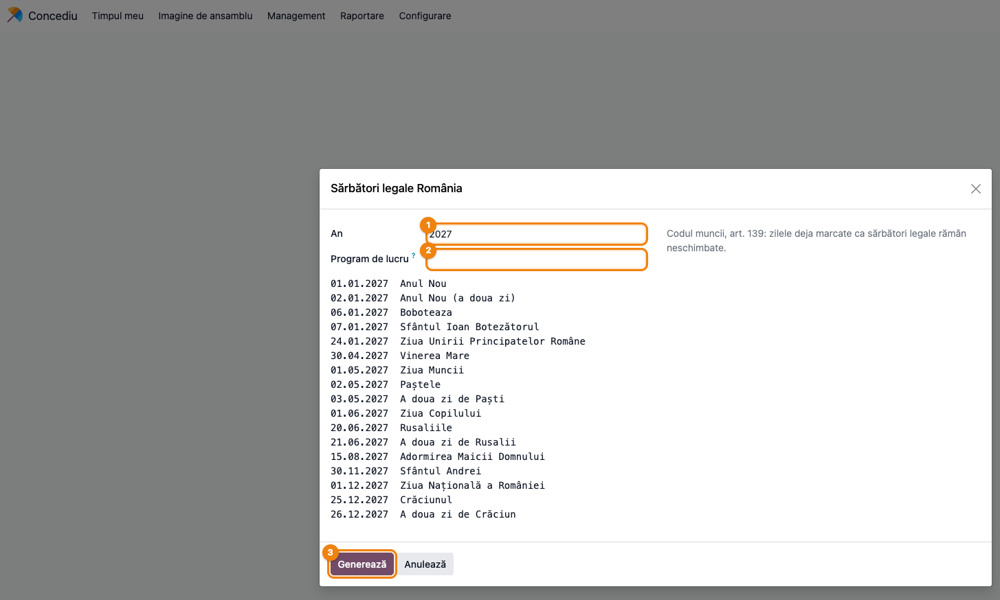

**Găsește pe ecran.** Lista are 17 zile: Anul Nou (două zile), Boboteaza, Sfântul Ioan, Ziua Unirii, Vinerea Mare, Paștele și a doua zi de Paști, Ziua Muncii, Ziua Copilului, Rusaliile (două zile), Adormirea Maicii Domnului, Sfântul Andrei, Ziua Națională, Crăciunul (două zile). Dacă două sărbători cad în aceeași zi, apar pe un singur rând, cu numele unite.

**Verifică.** Datele Paștelui și ale Rusaliilor corespund calendarului ortodox al anului (în captură, anul 2027: Paștele pe 02.05, Rusaliile pe 20.06).

**Treci mai departe.** Apăsați **Generează**.

### Pasul 2 — Sărbătorile create

Se deschide lista **Sărbători legale**, doar cu zilele create acum. Aceleași înregistrări se găsesc oricând în lista standard **Concediu → Configurare → Sărbători legale**.

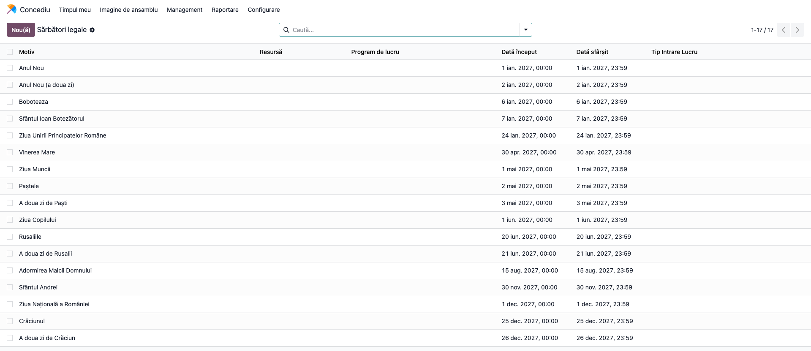

**Găsește pe ecran.** Fiecare sărbătoare este o zi întreagă, de la 00:00 la 23:59; coloana **Program de lucru** este goală (se aplică tuturor programelor).

**Verifică.** Rulat a doua oară pe același an, wizard-ul nu dublează nimic: zilele deja marcate ca sărbători sunt lăsate neschimbate, iar lista se deschide goală. Punțile acordate prin HG pentru sistemul bugetar nu sunt sărbători legale și nu se generează.

### Pasul 3 — Codurile de pontaj

Din **Concediu → Configurare → Pontaj (RO) → Coduri pontaj** se deschide lista codurilor livrate. Lista se modifică direct pe rând, de către administratorul de concedii.

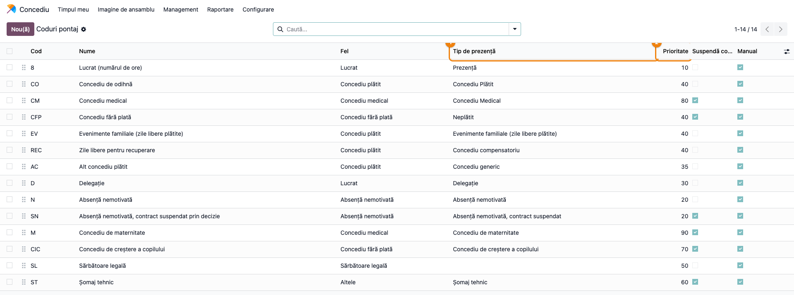

**Găsește pe ecran.**
- **Cod** — simbolul scris în celulă; pentru ziua lucrată (`8`, „Lucrat (numărul de ore)"), celula arată numărul de ore din program.
- **Tip de prezență** — legătura cu tipul de prezență al concediilor: un concediu aprobat apare cu codul tipului lui de prezență (Concediu Plătit → `CO`, Concediu Medical → `CM`, Neplătit → `CFP`).
- **Prioritate** — ordinea între coduri în aceeași zi: `M` 90, `CM` 80, `CIC` 70, `ST` 60, `SL` 50, `CO`/`CFP`/`EV`/`REC` 40, `AC` 35, `D` 30, `N`/`SN` 20, ziua lucrată 10.
- **Suspendă co...** (Suspendă contractul; antetul coloanei e trunchiat) — bifat la `CM`, `CFP`, `SN`, `M`, `CIC`, `ST`. `N` **nu** suspendă contractul (art. 51 alin. 2: suspendarea e posibilă, nu automată); când există decizia de suspendare folosiți `SN`.
- **Manual** — codul apare în meniul de corecție al celulei.

**Verifică.** O corecție manuală bate orice cod generat. Între codurile generate în aceeași zi câștigă **întâi un cod care suspendă contractul** (CFP, CM, M, CIC, SN, ST), apoi prioritatea cea mai mare: un concediu fără plată peste o sărbătoare apare **CFP**, nu SL (contractul e suspendat, sărbătoarea nu se plătește); concediul medical întrerupe concediul de odihnă (art. 145 alin. 5); sărbătoarea legală bate concediul de odihnă, deci nu se socotește în el. Codurile arhivate rămân recunoscute pe lunile vechi.

### Pasul 4 — Grila lunii

Din **Concediu → Management → Pontaj** se deschide ecranul **Pontaj**, pe luna curentă. Alegeți **Luna**, **An** și, dacă firma are mai multe departamente, **Departament** (implicit „Toate departamentele").

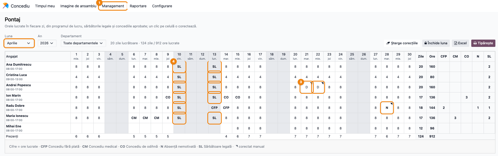

**Găsește pe ecran.**
- Sus, lângă filtre: **zile lucrătoare** ale lunii (fără weekend și sărbători: 20 în aprilie 2026) și totalul zilelor și orelor lucrate de toți angajații.
- Pe fiecare rând: numele și, dedesubt, intervalul programului (ex. „08:00-17:00", la Cristina Luca „09:00-13:00"); apoi zilele: cifra = orele lucrate din program, codul = altă situație. Zilele de weekend rămân goale; pe ecran, coloanele lor nu sunt colorate (pe PDF, zilele libere sunt pe gri).
- **SL** pe 10.04 (Vinerea Mare) și 13.04 (a doua zi de Paști) la angajații cu contract; la Radu Dobre, 13.04 apare **CFP**: concediul lui fără plată 13–14.04 suspendă contractul și bate sărbătoarea. Durata cererii CFP din aplicația standard (1 zi) scade sărbătoarea; pe foaie ziua sărbătorii apare tot CFP, pentru că suspendarea bate SL. La Ion Marin, concediul de odihnă 09.04–15.04 apare ca **CO** doar în zilele lucrătoare care nu sunt sărbători (3 zile).
- Celulele corectate au **colțul marcat**: **N** la Radu Dobre pe 28.04, **D** la Andrei Popescu pe 21 și 22.04. Trecând cu mouse-ul peste o celulă corectată apar codul generat și motivul.
- La Mihai Ene, zilele dinainte de 15.04 (începutul contractului) sunt goale.
- La capătul rândului: **Zile** și **Ore** lucrate, apoi numărul de zile pe fiecare cod folosit în lună (CFP, CM, CO, N, SL). Pe ultimul rând, **Prezenți**: câți angajați au lucrat în fiecare zi.
- Sub grilă, legenda codurilor folosite și semnul „corectat manual".

**Verifică.**
- Zilele cu **D** (delegație) se numără la zile și ore lucrate (Andrei Popescu: 20 de zile, 160 de ore), nu într-o coloană separată.
- Pentru fiecare angajat cu contract toată luna: **Zile** + toate coloanele de coduri (inclusiv SL) = zilele de luni–vineri ale lunii (22 în aprilie 2026; Radu Dobre: 18 + CFP 2 + N 1 + SL 1 = 22; Ion Marin: 17 + CO 3 + SL 2 = 22).
- În legendă, fiecare cod apare cu numele lui (**SL** = Sărbătoare legală).

### Pasul 5 — Corecția unei zile

Faceți clic pe celula de corectat. Se deschide meniul cu numele angajatului și ziua, apoi lista codurilor manuale; alegeți codul.

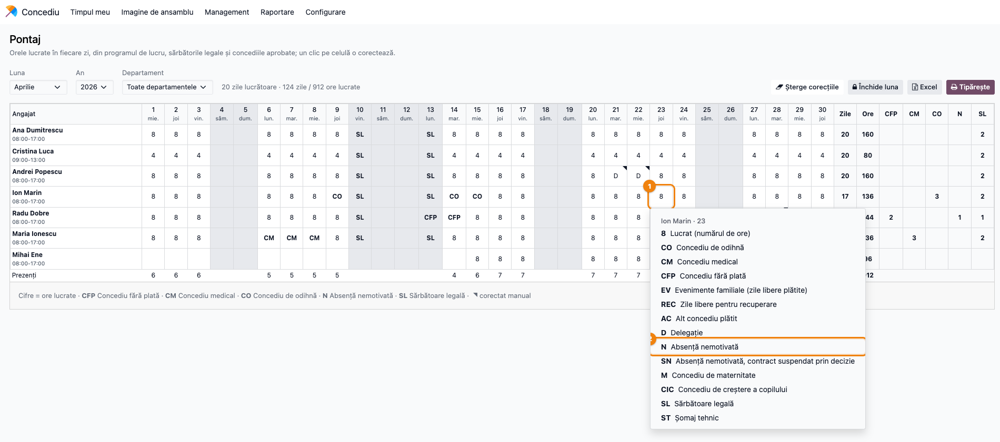

**Găsește pe ecran.** În antetul meniului, angajatul și ziua („Ion Marin · 23"); apoi codurile marcate **Manual** în lista de coduri, fiecare cu simbolul și numele.

**Verifică.**
- Alegerea codului salvează corecția și reîncarcă foaia; celula primește colțul marcat, iar totalurile rândului se recalculează.
- Pe o celulă deja corectată, meniul are la final **Înapoi la codul generat**, care șterge corecția și readuce ziua la program și concedii. Alegerea codului pe care sistemul l-ar fi generat oricum nu salvează nicio corecție.
- Zilele din afara contractului și toate zilele unei luni închise nu deschid meniul.
- O zi cu alt orar decât programul (alte ore de început și sfârșit, alt număr de ore) nu se corectează din grilă, ci din lista **Corecții** (pasul 6).

**Treci mai departe.** Butonul **Șterge corecțiile** (apare doar dacă luna are corecții) cere confirmare și șterge toate corecțiile lunii, pentru toți angajații; ele nu se pot recupera.

### Pasul 6 — Lista corecțiilor

Ofițerul de concedii deschide din **Concediu → Management → Corecții pontaj** lista tuturor corecțiilor, grupate pe lună.

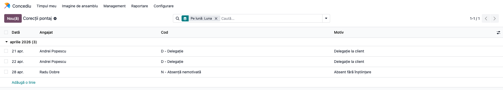

**Găsește pe ecran.** Cele trei corecții din grilă: 21 și 22.04 Andrei Popescu **D**, 28.04 Radu Dobre **N**, cu motivele. Coloanele opționale **Început** și **Sfârșit** (din selectorul de coloane din dreapta antetului) țin ora de început și de sfârșit a unei zile lucrate cu alt orar; Coloana opțională **Ore** ține numărul de ore al unei zile lucrate cu alt program; goală, se socotesc orele din program (la D, cele 8 ore).

**Verifică.** Un angajat are o singură corecție pe zi. Aici se completează motivul pentru o corecție făcută din grilă. Pe o lună închisă, lista refuză orice adăugare, modificare sau ștergere.

### Pasul 7 — PDF-ul de semnat

Pe ecranul **Pontaj**, butonul **Tipărește** produce PDF-ul A4 peisaj al lunii afișate.

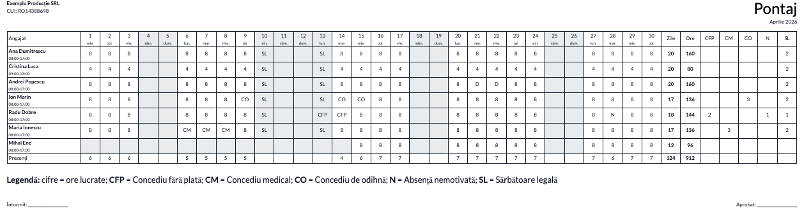

**Găsește pe ecran.** În antet, firma și CUI-ul, titlul **Pontaj** și luna; apoi grila (aceleași celule și totaluri ca pe ecran), **Legendă** și rândul de semnături **Întocmit** / **Aprobat**.

**Verifică.** Totalurile pe rând (**Zile**, **Ore**, zilele pe cod) sunt identice cu cele de pe ecran; Weekendul și sărbătorile legale sunt pe gri. PDF-ul unei luni închise poartă mențiunea **Lună închisă**.

### Pasul 8 — Exportul Excel

Butonul **Excel** descarcă `pontaj_<an>_<lună>.xlsx` pentru luna afișată.

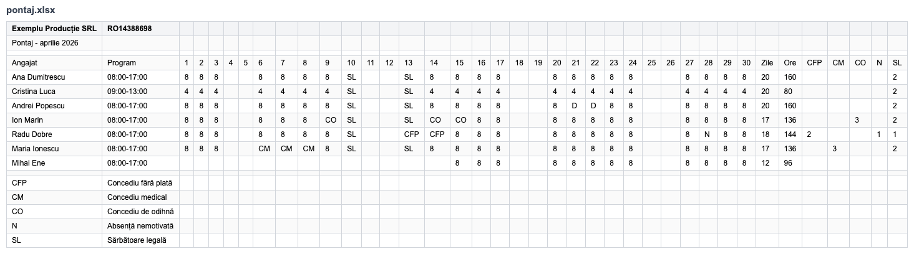

**Găsește pe ecran.** Pe primul rând firma și CUI-ul (CUI-ul stă în coloana zilei 2, pe care o lărgește), pe al doilea „Pontaj - aprilie 2026"; apoi capul de tabel (**Angajat**, **Program**, zilele 1–30, **Zile**, **Ore**, codurile folosite), un rând pe angajat și, la final, legenda codurilor.

**Verifică.** Valorile sunt cele de pe ecran; în coloanele de coduri, zilele lipsă apar ca 0 (pe ecran, goale). Numele și motivele care încep cu „=" rămân text, nu devin formule. Captura arată datele fișierului; formatarea din Excel (chenare, zilele libere pe gri) nu se vede aici.

### Pasul 9 — Închiderea lunii

După salarizare, pe luna respectivă apăsați **Închide luna**. Foaia se reîncarcă cu eticheta **Lună închisă**; butoanele **Șterge corecțiile** și **Închide luna** dispar, iar administratorul de concedii are în locul lor **Redeschide**.

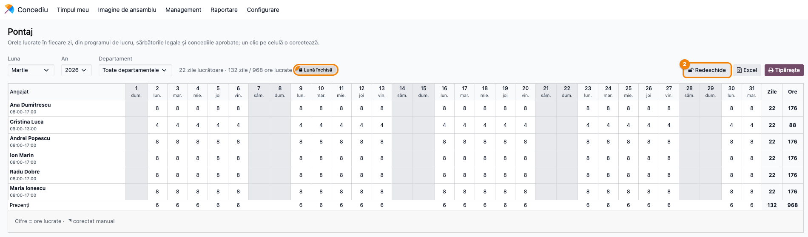

**Găsește pe ecran.** Eticheta **Lună închisă** lângă totaluri; **Redeschide**, **Excel** și **Tipărește** în dreapta. Un clic pe celulă nu mai deschide meniul de corecție.

**Verifică.** Închiderea blochează doar corecțiile. Foaia se reconstruiește în continuare din program, sărbători și concedii: un concediu aprobat ulterior pe o zi din luna închisă apare pe foaie. Verificați, înainte de închidere, că toate concediile lunii sunt aprobate.

### Pasul 10 — Evidența lunilor

Ofițerul de concedii vede în **Concediu → Management → Luni pontaj** starea fiecărei luni, cine și când a închis-o.

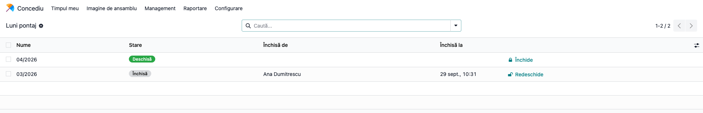

**Găsește pe ecran.** **Nume** (lună/an), **Stare** (Deschisă / Închisă), **Închisă de**, **Închisă la** și butonul **Închide** sau **Redeschide** pe fiecare rând.

**Verifică.** O lună apare aici după prima închidere, tipărire sau export. **Redeschide** apare doar administratorului de concedii. O lună închisă nu se poate șterge.

### Pasul 11 — Tipărirea cererii de concediu

Deschideți cererea de concediu (ex. din **Concediu → Management → Concediu**), apoi, din rotița de lângă titlul cererii, alegeți **Cerere de concediu (RO)**.

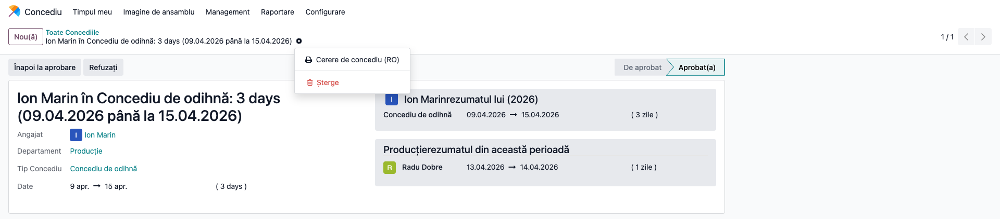

**Găsește pe ecran.** Cererea Ion Marin, **Concediu de odihnă**, 09.04.2026–15.04.2026, 3 zile, starea **Aprobat(a)**; în meniul rotiței, **Cerere de concediu (RO)**.

**Verifică.** Durata cererii (3 zile) nu cuprinde Vinerea Mare, Paștele și a doua zi de Paști, fiindcă sărbătorile au fost generate înaintea cererii. Titlul cererii vine din aplicația standard, cu traducerea ei; tot de acolo vin titlurile lipite „Ion Marinrezumatul lui" și „Producțierezumatul din această perioadă" din panourile din dreapta.

### Pasul 12 — Cererea tipărită

Se descarcă PDF-ul cererii, de semnat de angajat și de aprobator.

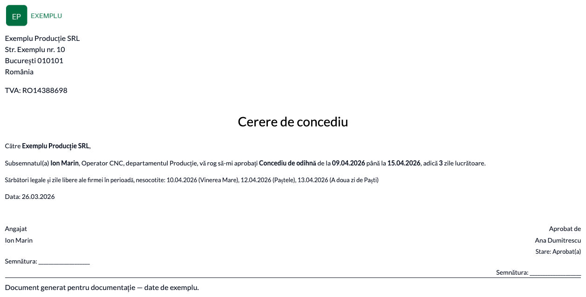

**Găsește pe ecran.** Destinatarul (firma), textul cererii cu numele, funcția, departamentul, tipul de concediu și perioada; durata în zile lucrătoare („adică 3 zile lucrătoare"); rândul **Sărbători legale și zile libere ale firmei în perioadă, nesocotite**, zi cu zi (10.04 Vinerea Mare, 12.04 Paștele, 13.04 A doua zi de Paști); data cererii (26.03.2026); în dreapta, **Aprobat de** Ana Dumitrescu și starea.


**Verifică.** **Zile lucrătoare** = zilele din perioadă minus weekendurile, sărbătorile și zilele libere ale firmei listate dedesubt. O cerere respinsă poartă mențiunea vizibilă **RESPINSĂ** și „Respinsă de"; una neaprobată are doar „Aprobare". Documentul se tipărește în limba contactului angajatului (câmpul limbă de pe contactul de lucru); un angajat al cărui contact este în engleză primește cererea în engleză.

### Note de monografie și raportare

Modulul **nu generează note contabile** și nu produce declarații. De reținut pentru raportare și salarizare:

- foaia este calculată la fiecare deschidere; singurele înregistrări proprii sunt corecțiile și lunile (deschise / închise);
- ordinea pe aceeași zi: corecția manuală; în afara contractului (gol); ziua fără ore în program (gol); apoi, dintre sărbătoare și concediile aprobate, întâi codul care suspendă contractul, apoi cel cu prioritatea cea mai mare; altfel orele din program;
- un concediu pe ore sau pe jumătate de zi apare pe foaie ca **zi întreagă** de concediu;
- modulul nu calculează salarii și nu transmite zilele către un modul de salarizare; foaia semnată (PDF) și exportul Excel se predau salarizării.

## 7. Legături cu alte module / declarații

| Modul / proces | Rol în flux | Tip legătură |
|---|---|---|
| `hr_holidays` (Concediu) | concediile aprobate, tipurile de concediu, sărbătorile (lista standard **Sărbători legale**), alocările și planurile de acumulare, cererea tipărită | dependență (manifest) |
| `hr_work_entry_holidays` / `hr_work_entry` | tipurile de prezență (work entry type) care leagă tipul de concediu de codul din pontaj | dependență (manifest) |
| `resource` (Program de lucru) | orele pe zi și intervalul „de la–până la" al fiecărui angajat | dependență indirectă |
| `deltatech_hr_leave_dashboard` | dacă este instalat, pontajul apare și ca tab în tabloul **Concediile echipei**, pentru ofițerul Concediu | extensie opțională, fără dependență |

Ce este automat: orele zilnice din program, sărbătorile din lista de sărbători, codurile concediilor aprobate, prioritatea codurilor pe aceeași zi, totalurile, blocarea corecțiilor pe o lună închisă, activitatea pentru aprobator și mesajul pe alocare către angajat (dacă are utilizator) cu 60 de zile înainte de expirarea zilelor de concediu reportate — mesajul face parte din dovada că salariatul a fost informat.
Ce rămâne manual: generarea sărbătorilor pe fiecare an, corecțiile (absențe, delegații, zile cu alt orar), închiderea lunii după salarizare, semnarea foii, transmiterea către salarizare.

## 8. Verificări pentru consultant

- [ ] Meniul **Concediu → Management → Pontaj** apare pentru ofițerul Concediu și lipsește pentru un angajat simplu; **Concediu → Configurare → Pontaj (RO) → Coduri pontaj** apare doar administratorului de concedii.
- [ ] Wizard-ul **Generează sărbătorile legale** creează 17 zile pentru un an; rulat a doua oară pe același an, nu creează nimic.
- [ ] Paștele și Rusaliile generate corespund calendarului ortodox al anului.
- [ ] În grilă, sărbătorile apar ca **SL** în zilele lucrătoare; **zile lucrătoare** de sus = zilele de luni–vineri ale lunii minus sărbătorile care cad în ele.
- [ ] Sub numele fiecărui angajat apare intervalul programului lui; un angajat cu alt program are alt interval și alte ore în celule.
- [ ] Un concediu de odihnă aprobat peste o sărbătoare apare ca **CO** doar în zilele care nu sunt sărbători, iar sărbătorile rămân **SL**; un concediu fără plată peste o sărbătoare apare **CFP** și în ziua sărbătorii.
- [ ] Codul **N** nu are bifat **Suspendă contractul**; **SN** și **ST** îl au.
- [ ] Un angajat cu contract început în cursul lunii are zilele dinainte goale și necorectabile.
- [ ] Un clic pe o celulă și alegerea **N** creează o corecție cu colțul marcat; **Înapoi la codul generat** o șterge; totalurile se recalculează de fiecare dată.
- [ ] Corecția apare în **Management → Corecții pontaj**, cu data, angajatul și codul.
- [ ] Totalurile din **Tipărește** (PDF) și din **Excel** sunt identice cu cele de pe ecran.
- [ ] După **Închide luna**, celulele nu mai deschid meniul, iar o corecție adăugată din lista **Corecții** pe acea lună este refuzată cu mesajul de lună închisă.
- [ ] Ofițerul nu are **Redeschide**; administratorul de concedii redeschide luna, iar corecțiile se pot modifica din nou.
- [ ] Din cererea de concediu, rotița → **Cerere de concediu (RO)** produce PDF-ul cu perioada, **Zile lucrătoare** și sărbătorile din interval listate zi cu zi ca nesocotite.

## 9. Mesaje de eroare frecvente

| Mesaj / simptom | Cauză probabilă | Remediere |
|-----------------|-----------------|-----------|
| „Doar ofițerul de concedii poate deschide pontajul." | Utilizatorul nu are rolul **Responsabil: Gestionați toate cererile** în Concediu | Dați-i rolul în **Setări → Utilizatori** |
| „Pontajul pe MM/AAAA e închis: redeschideți luna ca să-l modificați." | Corecție pe o lună închisă (din grilă sau din lista **Corecții**) | Administratorul de concedii apasă **Redeschide** pe foaie sau în **Luni** |
| „Doar administratorul de concedii poate redeschide o lună închisă." | Ofițerul încearcă redeschiderea | Redeschiderea o face utilizatorul cu rolul **Administrator** în Concediu |
| „O lună de pontaj închisă nu se poate șterge." | Ștergere din lista **Luni** a unei luni închise | Redeschideți luna înainte, dacă ștergerea e chiar necesară |
| „Un angajat are o singură corecție pe zi." | A doua corecție pe aceeași zi, din lista **Corecții** | Modificați corecția existentă |
| „Angajatul nu e în pontajul pe MM/AAAA." | Angajatul nu are contract în luna respectivă sau e al altei companii | Verificați datele contractului și compania curentă |
| „Niciun angajat cu contract în această lună." | Compania curentă nu are angajați activi sau cu contract în lună | Comutați compania sau verificați contractele |
| O zi de sărbătoare apare cu ore lucrate | Sărbătorile anului nu au fost generate, sau au fost generate pe alt program de lucru decât al angajatului | Rulați **Generează sărbătorile legale** pentru an, cu **Program de lucru** gol |
| Un concediu aprobat apare cu un cod de trei litere necunoscut | Tipul lui de prezență nu este legat de niciun cod de pontaj | Legați tipul de prezență în **Coduri pontaj** sau schimbați **Tip intrare muncă** pe tipul de concediu |
| Cererea tipărită iese în engleză | Contactul de lucru al angajatului are limba engleză | Setați limba română pe contactul angajatului |

## 10. Capturi de ecran

Capturile (`readme/screenshots/`) sunt generate automat din `tests/test_screenshots.py` (mixinul `ScreenshotCase` din `l10n_ro_doc_screenshots`, import defensiv), cu interfața în limba română, pe o companie RO („Exemplu Producție SRL", țara România, RON) și datele din secțiunea 4. Modulul nu are contabilitate, deci planul de conturi nu intervine. Luna pozată este luna Paștelui ortodox din anul curent, iar luna dinaintea ei este închisă; datele citate în pașii 4–12 (aprilie 2026, 10.04, 13.04 etc.) corespund capturilor generate în 2026 și se schimbă dacă testul se rulează în alt an. Utilizatorul care face capturile este administratorul (rol Administrator Concediu), iar browserul capturilor rulează pe fusul Europe/Bucharest. În ordinea pașilor din secțiunea 6:

1. `01_sarbatori_wizard.png` — fereastra „Sărbători legale România", cu anul următor și lista sărbătorilor.
2. `02_sarbatori_generate.png` — lista „Sărbători legale" cu zilele create.
3. `03_coduri_pontaj.png` — lista „Coduri pontaj", cu tipul de prezență și prioritatea.
4. `04_grila_luna.png` — grila lunii: sărbători, concedii, corecții, totaluri.
5. `05_meniu_corectie.png` — meniul de corecție deschis pe o celulă.
6. `06_lista_corectii.png` — lista „Corecții pontaj" pe luna pozată.
7. `07_pontaj_pdf.png` — PDF-ul pontajului (randarea HTML a raportului).
8. `08_pontaj_excel.png` — conținutul exportului Excel.
9. `09_luna_inchisa.png` — luna închisă, cu „Lună închisă" și „Redeschide".
10. `10_luni_pontaj.png` — lista „Luni pontaj".
11. `11_cerere_tiparire.png` — cererea de concediu cu meniul de tipărire deschis.
12. `12_cerere_concediu_pdf.png` — cererea de concediu tipărită.

Regenerare (bază fără date demo, ca pe foaie să apară doar angajații seedați):

```bash
./odoo/odoo-bin -c odoo.conf -d <db> --without-demo=all \
    -i l10n_ro_hr_pontaj,l10n_ro_doc_screenshots \
    --test-tags=fise_screenshots --stop-after-init
```

## 11. Observații pentru manual

Păstrați în manual trei idei. Întâi, **foaia se calculează, nu se tastează**: dacă o zi e greșită, cauza e de obicei în sursă — programul angajatului, sărbătorile anului sau un concediu neaprobat — și acolo se corectează; corecția manuală pe celulă e pentru ce nu există în altă parte (absența nemotivată, delegația). Apoi, **prioritatea codurilor** explică de ce o zi arată un anumit cod: concediul medical bate concediul de odihnă, sărbătoarea legală nu se socotește în concediul de odihnă, iar corecția manuală bate tot. În al treilea rând, **închiderea lunii** blochează corecțiile, dar nu și concediile: închideți luna doar după ce toate concediile ei sunt aprobate și foaia a fost semnată. Amintiți la configurare că sărbătorile se generează o dată pe an, înainte ca angajații să ceară concediile anului: durata unei cereri create înainte de generare nu scade sărbătorile.
