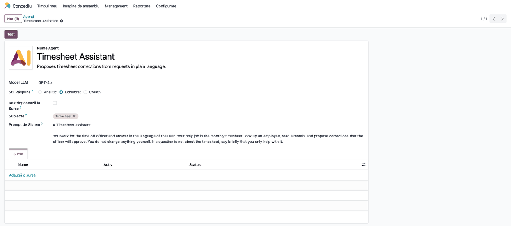
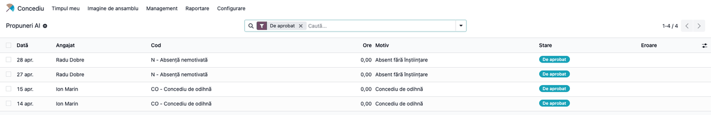
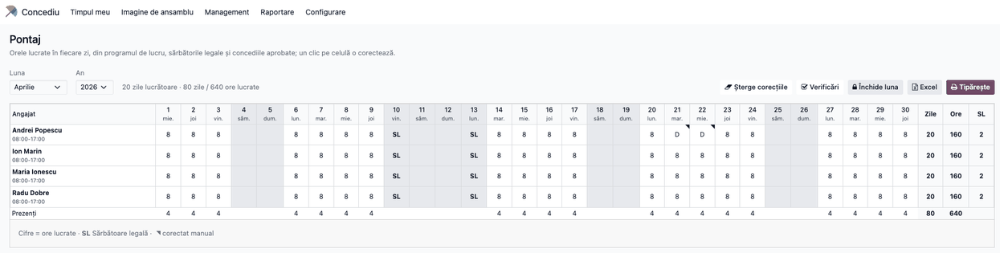

# Fișă Modul: Asistent AI pentru pontaj (corecții propuse, aprobate de ofițer)

**Modul:** `l10n_ro_hr_pontaj_ai`
**Utilizator principal:** Responsabil resurse umane / salarizare (rol Concediu „Responsabil: Gestionați toate cererile") — scrie cererile în chat și aprobă propunerile; administratorul Odoo (rol „Administrator") configurează modelul AI
**Prioritate:** 🟢 Scăzută (economisește timp la corecțiile lunii; foaia și salarizarea funcționează la fel fără el)
**Stare:** ⚠️ **Alpha** — uneltele, propunerile și aprobarea sunt testate automat, dar comportamentul unui model real (alegerea uneltei, ambiguitățile, formularea motivului) **nu a fost încă verificat**; vezi secțiunea 11.

---

## 1. Scop business

Corecțiile pontajului (o absență nemotivată, o delegație, o zi lucrată sâmbătă) vin de obicei ca mesaje: un email, o discuție, un apel. Ofițerul le transcrie apoi celulă cu celulă. Modulul îi dă un **asistent** în chatul Odoo căruia îi scrie cererea așa cum ar spune-o unui coleg: *„Radu Dobre a lipsit pe 27 și 28 aprilie, Andrei Popescu e în delegație 21–22"*. Asistentul caută angajații, citește luna și **propune** corecțiile; ofițerul le vede într-o listă și le aprobă sau le respinge.

Ce primește consultantul:

- **agentul „Timesheet Assistant"** (peste modulul Enterprise **AI**), cu subiectul **Timesheet** și trei unelte: *Caută angajați*, *Luna unui angajat* și *Propune o corecție*;
- **lista Propuneri AI** (*Concediu → Management → Propuneri AI*): angajatul, ziua, codul, orele, motivul, cererea originală și starea (de aprobat / aplicată / respinsă);
- aprobarea prin **Aplică** / **Respinge**, pe una sau pe mai multe propuneri.

**Principiul:** asistentul nu scrie niciodată în foaie. Doar ofițerul o face, apăsând **Aplică**, prin aceleași reguli ca ecranul *Pontaj*.

## 2. Bază legală și context

Modulul nu introduce reguli de pontaj noi; folosește pe cele din `l10n_ro_hr_pontaj` (Codul muncii, art. 119: evidența orelor lucrate zilnic — vezi fișa acelui modul). Ce aduce în plus e prelucrarea datelor de către un furnizor extern de model:

- **Date personale (GDPR)**: numele angajaților și zilele de absență din mesaje ajung la furnizorul de model ales în *Setări → AI*. Concediul medical este **dată privind sănătatea** (categorie specială). Clientul trebuie să aibă acord de prelucrare cu furnizorul și să decidă dacă folosește modulul; *temeiul exact (articole din Regulamentul UE 2016/679 și Legea 190/2018) nu a fost verificat pe text pentru această fișă*: de confirmat cu responsabilul cu protecția datelor al clientului.
- **Decizia rămâne a omului**: asistentul doar propune; corecția intră în foaie abia când ofițerul o aplică, cu numele lui și data în evidență (*Decis de*, *Decis la*).
- **Minimizarea datelor**: uneltele întorc doar id, nume, departament și funcție; CNP, IBAN și adresa nu părăsesc Odoo. Instrucțiunile îi spun modelului să nu ceară și să nu repete identificatori personali.

## 3. Utilizatori și roluri

| Cine | Ce poate face |
|---|---|
| Rolul Concediu **Responsabil: Gestionați toate cererile** („ofițer Concediu") | folosește agentul (uneltele cer acest rol), vede lista **Propuneri AI**, aplică sau respinge propuneri |
| **Administrator** Odoo | configurează furnizorul de model și cheia (*Setări → AI*), vede și modifică agentul, subiectul și uneltele |
| Orice alt utilizator intern | poate deschide chatul cu agentul, dar prima unealtă întoarce un refuz de acces; nu vede meniul *Propuneri AI* |

Uneltele rulează cu **drepturile utilizatorului din chat**, nu cu drepturi de administrator: un utilizator fără rolul de ofițer nu poate citi luna unui angajat și nu poate propune nimic.

## 4. Conturi și date implicate

Nu sunt implicate conturi contabile. Date de demo (cele din capturi, firma „Exemplu Producție SRL", luna Paștelui ortodox): patru angajați în departamentul Producție (Andrei Popescu, Ion Marin, Radu Dobre, Maria Ionescu), sărbătorile legale generate și patru propuneri create prin aceleași unelte pe care le cheamă asistentul: `N` pentru Radu Dobre pe 27–28 aprilie, `D` pentru Andrei Popescu pe 21–22, `CO` pentru Ion Marin pe 14–15 și 6 ore lucrate sâmbătă pentru Maria Ionescu. Cea a lui Andrei este aplicată, cea a Mariei respinsă, celelalte de aprobat.

## 5. Configurare inițială

1. Instalați `l10n_ro_hr_pontaj_ai` (aduce `l10n_ro_hr_pontaj` și modulul Enterprise **AI**, `ai_app`). Modulul cere Odoo Enterprise.
2. În **Setări → AI** alegeți furnizorul de model și introduceți cheia (de către administrator). **Verificați cu clientul acordul de prelucrare** (secțiunea 2).
3. Agentul **Timesheet Assistant** și subiectul **Timesheet** vin gata făcute (*AI → Agenți*). Modelul implicit este `GPT-4o`; se schimbă pe formularul agentului.
4. Dați rolul **Responsabil: Gestionați toate cererile** celor care țin pontajul (ca pentru pontajul propriu-zis).
5. Codurile care se pot propune sunt cele marcate **Manual** în *Concediu → Configurare → Pontaj (RO) → Coduri pontaj* (ex. `CO`, `CM`, `CFP`, `N`, `D`); un număr de ore înseamnă o zi lucrată.

## 6. Flux de utilizare

### Pasul 1 — Agentul

Din **AI → Agenți → Timesheet Assistant** se vede configurarea: modelul, stilul răspunsului, subiectul **Timesheet** și promptul de sistem (în engleză, intenționat: îl citește modelul).



**Găsește pe ecran.** *Model LLM*, *Stil Răspuns*, *Subiecte* (Timesheet) și *Prompt de Sistem*. Butonul **Test** deschide chatul cu agentul.

**Verifică.** Subiectul **Timesheet** are trei unelte: *Timesheet: Find employees*, *Timesheet: Month of an employee* și *Timesheet: Propose a correction* (*AI → Agenți → Subiecte*, sau *Setări → Tehnic → Acțiuni de server*, cu opțiunea *Use in AI* bifată).

### Pasul 2 — Cererea în chat

Ofițerul deschide chatul cu agentul și scrie cererea. Exemple: *„Radu Dobre a lipsit pe 27 și 28 aprilie"*, *„Ion Marin în concediu 14–15 aprilie"*, *„Maria Ionescu a lucrat sâmbătă 6 ore la inventar"*. Asistentul caută angajatul (întreabă dacă sunt mai mulți sau dacă perioada nu e clară), poate citi luna și propune corecțiile, apoi răspunde cu ce a propus și ce a sărit.

*Captura chatului nu este generată: cere un model real, iar pe baza de capturi nu este configurat niciunul.*

**Verifică.** Răspunsul spune că propunerile **așteaptă aprobare** și nu că foaia s-a schimbat. La absențe și concedii asistentul **sare** weekendurile și sărbătorile legale, ce spune deja foaia (ex. `8` pe o zi normală), zilele din afara contractului și lunile închise, și spune de ce.

### Pasul 3 — Propunerile de aprobat

Din **Concediu → Management → Propuneri AI** se deschide lista, implicit filtrată pe *De aprobat*.



**Găsește pe ecran.** Un rând pe zi și angajat: data, angajatul, codul (ex. `N - Absență nemotivată`), orele, motivul și starea. Coloanele opționale *Cerere* (textul original al ofițerului), *Decis de* și *Decis la* se activează din selectorul de coloane. Aceeași zi propusă din nou **înlocuiește** propunerea de aprobat.

**Verifică.** Nimic din lista aceasta nu apare încă în foaia de pontaj.

### Pasul 4 — Aplică sau respinge

Selectați propunerile (bifa din stânga) și apăsați **Aplică** sau **Respinge** din antetul listei; pe formular, aceleași butoane, pe o propunere.

**Găsește pe ecran.** După **Aplică**, propunerea trece în starea *Aplicată*, cu *Decis de* și *Decis la*. După **Respinge**, în *Respinsă*. Dacă aplicarea nu se poate (de exemplu luna s-a închis între timp, sau codul nu mai e manual), propunerea **rămâne de aprobat**, cu motivul în coloana *Eroare*, iar ecranul arată un avertisment.

**Verifică.** *Aplică* trece prin aceleași reguli ca o corecție tastată în ecranul *Pontaj*: doar ofițerul o poate face, o lună închisă refuză, iar codul pe care foaia l-ar fi generat oricum nu salvează nicio corecție.

### Pasul 5 — Foaia după aplicare



**Găsește pe ecran.** Zilele aplicate apar cu codul propus (aici `D` la Andrei Popescu pe 21 și 22.04) și cu colțul marcat de corecție manuală, la fel ca orice corecție; apar și în *Concediu → Management → Corecții pontaj*. Propunerile respinse sau rămase de aprobat nu apar.

**Verifică.** Totalurile rândului (zile, ore, zile pe cod) se recalculează, iar *Verificările lunii* (fișa `l10n_ro_hr_pontaj`) văd corecțiile aplicate.

### Note de monografie și raportare

Modulul **nu generează note contabile** și nu produce declarații. De reținut:

- propunerile sunt înregistrări proprii (`l10n.ro.hr.pontaj.suggestion`); foaia rămâne calculată, iar singurele date ale foii sunt corecțiile, create doar la *Aplică*;
- cererea originală (*Cerere*) rămâne pe propunere: dovada a ce a cerut ofițerul și a ce a decis;
- ce se scrie în chat ajunge la furnizorul de model, nu în foaie.

## 7. Legături cu alte module / declarații

| Modul / proces | Rol în flux | Tip legătură |
|---|---|---|
| `l10n_ro_hr_pontaj` | foaia, codurile, corecțiile (`set_cell`), verificările lunii | dependență (manifest) |
| `ai_app` / `ai` (Enterprise) | agenții, subiectele, uneltele, furnizorul de model și cheia | dependență (manifest) |
| `hr_holidays` | rolurile și meniul *Concediu* | dependență indirectă |

Ce este automat: căutarea angajaților, citirea lunii, crearea propunerilor cu sărirea zilelor fără sens, evidența deciziei (*Decis de* / *Decis la*). Ce rămâne manual: formularea cererii, alegerea între mai mulți angajați cu același nume, aprobarea, acordul de prelucrare a datelor cu furnizorul.

## 8. Verificări pentru consultant

- [ ] Modulul se instalează doar pe Odoo Enterprise (cu `ai_app`); *AI → Agenți* arată agentul **Timesheet Assistant** cu subiectul **Timesheet** și trei unelte.
- [ ] Un utilizator fără rolul de ofițer primește refuz de acces la prima unealtă și nu vede *Propuneri AI*.
- [ ] Cu un model configurat: cererea „X a lipsit pe [două zile lucrătoare]" produce două propuneri `N` de aprobat; foaia rămâne neschimbată până la **Aplică**.
- [ ] La absențe și concedii, weekendul și sărbătorile din perioadă sunt sărite (mesaj „weekend sau sărbătoare legală").
- [ ] Dacă există doi angajați cu același nume, asistentul întreabă care; nu alege singur.
- [ ] Un număr de ore („6") pe o zi de weekend devine zi lucrată de 6 ore după **Aplică**.
- [ ] Ce spune deja foaia (ex. `8` pe o zi normală) nu produce propunere.
- [ ] O lună închisă nu primește propuneri; o propunere rămasă din înainte de închidere nu se aplică și arată motivul în *Eroare*.
- [ ] **Aplică** creează corecția în ecranul *Pontaj* și în *Corecții pontaj*; **Respinge** nu schimbă nimic.
- [ ] Aceeași zi propusă din nou înlocuiește propunerea de aprobat (nu o dublează).
- [ ] Nicio unealtă nu întoarce CNP, IBAN sau adresă (căutarea dă id, nume, departament, funcție).

## 9. Mesaje de eroare frecvente

| Mesaj / simptom | Cauză probabilă | Remediere |
|-----------------|-----------------|-----------|
| „Doar ofițerul de concedii poate deschide pontajul." | Utilizatorul din chat nu are rolul **Responsabil: Gestionați toate cererile** | Dați-i rolul în **Setări → Utilizatori** |
| Agentul nu răspunde sau întoarce o eroare de conexiune | Cheia sau furnizorul nu sunt configurate în **Setări → AI** | Introduceți cheia (administrator) și verificați rețeaua |
| „Cod necunoscut X. Codurile care se pot pune: …" | Codul cerut nu există sau nu e marcat *Manual* | Alegeți un cod din listă sau bifați *Manual* în **Coduri pontaj** |
| „Dați o perioadă de cel mult 31 de zile…" | Perioada e prea lungă sau datele sunt în ordine inversă | Împărțiți cererea pe luni |
| „Angajat necunoscut: căutați-l mai întâi." | Id-ul angajatului nu există | Asistentul trebuie să folosească mai întâi *Caută angajați* |
| „luna este închisă" (la propunere) sau eroare la **Aplică** | Luna pontajului e închisă | Administratorul redeschide luna; propunerea rămâne de aprobat |
| Propunerea a rămas de aprobat, cu text în **Eroare** | Aplicarea a eșuat (lună închisă, cod nemanual, angajat ieșit din foaie) | Citiți motivul, corectați și apăsați din nou **Aplică**, sau **Respinge** |
| Asistentul „a schimbat" pontajul (spune că e gata) | Modelul a formulat greșit răspunsul; foaia **nu** se schimbă fără **Aplică** | Verificați lista *Propuneri AI*; ajustați instrucțiunile subiectului |

## 10. Capturi de ecran

Capturile (`static/description/`) sunt generate din `tests/test_screenshots.py` (mixinul `ScreenshotCase` din `l10n_ro_doc_screenshots`, import defensiv), cu interfața în limba română, pe o companie RO („Exemplu Producție SRL") și datele din secțiunea 4. **Propunerile sunt create prin aceleași unelte ale asistentului (`_ai_tool_run`), fără niciun model.** Luna pozată este luna Paștelui ortodox din anul curent. În ordinea pașilor din secțiunea 6:

1. `01_agent.png` — formularul agentului „Timesheet Assistant".
2. `02_propuneri_de_aprobat.png` — lista „Propuneri AI", filtrată pe *De aprobat*.
3. `03_pontaj_dupa_aplicare.png` — foaia lunii, cu zilele aplicate.

Regenerare (portul implicit poate fi ocupat pe un calculator de dezvoltare: dați alt port):

```bash
./odoo/odoo-bin -c odoo.conf -d <db> --without-demo=all --http-port=8973 --gevent-port=8974 \
    -i l10n_ro_hr_pontaj_ai,l10n_ro_doc_screenshots \
    --test-tags=fise_screenshots/l10n_ro_hr_pontaj_ai --stop-after-init
```

## 11. Observații pentru manual

Păstrați în manual patru idei. Întâi, **asistentul propune, ofițerul decide**: nimic din chat nu ajunge în foaie fără **Aplică**, iar răspunsul asistentului trebuie citit ca „am pregătit", nu „am făcut". Apoi, **cererea trebuie să fie precisă**: numele complet, zilele exacte (cu luna), ce s-a întâmplat; asistentul întreabă când nu e sigur, dar o cerere clară economisește o rundă. În al treilea rând, **datele ies din Odoo**: numele și zilele de absență ajung la furnizorul de model, iar concediul medical este dată de sănătate, deci acordul de prelucrare cu furnizorul se face **înainte** de utilizare. În sfârșit, **modulul este în stare Alpha**: comportamentul unui model real (alegerea uneltei, formularea motivului, tratarea cererilor ambigue) nu a fost încă verificat pe cereri reale; primele luni se folosește cu atenție sporită la lista de aprobare, iar instrucțiunile subiectului (*AI → Agenți → Subiecte → Timesheet*) se ajustează după ce se văd cazurile reale.
