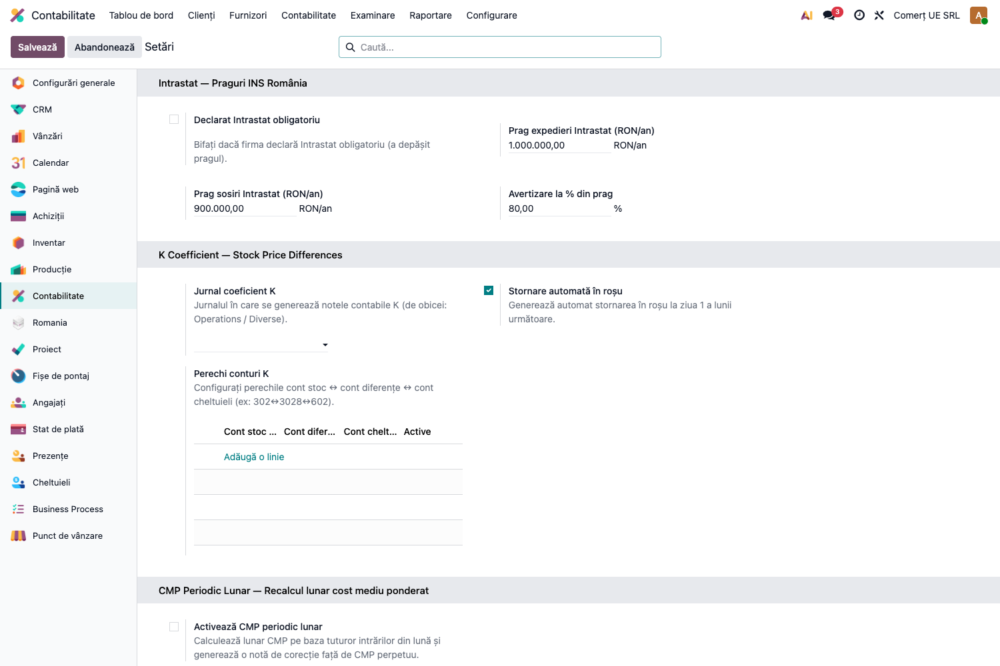
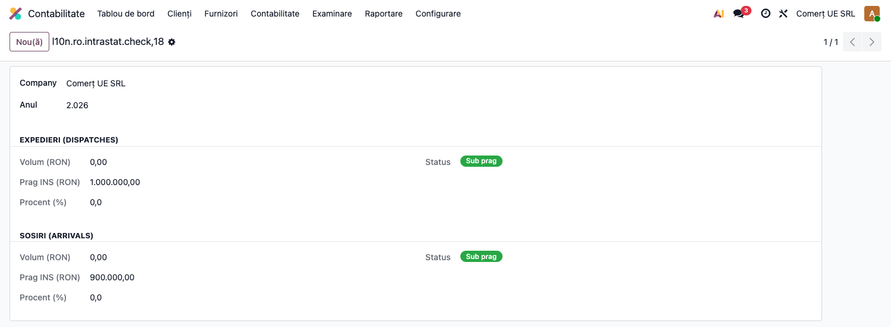
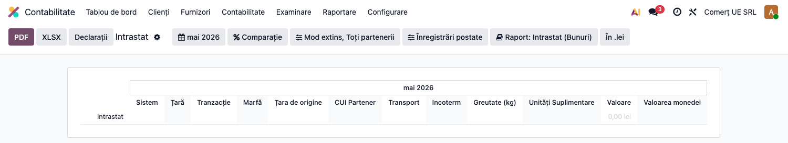
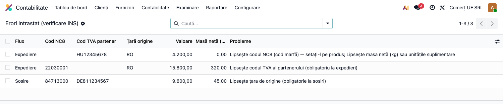

# Fișă Modul: Intrastat România — export XML INS, praguri și verificare erori

**Modul:** `l10n_ro_intrastat_enhancement`
**FR:** FR-47
**Utilizator principal:** Contabil / responsabil raportări statistice (Intrastat)
**Prioritate:** 🟡 Medie (obligatorie doar peste prag; lunară pentru declaranți)

---

## 1. Scop business

Modulul extinde declarația Intrastat din Odoo Enterprise cu tot ce trebuie pentru **depunerea
efectivă la Institutul Național de Statistică (INS)**: **export XML** în formatul oficial INS,
**monitorizarea pragurilor anuale** (cu avertizări automate la apropierea/depășirea pragului),
o **verificare a erorilor** care prinde câmpurile lipsă înainte de depunere și un mecanism de
**actualizare a codurilor CN** (Nomenclatura Combinată) publicate anual de INS.

Se instalează automat când sunt prezente raportul Intrastat de bază (`l10n_ro_intrastat`) și
gestionarea livrărilor (`stock_delivery`).

## 2. Bază legală și context

Declarația statistică Intrastat este obligatorie pentru operatorii care depășesc pragurile
anuale de expediere/sosire de bunuri în relația intra-UE, conform **Regulamentului (UE)
2019/2152** și normelor metodologice INS (Legea 422/2006 privind organizarea statisticii
Intrastat). Pragurile sunt stabilite anual de INS (valori 2025 livrate ca implicite:
**1.000.000 RON expedieri / 900.000 RON sosiri**). Declarația se depune lunar, până în jurul
datei de 15 a lunii următoare, pe portalul INS (https://intrastat.ro).

> Intrastat este o raportare **statistică**, nu fiscală — modulul nu generează note contabile.

## 3. Utilizatori și roluri

Contabilul / responsabilul de raportări depune declarația lunară și urmărește pragurile.

Roluri recomandate pentru testare:
- Administrator funcțional: instalează modulul, configurează pragurile pe companie;
- Utilizator operațional (grup „Contabil" — `account.group_account_user`): rulează verificarea
  de erori, exportă XML, consultă verificarea de prag;
- Contabil/manager: confirmă obligația de declarare și volumul față de prag.

## 4. Conturi și date implicate

Modulul **nu atinge conturi contabile** — lucrează cu raportul Intrastat (date statistice din
facturile postate). Datele relevante pentru o linie corectă:
- pe **produs**: codul Intrastat **NC8** (Nomenclatura Combinată) și țara de origine;
- pe **partener**: codul TVA intra-UE (la expedieri) și țara;
- pe **mișcare/factură**: natura tranzacției, masa netă / unitățile suplimentare, modul de
  transport și regiunea (la declarația extinsă).

Date minime pentru demo: companie RO, parteneri din alte state UE, produse cu cod Intrastat,
facturi de vânzare/achiziție intra-UE postate în luna declarată.

## 5. Configurare inițială

1. Instalați modulul (auto-install când există `l10n_ro_intrastat` + `stock_delivery`).
2. Deschideți **Setări → Contabilitate**, blocul **Intrastat — Praguri INS România**:
   bifați **Declarat Intrastat obligatoriu** (dacă firma a depășit deja pragul), ajustați
   **Pragul expedieri** / **Pragul sosiri** (RON/an) și **Avertizare la % din prag** (implicit 80%).
3. Marcați produsele comercializate intra-UE cu **codul Intrastat (NC8)** pe fișa produsului.
4. Verificați versiunile nomenclatoarelor (CN, transport, termeni de livrare, țări) — se
   stochează în parametri de sistem și se pot actualiza anual fără modificări de cod.



## 6. Flux de utilizare

### Pasul 1 — Verificarea pragului anual

Accesați **Contabilitate → Raportare → Intrastat → Verificare Prag Intrastat**. Alegeți anul
și apăsați **Verifică**. **Găsiți pe ecran**, pe ambele direcții (expedieri și sosiri):
volumul calculat (RON), pragul INS configurat, procentul atins și starea — **Sub prag** /
**Atenție** / **Depășit** / **Declarat obligatoriu**. Volumul se calculează din facturile și
stornările postate către parteneri UE (exclus România) ale căror produse au cod Intrastat,
convertite în RON.

**Verificați**: dacă o direcție arată **Depășit** sau **Atenție**, firma trebuie să declare
Intrastat pentru acea direcție; bifați „Declarat obligatoriu" în setări dacă nu e deja.



### Pasul 2 — Raportul Intrastat și verificarea erorilor (înainte de export)

Deschideți **Contabilitate → Raportare → Intrastat** (raportul standard Enterprise), cu luna
și filtrele de declarație (mod normal/extins, direcție). Acesta este punctul din care se
lansează verificarea erorilor și exportul XML pentru INS.

> **Notă (stare curentă):** butoanele **XML** și **Verificare INS** adăugate de modul nu apar
> momentan în bara de instrumente a raportului în Odoo 19 — un regres legat de separarea
> handler-elor `goods`/`services` în O19 (vezi secțiunea de mai jos „Ce e automat / manual" și
> `readme/ROADMAP` / TODO suită). Verificarea și exportul **funcționează la nivel de cod**
> (acoperite de teste), urmează re-expunerea lor în toolbar.

**Verificarea erorilor INS** rulează exact aceeași interogare ca exportul și listează liniile
cu câmpuri obligatorii lipsă — **cod NC8**, valoare, masă netă/unități suplimentare, natura
tranzacției, **cod TVA partener** (la expedieri), **țară de origine** (la sosiri), mod de
transport/regiune (la declarația extinsă). Acestea sunt cauzele tipice de respingere la INS.

**Verificați**: lista de erori e goală (sau corectați produsele/partenerii semnalați și
reverificați) **înainte** de a genera fișierul.





### Pasul 3 — Exportul XML pentru INS

După ce verificarea e curată, selectați perioada (**o singură lună calendaristică**) și o
**singură direcție** (sosiri SAU expedieri) și lansați exportul **XML**. Modulul generează
declarația în structura XML oficială INS — normalizează codul TVA al partenerului și CUI-ul
companiei în forma cerută de INS — și o descarcă, gata de încărcat pe portalul INS.

> Validări aplicate la export: o singură lună și o singură direcție per fișier; altfel exportul
> e refuzat cu mesaj explicit.

### Note de monografie și raportare

Modulul **nu generează note contabile** (niciun Dr/Cr) — Intrastat e raportare statistică.
Sursa de date este raportul Intrastat (facturi intra-UE postate). Remindere automate: o
acțiune programată lunară creează activități de avertizare la atingerea procentului de alertă
/ depășirea pragului (o singură activitate per direcție pe an) și un reminder de depunere
înainte de 15 ale lunii, cu link către portalul INS.

## 7. Legături cu alte module / declarații

| Modul / proces | Rol în flux | Tip legătură |
|---|---|---|
| `l10n_ro_intrastat` | raportul Intrastat RO de bază | dependență (manifest) |
| `stock_delivery` | datele de livrare (mod transport etc.) | dependență (manifest) |
| `account_intrastat` (Enterprise) | raportul `account.report` Intrastat + meniul | dependență tranzitivă |
| produse cu cod Intrastat (NC8) | sursa codurilor de marfă | date de configurare |

Ce este automat: calculul volumului față de prag, verificarea erorilor, generarea XML,
remindele lunare, actualizarea nomenclatorului CN din XML-ul INS.
Ce rămâne manual: marcarea produselor cu NC8, completarea datelor lipsă semnalate, încărcarea
efectivă a fișierului pe portalul INS, ajustarea pragurilor la valorile INS ale anului.

## 8. Verificări pentru consultant

- [ ] Modulul se instalează (auto-install) fără erori; blocul de praguri apare în Setări → Contabilitate.
- [ ] Meniul **Contabilitate → Raportare → Intrastat → Verificare Prag Intrastat** e vizibil.
- [ ] Wizardul de prag afișează volum, prag, procent și stare pe ambele direcții pentru anul ales.
- [ ] Bifa „Declarat obligatoriu" comută starea pe **Declarat obligatoriu** indiferent de volum.
- [~] În raportul Intrastat ar trebui să apară butoanele **XML** și **Verificare INS** (doar
      pentru companii RO) — **gap O19 cunoscut**: butoanele nu se injectează momentan pe
      raportul `goods` (handler split); export + verificare funcționează la nivel de cod.
- [ ] **Verificare INS** listează liniile cu câmpuri lipsă; o linie completă nu apare în listă.
- [ ] **XML** refuză perioada multi-lună și selecția ambelor direcții, cu mesaj clar.
- [ ] Exportul XML reușit produce un fișier în structura INS, cu CUI și cod TVA normalizate.
- [ ] Cron-ul de remindere există și creează o singură activitate per direcție pe an.

## 9. Mesaje de eroare frecvente

| Mesaj / simptom | Cauză probabilă | Remediere |
|-----------------|-----------------|-----------|
| „Wrong date range selected. The intrastat declaration export has to be done monthly." | Perioada selectată acoperă mai mult de o lună calendaristică | Selectați o singură lună înainte de export |
| „You cannot select both arrivals and dispatches." | Ambele direcții bifate la export | Exportați separat sosirile și expedierile |
| „Missing date options for Intrastat export." | Raportul nu are perioada setată | Alegeți perioada în filtrele raportului |
| Verificare INS: „Lipsește codul NC8 (cod marfă) — setați-l pe produs" | Produsul nu are cod Intrastat | Completați NC8 pe fișa produsului |
| Verificare INS: „Lipsește codul TVA al partenerului (obligatoriu la expedieri)" | Partener UE fără cod TVA | Completați codul TVA intra-UE pe partener |
| Verificare INS: „Lipsește țara de origine (obligatorie la sosiri)" | Produsul/linia fără țară de origine | Completați țara de origine |

## 10. Capturi de ecran

Capturile (`readme/screenshots/`) sunt **generate automat** din `tests/test_screenshots.py`
(mixinul `ScreenshotCase` din `l10n_ro_doc_screenshots`, import defensiv), în **limba română**,
pe planul de conturi RO; seedul postează facturi intra-UE și exersează verificarea de prag și
de erori — fără conexiune la INS:

1. `01_setari_praguri.png` — blocul de setări Intrastat (praguri, % avertizare, obligatoriu).
2. `02_verificare_prag.png` — wizardul de verificare a pragului (volum/prag/procent/stare).
3. `03_raport_intrastat.png` — raportul Intrastat cu butoanele XML și Verificare INS.
4. `04_erori_ins.png` — lista erorilor INS (câmpuri obligatorii lipsă).

Regenerare:

```bash
./odoo/odoo-bin -c odoo.conf -d <db> -i l10n_ro_intrastat_enhancement,l10n_ro_doc_screenshots \
    --test-tags=fise_screenshots --stop-after-init
```

## 11. Observații pentru manual

Subliniați secvența corectă: **verifică pragul** (sunt obligat să declar?) → **verifică
erorile** (datele sunt complete?) → **exportă XML** (o lună, o direcție) → **încarcă pe
intrastat.ro**. Intrastat e raportare statistică, nu fiscală — nu există nota contabilă de
verificat, ci completitudinea datelor de pe produse și parteneri. Reamintiți că pragurile se
schimbă anual prin decizie INS și trebuie actualizate în setări.
