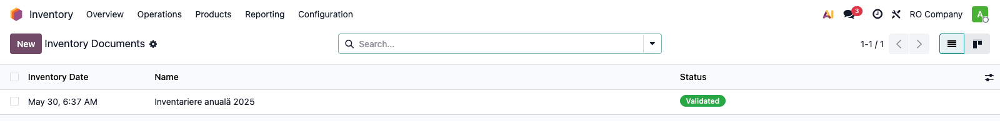
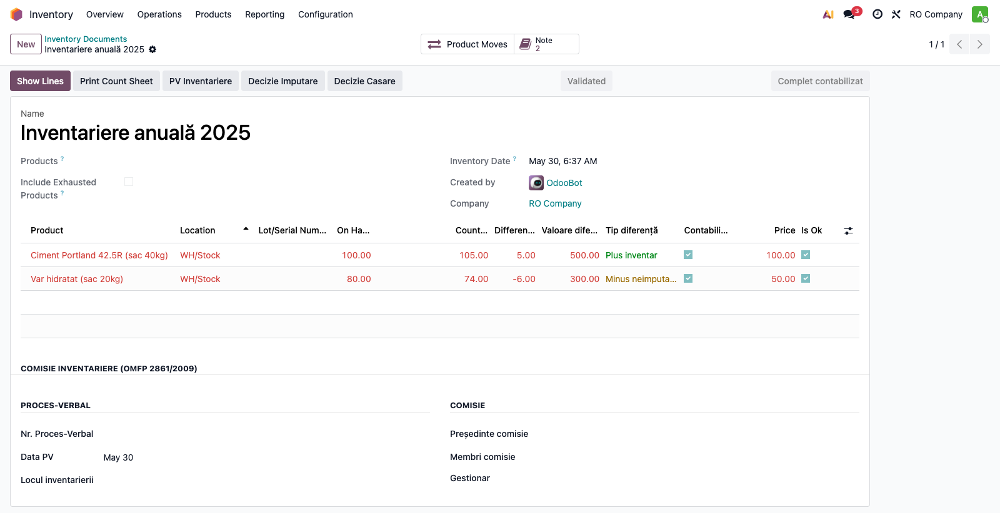
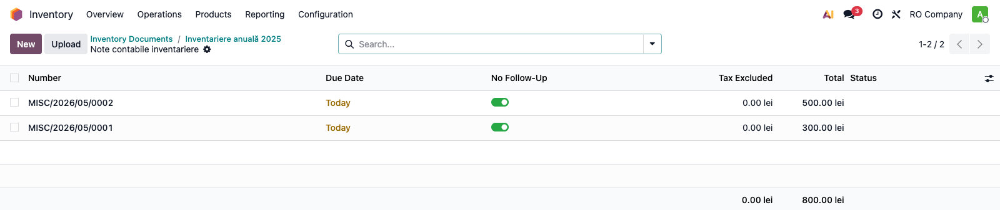
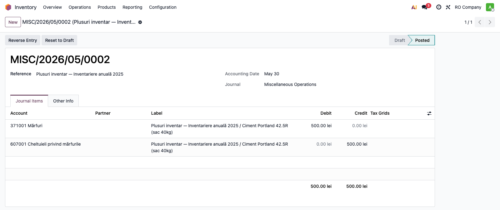
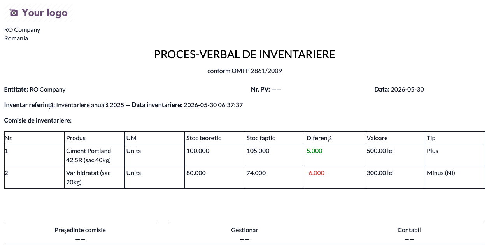

# Fișă Modul: Inventariere și Casare Stocuri

**Poziție plan:** B1.5
**Modul:** `l10n_ro_inventory_closing`
**FR:** FR-18
**Capitol manual:** Cap 6.5
**Utilizator principal:** Responsabil inventar, Contabil stocuri
**Prioritate:** 🟡 Medie (anual obligatoriu)

---

## 1. Scop business

Această fișă descrie utilizarea modulului `l10n_ro_inventory_closing` pentru scenariul **Inventariere și Casare Stocuri**.
Consultantul folosește documentul pentru reproducerea fluxului în baza demo și
pentru pregătirea capitolului Cap 6.5 din manualul utilizator.

## 2. Bază legală și context

OMFP 2861/2009 — procedura inventarierii anuale; Legea 82/1991

## 3. Utilizatori și roluri

Responsabil Depozit, Contabil

Roluri recomandate pentru testare:
- Administrator funcțional: instalează modulul și verifică meniurile
- Utilizator operațional: rulează fluxul zilnic sau lunar
- Contabil/manager: validează rezultatele contabile și rapoartele

## 4. Conturi și date implicate

6588 (lipsuri neimputabile), 4282/7588 (lipsuri imputabile), 4427 (ajustare TVA)

Date minime pentru demo:
- companie românească cu localizarea contabilă instalată
- perioadă contabilă deschisă
- jurnale și conturi configurate conform scenariului
- documente de test postate, acolo unde fluxul pornește din contabilitate, stocuri, HR sau vânzări

## 5. Configurare inițială

1. Instalați modulul `l10n_ro_inventory_closing` pe baza demo.
2. Verificați dependențele cerute de manifest și meniurile nou apărute.
3. Configurați conturile, jurnalele, produsele, partenerii sau parametrii specifici fluxului.
4. Pregătiți un set minim de documente postate pentru perioada de test.
5. Verificați că utilizatorul de test are grupurile de acces necesare.

## 6. Flux de utilizare

### Pasul 1 — Accesare

Accesați **Stocuri → Operațiuni → Inventariere RO** și creați inventarierea anuală sau lista de casare pentru demo.



### Pasul 2 — Completare date

Completați cantitățile faptice pe linii; modulul calculează automat diferențele (plus / minus
neimputabil / imputabil / casare) și valoarea, colorate pe tip:



### Pasul 3 — Calcul / generare note contabile

Din butonul de generare, modulul creează automat **câte o notă contabilă per tip de diferență**
(plus 371/607, minus neimputabil, imputabil cu TVA, casare 6583):



### Pasul 4 — Verificare rezultat

Comparați monografia: fiecare notă conține liniile contabile corespunzătoare
(ex. plusuri: Dr 371 Mărfuri / Cr 607):



### Pasul 5 — Confirmare / postare

Notele sunt postate, iar inventarul trece în starea **Complet contabilizat**; câmpurile devin
readonly, iar smart button-ul **Note** rămâne ca link către documentele generate (vezi pașii 3–4).

### Pasul 6 — Export / raportare

Generați **Proces-Verbal de Inventariere** (OMFP 2861/2009) din butonul **PV Inventariere**;
similar, **Decizie Imputare** / **Decizie Casare** pentru cazurile respective:



## 7. Legături cu alte module / declarații

| Modul / proces | Rol în flux |
|---|---|
| `stock` | inventar fizic și mișcări de ajustare |
| `stock_account` | note de diferențe și valorizare |
| `l10n_ro_inventory_register` | registrul anual folosește rezultatul inventarierii |
| `l10n_ro_stock_provision` | provizioane pentru stocuri depreciate |

Ce este automat: generarea listelor și a ajustărilor de inventar/casare.
Ce rămâne manual: validarea comisiei și documentele semnate.

## 8. Verificări pentru consultant

- [ ] Modulul se instalează fără erori pe baza demo.
- [ ] Meniurile și acțiunile sunt vizibile pentru rolul de utilizator potrivit.
- [ ] Fluxul poate fi reprodus de la cap la coadă cu date fictive românești.
- [ ] Rezultatul contabil sau operațional corespunde descrierii din plan.
- [ ] Mesajele de eroare sunt clare pentru un utilizator non-tehnic.
- [ ] Exporturile sau rapoartele se descarcă și conțin datele testate.

## 9. Mesaje de eroare frecvente

| Mesaj / simptom | Cauză probabilă | Remediere |
|-----------------|-----------------|-----------|
| Meniul nu este vizibil | Utilizatorul nu are grupurile necesare | Verificați drepturile de acces și reîncărcați aplicațiile |
| Nu se generează linii | Lipsesc documente postate în perioada aleasă | Creați și postați datele de test necesare |
| Cont lipsă sau jurnal lipsă | Configurarea contabilă este incompletă | Completați conturile și jurnalele în setările modulului |
| Perioada este blocată | Data documentului este într-o perioadă închisă | Folosiți o perioadă deschisă sau ajustați lock date-ul în demo |

## 10. Capturi de ecran

Capturile (`readme/screenshots/`) sunt **generate automat** din `tests/test_screenshots.py`
(mixinul `ScreenshotCase` din `l10n_ro_doc_screenshots`), pe date seedate determinist:

1. `01_lista_inventarieri.png` — lista inventarierilor RO (pasul 1)
2. `02_inventar_diferente.png` — inventar cu plusuri/minusuri și tipul diferenței (pasul 2)
3. `03_note_contabile.png` — notele contabile generate per tip de diferență (pasul 3)
4. `04_nota_detaliu.png` — o notă în detaliu cu liniile Dr/Cr (Dr 371 / Cr 607) (pasul 4)
5. `05_pv_inventariere.png` — Proces-Verbal de Inventariere OMFP 2861/2009 (pasul 6)

Conform regulii „câte o captură pentru fiecare pas din flux", pasul 5 (postare) reutilizează
contextul notelor de la pașii 3–4.

Regenerare:

```bash
./odoo/odoo-bin -c odoo.conf -d <db> -i l10n_ro_inventory_closing \
    --test-tags=fise_screenshots --stop-after-init
```

Necesită `playwright` în mediul Odoo + Chrome de sistem; dacă lipsește, testul se sare.

## 11. Observații pentru manual

În manualul final, păstrați explicația orientată pe activitatea utilizatorului:
ce problemă rezolvă modulul, când se rulează, ce date trebuie pregătite și cum se verifică rezultatul.
