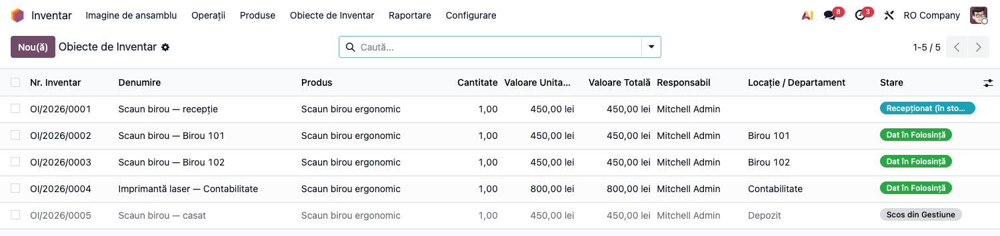
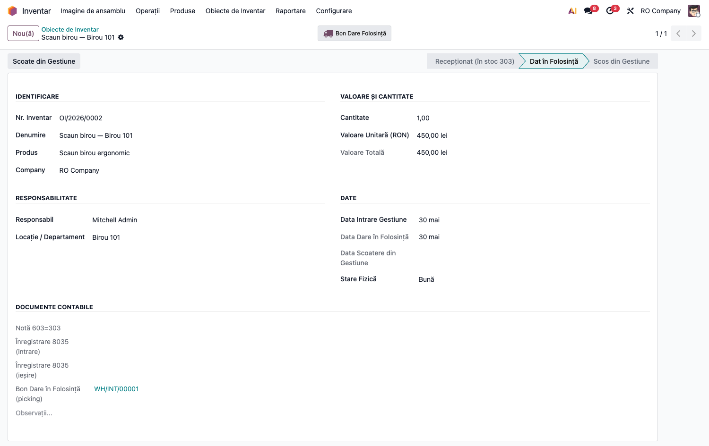
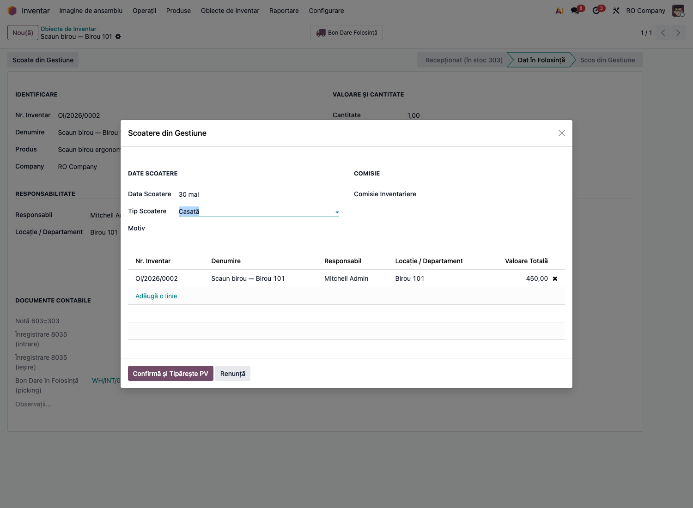
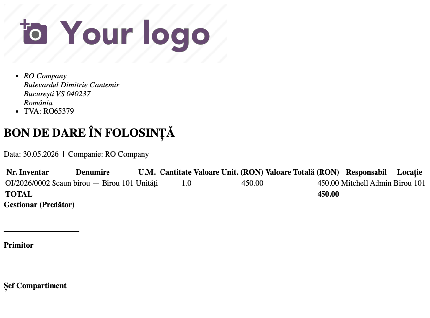
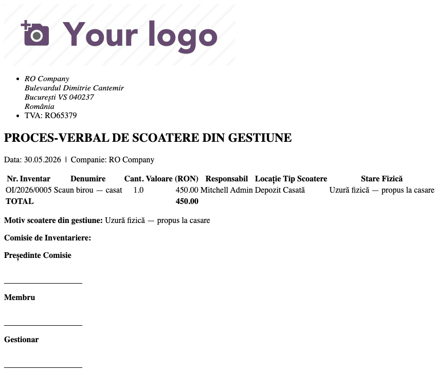

# Fișă Modul: Obiecte de Inventar (303/603/8035)

**Poziție plan:** B6.2
**Modul:** `l10n_ro_inventory_items`
**FR:** FR-20
**Capitol manual:** Cap 7.2
**Utilizator principal:** Responsabil Patrimoniu, Contabil
**Prioritate:** 🟡 Medie

---

## 1. Scop business

Această fișă descrie utilizarea modulului `l10n_ro_inventory_items` pentru scenariul **Obiecte de Inventar (303/603/8035)**.
Consultantul folosește documentul pentru reproducerea fluxului în baza demo și
pentru pregătirea capitolului Cap 7.2 din manualul utilizator.

## 2. Bază legală și context

HG 276/2013 — prag 5.000 lei; OMFP 1802/2014 — cont 303/603/8035

## 3. Utilizatori și roluri

Responsabil Patrimoniu, Contabil

Roluri recomandate pentru testare:
- Administrator funcțional: instalează modulul și verifică meniurile
- Utilizator operațional: rulează fluxul zilnic sau lunar
- Contabil/manager: validează rezultatele contabile și rapoartele

## 4. Conturi și date implicate

303 (stoc OI), 603 (dare în folosință), 8035 (evidență extracontabilă)

Date minime pentru demo:
- companie românească cu localizarea contabilă instalată
- perioadă contabilă deschisă
- jurnale și conturi configurate conform scenariului
- documente de test postate, acolo unde fluxul pornește din contabilitate, stocuri, HR sau vânzări

## 5. Configurare inițială

1. Instalați modulul `l10n_ro_inventory_items` pe baza demo.
2. Verificați dependențele cerute de manifest și meniurile nou apărute.
3. Configurați conturile, jurnalele, produsele, partenerii sau parametrii specifici fluxului.
4. Pregătiți un set minim de documente postate pentru perioada de test.
5. Verificați că utilizatorul de test are grupurile de acces necesare.

## 6. Flux de utilizare

### Pasul 1 — Registrul obiectelor de inventar

Accesați **Inventar → Obiecte de Inventar → Obiecte de Inventar**. Lista arată întregul ciclu de
viață: *Recepționat (în stoc 303)* → *Dat în Folosință* → *Scos din Gestiune*, cu responsabil,
locație și valoare. Butonul **„Verifică reconciliere 8035"** (din bara listei, la selecție) compară
soldul contului 8035 cu valoarea OI date în folosință.



### Pasul 2 — Darea în folosință (303 → 603 + 8035)

Pe un OI recepționat, butonul **„Dă în Folosință"** generează pickingul de consum (nota 603=303) și,
dacă firma folosește evidența extracontabilă, înregistrarea **8035**. Pe fișa OI apar starea, butonul
către picking și secțiunea „Documente contabile" (Notă 603=303, Înregistrare 8035, Bon Dare).



### Pasul 3 — Scoaterea din gestiune (wizard)

Butonul **„Scoate din Gestiune"** deschide wizardul: tip scoatere (Casată/…), motiv, comisia de
inventariere. La confirmare se stornează 8035 și OI trece în starea *Scos din Gestiune*.



### Pasul 4 — Documente tipăribile

Modulul oferă două rapoarte PDF — **Bon de Dare în Folosință** (la darea în folosință) și
**Proces-Verbal de Scoatere din Gestiune** (la casare), cu antetul companiei, valori, responsabil și
blocuri de semnături (gestionar, primitor, comisie).





### Pasul 5 — Reconciliere 8035

Periodic (ex. la inventarierea anuală) rulați **„Verifică reconciliere 8035"** din lista OI: dacă
soldul contului 8035 diferă de valoarea OI în folosință (note 8035 modificate/șterse manual), apare
o avertizare cu diferența.

## 7. Legături cu alte module / declarații

| Modul / proces | Rol în flux |
|---|---|
| `stock` | recepții, locații și mișcări ale obiectelor de inventar |
| `account` | note 303/603 și evidență contabilă |
| `l10n_ro_inventory_register` | registrul anual poate folosi situația obiectelor de inventar |
| `l10n_ro_inventory_closing` | inventarierea fizică și scoaterea din gestiune |

Ce este automat: trecerea în folosință și evidența pe responsabil/locație.
Ce rămâne manual: verificarea pragului intern și documentele semnate de predare/scoatere.

## 8. Verificări pentru consultant

- [ ] Modulul se instalează fără erori pe baza demo.
- [ ] Meniurile și acțiunile sunt vizibile pentru rolul de utilizator potrivit.
- [ ] Fluxul poate fi reprodus de la cap la coadă cu date fictive românești.
- [ ] Rezultatul contabil sau operațional corespunde descrierii din plan.
- [ ] Mesajele de eroare sunt clare pentru un utilizator non-tehnic.
- [ ] Exporturile sau rapoartele se descarcă și conțin datele testate.

## 9. Mesaje de eroare frecvente

| Mesaj / simptom | Cauză probabilă | Remediere |
|-----------------|-----------------|-----------|
| Meniul nu este vizibil | Utilizatorul nu are grupurile necesare | Verificați drepturile de acces și reîncărcați aplicațiile |
| Nu se generează linii | Lipsesc documente postate în perioada aleasă | Creați și postați datele de test necesare |
| Cont lipsă sau jurnal lipsă | Configurarea contabilă este incompletă | Completați conturile și jurnalele în setările modulului |
| Perioada este blocată | Data documentului este într-o perioadă închisă | Folosiți o perioadă deschisă sau ajustați lock date-ul în demo |

## 10. Capturi de ecran

Capturile (`readme/screenshots/`) sunt **generate automat** din `tests/test_screenshots.py`
(mixinul `ScreenshotCase` din `l10n_ro_doc_screenshots`, import defensiv), în **limba română**,
pe datele demo ale modulului (compania `base.demo_company_ro`: depozit + 5 OI în stări diferite):

1. `01_lista_oi.png` — registrul OI cu ciclul complet (recepționat / dat în folosință / scos).
2. `02_formular_oi.png` — fișa unui OI dat în folosință (documente contabile 603/8035, picking).
3. `03_wizard_scoatere.png` — wizardul de scoatere din gestiune (casare + comisie).
4. `04_bon_dare.png` — raportul PDF „Bon de Dare în Folosință".
5. `05_pv_scoatere.png` — raportul PDF „Proces-Verbal de Scoatere din Gestiune".

Regenerare (cu date demo):

```bash
./odoo/odoo-bin -c odoo.conf -d <db> -i l10n_ro_inventory_items,l10n_ro_doc_screenshots \
    --without-demo=False --test-tags=fise_screenshots --stop-after-init
```

## 11. Observații pentru manual

În manualul final, păstrați explicația orientată pe activitatea utilizatorului:
ce problemă rezolvă modulul, când se rulează, ce date trebuie pregătite și cum se verifică rezultatul.
