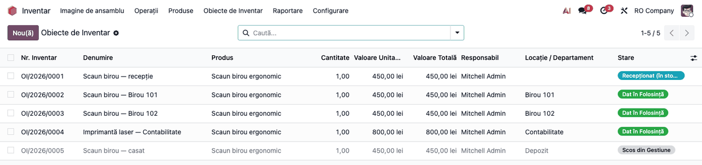
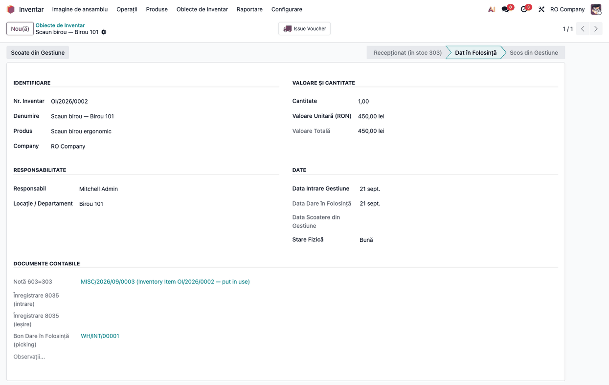
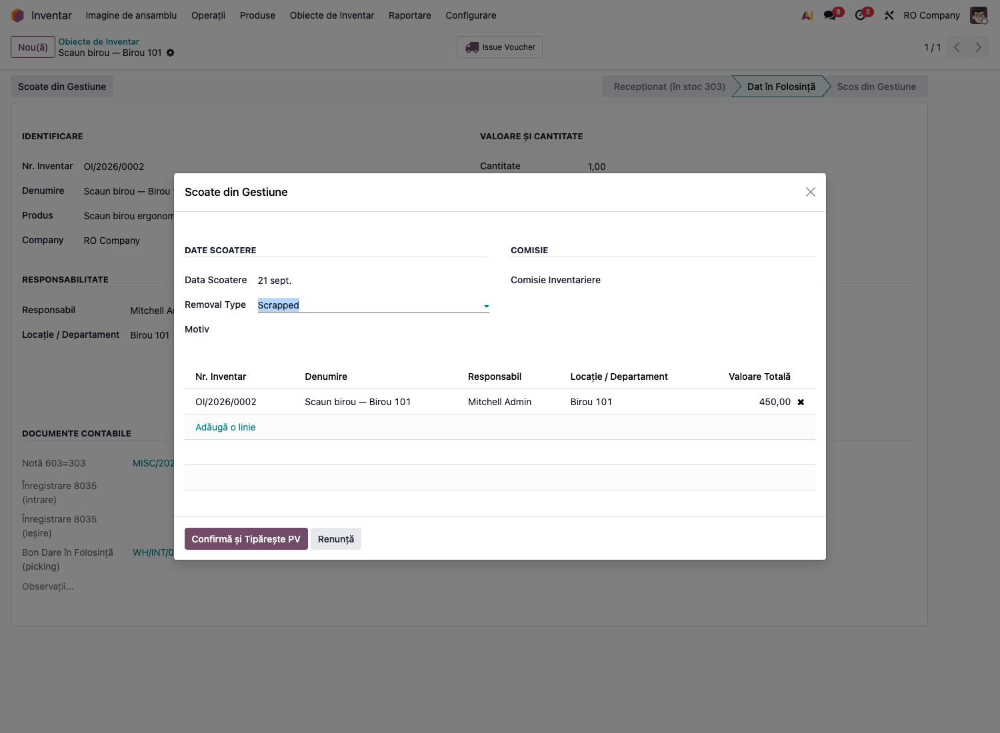
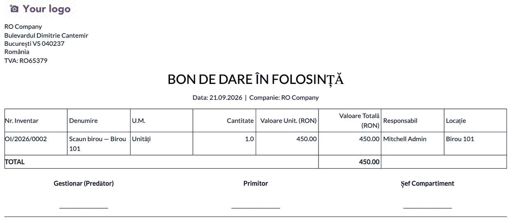
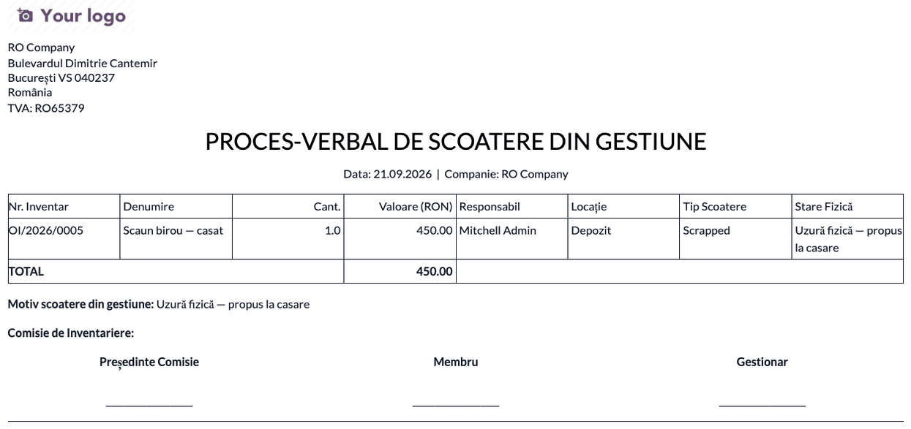
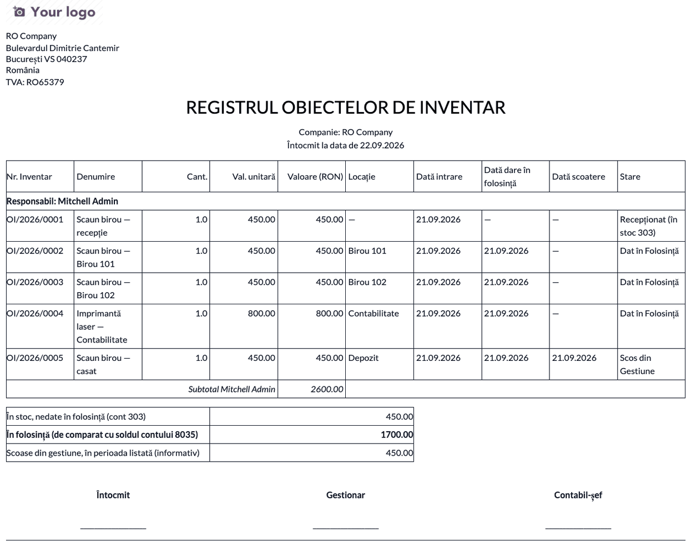

# Fișă Modul: Obiecte de Inventar (303/603/8035)

**Poziție plan:** B6.2
**Modul:** `l10n_ro_inventory_items`
**FR:** FR-20
**Capitol manual:** Cap 7.2
**Utilizator principal:** Responsabil Patrimoniu, Contabil
**Prioritate:** 🟡 Medie

---

## 1. Scop business

Această fișă descrie utilizarea modulului `l10n_ro_inventory_items` pentru scenariul **Obiecte de Inventar (303/603/8035)**.
Consultantul folosește documentul pentru reproducerea fluxului în baza demo și
pentru pregătirea capitolului Cap 7.2 din manualul utilizator.

## 2. Bază legală și context

**Încadrarea bunului.** Pragul de **5.000 lei** este **fiscal**, nu contabil: art. 28 alin. (2)
lit. b) din Legea 227/2015, astfel cum a fost modificat prin **OUG 8/2026**, aplicabil începând cu
anul fiscal **2026** (până la 31.12.2025: 2.500 lei, HG 276/2013). OMFP 1802/2014 nu impune niciun
prag valoric — pct. 276 alin. (1) lit. d) include pur și simplu materialele de natura obiectelor de
inventar în categoria stocurilor —, așa că încadrarea contabilă se face prin **politica contabilă a
entității**, aliniată de regulă la pragul fiscal ca să nu apară diferențe.

**Regulă tranzitorie, de verificat la implementare:** mijloacele fixe cu valoare de intrare între
2.500 și 5.000 lei, aflate în patrimoniu la 31.12.2025, **nu se reclasifică** ca obiecte de
inventar — se amortizează în continuare pe durata normală rămasă (art. 45 alin. (21^3) din Legea
227/2015).

**Tratament contabil.** OMFP 1802/2014: recepție în `303`, cheltuire integrală la darea în folosință
prin `603 = 303` (funcțiunea ct. 603), evidență extrabilanțieră pe `8035` (pct. 354–356). Valoarea
obiectelor de inventar **nu se eșalonează** pe mai multe exerciții: ct. 603 se debitează integral la
darea în folosință.

**Monografia completă**

| Operațiune | Notă contabilă |
|---|---|
| Recepția OI de la furnizor | `% = 401` cu `Dr 303` (valoarea fără TVA) și `Dr 4426` (TVA 21%, sau 11% la cotele reduse) |
| Darea în folosință | `Dr 603 = Cr 303`, integral, la data dării în folosință |
| Evidența extrabilanțieră, la darea în folosință | `Dr 8035 = Cr 803999` |
| Restituirea în magazie | `Dr 303 = Cr 603` (inversa dării în folosință) + `Dr 803999 = Cr 8035` |
| Casarea | fără notă bilanțieră — valoarea a trecut deja pe 603; se creditează doar 8035 |
| Lipsă la inventar, **imputabilă** | `Dr 4282` (salariat) sau `Dr 461` (terț) `= Cr 7588`, cu valoarea imputată, **fără TVA colectată**: sumele imputate pentru bunurile lipsă nu sunt contravaloarea unor operațiuni în sfera TVA (HG 1/2016, Titlul VII, pct. 78 alin. (6) lit. a)). Generată de modul din 19.0.2.4.0 (wizardul „Remove from Stock”, tipul „Lost / Missing”, bifa „Charged to a Person”). Valoarea implicită e valoarea de înregistrare; lipsurile se impută de regulă la valoarea de înlocuire, care se introduce în „Charged Amount” |
| Lipsă la inventar, **neimputabilă** | fără notă suplimentară; cheltuiala rămâne pe 603, dar devine **nedeductibilă** dacă nu se încadrează în art. 25 alin. (4) lit. c) pct. 1–5 din Legea 227/2015 |
| Ajustarea TVA dedusă la achiziție (lipsă nejustificată, imputată sau nu) | `Dr 635 = Cr 4426`, la cota la care s-a dedus TVA (19 % înainte de 1.08.2025, 21 % după) — art. 304 alin. (1) lit. c) Cod fiscal, HG 1/2016 pct. 78; nu se face pentru bunurile distruse, pierdute sau furate dovedite (art. 304 alin. (2)). **Manual**, la decizia contabilului, și raportată pe rândul de ajustări din decontul de TVA; aplicarea ei la obiectele deja trecute pe 603 e de confirmat cu consultantul fiscal |

Modulul înregistrează automat primele cinci operațiuni și, la cerere, imputarea. **Decizia rămâne
a contabilului**: imputabilitatea, valoarea imputată, decizia comisiei, existența asigurării și
ajustarea TVA sunt aprecieri pe care modulul nu le poate face. Fără bifa de imputare, scoaterea de
tip *Lost / Missing* lasă în chatter ce e de înregistrat.

**TVA la casare.** Pentru bunurile distruse, pierdute sau furate **nu se ajustează** deducerea, cu
condiția ca situația să fie „demonstrată sau confirmată în mod corespunzător" — art. 304 alin. (2)
lit. a) din Legea 227/2015. Procesul-verbal de scoatere din gestiune, cu comisia și dovada
distrugerii, este exact documentul care susține neajustarea.

## 3. Utilizatori și roluri

Responsabil Patrimoniu, Contabil

Roluri recomandate pentru testare:
- Administrator funcțional: instalează modulul și verifică meniurile
- Utilizator operațional: rulează fluxul zilnic sau lunar
- Contabil/manager: validează rezultatele contabile și rapoartele

## 4. Conturi și date implicate

| Cont | Rol |
|---|---|
| `303` | materiale de natura obiectelor de inventar, la recepție |
| `603` | cheltuiala, la darea în folosință (`603 = 303`) |
| `8035` | evidența extrabilanțieră a OI aflate în folosință (pct. 354–356 OMFP 1802/2014) |
| `803999` | **cont tehnic** „Contrapartidă tehnică evidență extrabilanțieră” (analitic al lui 8039), comun tuturor notelor extrabilanțiere ale suitei (modulul `l10n_ro_off_balance`), în jurnalul EXTR. Conturile în afara bilanțului funcționează în partidă simplă; contrapartida e o cerință a Odoo, nu a reglementării. Apare în balanță, deci consultantul trebuie să știe să-l explice |

Soldul contului 8035 se prezintă în **notele explicative** la situațiile financiare anuale
(pct. 356 OMFP 1802/2014) — nu e o evidență pur internă.

Date minime pentru demo:
- companie românească cu localizarea contabilă instalată
- perioadă contabilă deschisă
- jurnale și conturi configurate conform scenariului
- documente de test postate, acolo unde fluxul pornește din contabilitate, stocuri, HR sau vânzări

## 5. Configurare inițială

1. Instalați modulul `l10n_ro_inventory_items` pe baza demo.
2. Verificați dependențele cerute de manifest și meniurile nou apărute.
3. Pe fișa companiei (**Setări → Companii**), secțiunea *Inventory Items (RO)*, verificați:
   - bifa **„Use Account 8035 (off-balance)"** — fără ea nu se generează evidența extrabilanțieră;
   - **contul de cheltuială** (603) și **contul de stoc** (303) pentru darea în folosință;
   - **jurnalul** notei 603=303 (implicit un jurnal de operațiuni diverse, niciodată cel
     extrabilanțier).
   La instalare sunt completate automat; verificați-le dacă planul de conturi e personalizat.
4. Bifați **„Obiect de Inventar (RO)"** pe produsele care urmează fluxul și, opțional, contul 8035
   propriu pe fișa produsului.
5. Pregătiți un set minim de documente postate pentru perioada de test.
6. Utilizatorul de test are nevoie de grupul *Inventory Items* **și** de drepturi de stoc: darea în
   folosință validează un transfer, deci un contabil fără acces la stoc primește eroare de drepturi.

## 6. Flux de utilizare

### Pasul 1 — Lista obiectelor de inventar

Accesați **Inventar → Obiecte de Inventar → Obiecte de Inventar**. Lista arată întregul ciclu de
viață: *Recepționat (în stoc 303)* → *Dat în Folosință* → *Scos din Gestiune*, cu responsabil,
locație și valoare. Butonul **„Verifică reconciliere 8035"** (din bara listei, la selecție) compară
soldul contului 8035 cu valoarea OI date în folosință.



### Pasul 2 — Darea în folosință (303 → 603 + 8035)

Pe un OI recepționat, butonul **„Dă în Folosință"** generează pickingul de consum (nota 603=303) și,
dacă firma folosește evidența extrabilanțieră, înregistrarea **8035**. Pe fișa OI apar starea, butonul
către picking și secțiunea „Documente contabile" (Notă 603=303, Înregistrare 8035, Bon Dare).



### Pasul 3 — Scoaterea din gestiune (wizard)

Butonul **„Scoate din Gestiune"** deschide wizardul: tip scoatere (Casată/…), motiv, comisia de
inventariere. La confirmare se stornează 8035 și OI trece în starea *Scos din Gestiune*.



### Pasul 4 — Documente tipăribile

Modulul oferă trei rapoarte PDF, toate cu antetul companiei: **Bon de Dare în Folosință** (la darea
în folosință) și **Proces-Verbal de Scoatere din Gestiune** (la casare) — ambele cu valori,
responsabil și blocuri de semnături (gestionar, primitor, comisie) — plus **Registrul Obiectelor de
Inventar** (situația de ansamblu, vezi Pasul 5).





### Pasul 5 — Registrul obiectelor de inventar (raport)

Din lista OI selectați înregistrările dorite (sau toate) și alegeți **Tipărește → Inventory Item
Register**. Raportul listează obiectele **grupate pe responsabil**, cu subtotal per gestionar, și
ordonate după numărul de inventar: denumire, cantitate, valoare unitară și totală, locație, data
intrării, data dării în folosință, data scoaterii și starea.

Totalurile sunt date **pe stări**, nu cumulat, fiindcă doar așa se pot confrunta cu contabilitatea:
valoarea OI *în folosință* este cea comparabilă cu soldul contului **8035**, iar cea *în stoc* cu
soldul contului **303**. Un total peste toate stările nu ar corespunde niciunui sold.

Este o **situație internă de ansamblu**, utilă comisiei ca document de lucru la inventarierea
anuală. Nu înlocuiește *Lista de inventariere* și nici fișele de evidență a obiectelor de inventar
în folosință prevăzute de OMFP 2634/2015 — „registrul obiectelor de inventar" nu este unul dintre
registrele obligatorii ale Legii contabilității 82/1991 (Registrul-jurnal, Registrul-inventar,
Cartea mare).



### Pasul 6 — Reconciliere 8035

Periodic (ex. la inventarierea anuală) rulați **„Verifică reconciliere 8035"** din lista OI: dacă
soldul contului 8035 diferă de valoarea OI în folosință (note 8035 modificate/șterse manual), apare
o avertizare cu diferența.

### Casarea obiectelor vechi (din 19.0.2.4.0)

Inventar → Obiecte de inventar → **Scrap Old Inventory Items**: propune obiectele aflate în folosință
de peste N luni (implicit 12), opțional ale unui responsabil, la o dată de casare. Nicio
normă nu fixează o durată de folosință pentru obiectele de inventar: casarea se face pe constatarea
comisiei, deci comisia și constatările ei (motivul) sunt obligatorii, iar obiectele încă folosite se
scot din listă. După confirmare, fiecare obiect e scos din gestiune ca „casat” (`Dr 803999 = Cr 8035`),
iar PV-ul de scoatere din gestiune se tipărește pentru toate.

### Obiecte de inventar pe salariat

Modulul separat **`l10n_ro_inventory_items_hr`** (instalat explicit) adaugă salariatul (`hr.employee`)
pe fișă și în wizardul de dare în folosință; bonul, PV-ul și registrul îl arată. Modulul de bază nu
depinde de `hr`, ca update-ul să nu instaleze aplicația Angajați la firmele care nu o folosesc.

## 7. Legături cu alte module / declarații

| Modul / proces | Rol în flux |
|---|---|
| `stock` | recepții, locații și mișcări ale obiectelor de inventar |
| `account` | note 303/603 și evidență contabilă |
| `l10n_ro_inventory_register` | registrul anual poate folosi situația obiectelor de inventar |
| `l10n_ro_inventory_closing` | inventarierea fizică și scoaterea din gestiune |

Ce este automat: trecerea în folosință și evidența pe responsabil/locație.
Ce rămâne manual: verificarea pragului intern și documentele semnate de predare/scoatere.

## 8. Verificări pentru consultant

- [ ] Modulul se instalează fără erori pe baza demo.
- [ ] Meniurile și acțiunile sunt vizibile pentru rolul de utilizator potrivit.
- [ ] Fluxul poate fi reprodus de la cap la coadă cu date fictive românești.
- [ ] Rezultatul contabil sau operațional corespunde descrierii din plan.
- [ ] Mesajele de eroare sunt clare pentru un utilizator non-tehnic.
- [ ] Exporturile sau rapoartele se descarcă și conțin datele testate.

## 9. Mesaje de eroare frecvente

| Mesaj / simptom | Cauză probabilă | Remediere |
|-----------------|-----------------|-----------|
| „Insufficient stock in account 303: available …, required …" | OI-ul nu are stoc disponibil în depozit la darea în folosință | Verificați recepția și cantitatea din fișa OI |
| Nota din chatter „Entry 603=303 was not created: the expense account (603) or the inventory account (303) is missing" | Conturile nu sunt configurate pe companie și nu au putut fi deduse | Completați-le pe fișa companiei, secțiunea *Inventory Items (RO)*, apoi înregistrați nota manual pentru fișele deja procesate |
| Nota din chatter „Entry 603=303 was not created: no miscellaneous journal was found" | Compania nu are un jurnal de operațiuni diverse (în afara celui extrabilanțier) | Creați jurnalul și selectați-l pe fișa companiei |
| Reconcilierea 8035 avertizează că nu există contul, deși sunt OI în folosință | Planul de conturi nu conține 8035 sau modulul a fost instalat înaintea localizării | Verificați planul de conturi; fișele deja date în folosință rămân fără evidență extrabilanțieră până la corectare |
| „The inventory item is not in state 'In Use'." | Scoaterea din gestiune a fost cerută pentru o fișă care nu e în folosință | Verificați starea fișei |
| Eroare de drepturi la darea în folosință (locații de stoc) | Utilizatorul are grupul *Inventory Items*, dar nu și drepturi de stoc | Acordați-i grupul de stoc: operațiunea validează un transfer |
| Meniul nu este vizibil | Utilizatorul nu are grupurile necesare | Verificați drepturile de acces și reîncărcați aplicațiile |
| Perioada este blocată | Data documentului este într-o perioadă închisă | Folosiți o perioadă deschisă sau ajustați lock date-ul în demo |

## 10. Capturi de ecran

Capturile (`static/description/`) sunt **generate automat** din `tests/test_screenshots.py`
(mixinul `ScreenshotCase` din `l10n_ro_doc_screenshots`, import defensiv), în **limba română**,
pe datele demo ale modulului (compania `base.demo_company_ro`: depozit + 5 OI în stări diferite):

1. `01_lista_oi.png` — registrul OI cu ciclul complet (recepționat / dat în folosință / scos).
2. `02_formular_oi.png` — fișa unui OI dat în folosință (documente contabile 603/8035, picking).
3. `03_wizard_scoatere.png` — wizardul de scoatere din gestiune (casare + comisie).
4. `04_bon_dare.png` — raportul PDF „Bon de Dare în Folosință".
5. `05_pv_scoatere.png` — raportul PDF „Proces-Verbal de Scoatere din Gestiune".
6. `06_registru_oi.png` — raportul PDF „Registrul Obiectelor de Inventar" (toate OI ale companiei).

Regenerare (cu date demo):

```bash
./odoo/odoo-bin -c odoo.conf -d <db> -i l10n_ro_inventory_items,l10n_ro_doc_screenshots \
    --without-demo=False --test-tags=fise_screenshots --stop-after-init
```

## 11. Observații pentru manual

În manualul final, păstrați explicația orientată pe activitatea utilizatorului:
ce problemă rezolvă modulul, când se rulează, ce date trebuie pregătite și cum se verifică rezultatul.
