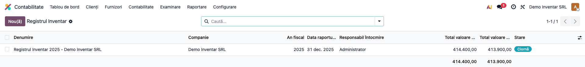
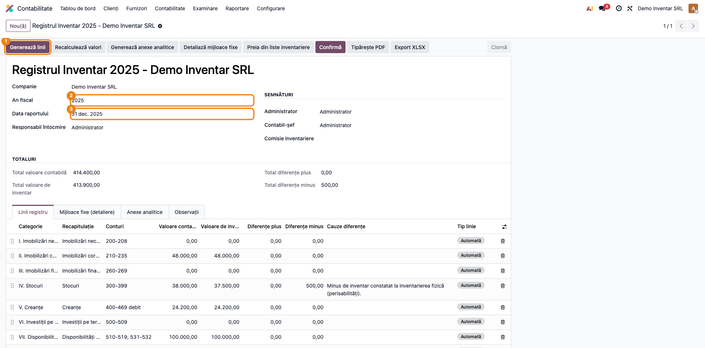
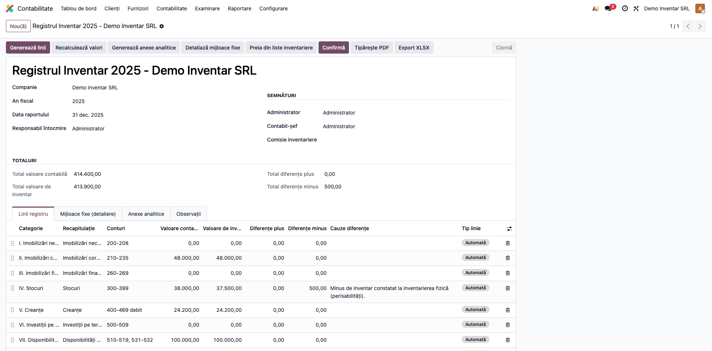
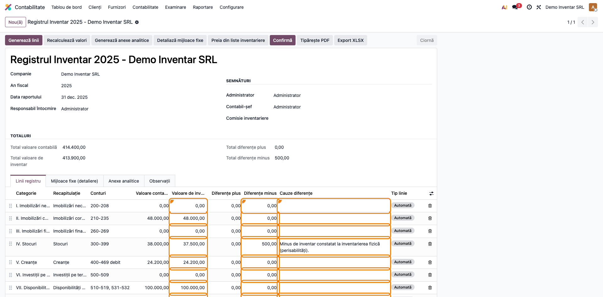
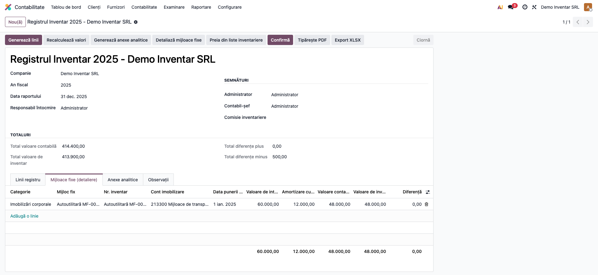
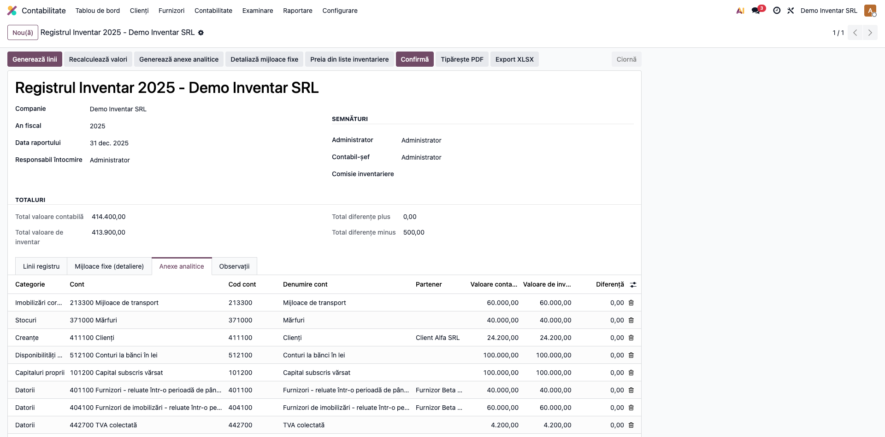
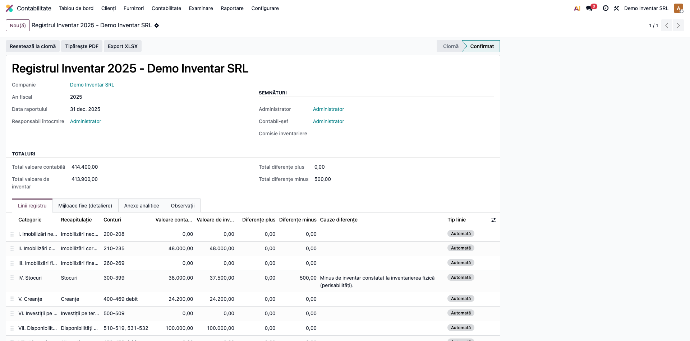
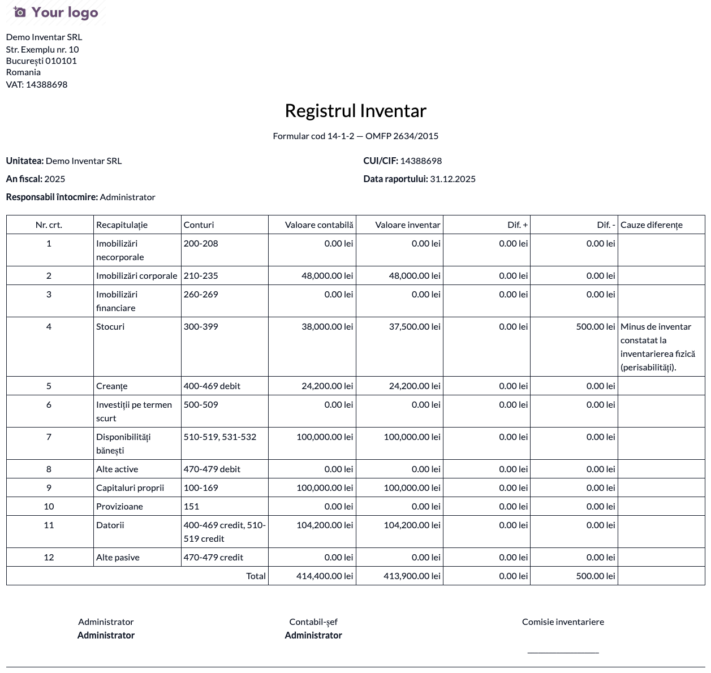
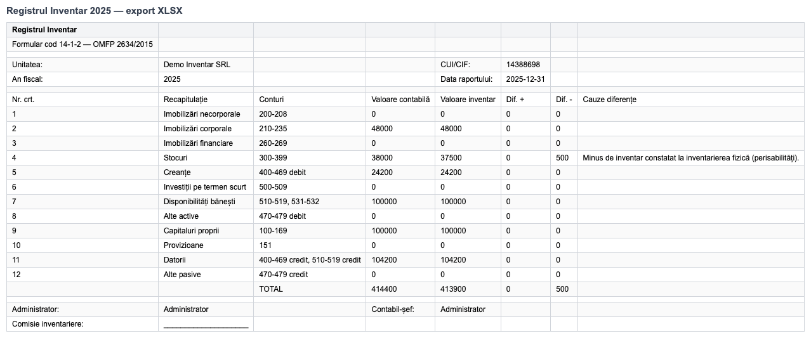

# Fișă Modul: Registrul-inventar anual (formular 14-1-2)

**Poziție plan:** C9
**Modul:** `l10n_ro_inventory_register`
**FR:** FR-50
**Capitol manual:** Cap 6.6
**Utilizator principal:** Contabil șef, Responsabil inventar
**Prioritate:** 🔴 Ridicată (registru contabil obligatoriu la închiderea exercițiului)

---

## 1. Scop business

Modulul generează **Registrul-inventar** anual — documentul contabil obligatoriu care
centralizează elementele patrimoniale ale companiei la sfârșitul exercițiului financiar, pe cele
12 categorii standard (imobilizări, stocuri, creanțe, disponibilități, capitaluri, datorii etc.),
cu valoare contabilă, valoare de inventar și diferențe explicate.

Consultantul trebuie să explice clar diferența dintre **inventarierea fizică** (numărare,
constatare, liste de inventariere — acoperită de `l10n_ro_inventory_closing`) și
**Registrul-inventar** (carte contabilă recapitulativă, construită din soldurile contabile
postate, în care se consemnează și valorile de inventar constatate).

## 2. Bază legală și context

- **Legea contabilității nr. 82/1991** — Registrul-inventar este registru contabil obligatoriu,
  alături de Registrul-jurnal și Cartea mare.
- **OMFP 2634/2015** privind documentele financiar-contabile — formularul **cod 14-1-2**
  (Registrul-inventar), pe care îl reproduce raportul PDF/XLSX al modulului.

Registrul se întocmește la sfârșitul exercițiului financiar, pe baza inventarierii elementelor
de natura activelor, datoriilor și capitalurilor proprii. Modulul construiește recapitulația din
soldurile contabile postate la data raportului și lasă comisiei completarea valorilor de
inventar și a cauzelor diferențelor.

## 3. Utilizatori și roluri

- Contabil șef: creează registrul, verifică valorile, confirmă documentul.
- Responsabil inventar / comisia de inventariere: furnizează valorile de inventar și cauzele
  diferențelor.
- Contabil stocuri / mijloace fixe: verifică soldurile pe categorii și detalierea activelor.
- Auditor: verifică documentul final și corelarea cu balanța.

Roluri recomandate pentru testare: utilizator cu grupul **Contabilitate / Contabil** (meniul e
vizibil pentru `account.group_account_user`); resetarea la ciornă cere **Contabil șef / Manager**
(`account.group_account_manager`).

## 4. Conturi și date implicate

Valorile contabile se calculează din soldurile `account.move.line` postate până la data
raportului, grupate pe prefixe de cont (plan de conturi RO):

| Categorie | Conturi (interval orientativ) |
|---|---|
| I. Imobilizări necorporale | 200–208, net de 280/290 |
| II. Imobilizări corporale | 210–235, net de 281/291 |
| III. Imobilizări financiare | 260–269, net de 296 |
| IV. Stocuri | 300–399, net de ajustările 39x |
| V. Creanțe | 400–469 solduri debitoare |
| VI. Investiții pe termen scurt | 500–509 |
| VII. Disponibilități bănești | 510–519, 531–532 |
| VIII. Alte active | 470–479 solduri debitoare |
| IX. Capitaluri proprii | 100–169 |
| X. Provizioane | 151 (cu analiticele 1511–1518, inclusiv pensii și impozite) |
| XI. Datorii | 400–469 și 510–519 solduri creditoare |
| XII. Alte pasive | 470–479 solduri creditoare |

Date minime pentru demo: companie cu plan de conturi RO, documente postate în exercițiu
(capital, achiziții de stocuri, facturi de vânzare, ajustări 39x), iar pentru detalierea
mijloacelor fixe — active validate în modulul de active (`account.asset`), cu amortizări postate.

## 5. Configurare inițială

1. Instalați `l10n_ro_inventory_register` (dependențe: `account`, `l10n_ro`, `account_asset`).
2. Verificați că documentele exercițiului sunt postate (balanța finală întocmită).
3. Pentru detalierea mijloacelor fixe, verificați că activele sunt gestionate în
   **Contabilitate → Contabilitate → Active**, cu amortizările postate la zi.
4. Opțional, pentru preluarea valorii de inventar a stocurilor din listele fizice validate,
   instalați `l10n_ro_inventory_closing`.
5. Pregătiți documentele suport: liste de inventariere, situația mijloacelor fixe, confirmări de
   sold, balanța finală.

## 6. Flux de utilizare

### Pasul 1 — Crearea registrului

Accesați **Contabilitate → Raportare → Registrul Inventar**. Lista arată registrele existente,
câte unul pe companie și an fiscal (constrângere de unicitate).



Apăsați **Nou** și completați: anul fiscal, data raportului (de regulă 31 decembrie — trebuie să
fie în anul fiscal selectat), responsabilul de întocmire și semnatarii (administrator,
contabil-șef, comisia de inventariere).



### Pasul 2 — Generarea liniilor recapitulative

Apăsați **Generează linii**. Sistemul citește soldurile contabile postate până la data
raportului, le grupează pe cele 12 categorii patrimoniale și completează **Valoarea contabilă**
(inițializând valoarea de inventar cu aceeași sumă). Liniile automate se regenerează la fiecare
apăsare; liniile manuale adăugate de consultant se păstrează.



### Pasul 3 — Verificarea valorilor și completarea diferențelor

Acesta este pasul de citire a documentului, înainte de orice export:

1. **Găsiți pe ecran** — în tabul „Linii registru", fiecare rând e o categorie patrimonială
   (coloana „Recapitulație"), cu intervalul de conturi, valoarea contabilă, valoarea de
   inventar și diferențele plus/minus calculate automat.
2. **Verificați** — valorile contabile corespund balanței la data raportului; stocurile sunt
   nete de ajustările 39x; imobilizările sunt nete de amortizări/ajustări; totalurile din
   antetul formularului însumează corect liniile.
3. Pentru diferențele constatate de comisie, modificați **Valoarea de inventar** pe linie și
   completați **Cauzele diferențelor** (plus/minus de inventar, depreciere, eroare documentară).



Dacă folosiți `l10n_ro_inventory_closing`, butonul **Preia din liste inventariere** completează
automat valoarea de inventar a liniei „Stocuri" din ultimele liste validate până la data
raportului. Dacă s-au mai postat documente după generare, apăsați **Recalculează valori**.

### Pasul 4 — Detalierea mijloacelor fixe

Apăsați **Detaliază mijloace fixe**. Tabul „Mijloace fixe (detaliere)" listează fiecare bun din
modulul de active aflat în patrimoniu la data raportului: număr de inventar, cont, data punerii
în funcțiune, valoare de intrare, **amortizare cumulată la data raportului** (nu cea curentă) și
valoare contabilă netă. Coloana opțională „Diferență reconciliere MF" de pe linia de categorie
semnalează active negestionate în modulul de active.



### Pasul 5 — Anexele analitice

Apăsați **Generează anexe analitice**. Tabul „Anexe analitice" detaliază fiecare categorie pe
conturi, iar creanțele și datoriile **pe partener** — suport pentru confirmările de sold.



### Pasul 6 — Confirmarea registrului

După validarea contabilului șef, apăsați **Confirmă**. Registrul devine needitabil (liniile,
anexele și detalierea sunt blocate); corecțiile ulterioare cer **Resetează la ciornă**
(disponibil doar managerilor contabili).



### Pasul 7 — Tipărirea și arhivarea

Abia după confirmarea datelor pe ecran, generați documentele finale:

- **Tipărește PDF** — formularul cod 14-1-2, cu antetul companiei, recapitulația pe 12 categorii
  și blocul de semnături (administrator, contabil-șef, comisie):



- **Export XLSX** — registrul în Excel, cu foaie separată „Mijloace fixe" pentru detalierea
  activelor:



Arhivați documentele împreună cu listele de inventariere și procesul-verbal al comisiei.

### Note de monografie și raportare

Registrul-inventar **nu generează note contabile** — este un document recapitulativ. Diferențele
constatate la inventariere se înregistrează prin procesul de inventariere (de exemplu prin
`l10n_ro_inventory_closing`), cu note uzuale de tipul:

- minus de inventar la mărfuri: **Dr 607 = Cr 371** (plus TVA aferentă, dacă e imputabil);
- plus de inventar la mărfuri: **Dr 371 = Cr 607**;
- ajustări pentru deprecierea stocurilor: **Dr 6814 = Cr 391–398**;
- amortizarea imobilizărilor (reflectată în valoarea netă): **Dr 6811 = Cr 280/281**.

Registrul preia aceste efecte din solduri: stocurile apar nete de 39x, imobilizările nete de
amortizări și ajustări.

## 7. Legături cu alte module / declarații

| Modul / proces | Rol în flux | Tip legătură |
|---|---|---|
| `account` | soldurile contabile postate — sursa valorilor | dependență (manifest) |
| `l10n_ro` | planul de conturi RO (prefixele categoriilor) | dependență (manifest) |
| `account_asset` | detalierea mijloacelor fixe per bun | dependență (manifest) |
| `l10n_ro_inventory_closing` | preluarea valorii de inventar a stocurilor din listele fizice validate | opțional (buton dedicat) |
| `l10n_ro_inventory_items` | evidența obiectelor de inventar | complementar |
| Situații financiare anuale | registrul e document suport la închiderea exercițiului | proces contabil |

Ce este automat: generarea liniilor pe 12 categorii din solduri, anexele analitice (cu detaliere
pe partener la creanțe/datorii), detalierea și reconcilierea mijloacelor fixe, PDF și XLSX.
Ce rămâne manual: valorile de inventar constatate de comisie, cauzele diferențelor și
înregistrarea contabilă a diferențelor (prin procesul de inventariere, nu prin registru).

## 8. Verificări pentru consultant

- [ ] Modulul se instalează fără erori pe baza demo.
- [ ] Registrul se creează unic pe companie/an (a doua creare pe același an e respinsă).
- [ ] Data raportului din alt an decât anul fiscal este respinsă la salvare.
- [ ] „Generează linii" produce cele 12 categorii, cu valori contabile egale cu balanța la data
      raportului.
- [ ] Stocurile sunt nete de ajustările 39x; imobilizările sunt nete de amortizări.
- [ ] Diferențele plus/minus se calculează la modificarea valorii de inventar.
- [ ] Liniile manuale se păstrează la regenerare.
- [ ] Detalierea mijloacelor fixe folosește amortizarea cumulată **la data raportului**, iar
      diferența de reconciliere e zero când toate activele sunt gestionate în modulul de active.
- [ ] Anexele analitice detaliază creanțele/datoriile pe partener.
- [ ] Confirmarea blochează editarea; resetarea la ciornă cere drepturi de manager contabil.
- [ ] PDF-ul (14-1-2) și XLSX-ul se generează cu totaluri și semnături.

## 9. Mesaje de eroare frecvente

| Mesaj / simptom | Cauză probabilă | Remediere |
|-----------------|-----------------|-----------|
| „Există deja un Registru Inventar pentru această companie și acest an." | Constrângerea de unicitate companie + an fiscal | Deschideți registrul existent; nu dublați documentul |
| „Data raportului trebuie să fie în anul fiscal selectat." | Data raportului în alt an decât anul fiscal | Corectați data (de regulă 31 decembrie a anului fiscal) |
| „Generați liniile înainte de confirmare." | Confirmare pe registru fără linii | Apăsați întâi „Generează linii" |
| „Registrul confirmat nu poate fi modificat. Resetați la ciornă." | Editare pe registru confirmat | Apăsați „Resetează la ciornă" (drepturi de manager contabil) |
| „Nu există liste validate de inventariere până la data raportului…" | Preluare din liste fără inventare fizice validate | Validați listele în `l10n_ro_inventory_closing` sau completați manual |
| „Generați mai întâi liniile registrului (categoriile de imobilizări)." | Detaliere mijloace fixe înainte de generarea liniilor | Apăsați întâi „Generează linii" |
| Totaluri zero pe linii | Documente nepostate sau dată de raport greșită | Postați documentele exercițiului și apăsați „Recalculează valori" |

## 10. Capturi de ecran

Capturile (`readme/screenshots/`) sunt **generate automat** din `tests/test_screenshots.py`
(mixinul `ScreenshotCase` din `l10n_ro_doc_screenshots`, import defensiv), în **limba română**,
pe planul de conturi RO:

1. `01_lista_registre.png` — lista registrelor inventar.
2. `02_registru_nou.png` — registrul nou în ciornă, cu butoanele de generare.
3. `03_linii_registru.png` — liniile recapitulative pe cele 12 categorii.
4. `04_diferente.png` — linia de stocuri cu diferență și cauză completată.
5. `05_mijloace_fixe.png` — detalierea mijloacelor fixe per bun.
6. `06_anexe_analitice.png` — anexele analitice per cont și partener.
7. `07_confirmat.png` — registrul confirmat, needitabil.
8. `08_raport_pdf.png` — raportul PDF (formular 14-1-2).
9. `09_export_xlsx.png` — exportul XLSX cu datele registrului.

Regenerare:

```bash
./odoo/odoo-bin -c odoo.conf -d <db> -i l10n_ro_inventory_register,l10n_ro_doc_screenshots \
    --test-tags=fise_screenshots --stop-after-init
```

## 11. Observații pentru manual

În manualul final, păstrați distincția dintre inventarierea fizică (procesul, listele, comisia)
și Registrul-inventar (documentul recapitulativ obligatoriu) și ordinea de lucru: generare →
verificare pe ecran față de balanță → completarea diferențelor cu cauze → confirmare → tipărire
și arhivare. Subliniați că registrul nu înregistrează contabil diferențele — ele se operează în
procesul de inventariere.
