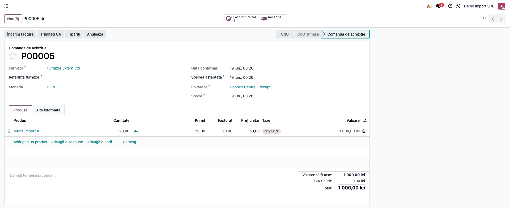
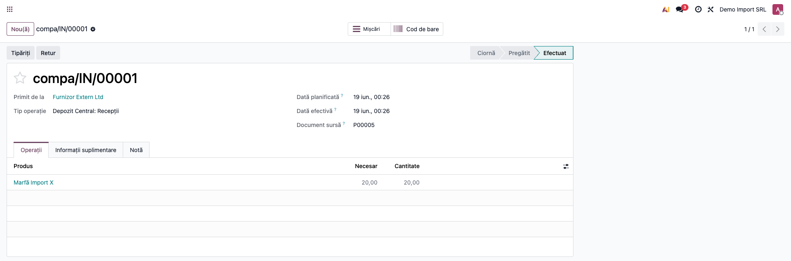
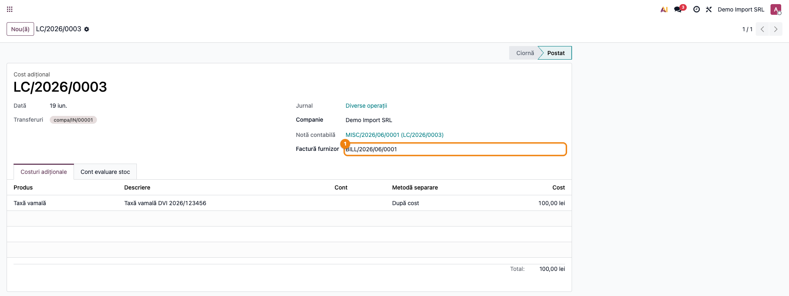
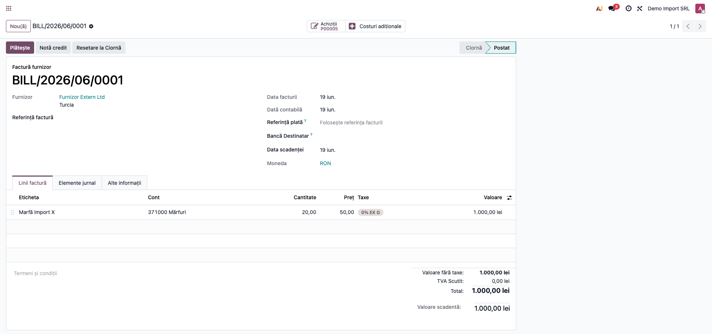
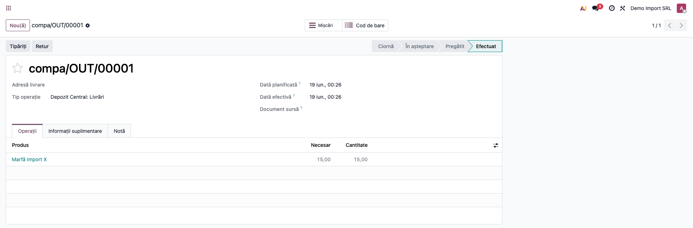
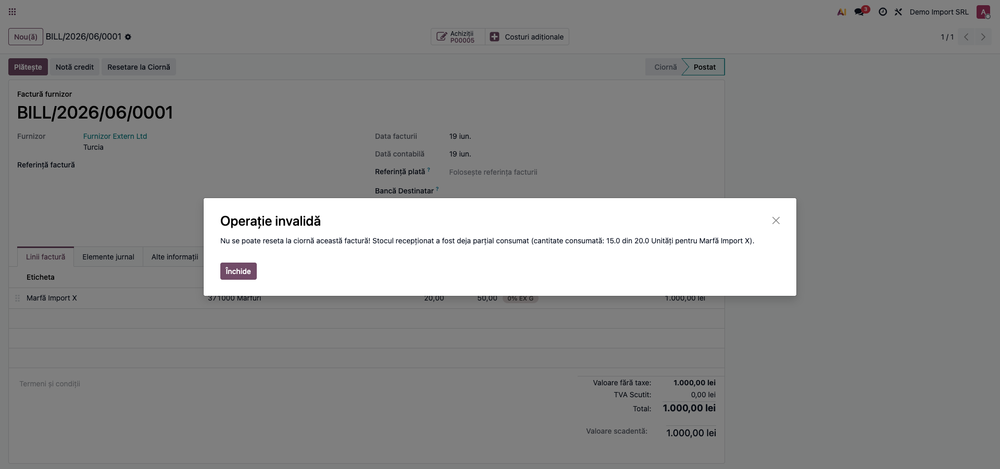
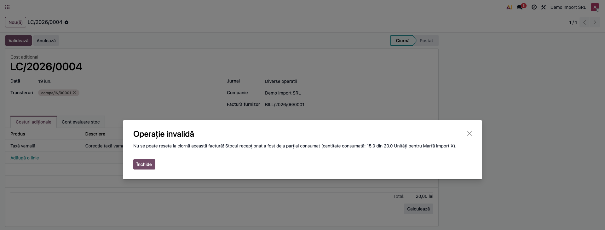

# Fișă Modul: Protecție resetare facturi furnizor și DVI (consum FIFO)

**Poziție plan:** C12
**Modul:** `l10n_ro_invoice_dvi_protect`
**FR:** FR-15
**Capitol manual:** Cap 12.9
**Utilizator principal:** Contabil importuri, Responsabil stocuri
**Prioritate:** 🔴 Ridicată (protejează integritatea costurilor FIFO)

---

## 1. Scop business

Modulul protejează integritatea valorizării stocurilor evaluate FIFO: blochează **resetarea la
ciornă** a facturilor furnizor și **anularea costurilor de aterizare (DVI)** atunci când stocul
recepționat a fost deja parțial consumat. Fără acest blocaj, costul FIFO aplicat ieșirilor
(livrări, consum în producție) ar rămâne „orfan" față de documentul de intrare modificat,
generând inconsistențe contabile greu de remediat.

Consultantul folosește fișa pentru a explica utilizatorului că, după consumul stocului, corecția
nu se mai face prin anularea documentului sursă, ci prin documente de corecție (factură de
stornare, cost de aterizare suplimentar).

## 2. Bază legală și context

Nu există un temei legal explicit care să impună blocajul — este o regulă de **disciplină
operațională** care susține principiul intangibilității înregistrărilor: odată ce costul de
achiziție (inclusiv taxe vamale și transport repartizate prin DVI) s-a propagat în ieșirile FIFO,
modificarea retroactivă a documentului de intrare ar denatura costul vânzărilor și valoarea
stocului raportată.

Contextul tipic este importul non-UE: DVI-ul se înregistrează ca cost de aterizare
(`stock.landed.cost`) care majorează costul stocului recepționat. În Odoo 19 valorizarea se ține
direct pe mișcarea de stoc (câmpurile `is_in`, `quantity`, `remaining_qty`); condiția de blocare
este `remaining_qty < quantity` pe orice mișcare de intrare aferentă comenzii de achiziție.

## 3. Utilizatori și roluri

- Contabil importuri: postează factura furnizor și costul de aterizare (DVI).
- Responsabil stocuri: validează recepția și urmărește consumurile.
- Contabil șef: aprobă procedurile de corecție după consum.
- Consultant implementare: reproduce scenariile FIFO și explică blocajele.

Roluri recomandate pentru testare: Administrator funcțional (instalare), utilizator cu drepturi
de Contabilitate (facturi) și Inventar (recepții, costuri de aterizare).

## 4. Conturi și date implicate

Modulul în sine nu generează note contabile — el doar blochează acțiuni. Conturile implicate vin
din fluxul standard de import pe planul RO:

- `371`/`3xx` — stocul a cărui valoare este majorată de costul de aterizare;
- `408`/`401` — furnizori (factura de marfă și facturile de taxe);
- `446` — taxe vamale datorate bugetului;
- `4426` — TVA deductibilă la import (achitată în vamă).

Date minime pentru demo:
- companie românească cu planul de conturi RO instalat;
- produs stocabil cu **metoda de cost FIFO** pe categoria de produs;
- furnizor (ideal non-UE) și o comandă de achiziție cu recepție validată;
- factură furnizor postată legată de comanda de achiziție;
- cost de aterizare validat pe recepție, cu factura furnizor asociată;
- o livrare/un consum care consumă parțial stocul recepționat.

## 5. Configurare inițială

1. Instalați `l10n_ro_invoice_dvi_protect` (dependențe: `purchase_stock`, `stock_landed_costs`).
2. Setați metoda de cost **FIFO** pe categoria produselor importate
   (**Inventar → Configurare → Categorii de produse**).
3. Pe produsul de cost folosit pentru DVI (taxă vamală, transport), bifați
   **Este cost de aterizare** în fila Achiziții.
4. Verificați că există jurnal de achiziții (facturi furnizor) și jurnal divers
   (costuri de aterizare).
5. Nu există parametri proprii ai modulului — blocajul este activ imediat după instalare.

## 6. Flux de utilizare

### Pasul 1 — Comanda de achiziție și recepția

Accesați **Achiziții → Comenzi → Cereri de ofertă**, creați comanda pentru produsul FIFO
(furnizor extern, cantitate, preț) și confirmați-o.



Din comandă deschideți recepția (butonul inteligent **Recepție**) și validați-o. La validare se
creează mișcarea de intrare valorizată: inițial `remaining_qty = quantity` (nimic consumat).



### Pasul 2 — Înregistrarea DVI ca cost de aterizare

Accesați **Inventar → Operațiuni → Costuri de aterizare** și creați un document nou: selectați
recepția la **Transferuri**, factura de taxe la **Factura furnizor**, adăugați liniile de cost
(taxă vamală, transport, comision vamal) și metoda de repartizare, apoi **Validați**. Valoarea
costurilor intră în costul FIFO al stocului recepționat.



### Pasul 3 — Postarea facturii furnizor

Accesați **Contabilitate → Furnizori → Facturi**, creați factura din comanda de achiziție
(liniile au legătură cu comanda) și **Confirmați**-o.



### Pasul 4 — Consumul parțial al stocului

Operați o ieșire care consumă o parte din stocul recepționat — de exemplu o livrare către client
din **Inventar → Operațiuni → Livrări**. După validare, pe mișcarea de intrare
`remaining_qty` scade sub `quantity`: blocajul devine activ.



### Pasul 5 — Tentativa de resetare a facturii (blocată)

Pe factura furnizor postată, apăsați **Resetare la ciornă**. Modulul verifică mișcările de
intrare aferente comenzii de achiziție și, găsind consum parțial, blochează acțiunea cu un mesaj
care precizează produsul, cantitatea consumată și cantitatea totală.



### Pasul 6 — Tentativa de anulare a costului de aterizare (blocată)

Butonul **Anulează** pe costul de aterizare există doar în starea **Ciornă** (un cost validat nu
mai poate fi anulat din interfața standard). Pe un cost de aterizare în ciornă care are asociată
o factură furnizor cu stoc consumat (de exemplu un DVI de corecție legat de aceeași factură),
apăsarea **Anulează** declanșează aceeași verificare prin factura asociată și blochează anularea
cu același mesaj.



Corecția după consum se face prin **document nou**: factură de stornare (credit note) pentru
diferențe de preț/cantitate, respectiv **cost de aterizare suplimentar** (pozitiv sau negativ) pe
aceeași recepție pentru corecții vamale.

### Note de monografie și raportare

Modulul nu generează note contabile proprii; notele de mai jos aparțin fluxului standard pe care
îl protejează:

- recepție marfă (la cost de achiziție): **Dr 371 = Cr 408**;
- cost de aterizare (DVI) repartizat în stoc: **Dr 371 = Cr cont intermediar al produsului de
  cost** (contul setat pe produsul „taxă vamală"/„transport");
- factura de taxe vamale: **Dr cont intermediar + Dr 4426 = Cr 446/401**;
- la consum/livrare, costul FIFO (inclusiv DVI) trece pe ieșire: **Dr 607 = Cr 371**.

Blocajul garantează că aceste note istorice nu mai pot fi alterate retroactiv prin resetarea
documentelor sursă. TVA-ul deductibil la import intră în D300 prin tag-urile taxelor — neafectat
de acest modul.

## 7. Legături cu alte module / declarații

| Modul / proces | Rol în flux | Tip legătură |
|---|---|---|
| `purchase_stock` | legătura comandă de achiziție ↔ mișcări de stoc | dependență (manifest) |
| `stock_landed_costs` | costuri de aterizare (DVI) și repartizarea lor în cost | dependență (manifest) |
| `stock_account` | valorizarea FIFO pe mișcările de stoc | indirectă (prin dependențe) |
| `terrabit_dvi` | flux DVI complet pentru import non-UE | opțional, complementar |
| `l10n_ro_anaf_d300` | TVA deductibilă la import prin tag-urile taxelor | integrare prin convenție (nu automată) |

Ce este automat: blocarea resetării/anulării când stocul a fost parțial consumat.
Ce rămâne manual: documentele de corecție (stornare, cost de aterizare suplimentar) și decizia
contabilă privind includerea transportului/comisionului în cost.

## 8. Verificări pentru consultant

- [ ] Modulul se instalează fără erori pe baza demo.
- [ ] Resetarea facturii este blocată după un consum parțial FIFO, cu mesaj care indică
      produsul și cantitățile (consumat din total).
- [ ] Anularea costului de aterizare cu factură asociată este blocată în aceeași situație.
- [ ] O factură fără consum (recepție intactă) poate fi resetată normal.
- [ ] Un cost de aterizare **fără** factură furnizor asociată poate fi anulat normal.
- [ ] Produsele AVCO/preț standard nu declanșează blocajul.
- [ ] Procedura de corecție (document nou, nu anulare) este clară pentru contabil.

## 9. Mesaje de eroare frecvente

| Mesaj / simptom | Cauză probabilă | Remediere |
|-----------------|-----------------|-----------|
| „Nu se poate reseta la ciornă această factură! Stocul recepționat a fost deja parțial consumat (cantitate consumată: … din … pentru …)." | Stocul din recepția aferentă facturii a fost consumat în lanțul FIFO | Nu resetați; emiteți factură de stornare pentru corecții |
| Același mesaj la anularea costului de aterizare | Factura furnizor asociată DVI are stoc consumat | Creați un cost de aterizare suplimentar de corecție pe aceeași recepție |
| Blocajul nu apare deși stocul e consumat | Produsul are metoda AVCO/preț standard, nu FIFO | Comportament corect — blocajul vizează doar FIFO |
| Blocajul apare pe o factură mixtă (produse + servicii) | Liniile de produs din comanda de achiziție au stoc consumat | Separați documentele: factura de servicii nu e supusă blocajului |
| Costul de aterizare se anulează deși factura are consum | Câmpul Factura furnizor nu era completat pe costul de aterizare | Asociați întotdeauna factura pe costul de aterizare pentru protecție |

## 10. Capturi de ecran

Capturile (`readme/screenshots/`) sunt **generate automat** din `tests/test_screenshots.py`
(mixinul `ScreenshotCase` din `l10n_ro_doc_screenshots`, import defensiv), în **limba română**,
pe planul de conturi RO:

1. `01_po_import.png` — comanda de achiziție de import confirmată.
2. `02_receptie.png` — recepția validată a mărfii.
3. `03_landed_cost.png` — costul de aterizare (DVI) validat.
4. `04_factura_furnizor.png` — factura furnizor postată.
5. `05_livrare_consum.png` — livrarea care consumă parțial stocul FIFO.
6. `06_blocare_factura.png` — mesajul de blocare la resetarea facturii.
7. `07_blocare_dvi.png` — mesajul de blocare la anularea costului de aterizare.

Regenerare:

```bash
./odoo/odoo-bin -c odoo.conf -d <db> -i l10n_ro_invoice_dvi_protect,l10n_ro_doc_screenshots \
    --test-tags=fise_screenshots --stop-after-init
```

## 11. Observații pentru manual

În manualul final, păstrați explicația orientată pe activitatea utilizatorului: de ce nu se
resetează factura după consum, care este procedura corectă de corecție (document nou) și cum se
recunoaște mesajul de blocare. Subliniați diferența FIFO vs AVCO — blocajul este specific FIFO.
