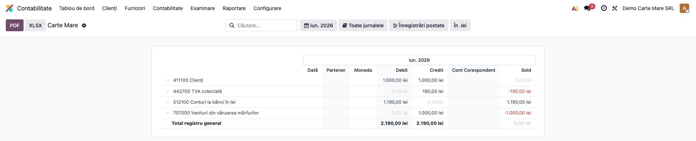
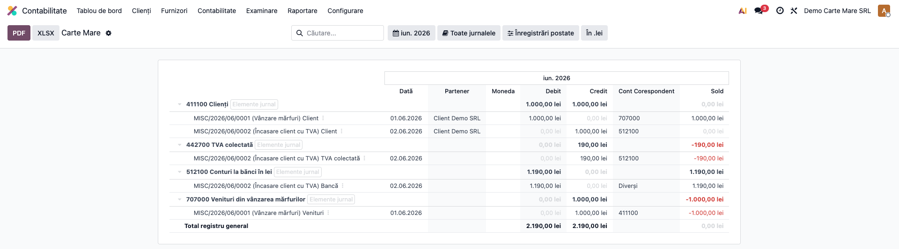
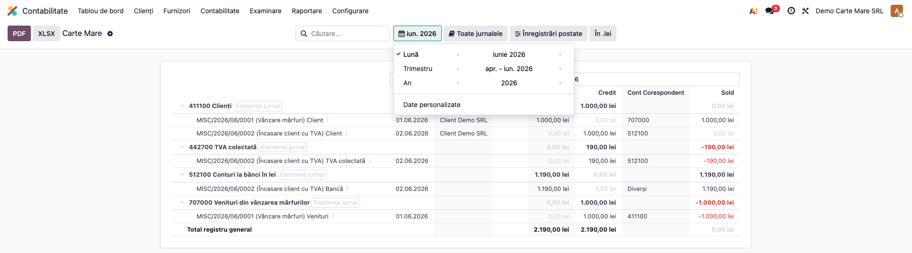

# Fișă Modul: Cont Corespondent în Cartea Mare

**Poziție plan:** B2.2
**Modul:** `l10n_ro_journal_reports`
**FR:** FR-43
**Capitol manual:** Cap 2.4
**Utilizator principal:** Contabil, Auditor
**Prioritate:** 🟢 Standard

---

## 1. Scop business

Modulul adaugă, în raportul **Cartea Mare (General Ledger)** din Odoo Enterprise, o coloană nouă —
**„Cont Corespondent"** — care, pentru fiecare linie de cont (`account.move.line`), afișează contul
de pe cealaltă parte a notei contabile. Este suportul pentru forma românească **Cartea Mare-Șah**
(metoda maestru-șah, OMFP 1802/2014), unde fiecare rulaj trebuie citit împreună cu contul
corespondent. Când o linie are **mai multe** conturi corespondente (notă m:n), se afișează **„Diverși"**.

## 2. Bază legală și context

- **OMFP 1802/2014** — Cartea Mare-Șah (metoda maestru-șah): evidența rulajelor pe cont, cu contul
  corespondent, pentru control debit-credit.
- Coloana nu modifică datele contabile; e doar o **prezentare** peste General Ledger standard.

## 3. Utilizatori și roluri

Contabil (consultare zilnică/lunară), auditor (verificarea corespondențelor debit-credit).

Roluri recomandate pentru testare:
- Administrator funcțional: instalează modulul și verifică apariția coloanei în Cartea Mare.
- Contabil: rulează raportul pe o perioadă, desfășoară conturile, citește corespondentul.
- Auditor: verifică liniile m:n marcate „Diverși".

## 4. Conturi și date implicate

Modulul lucrează pe orice cont; pentru demo se folosesc note uzuale:
- **411 Clienți**, **707 Venituri din vânzarea mărfurilor** — notă simplă 1:1;
- **512 Conturi la bănci**, **411 Clienți**, **4427 TVA colectată** — notă m:n (încasare cu TVA).

Date minime pentru demo:
- companie românească cu plan de conturi RO instalat;
- minim două note postate într-o perioadă deschisă: una cu un singur cont corespondent, una cu mai
  multe (ca să apară „Diverși").

## 5. Configurare inițială

1. Instalați modulul `l10n_ro_journal_reports` (depinde de `account_reports` + `l10n_ro`).
2. Nu necesită configurare suplimentară: coloana apare automat în Cartea Mare.
3. Pregătiți notele de test (vezi pct. 4) într-o perioadă neînchisă.
4. Verificați că utilizatorul are accesul contabil pentru **Contabilitate → Raportare → Cartea Mare**.

## 6. Flux de utilizare

### Pasul 1 — Deschiderea Cărții Mari

Accesați **Contabilitate → Raportare → Cartea Mare (General Ledger)**. Raportul se deschide cu
conturile **pliate**, iar lângă coloanele Debit/Credit apare coloana nouă **„Cont Corespondent"**
(goală la nivel de cont — se completează pe liniile de mișcare).



### Pasul 2 — Desfășurarea conturilor și citirea corespondentului

Desfășurați conturile pentru a vedea liniile (`account.move.line`). Pentru fiecare linie:
- dacă nota are **un singur** cont pe partea opusă → se afișează **codul acelui cont**
  (ex. linia de pe 411 dintr-o vânzare 411 = 707 arată corespondent **707**);
- dacă nota are **mai multe** conturi pe partea opusă → se afișează **„Diverși"**
  (ex. linia de bancă dintr-o încasare 512 = 411 + 4427).



### Pasul 3 — Filtrarea perioadei și export

Selectați intervalul din **filtrul de perioadă** (Lună / Trimestru / An / Date personalizate) și,
opțional, jurnalul. Verificați corespondențele față de notele sursă; folosiți butoanele
**PDF / XLSX** pentru exportul raportului (coloana corespondent este inclusă).



## 7. Legături cu alte module / declarații

| Modul / proces | Rol în flux |
|---|---|
| `account_reports` | raportul General Ledger / Cartea Mare (extins de acest modul) |
| `l10n_ro_account_fisa_cont` | fișa de cont, cu logică de corespondent similară |
| `account` | notele contabile și liniile din care se calculează corespondentul |
| Audit | verificarea corespondențelor debit-credit (inclusiv cazurile „Diverși") |

**Ce este automat:** afișarea contului corespondent în Cartea Mare, inclusiv marcarea „Diverși" pentru
note m:n. **Ce rămâne manual:** interpretarea notelor complexe m:n, unde corespondența reală trebuie
citită pe nota contabilă.

## 8. Verificări pentru consultant

- [ ] Modulul se instalează fără erori; coloana „Cont Corespondent" apare în Cartea Mare.
- [ ] Pe o notă simplă (1:1), linia afișează codul contului opus.
- [ ] Pe o notă m:n, linia cu mai multe conturi opuse afișează „Diverși".
- [ ] Corespondentul respectă regula debit↔credit (doar liniile de semn opus din aceeași notă).
- [ ] Exportul PDF/XLSX include coloana corespondent.

## 9. Mesaje de eroare frecvente

| Mesaj / simptom | Cauză probabilă | Remediere |
|-----------------|-----------------|-----------|
| Coloana „Cont Corespondent" nu apare | Modulul nu e instalat sau raportul e cache-uit | Instalați modulul; reîncărcați pagina/raportul |
| Corespondent gol pe o linie | Nota are o singură latură (ex. doar debit) sau linia nu are pereche de semn opus | Normal — nu există cont corespondent de afișat |
| Apare „Diverși" neașteptat | Nota are mai multe conturi pe partea opusă | Deschideți nota pentru a vedea corespondențele reale |
| Nu se generează linii | Lipsesc note postate în perioada aleasă | Postați documente în perioada de test |

## 10. Capturi de ecran

Capturile din `readme/screenshots/` se obțin din `tests/test_screenshots.py` (mixinul `ScreenshotCase`
din `l10n_ro_doc_screenshots`, HttpCase + Playwright), pe companie RO, în lei, cu plan de conturi RO.

1. `01_carte_mare_pliat.png` — Cartea Mare la deschidere, conturi pliate, coloana „Cont Corespondent".
2. `02_corespondent_diversi.png` — desfășurată: corespondent 1:1 (707/411) și cazul „Diverși".
3. `03_filtru_perioada.png` — filtrul de perioadă (Lună/Trimestru/An) deschis peste raport.

Regenerare:
```
./odoo/odoo-bin -c odoo.conf -d <db> -i l10n_ro_journal_reports,l10n_ro_doc_screenshots \
    --test-tags=fise_screenshots --stop-after-init --http-port=8987 --gevent-port=8988
```

## 11. Observații pentru manual

- Subliniați că este forma **Cartea Mare-Șah** (maestru-șah): rulajul fiecărui cont se citește cu
  contul corespondent, pentru control rapid debit-credit.
- „Diverși" semnalează notele m:n unde corespondența nu se poate reduce la un singur cont — acolo
  verificarea se face pe nota contabilă, nu doar pe raport.
- Coloana este pur **informativă/prezentare**; nu schimbă solduri sau înregistrări.
