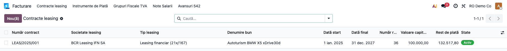
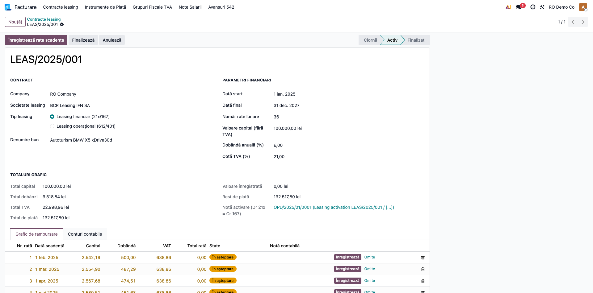
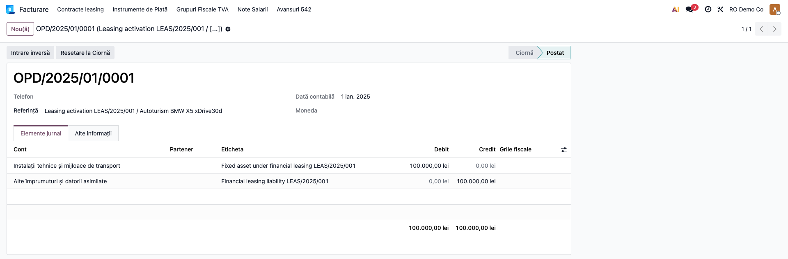

# Fișă Modul: Leasing Financiar și Operațional

**Poziție plan:** B8.2
**Modul:** `l10n_ro_leasing`
**FR:** FR-37
**Capitol manual:** Cap 12.4
**Utilizator principal:** Contabil imobilizări, Contabil furnizori
**Prioritate:** 🟡 Medie

---

## 1. Scop business

Această fișă descrie utilizarea modulului `l10n_ro_leasing` pentru scenariul **Leasing Financiar și Operațional**.
Consultantul folosește documentul pentru reproducerea fluxului în baza demo și
pentru pregătirea capitolului Cap 12.4 din manualul utilizator.

## 2. Bază legală și context

OMFP 1802/2014 pct. 192–205 — leasing financiar/operațional

## 3. Utilizatori și roluri

Contabil Active Fixe

Roluri recomandate pentru testare:
- Administrator funcțional: instalează modulul și verifică meniurile
- Utilizator operațional: rulează fluxul zilnic sau lunar
- Contabil/manager: validează rezultatele contabile și rapoartele

## 4. Conturi și date implicate

21x (activ leasing), 167 (datorii leasing), 666 (dobânzi), 612 (leasing operațional)

Date minime pentru demo:
- companie românească cu localizarea contabilă instalată
- perioadă contabilă deschisă
- jurnale și conturi configurate conform scenariului
- documente de test postate, acolo unde fluxul pornește din contabilitate, stocuri, HR sau vânzări

## 5. Configurare inițială

1. Instalați modulul `l10n_ro_leasing` pe baza demo.
2. Verificați dependențele cerute de manifest și meniurile nou apărute.
3. Configurați conturile, jurnalele, produsele, partenerii sau parametrii specifici fluxului.
4. Pregătiți un set minim de documente postate pentru perioada de test.
5. Verificați că utilizatorul de test are grupurile de acces necesare.

## 6. Flux de utilizare

### Pasul 1 — Accesare

Accesați **Contabilitate → Leasing → Contracte Leasing → Nou** și creați contractul de leasing pentru demo.



### Pasul 2 — Completare date

Completați antetul contractului: societate de leasing, tip (**financiar 21x/167** sau
**operațional 612/401**), bunul, data start, numărul de rate, valoarea capitalului, dobânda
anuală, cota TVA și conturile/jurnalul.


### Pasul 3 — Calcul / generare grafic

Butonul **Calculează graficul** generează graficul de rambursare (anuitate) cu defalcare
capital / dobândă / TVA pe fiecare rată, plus totalurile contractului:



### Pasul 4 — Verificare rezultat

Verificați totalurile graficului (total capital, total dobânzi, total TVA, total de plată) și
corelarea cu graficul primit de la societatea de leasing (vezi captura de la pasul 3).

### Pasul 5 — Confirmare / postare (activare)

La **Activează**, leasingul financiar generează nota de activare **Dr 21x = Cr 167** (recunoașterea
activului și a datoriei). Ratele lunare se postează ulterior (manual sau prin cron): financiar
Dr 167 + 666 + 4426 = Cr 401; operațional Dr 612 + 4426 = Cr 401.



### Pasul 6 — Export / raportare

Modulul nu produce un raport PDF dedicat; artefactul de raportare este **graficul de rambursare**
de pe contract (pasul 3) și **notele contabile** generate (smart button **Note**).

## 7. Legături cu alte module / declarații

| Modul / proces | Rol în flux |
|---|---|
| `account_asset` | activul recunoscut în leasing financiar |
| `account` | rate, dobânzi și TVA pe facturi |
| `l10n_ro_fixed_assets` | câmpuri RO pentru mijlocul fix |
| `l10n_ro_financial_statements` | datorii și active în situații financiare |

Ce este automat: generarea graficului și notelor aferente contractului.
Ce rămâne manual: validarea clasificării financiar/operațional și a graficului primit.

## 8. Verificări pentru consultant

- [ ] Modulul se instalează fără erori pe baza demo.
- [ ] Meniurile și acțiunile sunt vizibile pentru rolul de utilizator potrivit.
- [ ] Fluxul poate fi reprodus de la cap la coadă cu date fictive românești.
- [ ] Rezultatul contabil sau operațional corespunde descrierii din plan.
- [ ] Mesajele de eroare sunt clare pentru un utilizator non-tehnic.
- [ ] Exporturile sau rapoartele se descarcă și conțin datele testate.

## 9. Mesaje de eroare frecvente

| Mesaj / simptom | Cauză probabilă | Remediere |
|-----------------|-----------------|-----------|
| Meniul nu este vizibil | Utilizatorul nu are grupurile necesare | Verificați drepturile de acces și reîncărcați aplicațiile |
| Nu se generează linii | Lipsesc documente postate în perioada aleasă | Creați și postați datele de test necesare |
| Cont lipsă sau jurnal lipsă | Configurarea contabilă este incompletă | Completați conturile și jurnalele în setările modulului |
| Perioada este blocată | Data documentului este într-o perioadă închisă | Folosiți o perioadă deschisă sau ajustați lock date-ul în demo |

## 10. Capturi de ecran

Capturile (`readme/screenshots/`) sunt **generate automat** din `tests/test_screenshots.py`
(mixinul `ScreenshotCase` din `l10n_ro_doc_screenshots`), pe date seedate determinist, pe compania
„RO Company" în RON:

1. `01_lista_contracte.png` — lista contractelor de leasing (pasul 1)
2. `02_contract.png` — antetul contractului financiar (pasul 2)
3. `03_grafic_anuitate.png` — graficul de rambursare cu capital/dobândă/TVA (pașii 3–4)
4. `04_nota_initiala.png` — nota de activare Dr 213 / Cr 167 în detaliu (pasul 5)

Regenerare:

```bash
./odoo/odoo-bin -c odoo.conf -d <db> -i l10n_ro_leasing \
    --test-tags=fise_screenshots --stop-after-init
```

Necesită `playwright` în mediul Odoo + Chrome de sistem; dacă lipsește, testul se sare.
- [ ] Exportul/raportul final, dacă există

## 11. Observații pentru manual

În manualul final, păstrați explicația orientată pe activitatea utilizatorului:
ce problemă rezolvă modulul, când se rulează, ce date trebuie pregătite și cum se verifică rezultatul.
