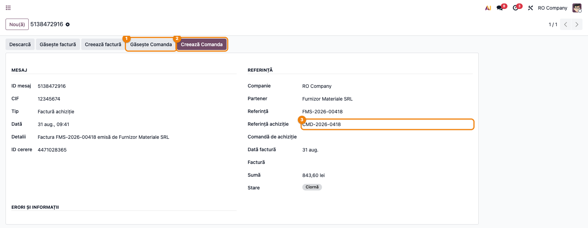

# Fișă Modul: Legarea mesajelor SPV de comenzile de achiziție

**Modul:** `l10n_ro_message_spv_purchase`
**Utilizator principal:** Contabil furnizori, operator achiziții
**Versiune documentată:** 19.0.0.0.7
**Prioritate:** 🔴 Ridicată (verigă centrală în fluxul de facturare furnizori prin e-Factura/SPV; sursa istorică a facturilor duplicate)

---

## 1. Scop business

Modulul face legătura între **mesajul SPV** (factura primită de la furnizor prin e-Factura/ANAF) și
**comanda de achiziție** din Odoo. Fără el, cele două documente trăiesc separat: factura intră din
SPV, comanda rămâne „de facturat", iar operatorul apasă „Creează factură" pe comandă și obține un
al doilea document pentru aceeași achiziție.

Modulul rezolvă asta pe trei planuri:

1. **Identifică comanda** — extrage referința comenzii din XML-ul UBL (`OrderReference/ID`) și o
   folosește pentru a găsi comanda de achiziție corespunzătoare; dacă nu găsește, poate crea una
   nouă (ciornă) pe furnizorul mesajului.
2. **Copiază XML-ul pe comandă** — atașamentul XML din mesajul SPV este *copiat* (nu doar
   referențiat) pe comanda de achiziție. Această copiere este cea care declanșează importul
   automat al liniilor prin `deltatech_purchase_ubl` (vezi [fișa acelui modul](../deltatech_purchase_ubl/FISA_CONSULTANT.md)).
3. **Leagă efectiv factura de liniile comenzii** — setează `purchase_line_id` pe liniile facturii
   prin ruta standard Odoo, ca `qty_invoiced` să crească și comanda să nu mai apară „de facturat".
   Acesta e mecanismul care oprește la rădăcină facturile duplicate.

Pe lângă asta, modulul semnalizează (fără să blocheze) situațiile de duplicat: comandă care are
deja o factură, sau factură cu aceeași cheie de deduplicare creată de cealaltă stivă SPV.

## 2. Bază legală și context

Modulul nu are temei legal propriu — este instrumentul de reconciliere între documentul fiscal
electronic și documentul comercial. Contextul legal este obligația de facturare electronică prin
**RO e-Factura/SPV** (Legea 296/2023 și normele ANAF subsecvente): furnizorul depune factura la
ANAF în format UBL XML, cumpărătorul o preia din SPV, iar factura din SPV este documentul fiscal —
comanda de achiziție rămâne document comercial intern.

> Modulul **nu** decide regimul de TVA, conturile sau data înregistrării. El doar împerechează
> documentele și populează legătura comandă↔factură. Contabilizarea se face de fluxul standard
> Odoo pe factura creată din mesajul SPV.

## 3. Utilizatori și roluri

Contabil furnizori (procesează mesajele SPV, apasă Găsește/Creează Comanda, verifică factura
rezultată), operator achiziții (verifică că comanda legată e cea corectă și că liniile importate
corespund), administrator funcțional (instalează, verifică cronurile SPV și drepturile).

Roluri recomandate pentru testare:
- Administrator funcțional: instalează modulul, verifică dependențele (`l10n_ro_message_spv`,
  `purchase`) și grupul `l10n_ro_config.group_ro_menus` pentru accesul la meniul SPV
- Contabil (Contabilitate / Contabil): rulează Găsește/Creează Comanda pe mesaje SPV
- Manager achiziții: verifică comenzile create automat și liniile importate

## 4. Conturi și date implicate

Modulul nu impune conturi proprii și nu generează note contabile. Elemente specifice pe care le
scrie, relevante pentru verificare:

- **`purchase_ref`** pe mesajul SPV — referința comenzii, extrasă automat din XML la
  `OrderReference/ID`; dacă lipsește, se folosește `ref` (numărul facturii) ca referință de
  căutare;
- **`purchase_order_id`** pe mesajul SPV — comanda legată; e și garda anti-reprocesare (al doilea
  click pe același mesaj ridică eroare);
- **atașament XML copiat pe comandă** (`ir.attachment` cu `res_model='purchase.order'`), cu
  descriere de trasabilitate „Copie XML din mesajul SPV ... (Ref: ...)"; deduplicat pe **checksum**,
  cu revenire pe nume + mimetype;
- **`account.move.line.purchase_line_id`** — legătura reală factură↔comandă, setată prin metoda
  standard `_find_and_set_purchase_orders` din modulul `purchase`. Modulul **nu** reimplementează
  potrivirea de linii;
- **`invoice_origin`** pe factură — se completează cu numărul comenzii, ca să alimenteze matcherul
  standard;
- **`l10n_ro_edi_is_duplicate`** — marcaj de duplicat, scris doar dacă câmpul există în bază
  (cuplaj slab, fără dependență în manifest).

Date minime pentru demo:
- companie românească cu localizarea contabilă și configurarea SPV/ANAF funcțională;
- un mesaj SPV de tip **In Invoice** cu ZIP-ul ANAF descărcat (câmpurile de atașament populate);
- un furnizor setat pe mesaj (`partner_id`);
- opțional, o comandă de achiziție existentă cu `partner_ref` egal cu referința din XML, pentru a
  demonstra cazul „găsește" în loc de „creează".

## 5. Configurare inițială

1. Instalați modulul `l10n_ro_message_spv_purchase` (dependențe: `l10n_ro_message_spv`,
   `purchase`).
2. **Nu există ecran de configurare dedicat.** Modulul se activează exclusiv prin butoanele de pe
   formularul mesajului SPV.
3. Verificați că cronurile de descărcare SPV din `l10n_ro_message_spv` sunt active — ele aduc
   mesajele pe care lucrează modulul:
   - *Romania e-Invoicing: Download SPV Message* (zilnic) — aduce lista de mesaje;
   - *Romania e-Invoicing: Download ZIP SPV Message* (zilnic, `limit=5`) — aduce ZIP-urile.
4. Meniul de lucru: **Contabilitate → Diverse → SPV → Messages SPV**. Accesul cere grupul
   `l10n_ro_config.group_ro_menus`.
5. **Recomandat: instalați și `deltatech_purchase_ubl` (≥ 19.0.1.2.5)**, altfel comanda legată
   primește doar XML-ul atașat, fără importul liniilor. Versiunea minimă contează: sub 19.0.1.2.5
   importul automat ignoră contextul `purchase_ubl_no_new_products` și creează produse duplicate.
6. **Completați cumpărătorul** pe comenzile create din SPV (sau acceptați valoarea implicită dată
   de userul care rulează acțiunea): din `deltatech_purchase_ubl` 19.0.1.4.0, activitatea de
   verificare a importului se atribuie cumpărătorului de pe comandă.
7. Drepturi: acțiunile cer drept de citire pe mesaje SPV și drept de **creare/scriere pe comenzi de
   achiziție**. Copierea atașamentului se face cu `sudo()`, deci nu depinde de drepturile
   utilizatorului pe atașamente.

## 6. Flux de utilizare

### Pasul 1 — Deschideți mesajul SPV

**Contabilitate → Diverse → SPV → Messages SPV**, deschideți mesajul de tip **In Invoice** sau
**In Receipt**. Verificați că **Partenerul** e completat — fără el nu se poate crea o comandă.

Pe formular, sub câmpul **Reference**, modulul adaugă două câmpuri: **Purchase Reference**
(completat automat din XML, dacă factura declară `OrderReference/ID`) și **Purchase Order**
(comanda legată, gol la început).

### Pasul 2 — Alegeți acțiunea: Găsește sau Creează

În bara de sus apar două butoane, vizibile **doar** pe mesajele de achiziție:

- **Găsește Comanda** — caută o comandă după referință și o leagă dacă o găsește. Nu creează
  niciodată nimic.
- **Creează Comanda** — caută la fel; dacă nu găsește nicio comandă, creează una nouă (ciornă) pe
  furnizorul mesajului și o leagă.



Căutarea folosește **Purchase Reference**, iar dacă acesta e gol, **Reference**. Referința se caută
pe trei câmpuri ale comenzii — `partner_ref` (referința furnizorului), `origin` (documentul sursă)
și `name` (numărul comenzii) — restrânsă la partenerul și compania mesajului, când sunt completate.

> **Comenzile complet facturate sunt excluse din căutare** (din 19.0.0.0.6). Motivul: un furnizor
> care reutilizează aceeași referință pe toate facturile (cazul real: referința „ZILNIC", 6 facturi
> în 6 luni) lega toate facturile noi de aceeași comandă deja epuizată. Facturarea parțială nu e
> afectată — o comandă care mai are ce factura rămâne candidat valid.

Rezultate posibile:
- **exact o comandă găsită** — se leagă, se postează nota cu XML-ul și se deschide comanda;
- **mai multe comenzi găsite** — se deschide lista filtrată, ca să alegeți manual; nu se leagă și
  nu se creează nimic;
- **nicio comandă** — la **Găsește** apare un mesaj informativ; la **Creează** se creează comanda
  ciornă (`partner_ref` = referința, `origin` = numele mesajului SPV).

### Pasul 3 — Ce se întâmplă automat la legare

1. Se **copiază XML-ul** pe comandă. Dacă factura nu există încă în Odoo (cazul tipic al comenzii
   create din mesaj), XML-ul se extrage direct din **ZIP-ul brut descărcat de la ANAF** — altfel
   atașamentul ar fi gol și comanda ar rămâne fără linii (tichet #9287).
2. Se **postează o notă** în chatter-ul comenzii: „Legat din mesajul SPV ... (Ref: ...)", cu XML-ul
   atașat.
3. Postarea se face cu contextul **`purchase_ubl_no_new_products`**, ca importul automat din
   `deltatech_purchase_ubl` să **nu creeze produse noi în tăcere** pentru liniile pe care nu le
   poate identifica sigur (tichet #9315). Liniile rămân neasociate, semnalate în jurnalul
   importului — și, din `deltatech_purchase_ubl` 19.0.1.4.0, printr-o activitate „Import SPV
   necesită verificare" pe comandă.
4. Dacă factura **există deja**, se leagă imediat de liniile comenzii (`purchase_line_id`).

### Pasul 4 — Legarea facturii de comandă (cele două ordini)

Modulul acoperă ambele ordini de sosire a documentelor:

- **Factura există, comanda se leagă ulterior** — legarea se face în momentul apăsării butonului
  (Pasul 3.4);
- **Comanda e legată prima, factura se creează după** — legarea se face automat la crearea
  facturii din mesajul SPV (`create_invoice`), pe aceeași rută.

Legarea este **idempotentă**: dacă liniile sunt deja legate de acea comandă, nu se mai face nimic.

> **Liniile de servicii în plus din factură** (transport, discount, ambalaje, ecovaloare) rămân pe
> factură **fără** `purchase_line_id`, deci nu umflă `qty_invoiced` pe comandă. Comportamentul e
> asigurat de ramura `subset_match` a matcherului standard Odoo și acoperit de teste
> (`test_link_preserves_extra_service_lines`).

### Pasul 5 — Semnalizarea duplicatelor

Modulul nu blochează niciodată, dar semnalează în chatter în trei situații:

| Situație | Unde apare nota |
|---|---|
| Comanda are deja o factură pe liniile ei, alta decât cea din SPV | pe factura din SPV **și** pe factura existentă; se setează `l10n_ro_edi_is_duplicate` dacă câmpul există |
| Există deja o factură cu aceeași cheie de deduplicare, creată de cealaltă stivă SPV (Enterprise `l10n_ro_edi` vs OCA) | pe factura nouă, cu marcaj de duplicat |
| Utilizatorul apasă „Creează factură" pe o comandă care are deja factură din SPV | pe comandă, înainte de a se crea factura |

### Pasul 6 — Garda anti-reprocesare

Un **al doilea click** pe Găsește/Creează Comanda, pentru un mesaj deja legat la comanda găsită,
ridică o eroare explicită în loc să reproceseze XML-ul. Motivul: reprocesarea reatașează XML-ul și
retriggerează importul automat, care poate produce produse, linii, recepții și facturi duplicate
(tichet #9055).

## 7. Legături cu alte module / declarații

| Modul / proces | Rol în flux | Tip legătură |
|---|---|---|
| `l10n_ro_message_spv` (OCA) | modelul `l10n.ro.message.spv`, cronurile de descărcare din SPV, crearea facturii din mesaj | dependență (manifest) |
| `purchase` | comenzile de achiziție și matcherul standard `_find_and_set_purchase_orders` | dependență (manifest) |
| `deltatech_purchase_ubl` (≥ 19.0.1.2.5) | importă liniile pe comandă din XML-ul copiat de acest modul; respectă contextul `purchase_ubl_no_new_products` | **modul separat, necesar practic** — nu e în `depends` |
| `l10n_ro_efactura_dedup` | furnizează `l10n_ro_edi_dedup_key` pentru semnalizarea duplicatelor cross-stack | cuplaj slab, opțional (gardă pe existența câmpului) |
| `l10n_ro_edi` (Enterprise) | cealaltă stivă SPV, față de care se face verificarea de duplicat | opțional, doar prin cheia de deduplicare |

Ce este automat: extragerea referinței comenzii din XML, căutarea comenzii, copierea XML-ului pe
comandă (cu fallback pe ZIP-ul ANAF), excluderea comenzilor complet facturate, legarea facturii de
liniile comenzii în ambele ordini, semnalizarea duplicatelor, blocarea reprocesării.

Ce rămâne manual: setarea partenerului pe mesaj, apăsarea butonului Găsește/Creează, alegerea din
listă când există mai multe candidate, verificarea liniilor importate, confirmarea comenzii,
verificarea și postarea facturii.

**Limitări cunoscute — de comunicat clientului:**

1. **Nu există declanșare automată.** Legarea mesaj↔comandă se face doar la apăsarea butonului
   Găsește/Creează Comanda; nu există cron care să lege mesajele SPV de comenzi. Automat e doar
   ce urmează după legare (importul liniilor).
2. **`deltatech_purchase_ubl` nu e în `depends`.** Fără el, comanda primește XML-ul atașat, dar
   **nu primește linii**. Legătura funcțională există, dependența declarată nu — de verificat la
   fiecare implementare.
3. **Căutarea e pe egalitate exactă**, pe trei câmpuri. O referință cu spații, prefixe sau
   diferențe de scriere între XML și comandă nu se potrivește, iar **Creează Comanda** va crea o
   comandă nouă în loc să o găsească pe cea existentă.
4. **Comanda creată automat e ciornă, neconfirmată.** Consecință directă în
   `deltatech_purchase_ubl`: crearea facturii de furnizor din import se sare, iar confirmarea
   ulterioară **nu** o declanșează retroactiv (vezi limitarea 2 din fișa acelui modul).
5. **Semnalizarea duplicatelor e strict informativă** — nu blochează nici postarea facturii, nici
   crearea unei a doua facturi pe comandă.
6. **Legarea facturii de comandă înghite excepțiile** — dacă matcherul standard eșuează, se
   loghează un `warning` în log-ul serverului și metoda întoarce `False`, fără eroare vizibilă în
   interfață. Comanda rămâne „de facturat" fără explicație pentru operator.
7. **`countries: ["ro"]`** — modulul se propune la instalare doar pe companii românești.

## 8. Verificări pentru consultant

- [ ] Modulul se instalează fără erori (dependențe `l10n_ro_message_spv`, `purchase` prezente).
- [ ] `deltatech_purchase_ubl` e instalat, la versiune **≥ 19.0.1.2.5**.
- [ ] Cronurile *Download SPV Message* și *Download ZIP SPV Message* sunt active.
- [ ] Pe un mesaj SPV de tip **In Invoice**, câmpurile **Purchase Reference** și **Purchase Order**
      sunt vizibile sub Reference.
- [ ] **Purchase Reference** se completează automat din XML când factura declară `OrderReference/ID`.
- [ ] Butoanele Găsește/Creează Comanda **nu apar** pe mesaje SPV de vânzare (`out_invoice`,
      `out_receipt`) sau de tip `message`/`error`.
- [ ] **Găsește Comanda** pe o referință inexistentă dă mesaj informativ și **nu** creează comandă.
- [ ] **Creează Comanda** pe o referință inexistentă creează o comandă ciornă cu `partner_ref` =
      referința și `origin` = numele mesajului SPV.
- [ ] O referință care se potrivește pe **mai multe** comenzi deschide lista filtrată, fără să lege
      și fără să creeze.
- [ ] O comandă **complet facturată** nu mai e candidată: o factură nouă cu aceeași referință
      creează o comandă nouă, nu se lipește de cea închisă.
- [ ] XML-ul apare **copiat** pe comandă (atașament cu `res_model = purchase.order`), nu doar
      referențiat, inclusiv când factura nu există încă (fallback pe ZIP-ul ANAF).
- [ ] Reapăsarea butonului nu duplică atașamentul (dedup pe checksum).
- [ ] Liniile comenzii **se importă** din XML după legare (dovada că `deltatech_purchase_ubl` a
      rulat), iar totalul comenzii coincide cu `PayableAmount` din XML.
- [ ] Importul automat **nu creează produse noi** pentru liniile fără cod de furnizor — rămân
      neasociate, cu semnalare.
- [ ] Al doilea click pe Găsește/Creează pentru un mesaj deja legat ridică **UserError**, nu
      reprocesează.
- [ ] După crearea facturii din mesaj, liniile facturii au **`purchase_line_id`** setat, iar
      comanda **nu** mai are `invoice_status = 'to invoice'`.
- [ ] Liniile de servicii suplimentare din factură (transport/discount/ecovaloare) rămân pe factură
      **fără** `purchase_line_id` și nu umflă cantitatea facturată pe comandă.
- [ ] „Creează factură" pe o comandă care are deja factură din SPV postează avertismentul de
      duplicat pe comandă.
- [ ] Dacă `l10n_ro_efactura_dedup` e instalat, o factură cu cheie de deduplicare deja existentă e
      marcată duplicat, cu notă în chatter.

## 9. Mesaje de eroare frecvente

| Simptom | Cauză probabilă | Remediere |
|---|---|---|
| „Această acțiune este disponibilă doar pentru facturile de achiziție primite prin SPV." | Mesajul nu e de tip `in_invoice`/`in_receipt` | Verificați tipul mesajului; pe mesaje de vânzare butoanele nu ar trebui nici să apară |
| „Nu există o referință pentru a căuta comanda de achiziție. Completați câmpul Reference sau Purchase Reference." | XML-ul nu declară `OrderReference/ID` și nici `ref` nu e completat | Completați manual **Purchase Reference** cu referința comenzii de la furnizor |
| „Nu a fost găsită nicio comandă de achiziție după referința '...'." | Referința din factură nu se potrivește exact pe `partner_ref`/`origin`/`name`, sau comanda e deja complet facturată | Corectați `partner_ref` pe comandă ca să coincidă exact, sau folosiți **Creează Comanda** |
| „Nu există un partener setat pe mesaj. Setați partenerul înainte de a crea comanda de achiziție." | Mesajul SPV nu a putut identifica furnizorul după CUI | Completați partenerul pe mesaj (verificați CUI-ul furnizorului în Odoo) |
| „Acest mesaj SPV este deja legat de comanda de achiziție ...  Documentul a fost deja procesat — nu-l reprocesați din nou." | Al doilea click pe Găsește/Creează — gardă intenționată (tichet #9055) | Deschideți comanda din câmpul **Purchase Order**; pentru completări folosiți **Importă UBL → Preview** pe comandă |
| Se deschide o listă de comenzi în loc să lege una | Referința se potrivește pe mai multe comenzi | Alegeți manual comanda corectă și legați-o de acolo (sau restrângeți referințele pe comenzi) |
| Comanda e legată, XML-ul e atașat, dar **comanda n-are linii** | `deltatech_purchase_ubl` nu e instalat, sau e sub 19.0.1.2.5 | Instalați/actualizați modulul; nu e declarat în `depends`, deci lipsa lui nu dă eroare |
| Linie din factură rămasă neasociată, fără produs creat | Comportament așteptat din 19.0.0.0.7 (context `purchase_ubl_no_new_products`) — nu e o eroare | Completați linia manual din comandă, prin Importă UBL → Preview |
| „Atenție duplicat: comanda de achiziție ... are deja factura ..." | Liniile comenzii sunt deja legate de o altă factură ne-anulată | Verificați care factură e cea corectă înainte de a posta; nota e informativă, nu blochează |
| „Posibil duplicat cross-stack SPV: există deja factura ... cu aceeași cheie de deduplicare" | Aceeași factură a fost preluată și de cealaltă stivă SPV (Enterprise vs OCA) | Păstrați o singură factură; anulați/ștergeți duplicatul înainte de postare |
| „Atenție duplicat: pentru această comandă există deja factura/facturile din SPV ..." | S-a apăsat „Creează factură" pe o comandă care are deja factură din SPV | Folosiți factura existentă din SPV în loc să creați una nouă |
| Comanda rămâne „de facturat" deși factura din SPV e legată de mesaj | Legarea liniilor a eșuat — excepția e înghițită, apare doar ca `warning` în log-ul serverului | Căutați în log „Nu s-a putut lega factura"; verificați dacă liniile facturii se potrivesc cu cele ale comenzii |

## 10. Capturi de ecran

Captura `01` e generată **reproductibil** de `tests/test_screenshots.py`, pe compania demo a
localizării RO („RO Company", RON, plan de conturi RO):

```bash
./odoo/odoo-bin -c odoo.conf -d <db> -i l10n_ro_message_spv_purchase,l10n_ro_doc_screenshots --test-tags=fise_screenshots --stop-after-init
```

| # | Fișier | Conținut |
|---|--------|----------|
| 1 | `screenshots/01_mesaj_spv_butoane.png` | Formularul mesajului SPV: ① **Găsește Comanda**, ② **Creează Comanda**, ③ câmpul **Referință achiziție** completat automat din XML |

Rămân **de realizat** (extindeți testul de capturi cu shot-uri noi):

| # | De capturat | Conținut vizat |
|---|---|---|
| 2 | Comandă legată | Chatter-ul comenzii cu nota „Legat din mesajul SPV ..." și XML-ul atașat |
| 3 | Comandă cu linii importate | Liniile aduse din XML pe comanda creată din mesaj (dovada lanțului cu `deltatech_purchase_ubl`) |
| 4 | Avertisment de duplicat | Nota „Atenție duplicat: comanda de achiziție ... are deja factura ..." în chatter |
| 5 | Gardă anti-reprocesare | Dialogul de eroare la al doilea click pe Găsește/Creează Comanda |

Acoperirea parțială a pasului 3 există deja în fișa modulului vecin: captura
[`07_activitate_verificare.png`](../deltatech_purchase_ubl/screenshots/07_activitate_verificare.png)
arată comanda din fluxul automat, cu jurnalul importului în chatter.

## 11. Observații pentru manual

Documentația orientată pe utilizator pentru acest flux este în manualul intern, articolul
„Gestionare facturi furnizori prin Mesaje SPV" (https://www.terrabit.ro/odoo/knowledge/686) —
punctul 8 tratează liniile neasociate. Fișa de consultant completează manualul cu perspectiva de
configurare/depanare: dependența nedeclarată de `deltatech_purchase_ubl` și versiunea minimă,
comportamentul căutării pe egalitate exactă, excluderea comenzilor facturate, și mecanismul real
prin care se evită facturile duplicate (`purchase_line_id`, nu doar legătura informativă
mesaj→comandă).

Cele două fișe se citesc împreună: acest modul **livrează XML-ul** pe comandă,
[`deltatech_purchase_ubl`](../deltatech_purchase_ubl/FISA_CONSULTANT.md) **îl transformă în linii**.
Un incident de tip „comanda din SPV n-are linii" sau „s-au creat produse duplicate" începe aproape
întotdeauna la granița dintre ele.
