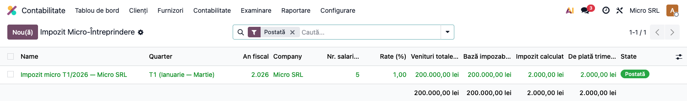
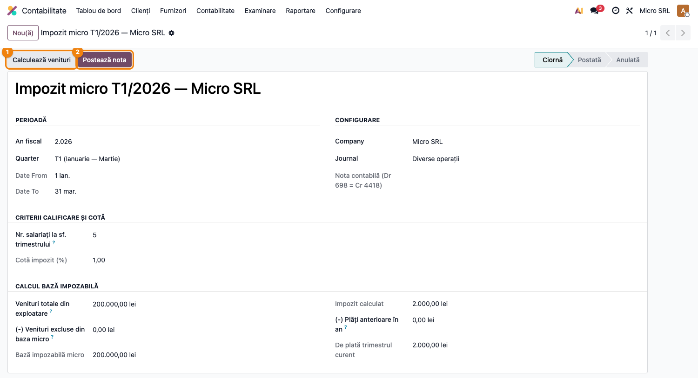
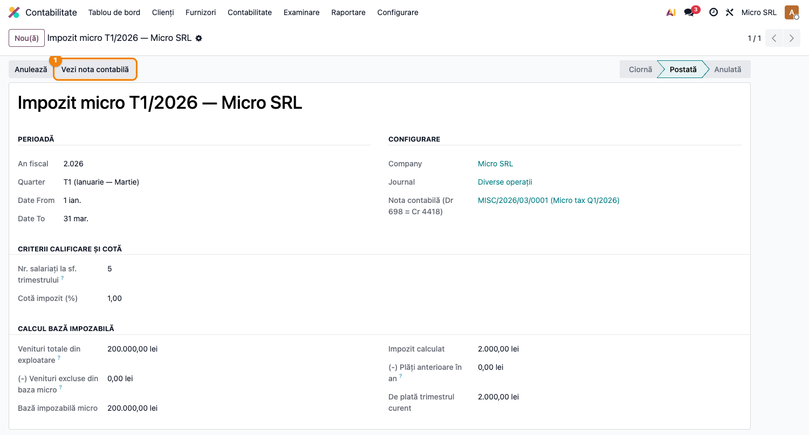
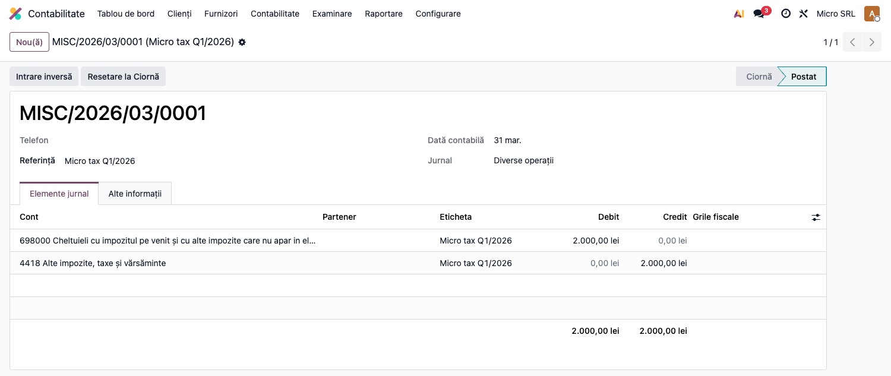

# Fișă Modul: Impozit Micro-Întreprindere

**Poziție plan:** B3.2
**Modul:** `l10n_ro_micro_tax`
**FR:** FR-32
**Capitol manual:** Cap 3.4
**Utilizator principal:** Responsabil fiscal, Contabil șef
**Prioritate:** 🟡 Medie (doar firme micro)

---

## 1. Scop business

Această fișă descrie utilizarea modulului `l10n_ro_micro_tax` pentru scenariul **Impozit Micro-Întreprindere**.
Consultantul folosește documentul pentru reproducerea fluxului în baza demo și
pentru pregătirea capitolului Cap 3.4 din manualul utilizator.

## 2. Bază legală și context

Legea 227/2015 Titlul III (actualizat OUG 115/2023) — 1% sau 3% din venituri

## 3. Utilizatori și roluri

Contabil, Director Financiar

Roluri recomandate pentru testare:
- Administrator funcțional: instalează modulul și verifică meniurile
- Utilizator operațional: rulează fluxul zilnic sau lunar
- Contabil/manager: validează rezultatele contabile și rapoartele

## 4. Conturi și date implicate

698 (cheltuieli impozit micro), 4418 (impozit micro de plată)

Date minime pentru demo:
- companie românească cu localizarea contabilă instalată
- perioadă contabilă deschisă
- jurnale și conturi configurate conform scenariului
- documente de test postate, acolo unde fluxul pornește din contabilitate, stocuri, HR sau vânzări

## 5. Configurare inițială

1. Instalați modulul `l10n_ro_micro_tax` pe baza demo.
2. Verificați dependențele cerute de manifest și meniurile nou apărute.
3. Configurați conturile, jurnalele, produsele, partenerii sau parametrii specifici fluxului.
4. Pregătiți un set minim de documente postate pentru perioada de test.
5. Verificați că utilizatorul de test are grupurile de acces necesare.

## 6. Flux de utilizare

### Pasul 1 — Lista calculelor trimestriale

Accesați **Contabilitate → Contabilitate → Impozit Micro-Întreprindere**. Lista afișează implicit
calculele postate, cu cota aplicată, veniturile, baza impozabilă și impozitul de plată.



Apăsați **Nou** pentru a crea un calcul: alegeți **anul fiscal**, **trimestrul** și **jurnalul** de
operațiuni diverse. Datele `Date From`/`Date To` se completează automat din trimestru.

---

### Pasul 2 — Calculul bazei și al impozitului

Pe formular apăsați **Calculează venituri** ①. Modulul însumează veniturile din conturile de clasa 7
(tip *income*/*income_other*) din trimestru și completează **Venituri totale**, **Venituri excluse**
(dividende, subvenții, diferențe de curs), **baza impozabilă** și, din numărul de salariați, **cota**:
- **1%** dacă firma are cel puțin 1 salariat;
- **3%** dacă nu are salariați.



Verificați rezultatul: `Impozit calculat = Bază impozabilă × Cotă`, iar `De plată = Impozit calculat −
Plăți anterioare în an`.

---

### Pasul 3 — Postarea notei contabile

Apăsați **Postează nota** ②. Calculul trece în starea **Postată**, devine readonly și se generează
automat nota contabilă, accesibilă prin **Vezi nota contabilă** ①.



Nota contabilă înregistrează obligația fiscală **Dr 698 = Cr 4418**:



```
Dr 698   2.000 RON   (Cheltuieli cu impozitul pe venit / alte impozite)
  Cr 4418  2.000 RON   (Alte impozite, taxe și vărsăminte)
```

---

### Monitorizarea pragului de 500.000 EUR

Un cron lunar verifică cifra de afaceri cumulată (YTD) a firmelor în regim micro și:
- la **≥ 80%** din plafon, postează o **avertizare** pe partenerul companiei;
- la **depășirea** plafonului, schimbă automat regimul fiscal la **impozit pe profit** și înregistrează
  data tranziției.

## 7. Legături cu alte module / declarații

| Modul / proces | Rol în flux |
|---|---|
| `l10n_ro_anaf_d100` | declararea obligației curente |
| `account` | venituri impozabile și note 698/441 |
| `l10n_ro_anaf_d107` | scăzăminte sponsorizări, unde este cazul |
| `l10n_ro_period_close_enhanced` | checklist fiscal trimestrial |

Ce este automat: calculul impozitului micro pe baza veniturilor.
Ce rămâne manual: validarea cotei 1%/3% și a condițiilor de încadrare.

## 8. Verificări pentru consultant

- [ ] Modulul se instalează fără erori pe baza demo.
- [ ] Meniurile și acțiunile sunt vizibile pentru rolul de utilizator potrivit.
- [ ] Fluxul poate fi reprodus de la cap la coadă cu date fictive românești.
- [ ] Rezultatul contabil sau operațional corespunde descrierii din plan.
- [ ] Mesajele de eroare sunt clare pentru un utilizator non-tehnic.
- [ ] Exporturile sau rapoartele se descarcă și conțin datele testate.

## 9. Mesaje de eroare frecvente

| Mesaj / simptom | Cauză probabilă | Remediere |
|-----------------|-----------------|-----------|
| Meniul nu este vizibil | Utilizatorul nu are grupurile necesare | Verificați drepturile de acces și reîncărcați aplicațiile |
| Nu se generează linii | Lipsesc documente postate în perioada aleasă | Creați și postați datele de test necesare |
| Cont lipsă sau jurnal lipsă | Configurarea contabilă este incompletă | Completați conturile și jurnalele în setările modulului |
| Perioada este blocată | Data documentului este într-o perioadă închisă | Folosiți o perioadă deschisă sau ajustați lock date-ul în demo |

## 10. Capturi de ecran

Capturile (`readme/screenshots/`) sunt **generate automat** din `tests/test_screenshots.py`
(mixinul `ScreenshotCase` din `l10n_ro_doc_screenshots`, import defensiv), în **limba română**,
pe planul de conturi RO:

1. `01_lista_declaratii.png` — Lista calculelor de impozit micro (filtru implicit „Postată").
2. `02_formular_calcul.png` — Formularul de calcul cu veniturile completate, cota 1% și butoanele de acțiune.
3. `03_declaratie_postata.png` — Calcul postat, cu link către nota contabilă.
4. `04_nota_698_4418.png` — Nota contabilă generată: Dr 698 = Cr 4418.

Regenerare:

```bash
./odoo/odoo-bin -c odoo.conf -d <db> -i l10n_ro_micro_tax,l10n_ro_doc_screenshots \
    --test-tags=fise_screenshots --stop-after-init
```

## 11. Observații pentru manual

În manualul final, păstrați explicația orientată pe activitatea utilizatorului:
ce problemă rezolvă modulul, când se rulează, ce date trebuie pregătite și cum se verifică rezultatul.
