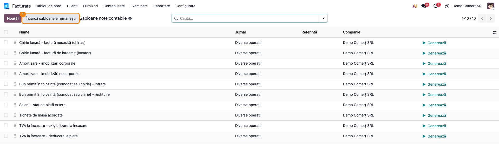
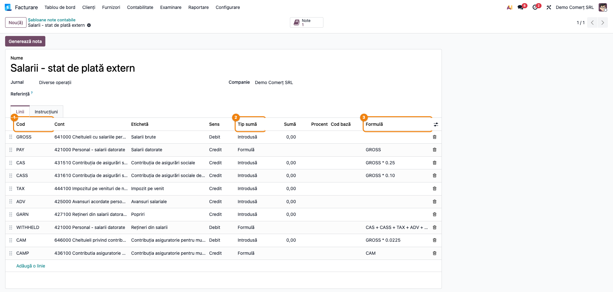
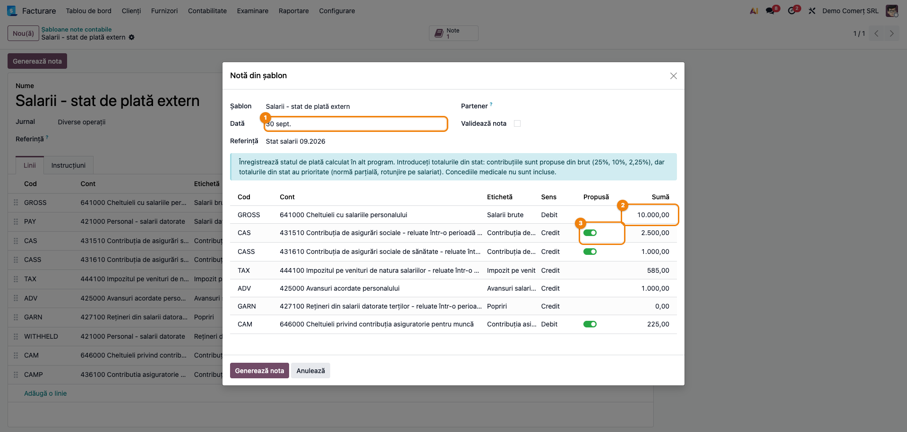
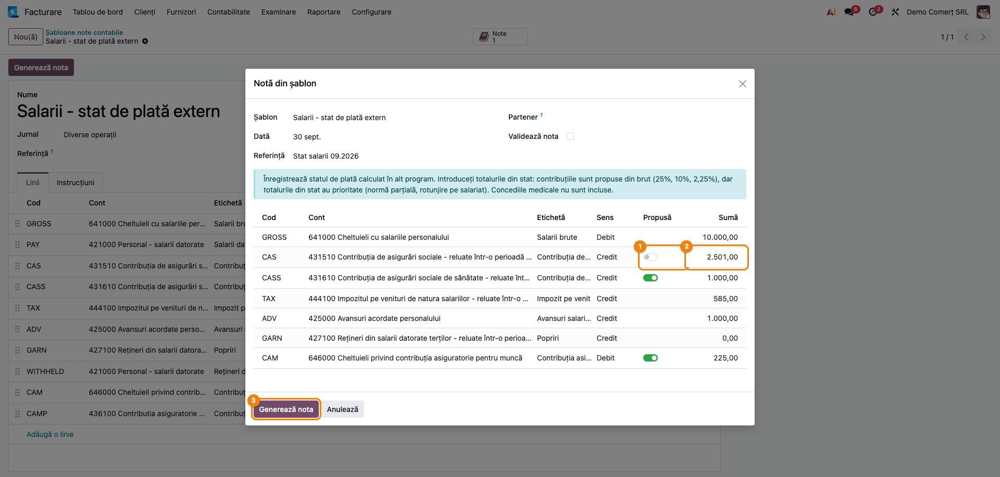
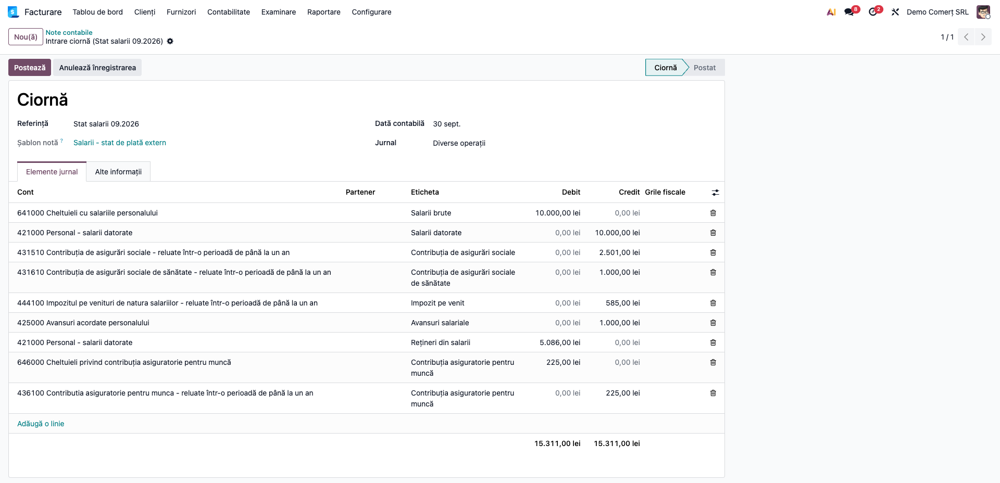
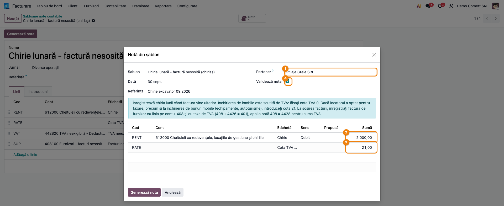
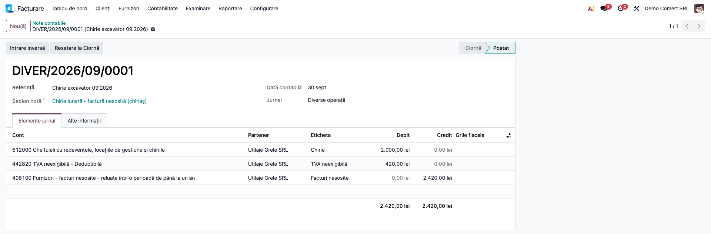
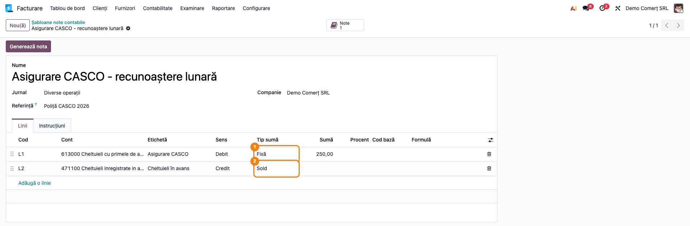
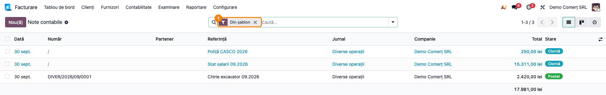
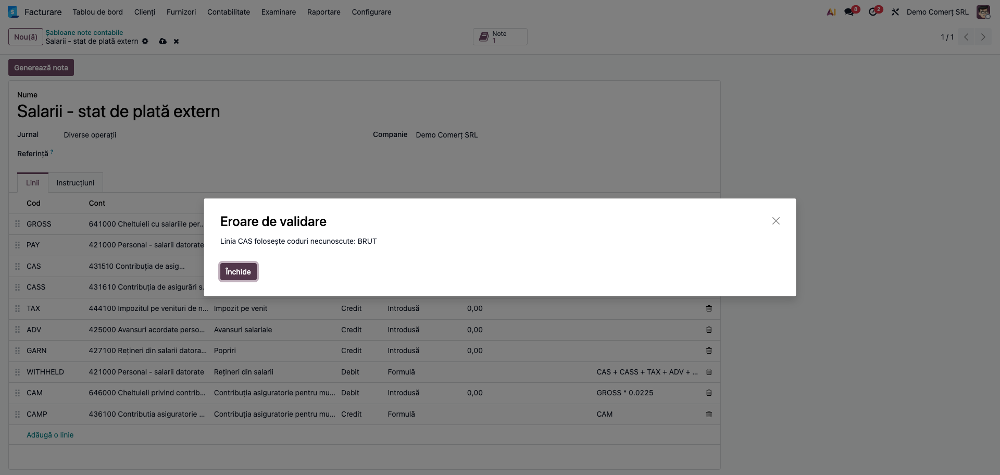

# Fișă Modul: Șabloane de note contabile

**Modul:** `l10n_ro_move_template`
**Poziție plan:** B2.6
**FR:** FR-81
**Capitol manual:** Cap 2.5 — Note contabile și storno în roșu
**Utilizator principal:** Contabil
**Prioritate:** 🟡 Medie (notele recurente — salarii din stat extern, chirii, amortizări, regularizări — se înregistrează din câteva sume, fără tastarea fiecărei linii)

---

## 1. Scop business

O parte din notele contabile lunare au mereu aceleași conturi și se schimbă doar sumele: salariile
preluate dintr-un program de salarizare extern, chiria lunii pentru care factura vine mai târziu,
amortizarea calculată în afara Odoo, recunoașterea lunară a unei cheltuieli plătite în avans. În Odoo
standard, contabilul fie tastează nota de la zero, fie duplică o notă veche și modifică fiecare linie.

Modulul adaugă **șabloane de note contabile**: contabilul definește o dată conturile, sensul Dr/Cr și
modul de calcul al fiecărei linii (sumă introdusă, fixă, procent, formulă sau soldul notei), apoi,
lunar, generează nota dintr-un asistent în care completează **doar data și sumele de bază**. Restul
liniilor se calculează, iar nota iese echilibrată.

Butonul **Încarcă șabloanele românești** creează zece șabloane gata făcute pe planul de conturi RO
(chirie, amortizare, comodat, salarii, tichete de masă, TVA la încasare).

## 2. Bază legală și context

- **Conturile și funcțiunea lor** sunt cele din planul de conturi general (OMFP 1802/2014):
  612/706 cu 408/418 pentru chiriile fără factură la închiderea lunii, 6811 cu 280x/281x pentru
  amortizare, 641/421/431x/444/646/436 pentru salarii, 6422/5328 pentru tichete, 4428 cu 4426/4427
  pentru TVA neexigibilă.
- **Conturile din afara bilanțului** (grupa 80, de ex. 8031 „Imobilizări corporale primite cu chirie
  sau în baza altor contracte similare”, care cuprinde și comodatul) se țin în **partidă simplă**:
  înregistrarea contabilă este doar **Dr 8031** la primire și **Cr 8031** la restituire. Odoo cere însă
  ca fiecare notă să fie echilibrată, așa că șabloanele de comodat adaugă o linie pe un cont tehnic,
  **800000**, creat de modul. Contul 800000 nu face parte din planul de conturi oficial și nu are
  semnificație contabilă: este doar un artefact al Odoo.
- **Contribuțiile salariale** (Codul fiscal): CAS 25% (art. 138), CASS 10% (art. 156), CAM 2,25%
  (art. 220^3). În șablonul de salarii ele sunt doar **propuse** din brut; totalurile din statul de
  plată au prioritate (normă parțială, rotunjire pe salariat).
- **TVA**: închirierea de imobile este scutită (art. 292 alin. (2) lit. e)), cu excepția opțiunii de
  taxare (alin. (3)); închirierea de bunuri mobile se taxează. La TVA la încasare se aplică cota de la
  faptul generator (art. 291 alin. (5)): pentru livrările și prestările cu fapt generator înainte de
  1 august 2025 (sau cu factura ori avansul emise înaintea livrării), cotele de atunci: 19%, 9%, 5%.
- Modulul nu face calcule fiscale proprii: aplică formulele scrise în șablon. Corectitudinea notei
  ține de șablon, pe care îl definește și îl verifică contabilul.

## 3. Utilizatori și roluri

- **Contabilul-șef / administratorul contabil** definește și întreține șabloanele (meniul de
  configurare cere dreptul **Administrator** la Facturare/Contabilitate).
- **Contabilul** generează notele lunare din șabloane.

Roluri recomandate pentru testare:
- un utilizator cu **Administrator** la Facturare/Contabilitate: definește șabloanele și generează
  note (fără aplicația de contabilitate Enterprise are nevoie și de dreptul de la secțiunea 5, punctul 3);
- un utilizator cu dreptul **Afișați toate funcțiile din contabilitate** (contabil): generează note din
  meniul **Notă din șablon**; nu are acces la meniul de configurare, deci alege șablonul doar din
  asistent și nu îl poate modifica;
- un partener furnizor pentru chirie (ex. „Utilaje Grele SRL”).

## 4. Conturi și date implicate

| Șablon românesc | Note generate (Dr = Cr) | Sume introduse |
|---|---|---|
| Chirie lunară - factură nesosită (chiriaș) | 612 + 4428 (44282) = 408 (4081) | chiria, cota TVA (0 la imobile) |
| Chirie lunară - factură de întocmit (locator) | 418 = 706 + 4428 (44281) | chiria, cota TVA |
| Amortizare - imobilizări corporale | 6811 = 2813 | amortizarea lunii |
| Amortizare - imobilizări necorporale | 6811 = 2808 | amortizarea lunii |
| Bun primit în folosință - intrare / restituire | Dr 8031, respectiv Cr 8031 (partidă simplă; în Odoo, contrapartida tehnică 800000) | valoarea din procesul-verbal |
| Salarii - stat de plată extern | 641000 = 421000; 421000 = 431510 + 431610 + 444100 + 425000 + 427100; 646000 = 436100 | brut, impozit, avansuri, popriri (CAS, CASS, CAM propuse) |
| Tichete de masă acordate | 6422 = 5328 | valoarea tichetelor |
| TVA la încasare - exigibilizare la încasare | 4428 (44281) = 4427 | suma încasată cu TVA, cota |
| TVA la încasare - deducere la plată | 4426 = 4428 (44282) | suma plătită cu TVA, cota |

Codurile din paranteze sunt subconturile din planul RO al Odoo (afișate pe 6 cifre: 442820, 408100,
431510 etc.). Un șablon al cărui cont lipsește din planul companiei nu se încarcă.

Date minime pentru demo (cele din capturi):
- companie RO cu plan de conturi RO și jurnalul **Diverse operații**;
- partenerul furnizor **Utilaje Grele SRL**;
- statul de plată al lunii septembrie 2026: brut 10.000 lei, impozit 585 lei, avansuri 1.000 lei,
  CAS din stat 2.501 lei (rotunjire pe salariat);
- chiria unui utilaj (bun mobil, taxabil): 2.000 lei + TVA 21%;
- o poliță CASCO plătită anual, recunoscută lunar: 250 lei/lună.

## 5. Configurare inițială

1. Instalați modulul `l10n_ro_move_template` (depinde de `account` și `l10n_ro`).
2. Pe o companie RO, verificați că planul de conturi RO este instalat și că există un jurnal de tip
   **Diverse** (în planul RO: **Diverse operații**, folosit implicit de șabloane).
3. Dați utilizatorului care definește șabloanele dreptul **Administrator** la Facturare/Contabilitate și,
   fără aplicația de contabilitate Enterprise, bifați și **Afișați toate funcțiile din contabilitate**:
   meniurile **Notă din șablon** și **Note contabile** (Contabilitate → Tranzacții) cer acest drept.

## 6. Flux de utilizare

### Pasul 1 — Încărcați șabloanele românești

Accesați **Facturare → Configurare → Contabilitate → Șabloane note contabile** (sau **Contabilitate →
Configurare → Contabilitate → …**, cu aplicația de contabilitate instalată). Pe o bază nouă lista e
goală. Apăsați **Încarcă șabloanele românești**: apare mesajul „10 șabloane create.” și lista se
reîncarcă. Butonul se poate apăsa din nou oricând: șabloanele cu același nume nu se dublează, iar cele
pentru care lipsește un cont din plan sunt raportate ca „Omise”.



### Pasul 2 — Citiți un șablon: salariile din statul de plată extern

Deschideți **Salarii - stat de plată extern**. Antetul are **Jurnalul** și, opțional, o **Referință**
implicită;
tab-ul **Instrucțiuni** spune operatorului de unde vin sumele. În tab-ul **Linii** fiecare rând are:
1. **Cod** — numele sumei folosit în formule (`GROSS`, `CAS`, `TAX`...);
2. **Cont** și **Sens** (Debit / Credit);
3. **Tip sumă** — *Introdusă* (se completează la generare), *Fixă*, *Procent*, *Formulă* sau *Sold*;
4. **Formulă** — la liniile calculate (`GROSS` pe 421 credit, `CAS + CASS + TAX + ADV + GARN` pe 421
   debit) sau, la liniile introduse, valoarea propusă (`GROSS * 0.25` la CAS).



### Pasul 3 — Generați nota de salarii

Accesați **Facturare → Contabilitate → Tranzacții → Notă din șablon** (sau butonul **Generează nota**
din șablon). Completați:
1. **Șablon** = Salarii - stat de plată extern; instrucțiunile apar sub antet;
2. **Dată** = 30.09.2026 și, opțional, **Referință** (ex. „Stat salarii 09.2026”);
3. sumele din stat: **GROSS** 10.000, **TAX** 585, **ADV** 1.000. **GARN** rămâne 0: liniile cu sumă
   zero nu intră în notă.

Pe rândurile **CAS**, **CASS** și **CAM**, comutatorul **Propusă** este activ: suma se recalculează
din brut pe măsură ce îl tastați (2.500, 1.000, 225).



### Pasul 4 — Înlocuiți o sumă propusă cu cea din stat

Statul de plată are CAS **2.501** lei (rotunjirea se face pe fiecare salariat). Pe rândul **CAS**
dezactivați **Propusă**: suma devine editabilă; tastați 2.501. Verificați că toate sumele sunt cele
din stat, apoi apăsați **Generează nota**.



### Pasul 5 — Verificați nota de salarii

Se deschide nota contabilă, în **Ciornă**, cu câmpul **Șablon notă** completat. În **Elemente jurnal**
găsiți:
- debit **641000** 10.000 și credit **421000** 10.000 (salariile brute datorate);
- credit **431510** 2.501, **431610** 1.000, **444100** 585, **425000** 1.000 și debit **421000**
  5.086 (reținerile); pe 421 rămâne de plată netul de **4.914** lei;
- debit **646000** 225 și credit **436100** 225 (CAM).

Totalul debitelor este egal cu totalul creditelor (15.311 lei). Abia după verificare apăsați
**Postează**. Nota se poate modifica înainte de postare ca orice notă manuală.



### Pasul 6 — Chiria unui utilaj, cu factura încă nesosită

Din **Notă din șablon** alegeți **Chirie lunară - factură nesosită (chiriaș)**:
1. **Partener** = Utilaje Grele SRL — se pune pe toate liniile șablonului fără partener fix;
2. **RENT** = 2.000;
3. **RATE** (cota TVA) = **21**: utilajul este bun mobil, deci chiria se taxează. La chiria de
   imobile lăsați **0** (scutire), iar linia de TVA nu se mai generează. RATE este un parametru (linie
   fără cont): nu are sens și nu apare în notă;
4. bifați **Validează nota** ca nota să fie postată direct, apoi **Generează nota**.



### Pasul 7 — Verificați nota de chirie

Nota este **Postată**: debit **612000** 2.000, debit **442820** (TVA neexigibilă - deductibilă) 420,
credit **408100** (furnizori - facturi nesosite) 2.420, toate pe Utilaje Grele SRL. Linia de 408 este
linia **Sold** a șablonului: suma ei se calculează ca diferență, cu TVA cu tot.

Când sosește factura, nu stornați nota. În Odoo:
1. înregistrați **factura de furnizor** cu linia pe contul **408100** (baza 2.000) și taxa de TVA 21%:
   rezultă `408 2.000 + 4426 420 = 401 2.420`, cu TVA în grilele D300;
2. generați o notă `408 = 4428` de 420 lei, cu partenerul Utilaje Grele SRL pe ambele linii, care închide
   TVA neexigibilă înregistrată la sfârșitul lunii.

Rezultatul net este cel din monografie: 408 se închide, TVA trece din 4428 în 4426. Nu faceți separat
și nota `4426 = 4428`: TVA deductibilă a intrat deja prin factură, iar o notă în plus ar dubla-o.



### Pasul 8 — Definiți un șablon propriu

Pe lista șabloanelor apăsați **Nou**. Exemplu: polița CASCO plătită anual se recunoaște lunar pe
cheltuieli.
1. **Nume** = „Asigurare CASCO - recunoaștere lunară”; **Jurnal** = Diverse operații;
2. linia 1: **Cont** 613000, **Sens** Debit, **Tip sumă** *Fixă*, **Sumă** 250;
3. linia 2: **Cont** 471100, **Sens** Credit, **Tip sumă** *Sold*;
4. **Salvați**. Codurile rămase goale se completează automat (L1, L2);
5. apăsați **Generează nota** și apoi, în asistent, din nou **Generează nota**: nota iese
   `613 250 = 471100 250`, în ciornă (o vedeți în lista de la pasul 9, cu referința „Poliță CASCO 2026”).

Pe o linie se pot pune și **Taxe**: Odoo adaugă linia de TVA cu grilele declarației, iar linia de
**Sold** include și taxa. Liniile fără cont sunt **parametri** (o sumă cu TVA, o cotă): se folosesc în
formule, dar nu apar în notă.



### Pasul 9 — Găsiți notele generate din șabloane

Pe șablon, butonul **Note** arată câte note s-au generat din el și le deschide. Pe lista **Note
contabile** (**Facturare → Contabilitate → Tranzacții → Note contabile**), filtrul **Din șablon**
păstrează doar notele generate din șabloane, iar câmpul de căutare **Șablon notă** le filtrează pe
un șablon anume.



### Pasul 10 — Erori de definire refuzate la salvare

Șablonul este verificat la salvare. O formulă care folosește un cod inexistent (ex. `BRUT * 0.25`
când linia se numește `GROSS`) este refuzată cu mesajul „Linia CAS folosește coduri necunoscute:
BRUT”. Sunt refuzate la fel: codurile duplicate, formulele care se folosesc una pe alta în buclă, mai
mult de o linie de sold și formulele care folosesc linia de sold. Corectați formula și salvați din
nou.



### Note de monografie și raportare

| Operațiune | Notă contabilă | Generată de |
|---|---|---|
| Salarii brute | `641 = 421` | șablon (stat extern) |
| Rețineri din salarii | `421 = 4315 + 4316 + 444 + 425 + 427` | șablon |
| Contribuția asiguratorie pentru muncă | `646 = 436` | șablon |
| Plata netului | `421 = 5121` | manual (extras bancar) |
| Chirie fără factură, la chiriaș | `612 + 4428 = 408` | șablon |
| Sosirea facturii de chirie | factură de furnizor pe 408, cu taxă: `408 + 4426 = 401`; apoi `408 = 4428` | manual (factura furnizorului + notă) |
| Chirie de facturat, la locator | `418 = 706 + 4428` | șablon |
| Emiterea facturii de chirie | factură de client pe 418, cu taxă: `4111 = 418 + 4427`; apoi `4428 = 418` | manual (factura clientului + notă) |
| Amortizare manuală | `6811 = 2813` / `6811 = 2808` | șablon |
| Bun primit în folosință | Dr 8031 la intrare, Cr 8031 la restituire (partidă simplă; Odoo adaugă contrapartida tehnică 800000) | șablon |
| Tichete de masă acordate | `6422 = 5328` | șablon |
| TVA la încasare | `4428 = 4427` (încasare), `4426 = 4428` (plată) | șablon (doar solduri inițiale / corecții; fără grile D300, vezi secțiunea 7) |
| Asigurare plătită în avans, lunar | `613 = 471` | șablon propriu |

În exemplul de salarii: 641 = 421 10.000; 421 = 431510 2.501 + 431610 1.000 + 444100 585 + 425000
1.000 (total 5.086); 646 = 436 225. Netul de plată rămas pe 421: 10.000 − 5.086 = **4.914 lei**.

## 7. Legături cu alte module / declarații

| Modul | Rol |
|---|---|
| `account` | notele contabile, jurnalele, taxele și grilele de taxe; modulul doar le generează |
| `l10n_ro` | planul de conturi RO folosit de șabloanele românești; taxele RO cu grilele D300 |
| `l10n_ro_payroll_import` (opțional) | importă nota de salarii dintr-un fișier JSON/CSV/XLSX exportat de programul de salarizare; șablonul de salarii acoperă cazul fără fișier, când există doar totalurile din stat |
| `l10n_ro_deferred_entries` (opțional) | eșalonarea automată a cheltuielilor și veniturilor în avans (471/472); șablonul 613 = 471 din pasul 8 e varianta manuală, pentru o singură poliță |
| `l10n_ro_anaf_d300` (opțional) | declarația D300 citește grilele de taxe: o linie de șablon cu taxe sau cu grile de taxe ajunge în declarație |
| `account_asset` (Enterprise, opțional) | dacă imobilizarea e gestionată cu modulul de active, **nu** folosiți șablonul de amortizare: amortizarea s-ar înregistra de două ori |

**Ce e automat:** calculul liniilor (procente, formule, valori propuse), ordinea de calcul după
formule, linia de sold (inclusiv TVA), liniile de taxă cu grilele lor, omiterea liniilor cu sumă
zero, legătura notă–șablon, încărcarea șabloanelor românești.
**Ce rămâne manual:** sumele de bază (din statul de plată, contract, procesul-verbal), alegerea cotei
TVA potrivite, verificarea și postarea notei (dacă nu s-a bifat **Validează nota**), închiderea pe
408/418 la sosirea sau emiterea facturii (factura cu taxă pe contul 408/418, plus nota de 4428 — vezi
pasul 7), grilele D300 pe notele de TVA la încasare.

**Șabloanele de TVA la încasare și D300.** Declarația D300 citește **grilele fiscale** de pe linii, nu
conturile. Șabloanele „TVA la încasare” livrate nu au grile, deci nota generată **nu intră în D300**:
rulajul lui 4427 / 4426 din lună va fi mai mare decât TVA din declarație. Dacă suma trebuie declarată
în luna încasării sau a plății (de exemplu un sold de 4428 preluat la implementare), completați, înainte
de generare, coloana **Grile de taxe** pe liniile 4427 / 4426 din șablon (coloana se afișează din
selectorul de coloane al liniilor), cu grilele de TVA indicate de contabil, sau ajustați declarația.
Atenție: astfel ajunge în D300 doar **TVA-ul**. Baza impozabilă este parametrul `TOTAL`, fără cont, deci
nu are linie pe care să poarte grila de bază; baza se ajustează direct în declarație.

## 8. Verificări pentru consultant

- [ ] **Încarcă șabloanele românești** pe o companie RO creează 10 șabloane; a doua apăsare nu creează
      nimic nou și le raportează ca „Omise”.
- [ ] Pe o companie din altă țară butonul este refuzat cu „Șabloanele românești necesită o companie
      cu România ca țară fiscală.”
- [ ] În asistent, la șablonul de salarii, cu GROSS = 10.000, rândurile CAS, CASS și CAM propun
      2.500, 1.000 și 225.
- [ ] Cu **Propusă** dezactivat pe CAS, suma tastată (2.501) se păstrează în nota generată.
- [ ] Nota de salarii are 641 = 421 10.000, reținerile 5.086 pe 421 debit și 646 = 436 225; totalul
      Dr = Cr = 15.311.
- [ ] La chirie cu cota 21 și chiria 2.000, nota are 612 2.000 + 442820 420 = 408100 2.420, toate pe
      partenerul ales; cu cota 0, linia de TVA lipsește și 408 are 2.000.
- [ ] Cu **Validează nota** bifat nota este **Postată**; fără bifă rămâne **Ciornă**.
- [ ] Nota generată are completat **Șablon notă**, iar butonul **Note** de pe șablon o găsește.
- [ ] Un șablon cu o formulă pe un cod inexistent nu se poate salva.
- [ ] Pe un șablon cu taxă pe linie, nota are linia de TVA cu grila D300, iar linia de sold include TVA.
- [ ] O notă generată din „TVA la încasare - exigibilizare la încasare” are coloana **Grile fiscale**
      goală, deci nu apare în D300; după completarea grilelor în șablon, nota nouă le are.
- [ ] La chirie: după factura de furnizor pe 408100 cu taxă și nota `408 = 4428` de 420 lei, soldul lui
      408100 și al lui 442820 pentru acest partener este zero.

## 9. Mesaje de eroare frecvente

| Mesaj | Cauză | Remediere |
|---|---|---|
| „Linia X folosește coduri necunoscute: Y” | Formula sau codul de bază al procentului numește o linie care nu există | Corectați codul în formulă sau redenumiți linia |
| „Liniile X, Y depind una de alta în buclă.” | Două formule se folosesc reciproc | Rescrieți una dintre formule pe sumele de bază |
| „Codurile liniilor trebuie să fie unice: X” | Două linii au același cod | Redenumiți una dintre ele |
| „Un șablon poate avea o singură linie de sold.” | Mai multe linii au tipul *Sold* | Lăsați *Sold* doar pe contrapartida care închide nota |
| „Linia X nu poate folosi linia de sold…” | O formulă sau un procent folosește linia de sold | Folosiți sumele din care se calculează soldul |
| „Codul X nu este valid…” | Codul începe cu cifră sau are spații ori caractere speciale | Folosiți litere, cifre și „_”, începând cu o literă |
| „Toate sumele sunt zero: nu există nimic de înregistrat.” | Nicio sumă completată în asistent | Completați sumele de bază |
| „Nota nu este echilibrată: debit minus credit este …” | Șablonul nu are linie de sold, iar sumele introduse nu se închid | Corectați sumele sau adăugați o linie *Sold* în șablon |
| „Șabloanele românești necesită o companie cu România ca țară fiscală.” | Butonul a fost apăsat pe o companie din altă țară | Schimbați compania activă sau țara fiscală |
| Un șablon apare la „Omise” la încărcare | Există deja un șablon cu același nume, sau lipsește un cont din plan | Redenumiți șablonul existent sau creați contul, apoi încărcați din nou |

## 10. Capturi de ecran

Capturile din `readme/screenshots/` se generează automat din `tests/test_screenshots.py`
(mixinul `ScreenshotCase` din `l10n_ro_doc_screenshots`, HttpCase + Playwright, import defensiv),
în limba română, pe o companie cu plan de conturi RO.

Lista capturilor (în ordinea fluxului):
1. `01_lista_sabloane_ro.png` — lista șabloanelor după „Încarcă șabloanele românești”
2. `02_sablon_salarii.png` — șablonul de salarii: coduri, conturi, tipuri de sumă, formule
3. `03_wizard_salarii.png` — asistentul „Notă din șablon” cu sumele din stat și contribuțiile propuse
4. `04_wizard_suma_suprascrisa.png` — CAS cu „Propusă” dezactivat și suma din stat
5. `05_nota_salarii.png` — nota de salarii generată, în ciornă
6. `06_wizard_chirie.png` — chiria utilajului: partener, chirie, cota TVA, validare directă
7. `07_nota_chirie.png` — nota de chirie postată: 612 + 4428 = 408
8. `08_sablon_propriu.png` — șablon propriu 613 = 471
9. `09_note_din_sablon.png` — lista notelor contabile cu filtrul „Din șablon”
10. `10_eroare_cod_necunoscut.png` — eroarea la salvarea unei formule cu cod necunoscut

Regenerare:
```
./odoo/odoo-bin -c odoo.conf -d test19 -i l10n_ro,l10n_ro_move_template,l10n_ro_doc_screenshots \
    --test-tags=fise_screenshots --stop-after-init
```

## 11. Observații pentru manual

- Explicați diferența dintre **sumele introduse** (vin din documentul justificativ: stat, contract,
  proces-verbal) și **sumele calculate** (procente, formule, sold). Documentul justificativ rămâne
  statul de plată sau contractul: șablonul doar înregistrează.
- Valorile **propuse** (CAS, CASS, CAM) sunt un ajutor: totalul din statul de plată are întotdeauna
  prioritate.
- Codurile liniilor (`GROSS`, `RENT`) sunt în engleză în șabloanele livrate; pot fi redenumite, cu
  condiția să fie actualizate și formulele care le folosesc.
- Șabloanele de **TVA la încasare** sunt pentru solduri inițiale și corecții: taxele Odoo cu TVA la
  încasare fac deja exigibilizarea la reconcilierea plății.
- Contul **800000** este doar contrapartida tehnică a conturilor din afara bilanțului; precizați-l
  în procedura de închidere, pentru că apare în balanța clasei 8. Alte module ale suitei folosesc alte
  contrapartide tehnice (consignația: 8039; obiectele de inventar: 8035C); tratamentul lor în balanță și
  în D406 este încă de verificat.
- În capturi data apare „30 sept.”, fără an: Odoo omite anul pentru anul curent. Data notelor din
  exemplu este 30.09.2026.
- Nu folosiți șablonul de amortizare pentru imobilizările gestionate cu modulul de active.
