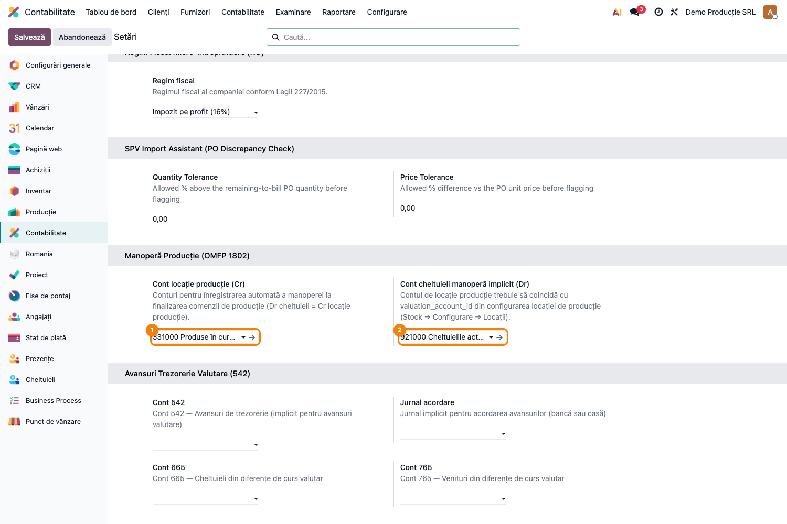
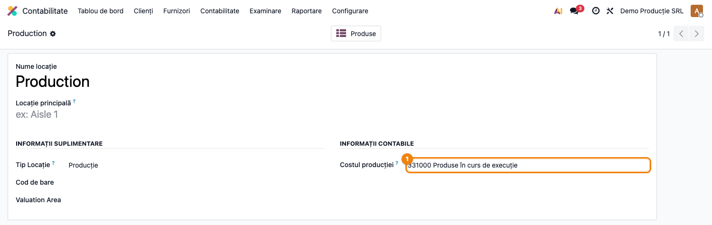

# Fișă Modul: Manoperă Producție și Conturi RO (OMFP 1802)

**Poziție plan:** C17
**Modul:** `l10n_ro_mrp_labour_account`
**FR:** FR-09 / FR-54
**Capitol manual:** Cap 6.8
**Utilizator principal:** Contabil costuri, Responsabil Producție
**Prioritate:** 🟡 Medie

---

## 1. Scop business

Modulul configurează conturile necesare pentru **contabilizarea manoperei de producție** în
conformitate cu OMFP 1802/2014. Leagă locația de producție de contul 331 (Produse în curs de
execuție) și permite selectarea unui cont de cheltuieli implicit (921/923) pentru înregistrarea
automată a costului de manoperă la finalizarea comenzii de fabricație.

## 2. Bază legală și context

OMFP 1802/2014 — clasa 9 conturi de gestiune (921/923), contul 331 pentru producția în curs.
La finalizarea ordinului de producție, costul manoperei se înregistrează:
- **Dr 331** Produse în curs de execuție = **Cr Locație Producție** (contul de evaluare al locației)
- Cheltuiala de manoperă: **Dr 921/923** = **Cr diverse** (salarii, contribuții)

## 3. Utilizatori și roluri

- **Contabil costuri**: configurează conturile și verifică notele generate.
- **Responsabil producție**: validează comenzile de fabricație cu manoperă.
- **Administrator funcțional**: instalează modulul și configurează setările.

## 4. Date implicate

- Locația de producție (tip = Producție) cu contul de evaluare setat la 331.
- Cont cheltuieli manoperă implicit (921 sau 923).
- Centre de lucru cu cost orar definit.
- Comenzi de fabricație cu operații de manoperă înregistrate.

## 5. Configurare inițială

1. Instalați `l10n_ro_mrp_labour_account` (dependențe: `mrp_account`, `l10n_ro`).
2. Mergeți la **Contabilitate → Configurare → Setări**, secțiunea **Manoperă Producție (OMFP 1802)**.
3. Setați **Cont locație producție (Cr)** → 331000 Produse în curs de execuție.
4. Setați **Cont cheltuieli manoperă implicit (Dr)** → 921000 Cheltuielile activității de bază.
5. Mergeți la **Inventar → Configurare → Locații**, deschideți locația **Production** și verificați că
   `Costul producției` este setat la 331000.

## 6. Flux de utilizare

### Pasul 1 — Configurare conturi în setări

Accesați **Contabilitate → Configurare → Setări**, secțiunea **Manoperă Producție (OMFP 1802)**.

Configurați cele două conturi:
- **Cont locație producție (Cr)** ①: 331000 Produse în curs de execuție — contul creditat la
  finalizarea ordinului.
- **Cont cheltuieli manoperă implicit (Dr)** ②: 921000 Cheltuielile activității de bază — contul
  debitat pentru costul de manoperă.

### Pasul 2 — Locație de producție cu cont de evaluare

Accesați **Inventar → Configurare → Locații**, filtrați după tip **Producție**.
Deschideți locația **Production** și verificați câmpul **Costul producției** ①.

Contul 331000 setat aici trebuie să coincidă cu cel din setările modulului — orice discrepanță
duce la înregistrări dezechilibrate la finalizarea comenzii.

### Pasul 3 — Validare flux producție

1. Creați o comandă de fabricație cu centru de lucru configurat cu cost orar.
2. Înregistrați timp efectiv de lucru (ore × tarif).
3. Finalizați comanda (buton **Marchează ca terminat**).
4. Verificați notele generate: Dr 331 = Cr Locație Producție pentru costul manoperei.

## 7. Legături cu alte module

| Modul / proces | Rol în flux |
|---|---|
| `mrp_account` | baza pentru contabilizarea producției |
| `l10n_ro_wip_closing` | închidere WIP: Dr 331 → Dr 345/711 la finele perioadei |
| `l10n_ro_stock_cmp_periodic` | recalculul CMP periodic folosit la evaluare |
| `stock_account` | costul produsului finit și mișcările de stoc |

Ce este automat: asocierea contului de evaluare la locația de producție (prin `post_init_hook`).
Ce rămâne manual: configurarea tarifelor pe centrele de lucru și verificarea costului final.

## 8. Verificări pentru consultant

- [ ] Contul 331 este setat în setările modulului.
- [ ] Contul 921/923 este setat ca cheltuială de manoperă.
- [ ] Locația Production are `valuation_account_id = 331000`.
- [ ] La finalizarea comenzii se generează nota Dr 331 = Cr locație producție.
- [ ] Costul final al produsului include manopera.

## 9. Mesaje frecvente

| Simptom | Cauză probabilă | Remediere |
|---------|-----------------|-----------|
| Costul manoperei este zero | Centru de lucru fără cost orar sau conturi lipsă | Configurați centrul și conturile în setări |
| Nota generată la produs finit nu conține 331 | Locația de producție nu are `valuation_account_id` setat | Setați contul în Inventar → Configurare → Locații |
| Modulul nu apare în setări | Compania nu are localizarea RO activă | Instalați `l10n_ro` și setați țara pe companie |

## 10. Capturi de ecran

| # | Fișier | Conținut |
|---|--------|----------|
| 1 | `screenshots/01_setari_mrp_labour.png` | Setări Contabilitate — secțiunea Manoperă Producție cu conturile 331 și 921 configurate |
| 2 | `screenshots/02_locatie_productie.png` | Locația Production — câmpul Costul producției setat pe 331000 |
