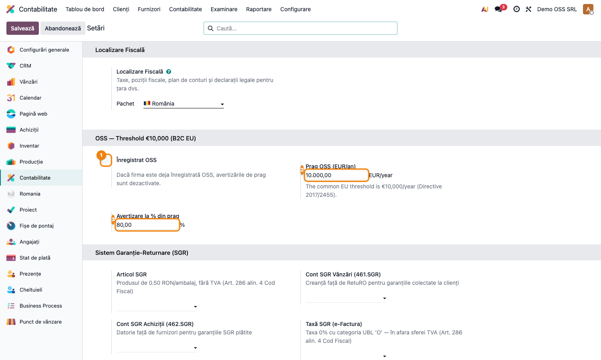
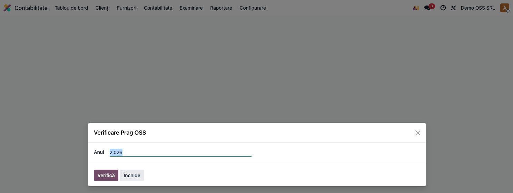

# Fișă Modul: Prag OSS €10.000 (FR-22)

**Modul:** `l10n_ro_oss_threshold`
**FR:** FR-22 (OSS One Stop Shop)
**Capitol manual:** Cap 4.8
**Utilizator principal:** Contabil TVA, Operator facturare
**Prioritate:** 🟡 Medie

---

## 1. Scop business

Modulul monitorizează pragul de **€10.000/an** al vânzărilor B2C intracomunitare, peste care
firma este obligată să aplice TVA-ul statului de consum și să se înregistreze în regimul
**OSS** (One Stop Shop). Consultantul îl prezintă ca instrument de avertizare timpurie,
complementar modulelor OSS (`l10n_eu_oss`, `l10n_ro_anaf_d398`).

## 2. Bază legală și context

- **Directiva (UE) 2017/2455 și 2019/1995** — pragul unic de €10.000/an pentru vânzări B2C
  intracomunitare de bunuri și servicii TBE.
- Sub prag: TVA al statului de origine (RO). Peste prag: TVA al statului de consum → înregistrare
  obligatorie OSS.

## 3. Utilizatori și roluri

- **Contabil TVA**: urmărește cumulul anual și decide înregistrarea OSS.
- **Operator facturare**: observă avertizarea pe factură când pragul e aproape/depășit.

## 4. Date implicate

- Pragul anual și procentul de avertizare (pe companie).
- Statusul de înregistrare OSS (flag pe companie).
- Facturi B2C intracomunitare cu poziție fiscală OSS (cumul anual, convertit în EUR).

## 5. Configurare inițială

1. Instalați `l10n_ro_oss_threshold` (se recomandă împreună cu `l10n_eu_oss`).
2. Mergeți la **Contabilitate → Configurare → Setări**, secțiunea **OSS — Threshold €10,000 (B2C EU)**:
   - **Înregistrat OSS** ①: bifați dacă firma e deja în regim OSS (dezactivează avertizările).
   - **Prag OSS (EUR/an)** ②: implicit €10.000 (Directiva 2017/2455).
   - **Avertizare la % din prag** ③: implicit 80% — avertizarea apare la €8.000 cumul.

**Setări OSS — pragul €10.000 și procentul de avertizare 80% configurate:**

## 6. Flux de utilizare

### Pasul 1 — Verificare manuală a pragului

Accesați **Contabilitate → Rapoarte → OSS Threshold Check**. Se deschide dialogul
**Verificare Prag OSS** cu câmpul **Anul** pre-completat cu anul curent. Click **Verifică**
pentru a calcula cumulul vânzărilor B2C UE în EUR.

**Wizardul de verificare — Anul curent pre-completat, buton Verifică:**

Rezultatul afișează:
- **Vânzări B2C UE (EUR)** — cumulul anual convertit în EUR.
- **Prag OSS (EUR)** — valoarea configurată.
- **Procentaj (%)** — vânzări / prag × 100.
- **Status** — `ok` / `warning` / `exceeded` / `registered`.

### Pasul 2 — Avertizare automată pe factură

Pe orice factură B2C cu poziție fiscală OSS (`auto_apply=True` din `l10n_eu_oss`) apare
automat un banner de avertizare când cumulul anual depășește procentul configurat:
- Banner **portocaliu** — „approaching threshold, check whether OSS registration is required"
- Banner **roșu** — „EXCEEDED — OSS registration is mandatory!"

### Pasul 3 — Cron lunar

Un cron lunar verifică toate companiile RO neînregistrate și creează o activitate de avertizare
pe companie când statusul este `warning` sau `exceeded`.

### Pasul 4 — Înregistrare OSS

Odată înregistrată în OSS (via ANAF/OSS portal), bifați **Înregistrat OSS** în setări.
Avertizările se dezactivează și firma aplică TVA statului de consum pe facturile B2C UE.

## 7. Legături cu alte module

| Modul | Rol în flux |
|---|---|
| `l10n_eu_oss` | pozițiile fiscale OSS cu `auto_apply=True` — necesare pentru calculul cumulului |
| `l10n_ro_anaf_d398` | declarația OSS în RO (trimestrial) |
| `account` | facturile B2C UE și cursurile de schimb EUR |

Ce este automat: cumulul anual B2C UE, avertizarea pe factură, activitatea cron lunară.
Ce rămâne manual: decizia de înregistrare OSS, aplicarea TVA statului de consum.

## 8. Verificări pentru consultant

- [ ] Pragul (€10.000) și procentul de avertizare (80%) sunt configurate.
- [ ] Dacă `l10n_eu_oss` e instalat, pozițiile fiscale OSS au `auto_apply=True`.
- [ ] Wizardul **OSS Threshold Check** calculează corect cumulul anual în EUR.
- [ ] Avertizarea apare pe factură la atingerea/depășirea pragului.
- [ ] Cron-ul lunar creează activitate de avertizare pe companie.

## 9. Mesaje frecvente

| Simptom | Cauză probabilă | Remediere |
|---------|-----------------|-----------|
| Wizardul returnează 0 EUR | `l10n_eu_oss` nu e instalat sau nicio poziție OSS `auto_apply` | Instalați `l10n_eu_oss` și verificați pozițiile fiscale |
| Nu apare avertizarea pe factură | factura nu are poziție fiscală OSS | Verificați `fiscal_position_id.auto_apply` pe factură |
| Avertizare prematură | procentul e prea mic | Ajustați câmpul **Avertizare la % din prag** |

## 10. Capturi de ecran

| # | Fișier | Conținut |
|---|--------|----------|
| 1 | `screenshots/01_setari_oss.png` | Setări Contabilitate — secțiunea OSS cu pragul €10.000 și procentul 80% |
| 2 | `screenshots/02_oss_check_wizard.png` | Wizardul Verificare Prag OSS — dialog cu Anul și butonul Verifică |
