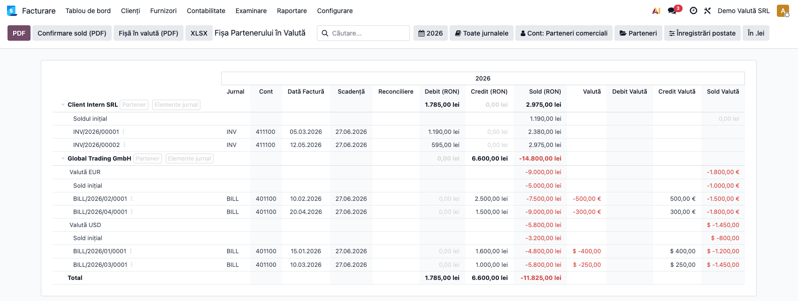
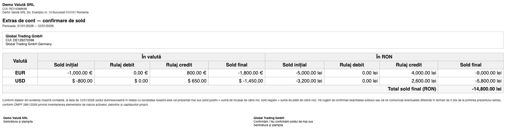
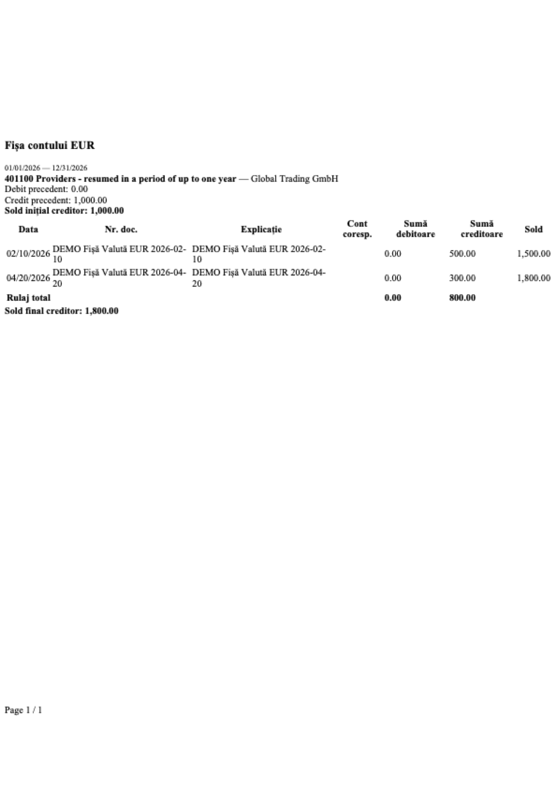

# Fișă Modul: Fișa Partenerului în Valută

**Modul:** `l10n_ro_partner_ledger_currency`
**Capitol manual:** Cap 2.2 — Fișa Partenerului în Valută
**Utilizator principal:** Contabil (tranzacții valutare), Responsabil Clienți/Furnizori
**Prioritate:** 🟡 Medie (necesar la companiile cu parteneri externi; esențial la confirmările anuale de sold)

---

## 1. Scop business

Companiile cu parteneri externi trebuie să urmărească simultan **soldul în RON** (moneda
funcțională, pentru contabilitate) și **soldul în valuta originală** (EUR, USD etc.) pentru
confirmarea soldurilor cu partenerii. Partner Ledger-ul standard afișează doar coloanele RON.
Modulul adaugă coloanele **Debit/Credit/Sold Valută** direct în fișa partenerului, grupează
automat mișcările pe valută la partenerii cu mai multe monede și generează două documente
tipăribile — fără a afecta registrele contabile:

- **Confirmare sold (PDF)** — extras de cont compact, cu o linie per valută;
- **Fișă în valută (PDF)** — „Fișa contului" în format clasic (doar în valută, o linie per document,
  cu sold cumulat), utilă contabililor obișnuiți cu fișa de cont clasică și pentru verificarea
  rulajelor pe un partener/cont în moneda tranzacției.

## 2. Bază legală și context

- **OMFP 1802/2014 Pct. 7 alin. (2)** — contabilitatea operațiunilor efectuate în valută se ține
  atât în moneda națională, cât și în valută (dubla evidență RON + valută);
- **OMFP 1802/2014 Pct. 89 alin. (3)** — evaluarea la bilanț a creanțelor și datoriilor în valută
  la cursul BNR de la închiderea exercițiului (acoperită de modulul complementar de reevaluare);
- **OMFP 2861/2009** — inventarierea elementelor de natura activelor, datoriilor și capitalurilor
  proprii: confirmarea anuală a soldurilor cu partenerii (extrasul de cont generat de modul include
  textul de confirmare corespunzător);
- practică contabilă: confirmarea soldurilor cu partenerii externi în valuta contractului.

## 3. Utilizatori și roluri

| Rol | Acțiune |
|-----|---------|
| Contabil | Verificare solduri valutare per partener; emiterea confirmărilor de sold |
| Responsabil Clienți | Confirmare sold în EUR cu clientul extern |
| Responsabil Furnizori | Verificare sold în USD față de extrasul furnizorului |

Roluri recomandate pentru testare:
- Administrator funcțional: instalează modulul și verifică meniul de raport;
- Contabil: rulează fluxul de verificare și emite confirmarea de sold.

## 4. Conturi și date implicate

Raportul citește conturile de **parteneri** din planul RO: **4111** (clienți), **401** (furnizori),
și restul conturilor de tip creanță/datorie partener (409x, 419, 461, 462 etc.). Nu generează
note contabile — este un raport de citire peste liniile contabile existente.

Date minime pentru demo:
- companie românească cu planul de conturi RO instalat (`l10n_ro`);
- multi-valută activă (cel puțin EUR) cu **cursuri valutare** introduse;
- facturi/plăți postate în valută (ideal: un partener cu două valute și unul doar în RON,
  plus o mișcare în anul anterior pentru a vedea Soldul Inițial).

## 5. Configurare inițială

1. Instalați modulul `l10n_ro_partner_ledger_currency` pe baza demo (cu `account_reports` Enterprise).
2. Activați multi-valuta: **Setări → Contabilitate → Valute → activați cel puțin EUR**.
3. Verificați că există cursuri valutare (automat prin serviciul de cursuri sau manual).
4. Verificați că compania are **Țara = România** — raportul este vizibil doar pentru companii RO.
5. Postați câteva facturi în valută și în RON pentru a avea date de verificat.

## 6. Flux de utilizare

### Pasul 1 — Accesarea și citirea raportului

Accesați **Contabilitate → Raportare → Parteneri → Fișa Partenerului în Valută** și desfaceți
partenerii (săgeata `▶` sau filtrul *Desfășoară tot*).

**Găsiți pe ecran:** pe lângă coloanele standard (Jurnal, Cont, Dată Factură, Scadență,
Reconciliere, Debit/Credit/Sold în RON), raportul afișează coloanele **Valută**, **Debit Valută**,
**Credit Valută** și **Sold Valută** — sumele în moneda originală a tranzacției. La partenerii
cu mai multe valute apare câte un grup per valută („Valută EUR", „Valută USD"), fiecare cu
propriul **Sold Inițial** și propriul sold rulant; antetul grupului arată soldul final al valutei.



**Verificați:**
- la furnizorul cu două valute (`Global Trading GmbH`) există grupurile **EUR** și **USD**,
  fiecare cu Sold Inițial propriu (mișcarea din anul anterior) și sold rulant coerent în moneda lui;
- la partenerul doar în RON (`Client Intern SRL`) coloanele valutare sunt **goale** — convenție
  intenționată, pentru vizibilitatea tranzacțiilor cu valută efectivă;
- soldul RON al partenerului (linia de antet) este suma tuturor valutelor.

### Pasul 2 — Confirmarea soldului cu un partener extern

**Scenariul:** furnizorul extern (Germania, EUR) solicită confirmarea soldului la sfârșit de an.

1. În același raport, filtrați pe **Partener** (bara de căutare) și setați perioada de confirmare
   (ex. `01.01.2026 – 31.12.2026`).
2. **Găsiți pe ecran:** prima linie a fiecărui grup de valută este **Sold Inițial** (soldul la
   intrarea în perioadă), iar antetul grupului arată **soldul final** în valută și în RON.
3. **Verificați:** soldul final în valută corespunde extrasului de cont comunicat de partener;
   perioada selectată este cea de confirmare; partenerul filtrat este cel corect.
4. Abia apoi exportați: apăsați butonul **Confirmare sold (PDF)** din antetul raportului
   (alături de PDF/XLSX standard).

Documentul generat are **câte o pagină per partener**: datele companiei și ale partenerului,
tabelul cu **o linie per valută** (Sold inițial / Rulaj debit / Rulaj credit / Sold final, în
valută și în RON), **Total sold final (RON)**, textul de confirmare conform OMFP 2861/2009 și
zonele de semnătură pentru ambele părți.



Convenția de semn: **sold pozitiv = sumă de încasat** de către companie, **sold negativ = sumă
de plătit** (la furnizori soldul apare negativ).

### Pasul 3 — Fișa de cont în valută (PDF), format clasic

**Scenariul:** contabilul vrea fișa de cont a unui partener în valută, în formatul cu care e
obișnuit din fișa de cont clasică (doar valută, fără coloanele RON/scadență/jurnal/reconciliere).

1. În raport, filtrați după **perioadă**, **partener** și, dacă e cazul, **cont** sau **jurnal**
   (aceleași filtre folosite pe ecran — nu este nevoie de niciun wizard).
2. Apăsați butonul **Fișă în valută (PDF)** din antetul raportului (alături de Confirmare sold și
   PDF/XLSX).
3. **Găsiți în document:** câte o **„Fișă a contului"** per (partener, cont, valută) — antet cu
   `Debit precedent` / `Credit precedent` / `Sold inițial`, tabelul `Data | Nr. doc. | Explicație |
   Cont coresp. | Sumă debitoare | Sumă creditoare | Sold` (toate în valută, o linie per document,
   cu **sold cumulat**), iar la final `Rulaj total` și `Sold final`.

Documentul este randat cu **layout-ul de document configurat în Odoo** (antet/subsol cu
datele și logo-ul firmei din *Setări → Companii → Aspect document*), ca să respecte stilul
celorlalte documente.



**Verificați:**
- fișa este în moneda tranzacției (ex. EUR), fără valori în lei, fără scadență/jurnal/reconciliere;
- soldul final corespunde antetului de grup din raportul de pe ecran (ex. `Global Trading GmbH`,
  cont 401, EUR: sold final creditor);
- tranzacțiile în moneda companiei apar ca **fișe separate în RON**;
- funcționează și pe conturile de **avans** (419/409) prin filtrarea pe cont.

### Pasul 4 — Exportul fișei complete (arhivare)

Pentru arhivarea fișei detaliate (toate liniile, nu doar soldurile), folosiți butoanele standard
**PDF** / **XLSX** din antetul raportului — exportă raportul așa cum este afișat (cu grupurile de
valută, dacă partenerii sunt desfăcuți). Ecranul este același din Pasul 1
(vezi `screenshots/01_raport_valuta.png`).

### Note de monografie și raportare

Modulul **nu generează note contabile** — citește liniile existente pe conturile de parteneri
(4111, 401 etc.) și afișează `amount_currency` alături de Debit/Credit în RON:

- factura de furnizor în EUR: **Dr 6xx / Dr 4426 = Cr 401** (în RON la cursul facturii), cu
  `Credit Valută = suma EUR` pe linia 401 din fișă;
- plata facturii: **Dr 401 = Cr 5124**, cu `Debit Valută = suma EUR`;
- diferențele de curs (665/765) apar în fișă doar în coloanele RON (sunt linii fără valută) —
  soldul valutar nu este afectat, corect contabil;
- reevaluarea soldurilor la cursul BNR de închidere se face separat
  (modulul `l10n_ro_currency_revaluation`).

## 7. Legături cu alte module / declarații

| Modul / proces | Rol în flux | Tip legătură |
|---|---|---|
| `account_reports` | infrastructura Partner Ledger, filtrele și exporturile | dependență (manifest) |
| `l10n_ro` | plan de conturi RO și marcarea companiei România | dependență (manifest) |
| `account` | facturi, plăți și linii contabile multi-valută | indirectă (prin account_reports) |
| `currency_rate_live` | cursuri valutare actualizate automat | opțional |
| `l10n_ro_currency_revaluation` | reevaluarea lunară a soldurilor în valută | complementar |

Ce este automat: coloanele valutare, soldul progresiv în valuta originală, gruparea pe valută
la partenerii multi-monedă și generarea documentului de confirmare sold.
Ce rămâne manual: trimiterea confirmării către partener și compararea cu extrasul acestuia.

## 8. Verificări pentru consultant

- [ ] Modulul se instalează fără erori pe baza demo (cu `account_reports` Enterprise).
- [ ] Meniul **Contabilitate → Raportare → Parteneri → Fișa Partenerului în Valută** este vizibil
      pe compania RO și **nu** apare pe o companie non-RO.
- [ ] Coloanele Debit/Credit/Sold Valută apar când multi-valuta este activă.
- [ ] La un partener cu EUR + USD, raportul grupează pe valută, cu Sold Inițial per valută.
- [ ] Soldul rulant al grupului EUR = Sold Inițial EUR + mișcările EUR din perioadă.
- [ ] La tranzacțiile RON coloanele valutare sunt goale.
- [ ] Butonul **Confirmare sold (PDF)** generează documentul: o pagină per partener, o linie per
      valută, totalul RON corect (suma soldurilor finale în RON ale tuturor valutelor).
- [ ] Soldul final din PDF corespunde antetului de grup din raportul de pe ecran.
- [ ] Butonul **Fișă în valută (PDF)** generează „Fișa contului" în format clasic: o fișă per
      (partener, cont, valută), doar în valută, o linie per document, cu sold cumulat,
      Debit/Credit precedent, Rulaj total și Sold final.
- [ ] Fișa în valută respectă filtrele curente (perioadă/partener/cont/jurnal) — fără wizard.
- [ ] Tranzacțiile în moneda companiei apar ca fișe separate în RON.
- [ ] Exporturile PDF/XLSX standard conțin coloanele valutare.

## 9. Mesaje de eroare frecvente

| Mesaj / simptom | Cauză probabilă | Remediere |
|---|---|---|
| Raportul nu este vizibil în meniu | Compania nu are Țara = România | Setați țara companiei pe România |
| Coloanele valutare lipsesc | Multi-valuta nu este activă | Activați multi-valuta în Setări → Contabilitate |
| Coloanele valutare sunt goale pe toate liniile | Tranzacțiile sunt în RON | Normal; verificați că facturile au fost emise în valută |
| Soldul valutar pare amestecat | Partener cu mai multe valute, raport vechi în cache | Reîncărcați raportul; gruparea pe valută separă soldurile per monedă |
| PDF-ul de confirmare iese gol | Filtrele exclud toți partenerii (perioadă/partener) | Lărgiți perioada sau scoateți filtrul de partener |
| Sold Inițial 0 deși există istoric | Mișcările istorice sunt în ciornă | Postați documentele din perioadele anterioare |

## 10. Capturi de ecran

Capturile (`readme/screenshots/`) sunt **generate automat** din `tests/test_screenshots.py`
(mixinul `ScreenshotCase` din `l10n_ro_doc_screenshots`, import defensiv), în **limba română**,
pe planul de conturi RO (`setup_country("ro")`), cu un furnizor în două valute (EUR + USD) și
un client RON:

1. `01_raport_valuta.png` — raportul desfășurat: furnizor cu EUR + USD grupat pe valută
   (Sold Inițial + sold rulant per valută) și partener RON cu coloanele valutare goale.
2. `02_confirmare_sold.png` — documentul **Confirmare sold (PDF)** (randarea HTML a aceluiași
   layout tipărit): o linie per valută, total RON, text OMFP 2861/2009 și zone de semnătură.
3. `03_fisa_cont_valuta.png` — documentul **Fișă în valută (PDF)**, format clasic: „Fișa contului"
   pentru un furnizor în EUR (`Global Trading GmbH`, cont 401), cu Debit/Credit precedent, linii
   doar în valută cu sold cumulat, Rulaj total și Sold final creditor. Documentul folosește
   layout-ul de document Odoo (antet/subsol firmă); pe instanța clientului apar logo-ul și datele
   firmei configurate în *Setări → Companii → Aspect document*.

Regenerare:

```bash
./odoo/odoo-bin -c odoo.conf -d <db> -i l10n_ro_partner_ledger_currency,l10n_ro_doc_screenshots \
    --test-tags=fise_screenshots --stop-after-init
```

## 11. Observații pentru manual

În manual, păstrați orientarea pe activitatea utilizatorului: problema dublei evidențe
RON + valută (OMFP 1802/2014 Pct. 7 alin. (2)), citirea raportului (grupurile de valută, soldul inițial și
rulant per monedă, convenția coloanelor goale pe RON) și fluxul de confirmare de sold de la
sfârșit de an (filtrare partener → verificare pe ecran → **Confirmare sold (PDF)** → semnare și
transmitere). Menționați convenția de semn (pozitiv = de încasat) și complementaritatea cu
reevaluarea valutară lunară.
