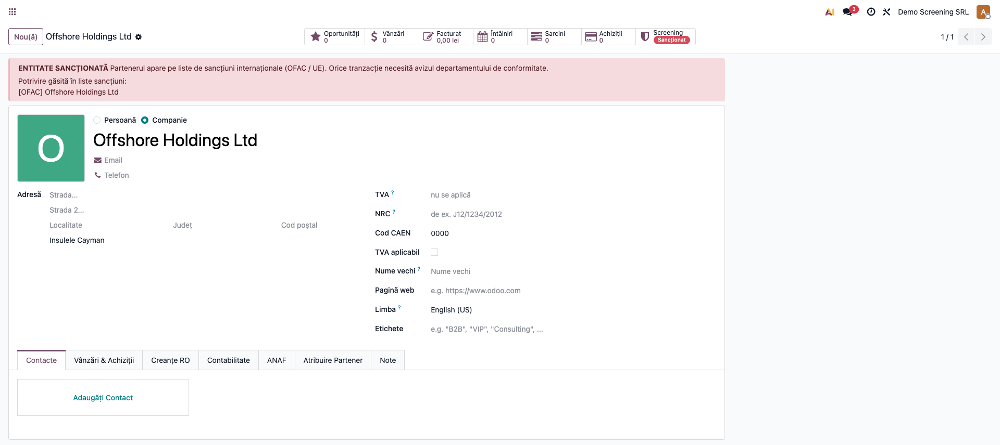
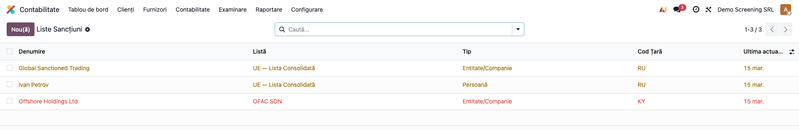
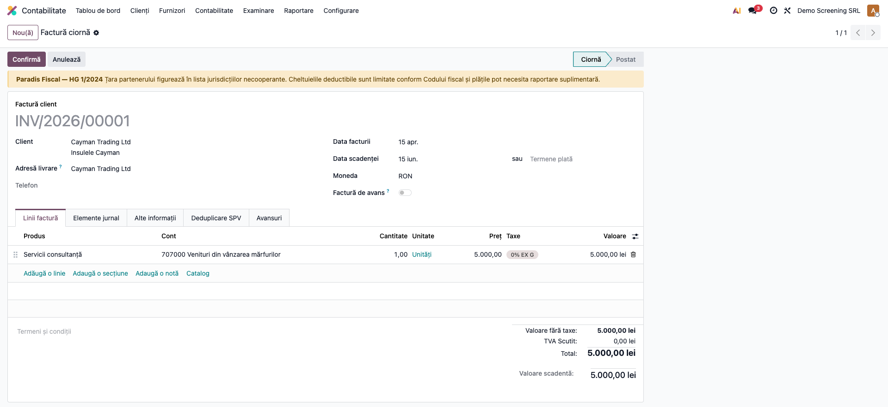
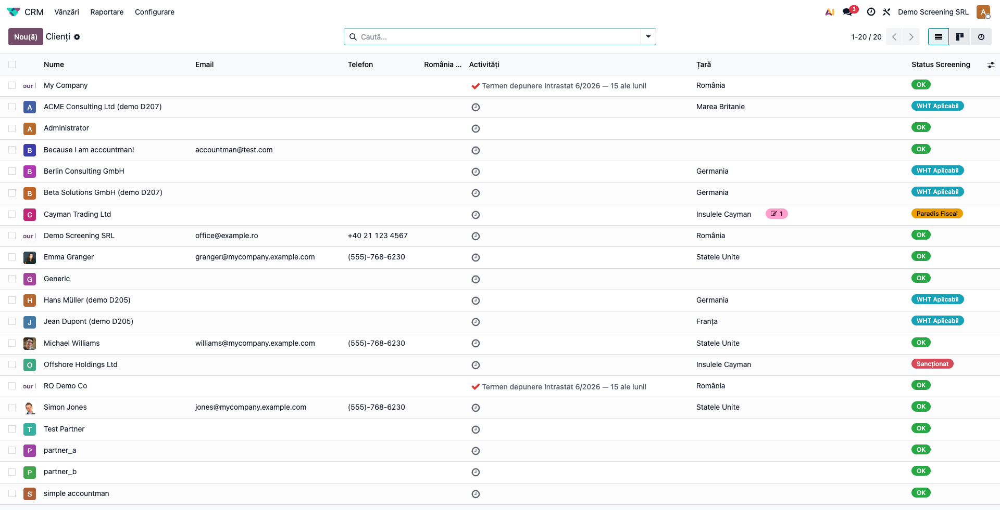
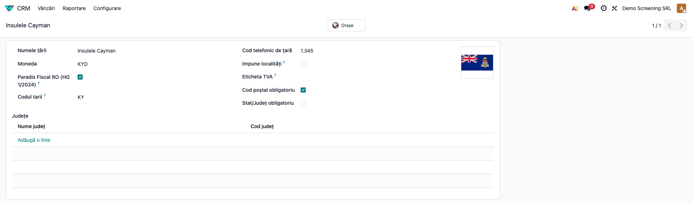
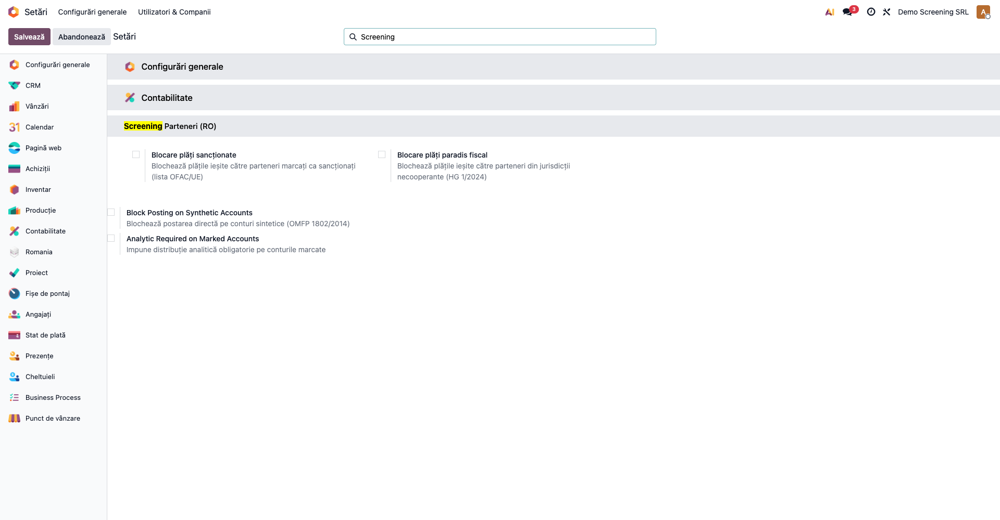

# Fișă Modul: Screening Parteneri (Paradisuri Fiscale / Sancțiuni / WHT)

**Modul:** `l10n_ro_partner_screening`
**FR:** FR-08
**Utilizator principal:** Contabil, Ofițer conformitate (AML), Contabil șef
**Prioritate:** 🟡 Medie (verificare la onboarding partener și înainte de plăți)

---

## 1. Scop business

Modulul adaugă un strat de **conformitate fiscală și AML** peste partenerii Odoo, pe trei axe:
- **Paradisuri fiscale** — marchează automat partenerii din jurisdicții necooperante (HG 1/2024);
- **Sancțiuni** — verifică partenerul față de listele **OFAC** și **UE** și îl marchează ca sancționat;
- **Impozit la sursă (WHT)** — semnalează partenerii nerezidenți ale căror plăți pot necesita reținere
  la sursă și raportare D205/D207.

Rezultatul este sintetizat într-un **status de screening** (prioritate: sancționat > paradis fiscal >
WHT > OK), afișat ca badge colorat pe partener și în listă, plus bannere de avertizare pe partener și
pe facturi.

## 2. Bază legală și context

- **HG 1/2024** — lista jurisdicțiilor necooperante în scopuri fiscale (paradisuri fiscale); plățile și
  cheltuielile către aceste jurisdicții au tratament fiscal restrictiv (deductibilitate limitată
  conform Codului fiscal — de verificat articolul aplicabil cu consultantul fiscal).
- **Sancțiuni internaționale** — listele **OFAC SDN** (Trezoreria SUA) și **Lista Consolidată UE**;
  tranzacțiile cu entități sancționate sunt interzise/restricționate (obligații AML).
- **Impozit la sursă** — art. 221–226 Cod fiscal (Legea 227/2015); plățile către nerezidenți pot
  necesita reținere la sursă și raportare în **D205/D207**.

## 3. Utilizatori și roluri

Contabil / Ofițer conformitate / Contabil șef.

Roluri recomandate pentru testare:
- **Contabil** — vede bannerele și statusul pe partener/factură, rulează „Verifică Sancțiuni".
- **Manager contabilitate** (`account.group_account_manager`) — administrează lista de sancțiuni și
  marchează țările paradis fiscal.

## 4. Conturi și date implicate

Modulul **nu generează note contabile** — este un strat informativ/de avertizare. Date implicate:
- `res.country.l10n_ro_is_tax_haven` — marcaj paradis fiscal (preîncărcat din HG 1/2024 la instalare);
- `res.partner`: `l10n_ro_is_tax_haven` (related din țară), `l10n_ro_is_sanctioned` + notă,
  `l10n_ro_wht_applicable`, `l10n_ro_screening_status` (calculat);
- `l10n.ro.sanction.entry` — intrările din listele OFAC/UE/manual (denumire, tip listă, tip entitate,
  cod țară, motiv).

Date minime pentru demo:
- parteneri cu țări diferite (RO, o țară paradis fiscal — ex. Insulele Cayman, un nerezident UE);
- câteva intrări în lista de sancțiuni.

## 5. Configurare inițială

1. Instalați modulul `l10n_ro_partner_screening` (dependențe: `base`, `account`).
2. Lista paradisurilor fiscale (HG 1/2024) este **preîncărcată** pe `res.country` la instalare.
   Verificați-o periodic față de Monitorul Oficial (**Contacte → Configurare → Țări**, câmpul
   „Paradis Fiscal RO").
3. Populați **Liste Sancțiuni** (manual sau prin cron-ul săptămânal care importă OFAC + UE).
4. Acordați rolul de **Manager contabilitate** utilizatorilor care administrează sancțiunile.

## 6. Flux de utilizare

### Pasul 1 — Verificarea unui partener

Pe fișa partenerului (**Contacte** sau din factură), **butonul inteligent „Screening"** din antet
afișează statusul; un clic pe el rulează verificarea în listele OFAC/UE (potrivire după denumire).
Dacă există potriviri, partenerul este marcat **Sancționat**, cu notă, și apare un **banner roșu**.



### Pasul 2 — Listele de sancțiuni

**Contabilitate → Configurare → Contabilitate → Liste Sancțiuni** conține entitățile din OFAC/UE/manual, cu tipul listei,
tipul entității, codul țării și data actualizării. Lista se deschide **filtrată implicit pe „UE"** —
schimbați filtrul (UE / OFAC / Manual) pentru a vedea celelalte surse. Listele se pot actualiza automat
prin cron-ul săptămânal, **livrat dezactivat** (activați-l din Setări tehnice dacă serverul are acces la
internet).



### Pasul 3 — Avertizarea pe factură

La emiterea unei facturi către un partener cu risc, în antetul facturii apare bannerul corespunzător:
**roșu** (sancționat), **galben** (paradis fiscal — HG 1/2024) sau **albastru** (WHT — nerezident).



### Pasul 4 — Evidența partenerilor după status

În lista de parteneri, coloana **Status Screening** afișează un badge colorat (Sancționat / Paradis
Fiscal / WHT Aplicabil / OK), pentru filtrare și monitorizare.



### Pasul 5 — Marcarea unei țări ca paradis fiscal

Pe formularul țării (**Contacte → Configurare → Țări**), câmpul **„Paradis Fiscal RO (HG 1/2024)"**
controlează marcajul; toți partenerii din acea țară moștenesc automat statusul.



### Pasul 6 — Blocaj opt-in la plată (FR-08)

Implicit, statusul de screening produce doar **avertismente** (banner pe factură). Pentru a **bloca
efectiv plățile** ieșite către parteneri cu risc, activați în **Setări → Screening Parteneri (RO)**:
**Blocare plăți sancționate** ① și/sau **Blocare plăți paradis fiscal** ②.



Cu opțiunea activă, postarea unei plăți ieșite (`account.payment`, outbound) către un partener
sancționat sau dintr-un paradis fiscal este oprită cu un mesaj clar. Lăsate dezactivate, rămâne doar
bannerul informativ pe factură.

### Note de monografie și raportare

- Modulul **nu produce note contabile** și **nu afectează TVA** — este un strat de conformitate.
- Statusul de screening are prioritatea: **sancționat > paradis fiscal > WHT > OK**.
- Marcajul de paradis fiscal pe partener este **related** din țară (stocat) — actualizarea țării
  propagă automat statusul.
- WHT-ul este o **semnalare**; reținerea efectivă și raportarea D205/D207 se fac prin modulele de
  declarații dedicate.

## 7. Legături cu alte module / declarații

| Modul / proces | Rol în flux | Tip legătură |
|---|---|---|
| `base` | parteneri și țări (marcaj paradis fiscal) | dependență (manifest) |
| `account` | bannere de avertizare pe factură; meniul de configurare | dependență (manifest) |
| `l10n_ro_anaf_d205` / `l10n_ro_anaf_d207` | raportarea impozitului la sursă pentru nerezidenți (dacă sunt prezente în instalare) | corelare (WHT) |

Ce este automat: marcajul paradis fiscal (din țară), calculul statusului de screening, bannerele de
avertizare, importul listelor OFAC/UE (cron) și potrivirea după denumire.
Ce rămâne manual: confirmarea sancțiunii, decizia de tranzacționare, completarea notei de sancțiune și
tratamentul fiscal efectiv (deductibilitate, reținere la sursă).

## 8. Verificări pentru consultant

- [ ] Modulul se instalează fără erori; lista paradisurilor fiscale este preîncărcată pe țări.
- [ ] Un partener dintr-o țară paradis fiscal primește automat statusul „Paradis Fiscal".
- [ ] „Verifică Sancțiuni" marchează partenerul ca sancționat dacă există potrivire și afișează bannerul roșu.
- [ ] Un partener nerezident primește sugestia WHT (status „WHT Aplicabil").
- [ ] Prioritatea statusului este respectată (sancționat > paradis fiscal > WHT > OK).
- [ ] Bannerele apar corect pe factură în funcție de statusul partenerului.
- [ ] Lista de parteneri afișează badge-ul de status screening.

## 9. Mesaje de eroare frecvente

| Mesaj / simptom | Cauză probabilă | Remediere |
|-----------------|-----------------|-----------|
| „Nicio potrivire găsită în listele de sancțiuni." | Partenerul nu apare pe liste | Comportament normal — partenerul nu este sancționat |
| „Atenție — Sancțiuni detectate" + marcaj roșu | Denumirea partenerului se potrivește cu o intrare | Verificați nota de sancțiune și avizați conform procedurii AML |
| Lista de sancțiuni goală | Cron-ul nu a rulat sau nu a avut acces la internet | Adăugați intrări manual sau verificați conectivitatea pentru import OFAC/UE |
| Partenerul nu primește statusul paradis fiscal | Țara nu este marcată sau lipsește | Marcați țara în „Paradis Fiscal RO" sau completați țara partenerului |

## 10. Capturi de ecran

Capturile (`readme/screenshots/`) sunt **generate automat** din `tests/test_screenshots.py`
(mixinul `ScreenshotCase` din `l10n_ro_doc_screenshots`, import defensiv), în **limba română**,
pe planul de conturi RO (`setup_country("ro")`):

1. `01_partener_sanctionat.png` — partener sancționat (banner roșu + status de screening).
2. `02_liste_sanctiuni.png` — lista entităților sancționate (OFAC / UE).
3. `03_factura_avertisment.png` — factură către partener din paradis fiscal (banner de avertizare).
4. `04_lista_parteneri.png` — lista partenerilor cu badge de status screening.
5. `05_tara_paradis.png` — formular țară cu marcajul de paradis fiscal.
6. `06_setari_blocaj_plata.png` — Setări: blocaj opt-in plăți sancționate / paradis fiscal (FR-08).

Regenerare:

```bash
./odoo/odoo-bin -c odoo.conf -d <db> -i l10n_ro_partner_screening,l10n_ro_doc_screenshots \
    --test-tags=fise_screenshots --stop-after-init
```

## 11. Observații pentru manual

În manualul final, păstrați explicația orientată pe activitatea utilizatorului: când se face screening-ul
(la onboarding partener și înainte de plăți), cum se citesc cele trei tipuri de avertizare (sancțiune,
paradis fiscal, WHT) și ce obligații atrag. Subliniați că modulul **semnalează** riscuri, dar deciziile
(tranzacționare, deductibilitate, reținere la sursă) rămân ale contabilului/ofițerului de conformitate,
iar listele de sancțiuni trebuie ținute la zi.
