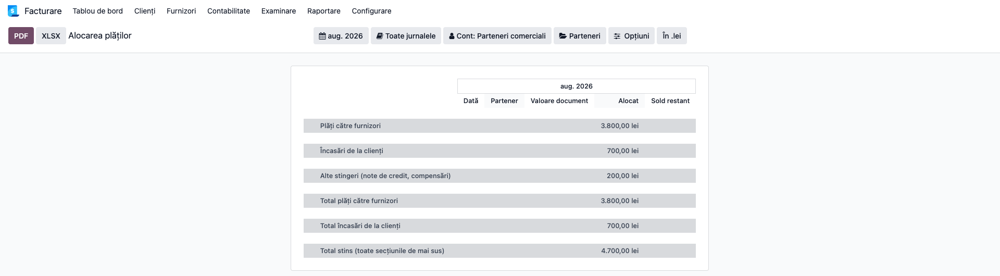
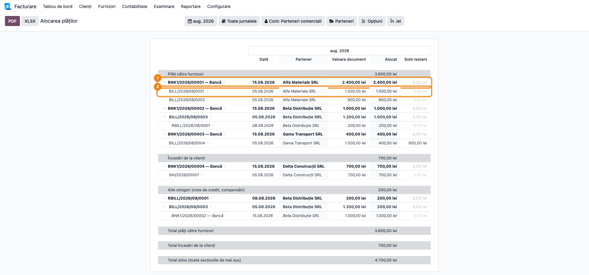
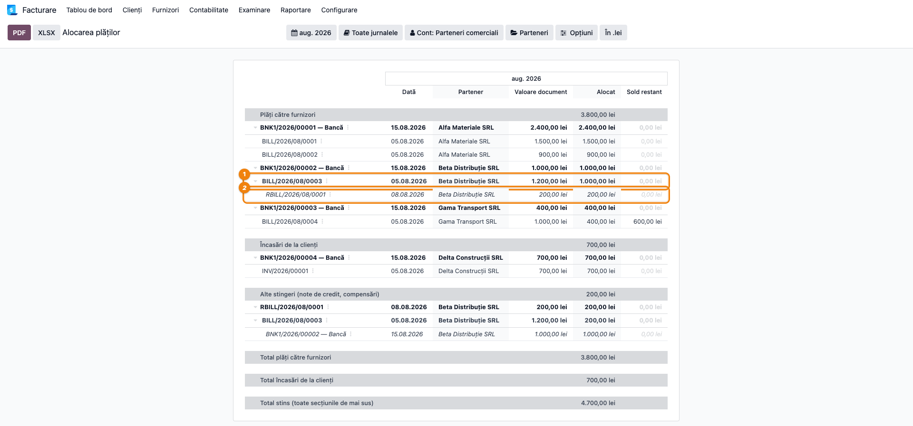
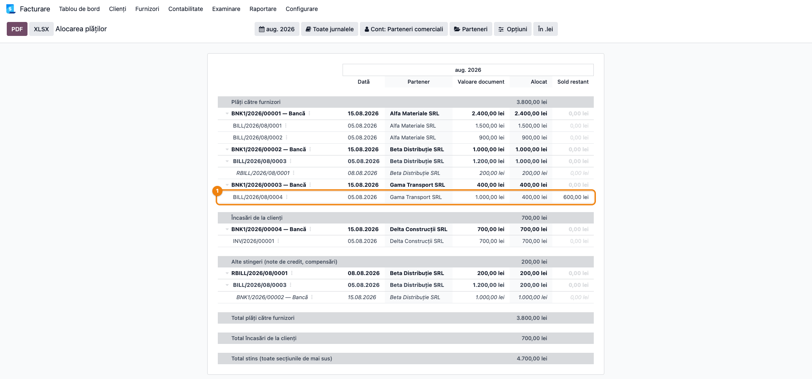
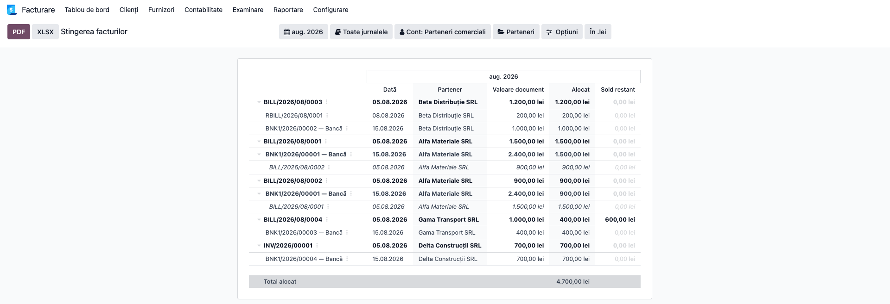
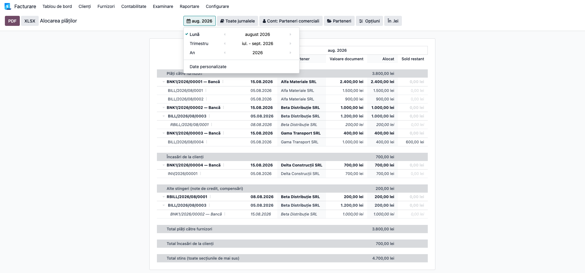

# Fișă Modul: Alocarea plăților pe facturi (ce facturi închide un OP)

**Modul:** `l10n_ro_payment_allocation_report`
**Utilizator principal:** Contabil clienți/furnizori, Contabil-șef
**Prioritate:** 🔴 Ridicată (întrebare recurentă la fiecare închidere de lună)

---

## 1. Scop business

Modulul răspunde la o întrebare pe care contabilitatea o pune la fiecare verificare de sold:
**din ce se compune suma plătită printr-un ordin de plată?** Cazul tipic — furnizorul a emis o
factură și un storno, iar prin bancă se achită doar diferența; din extras se vede o singură sumă,
nu documentele care au produs-o.

Rapoartele standard nu acoperă golul: **Fișa partener** (*Partner Ledger*) și **Balanța pe
vârste** listează plățile și facturile una lângă alta, dar niciodată **alocarea** dintre ele.
Modulul adaugă două rapoarte native care arată legătura, în ambele sensuri: de la plată spre
facturile pe care le stinge, și de la factură spre documentele care au închis-o.

## 2. Bază legală și context

Raportul **nu este un formular reglementat** și nu se depune la ANAF. Rolul lui este de
**instrument de verificare** a soldurilor conturilor de terți (401, 4111), cerut de obligația
generală de justificare a operațiunilor din Legea contabilității nr. 82/1991 (art. 6) și de
practica de reconciliere a soldurilor la închiderea perioadei.

Este util în special la:
- confirmarea soldurilor cu furnizorii și clienții (scrisori de confirmare, puncte de sold);
- verificarea partidelor rămase deschise pe 401/4111 înainte de închidere;
- pregătirea răspunsului la o cerere de clarificare a unui partener („ce ați plătit cu OP-ul din
  data de …?").

## 3. Utilizatori și roluri

Contabil clienți/furnizori (utilizare zilnică), Contabil-șef (verificare la închidere).

Roluri recomandate pentru testare:
- Administrator funcțional: instalează modulul și verifică apariția celor două meniuri;
- Contabil operațional: reproduce fluxul pe o lună cu plăți reale;
- Contabil-șef: validează subtotalurile pe secțiuni și corelarea cu extrasul bancar.

Cele două meniuri declară explicit grupurile standard de raportare contabilă
(`account.group_account_readonly` / `account.group_account_basic`) — nu se adaugă grupuri noi.
Rețineți însă că raportul citește datele prin interogări directe, deci **nu aplică regulile de
acces la nivel de înregistrare** pe notele contabile: cine are dreptul de a deschide raportul vede
toate alocările companiilor selectate.

## 4. Conturi și date implicate

Conturi de terți urmărite:

| Cont | Rol în raport |
|---|---|
| 401 Furnizori | partidele de furnizor: facturi, note de credit, plăți |
| 4111 Clienți | partidele de client: facturi, storno, încasări |
| 5121 / 5311 | contrapartida plății (bancă / casă) |

Raportul este **exclusiv de citire**: nu generează și nu modifică note contabile.

Notele contabile pe care le **interpretează**:

- factură furnizor: **Dr 6xx + Dr 4426 = Cr 401**;
- notă de credit furnizor: **Dr 401 = Cr 6xx + Cr 4426**;
- plată furnizor: **Dr 401 = Cr 5121**;
- factură client: **Dr 4111 = Cr 7xx + Cr 4427**;
- încasare client: **Dr 5121 = Cr 4111**.

Legătura dintre ele o dă **reconcilierea** liniilor de 401/4111, cu suma alocată fiecărei perechi.

Date minime pentru demo:
- companie românească cu planul de conturi RO instalat;
- jurnal de bancă (sau de casă) și jurnale de facturi furnizor/client;
- cel puțin o factură, un storno pe același furnizor și o plată care acoperă diferența;
- o factură stinsă doar parțial, pentru coloana de rest neachitat.

## 5. Configurare inițială

1. Instalați modulul `l10n_ro_payment_allocation_report` pe baza demo.
2. Verificați că modulul `account_reports` (Enterprise) este instalat — este cerut de manifest.
3. Confirmați apariția celor două intrări în **Contabilitate → Raportare → Rapoarte partener**
   (în lipsa modulului *Accounting*, aplicația apare ca **Facturare**): **Alocarea plăților** și
   **Stingerea facturilor**.
4. Postați setul minim de documente din secțiunea 4 și reconciliați-le (din extras sau manual).
5. Verificați că utilizatorul de test are drept de citire pe rapoartele contabile.

Nu există parametri de configurare — raportul citește direct reconcilierile existente.

## 6. Flux de utilizare

### Pasul 1 — Deschiderea raportului pe luna de verificat

Accesați **Contabilitate → Raportare → Rapoarte partener → Alocarea plăților**. Dacă modulul
*Accounting* nu este instalat, aplicația se numește **Facturare** în loc de **Contabilitate**. Raportul se
deschide pe **luna curentă** și grupează alocările în **până la patru secțiuni**, fiecare cu
subtotalul ei. O secțiune apare **doar dacă are conținut** — pe o bază fără POS veți vedea de
regulă doar primele trei, iar dacă nu s-au emis note de credit, doar primele două:

| Secțiune | Ce conține |
|---|---|
| **Plăți către furnizori** | stingerile datoriilor (401) prin jurnale de bancă și de casă |
| **Încasări de la clienți** | stingerile creanțelor (4111) prin jurnale de bancă și de casă |
| **Alte stingeri (note de credit, compensări)** | stingerile fără numerar: note de credit, compensări |
| **Reconcilieri fără factură** | reconcilieri tehnice (mecanica POS, stingeri între note contabile) |

Încadrarea în primele două secțiuni se face după **tipul jurnalului** (bancă sau casă), nu după
contul de trezorerie folosit: o notă din jurnalul de bancă intră în „Plăți" indiferent de
contrapartidă. Sensul — plată sau încasare — se ia din contul de terți (401 față de 4111).

**Găsiți pe ecran:** rândurile de secțiune, îngroșate, cu suma alocată pe fiecare; la finalul
raportului, câte un total per flux — **Total plăți către furnizori**, **Total încasări de la
clienți** — și, când există mai multe fluxuri, **Total stins (toate secțiunile de mai sus)**.

**Verificați înainte de a continua:** perioada selectată este luna de verificat; **Total plăți
către furnizori** corespunde **rulajului creditor** al conturilor de trezorerie din extrasele
lunii, iar **Total încasări de la clienți** corespunde **rulajului debitor**. Cele două se
compară separat — sunt fluxuri de sens contrar și nu se adună. Dacă un total este mult mai mic
decât rulajul corespunzător, verificați dacă reconcilierile chiar au fost făcute: raportul arată
doar alocările existente, nu plățile nereconciliate.



### Pasul 2 — Ce facturi închide o plată

Desfășurați o plată din secțiunea **Plăți către furnizori** (sau **Încasări de la clienți**). Sub ea apar **facturile pe care le stinge**, fiecare
cu suma alocată.

**Găsiți pe ecran:** pe rândul plății — *Valoare document* (valoarea plății), *Alocat* (cât s-a
alocat în perioadă) și *Sold restant* (cât din plată a rămas nealocat). Pe fiecare factură — suma
alocată din această plată și restul ei neachitat.

**Verificați:** suma coloanei *Alocat* de pe facturi este egală cu *Alocat* de pe plată; dacă
*Sold restant* de pe plată nu este zero, plata are o parte nealocată — de urmărit.



### Pasul 3 — Din ce se compune suma plătită (cazul cu storno)

Acesta este pasul pentru care există raportul. Desfășurați o **factură** de sub plată: apar
**celelalte alocări** ale ei — nota de credit, avansul, o plată anterioară — oricând au fost făcute.

**Găsiți pe ecran:** sub factură, rândurile în cursiv cu documentele care au contribuit la
închiderea ei și suma fiecăruia.

**Verificați:** suma alocată de plată **plus** sumele rândurilor în cursiv este egală cu *Valoare
document* a facturii. În exemplul clasic: factură 1.200 = plată 1.000 + storno 200. Dacă egalitatea
nu se închide, factura are încă rest neachitat — vizibil în *Sold restant*.



### Pasul 4 — Facturi stinse doar parțial

**Găsiți pe ecran:** facturile cu *Sold restant* diferit de zero, deși apar sub o plată.

**Verificați:** restul afișat corespunde soldului partidei din **Fișa partener**. Acestea sunt
partidele care rămân deschise pe 401/4111 la finalul lunii.



### Pasul 5 — Invers: ce a închis o factură

Accesați **Contabilitate → Raportare → Rapoarte partener → Stingerea facturilor**. Aceleași alocări,
grupate **pornind de la factură**: sub fiecare factură apar documentele care au închis-o.

**Găsiți pe ecran:** factura la primul nivel, cu *Valoare document* și *Sold restant*; sub ea,
plățile și notele de credit cu sumele alocate.

**Verificați:** pentru o factură complet plătită, suma documentelor de dedesubt este egală cu
valoarea facturii, iar *Sold restant* este zero.

**Atenție la nivelul al treilea** (rândurile în cursiv): aici sunt **celelalte alocări ale
documentului de plată** de deasupra — de regulă **alte facturi stinse cu același ordin de plată**.
Nu sunt documente care au închis factura de la primul nivel; citite greșit, ar sugera o compensare
între facturi care nu a avut loc.

**Găsiți pe ecran** rândul final **Total alocat** — suma tuturor alocărilor din perioadă, inclusiv
a stingerilor fără numerar. **Verificați** că este egal cu suma subtotalurilor din raportul
*Alocarea plăților* pentru aceeași perioadă.

Folosiți acest raport când întrebarea pornește de la factură („ce a închis factura asta?"), și
**Alocarea plăților** când pornește de la extras („ce am plătit cu OP-ul asta?").



### Pasul 6 — Restrângerea la ce vă interesează, apoi exportul

Bara raportului oferă filtrele: **perioadă**, **jurnale** (aplicate documentului de la primul
nivel), **parteneri**, **Cont: Parteneri comerciali** (creanțe / datorii) și selectorul de companii.
Filtrele de comparație și de ciorne sunt dezactivate intenționat: alocările există numai între note
postate, iar coloanele de comparație ar repeta aceleași valori.

**Găsiți pe ecran:** filtrul *Cont: Parteneri comerciali* pentru a separa clienții de furnizori; filtrul
de jurnale pentru a păstra doar un cont bancar.

**Verificați:** după filtrare, subtotalurile secțiunilor s-au recalculat și corespund selecției.

Abia după ce datele sunt confirmate pe ecran, exportați cu butonul **PDF** sau **XLSX** din bara de
instrumente. Click pe rândurile de document (plată, factură, notă de credit) deschide documentul din
spate; rândurile de secțiune și de total nu sunt clicabile.



### Note de monografie și raportare

- Raportul **nu generează note contabile** — este exclusiv de citire; nu modifică reconcilieri și
  nu postează nimic.
- Notele pe care le interpretează sunt cele din secțiunea 4 (401/4111 față de 5121/5311).
- **Nota de credit se reconciliază cu factura, nu cu plata** (ambele sunt pe debitul contului 401).
  Lanțul real este: factură 1.200 ← storno 200 + plată 1.000. De aceea storno-ul apare **sub
  factură**, nu lângă plată.
- Subtotalurile sunt separate intenționat: o factură stinsă parțial prin storno și parțial prin
  virament nu a costat, în bancă, decât diferența. Însumate laolaltă, cele două alocări ar sugera o
  ieșire de numerar mai mare decât cea reală — de aceea plățile către furnizori, încasările de la
  clienți și stingerile fără numerar au fiecare subtotalul lor.
- Sumele sunt exprimate în **moneda companiei**. Pe facturile împărțite pe mai multe termene de
  plată, *Valoare document* este valoarea **tranșei** stinse, nu a facturii întregi.
- Pe rândurile în cursiv (nivelul al treilea), *Dată* și *Valoare document* sunt ale documentului
  respectiv, nu ale alocării — la fel ca pe celelalte niveluri.

## 7. Legături cu alte module / declarații

| Modul / proces | Rol în flux | Tip legătură |
|---|---|---|
| `account_reports` | framework-ul de raportare (filtre, drill-down, export PDF/XLSX) | dependență (manifest) |
| `l10n_ro` | planul de conturi RO (401, 4111, 5121) | dependență (manifest) |
| Fișa partener (*Partner Ledger*) | soldul partidei — se verifică încrucișat cu *Sold restant* | verificare complementară |
| Balanța pe vârste | vechimea partidelor rămase deschise | verificare complementară |
| Reconcilierea din extras bancar | produce alocările pe care raportul le citește | sursa datelor |

**Ce este automat:** identificarea alocărilor, gruparea pe documente, separarea plăților de
stingerile fără numerar, calculul resturilor.

**Ce rămâne manual:** reconcilierea propriu-zisă a facturilor cu plățile. Raportul arată doar ce a
fost reconciliat — o factură plătită, dar nereconciliată, nu apare.

## 8. Verificări pentru consultant

- [ ] Modulul se instalează fără erori pe baza demo.
- [ ] Ambele rapoarte apar în **Contabilitate → Raportare → Rapoarte partener**.
- [ ] Pe o plată care stinge mai multe facturi, suma alocărilor de pe facturi este egală cu suma
      alocată pe plată.
- [ ] Pe scenariul factură + storno + plată pentru diferență, storno-ul apare sub factură, iar
      plata + storno-ul totalizează valoarea facturii.
- [ ] **Total plăți către furnizori** corespunde rulajului creditor al conturilor de trezorerie
      din extrasele lunii, iar **Total încasări de la clienți** rulajului debitor — comparate
      separat, nu însumate.
- [ ] Stingerile prin note de credit apar în secțiunea **Alte stingeri**, nu între plăți.
- [ ] Încasările de la clienți apar în **Încasări de la clienți**, nu amestecate cu plățile.
- [ ] Reconcilierile tehnice (POS, compensări între note contabile) apar în secțiunea
      **Reconcilieri fără factură** — nu sunt amestecate în plăți și nu sunt ascunse.
- [ ] *Sold restant* de pe o factură coincide cu soldul partidei din Fișa partener.
- [ ] Filtrul **Cont: Parteneri comerciali** separă corect clienții de furnizori.
- [ ] Click pe un rând deschide documentul corect; exportul PDF și XLSX conține datele de pe ecran.

## 9. Mesaje de eroare frecvente

Raportul nu ridică erori proprii (este exclusiv de citire). Simptomele posibile sunt de
interpretare a datelor:

| Simptom | Cauză probabilă | Remediere |
|---|---|---|
| Raportul este gol pe o lună cu plăți | plățile nu au fost reconciliate cu facturile; raportul arată doar alocări existente | reconciliați din extras, apoi redeschideți raportul |
| **Total plăți către furnizori** mult mai mic decât rulajul creditor al trezoreriei | o parte din plăți sunt nereconciliate, sau perioada selectată e greșită | verificați perioada și partidele nereconciliate |
| În raportul invers, sub o plată apare altă factură și pare o compensare | nivelul al treilea arată celelalte facturi stinse de acel OP, nu documente care au închis factura de sus | citiți nivelul 3 ca „ce a mai plătit acest OP" |
| O plată apare cu *Sold restant* diferit de zero | plata a fost alocată doar parțial pe facturi | alocați restul, sau lăsați-o dacă este avans |
| Suma de pe factură nu se închide cu documentul de plată | factura are alte alocări — desfășurați-o pentru a le vedea (Pasul 3) | desfășurați factura; dacă nici așa nu se închide, are rest neachitat |
| Apar multe rânduri în **Reconcilieri fără factură** | bază cu POS: mecanica de reconciliere a chitanțelor produce astfel de alocări | normal; secțiunea este separată tocmai pentru a nu polua plățile — pliați-o |
| Nu apar note de credit deși există | nota de credit stinge factura, nu plata — apare **sub factură** (Pasul 3) | desfășurați factura de sub plată |
| Un partener apare cu sume în valută diferite de așteptări | sumele sunt în moneda companiei | comparați cu soldul în lei, nu cu valoarea în valută a facturii |

## 10. Capturi de ecran

Capturile (`readme/screenshots/`) sunt **generate automat** din `tests/test_screenshots.py`
(mixinul `ScreenshotCase` din `l10n_ro_doc_screenshots`, import defensiv), în **limba română**, pe
planul de conturi RO (`setup_country("ro")` → conturile 401/4111/5121):

1. `01_raport_deschis.png` — raportul deschis, cu secțiunile și totalurile per flux.
2. `02_plata_cu_facturi.png` — plată desfășurată: facturile stinse și sumele alocate.
3. `03_compozitie_cu_storno.png` — compoziția facturii: plata și storno-ul care o închid.
4. `04_plata_partiala.png` — factură stinsă parțial, cu restul neachitat.
5. `05_invoice_settlement.png` — raportul invers: factura și documentele care au închis-o.
6. `06_filtre.png` — filtrele raportului (perioadă, jurnale, parteneri, creanțe/datorii).

Regenerare:

```bash
./odoo/odoo-bin -c odoo.conf -d <db> -i l10n_ro_payment_allocation_report,l10n_ro_doc_screenshots \
    --test-tags=fise_screenshots --stop-after-init
```

## 11. Observații pentru manual

În manual, păstrați accentul pe **întrebarea de plecare**, nu pe raport: contabilul nu caută „un
raport de alocări", ci vrea să afle ce a plătit cu un anumit ordin de plată. Cele două rapoarte sunt
două intrări în aceeași informație — de la extras spre facturi și invers.

Merită explicat o singură dată, clar, mecanismul care încurcă cel mai des: **nota de credit se
reconciliază cu factura, nu cu plata**, motiv pentru care storno-ul apare sub factură. Fără această
explicație, operatorul îl caută lângă plată și trage concluzia că raportul nu îl arată.

De asemenea, subliniați că fiecare flux are totalul lui: **Total plăți către furnizori** se
confruntă cu rulajul creditor al trezoreriei, **Total încasări de la clienți** cu cel debitor, iar
**Total stins** le adună pe toate, împreună cu stingerile fără numerar. Adunarea plăților cu
încasările într-o singură cifră duce la raportarea unei ieșiri de bani mai mari decât cea reală.
