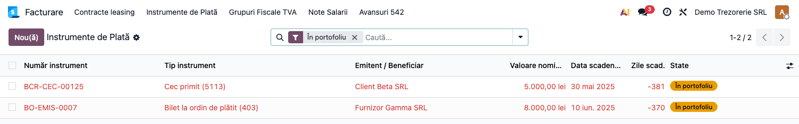
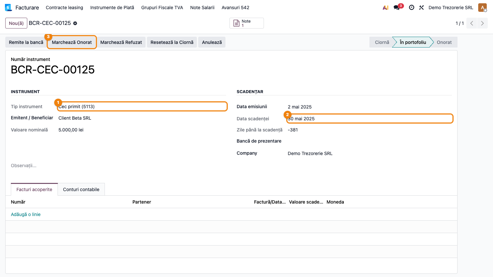
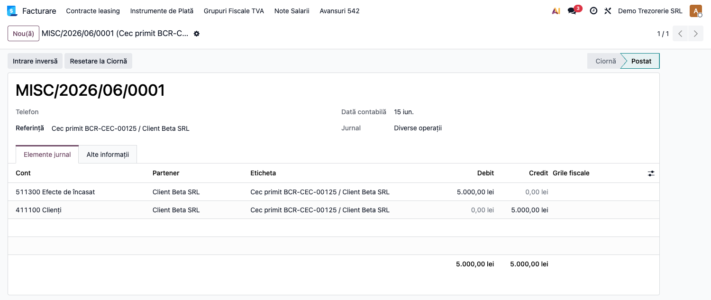
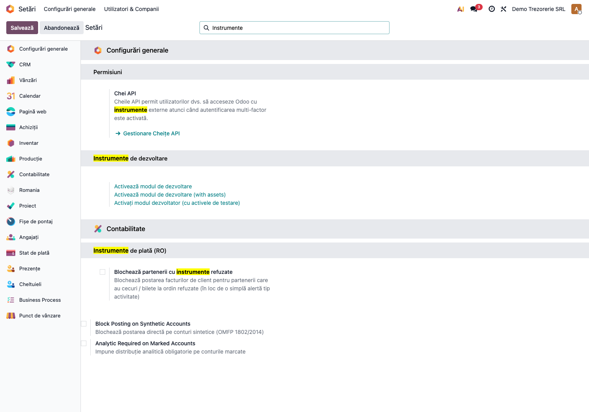

# Fișă Modul: Cecuri și Bilete la Ordin (5113/403/413)

**Poziție plan:** B4.3
**Modul:** `l10n_ro_payment_instruments`
**FR:** FR-39
**Capitol manual:** Cap 8.3
**Utilizator principal:** Contabil trezorerie, Contabil furnizori/clienți
**Prioritate:** 🟡 Medie

---

## 1. Scop business

Această fișă descrie utilizarea modulului `l10n_ro_payment_instruments` pentru scenariul **Cecuri și Bilete la Ordin (5113/403/413)**.
Consultantul folosește documentul pentru reproducerea fluxului în baza demo și
pentru pregătirea capitolului Cap 8.3 din manualul utilizator.

## 2. Bază legală și context

Legea 59/1934 (cecuri); Legea 58/1934 (bilete la ordin, cambii)

## 3. Utilizatori și roluri

Contabil Trezorerie

Roluri recomandate pentru testare:
- Administrator funcțional: instalează modulul și verifică meniurile
- Utilizator operațional: rulează fluxul zilnic sau lunar
- Contabil/manager: validează rezultatele contabile și rapoartele

## 4. Conturi și date implicate

5113 (cecuri primite), 413 (efecte de primit), 403 (efecte de plătit)

Date minime pentru demo:
- companie românească cu localizarea contabilă instalată
- perioadă contabilă deschisă
- jurnale și conturi configurate conform scenariului
- documente de test postate, acolo unde fluxul pornește din contabilitate, stocuri, HR sau vânzări

## 5. Configurare inițială

1. Instalați modulul `l10n_ro_payment_instruments` pe baza demo.
2. Verificați dependențele cerute de manifest și meniurile nou apărute.
3. Configurați conturile, jurnalele, produsele, partenerii sau parametrii specifici fluxului.
4. Pregătiți un set minim de documente postate pentru perioada de test.
5. Verificați că utilizatorul de test are grupurile de acces necesare.

## 6. Flux de utilizare

### Pasul 1 — Accesare

Accesați **Contabilitate → Instrumente de Plată → Nou** și creați un cec, bilet la ordin sau cambie.

### Pasul 2 — Completare date

Completați câmpurile obligatorii: companie, perioadă, jurnal, conturi, parteneri sau documente sursă, după caz.

### Pasul 3 — Calcul / import / generare

Rulați acțiunea principală a modulului. Pentru această fișă sunt documentate:

- Model instrument (cec/BO/cambie)
- state machine
- note automate 5113/413/403
- scadențar cu alertă
- înregistrare refuz/protest
- andosare BO

**Lista instrumentelor de plată** — cecuri și bilete la ordin cu tipul, scadența și starea:

**Formularul unui cec primit** în portofoliu — tipul, scadența și acțiunile de stare (Remite la
bancă / Marchează Onorat / Refuzat / Anulează):

**Nota contabilă inițială** generată automat la înregistrare (cec primit: 5113 Efecte de încasat
= 4111 Clienți):

### Pasul 4 — Verificare rezultat

Comparați rezultatul generat cu documentele sursă și cu monografia contabilă așteptată.
Verificați totalurile, starea documentului și eventualele mesaje de avertizare.

### Pasul 5 — Confirmare / postare

Confirmați documentul sau postați nota contabilă, după caz. Notați ce câmpuri devin readonly și ce linkuri apar către documentele generate.

### Pasul 6 — Export / raportare

Dacă modulul oferă export PDF, XLSX sau XML, generați fișierul și verificați că include datele de test relevante.

### Pasul 7 — Blocaj opt-in pe parteneri cu instrument refuzat (FR-39)

Când un cec sau bilet la ordin este marcat **refuzat**, partenerul rămâne un risc cunoscut. Pentru a
**bloca emiterea de facturi noi de client** către un astfel de partener, activați în **Setări →
Configurări generale → secțiunea Contabilitate → Instrumente de plată (RO)** opțiunea **Blochează
partenerii cu instrumente refuzate** ① (blocajul vizează doar facturile emise către client).

Cu opțiunea activă, postarea unei facturi către un partener care are un instrument în stare „refuzat"
este oprită cu un mesaj clar; lăsată dezactivată, refuzul rămâne doar o informație pe instrument.

## 7. Legături cu alte module / declarații

| Modul / proces | Rol în flux |
|---|---|
| `account` | plăți, încasări și reconciliere |
| `account_accountant` | scadențare și rapoarte partener |
| `l10n_ro_partner_ledger_currency` | solduri partener și instrumente în valută |
| Bancă | decontarea efectivă a instrumentelor |

Ce este automat: urmărirea stării instrumentului și notele contabile aferente.
Ce rămâne manual: validarea scadențelor, refuzurilor și documentelor bancare.

## 8. Verificări pentru consultant

- [ ] Modulul se instalează fără erori pe baza demo.
- [ ] Meniurile și acțiunile sunt vizibile pentru rolul de utilizator potrivit.
- [ ] Fluxul poate fi reprodus de la cap la coadă cu date fictive românești.
- [ ] Rezultatul contabil sau operațional corespunde descrierii din plan.
- [ ] Mesajele de eroare sunt clare pentru un utilizator non-tehnic.
- [ ] Exporturile sau rapoartele se descarcă și conțin datele testate.

## 9. Mesaje de eroare frecvente

| Mesaj / simptom | Cauză probabilă | Remediere |
|-----------------|-----------------|-----------|
| Meniul nu este vizibil | Utilizatorul nu are grupurile necesare | Verificați drepturile de acces și reîncărcați aplicațiile |
| Nu se generează linii | Lipsesc documente postate în perioada aleasă | Creați și postați datele de test necesare |
| Cont lipsă sau jurnal lipsă | Configurarea contabilă este incompletă | Completați conturile și jurnalele în setările modulului |
| Perioada este blocată | Data documentului este într-o perioadă închisă | Folosiți o perioadă deschisă sau ajustați lock date-ul în demo |
| „Partenerul X are N instrument(e) de plată refuzat(e)." (la postarea unei facturi client) | Opțiunea **Blochează partenerii cu instrumente refuzate** e activă și partenerul are un instrument în stare „refuzat" (FR-39) | Soluționați instrumentul refuzat sau, după caz, dezactivați temporar opțiunea din Setări |

## 10. Capturi de ecran

| # | Fișier | Conținut |
|---|--------|----------|
| 1 | `screenshots/01_lista_instrumente.png` | Lista instrumentelor de plată (cec / bilet la ordin, stări) |
| 2 | `screenshots/02_instrument_form.png` | Formularul unui cec primit (tip, scadență, acțiuni de stare) |
| 3 | `screenshots/03_nota_contabila.png` | Nota contabilă inițială generată (5113 = 4111) |
| 4 | `screenshots/04_setare_blocaj_refuzat.png` | Setare — blocaj opt-in facturare parteneri cu instrument refuzat (FR-39) |

## 11. Observații pentru manual

În manualul final, păstrați explicația orientată pe activitatea utilizatorului:
ce problemă rezolvă modulul, când se rulează, ce date trebuie pregătite și cum se verifică rezultatul.
