# Fișă Modul: Cecuri, bilete la ordin și cambii (5112 / 413 / 5113 / 403)

**Poziție plan:** B4.3
**Modul:** `l10n_ro_payment_instruments`
**FR:** FR-39
**Capitol manual:** Cap 8.3
**Utilizator principal:** Contabil trezorerie, Contabil clienți / furnizori
**Prioritate:** 🟡 Medie (efectele comerciale sunt frecvente în distribuție și construcții; fără
evidența lor, clientul apare restant deși a plătit cu BO)

---

## 1. Scop business

Modulul ține evidența **instrumentelor de plată** primite de la clienți sau emise către furnizori
(cec, bilet la ordin, cambie) de la primire până la încasare, refuz sau andosare. La fiecare pas
generează nota contabilă pe conturile din planul RO, datată cu data reală a operației, și ține
legătura cu facturile acoperite: factura se stinge când instrumentul e înregistrat și se redeschide
dacă instrumentul e refuzat. Scadențarul arată ce instrumente ajung la scadență, ce e depășit și ce
a fost refuzat, iar compania poate bloca facturarea către partenerii cu instrumente refuzate.

## 2. Bază legală și context

- **Legea 58/1934** asupra cambiei și biletului la ordin — biletul la ordin și cambia sunt titluri
  de credit care se pot **andosa** (gira) și pentru care, la refuzul plății, se face **protestul**.
- **Legea 59/1934** asupra cecului — cecul e plătibil la vedere și se prezintă la plată în termenul
  legal; refuzul cecului deschide procedura de protest sau de recuperare.
- **OMFP 1802/2014** — planul de conturi: 5112 „Cecuri de încasat", 5113 „Efecte de încasat",
  413 „Efecte de primit de la clienți", 403 „Efecte de plătit", 4111 „Clienți", 401 „Furnizori",
  5121 „Conturi la bănci în lei".
- Practica bancară: biletul la ordin primit se **depune la bancă spre încasare** înainte de
  scadență; din acel moment efectul trece din 413 în 5113 până la extrasul de încasare.

## 3. Utilizatori și roluri

Contabilul de trezorerie înregistrează instrumentele, le depune la bancă și marchează încasarea sau
refuzul, după extras. Contabilul de clienți / furnizori leagă instrumentul de facturi și urmărește
partenerii cu instrumente refuzate. Contabilul-șef decide blocarea facturării acestor parteneri.

Roluri recomandate pentru testare:
- Administrator funcțional: instalează modulul, activează blocajul din Setări.
- Contabil cu drepturi de **contabil complet** (în fișa utilizatorului, la Contabilitate, nivelul
  **Contabil** / „Afișează funcționalitățile contabile complete"): parcurge fluxurile BO primit, cec
  primit, cec refuzat, andosare și BO emis. Nivelul **Facturare** nu vede meniul și nu are acces la
  instrumente.
- Contabil-șef: verifică notele, soldurile 413 / 5112 / 5113 / 403 și facturile stinse sau redeschise.

## 4. Conturi și date implicate

| Tip instrument | Cont instrument | Cont partener | Depunere la bancă | Încasare / plată |
|---|---|---|---|---|
| Cec primit | 5112 | 4111 | fără notă (cecul rămâne pe 5112) | 5121 = 5112 |
| Bilet la ordin de primit | 413 | 4111 | 5113 = 413 | 5121 = 5113 |
| Cambie de primit | 413 | 4111 | 5113 = 413 | 5121 = 5113 |
| Bilet la ordin de plătit | 403 | 401 | — | 403 = 5121 |
| Cambie de plătit | 403 | 401 | — | 403 = 5121 |
| Cec emis | fără cont implicit | fără cont implicit | — | — |

- Conturile se găsesc automat în planul RO (după prefixul codului) și se pot schimba pe fiecare
  instrument, în tab-ul **Conturi contabile**. La înregistrare, conturile folosite se fixează pe
  instrument, ca pașii următori să stingă exact aceleași conturi.
- Notele se fac în primul jurnal de tip **Diverse** al companiei, dacă pe instrument nu e ales alt
  jurnal.
- **Cec emis:** modulul nu are conturi implicite pentru el, iar înregistrarea cere completarea
  manuală a ambelor conturi. Recomandarea este să **nu folosiți tipul „Cec emis"** în modul: cecul
  emis se contabilizează la debitarea contului bancar, direct din extras (`401 = 5121`). Nu alegeți
  403 pentru cecuri: 403 este contul efectelor de plătit (BO, cambii).

Date minime pentru demo (cele din capturi):
- companie RO cu planul de conturi RO, în RON;
- facturi de vânzare cu TVA 21%: Alfa Distribuție SRL (10.000 + 2.100 = 12.100 lei și
  5.000 + 1.050 = 6.050 lei), Beta Retail SRL (6.050 lei), Sigma Instal SRL (3.000 + 630 = 3.630 lei);
- factură de achiziție Omega Logistic SRL, transport (4.000 + 840 = 4.840 lei);
- un furnizor pentru andosare (Delta Materiale SRL);
- un BO primit fără factură acoperită, cu scadența depășită (Gama Comerț SRL, 2.420 lei).

## 5. Configurare inițială

1. Instalați modulul `l10n_ro_payment_instruments` (depinde de `account`, `l10n_ro`,
   `l10n_ro_anaf_base`).
2. Verificați în planul de conturi că există 5112, 5113, 413, 403, 4111, 401 și 5121.
3. Verificați că există cel puțin un jurnal de tip **Diverse** (notele instrumentelor se fac acolo).
4. **Activați alertele de scadență**: acțiunea programată „Instrumente de plată RO: alertă
   scadență" se instalează **inactivă**. Activați modul dezvoltator, deschideți **Setări → Tehnic →
   Automatizare → Acțiuni planificate**, căutați-o și bifați **Activ**. Fără acest pas nu apare
   nicio alertă de scadență.
5. Opțional: numărul de zile dinainte de scadență la care apare alerta se schimbă prin parametrul
   de sistem `l10n_ro_payment_instruments.alert_days_before_due` (**Setări → Tehnic → Parametri de
   sistem**, în modul dezvoltator). Parametrul nu există după instalare: creați-l, cu valoarea în
   zile; fără el, alerta apare cu 5 zile înainte. Culoarea portocalie din listă folosește mereu
   5 zile, indiferent de parametru.
6. Dacă extrasele bancare se importă în Odoo, stabiliți contul de încasare al instrumentelor
   (vezi pasul 2, „Încasarea și extrasul bancar").
7. Opțional: activați blocajul facturării partenerilor cu instrumente refuzate (pasul 9).

## 6. Flux de utilizare

Meniul modulului: **Contabilitate → Contabilitate → Instrumente de Plată** (fără aplicația
Contabilitate din Enterprise, rădăcina meniului este **Facturare**). Lista se deschide
implicit cu filtrul **În portofoliu** (instrumentele în portofoliu sau remise la bancă).

> **Data operației** — fiecare notă contabilă se datează cu câmpul **Data operației** de pe
> instrument, nu cu data la care apăsați butonul. Înainte de fiecare pas (înregistrare, depunere,
> încasare, refuz, andosare) completați data documentului: data primirii, data borderoului de
> depunere, data extrasului sau data refuzului. După fiecare pas câmpul revine la ziua curentă.

### Pasul 1 — Înregistrarea unui bilet la ordin primit

Accesați **Contabilitate → Contabilitate → Instrumente de Plată → Nou**. Completați:
**Număr instrument** (seria BO), **Tip instrument** ① „Bilet la ordin de primit (413)",
**Emitent / Beneficiar** (clientul), **Valoare nominală**, **Data emisiunii**, **Data scadenței** ②
și **Data operației** ③ = data primirii. În tab-ul **Facturi acoperite** ④ adăugați facturile
plătite cu acest BO. Apăsați **Înregistrează** ⑤.

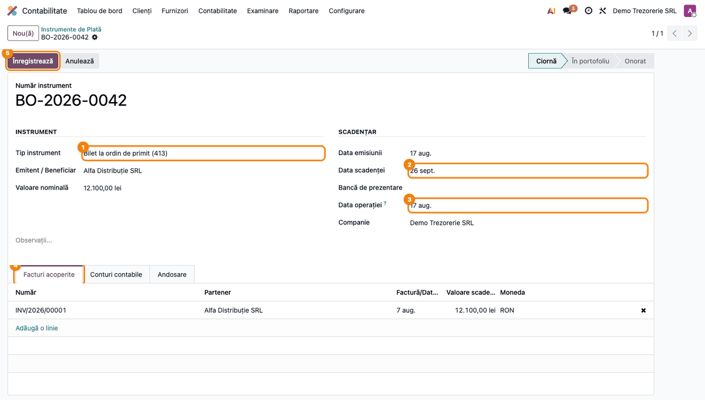

Instrumentul trece în starea **În portofoliu** și se generează nota de înregistrare
`413 Efecte de primit de la clienți = 4111 Clienți`, cu clientul pe ambele linii, la data primirii:

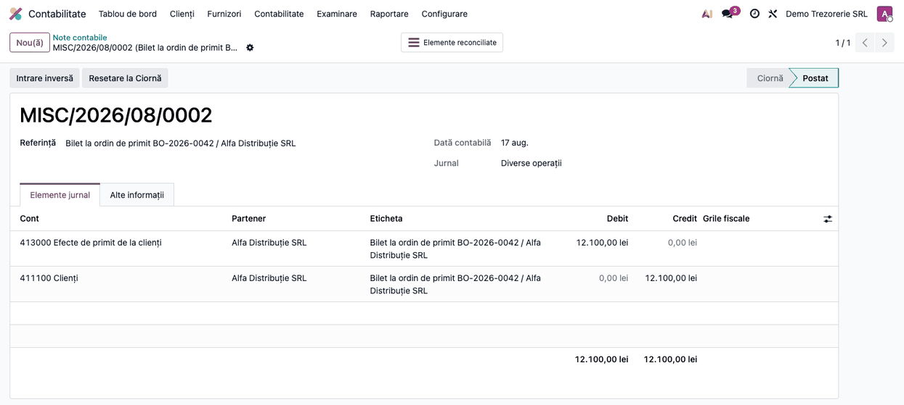

Linia de 4111 a notei stinge factura acoperită: factura apare **Plătit**, cu plata datată la
data primirii BO ①. Creanța nu a dispărut, a trecut din 4111 în 413.

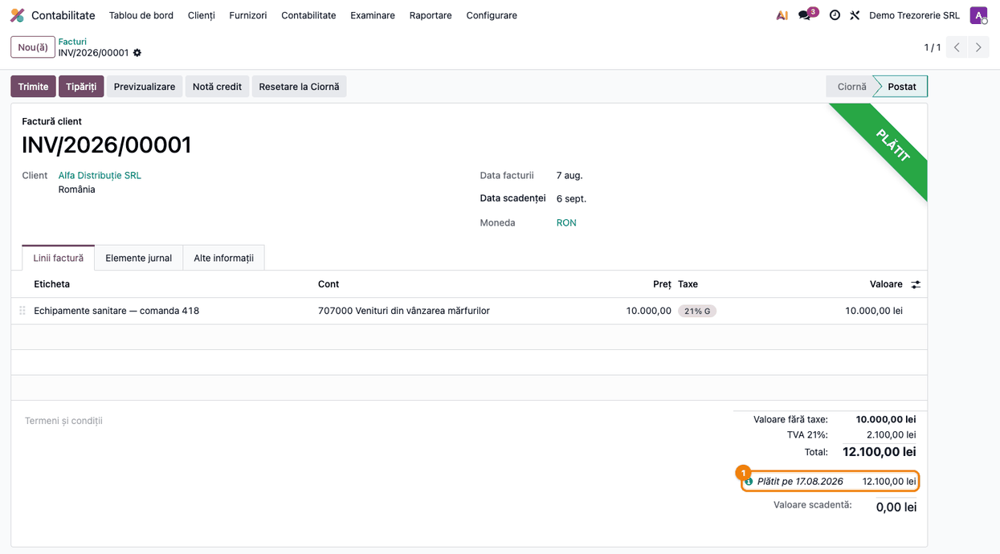

### Pasul 2 — Depunerea BO la bancă și încasarea lui

Când depuneți BO la bancă spre încasare, completați **Data operației** cu data borderoului de
depunere și apăsați **Remite la bancă**. Instrumentul trece în starea **Remis la bancă** și se
generează nota `5113 Efecte de încasat = 413`.

La extrasul de încasare, completați **Data operației** ① cu data extrasului și apăsați
**Marchează Onorat** ②. Smart button-ul **Note** deschide toate notele instrumentului.

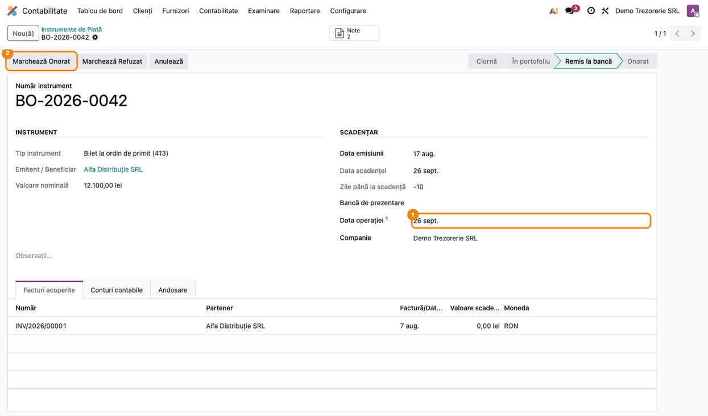

Nota de depunere `5113 = 413`:

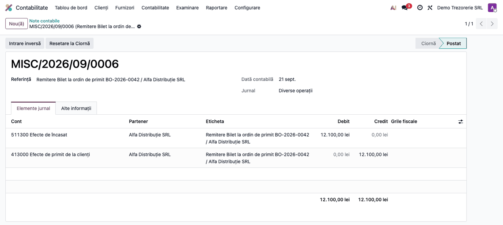

Nota de încasare `5121 Conturi la bănci în lei = 5113`, la data extrasului. Instrumentul trece în
starea **Onorat**.

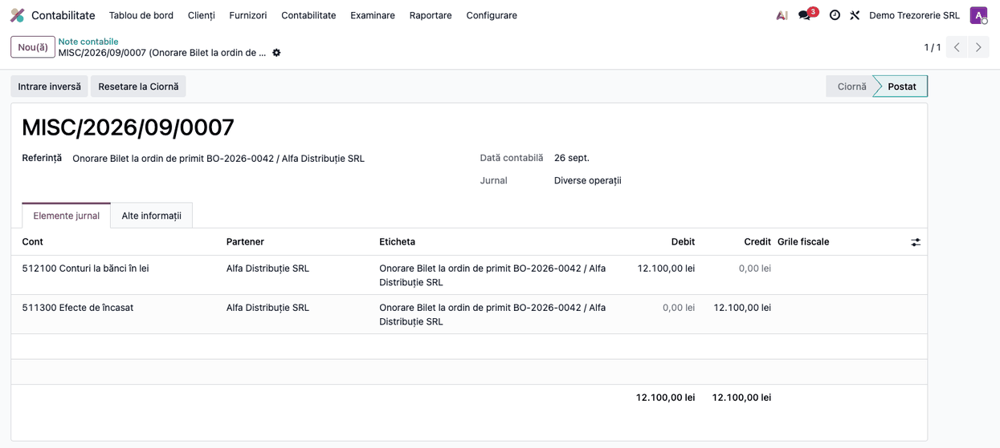

Dacă BO se încasează fără depunere prealabilă (direct din portofoliu), nota de încasare este
`5121 = 413`.

**Încasarea și extrasul bancar.** Nota de încasare se face în jurnalul Diverse. Dacă extrasele
bancare se importă și în Odoo, aceeași încasare ar apărea a doua oară pe 5121, din extras. Pentru
a evita dublarea, procedați ca la plățile Odoo:
1. pe instrument, în tab-ul **Conturi contabile**, la **Cont bancă (5121)** alegeți contul
   reconciliabil de încasări în curs al companiei (**„Încasări restante”**, creat de Odoo în grupa
   5121, marcat „Permite reconcilierea”), nu contul jurnalului bancar; pentru BO emise, contul de
   plăți în curs (**„Plăți nealocate”**);
2. **Marchează Onorat** face atunci `încasări în curs = 5113` (sau 5112 / 413);
3. la reconcilierea bancară, potriviți linia de extras cu linia de încasări în curs a notei
   instrumentului: extrasul închide contul de tranzit și duce suma pe 5121 o singură dată.

Potrivirea se face din ecranul de reconciliere bancară (aplicația Contabilitate). Dacă contul de
încasări / plăți în curs lipsește sau e arhivat, creați un cont reconciliabil de tranzit (de ex.
5125 „Sume în curs de decontare”) și folosiți-l la fel. Dacă extrasele nu se importă în Odoo,
lăsați contul implicit 5121.

### Pasul 3 — Cecul primit

Cecul se înregistrează la fel (pasul 1), cu tipul **Cec primit (5112)**; nota de înregistrare este
`5112 Cecuri de încasat = 4111`, iar factura acoperită se stinge. În portofoliu, cecul are
butoanele **Remite la bancă** ①, **Marchează Onorat** ② și **Marchează Refuzat** ③. Câmpul
**Zile până la scadență** arată câte zile mai sunt (în listă, coloana **Zile scad.**).

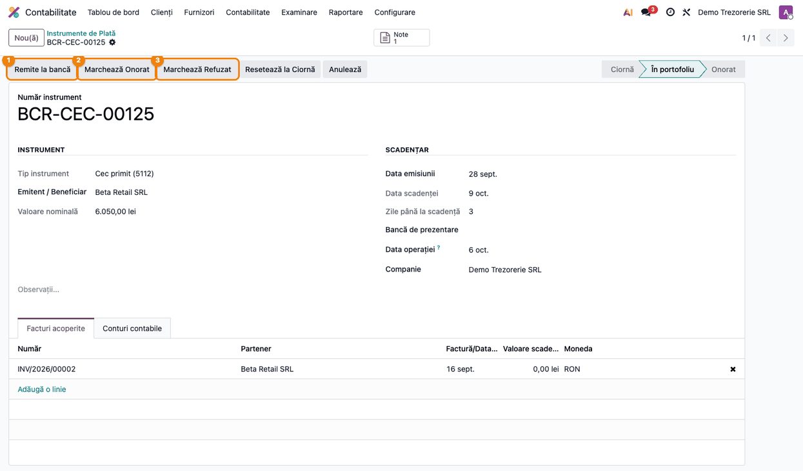

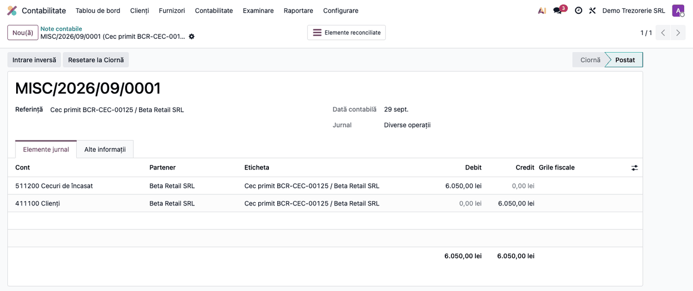

La cec, **Remite la bancă** doar schimbă starea în **Remis la bancă** și scrie un mesaj în
istoric: cecul rămâne pe 5112 până la încasare, deci nu se face notă. La încasare
(**Marchează Onorat**), nota este `5121 = 5112`.

### Pasul 4 — Refuzul unui instrument

Dacă banca returnează instrumentul neplătit, completați **Data operației** cu data refuzului și
apăsați **Marchează Refuzat**. Instrumentul trece în starea **Refuzat** și:
- se generează nota de refuz care reface creanța;
- facturile acoperite se **redeschid**, cu scadența lor inițială;
- pe instrument apare o **activitate de avertizare** „Instrument refuzat" (în dreapta), cu suma și partenerul,
  pentru inițierea protestului sau a recuperării;
- butonul **Protest** ① devine disponibil.

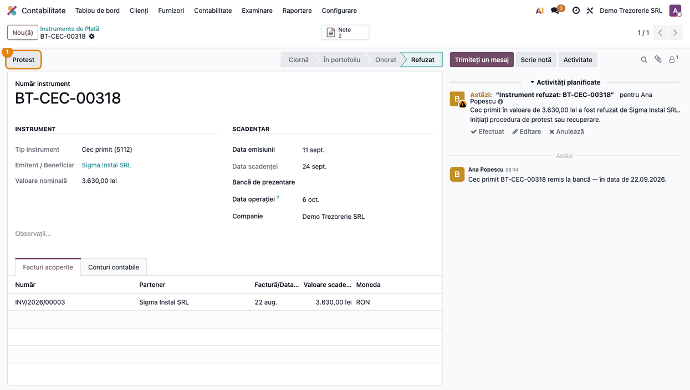

Nota de refuz pentru cecul din exemplu (depus la bancă, rămas pe 5112): `4111 = 5112`.

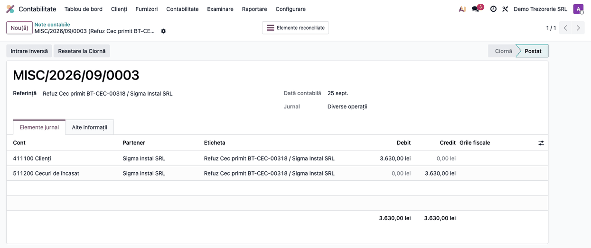

Factura acoperită de cecul refuzat redevine de încasat (valoare scadentă 3.630,00 lei) și apare
din nou în soldul și restanțele clientului:

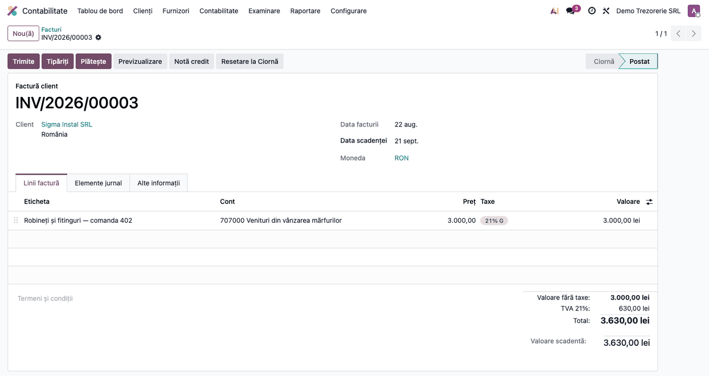

Apăsați **Protest** când inițiați procedura legală: starea devine **Protestat**, fără notă
contabilă (cheltuielile de protest se înregistrează separat, pe documentele lor). Dacă recuperarea
creanței devine incertă, reclasificarea clientului în 4118 „Clienți incerți sau în litigiu" se face
separat, printr-o notă manuală.

### Pasul 5 — Andosarea unui BO primit către un furnizor

Un BO sau o cambie primite, aflate **în portofoliu**, se pot ceda unui furnizor ca plată. Pe
instrument, în tab-ul **Andosare**, completați **Andosat către** (furnizorul), apoi **Data
operației** și apăsați **Andosează**. Starea devine **Andosat**, iar nota este
`401 Furnizori (furnizorul) = 413 (clientul emitent)`: datoria față de furnizor scade, iar efectul
iese din soldul 413 al clientului.

**Atenție:** andosarea **nu stinge automat factura furnizorului** (instrumentul nu are câmp pentru
ea). După andosare, deschideți factura furnizorului: sub totaluri, în caseta **Debit nealocat**,
apare linia 401 a notei de andosare; apăsați **Adaugă** ca să o reconciliați cu factura. Altfel factura rămâne „De plată" și poate fi plătită a doua oară.
Dacă linia nu apare în casetă, verificați că factura și nota de andosare folosesc același cont 401
(modulul ia primul cont 401 din plan).

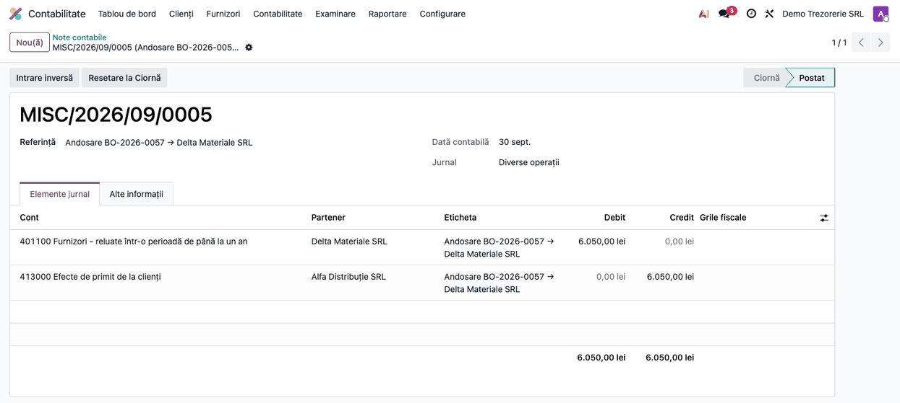

### Pasul 6 — Biletul la ordin emis către un furnizor

Pentru un BO emis, alegeți tipul **Bilet la ordin de plătit (403)**, furnizorul ca beneficiar și
factura de achiziție în **Facturi acoperite**, apoi **Înregistrează**. Nota este
`401 Furnizori = 403 Efecte de plătit`, iar factura furnizorului se stinge.

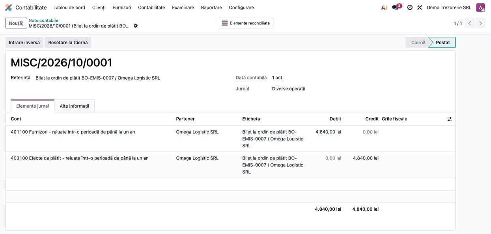

La scadență, după extrasul din care reiese plata, **Marchează Onorat** generează
`403 = 5121`. Dacă BO emis e refuzat la plată, nota de refuz reface datoria (`403 = 401`) și
redeschide factura furnizorului.

### Pasul 7 — Scadențarul

Accesați **Contabilitate → Contabilitate → Instrumente de Plată**. Pentru a vedea toate
instrumentele, ștergeți filtrul implicit **În portofoliu** din bara de căutare.

1. **Găsiți pe ecran**: numărul și tipul instrumentului, emitentul / beneficiarul, valoarea
   nominală, **Data scadenței**, coloana **Zile scad.** (doar pentru cele în portofoliu sau remise)
   și **Stare**. Culorile rândurilor:
   - **roșu** — scadență depășită sau instrument refuzat / protestat (ex. BO-2026-0049, cu -2 zile;
     BT-CEC-00318, refuzat);
   - **portocaliu** — scadență în următoarele 5 zile (ex. BCR-CEC-00125, peste 3 zile);
   - **verde** — onorat sau andosat;
   - **gri** — anulat.
2. **Verificați**: totalul instrumentelor primite **În portofoliu** + **Remis la bancă** corespunde
   soldurilor 413 + 5112 + 5113 din balanță; totalul BO emise în portofoliu corespunde soldului 403;
   nu există rânduri roșii în portofoliu fără o acțiune (depunere, încasare sau refuz) programată.
3. **Mai departe**: grupați după **Stare**, **Partener** sau **Scadență (lună)** din meniul
   de căutare, pentru planificarea încasărilor pe luni.

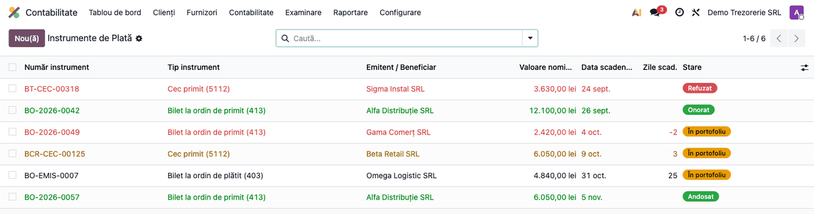

Alertele de scadență: un cron zilnic creează o activitate de avertizare pe fiecare instrument în
portofoliu sau remis care ajunge la scadență în următoarele N zile (parametrul din secțiunea 5,
implicit 5). Activitatea se atribuie celui care a creat instrumentul și se trimite și pe email.

### Pasul 8 — Note de monografie și raportare

| Operațiune | Notă contabilă | Partener pe linii |
|---|---|---|
| Înregistrare cec primit | 5112 = 4111 | clientul pe ambele |
| Înregistrare BO / cambie primite | 413 = 4111 | clientul pe ambele |
| Depunere BO / cambie la bancă | 5113 = 413 | clientul pe ambele |
| Depunere cec la bancă | fără notă | — |
| Încasare cec | 5121 = 5112 | clientul |
| Încasare BO / cambie depuse | 5121 = 5113 | clientul |
| Încasare BO / cambie fără depunere | 5121 = 413 | clientul |
| Refuz cec | 4111 = 5112 | clientul |
| Refuz BO / cambie depuse | 4111 = 5113 | clientul |
| Refuz BO / cambie nedepuse | 4111 = 413 | clientul |
| Andosare BO / cambie | 401 = 413 | furnizorul pe 401, clientul pe 413 |
| Înregistrare BO / cambie emise | 401 = 403 | furnizorul |
| Plată BO / cambie emise | 403 = 5121 | furnizorul |
| Refuz BO / cambie emise | 403 = 401 | furnizorul |

Cu extrase bancare importate, 5121 din tabel se înlocuiește cu contul de încasări / plăți în curs
(pasul 2); extrasul duce apoi suma pe 5121.

Toate notele sunt în jurnalul **Diverse**, datate cu **Data operației**, fără TVA (TVA-ul e deja
pe facturi). Instrumentul nu se poate anula cât are note postate nestornate; anularea cere întâi
stornarea notelor din formularul notei (**Intrare inversă**).

### Pasul 9 — Blocarea facturării partenerilor cu instrumente refuzate (FR-39)

Accesați **Setări → Contabilitate → Instrumente de plată (RO)** și bifați **Blochează partenerii
cu instrumente refuzate** ①, apoi **Salvează**.

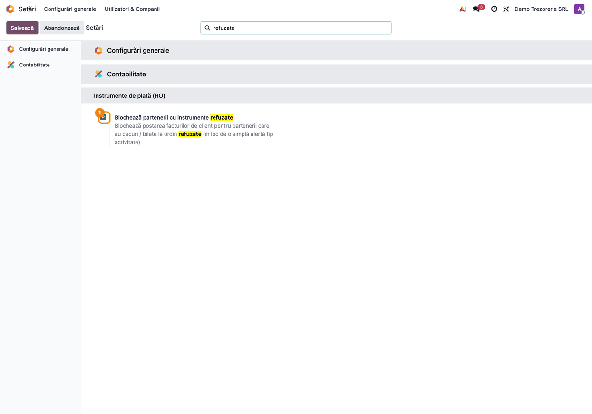

Cu opțiunea activă, confirmarea unei **facturi de client** către un partener care are un
instrument în stare **Refuzat** este oprită cu mesajul „Partenerul … are N instrument(e) de plată
refuzat(e)". Blocajul se aplică doar facturilor de client, nu notelor de credit sau facturilor de
furnizor. Cu opțiunea dezactivată, refuzul rămâne doar o activitate pe instrument.

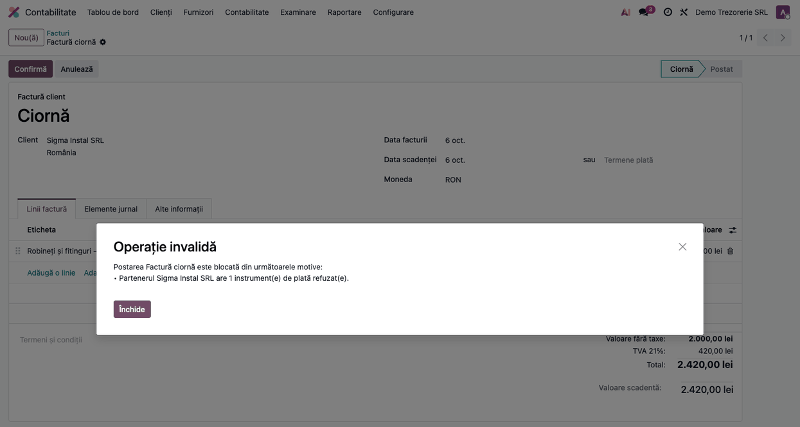

Blocajul ține cont **doar de starea Refuzat**: încetează când instrumentul trece în **Protestat**
sau când opțiunea se dezactivează. Dacă vreți ca partenerul să rămână blocat și după protest, nu
marcați protestul până la soluționare sau urmăriți-l separat.

## 7. Legături cu alte module / declarații

| Modul / proces | Rol în flux |
|---|---|
| `account` | facturile acoperite, notele contabile, reconcilierea liniilor 4111 / 401 |
| `l10n_ro` | planul de conturi RO (5112, 5113, 413, 403) |
| `l10n_ro_anaf_base` | mecanismul de blocare la confirmarea facturii (blocajul FR-39) |
| Extrasul bancar | încasarea / plata efectivă pe 5121; cu extrase importate, nota modulului se face pe contul de încasări / plăți în curs și se potrivește la reconcilierea bancară (pasul 2) |
| Fișa partenerului / scadențarul clienților | arată facturile stinse la înregistrare și redeschise la refuz |

Ce este automat: notele contabile la fiecare pas, datarea lor cu data operației, stingerea și
redeschiderea facturilor acoperite, activitatea la refuz, alertele de scadență, blocajul opțional.

Ce rămâne manual: completarea datei operației la fiecare pas, marcarea încasării sau a refuzului
după extras, activarea acțiunii programate de alertă, reconcilierea facturii furnizorului după
andosare, reconcilierea liniei de extras cu nota de încasare, procedura de protest și cheltuielile
ei, comisioanele bancare de încasare a efectelor (`627 = 5121`, din extras), reclasificarea în 4118.
Scontarea efectelor (5114, 667) nu este acoperită de modul.

## 8. Verificări pentru consultant

- [ ] Meniul **Contabilitate → Contabilitate → Instrumente de Plată** e vizibil pentru contabil.
- [ ] BO primit înregistrat: nota `413 = 4111` are data primirii și clientul pe ambele linii;
      factura acoperită apare **Plătit**.
- [ ] BO depus la bancă: nota `5113 = 413`; la încasare `5121 = 5113`, la data extrasului.
- [ ] Cec primit: nota `5112 = 4111` (nu 5113); depunerea la bancă nu face notă; încasarea
      `5121 = 5112`.
- [ ] Refuz: nota reface creanța de pe contul corect (5112 / 5113 / 413); factura acoperită are din
      nou valoare scadentă; există activitatea „Instrument refuzat".
- [ ] Andosare: `401` cu furnizorul, `413` cu clientul; soldul 413 al clientului se închide; după
      reconcilierea manuală, factura furnizorului apare **Plătit**.
- [ ] Acțiunea programată „Instrumente de plată RO: alertă scadență" este activă; un instrument
      scadent în următoarele 5 zile primește activitatea de alertă după rularea ei.
- [ ] Cu extrase importate: linia de extras se potrivește cu nota de încasare a instrumentului, iar
      5121 nu are încasarea de două ori.
- [ ] BO emis: `401 = 403`, factura furnizorului se stinge; la plată `403 = 5121`.
- [ ] Scadențarul: rândurile depășite sunt roșii, cele scadente în 5 zile portocalii; totalul în
      portofoliu corespunde soldurilor 413 + 5112 + 5113 și 403 din balanță.
- [ ] Cu blocajul activ, factura de client către partenerul cu instrument refuzat nu se poate
      confirma; fără blocaj, se confirmă.

## 9. Mesaje de eroare frecvente

| Mesaj / simptom | Cauză probabilă | Remediere |
|-----------------|-----------------|-----------|
| „Completați conturile contabile sau asigurați-vă că planul de conturi RO este instalat." | Cont lipsă în plan sau **Cec emis** (fără conturi implicite) | Completați conturile în tab-ul **Conturi contabile** |
| „Nu a fost găsit un jurnal general pentru companie." | Compania nu are jurnal de tip Diverse | Creați un jurnal de tip **Diverse** |
| „Instrumentul are note contabile postate: stornați-le înainte de a-l anula." | Anulare pe un instrument înregistrat | Stornați notele (**Intrare inversă**), apoi anulați |
| „Instrumentul are nota de înregistrare postată; nu poate fi resetat la ciornă." | Revenirea la ciornă e posibilă doar fără notă de înregistrare (butonul **Resetează la Ciornă** nu mai apare după înregistrare) | Stornați notele (**Intrare inversă**), apoi **Anulează**, și creați un instrument nou |
| „Completați câmpul 'Andosat către' înainte de andosare." | Andosare fără furnizor ales | Completați **Andosat către** în tab-ul **Andosare** |
| „Partenerul X are N instrument(e) de plată refuzat(e)." la confirmarea facturii | Blocajul FR-39 e activ și partenerul are un instrument **Refuzat** | Rezolvați instrumentul refuzat sau dezactivați temporar opțiunea |
| Nota are data de azi în loc de data extrasului | **Data operației** nu a fost completată înaintea pasului | Stornați nota și refaceți pasul cu data corectă |
| Nu apare nicio alertă de scadență | Acțiunea programată de alertă e inactivă (așa se instalează) | Activați-o (secțiunea 5, pasul 4) |
| Factura acoperită nu se stinge la înregistrare | Factura nu e postată, e pe alt partener sau alt cont decât 4111 / 401 | Verificați factura și partenerul instrumentului |

## 10. Capturi de ecran

Capturile sunt **generate automat** de `tests/test_screenshots.py` (mixinul `ScreenshotCase` din
`l10n_ro_doc_screenshots`, import defensiv), în română, pe planul de conturi RO, compania „Demo
Trezorerie SRL" în RON, cu date relative la ziua rulării. Regenerare:

```bash
./odoo/odoo-bin -c odoo.conf -d <db> -i l10n_ro_payment_instruments,l10n_ro_doc_screenshots \
    --test-tags=fise_screenshots --stop-after-init
```

| # | Fișier | Conținut |
|---|--------|----------|
| 1 | `static/description/01_bo_primit_ciorna.png` | BO primit în ciornă: tip, scadență, data operației, factura acoperită, **Înregistrează** |
| 2 | `static/description/02_nota_inregistrare_bo.png` | Nota de înregistrare a BO: 413 = 4111 |
| 3 | `static/description/03_factura_acoperita_platita.png` | Factura acoperită de BO, stinsă la înregistrare |
| 4 | `static/description/04_bo_remis_banca.png` | BO remis la bancă: data operației și **Marchează Onorat** |
| 5 | `static/description/05_nota_remitere_bo.png` | Nota de depunere la bancă: 5113 = 413 |
| 6 | `static/description/06_nota_onorare_bo.png` | Nota de încasare a BO: 5121 = 5113 |
| 7 | `static/description/07_cec_primit_portofoliu.png` | Cec primit în portofoliu, cu acțiunile disponibile |
| 8 | `static/description/08_nota_cec_primit.png` | Nota de înregistrare a cecului: 5112 = 4111 |
| 9 | `static/description/09_cec_refuzat.png` | Cec refuzat, cu activitatea de avertizare și butonul **Protest** |
| 10 | `static/description/10_nota_refuz_cec.png` | Nota de refuz a cecului: 4111 = 5112 |
| 11 | `static/description/11_factura_redeschisa.png` | Factura acoperită de cecul refuzat, redeschisă |
| 12 | `static/description/12_nota_andosare_bo.png` | Nota de andosare: 401 (furnizor) = 413 (client) |
| 13 | `static/description/13_nota_bo_emis.png` | Nota BO emis: 401 = 403 |
| 14 | `static/description/14_lista_instrumente.png` | Scadențarul, cu toate stările și culorile |
| 15 | `static/description/15_setare_blocaj_refuzat.png` | Setarea blocajului pentru partenerii cu instrumente refuzate |
| 16 | `static/description/16_blocaj_factura_partener_refuzat.png` | Mesajul de blocaj la confirmarea facturii |

## 11. Observații pentru manual

- Insistați pe **Data operației**: este singurul loc din care nota își ia data; un pas făcut cu
  întârziere, fără data corectă, mută nota în altă lună.
- Explicați diferența dintre cec (5112, fără notă la depunere) și BO / cambie (413 → 5113 la
  depunere) — este sursa celor mai multe confuzii în balanță.
- Pentru fiecare instrument primit, factura apare „plătită" de la înregistrare: utilizatorul trebuie
  să știe că încasarea reală se urmărește în scadențarul instrumentelor, nu pe factură.
- Încasarea din extras: **Marchează Onorat** înregistrează deja mișcarea pe 5121. Dacă extrasele
  bancare se importă și în Odoo, folosiți procedura de la pasul 2 (cont de încasări în curs,
  potrivit la reconcilierea bancară), ca mișcarea să nu se dubleze.
